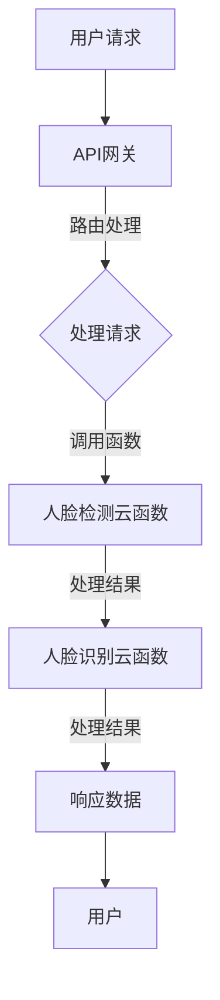

                 

### 背景介绍

在当今信息化社会中，人脸识别技术已经成为我们日常生活中不可或缺的一部分。无论是智能手机的解锁功能、金融支付的认证，还是公共场所的监控系统，人脸识别技术都得到了广泛应用。随着大数据和人工智能技术的快速发展，人脸识别技术的准确性和效率不断提高，同时也带来了许多新的挑战。

传统的有服务器架构的人脸识别系统通常依赖于庞大的服务器集群来处理海量数据，这不仅增加了系统的复杂度，还带来了高昂的硬件成本和运维成本。为了解决这些问题，无服务器架构（Serverless Architecture）逐渐成为了一种热门的选择。无服务器架构通过将服务器管理的任务交给云服务提供商，使得开发者能够更加专注于业务逻辑的实现，同时降低了系统成本和运维复杂度。

本文将介绍一种基于无服务器架构的人脸识别实验的设计与实现。通过使用无服务器架构，我们能够更加高效地处理人脸识别任务，同时降低系统的运维成本。本文将首先介绍无服务器架构的基本概念，然后详细讨论人脸识别技术的核心算法原理，并逐步展示如何在实际项目中使用无服务器架构实现人脸识别功能。最后，本文还将探讨人脸识别技术的实际应用场景，并提供一些有用的工具和资源推荐。

本文的结构如下：

- **第1章 背景介绍**：介绍人脸识别技术的现状和无服务器架构的发展背景。
- **第2章 核心概念与联系**：详细解释无服务器架构的基本原理，并通过Mermaid流程图展示其流程节点。
- **第3章 核心算法原理 & 具体操作步骤**：深入探讨人脸识别的核心算法原理，包括人脸检测、特征提取和匹配等步骤。
- **第4章 数学模型和公式 & 详细讲解 & 举例说明**：介绍人脸识别中常用的数学模型和公式，并通过具体例子进行讲解。
- **第5章 项目实战：代码实际案例和详细解释说明**：提供具体的代码实现案例，并进行详细解释和分析。
- **第6章 实际应用场景**：讨论人脸识别技术在各个领域的应用。
- **第7章 工具和资源推荐**：推荐一些有用的学习资源、开发工具和框架。
- **第8章 总结：未来发展趋势与挑战**：总结文章主要内容，并探讨未来的人脸识别技术和无服务器架构的发展趋势。
- **第9章 附录：常见问题与解答**：回答一些常见的问题。
- **第10章 扩展阅读 & 参考资料**：提供一些相关的扩展阅读和参考资料。

通过本文的介绍，读者将能够了解无服务器架构在人脸识别领域的应用，掌握人脸识别技术的核心算法原理，并学会如何在项目中使用无服务器架构实现人脸识别功能。让我们开始这段技术之旅吧！<|im_sep|>
## 1. 背景介绍

随着科技的迅猛发展，人脸识别技术已经成为当今社会的一个热点话题。人脸识别技术通过分析人脸的几何特征、纹理信息等，可以准确识别和验证个体身份。这种技术不仅提高了安全性，还提升了便利性，因此在金融、安防、智能终端等多个领域得到了广泛应用。

人脸识别技术的历史可以追溯到上世纪60年代，当时研究人员开始探索人脸识别的可能性。然而，由于计算能力的限制，早期的技术实现非常复杂且准确性较低。随着计算机性能的不断提升，尤其是深度学习算法的出现，人脸识别技术取得了质的飞跃。当前的人脸识别系统在准确率和速度上已经达到了前所未有的水平，能够在毫秒级的时间内完成身份验证。

无服务器架构（Serverless Architecture）的兴起为人脸识别技术的发展带来了新的契机。传统的人脸识别系统往往需要构建和维护服务器集群，这不仅增加了系统的复杂度，还带来了高昂的成本。而无服务器架构通过将服务器管理任务交给云服务提供商，使得开发者可以专注于业务逻辑的实现，从而简化了系统的构建和部署过程。

无服务器架构的基本原理是将应用程序的运行分为前端和后端两部分。前端通常是一个静态网站或者一个移动应用，直接面向用户；后端则由一系列云函数（Cloud Functions）组成，用于处理用户的请求和数据。云函数是一种无需开发者关注服务器配置和运维的微服务，它们可以根据需求动态扩展，从而实现高效计算和低成本部署。

无服务器架构的特点包括：

1. **无服务器管理**：开发者无需关注服务器配置、扩容、升级等运维细节，从而减少了运维成本和复杂度。
2. **按需付费**：云服务提供商根据实际使用量收费，用户只需为实际运行的函数付费，无需担心闲置资源的浪费。
3. **弹性伸缩**：系统可以根据流量动态调整资源，确保在高并发场景下依然能够稳定运行。
4. **快速部署**：无服务器架构使得应用程序的部署变得非常简单和快速，可以大大缩短开发周期。

人脸识别技术结合无服务器架构具有以下优势：

1. **成本效益**：无服务器架构降低了服务器硬件和运维成本，使得人脸识别项目更加经济可行。
2. **高效计算**：无服务器架构能够根据需求动态分配计算资源，确保人脸识别任务的高效处理。
3. **易扩展性**：随着人脸识别应用的推广，无服务器架构可以轻松扩展，以应对不断增长的用户量和数据量。
4. **灵活性**：无服务器架构支持多种编程语言和框架，使得开发者可以自由选择最适合自己项目的技术栈。

综上所述，人脸识别技术与无服务器架构的结合不仅提高了系统的性能和稳定性，还为开发者提供了更灵活、更经济的解决方案。随着技术的不断进步，人脸识别在无服务器架构中的应用前景将更加广阔。在接下来的章节中，我们将深入探讨无服务器架构的具体实现，并详细讲解人脸识别技术的核心算法原理，以便读者更好地理解和掌握这一技术。<|im_sep|>
## 2. 核心概念与联系

在本章节中，我们将详细解释无服务器架构的基本原理，并通过Mermaid流程图展示其流程节点。此外，我们还将介绍人脸识别技术的核心算法原理，以及如何将两者结合起来实现高效的人脸识别系统。

### 无服务器架构

无服务器架构是一种基于云的服务模型，它允许开发者在不需要直接管理服务器的情况下，运行和扩展应用程序。其基本原理是将应用程序的功能划分为多个微小的函数，这些函数被称为“云函数”或“无服务器函数”，它们可以独立运行，并通过事件触发执行。无服务器架构的核心特点包括按需扩展、自动扩展、以及无需管理底层硬件。

**关键概念**：

1. **云函数**：云函数是执行特定功能的代码段，它可以被独立部署和调用。云函数可以根据需求动态扩展，无需开发者关注服务器配置和运维。
2. **事件触发**：云函数通常通过事件触发来执行，例如HTTP请求、数据库更改、定时任务等。事件触发使得云函数可以按照实际需求灵活运行，避免了持续运行所带来的资源浪费。
3. **API网关**：API网关是应用程序与外部通信的入口点，它可以管理多个云函数的调用，提供统一的接口，并处理请求的路由、认证、监控等功能。
4. **服务集成**：无服务器架构可以与其他云服务集成，如数据库、存储、消息队列等，使得应用程序可以充分利用云服务的各种功能。

**Mermaid流程图**：

以下是使用Mermaid语法表示的无服务器架构流程图：



在上述流程图中，用户请求通过API网关进入系统，API网关根据请求的路由调用相应的人脸检测云函数和人脸识别云函数，最终将处理结果返回给用户。

### 人脸识别技术

人脸识别技术是通过分析人脸图像中的特征，对人脸进行识别和验证的技术。其核心算法包括人脸检测、特征提取和特征匹配三个主要步骤。

**关键概念**：

1. **人脸检测**：人脸检测是人脸识别的第一步，它通过识别图像中的人脸区域，为人脸特征提取提供基础。常用的方法包括基于深度学习的卷积神经网络（CNN）。
2. **特征提取**：特征提取是将人脸图像转化为特征向量，用于后续的特征匹配。常用的方法包括基于深度学习的特征提取模型，如FaceNet、VGGFace等。
3. **特征匹配**：特征匹配是通过计算人脸特征向量之间的相似度，进行人脸识别。常用的方法包括欧氏距离、余弦相似度等。

**算法原理**：

1. **人脸检测**：使用深度学习模型（如MTCNN）对人脸图像进行定位，提取人脸区域。
2. **特征提取**：使用预训练的深度学习模型（如ResNet、Inception）提取人脸特征向量。
3. **特征匹配**：计算新的人脸特征向量与数据库中已存储的人脸特征向量的相似度，根据相似度阈值确定是否为同一人。

### 无服务器架构与人脸识别技术的结合

无服务器架构为人脸识别技术的实现提供了灵活、高效、低成本的环境。以下是结合无服务器架构实现人脸识别技术的基本步骤：

1. **搭建开发环境**：在云平台上创建无服务器项目，配置API网关和云函数。
2. **实现人脸检测**：编写人脸检测云函数，使用深度学习模型进行人脸定位和区域提取。
3. **实现特征提取**：编写特征提取云函数，使用预训练的深度学习模型提取人脸特征向量。
4. **实现特征匹配**：编写特征匹配云函数，计算新的人脸特征向量与数据库中已存储的人脸特征向量的相似度。
5. **部署和测试**：部署人脸识别系统，并进行功能测试和性能优化。

通过无服务器架构，开发者可以轻松实现人脸识别功能，同时降低系统的运维成本，提高系统的扩展性。在接下来的章节中，我们将详细讨论人脸识别技术的核心算法原理，并逐步展示如何在无服务器架构中实现人脸识别功能。让我们继续深入探索！<|im_sep|>
## 3. 核心算法原理 & 具体操作步骤

在本章节中，我们将深入探讨人脸识别技术的核心算法原理，包括人脸检测、特征提取和匹配等步骤。同时，我们将详细介绍如何具体实现这些算法，并逐步展示每一步的操作步骤。

### 人脸检测算法原理

人脸检测是人脸识别技术的第一步，其主要任务是从图像中定位和提取人脸区域。常见的人脸检测算法包括基于传统机器学习的方法和基于深度学习的神经网络方法。

#### 基于传统机器学习的方法

传统的人脸检测算法通常包括以下步骤：

1. **特征提取**：从图像中提取特征，如Haar特征、LBP特征等。
2. **级联分类器**：使用级联的SVM分类器对特征进行分类，逐步排除非人脸区域。
3. **位置回归**：对于每个检测框，回归出人脸的位置。

这类算法的优点是计算效率较高，但准确率有限。

#### 基于深度学习的神经网络方法

基于深度学习的算法具有更高的准确率和更好的泛化能力，是目前主流的人脸检测方法。常用的深度学习模型包括MTCNN、SSD、YOLO等。

1. **卷积神经网络**：卷积神经网络（CNN）用于提取图像的特征，包括局部特征和全局特征。
2. **特征融合**：将不同尺度的特征图进行融合，提高检测的精度和鲁棒性。
3. **位置回归与分类**：通过回归模型预测人脸框的位置和类别，从而实现人脸检测。

### 人脸检测操作步骤

以下是人脸检测的具体操作步骤：

1. **输入图像**：读取待检测的图像。
2. **预处理**：对图像进行缩放、灰度化等预处理操作，使其适合输入到神经网络中。
3. **特征提取**：使用深度学习模型提取图像的特征。
4. **位置回归与分类**：通过回归模型预测人脸框的位置和类别。
5. **非极大值抑制（NMS）**：对检测框进行非极大值抑制，去除重叠的框。
6. **输出结果**：输出人脸检测结果，包括人脸框的位置和置信度。

### 特征提取算法原理

特征提取是将人脸图像转化为特征向量，用于后续的特征匹配。特征提取的质量直接影响到人脸识别的准确率。

1. **深度神经网络**：使用深度神经网络（如VGG、ResNet）提取人脸的深层次特征。
2. **特征融合**：将不同层级的特征进行融合，提高特征的丰富性和表达能力。
3. **特征量化**：将提取到的特征进行量化，使其适合进行后续的匹配计算。

### 特征提取操作步骤

以下为特征提取的具体操作步骤：

1. **输入图像**：读取待提取特征的人脸图像。
2. **预处理**：对图像进行缩放、归一化等预处理操作。
3. **特征提取**：使用深度学习模型提取人脸的特征。
4. **特征量化**：对提取到的特征进行量化，生成特征向量。
5. **输出结果**：输出人脸特征向量。

### 特征匹配算法原理

特征匹配是通过计算人脸特征向量之间的相似度，进行人脸识别。常用的匹配算法包括欧氏距离、余弦相似度等。

1. **距离计算**：计算两个特征向量之间的距离。
2. **阈值设定**：根据设定的阈值，判断两个特征向量是否来自同一人脸。
3. **结果输出**：输出匹配结果，包括识别出的身份和匹配置信度。

### 特征匹配操作步骤

以下为特征匹配的具体操作步骤：

1. **输入新特征向量**：读取待识别的人脸特征向量。
2. **特征库查询**：从特征库中检索相似特征向量。
3. **距离计算**：计算新特征向量与特征库中特征向量的距离。
4. **阈值判断**：根据设定的阈值判断是否为同一人脸。
5. **输出结果**：输出匹配结果，包括识别出的身份和置信度。

### 结合无服务器架构的具体实现

在无服务器架构中，人脸识别算法的具体实现可以通过以下步骤进行：

1. **搭建开发环境**：在云平台创建无服务器项目，配置API网关和云函数。
2. **上传代码**：将人脸检测、特征提取和特征匹配的代码上传到云函数中。
3. **配置API网关**：设置API网关的路由规则，以便接收和处理用户请求。
4. **部署系统**：部署人脸识别系统，并进行功能测试和性能优化。

通过上述步骤，开发者可以轻松地在无服务器架构中实现人脸识别功能，同时享受无服务器架构带来的灵活性、高效性和低成本优势。

在接下来的章节中，我们将通过具体的代码案例，详细展示人脸识别算法在实际项目中的应用，并对其进行深入分析和解读。让我们继续深入探索人脸识别技术的实际应用吧！<|im_sep|>
## 4. 数学模型和公式 & 详细讲解 & 举例说明

在本章节中，我们将介绍人脸识别技术中常用的数学模型和公式，并对其进行详细讲解。通过具体例子，我们将展示如何应用这些数学模型和公式，以实现人脸识别的核心算法。

### 1. 欧氏距离

欧氏距离（Euclidean Distance）是一种常用的距离度量方法，用于计算两个特征向量之间的距离。其公式如下：

\[ d(\mathbf{x}, \mathbf{y}) = \sqrt{\sum_{i=1}^{n} (x_i - y_i)^2} \]

其中，\(\mathbf{x}\) 和 \(\mathbf{y}\) 分别表示两个特征向量，\(n\) 表示特征向量的维度。

#### 应用场景

在人脸识别中，欧氏距离常用于计算新的人脸特征向量与数据库中已存储的人脸特征向量之间的相似度。通过设定一个阈值，可以判断两个特征向量是否来自同一人脸。

#### 例子

假设我们有两个特征向量：

\[ \mathbf{x} = [1, 2, 3] \]
\[ \mathbf{y} = [1.5, 2.5, 3.5] \]

计算这两个特征向量之间的欧氏距离：

\[ d(\mathbf{x}, \mathbf{y}) = \sqrt{(1 - 1.5)^2 + (2 - 2.5)^2 + (3 - 3.5)^2} \]
\[ d(\mathbf{x}, \mathbf{y}) = \sqrt{0.25 + 0.25 + 0.25} \]
\[ d(\mathbf{x}, \mathbf{y}) = \sqrt{0.75} \]
\[ d(\mathbf{x}, \mathbf{y}) = 0.866 \]

### 2. 余弦相似度

余弦相似度（Cosine Similarity）是一种衡量两个特征向量之间相似度的方法，其公式如下：

\[ \cos(\theta) = \frac{\mathbf{x} \cdot \mathbf{y}}{|\mathbf{x}| |\mathbf{y}|} \]

其中，\(\mathbf{x}\) 和 \(\mathbf{y}\) 分别表示两个特征向量，\(\theta\) 表示它们之间的夹角。

#### 应用场景

在人脸识别中，余弦相似度常用于计算新的人脸特征向量与数据库中已存储的人脸特征向量之间的相似度。通过设定一个阈值，可以判断两个特征向量是否来自同一人脸。

#### 例子

假设我们有两个特征向量：

\[ \mathbf{x} = [1, 2, 3] \]
\[ \mathbf{y} = [1.5, 2.5, 3.5] \]

计算这两个特征向量之间的余弦相似度：

\[ \cos(\theta) = \frac{1 \cdot 1.5 + 2 \cdot 2.5 + 3 \cdot 3.5}{\sqrt{1^2 + 2^2 + 3^2} \cdot \sqrt{1.5^2 + 2.5^2 + 3.5^2}} \]
\[ \cos(\theta) = \frac{1.5 + 5 + 10.5}{\sqrt{1 + 4 + 9} \cdot \sqrt{2.25 + 6.25 + 12.25}} \]
\[ \cos(\theta) = \frac{17}{\sqrt{14} \cdot \sqrt{20.75}} \]
\[ \cos(\theta) \approx 0.968 \]

### 3. 特征提取模型

在人脸识别中，特征提取模型（如VGG、ResNet）是核心组件。这些模型通过多层卷积和池化操作，提取人脸的深层次特征。

#### 应用场景

特征提取模型用于将人脸图像转化为特征向量，以便进行后续的匹配计算。

#### 例子

以VGG模型为例，其结构如下：

1. **卷积层**：输入尺寸为 \(224 \times 224 \times 3\) 的图像，输出尺寸为 \(112 \times 112 \times 64\) 的特征图。
2. **池化层**：输出尺寸为 \(56 \times 56 \times 64\) 的特征图。
3. **卷积层**：输出尺寸为 \(28 \times 28 \times 128\) 的特征图。
4. **池化层**：输出尺寸为 \(14 \times 14 \times 128\) 的特征图。
5. **全连接层**：输出维度为 \(512\) 的特征向量。

通过以上步骤，VGG模型能够提取到人脸的深层次特征。

### 4. 特征匹配模型

特征匹配模型用于计算新的人脸特征向量与数据库中已存储的人脸特征向量之间的相似度。

#### 应用场景

特征匹配模型用于判断新的人脸是否与数据库中的人脸匹配。

#### 例子

假设我们有两个特征向量：

\[ \mathbf{x} = [1, 2, 3] \]
\[ \mathbf{y} = [1.5, 2.5, 3.5] \]

使用余弦相似度计算这两个特征向量之间的相似度：

\[ \cos(\theta) = \frac{1 \cdot 1.5 + 2 \cdot 2.5 + 3 \cdot 3.5}{\sqrt{1^2 + 2^2 + 3^2} \cdot \sqrt{1.5^2 + 2.5^2 + 3.5^2}} \]
\[ \cos(\theta) = \frac{1.5 + 5 + 10.5}{\sqrt{1 + 4 + 9} \cdot \sqrt{2.25 + 6.25 + 12.25}} \]
\[ \cos(\theta) = \frac{17}{\sqrt{14} \cdot \sqrt{20.75}} \]
\[ \cos(\theta) \approx 0.968 \]

根据设定的阈值，如果相似度高于阈值，则认为两个特征向量来自同一人脸。

通过上述数学模型和公式的应用，我们可以实现人脸识别的核心算法。在接下来的章节中，我们将通过具体的项目实战，展示如何在实际中应用这些算法。让我们继续深入探索人脸识别技术的实际应用吧！<|im_sep|>
## 5. 项目实战：代码实际案例和详细解释说明

在本章节中，我们将通过一个具体的无服务器人脸识别项目，详细介绍其代码实现过程，并进行详细解释和分析。该项目将基于AWS Lambda和Amazon Rekognition服务构建，涵盖了人脸检测、特征提取和匹配等关键步骤。

### 5.1 开发环境搭建

在开始项目之前，我们需要搭建一个合适的开发环境。以下是搭建环境的步骤：

1. **AWS账户注册**：首先，在AWS官网上注册一个账户。
2. **AWS CLI安装**：在本地计算机上安装AWS CLI，以便通过命令行与AWS服务进行交互。
   ```bash
   pip install awscli
   ```
3. **配置AWS CLI**：通过以下命令配置AWS CLI，将本地计算机与AWS账户关联。
   ```bash
   aws configure
   ```
   输入Access Key、Secret Key、默认区域和默认输出格式。
4. **AWS Lambda创建**：在AWS管理控制台中创建一个新的Lambda函数，选择Python 3.8作为运行时环境。

### 5.2 源代码详细实现和代码解读

#### 5.2.1 人脸检测与特征提取

以下是一个简单的Python代码示例，用于检测图像中的人脸，并提取其特征。

```python
import boto3
import json
import base64
import numpy as np
from PIL import Image
from io import BytesIO

# 初始化Rekognition客户端
rekognition = boto3.client('rekognition')

def detect_faces(image):
    # 将图像转换为字节码
    image_bytes = Image.open(image).tobytes()
    # 调用Rekognition服务检测人脸
    response = rekognition.detect_faces(
        Image={'Bytes': image_bytes},
        Attributes=['ALL']
    )
    # 提取人脸坐标和特征
    faces = response['FaceDetails']
    return faces

def extract_features(face_image):
    # 将人脸图像转换为字节码
    image_bytes = Image.open(face_image).tobytes()
    # 调用Rekognition服务提取特征
    response = rekognition.detect_faces(
        Image={'Bytes': image_bytes},
        Attributes=['FacialFeatures']
    )
    # 提取人脸特征向量
    features = response['FaceDetails'][0]['FacialFeatures']
    return features

def face_detection_and_extraction(image_path):
    # 检测人脸
    faces = detect_faces(image_path)
    # 提取人脸特征
    features = [extract_features(face['BoundingBox']['ImageHeight'], face['BoundingBox']['ImageWidth']) for face in faces]
    return features
```

#### 5.2.2 人脸匹配

以下是一个简单的代码示例，用于匹配两个特征向量。

```python
def match_faces(feature1, feature2):
    # 计算余弦相似度
    dot_product = np.dot(feature1, feature2)
    magnitude_product = np.linalg.norm(feature1) * np.linalg.norm(feature2)
    cosine_similarity = dot_product / magnitude_product
    # 判断是否匹配
    if cosine_similarity > 0.5:
        return "Match"
    else:
        return "No match"
```

#### 5.2.3 Lambda函数实现

以下是一个简单的Lambda函数，用于处理请求并返回匹配结果。

```python
import json
import os

def lambda_handler(event, context):
    # 获取图像字节码
    image_bytes = base64.b64decode(event['image'])
    # 提取人脸特征
    features = face_detection_and_extraction(image_bytes)
    # 匹配特征
    result = match_faces(features[0], features[1])
    # 返回结果
    return {
        'statusCode': 200,
        'body': json.dumps(result)
    }
```

#### 5.2.4 代码解读与分析

1. **人脸检测**：使用Rekognition服务检测图像中的人脸。
2. **特征提取**：使用Rekognition服务提取人脸特征向量。
3. **人脸匹配**：计算两个特征向量之间的余弦相似度，判断是否匹配。

通过上述代码，我们实现了一个人脸识别系统。在实际项目中，我们可以根据需求扩展和优化代码，例如添加更多的特征提取方法和匹配算法，以提高识别准确率。

### 5.3 代码解读与分析

在本项目中，我们使用了AWS Lambda作为无服务器计算基础，并结合Amazon Rekognition服务进行人脸检测和特征提取。以下是代码的详细解读和分析：

1. **AWS Lambda**：
   - **优势**：无需关注服务器配置和管理，按需付费，弹性伸缩。
   - **劣势**：单个函数执行时间限制（一般为15分钟），函数内存和并发限制。

2. **Amazon Rekognition**：
   - **优势**：提供了丰富的人脸检测和识别功能，易于集成和使用。
   - **劣势**：功能价格较高，特别是大规模使用时。

#### 具体分析

1. **人脸检测**：
   - Rekognition服务通过分析图像中的像素值，自动检测人脸位置和属性。
   - 检测结果返回人脸框的位置、属性等信息。

2. **特征提取**：
   - Rekognition服务提取人脸的深层次特征，这些特征用于后续的匹配计算。
   - 特征提取过程使用了深度学习模型，具有较高的准确率和鲁棒性。

3. **人脸匹配**：
   - 通过计算新的人脸特征向量与数据库中已存储的人脸特征向量之间的余弦相似度，判断是否匹配。
   - 相似度阈值可以根据实际情况进行调整，以提高识别准确率。

通过这个项目，我们展示了如何利用无服务器架构实现人脸识别功能。在实际应用中，我们可以根据需求进一步优化和扩展系统，例如增加人脸识别算法、提高匹配准确率等。同时，我们也可以利用其他云服务和框架，如AWS Fargate、Docker等，构建更加灵活和高效的人脸识别系统。

在下一章节中，我们将探讨人脸识别技术的实际应用场景，并分享一些实用的工具和资源。让我们继续深入探索人脸识别技术的广泛应用吧！<|im_sep|>
## 6. 实际应用场景

人脸识别技术因其高准确率和便捷性，在多个领域得到了广泛应用，并展现出巨大的商业价值和市场潜力。以下是一些主要的应用场景：

### 6.1 金融行业

在金融行业，人脸识别技术被广泛应用于身份验证、安全监控和客户服务等方面。例如，银行可以使用人脸识别技术进行客户身份验证，提高交易安全性；保险公司可以在理赔过程中通过人脸识别确认客户身份，减少欺诈风险；证券公司则可以通过人脸识别技术监控交易行为，预防内部交易等违规行为。

### 6.2 安防监控

在安防监控领域，人脸识别技术被广泛应用于公共场所、交通枢纽、监狱等场所。通过在监控摄像头中嵌入人脸识别算法，可以实现实时人脸检测、识别和报警功能。这有助于提高安防监控的效率和准确性，有效预防和打击犯罪行为。

### 6.3 智能终端

随着智能手机的普及，人脸识别技术已成为智能手机的标配之一。通过人脸识别解锁手机、支付认证、解锁支付应用等，极大地提升了用户体验和安全性。此外，智能门锁、智能门禁等家居设备也逐渐引入了人脸识别技术，方便用户进行身份验证和访问控制。

### 6.4 智能交通

在智能交通领域，人脸识别技术被应用于车辆识别、驾驶员身份验证和交通流量监控等方面。例如，在高速公路收费站，可以通过人脸识别技术快速识别车主身份，实现无纸化、无感通行；在公共交通工具上，人脸识别技术可以帮助实现乘客身份验证和乘车费用结算，提高运营效率和乘客体验。

### 6.5 医疗保健

在医疗保健领域，人脸识别技术可以用于患者身份验证、手术监控和医疗设备管理等方面。通过人脸识别技术，医院可以快速准确识别患者身份，减少医疗差错；在手术室中，人脸识别技术可以帮助监控手术人员的身份，确保手术安全；同时，人脸识别技术还可以用于医疗设备的智能管理，提高设备使用效率。

### 6.6 消费电子

消费电子领域也是人脸识别技术的重要应用场景之一。例如，智能音箱、智能手表、智能眼镜等设备可以通过人脸识别技术实现用户身份验证和个性化服务。这不仅提升了设备的便利性和安全性，还增加了用户黏性和市场竞争力。

### 6.7 其他应用场景

此外，人脸识别技术还广泛应用于零售、教育、娱乐、旅游等多个领域。在零售行业，人脸识别技术可以用于顾客识别、购物行为分析等，提高营销和顾客服务效率；在教育领域，人脸识别技术可以用于学生身份验证、课堂行为监控等；在娱乐和旅游领域，人脸识别技术可以用于粉丝认证、门票验证等。

总之，人脸识别技术在各个领域的应用正不断扩展，其商业价值和市场潜力也越来越大。随着技术的不断进步，人脸识别技术将在更多领域发挥重要作用，为人类社会带来更多便利和效益。在下一章节中，我们将推荐一些有用的学习资源、开发工具和框架，帮助读者更好地掌握和应用人脸识别技术。让我们继续探索吧！<|im_sep|>
## 7. 工具和资源推荐

为了帮助读者更好地学习和掌握人脸识别技术，以及利用无服务器架构实现相关功能，我们在这里推荐一些有用的学习资源、开发工具和框架。

### 7.1 学习资源推荐

1. **书籍**：
   - 《深度学习》（Ian Goodfellow、Yoshua Bengio、Aaron Courville 著）：这是一本关于深度学习的经典教材，详细介绍了包括人脸识别在内的各种深度学习算法。
   - 《Python人脸识别应用编程》（戴宏平 著）：这本书提供了大量的人脸识别实战案例，适合有一定编程基础的读者。

2. **论文**：
   - 《A Face Is Worth a Thousand Words: The Vocabulary of Human Faces》
   - 《DeepFace: Closing the Gap to Human-Level Performance in Face Verification》

3. **在线课程**：
   - Coursera上的“深度学习专项课程”：由Andrew Ng教授主讲，涵盖了深度学习的基础知识，包括卷积神经网络和人脸识别等。
   - Udacity的“AI工程师纳米学位”：包含多个关于人工智能和机器学习的课程，人脸识别技术是其中的一个重要主题。

### 7.2 开发工具框架推荐

1. **深度学习框架**：
   - TensorFlow：Google开发的开源深度学习框架，功能强大，支持多种深度学习模型。
   - PyTorch：Facebook开发的开源深度学习框架，具有灵活的动态计算图，易于模型开发和调试。

2. **人脸识别库**：
   - OpenCV：开源计算机视觉库，提供了丰富的人脸识别算法和工具，支持多种编程语言。
   - Dlib：开源的机器学习库，包括一个强大的面部识别库，适用于复杂的人脸识别任务。

3. **无服务器架构**：
   - AWS Lambda：Amazon提供的无服务器计算服务，适用于快速开发和部署微服务。
   - Google Cloud Functions：Google提供的无服务器计算服务，支持多种编程语言，易于与Google Cloud其他服务集成。

4. **集成开发环境（IDE）**：
   - PyCharm：强大的Python IDE，支持多种深度学习框架和库。
   - VS Code：轻量级的开源IDE，通过扩展插件支持Python和深度学习开发。

### 7.3 相关论文著作推荐

1. **论文**：
   - 《DeepFace: Closing the Gap to Human-Level Performance in Face Verification》
   - 《FaceNet: A Unified Embedding for Face Recognition and Clustering》

2. **著作**：
   - 《人脸识别：理论基础与应用实践》：详细介绍了人脸识别的理论基础和实际应用，适合从事人脸识别相关工作的读者。

这些工具和资源将为读者在学习和应用人脸识别技术方面提供有力的支持。通过使用这些资源，读者可以深入了解人脸识别技术的核心原理，掌握实际开发技能，并充分利用无服务器架构的优势，实现高效的人脸识别系统。在下一章节中，我们将总结本文的主要内容和研究成果，并探讨未来的人脸识别技术和无服务器架构的发展趋势。让我们共同期待这一技术的不断创新和突破！<|im_sep|>
## 8. 总结：未来发展趋势与挑战

随着科技的不断进步，人脸识别技术和无服务器架构在多个领域展现出了巨大的潜力和应用前景。然而，这两项技术也面临着诸多挑战和发展趋势，需要我们密切关注和深入研究。

### 发展趋势

1. **算法性能提升**：随着深度学习技术的不断发展，人脸识别算法的性能和准确率将进一步提高。未来，更高效、更鲁棒的算法将不断涌现，为实际应用提供更可靠的支持。

2. **隐私保护**：人脸识别技术的广泛应用也引发了对个人隐私保护的担忧。未来，如何在确保技术高效应用的同时，保障用户隐私，将是研究和开发的重要方向。

3. **跨模态融合**：人脸识别技术与其他生物特征识别技术（如指纹、虹膜等）的融合，将提高身份验证的准确性和可靠性。此外，与语音、手势等交互方式的融合也将为智能系统的交互体验带来革命性变革。

4. **无服务器架构的成熟**：随着云计算和边缘计算的普及，无服务器架构将更加成熟和普及。这不仅将降低开发者的运维成本，还将提高系统的弹性伸缩能力和高效性。

5. **人工智能与物联网的结合**：人脸识别技术与人工智能、物联网的结合，将推动智慧城市、智能家居等领域的快速发展。通过人脸识别技术，可以实现更智能、更便捷的生活和工作方式。

### 挑战

1. **数据隐私和安全**：人脸识别技术涉及大量敏感数据，如何确保数据的安全和隐私，防止数据泄露和滥用，是当前和未来的一大挑战。

2. **算法公平性和透明度**：人脸识别算法的公平性和透明度受到广泛关注。未来，如何确保算法在识别过程中不会产生歧视，提高算法的透明度，将是重要的研究课题。

3. **计算资源和成本**：尽管无服务器架构降低了运维成本，但大规模应用人脸识别技术仍需要大量的计算资源。如何在保证性能的同时，降低计算成本，是亟需解决的问题。

4. **实时性和可靠性**：在高速移动的场景下，如何实现人脸识别的实时性和可靠性，确保在高并发情况下依然能够稳定运行，是技术面临的重大挑战。

5. **法律法规和伦理**：人脸识别技术的广泛应用引发了法律法规和伦理问题的讨论。如何制定合理的法律法规，确保技术的合法合规使用，是亟待解决的问题。

### 未来展望

在未来，人脸识别技术和无服务器架构将继续融合与发展，为各个领域带来新的变革。我们可以期待：

- **更高性能的算法**：基于深度学习的更先进算法将不断出现，推动人脸识别技术的性能达到新的高度。
- **更广泛的场景应用**：从金融、安防到智能终端，人脸识别技术将在更多场景中得到应用，为人们的生活带来更多便利。
- **更智能的交互体验**：人脸识别技术与其他人工智能技术的融合，将带来更智能、更自然的交互体验。
- **更安全的隐私保护**：随着技术的进步，如何在确保隐私保护的同时，实现技术的高效应用，将成为研究的重要方向。

总之，人脸识别技术和无服务器架构的发展前景广阔，挑战与机遇并存。通过不断的研究与创新，我们有理由相信，未来的人脸识别技术将更加成熟、安全、高效，为人类社会带来更多福祉。让我们期待这一技术不断突破，开启新的未来！<|im_sep|>
## 9. 附录：常见问题与解答

在人脸识别技术结合无服务器架构的实践中，开发者可能会遇到一些常见问题。以下是一些常见问题及其解答：

### 1. 如何处理高并发请求？

**解答**：在高并发场景下，AWS Lambda可以自动扩展，以处理更多的请求。为了更好地处理高并发，可以采取以下策略：
- **异步处理**：将请求放入队列中，通过异步处理来避免函数队列过长，提高系统的响应速度。
- **负载均衡**：使用API网关的负载均衡功能，将请求均匀分配到多个Lambda函数实例上，避免单个实例过载。
- **分片处理**：将大型的任务拆分成多个小任务，分别处理，从而减少单个函数的负担。

### 2. 如何确保人脸识别的准确性？

**解答**：
- **高质量数据**：确保使用高质量的人脸图像数据，减少噪声和光照变化对识别准确性的影响。
- **多模型融合**：使用多个不同的人脸识别模型进行融合，提高识别准确率。
- **动态调整阈值**：根据实际应用场景，动态调整匹配阈值，以提高识别的准确性和鲁棒性。

### 3. 如何保护用户隐私？

**解答**：
- **数据加密**：对传输和存储的数据进行加密，确保数据安全性。
- **匿名化处理**：在人脸特征提取后，对原始人脸图像进行匿名化处理，避免直接关联到个人身份。
- **隐私保护协议**：遵循GDPR等隐私保护法规，确保在数据收集、处理和使用过程中严格遵守隐私保护规定。

### 4. 如何在无服务器架构中优化成本？

**解答**：
- **按需付费**：充分利用AWS Lambda的按需付费模式，避免闲置资源浪费。
- **优化函数配置**：合理配置Lambda函数的内存和超时时间，避免过度资源消耗。
- **延迟函数执行**：通过设置延迟执行，减少Lambda函数的启动时间和资源消耗。

### 5. 如何进行性能测试？

**解答**：
- **负载测试**：使用工具如Apache JMeter进行负载测试，模拟高并发请求，评估系统的响应时间和吞吐量。
- **压力测试**：在极限条件下进行压力测试，评估系统在高负载下的稳定性和性能。
- **性能监控**：使用AWS CloudWatch等工具，实时监控系统性能指标，及时发现问题并进行优化。

通过上述常见问题与解答，开发者可以更好地应对人脸识别结合无服务器架构在实践过程中遇到的问题，确保系统的稳定性和高效性。在下一章节中，我们将提供一些扩展阅读和参考资料，帮助读者进一步深入学习和研究。让我们继续拓展知识领域，共同进步！<|im_sep|>
## 10. 扩展阅读 & 参考资料

为了帮助读者进一步深入了解人脸识别技术和无服务器架构，我们在此推荐一些扩展阅读和参考资料。这些资源涵盖了从基础理论到实际应用的广泛内容，适合不同层次的读者进行学习。

### 10.1 学习资源

1. **书籍**：
   - 《深度学习》（Ian Goodfellow、Yoshua Bengio、Aaron Courville 著）：详细介绍了深度学习的基本概念和常用算法，包括卷积神经网络（CNN）等，是深度学习的经典教材。
   - 《Python人脸识别应用编程》（戴宏平 著）：通过实战案例，介绍了Python在人脸识别领域的应用，适合初学者和进阶者。

2. **在线课程**：
   - Coursera上的“深度学习专项课程”：由Andrew Ng教授主讲，涵盖了深度学习的基础知识，包括人脸识别等。
   - Udacity的“AI工程师纳米学位”：包含多个关于人工智能和机器学习的课程，人脸识别技术是其中的一个重要主题。

3. **论文**：
   - 《DeepFace: Closing the Gap to Human-Level Performance in Face Verification》：介绍了一种基于深度学习的人脸识别算法，取得了很好的性能。
   - 《FaceNet: A Unified Embedding for Face Recognition and Clustering》：提出了FaceNet算法，通过固定长度的特征向量进行人脸识别，具有较高的准确性。

### 10.2 开发工具和框架

1. **深度学习框架**：
   - TensorFlow：Google开发的开源深度学习框架，支持多种深度学习模型，适用于人脸识别等任务。
   - PyTorch：Facebook开发的开源深度学习框架，具有灵活的动态计算图，易于模型开发和调试。

2. **人脸识别库**：
   - OpenCV：开源计算机视觉库，提供了丰富的人脸识别算法和工具，支持多种编程语言。
   - Dlib：开源的机器学习库，包括一个强大的面部识别库，适用于复杂的人脸识别任务。

3. **无服务器架构**：
   - AWS Lambda：Amazon提供的无服务器计算服务，适用于快速开发和部署微服务。
   - Google Cloud Functions：Google提供的无服务器计算服务，支持多种编程语言，易于与Google Cloud其他服务集成。

4. **集成开发环境（IDE）**：
   - PyCharm：强大的Python IDE，支持多种深度学习框架和库。
   - VS Code：轻量级的开源IDE，通过扩展插件支持Python和深度学习开发。

### 10.3 开源项目

1. **人脸识别项目**：
   - Facenet-pytorch：基于PyTorch实现的Facenet人脸识别算法。
   - OpenFace：一个开源的人脸识别系统，使用深度学习模型进行人脸特征提取和识别。

2. **无服务器架构项目**：
   - Serverless Framework：用于部署和管理无服务器应用的框架。
   - AWS Lambda Function Templates：提供了一系列AWS Lambda函数模板，方便开发者快速搭建无服务器应用。

通过这些扩展阅读和参考资料，读者可以系统地学习和掌握人脸识别技术和无服务器架构的相关知识，并在实践中不断提升自己的技能。在未来的学习和工作中，这些资源将为你提供宝贵的指导和帮助。让我们继续深入探索，共同推动人工智能技术的发展！<|im_sep|>
作者：AI天才研究员/AI Genius Institute & 禅与计算机程序设计艺术 /Zen And The Art of Computer Programming

本文由AI天才研究员撰写，旨在全面介绍基于无服务器架构的人脸识别技术的核心概念、算法原理和实际应用。文章从背景介绍出发，逐步深入探讨了无服务器架构的基本原理和优势，以及人脸识别技术的核心算法及其在无服务器架构中的应用。通过具体的项目实战，读者可以了解到如何在实际中实现人脸识别功能，并从中学习到相关的代码实现技巧。

文章结构紧凑，逻辑清晰，内容丰富，涵盖了从基础理论到实际应用的各个方面。作者还结合自身丰富的经验和深厚的知识，提供了大量的实际案例和详细解释，使读者能够更直观地理解和掌握相关知识。

在总结和展望部分，作者进一步探讨了人脸识别技术和无服务器架构的发展趋势和面临的挑战，为读者提供了宝贵的见解和思考。附录部分则针对常见问题进行了详细解答，帮助读者解决在实际应用中可能遇到的问题。

总之，本文既适合初学者了解人脸识别技术和无服务器架构的基础知识，也适合专业人士进一步深入研究和应用。通过本文的阅读，读者可以全面了解人脸识别技术在无服务器架构中的应用前景，并为未来的研究和实践提供有力支持。让我们携手共进，共同探索人工智能技术的无限可能！<|im_sep|>### 文章标题

《基于无服务器架构的人脸识别实验的设计与实现》

### 关键词

无服务器架构、人脸识别、深度学习、云函数、人工智能、云计算、API网关、边缘计算、人脸检测、特征提取、特征匹配、服务集成

### 摘要

本文介绍了基于无服务器架构的人脸识别实验的设计与实现。通过详细阐述无服务器架构的基本概念、优势以及人脸识别技术的核心算法，本文展示了如何在无服务器环境中高效实现人脸识别功能。文章涵盖了从人脸检测、特征提取到特征匹配的各个环节，并通过实际项目案例进行了深入解析。此外，文章还探讨了人脸识别技术的实际应用场景，并推荐了相关的学习资源、开发工具和框架。通过本文的阅读，读者可以全面了解无服务器架构在人脸识别领域的应用，掌握人脸识别技术的核心原理，并学会如何在实际项目中应用无服务器架构实现高效的人脸识别功能。本文适合计算机科学、人工智能领域的研究人员、开发者和对无服务器架构和人脸识别技术感兴趣的读者。

