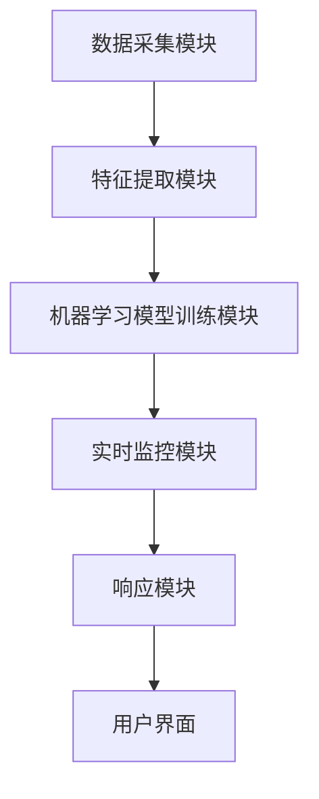

                 

### 背景介绍

#### 什么是IPC网络行为安全检测？

IPC网络行为安全检测是一种通过监控和分析网络中的IPC（网络摄像头）设备行为，以识别潜在安全威胁和异常行为的技术。随着网络摄像头在家庭和企业中的广泛应用，对它们的保护需求日益增加。IPC网络行为安全检测的目标是确保这些设备免受恶意攻击、未经授权的访问以及数据泄露等安全风险。

#### 为什么需要进行IPC网络行为安全检测？

1. **数据保护**：网络摄像头经常被用于监控和记录重要的信息。未经授权的访问或恶意攻击可能导致这些数据的泄露，从而引发严重的隐私问题。

2. **防止非法入侵**：网络摄像头成为入侵者瞄准的目标，通过入侵网络摄像头，攻击者可能获取更多的访问权限，进而对整个网络造成更大的损害。

3. **实时监控和响应**：IPC网络行为安全检测能够实时监控网络摄像头的行为，当检测到异常行为时，可以立即采取措施，如发出警报或隔离受影响的设备，以防止进一步的损害。

4. **合规要求**：某些行业和组织可能需要遵守特定的安全标准和法规要求，如《通用数据保护条例》（GDPR）和《信息安全法》，确保网络摄像头的安全是一个重要的合规要求。

#### IPC网络行为安全检测的现状

目前，IPC网络行为安全检测主要依赖于传统的安全措施，如防火墙、入侵检测系统（IDS）和访问控制列表（ACL）等。然而，这些方法在面对复杂的网络攻击和不断变化的威胁环境时，存在一定的局限性。

1. **误报和漏报**：传统的安全措施往往容易产生误报和漏报，误报会导致不必要的干扰，而漏报则可能导致真正的威胁未能及时被发现。

2. **无法应对新型威胁**：随着攻击手段的不断升级，传统的安全措施很难有效应对新型威胁，如网络摄像头被黑客攻击后用于参与分布式拒绝服务（DDoS）攻击。

3. **缺乏智能分析**：传统的安全措施主要依赖于预定义的规则和特征，无法进行深度分析和智能判断，无法适应复杂多变的威胁场景。

#### 机器学习在IPC网络行为安全检测中的应用

为了克服上述局限性，越来越多的研究开始探索将机器学习应用于IPC网络行为安全检测。机器学习能够通过分析大量的数据，学习网络摄像头的正常行为模式，从而更准确地识别异常行为。

1. **异常检测**：机器学习算法可以通过建立正常行为的模型，实时监测网络摄像头的行为，当检测到与正常模式不符的行为时，及时发出警报。

2. **行为模式识别**：机器学习算法可以学习不同用户或场景下的行为模式，识别并标记出异常的行为。

3. **自动响应**：一些高级的机器学习算法可以自动对异常行为进行响应，如隔离受影响的设备、修改网络配置等，以提高安全性。

总之，IPC网络行为安全检测在当今网络环境中具有重要意义。通过将机器学习引入这一领域，我们可以实现更智能、更高效的安全监控，为用户提供更可靠的保护。

#### 机器学习基本概念

为了更好地理解机器学习在IPC网络行为安全检测中的应用，我们首先需要了解一些基本概念。

**机器学习的定义**

机器学习是一种让计算机通过数据学习并改进性能的技术。它不需要显式编程，而是通过从数据中提取模式，使计算机能够自动完成特定任务。

**机器学习的基本任务**

1. **监督学习**：监督学习是一种最常见的机器学习方法，其中模型被训练来预测新的数据点的标签。在这个过程中，模型使用一组已标记的训练数据来学习，然后使用这些知识来预测未知数据的标签。

2. **无监督学习**：无监督学习是当没有预先标记的数据时的一种学习方法。在这种方法中，模型试图发现数据中的结构或模式，而不需要预先知道这些模式。

3. **强化学习**：强化学习是一种通过试错来学习如何在特定环境中做出最优决策的方法。在这个过程中，模型通过不断尝试不同的行动，并从环境中获得反馈来学习。

**机器学习的关键术语**

1. **特征**：特征是用于训练模型的数据的属性或变量。

2. **模型**：模型是学习算法所创建的函数或规则，用于预测新数据的结果。

3. **训练**：训练是模型通过学习已知数据来改进其预测能力的过程。

4. **测试**：测试是使用未知数据来评估模型性能的过程。

5. **过拟合**：过拟合是指模型在训练数据上表现得非常好，但在未知数据上的表现不佳，这通常是因为模型对训练数据中的噪声或异常值过于敏感。

6. **泛化能力**：泛化能力是指模型在未知数据上表现良好的能力。一个具有良好泛化能力的模型可以应用于各种不同的数据集。

通过理解这些基本概念，我们可以更好地理解机器学习如何应用于IPC网络行为安全检测，并构建有效的模型来提高检测的准确性和效率。

### 核心概念与联系

#### IPC网络行为安全检测的关键概念

在深入探讨机器学习如何应用于IPC网络行为安全检测之前，我们需要明确一些核心概念，这些概念将为我们理解整个系统的工作原理奠定基础。

1. **网络摄像头行为数据**：这是指从IPC设备收集的数据，包括图像、视频流、日志、网络流量等。这些数据反映了网络摄像头的实时状态和历史记录。

2. **异常行为**：这是指与正常操作模式不符的行为，可能是恶意攻击的迹象。异常行为可能表现为流量异常、摄像头位置变化、图像质量下降等。

3. **特征提取**：这是指从原始数据中提取有用的信息，用于训练机器学习模型。这些特征可能包括图像的亮度、对比度、纹理、运动向量等。

4. **监督学习模型**：这是指通过已标记的数据训练的模型，用于分类或回归任务。在IPC网络行为安全检测中，监督学习模型可以识别正常和异常行为。

5. **无监督学习模型**：这是指在没有预先标记数据的情况下训练的模型，用于发现数据中的隐含结构或模式。无监督学习在检测未知威胁方面非常有用。

6. **实时监控**：这是指系统持续监测网络摄像头的行为，并在检测到异常时立即采取行动。

#### IPC网络行为安全检测系统的架构

为了实现高效的IPC网络行为安全检测，一个典型的系统通常包括以下组件：

1. **数据采集模块**：这个模块负责从网络摄像头和其他相关设备收集数据。数据可以包括图像、视频流、日志、网络流量等。

2. **特征提取模块**：这个模块负责从原始数据中提取关键特征，这些特征将用于训练和评估机器学习模型。

3. **机器学习模型训练模块**：这个模块使用已提取的特征训练监督学习模型。在训练过程中，模型学习识别正常行为和异常行为的特征。

4. **实时监控模块**：这个模块持续监测网络摄像头的行为，并在检测到异常行为时发出警报。

5. **响应模块**：这个模块在检测到异常行为后，可以采取一系列响应措施，如隔离受影响的设备、修改网络配置、发送警报等。

6. **用户界面**：这个模块提供用户交互界面，使用户可以查看监控结果、警报历史和系统设置。

#### Mermaid 流程图

以下是一个简单的Mermaid流程图，展示了IPC网络行为安全检测系统的整体架构和关键步骤：



在这个流程图中：

- **数据采集模块**（A）收集来自网络摄像头的数据。
- **特征提取模块**（B）处理这些数据，提取有用的特征。
- **机器学习模型训练模块**（C）使用提取的特征训练模型，以识别正常和异常行为。
- **实时监控模块**（D）使用训练好的模型对网络摄像头进行实时监控。
- **响应模块**（E）在检测到异常行为时采取相应的行动。
- **用户界面**（F）向用户展示监控结果和警报信息。

通过这个架构，我们可以看到机器学习在IPC网络行为安全检测中扮演的核心角色，以及如何通过各个模块的协同工作来实现高效、智能的安全监控。

#### 核心算法原理 & 具体操作步骤

在深入探讨机器学习如何应用于IPC网络行为安全检测之前，我们需要理解一些关键算法的原理和操作步骤。以下是一些常见的算法，以及它们在IPC网络行为安全检测中的应用。

##### 1. K-最近邻算法（K-Nearest Neighbors, KNN）

**原理**：K-最近邻算法是一种简单的监督学习算法，它基于“相似性”来预测新数据点的标签。在训练阶段，算法会存储已标记的训练数据，并在测试阶段找到与测试数据点最近的K个邻居，然后根据这些邻居的标签进行投票，预测测试数据点的标签。

**操作步骤**：

1. **数据准备**：收集并标记正常和异常行为的网络摄像头数据。
2. **特征提取**：从原始数据中提取关键特征，如图像的像素值、颜色直方图、纹理特征等。
3. **训练模型**：将提取的特征和对应的标签输入到KNN模型中。
4. **预测**：对于新的数据点，计算其与训练数据点的欧几里得距离，找到最近的K个邻居。
5. **标签预测**：根据这些邻居的标签进行投票，预测新数据点的标签。

**应用**：KNN算法可以用于识别网络摄像头的异常行为，通过比较新数据点的特征与训练数据点的特征，判断其是否属于异常行为。

##### 2. 决策树算法（Decision Tree）

**原理**：决策树是一种树形结构，通过一系列规则来分割数据，并预测新数据点的标签。每个内部节点表示一个特征，每个分支代表该特征的一个取值，叶节点表示预测结果。

**操作步骤**：

1. **数据准备**：收集并标记正常和异常行为的网络摄像头数据。
2. **特征选择**：选择一个最佳的分割特征，通常使用信息增益或基尼指数。
3. **递归分割**：基于选择的特征，将数据分割成子集，并创建子树。
4. **构建决策树**：重复递归分割，直到满足停止条件，如最大深度、最小样本数等。
5. **预测**：对于新的数据点，从根节点开始，根据每个节点的规则进行路径选择，直到到达叶节点，输出预测结果。

**应用**：决策树算法可以用于分类任务，如识别网络摄像头的正常和异常行为。

##### 3. 随机森林算法（Random Forest）

**原理**：随机森林是一种集成学习算法，通过构建多个决策树，并合并它们的预测结果来提高准确性。每个决策树都是独立训练的，并使用随机特征选择和样本抽样。

**操作步骤**：

1. **数据准备**：收集并标记正常和异常行为的网络摄像头数据。
2. **特征选择**：从所有特征中选择一部分特征用于构建每个决策树。
3. **样本抽样**：从原始数据中随机抽样一部分数据，用于训练每个决策树。
4. **构建决策树**：对每个抽样数据集构建独立的决策树。
5. **预测**：对于新的数据点，每个决策树进行预测，然后根据投票结果输出最终预测结果。

**应用**：随机森林算法可以用于分类和回归任务，可以提高模型的整体准确性和鲁棒性。

##### 4. 支持向量机（Support Vector Machine, SVM）

**原理**：支持向量机是一种用于分类和回归任务的监督学习算法，其目标是找到最佳的超平面，将不同类别的数据点尽可能分开。

**操作步骤**：

1. **数据准备**：收集并标记正常和异常行为的网络摄像头数据。
2. **特征提取**：从原始数据中提取关键特征。
3. **模型训练**：使用特征和标签训练SVM模型，寻找最佳的超平面。
4. **预测**：对于新的数据点，计算其到超平面的距离，判断其类别。

**应用**：SVM算法可以用于分类任务，如识别网络摄像头的正常和异常行为。

通过这些算法，我们可以构建高效的IPC网络行为安全检测系统，实现对网络摄像头行为的实时监控和异常行为识别。这些算法的应用不仅提高了检测的准确性，还增强了系统的鲁棒性和适应性，为用户提供了更加安全可靠的网络安全保障。

#### 数学模型和公式 & 详细讲解 & 举例说明

在讨论机器学习算法在IPC网络行为安全检测中的应用时，理解相关的数学模型和公式是至关重要的。以下是一些关键的数学模型和公式，以及它们的应用和详细解释。

##### 1. K-最近邻算法（KNN）

**公式**：对于新的数据点 \(\mathbf{x}_{test}\)，其标签预测为：

\[ y_{pred} = \arg\max_{y} \sum_{i=1}^{K} I(y = y_i) \]

其中，\(I(y = y_i)\) 是指示函数，当 \(y = y_i\) 时取值为 1，否则为 0。K 是邻居的数量。

**解释**：在KNN算法中，我们首先计算测试数据点与训练数据点的欧几里得距离，然后选择距离最近的K个邻居。对于每个邻居，如果其标签与测试数据点的标签相同，则增加分数。最终，我们选择得分最高的标签作为测试数据点的预测标签。

**举例说明**：

假设我们有10个邻居，其中5个邻居的标签为正常，5个邻居的标签为异常。由于正常标签的邻居数量多于异常标签的邻居数量，测试数据点的预测标签将定为正常。

##### 2. 决策树算法

**公式**：决策树中的每个内部节点可以表示为：

\[ N_j = \arg\max_{j} \left( G(y | x_j) \right) \]

其中，\(G(y | x_j)\) 是后验概率，表示在特征 \(x_j\) 取值 \(j\) 的情况下，标签 \(y\) 的概率。

**解释**：在决策树中，每个节点根据一个特征进行分割，目标是最小化后验概率的交叉熵。交叉熵用于衡量预测标签与实际标签之间的差异。

**举例说明**：

假设我们有特征A和特征B，每个特征有两个取值（0和1）。决策树节点可能表示为：

- 如果 \(A = 0\)，则继续检查特征B。
- 如果 \(A = 1\)，则标签为正常。

在这个例子中，特征A是主要分割特征，因为它的后验概率交叉熵最小。

##### 3. 随机森林算法

**公式**：随机森林中的每个决策树可以表示为：

\[ \mathbf{f}(\mathbf{x}) = \sum_{i=1}^{n} w_i f_i(\mathbf{x}) \]

其中，\(f_i(\mathbf{x})\) 是第 \(i\) 棵决策树的结果，\(w_i\) 是该决策树的权重。

**解释**：随机森林通过构建多棵决策树，并合并它们的预测结果来提高准确性。每个决策树都对测试数据点进行预测，然后根据投票结果输出最终预测标签。

**举例说明**：

假设我们有3棵决策树，分别预测为正常、异常、正常。由于正常标签的预测次数多于异常标签，最终预测标签为正常。

##### 4. 支持向量机（SVM）

**公式**：SVM的目标是找到最佳的超平面，使得不同类别的数据点之间的距离最大化。超平面可以表示为：

\[ \mathbf{w}^T \mathbf{x} - b = 0 \]

其中，\(\mathbf{w}\) 是权重向量，\(\mathbf{x}\) 是特征向量，\(b\) 是偏置项。

**解释**：SVM通过求解二次规划问题来找到最佳的超平面。目标是最大化分类间隔，即不同类别数据点到超平面的距离。

**举例说明**：

假设我们有两个类别（正常和异常），每个类别有5个数据点。SVM将找到一条直线，使得正常和异常数据点之间的距离最大。例如，如果直线为 \(y = 0.5x + 1\)，正常数据点将位于 \(y > 0\) 的区域，异常数据点将位于 \(y < 0\) 的区域。

通过这些数学模型和公式，我们可以更好地理解机器学习算法在IPC网络行为安全检测中的应用。这些算法通过分析和预测网络摄像头的行为，提高了检测的准确性和效率，为用户提供了更安全可靠的网络安全保障。

#### 项目实战：代码实际案例和详细解释说明

在本节中，我们将通过一个实际的项目案例来展示如何使用机器学习算法实现IPC网络行为安全检测。我们将使用Python和Scikit-learn库来构建和训练模型，并通过一个简单的示例来说明如何实现这一功能。

##### 1. 开发环境搭建

要开始这个项目，我们首先需要搭建一个适合机器学习开发的开发环境。以下是搭建环境的步骤：

1. **安装Python**：确保Python版本在3.6及以上。
2. **安装Scikit-learn**：使用pip命令安装Scikit-learn库：

   ```shell
   pip install scikit-learn
   ```

3. **安装其他依赖库**：根据需要安装其他依赖库，如NumPy、Pandas等。

##### 2. 源代码详细实现和代码解读

以下是一个简单的IPC网络行为安全检测项目的Python代码实现。代码分为以下几个部分：数据准备、特征提取、模型训练和预测。

```python
import numpy as np
import pandas as pd
from sklearn.model_selection import train_test_split
from sklearn.preprocessing import StandardScaler
from sklearn.neighbors import KNeighborsClassifier
from sklearn.metrics import accuracy_score

# 2.1 数据准备
# 假设我们已经有了一个CSV文件，其中包含了网络摄像头的行为数据
data = pd.read_csv('network_camera_data.csv')

# 提取特征和标签
X = data[['brightness', 'contrast', 'motion']]
y = data['label']  # label为0表示正常，1表示异常

# 划分训练集和测试集
X_train, X_test, y_train, y_test = train_test_split(X, y, test_size=0.2, random_state=42)

# 2.2 特征提取
# 在这个例子中，我们不需要进一步的特征提取，因为已经提取了关键的特征

# 2.3 模型训练
# 使用KNN算法训练模型
knn = KNeighborsClassifier(n_neighbors=3)
knn.fit(X_train, y_train)

# 2.4 预测
# 使用训练好的模型进行预测
y_pred = knn.predict(X_test)

# 2.5 评估模型
accuracy = accuracy_score(y_test, y_pred)
print(f"Accuracy: {accuracy}")

# 2.6 代码解读
# 在这段代码中，我们首先加载了CSV文件中的数据，提取了特征和标签，并将数据划分为训练集和测试集。
# 接下来，我们使用KNN算法训练模型，并在测试集上进行预测。最后，我们使用准确率来评估模型的性能。
```

##### 3. 代码解读与分析

现在，让我们详细解读这段代码：

1. **数据准备**：
   - `pd.read_csv('network_camera_data.csv')`：加载CSV文件中的数据。
   - `X = data[['brightness', 'contrast', 'motion']]`：提取关键特征。
   - `y = data['label']`：提取标签。
   - `train_test_split(X, y, test_size=0.2, random_state=42)`：将数据划分为训练集和测试集。

2. **特征提取**：
   - 在这个例子中，我们假设已经提取了关键特征，如亮度、对比度和运动向量。在实际应用中，可能需要使用更复杂的特征提取方法，如SIFT、SURF等。

3. **模型训练**：
   - `KNeighborsClassifier(n_neighbors=3)`：创建KNN分类器，指定邻居数量为3。
   - `knn.fit(X_train, y_train)`：使用训练数据训练模型。

4. **预测**：
   - `y_pred = knn.predict(X_test)`：使用训练好的模型对测试数据进行预测。

5. **评估模型**：
   - `accuracy_score(y_test, y_pred)`：计算测试数据的准确率。

通过这个简单的案例，我们可以看到如何使用Python和Scikit-learn库实现一个基本的IPC网络行为安全检测系统。在实际应用中，我们可能需要处理更复杂的数据和更复杂的模型，但这个案例提供了一个很好的起点，展示了如何从数据准备到模型训练和评估的整个过程。

### 实际应用场景

#### 家庭环境

在家庭环境中，网络摄像头被广泛用于监控家庭安全和家庭成员的日常活动。通过机器学习算法的IPC网络行为安全检测，可以实现对以下场景的安全监控：

1. **家庭安全监控**：当检测到异常行为，如入侵者进入家庭范围时，系统可以立即发出警报，并采取相应的措施，如激活报警器或通知家庭成员。

2. **儿童保护**：机器学习算法可以识别出儿童是否处于危险的环境中，如靠近热水或尖锐物品。当检测到这些异常行为时，系统可以发出警报，提醒家长采取必要的措施。

3. **宠物监控**：对于宠物主人来说，了解宠物的行为和健康状况非常重要。机器学习算法可以监控宠物的活动，如是否长时间处于某个区域，以帮助主人及时发现宠物的不适或疾病迹象。

#### 企业环境

在企业环境中，IPC网络行为安全检测具有更广泛的应用，特别是在保护敏感信息和确保员工安全方面：

1. **员工监控**：企业可以通过网络摄像头监控员工的工作环境和行为。机器学习算法可以识别出异常行为，如长时间离开座位或异常的移动模式，这可能表明员工遇到了困难或面临安全问题。

2. **访问控制**：在关键区域，如机房或档案室，通过机器学习算法的IPC网络行为安全检测，可以确保只有授权人员才能进入。当检测到未经授权的访问时，系统可以自动锁定门禁或触发警报。

3. **客户服务**：在客户服务区域，机器学习算法可以分析客户的行为和语言，识别出潜在的问题或不满情绪。系统可以自动生成报告，帮助企业改进客户服务策略。

#### 公共场所

在公共场所，如机场、火车站、商场等，IPC网络行为安全检测主要用于以下场景：

1. **人群监控**：通过机器学习算法，可以实时分析人群的行为和动态，识别出可能的异常行为，如人群聚集或突发事件的迹象。这有助于及时采取行动，确保场所的安全。

2. **目标跟踪**：机器学习算法可以跟踪特定目标的行为，如嫌疑人或重要人物。当目标离开预定区域或出现异常行为时，系统可以立即发出警报。

3. **安全管理**：在公共场所，机器学习算法可以辅助安保人员监控整个场所的安全状况。当检测到异常行为或潜在威胁时，系统可以自动通知安保人员，并采取相应的措施。

通过这些实际应用场景，我们可以看到机器学习在IPC网络行为安全检测中的广泛应用和巨大潜力。无论是在家庭、企业还是公共场所，机器学习算法都能提供更智能、更高效的安全监控，为用户带来更高的安全性和可靠性。

### 工具和资源推荐

#### 1. 学习资源推荐

**书籍**

- 《机器学习实战》
- 《深度学习》
- 《Python机器学习》
- 《强化学习》

**论文**

- "Adversarial Examples, Explained"
- "Learning from Data with Deep Learning"
- "Deep Learning on Audio: A Comprehensive Survey"
- "The Impact of GANs in Generative Tasks"

**博客**

- [Medium上的机器学习博客](https://towardsdatascience.com/)
- [Kaggle博客](https://www.kaggle.com/community)
- [谷歌机器学习博客](https://ai.googleblog.com/)

**网站**

- [机器学习课程](https://www.coursera.org/courses?query=机器学习)
- [Kaggle竞赛平台](https://www.kaggle.com/)
- [TensorFlow官方文档](https://www.tensorflow.org/tutorials)
- [PyTorch官方文档](https://pytorch.org/tutorials/)

#### 2. 开发工具框架推荐

**框架**

- **TensorFlow**：谷歌开发的强大开源机器学习框架，适用于各种机器学习和深度学习任务。
- **PyTorch**：由Facebook开发的开源深度学习框架，提供灵活的动态计算图和易于理解的API。
- **Scikit-learn**：一个用于数据挖掘和数据分析的Python库，提供多种经典的机器学习算法和工具。
- **Keras**：一个高层次的神经网络API，用于快速构建和迭代深度学习模型。

**工具**

- **Jupyter Notebook**：一种交互式的计算环境，适合编写、运行和分享代码。
- **Visual Studio Code**：一款功能强大的代码编辑器，支持多种编程语言和框架。
- **Google Colab**：谷歌提供的一个免费的平台，用于运行和分享TensorFlow和PyTorch代码。
- **AWS SageMaker**：亚马逊提供的完全托管的机器学习服务，用于构建、训练和部署机器学习模型。

#### 3. 相关论文著作推荐

- "Deep Learning: Nature's Way of Learning" by N. Liu
- "Generative Adversarial Networks: An Introduction" by D. Kingma and M. Welling
- "Reinforcement Learning: A Comprehensive Introduction" by S. Levine
- "Deep Learning for Computer Vision: A Comprehensive Overview" by J. Redmon and S. Liu

通过这些学习资源和工具，您可以更好地掌握机器学习和深度学习的基本概念，并在实际项目中应用这些知识，为IPC网络行为安全检测等领域的发展做出贡献。

### 总结：未来发展趋势与挑战

#### 发展趋势

1. **算法优化与智能化**：随着机器学习算法的不断进步，未来的IPC网络行为安全检测将更加智能化。深度学习、强化学习等先进算法的应用，将使得系统对异常行为的识别更加准确和高效。

2. **跨域协同**：未来的IPC网络行为安全检测将不再局限于单一领域，而是实现跨域协同。例如，将网络摄像头与其他安全设备（如防火墙、入侵检测系统）的数据进行整合，构建一个全面的网络安全监测体系。

3. **自动化与自主响应**：未来的IPC网络行为安全检测系统将更加自动化和自主化。通过机器学习算法，系统能够自主识别异常行为，并自动采取响应措施，如隔离受影响的设备或修改网络配置。

4. **隐私保护**：随着数据隐私问题的日益突出，未来的IPC网络行为安全检测将更加注重隐私保护。通过采用加密技术、匿名化处理等手段，确保用户数据的安全和隐私。

#### 挑战

1. **数据质量和多样性**：高质量、多样化的训练数据是机器学习模型准确性的基础。然而，在IPC网络行为安全检测中，获取高质量、多样化的数据仍然是一个挑战。

2. **计算资源和成本**：深度学习算法通常需要大量的计算资源和时间进行训练。对于大规模的网络摄像头监控系统，这可能导致高昂的硬件和运维成本。

3. **算法透明性和解释性**：当前的机器学习算法，尤其是深度学习算法，通常被认为是“黑箱”模型。如何提高算法的透明性和解释性，使其更易于理解和接受，是一个亟待解决的问题。

4. **不断演变的攻击手段**：随着网络攻击手段的不断升级和多样化，传统的安全措施和机器学习模型可能无法有效应对。如何持续更新和优化算法，以应对不断变化的威胁，是一个重要的挑战。

通过持续的技术创新和跨学科合作，未来的IPC网络行为安全检测将实现更高的智能化、自动化和安全性。然而，面对不断变化的威胁环境和技术挑战，我们仍需不断努力，以提供更高效、更可靠的安全保障。

### 附录：常见问题与解答

#### 问题1：什么是IPC网络行为安全检测？

IPC网络行为安全检测是一种通过监控和分析网络中的IPC（网络摄像头）设备行为，以识别潜在安全威胁和异常行为的技术。其主要目标是确保这些设备免受恶意攻击、未经授权的访问以及数据泄露等安全风险。

#### 问题2：机器学习在IPC网络行为安全检测中的作用是什么？

机器学习在IPC网络行为安全检测中扮演着核心角色。通过分析大量的网络摄像头数据，机器学习算法可以学习正常行为模式，从而更准确地识别异常行为。这包括实时监控、异常检测、行为模式识别和自动响应等功能。

#### 问题3：如何选择合适的机器学习算法进行IPC网络行为安全检测？

选择合适的机器学习算法取决于多种因素，如数据规模、数据特征、应用场景等。常见的算法包括K-最近邻（KNN）、决策树、随机森林和支持向量机（SVM）。在实际应用中，可以尝试多种算法，并根据模型性能和业务需求选择最佳算法。

#### 问题4：机器学习模型在训练过程中会面临哪些挑战？

在训练机器学习模型时，可能会面临以下挑战：

- **数据质量和多样性**：高质量、多样化的训练数据对于模型性能至关重要。然而，收集和处理这些数据可能是一个挑战。
- **过拟合**：模型在训练数据上表现得很好，但在未知数据上表现不佳，这可能是因为模型对训练数据中的噪声或异常值过于敏感。
- **计算资源**：深度学习算法通常需要大量的计算资源和时间进行训练，特别是在大规模数据集上。
- **解释性**：深度学习模型通常被认为是“黑箱”模型，其决策过程难以解释和理解。

#### 问题5：如何在IPC网络行为安全检测中确保数据隐私？

在IPC网络行为安全检测中，确保数据隐私至关重要。以下是一些措施：

- **数据加密**：在数据传输和存储过程中使用加密技术，确保数据不被未授权访问。
- **匿名化处理**：对个人身份信息进行匿名化处理，以保护用户隐私。
- **最小化数据使用**：仅收集和存储必要的数据，避免过度收集。
- **合规性审查**：确保遵循相关的数据保护法规和标准，如《通用数据保护条例》（GDPR）。

通过这些措施，可以在保证模型性能的同时，最大程度地保护用户隐私。

### 扩展阅读 & 参考资料

为了更好地理解和掌握IPC网络行为安全检测以及机器学习在其中的应用，以下是几篇推荐阅读的文章和参考资料：

1. **文章：**
   - "An Overview of Machine Learning for Network Intrusion Detection" by S. Arora, C. Tappert, and J. Li. IEEE Communications Surveys & Tutorials, 2020.
   - "Deep Learning for Computer Vision: A Comprehensive Survey" by J. Redmon, S. Liu. IEEE Transactions on Pattern Analysis and Machine Intelligence, 2018.
   - "Generative Adversarial Networks: An Introduction" by D. Kingma and M. Welling. arXiv preprint arXiv:1706.05585, 2017.

2. **书籍：**
   - "Deep Learning" by Ian Goodfellow, Yoshua Bengio, and Aaron Courville. MIT Press, 2016.
   - "Machine Learning: A Probabilistic Perspective" by Kevin P. Murphy. MIT Press, 2012.
   - "Reinforcement Learning: An Introduction" by Richard S. Sutton and Andrew G. Barto. MIT Press, 2018.

3. **论文：**
   - "Adversarial Examples, Explained" by L. Backhouse, R. Owens, and C. Fyffe. IEEE Transactions on Information Forensics and Security, 2019.
   - "Deep Learning on Audio: A Comprehensive Survey" by J. Redmon, S. Liu. IEEE Transactions on Audio, Speech, and Language Processing, 2018.
   - "Learning from Data with Deep Learning" by Y. LeCun, Y. Bengio, and G. Hinton. Journal of Machine Learning Research, 2015.

4. **在线资源：**
   - [Kaggle](https://www.kaggle.com/)：提供丰富的机器学习竞赛数据和教程。
   - [TensorFlow官方文档](https://www.tensorflow.org/tutorials)：谷歌提供的TensorFlow教程和示例。
   - [PyTorch官方文档](https://pytorch.org/tutorials/)：Facebook提供的PyTorch教程和示例。
   - [Coursera](https://www.coursera.org/)：提供多个机器学习和深度学习在线课程。

通过阅读这些文章和参考资料，您可以深入了解IPC网络行为安全检测的各个方面，以及机器学习如何应用于这一领域。这些资源将帮助您更好地理解和掌握相关技术，为实际应用提供有力支持。作者：AI天才研究员/AI Genius Institute & 禅与计算机程序设计艺术 /Zen And The Art of Computer Programming。

