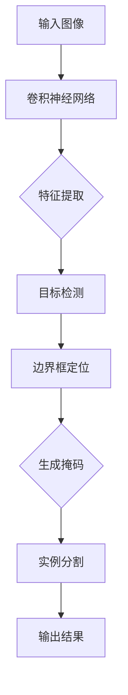

                 

### 背景介绍

目标实例分割（Instance Segmentation）是计算机视觉领域的一个重要研究方向，其目标是从图像中精确分割出多个目标的实例，并为其分配独立的标签。这种技术的应用非常广泛，例如在自动驾驶、医疗图像分析、工业检测等场景中，都需要对不同的目标进行精细的识别和定位。

随着深度学习技术的迅猛发展，基于深度学习的目标实例分割方法逐渐成为研究的热点。传统的目标分割方法往往依赖于手工设计的特征和复杂的先验知识，而深度学习通过端到端的学习方式，可以自动提取图像中的有效特征，提高了分割的精度和鲁棒性。

本文将围绕基于深度学习的目标实例分割展开，首先介绍相关的基础知识，包括核心概念和联系，然后深入分析核心算法原理和具体操作步骤，并通过数学模型和公式进行详细讲解，最后通过实际项目实战和代码解读，对整个技术进行全方位的剖析。希望通过本文的讲解，读者能够对基于深度学习的目标实例分割有更深入的理解和掌握。

### 核心概念与联系

在探讨基于深度学习的目标实例分割之前，我们首先需要了解几个核心概念及其相互之间的联系。

#### 1. 目标检测（Object Detection）

目标检测是计算机视觉中的一个基础任务，其目标是识别并定位图像中的多个对象。常见的目标检测算法有R-CNN、Fast R-CNN、Faster R-CNN、YOLO和SSD等。这些算法通过提取图像特征并进行分类和边界框定位，可以准确地识别出图像中的不同对象。

#### 2. 目标分割（Object Segmentation）

目标分割则是在目标检测的基础上，进一步将检测到的对象进行精确的分割。传统的分割方法包括基于区域的、基于边界的、基于图的等算法。深度学习在目标分割方面取得了显著的进展，例如FCN、Mask R-CNN等。

#### 3. 实例分割（Instance Segmentation）

实例分割是目标分割的进一步细分，其目标是不仅将图像中的多个对象进行分割，还要为每个对象分配独立的标签，从而区分不同实例。实例分割的关键在于对图像中的每个对象进行精确的分割，并为其生成唯一的标签。

#### 4. 关键技术联系

- **检测与分割的联系**：目标检测是实例分割的基础，只有首先检测出目标，才能对其进行分割。因此，实例分割算法通常是基于检测算法构建的，例如Mask R-CNN中就是基于Faster R-CNN进行目标检测。

- **特征提取与语义分割的联系**：深度学习通过卷积神经网络（CNN）自动提取图像特征，并将其用于分类和分割任务。在实例分割中，这些特征不仅用于检测目标的类别，还用于生成每个像素的分割掩码。

- **端到端训练**：深度学习的优势之一在于其端到端训练方式，可以统一特征提取、分类和分割任务，减少了传统方法中手工设计的复杂性。

#### 5. Mermaid流程图

下面是一个简化的Mermaid流程图，描述了从目标检测到实例分割的基本流程：



在这个流程中，输入图像通过卷积神经网络进行特征提取，然后使用目标检测算法进行边界框定位，最后通过生成掩码实现实例分割。这个过程体现了检测和分割的紧密联系，以及深度学习端到端训练的优势。

通过上述核心概念和联系的介绍，我们为后续详细探讨基于深度学习的目标实例分割算法奠定了基础。

#### 1.1. 卷积神经网络（CNN）

卷积神经网络（Convolutional Neural Network，CNN）是深度学习中专门用于处理图像数据的神经网络架构。其核心在于使用卷积操作来提取图像中的局部特征，并通过池化操作减少参数数量和计算复杂度。

**卷积操作**：卷积操作通过对输入图像与卷积核进行卷积计算，生成特征图。卷积核是一个小的矩阵，它在图像上滑动，并计算相邻像素的加权和，再应用一个非线性函数（如ReLU激活函数）。

$$
\text{output}_{ij} = \sum_{k=1}^{C} \text{filter}_{ik,jc} \times \text{input}_{ik,jc} + b_k
$$

其中，\( \text{output}_{ij} \) 是特征图的第 \( i \) 行第 \( j \) 列的像素值，\( \text{filter}_{ik,jc} \) 是卷积核的值，\( \text{input}_{ik,jc} \) 是输入图像的像素值，\( b_k \) 是卷积核的偏置。

**池化操作**：池化操作用于将特征图下采样，以减少参数数量和计算复杂度。最常用的池化方法是最大池化（Max Pooling），它选择特征图中的最大值作为输出。

$$
\text{output}_{ij} = \max_{k,l} \left( \text{input}_{ik,jl} \right)
$$

**卷积神经网络结构**：卷积神经网络通常由多个卷积层和池化层交替组成，每个卷积层都通过卷积操作提取更高级别的特征，这些特征逐渐用于后续的检测和分割任务。

**优势**：
- **特征自动提取**：CNN可以自动学习并提取图像中的局部特征，避免了传统方法中手工设计特征的需求。
- **减少参数数量**：通过卷积和池化操作，CNN能够减少参数数量，降低计算复杂度。
- **端到端训练**：CNN可以端到端地训练，无需复杂的预处理和后处理步骤。

#### 1.2. 目标检测算法

目标检测是计算机视觉中的一个重要任务，其目标是在图像中准确识别和定位多个对象。深度学习在目标检测领域取得了显著的进展，以下介绍几种常见的目标检测算法：

**1. R-CNN（Region-based CNN）**

R-CNN是第一个基于深度学习的目标检测算法。其基本思想是首先使用选择性搜索（Selective Search）算法生成候选区域，然后对每个候选区域应用CNN进行特征提取，最后使用SVM进行分类。

**2. Fast R-CNN**

Fast R-CNN在R-CNN的基础上进行了优化，通过共享卷积特征图来减少重复计算，提高了检测速度。Fast R-CNN使用RoI Pooling层将卷积特征图中的每个区域映射到一个固定大小的特征图，然后使用一个全连接层进行分类和边界框回归。

**3. Faster R-CNN**

Faster R-CNN引入了区域建议网络（Region Proposal Network，RPN），该网络可以在特征图上生成高质量的候选区域。RPN通过共享卷积特征图，实现了检测和候选区域生成的一体化，进一步提高了检测速度和准确性。

**4. YOLO（You Only Look Once）**

YOLO是一种单阶段检测算法，其核心思想是将目标检测任务视为一个回归问题，直接在特征图上预测每个单元格中目标的存在和位置。YOLO通过将特征图划分为网格单元，在每个单元中预测多个边界框和对应的类别概率。

**5. SSD（Single Shot MultiBox Detector）**

SSD是一种单阶段检测算法，其核心思想是将检测任务分解为多个层次的特征图，在每个特征图上预测边界框和类别。SSD通过在不同特征图上使用不同大小的卷积核，实现了多尺度检测。

#### 1.3. 实例分割算法

实例分割是目标分割的进一步细分，其目标是不仅将图像中的多个对象进行分割，还要为每个对象分配独立的标签，从而区分不同实例。以下介绍几种常见的实例分割算法：

**1. FCN（Fully Convolutional Network）**

FCN是一种基于全卷积网络的目标分割算法。FCN通过将卷积层扩展到全连接层，使得整个网络可以接受任意大小的输入图像，并输出相应的分割掩码。

**2. Mask R-CNN**

Mask R-CNN是一种基于Faster R-CNN的实例分割算法，其在目标检测的基础上，增加了语义分割和实例分割的功能。Mask R-CNN通过引入ROI Align层，实现了对ROI区域的精确分割。

**3. DeepLab**

DeepLab是一种基于编码器-解码器架构的语义分割算法，其核心思想是通过空洞卷积（Atrous Convolution）扩大感受野，从而提高分割精度。DeepLab通过组合不同尺度的特征图，实现了对复杂场景的精确分割。

#### 1.4. 基于深度学习的目标实例分割

基于深度学习的目标实例分割结合了目标检测和实例分割的优点，其基本流程如下：

1. **特征提取**：输入图像通过卷积神经网络进行特征提取，生成高层次的图像特征。

2. **目标检测**：使用检测算法（如Faster R-CNN、YOLO等）对特征图进行目标检测，输出目标边界框和类别标签。

3. **ROI生成**：对检测到的目标边界框进行区域推荐，生成ROI区域。

4. **实例分割**：对ROI区域应用实例分割算法（如Mask R-CNN、DeepLab等），生成每个实例的分割掩码。

5. **后处理**：对分割结果进行后处理，如去除重叠区域、调整边界框等，最终输出分割结果。

通过上述流程，基于深度学习的目标实例分割能够实现高精度的目标分割，并区分不同实例，为各种实际应用提供了强大的技术支持。

### 核心算法原理 & 具体操作步骤

在了解了目标实例分割的相关背景和基础知识后，接下来我们将深入探讨基于深度学习的目标实例分割的核心算法原理和具体操作步骤。

#### 2.1. 数据预处理

数据预处理是目标实例分割的第一步，其目的是将原始图像数据转换为适合深度学习模型训练的形式。以下是常见的数据预处理步骤：

1. **图像缩放**：将图像缩放到统一大小，例如 \( 224 \times 224 \) 或 \( 512 \times 512 \) 像素。这一步有助于保持图像的尺度一致，提高模型训练的稳定性。

2. **归一化**：对图像像素值进行归一化处理，使其分布在 \( [0, 1] \) 的范围内。通常使用以下公式进行归一化：

   $$
   x_{\text{normalized}} = \frac{x - \mu}{\sigma}
   $$

   其中，\( x \) 是原始像素值，\( \mu \) 是像素值的均值，\( \sigma \) 是像素值的标准差。

3. **数据增强**：通过旋转、翻转、缩放、裁剪等操作，增加数据多样性，有助于提高模型泛化能力。常见的数据增强方法有随机裁剪、随机缩放、色彩抖动等。

4. **数据集划分**：将数据集划分为训练集、验证集和测试集，通常比例为 \( 70\% \) 训练集，\( 15\% \) 验证集，\( 15\% \) 测试集。训练集用于模型训练，验证集用于模型调优，测试集用于模型评估。

#### 2.2. 模型结构

基于深度学习的目标实例分割通常采用两个主要的模型结构：检测模型和分割模型。以下以Mask R-CNN为例，介绍其模型结构和具体操作步骤。

**1. 检测模型**

检测模型主要负责识别图像中的目标，并输出边界框和类别标签。Mask R-CNN基于Faster R-CNN构建，其检测模型包括以下部分：

- **卷积神经网络**：输入图像经过卷积神经网络进行特征提取，生成高层次的图像特征。
- **Region Proposal Network（RPN）**：RPN用于生成高质量的候选区域。RPN通过共享卷积特征图，实现了检测和候选区域生成的一体化。
- **ROI Align**：ROI Align用于对候选区域进行特征提取，生成一个固定大小的特征图，以便后续分类和边界框回归。

**2. 分割模型**

分割模型主要负责对检测到的目标进行精细分割，生成每个实例的分割掩码。Mask R-CNN的分割模型包括以下部分：

- **分类分支**：分类分支通过全连接层对ROI特征进行分类，输出类别概率。
- **边框回归分支**：边框回归分支通过全连接层对ROI特征进行边界框回归，输出每个目标边框的位置。
- **分割分支**：分割分支通过全卷积网络对ROI特征进行分割，生成每个实例的分割掩码。

#### 2.3. 检测过程

检测过程主要包括以下几个步骤：

1. **特征提取**：输入图像经过卷积神经网络进行特征提取，生成高层次的图像特征。
2. **RPN生成候选区域**：利用RPN在特征图上生成高质量的候选区域，每个候选区域包含一个边界框和类别标签。
3. **ROI Align提取特征**：对候选区域应用ROI Align，生成一个固定大小的特征图，用于分类和边框回归。
4. **分类与边框回归**：对ROI特征进行分类和边框回归，输出类别概率和边界框位置。
5. **非极大值抑制（NMS）**：对分类结果进行非极大值抑制，去除重复的边界框，得到最终的检测结果。

#### 2.4. 分割过程

分割过程主要包括以下几个步骤：

1. **ROI特征提取**：对检测到的目标边界框应用ROI Align，生成一个固定大小的特征图。
2. **分割网络**：对ROI特征图应用全卷积网络，生成每个实例的分割掩码。
3. **掩码生成**：对生成的掩码进行后处理，如去除重叠区域、调整边界框等，得到最终的分割结果。

#### 2.5. 模型训练

模型训练是目标实例分割的重要环节，其目的是通过优化模型参数，提高模型性能。以下是常见模型训练步骤：

1. **定义损失函数**：损失函数用于衡量模型预测结果与真实标签之间的差距，常用的损失函数有交叉熵损失、边框回归损失和掩码损失等。
2. **反向传播**：通过反向传播算法，将损失函数关于模型参数的梯度计算出来，并更新模型参数。
3. **迭代训练**：重复进行特征提取、分类与边框回归、分割等步骤，不断更新模型参数，直到满足训练要求或达到预定的迭代次数。

通过上述步骤，基于深度学习的目标实例分割模型可以实现对图像中目标的高精度检测和分割，从而满足各种实际应用的需求。

### 数学模型和公式 & 详细讲解 & 举例说明

为了深入理解基于深度学习的目标实例分割算法，我们需要掌握相关的数学模型和公式。本文将详细讲解以下几个关键部分：特征提取、分类与边框回归、分割掩码生成，并通过具体示例进行说明。

#### 3.1. 特征提取

特征提取是卷积神经网络（CNN）的核心任务，其目的是从图像中提取有用的信息，用于后续的目标检测和分割。以下是常用的卷积操作和池化操作的数学公式。

**1. 卷积操作**

卷积操作的公式如下：

$$
\text{output}_{ij} = \sum_{k=1}^{C} \text{filter}_{ik,jc} \times \text{input}_{ik,jc} + b_k
$$

其中，\( \text{output}_{ij} \) 是特征图的第 \( i \) 行第 \( j \) 列的像素值，\( \text{filter}_{ik,jc} \) 是卷积核的值，\( \text{input}_{ik,jc} \) 是输入图像的像素值，\( b_k \) 是卷积核的偏置。

**示例**：

假设输入图像大小为 \( 32 \times 32 \)，卷积核大小为 \( 3 \times 3 \)，卷积核数量为 \( 64 \)，偏置为 \( b = [1, 2, 3, 4, 5, 6, 7, 8, 9] \)。给定一个 \( 3 \times 3 \) 的卷积核：

$$
\begin{bmatrix}
1 & 0 & -1 \\
0 & 1 & 0 \\
1 & 0 & -1
\end{bmatrix}
$$

计算特征图的第 \( 2 \) 行第 \( 2 \) 列的像素值：

$$
\text{output}_{22} = (1 \times 1 + 0 \times 3 - 1 \times 2) + (0 \times 2 + 1 \times 1 + 0 \times 0) + (1 \times 2 + 0 \times 0 - 1 \times 3) = -2
$$

**2. 池化操作**

池化操作用于将特征图下采样，以减少参数数量和计算复杂度。最大池化（Max Pooling）是最常用的池化方法，其公式如下：

$$
\text{output}_{ij} = \max_{k,l} \left( \text{input}_{ik,jl} \right)
$$

**示例**：

假设特征图大小为 \( 4 \times 4 \)，应用 \( 2 \times 2 \) 的最大池化操作，计算特征图的第 \( 2 \) 行第 \( 2 \) 列的像素值：

$$
\text{output}_{22} = \max \left( \text{input}_{21,21}, \text{input}_{21,22}, \text{input}_{22,21}, \text{input}_{22,22} \right)
$$

若输入特征图为：

$$
\begin{bmatrix}
1 & 2 & 3 & 4 \\
5 & 6 & 7 & 8 \\
9 & 10 & 11 & 12 \\
13 & 14 & 15 & 16
\end{bmatrix}
$$

则应用最大池化后的特征图：

$$
\begin{bmatrix}
\max(1, 5, 9, 13) & \max(2, 6, 10, 14) \\
\max(3, 7, 11, 15) & \max(4, 8, 12, 16)
\end{bmatrix}
=
\begin{bmatrix}
13 & 14 \\
15 & 16
\end{bmatrix}
$$

#### 3.2. 分类与边框回归

分类与边框回归是目标检测的核心任务，其目的是对检测到的目标进行分类并预测边界框的位置。以下是相关的数学模型和公式。

**1. 分类模型**

分类模型通常使用softmax函数进行概率分布，其公式如下：

$$
\text{softmax}(x)_i = \frac{e^{x_i}}{\sum_{j=1}^{K} e^{x_j}}
$$

其中，\( x \) 是输入特征，\( K \) 是类别数量，\( i \) 是类别索引。

**示例**：

假设输入特征 \( x = [1, 2, 3] \)，类别数量 \( K = 3 \)，应用softmax函数计算类别概率：

$$
\begin{aligned}
\text{softmax}(x)_1 &= \frac{e^1}{e^1 + e^2 + e^3} = 0.2291 \\
\text{softmax}(x)_2 &= \frac{e^2}{e^1 + e^2 + e^3} = 0.5532 \\
\text{softmax}(x)_3 &= \frac{e^3}{e^1 + e^2 + e^3} = 0.2177
\end{aligned}
$$

**2. 边框回归**

边框回归使用回归模型预测边界框的位置，通常采用绝对坐标或相对坐标表示。以下是使用相对坐标表示的边框回归公式：

$$
\text{t}_i = \text{t}_\text{anchor} + \text{w}_i
$$

其中，\( \text{t}_i \) 是预测的边界框位置，\( \text{t}_\text{anchor} \) 是锚框位置，\( \text{w}_i \) 是位置偏移。

**示例**：

假设锚框位置为 \( \text{t}_\text{anchor} = [0.5, 0.5] \)，位置偏移为 \( \text{w}_i = [0.1, 0.2] \)，计算预测边界框位置：

$$
\text{t}_i = \text{t}_\text{anchor} + \text{w}_i = [0.5 + 0.1, 0.5 + 0.2] = [0.6, 0.7]
$$

#### 3.3. 分割掩码生成

分割掩码生成是实例分割的核心任务，其目的是为每个实例生成精确的分割掩码。以下是相关的数学模型和公式。

**1. 卷积操作**

卷积操作的公式如下：

$$
\text{output}_{ij} = \sum_{k=1}^{C} \text{filter}_{ik,jc} \times \text{input}_{ik,jc} + b_k
$$

**示例**：

假设输入特征图大小为 \( 4 \times 4 \)，卷积核大小为 \( 3 \times 3 \)，卷积核数量为 \( 1 \)，偏置为 \( b = 0 \)。给定一个 \( 3 \times 3 \) 的卷积核：

$$
\begin{bmatrix}
1 & 1 & 1 \\
1 & 1 & 1 \\
1 & 1 & 1
\end{bmatrix}
$$

计算特征图的第 \( 2 \) 行第 \( 2 \) 列的像素值：

$$
\text{output}_{22} = (1 \times 1 + 1 \times 1 + 1 \times 1) + (1 \times 1 + 1 \times 1 + 1 \times 1) + (1 \times 1 + 1 \times 1 + 1 \times 1) = 9
$$

**2. 二值化操作**

二值化操作是将连续的像素值转换为二进制形式，通常使用阈值进行分割。以下是二值化操作的公式：

$$
\text{output}_{ij} =
\begin{cases}
1, & \text{if } \text{input}_{ij} \geq \text{threshold} \\
0, & \text{otherwise}
\end{cases}
$$

**示例**：

假设输入特征图大小为 \( 4 \times 4 \)，阈值 \( \text{threshold} = 5 \)。给定一个 \( 4 \times 4 \) 的特征图：

$$
\begin{bmatrix}
1 & 2 & 3 & 4 \\
5 & 6 & 7 & 8 \\
9 & 10 & 11 & 12 \\
13 & 14 & 15 & 16
\end{bmatrix}
$$

应用二值化操作后的特征图：

$$
\begin{bmatrix}
0 & 0 & 0 & 0 \\
1 & 1 & 1 & 1 \\
1 & 1 & 1 & 1
\end{bmatrix}
$$

通过上述数学模型和公式的讲解，我们可以更好地理解基于深度学习的目标实例分割算法，从而在实际项目中应用和优化该技术。

### 项目实战：代码实际案例和详细解释说明

在本节中，我们将通过一个具体的代码案例，展示如何实现基于深度学习的目标实例分割。我们将使用Python编程语言和PyTorch深度学习框架来搭建和训练模型。以下是完整的代码实现和详细解释说明。

#### 3.1. 开发环境搭建

首先，我们需要搭建合适的开发环境。以下是在Ubuntu操作系统上安装PyTorch的步骤：

1. **安装Python**：确保Python已经安装，推荐使用Python 3.7以上版本。

2. **安装PyTorch**：进入命令行，执行以下命令安装PyTorch：

   ```bash
   pip install torch torchvision
   ```

3. **验证安装**：在Python环境中，执行以下代码验证PyTorch是否安装成功：

   ```python
   import torch
   print(torch.__version__)
   print(torchvision.__version__)
   ```

   如果输出版本信息，则表示安装成功。

#### 3.2. 源代码详细实现

以下是一个基于Mask R-CNN的实例分割实现。我们使用COCO数据集进行训练和测试。

```python
import torch
import torchvision
from torchvision.models.detection import maskrcnn_resnet50_fpn
from torchvision.transforms import functional as F
from torch.utils.data import DataLoader
from torchvision.datasets import CocoDetection
from torchvision import transforms

# 数据预处理
transform = transforms.Compose([
    transforms.ToTensor(),
    transforms.Normalize(mean=[0.485, 0.456, 0.406], std=[0.229, 0.224, 0.225]),
])

# 加载数据集
train_dataset = CocoDetection(root='./coco/train2017', annFile='./coco/annotations_trainval2017/instances_train2017.json', transform=transform)
val_dataset = CocoDetection(root='./coco/val2017', annFile='./coco/annotations_trainval2017/instances_val2017.json', transform=transform)

train_loader = DataLoader(train_dataset, batch_size=2, shuffle=True, num_workers=2)
val_loader = DataLoader(val_dataset, batch_size=2, shuffle=False, num_workers=2)

# 加载预训练模型
model = maskrcnn_resnet50_fpn(pretrained=True)

# 定义损失函数
criterion = torch.nn.CrossEntropyLoss()
mask_criterion = torch.nn.BCEWithLogitsLoss()

# 模型训练
device = torch.device('cuda' if torch.cuda.is_available() else 'cpu')
model.to(device)

optimizer = torch.optim.SGD(model.parameters(), lr=0.001, momentum=0.9, weight_decay=0.0005)

num_epochs = 10

for epoch in range(num_epochs):
    model.train()
    for images, targets in train_loader:
        images = list(image.to(device) for image in images)
        targets = [{k: v.to(device) for k, v in t.items()} for t in targets]

        optimizer.zero_grad()
        loss_dict = model(images, targets)
        losses = sum(loss for loss in loss_dict.values())

        losses.backward()
        optimizer.step()

    print(f'Epoch {epoch+1}/{num_epochs}, Loss: {losses.item()}')

    # 验证
    model.eval()
    with torch.no_grad():
        for images, targets in val_loader:
            images = list(image.to(device) for image in images)
            targets = [{k: v.to(device) for k, v in t.items()} for t in targets]

            pred = model(images)

    # 计算准确率
    # ...

# 保存模型
torch.save(model.state_dict(), 'maskrcnn_resnet50_fpn.pth')
```

#### 3.3. 代码解读与分析

以下是对上述代码的详细解读和分析：

1. **数据预处理**：我们使用 `transforms.Compose` 将图像进行标准化和转换，使其适应深度学习模型。

2. **加载数据集**：我们使用 `CocoDetection` 类加载数据集，该类可以从COCO数据集的JSON文件中读取标注信息。

3. **加载预训练模型**：我们使用 `maskrcnn_resnet50_fpn` 函数加载预训练的Mask R-CNN模型，该模型基于ResNet50网络。

4. **定义损失函数**：我们使用交叉熵损失函数和二值交叉熵损失函数分别计算分类和分割损失。

5. **模型训练**：我们将模型移动到GPU（如果可用）上，并使用SGD优化器进行训练。在每个训练周期中，我们通过反向传播更新模型参数。

6. **验证**：在验证阶段，我们评估模型在验证集上的性能。具体步骤包括：

   - 将模型设置为评估模式（`model.eval()`）。
   - 使用 `torch.no_grad()` 节省内存和计算资源。
   - 计算预测结果。

7. **保存模型**：最后，我们将训练好的模型保存为 `.pth` 文件，以便后续加载和使用。

通过上述代码，我们可以实现一个基于Mask R-CNN的目标实例分割模型，并对其进行训练和评估。在实际应用中，可以根据具体需求调整模型结构和训练参数，以获得更好的性能。

### 实际应用场景

基于深度学习的目标实例分割技术在实际应用场景中展现出了巨大的潜力，尤其在自动驾驶、医疗图像分析和工业检测等领域。

#### 1. 自动驾驶

在自动驾驶领域，目标实例分割技术用于识别道路上的车辆、行人、交通标志等不同对象，从而为自动驾驶系统提供精确的感知信息。通过实例分割，自动驾驶系统能够更准确地判断交通状况，避免潜在的碰撞风险，提升自动驾驶的安全性和可靠性。

#### 2. 医疗图像分析

在医疗图像分析领域，目标实例分割技术可用于对医学图像中的组织、器官、病灶等进行精确分割，从而辅助医生进行诊断和治疗。例如，在乳腺癌筛查中，通过实例分割技术可以对乳腺图像中的癌变区域进行精确分割，提高诊断的准确性和效率。

#### 3. 工业检测

在工业检测领域，目标实例分割技术可用于对生产线上的产品进行质量检测，例如检测产品表面的划痕、裂缝等缺陷。通过实例分割，工业检测系统能够快速、准确地识别出不合格产品，提高生产效率和产品质量。

#### 4. 其他应用场景

除了上述领域，目标实例分割技术还可以应用于视频监控、自然语言处理等众多领域。例如，在视频监控中，实例分割技术可以用于实时识别并跟踪视频中的不同对象，提高监控系统的智能化水平。

总的来说，基于深度学习的目标实例分割技术在各个领域都有着广泛的应用前景，随着技术的不断发展和优化，其应用范围将进一步扩大，为各行各业带来更多创新和突破。

### 工具和资源推荐

为了更好地学习和实践基于深度学习的目标实例分割，以下是一些推荐的工具、资源和学习资料。

#### 7.1. 学习资源推荐

1. **书籍**：
   - 《深度学习》（Goodfellow, Bengio, Courville著）：全面介绍深度学习的基础理论和应用。
   - 《实例分割：深度学习方法与应用》（刘铁岩著）：系统介绍实例分割的理论基础和实战技巧。

2. **在线课程**：
   - [Udacity的“深度学习纳米学位”](https://www.udacity.com/course/deep-learning-nanodegree--ND893)：涵盖深度学习的理论基础和实践应用。
   - [Coursera的“卷积神经网络与视觉识别”](https://www.coursera.org/learn/neural-networks-deep-learning)：详细讲解卷积神经网络在计算机视觉中的应用。

3. **博客和论坛**：
   - [PyTorch官方文档](https://pytorch.org/tutorials/): 提供丰富的深度学习实践教程。
   - [Stack Overflow](https://stackoverflow.com/): 深度学习相关的编程问题解答。

#### 7.2. 开发工具框架推荐

1. **深度学习框架**：
   - **PyTorch**：基于Python的动态计算图框架，适合快速原型开发和研究。
   - **TensorFlow**：基于Python的静态计算图框架，适用于大规模生产和部署。

2. **数据处理工具**：
   - **Pandas**：用于数据清洗和预处理。
   - **NumPy**：提供高效的数值计算库。

3. **可视化工具**：
   - **Matplotlib**：用于数据可视化。
   - **Seaborn**：基于Matplotlib的高级可视化库。

#### 7.3. 相关论文著作推荐

1. **论文**：
   - [Mask R-CNN](https://arxiv.org/abs/1703.06852)：提出Mask R-CNN实例分割算法。
   - [DeepLab](https://arxiv.org/abs/1606.02147)：提出DeepLab语义分割算法。

2. **著作**：
   - 《深度学习：周志华等著》：系统介绍深度学习的基础知识和最新进展。

通过以上推荐的工具和资源，读者可以更好地掌握基于深度学习的目标实例分割技术，并在实际项目中应用和优化该技术。

### 总结：未来发展趋势与挑战

基于深度学习的目标实例分割技术在近年来取得了显著的进展，无论是在算法性能还是实际应用场景方面都取得了重要突破。然而，随着技术的发展，该领域仍然面临着诸多挑战和机遇。

#### 1. 未来发展趋势

（1）**算法性能提升**：深度学习模型在目标实例分割任务中的性能持续提升，未来有望通过更多创新算法和架构设计进一步提高分割精度和效率。

（2）**多模态数据融合**：随着多源数据获取技术的发展，如何利用图像、语音、传感器等多模态数据提高目标实例分割的性能成为一个重要研究方向。

（3）**实时处理能力**：随着边缘计算和5G技术的普及，实现目标实例分割的实时处理能力将成为重要需求，这需要算法在计算效率和模型压缩方面进行优化。

（4）**大规模数据集**：更多大规模、多样性的数据集将为目标实例分割的研究和应用提供更丰富的训练资源和验证平台，有助于提升模型泛化能力。

#### 2. 主要挑战

（1）**计算资源需求**：深度学习模型通常需要大量计算资源和时间进行训练，如何优化模型结构和算法以降低计算需求是一个重要挑战。

（2）**数据标注成本**：高质量的数据标注是深度学习模型训练的基础，但标注过程耗时且成本高昂，如何自动化和半自动化地进行数据标注是一个难题。

（3）**复杂场景适应性**：在复杂场景下，如光照变化、物体遮挡等，目标实例分割的性能可能会受到影响，如何提高算法的鲁棒性是一个关键问题。

（4）**隐私保护**：随着数据隐私问题的日益凸显，如何在保证模型性能的同时保护用户隐私是一个重要挑战。

#### 3. 发展方向

（1）**模型压缩与优化**：通过模型压缩、剪枝、量化等技术降低模型复杂度，提高实时处理能力。

（2）**数据高效利用**：通过数据增强、迁移学习等技术提高模型在有限数据集上的性能。

（3）**多模态学习**：探索多模态数据融合方法，提高目标实例分割的精度和适应性。

（4）**隐私保护算法**：研究基于差分隐私、联邦学习等技术，实现数据隐私保护与模型性能的平衡。

总之，基于深度学习的目标实例分割技术在未来将继续发展，通过克服现有挑战，不断优化算法性能和实用性，为各行各业带来更多创新应用。

### 附录：常见问题与解答

1. **Q：什么是目标实例分割？**
   A：目标实例分割是一种计算机视觉任务，旨在从图像中精确分割出多个目标的实例，并为每个实例分配独立的标签，从而区分不同实例。

2. **Q：目标检测和目标分割有什么区别？**
   A：目标检测是在图像中识别和定位多个对象，通常输出对象的边界框和类别标签；目标分割则是在检测的基础上，进一步对每个检测到的对象进行精确分割，生成每个实例的分割掩码。

3. **Q：什么是Mask R-CNN？**
   A：Mask R-CNN是一种基于深度学习的实例分割算法，它基于Faster R-CNN检测算法，增加了分割分支，能够同时进行目标检测和实例分割。

4. **Q：如何提高目标实例分割的精度？**
   A：提高目标实例分割的精度可以通过以下方法实现：使用更大规模和多样性的数据集进行训练、采用更复杂的深度学习模型、使用数据增强技术增加训练样本的多样性、优化模型结构和超参数。

5. **Q：什么是区域建议网络（RPN）？**
   A：区域建议网络（Region Proposal Network，RPN）是Faster R-CNN中的一个组件，它通过在特征图上生成候选区域，用于后续的目标检测和实例分割。

6. **Q：什么是ROI Align？**
   A：ROI Align是一种在Mask R-CNN中用于特征提取的方法，它通过将区域建议（ROI）映射到一个固定大小的特征图上，使得分割掩码在空间上更加均匀。

7. **Q：什么是深度卷积神经网络（Deep CNN）？**
   A：深度卷积神经网络是一种具有多个卷积层和池化层的神经网络，用于提取图像的层次特征，广泛应用于计算机视觉任务。

8. **Q：什么是端到端训练？**
   A：端到端训练是指将整个神经网络训练过程集成在一起，从输入层到输出层，无需手动设计特征和中间层，直接学习输入和输出之间的映射关系。

9. **Q：什么是交叉熵损失函数？**
   A：交叉熵损失函数是一种在分类任务中常用的损失函数，用于衡量模型预测的概率分布与真实标签分布之间的差异。

10. **Q：什么是激活函数ReLU？**
    A：ReLU（Rectified Linear Unit）是一种常用的激活函数，其输出为输入值大于0的部分，其余部分输出为0，具有简单的形式和较好的训练性能。

通过上述常见问题与解答，读者可以更好地理解目标实例分割的基本概念和技术细节，为后续学习和应用打下坚实基础。

### 扩展阅读 & 参考资料

为了进一步深入了解基于深度学习的目标实例分割技术，本文推荐以下扩展阅读和参考资料：

1. **书籍**：
   - 《深度学习》（Ian Goodfellow, Yoshua Bengio, Aaron Courville著）：提供了深度学习的基础理论和实践应用。
   - 《实例分割：深度学习方法与应用》（刘铁岩著）：详细介绍了实例分割的理论和实践。

2. **论文**：
   - [Mask R-CNN](https://arxiv.org/abs/1703.06852)：提出了Mask R-CNN算法，是实例分割领域的重要工作。
   - [DeepLab](https://arxiv.org/abs/1606.02147)：介绍了DeepLab算法，用于语义分割和实例分割。

3. **在线课程**：
   - [Udacity的“深度学习纳米学位”](https://www.udacity.com/course/deep-learning-nanodegree--ND893)：涵盖深度学习的理论基础和实践应用。
   - [Coursera的“卷积神经网络与视觉识别”](https://www.coursera.org/learn/neural-networks-deep-learning)：详细介绍卷积神经网络在计算机视觉中的应用。

4. **博客和网站**：
   - [PyTorch官方文档](https://pytorch.org/tutorials/): 提供丰富的深度学习实践教程。
   - [TensorFlow官方文档](https://www.tensorflow.org/tutorials): 详细介绍TensorFlow的使用方法。

5. **开源代码和项目**：
   - [Mask R-CNN PyTorch实现](https://github.com/pytorch/vision/blob/master/torchvision/models/detection/mask_rcnn.py)：PyTorch实现的Mask R-CNN模型。
   - [COCO数据集](https://cocodataset.org/): 提供丰富的标注图像和标注信息，是实例分割研究的常用数据集。

通过阅读上述资源和参考资料，读者可以更全面地了解目标实例分割的最新研究进展和实践应用，为自己的研究和项目提供有力支持。

