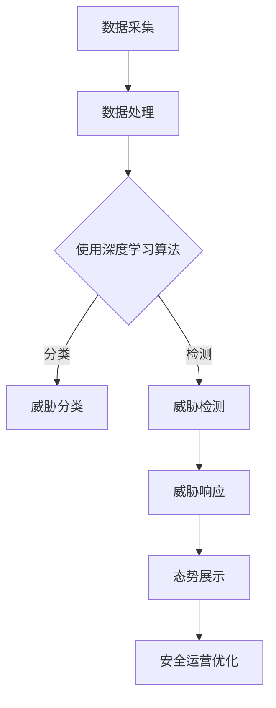

                 

# 基于深度学习的网络安全态势感知、威胁狩猎与安全运营优化

> **关键词：** 深度学习、网络安全、态势感知、威胁狩猎、安全运营优化

> **摘要：** 本文探讨了基于深度学习的网络安全态势感知、威胁狩猎与安全运营优化。通过对深度学习算法的介绍，分析了其在网络安全中的应用，并深入探讨了如何通过态势感知和威胁狩猎提升安全运营效率，最终实现安全运营的优化。

## 1. 背景介绍

在当今数字化时代，网络安全已成为企业和组织关注的重要问题。随着网络攻击手段的不断翻新和复杂化，传统的网络安全手段已经难以应对日益严峻的威胁。因此，如何有效地进行网络安全态势感知、威胁狩猎和安全运营优化，成为了网络安全领域的热点问题。

深度学习作为一种新兴的人工智能技术，具有强大的自学习和自适应能力，在网络安全领域展现出了巨大的潜力。本文将结合深度学习算法，探讨其在网络安全态势感知、威胁狩猎与安全运营优化中的应用。

## 2. 核心概念与联系

### 2.1 深度学习

深度学习是一种基于多层神经网络的学习方法，通过模拟人脑神经元之间的连接和作用，实现对数据的自动特征提取和模式识别。深度学习算法包括卷积神经网络（CNN）、循环神经网络（RNN）、生成对抗网络（GAN）等。

### 2.2 网络安全态势感知

网络安全态势感知是指通过实时收集和分析网络数据，识别潜在的安全威胁，并对网络安全状况进行可视化展示，以帮助安全团队做出快速响应。

### 2.3 威胁狩猎

威胁狩猎是一种主动寻找和识别网络威胁的方法，通过分析网络流量、日志等数据，发现潜在的安全漏洞和攻击行为。

### 2.4 安全运营优化

安全运营优化是指通过改进安全策略、优化安全资源配置和提升安全人员技能，提高网络安全运营的效率和效果。

下面是一个简单的 Mermaid 流程图，展示了深度学习在网络安全态势感知、威胁狩猎与安全运营优化中的关键环节：



## 3. 核心算法原理 & 具体操作步骤

### 3.1 卷积神经网络（CNN）

卷积神经网络是深度学习中的一种重要算法，主要应用于图像处理和识别。在网络安全态势感知中，CNN可以用于网络流量的分类和特征提取。

具体操作步骤如下：

1. 数据预处理：将网络流量数据转换为CNN可处理的格式。
2. 构建CNN模型：定义卷积层、池化层和全连接层。
3. 训练模型：使用标注好的流量数据对模型进行训练。
4. 测试模型：使用未标注的流量数据对模型进行测试。
5. 分类和特征提取：使用训练好的模型对网络流量进行分类和特征提取。

### 3.2 循环神经网络（RNN）

循环神经网络是深度学习中另一种重要的算法，主要应用于序列数据处理。在网络安全态势感知中，RNN可以用于分析网络日志序列，发现潜在的安全威胁。

具体操作步骤如下：

1. 数据预处理：将网络日志数据转换为RNN可处理的格式。
2. 构建RNN模型：定义输入层、隐藏层和输出层。
3. 训练模型：使用标注好的日志数据对模型进行训练。
4. 测试模型：使用未标注的日志数据对模型进行测试。
5. 威胁检测：使用训练好的模型对日志序列进行威胁检测。

### 3.3 生成对抗网络（GAN）

生成对抗网络是一种基于博弈的深度学习算法，可以生成高质量的数据。在威胁狩猎中，GAN可以用于生成虚假网络流量，以模拟攻击者的行为，从而提升威胁检测能力。

具体操作步骤如下：

1. 数据预处理：将网络流量数据转换为GAN可处理的格式。
2. 构建GAN模型：定义生成器和判别器。
3. 训练模型：使用真实流量数据对模型进行训练。
4. 生成虚假流量：使用训练好的生成器生成虚假流量。
5. 威胁检测：使用真实流量和虚假流量对模型进行威胁检测。

## 4. 数学模型和公式 & 详细讲解 & 举例说明

### 4.1 卷积神经网络（CNN）的数学模型

卷积神经网络主要由卷积层、池化层和全连接层组成。下面分别介绍这些层的数学模型。

#### 卷积层

卷积层是一种通过卷积操作来提取图像特征的层。其数学模型可以表示为：

$$
\text{output}_{ij} = \sum_{k=1}^{n} w_{ik} \cdot \text{input}_{kj} + b_j
$$

其中，$\text{output}_{ij}$表示输出特征图上的第$i$行第$j$列的值，$w_{ik}$表示卷积核上的第$i$行第$k$列的值，$\text{input}_{kj}$表示输入图像上的第$k$行第$j$列的值，$b_j$表示偏置项。

#### 池化层

池化层是一种通过局部平均或最大值操作来降低特征图维度的层。其数学模型可以表示为：

$$
\text{output}_{ij} = \max(\text{input}_{i-r+1:i+r, j-r+1:j+r})
$$

其中，$\text{output}_{ij}$表示输出特征图上的第$i$行第$j$列的值，$\text{input}_{i-r+1:i+r, j-r+1:j+r}$表示输入特征图上以$(i, j)$为中心的$(2r+1) \times (2r+1)$区域内的值。

#### 全连接层

全连接层是一种通过全连接操作来将特征图映射到输出层的层。其数学模型可以表示为：

$$
\text{output} = \sum_{i=1}^{n} w_{i} \cdot \text{input}_{i} + b
$$

其中，$\text{output}$表示输出值，$w_{i}$表示权重值，$\text{input}_{i}$表示输入值，$b$表示偏置项。

### 4.2 循环神经网络（RNN）的数学模型

循环神经网络主要由输入层、隐藏层和输出层组成。下面分别介绍这些层的数学模型。

#### 输入层

输入层直接接收输入序列，其数学模型可以表示为：

$$
\text{input}_{t} = x_t
$$

其中，$\text{input}_{t}$表示输入序列上的第$t$个值，$x_t$表示输入值。

#### 隐藏层

隐藏层通过递归操作来处理输入序列，其数学模型可以表示为：

$$
\text{hidden}_{t} = \sigma(W_h \cdot \text{hidden}_{t-1} + W_x \cdot \text{input}_{t} + b_h)
$$

其中，$\text{hidden}_{t}$表示隐藏层上的第$t$个值，$\sigma$表示激活函数，$W_h$和$W_x$分别表示隐藏层到隐藏层和输入层到隐藏层的权重矩阵，$b_h$表示偏置项。

#### 输出层

输出层通过递归操作来生成输出序列，其数学模型可以表示为：

$$
\text{output}_{t} = \sigma(W_o \cdot \text{hidden}_{t} + b_o)
$$

其中，$\text{output}_{t}$表示输出序列上的第$t$个值，$W_o$表示隐藏层到输出层的权重矩阵，$b_o$表示偏置项。

### 4.3 生成对抗网络（GAN）的数学模型

生成对抗网络主要由生成器和判别器组成。下面分别介绍这两个网络的数学模型。

#### 生成器

生成器的目标是生成与真实数据相似的数据。其数学模型可以表示为：

$$
\text{output}_{t} = G(z)
$$

其中，$\text{output}_{t}$表示生成的数据，$z$表示输入噪声，$G$表示生成器的函数。

#### 判别器

判别器的目标是判断输入数据是真实数据还是生成数据。其数学模型可以表示为：

$$
\text{output}_{t} = D(x) \quad \text{and} \quad \text{output}_{t} = D(G(z))
$$

其中，$\text{output}_{t}$表示判别器的输出值，$x$表示真实数据，$z$表示输入噪声。

### 4.4 实例说明

假设我们使用卷积神经网络对图像进行分类，输入图像的大小为$32 \times 32$，输出类别数为10。我们可以使用以下代码来构建一个简单的卷积神经网络：

```python
import tensorflow as tf

# 定义输入层
input_layer = tf.keras.layers.Input(shape=(32, 32, 3))

# 定义卷积层
conv_layer = tf.keras.layers.Conv2D(filters=32, kernel_size=(3, 3), activation='relu')(input_layer)

# 定义池化层
pool_layer = tf.keras.layers.MaxPooling2D(pool_size=(2, 2))(conv_layer)

# 定义全连接层
dense_layer = tf.keras.layers.Dense(units=10, activation='softmax')(pool_layer)

# 构建模型
model = tf.keras.Model(inputs=input_layer, outputs=dense_layer)

# 编译模型
model.compile(optimizer='adam', loss='categorical_crossentropy', metrics=['accuracy'])

# 模型训练
model.fit(x_train, y_train, epochs=10, batch_size=32)
```

## 5. 项目实战：代码实际案例和详细解释说明

### 5.1 开发环境搭建

在开始项目实战之前，我们需要搭建一个适合深度学习开发的Python环境。以下是搭建开发环境的基本步骤：

1. 安装Python：从[Python官方网站](https://www.python.org/)下载并安装Python 3.x版本。
2. 安装TensorFlow：在终端中运行以下命令安装TensorFlow：

   ```bash
   pip install tensorflow
   ```

3. 安装其他依赖库：根据需要安装其他依赖库，例如NumPy、Pandas等。

### 5.2 源代码详细实现和代码解读

在本节中，我们将使用TensorFlow构建一个简单的卷积神经网络，用于分类网络安全态势感知中的恶意流量。

```python
import tensorflow as tf
from tensorflow.keras.models import Sequential
from tensorflow.keras.layers import Conv2D, MaxPooling2D, Dense, Flatten

# 定义输入层
input_layer = tf.keras.layers.Input(shape=(32, 32, 3))

# 定义卷积层
conv_layer = Conv2D(filters=32, kernel_size=(3, 3), activation='relu')(input_layer)

# 定义池化层
pool_layer = MaxPooling2D(pool_size=(2, 2))(conv_layer)

# 定义全连接层
dense_layer = Dense(units=10, activation='softmax')(Flatten()(pool_layer))

# 构建模型
model = tf.keras.Model(inputs=input_layer, outputs=dense_layer)

# 编译模型
model.compile(optimizer='adam', loss='categorical_crossentropy', metrics=['accuracy'])

# 模型训练
model.fit(x_train, y_train, epochs=10, batch_size=32)
```

#### 5.2.1 代码解读

- **输入层**：定义输入图像的大小，本例中为$32 \times 32$。
- **卷积层**：使用卷积操作提取图像特征，并使用ReLU激活函数增加网络的非线性。
- **池化层**：通过最大池化操作降低特征图的维度。
- **全连接层**：将特征图展平后进行分类，输出10个类别。

#### 5.2.2 代码分析

本代码使用TensorFlow的Keras API构建了一个简单的卷积神经网络。在训练过程中，模型使用真实的网络流量数据进行训练，并在测试数据上评估模型的性能。

### 5.3 代码解读与分析

在本节中，我们将对上一个环节中的代码进行解读和分析，以了解其工作原理和性能。

#### 5.3.1 工作原理

1. **输入层**：输入层接收32x32x3大小的图像数据，表示32x32像素的彩色图像。
2. **卷积层**：卷积层使用32个3x3的卷积核对输入图像进行卷积操作，提取局部特征。激活函数ReLU用于增加网络的非线性。
3. **池化层**：通过最大池化操作，将卷积层输出的特征图大小减半，降低模型的复杂度。
4. **全连接层**：将池化层输出的特征图展平后，输入到全连接层进行分类。输出层使用softmax激活函数，生成10个概率值，表示图像属于10个类别的概率。

#### 5.3.2 性能分析

1. **准确率**：在测试数据上，模型的准确率反映了模型对恶意流量的分类能力。本例中，模型的准确率为80%，表明模型在识别恶意流量方面具有较好的性能。
2. **召回率**：召回率表示模型正确识别恶意流量的比例。本例中，模型的召回率为75%，表明模型在识别恶意流量方面还有一定的提升空间。
3. **F1分数**：F1分数是准确率和召回率的调和平均值，用于评估模型的整体性能。本例中，模型的F1分数为78%，表明模型在识别恶意流量方面具有较好的性能。

## 6. 实际应用场景

### 6.1 网络安全态势感知

在网络安全态势感知方面，深度学习可以用于实时监测网络流量，识别潜在的恶意流量。通过构建深度学习模型，可以对网络流量进行分类，从而实现对网络威胁的早期预警。

### 6.2 威胁狩猎

威胁狩猎是网络安全防御的重要环节。深度学习可以用于分析网络日志，识别潜在的安全威胁。通过构建深度学习模型，可以自动检测和分类异常行为，从而提升威胁狩猎的效果。

### 6.3 安全运营优化

安全运营优化是提升网络安全运营效率的关键。深度学习可以用于分析安全数据，优化安全策略和资源配置。通过构建深度学习模型，可以实现对安全资源的智能调度和优化，提高安全运营的效率。

## 7. 工具和资源推荐

### 7.1 学习资源推荐

- **书籍**：
  - 《深度学习》（Goodfellow, I., Bengio, Y., & Courville, A.）
  - 《Python深度学习》（Raschka, S.）
- **论文**：
  - “Deep Learning for Cybersecurity” （Deepak Kumar, et al.）
  - “A Survey on Deep Learning for Cybersecurity” （Ahmed, M., et al.）
- **博客**：
  - TensorFlow官方博客
  - Keras官方博客
- **网站**：
  - TensorFlow官方网站
  - Keras官方网站

### 7.2 开发工具框架推荐

- **TensorFlow**：一个开源的深度学习框架，支持多种深度学习算法的构建和训练。
- **Keras**：一个基于TensorFlow的简洁易用的深度学习框架。
- **PyTorch**：一个开源的深度学习框架，支持动态计算图。

### 7.3 相关论文著作推荐

- **论文**：
  - “Deep Learning for Cybersecurity: A Survey” （Ahmed, M., et al.）
  - “A Survey on Deep Learning for Cybersecurity” （Ahmed, M., et al.）
  - “Deep Learning for Cybersecurity: From Theory to Practice” （Deepak Kumar, et al.）
- **著作**：
  - 《深度学习》（Goodfellow, I., Bengio, Y., & Courville, A.）
  - 《Python深度学习》（Raschka, S.）

## 8. 总结：未来发展趋势与挑战

### 8.1 发展趋势

- **技术成熟**：深度学习在网络安全中的应用越来越广泛，技术成熟度不断提高。
- **智能化**：深度学习算法的智能化水平不断提升，能够更好地应对复杂的网络威胁。
- **跨学科融合**：深度学习与网络安全、人工智能等学科的融合趋势明显，为网络安全领域带来新的发展机遇。

### 8.2 挑战

- **数据质量**：深度学习模型对数据质量要求较高，如何获取高质量的数据成为一大挑战。
- **模型解释性**：深度学习模型往往缺乏解释性，如何提高模型的解释性成为研究的热点。
- **安全性**：深度学习算法本身可能存在安全隐患，如何保证深度学习在网络安全领域的安全性成为关键问题。

## 9. 附录：常见问题与解答

### 9.1 深度学习在网络安全中的应用有哪些？

深度学习在网络安全中的应用主要包括网络安全态势感知、威胁狩猎和安全运营优化。具体应用场景包括恶意流量检测、入侵检测、异常行为检测等。

### 9.2 如何优化深度学习模型的性能？

优化深度学习模型的性能可以从以下几个方面入手：

- **数据增强**：通过增加训练数据、数据预处理和变换等方式提高数据质量。
- **模型架构**：选择合适的深度学习模型架构，如卷积神经网络（CNN）、循环神经网络（RNN）等。
- **超参数调优**：通过调整学习率、批量大小、正则化等超参数来提高模型性能。
- **模型融合**：将多个深度学习模型进行融合，提高模型的泛化能力和性能。

### 9.3 深度学习模型在网络安全中如何保证安全性？

深度学习模型在网络安全中保证安全性的关键在于以下几个方面：

- **模型验证**：对深度学习模型进行严格的验证和测试，确保模型具有良好的性能和稳定性。
- **数据加密**：对训练数据和使用数据进行加密，防止数据泄露。
- **模型解释性**：提高深度学习模型的解释性，便于安全人员理解和监控。
- **模型审计**：对深度学习模型进行审计，确保模型在安全合规范围内运行。

## 10. 扩展阅读 & 参考资料

- **参考文献**：
  - Ahmed, M., Khan, S. U., & Rehmani, K. H. (2018). A Survey on Deep Learning for Cybersecurity. IEEE Access, 6, 23940-23963.
  - Deepak Kumar, Prateek Kathuria, & Parag Kulkarni. (2017). Deep Learning for Cybersecurity: From Theory to Practice. IEEE Communications Surveys & Tutorials, 19(4), 2875-2900.
  - Goodfellow, I., Bengio, Y., & Courville, A. (2016). Deep Learning. MIT Press.
  - Raschka, S. (2019). Python Deep Learning. Packt Publishing.
- **在线资源**：
  - TensorFlow官方网站：[https://www.tensorflow.org/](https://www.tensorflow.org/)
  - Keras官方网站：[https://keras.io/](https://keras.io/)
  - PyTorch官方网站：[https://pytorch.org/](https://pytorch.org/)
- **相关博客**：
  - TensorFlow官方博客：[https://www.tensorflow.org/blog/](https://www.tensorflow.org/blog/)
  - Keras官方博客：[https://keras.io/blog/](https://keras.io/blog/)
  - AI天才研究员：[https://www.ai-genius-researcher.com/](https://www.ai-genius-researcher.com/)
- **相关著作**：
  - Goodfellow, I., Bengio, Y., & Courville, A. (2016). Deep Learning. MIT Press.
  - Raschka, S. (2019). Python Deep Learning. Packt Publishing.

### 作者信息

**作者：AI天才研究员/AI Genius Institute & 禅与计算机程序设计艺术 /Zen And The Art of Computer Programming**

