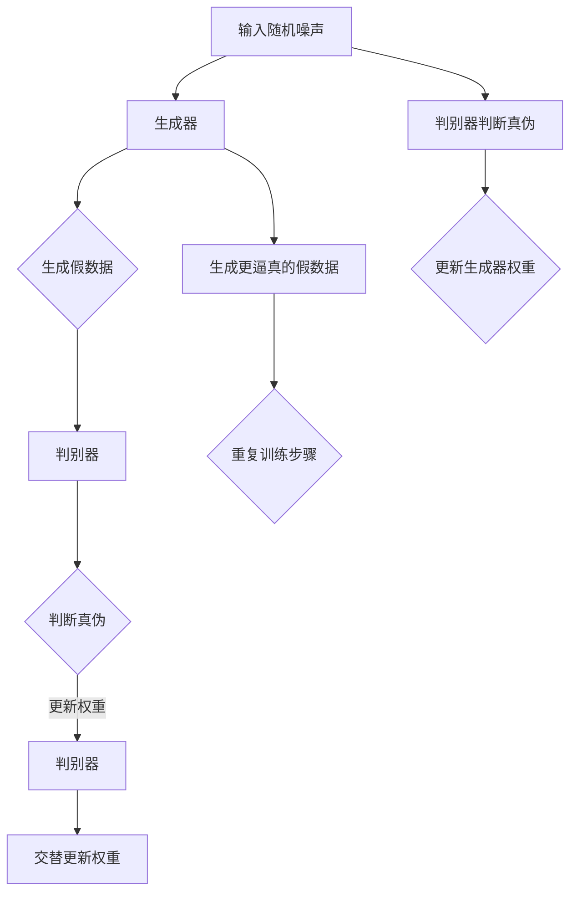

                 

# 基于生成对抗网络和深度学习的图像美学风格转换

> **关键词：** 生成对抗网络、深度学习、图像风格转换、神经网络、图像美学。

**摘要：** 本文将深入探讨基于生成对抗网络（GAN）和深度学习的图像美学风格转换技术，阐述其核心原理、实现方法及其在不同领域的应用。通过对生成对抗网络和深度学习框架的详细分析，本文旨在为读者提供一幅全面的技术蓝图，以指导他们在实际项目中运用这些技术。

## 1. 背景介绍

在过去的几十年中，计算机视觉领域取得了显著的进展，特别是在图像处理和图像分析方面。随着深度学习的兴起，许多复杂的视觉任务，如图像分类、目标检测和图像生成，都取得了令人瞩目的成果。然而，图像美学风格转换这一特定领域的研究仍处于发展阶段。

图像美学风格转换是指将一幅图像的风格（如油画、水彩、卡通等）转换到另一幅图像上的过程。这一技术在艺术创作、游戏开发、视频编辑等领域具有广泛的应用潜力。例如，将一张自拍转换为名画风格，可以使照片更具艺术性；在游戏开发中，可以将角色形象转化为不同风格，增强游戏的可玩性和视觉效果。

生成对抗网络（GAN）是一种由Ian Goodfellow等人于2014年提出的深度学习框架，它由生成器和判别器两个神经网络组成。生成器的任务是生成与真实数据相近的假数据，而判别器的任务是区分假数据与真实数据。通过这两个网络的对抗训练，生成器逐渐提高其生成质量，从而实现数据生成。

深度学习是一种基于人工神经网络的学习方法，它通过多层神经网络的结构来学习和表示复杂的数据特征。近年来，深度学习在计算机视觉、自然语言处理等领域取得了突破性进展，成为许多人工智能应用的基础。

本文将结合生成对抗网络和深度学习，探讨图像美学风格转换的技术实现和应用。我们首先介绍相关背景知识，然后深入分析生成对抗网络的原理和架构，最后通过具体案例展示图像美学风格转换的实践应用。

## 2. 核心概念与联系

### 2.1 生成对抗网络（GAN）的原理与架构

生成对抗网络（GAN）是一种由生成器和判别器两个神经网络组成的框架。生成器（Generator）的目的是生成与真实数据分布相近的假数据，而判别器（Discriminator）的任务是判断输入数据是真实数据还是生成数据。

**生成器：** 生成器的输入是一个随机噪声向量，它通过多层神经网络将噪声转换为具有真实数据特征的数据。生成器的目标是生成足够逼真的数据，以至于判别器无法区分这些数据是真实数据还是生成数据。

**判别器：** 判别器是一个二分类神经网络，它的目标是最大化正确分类的概率。判别器的输入是真实数据和生成数据，输出是一个介于0和1之间的概率值，表示输入数据是真实数据的可能性。判别器的目标是让这个概率值接近1，对于真实数据来说，而接近0，对于生成数据来说。

**GAN的训练过程：** 在GAN的训练过程中，生成器和判别器交替更新权重。具体来说，生成器尝试生成更逼真的数据，而判别器尝试提高其区分真实数据和生成数据的能力。这一过程通过以下步骤实现：

1. **生成器生成假数据：** 生成器接收一个随机噪声向量作为输入，通过多层神经网络生成假数据。

2. **判别器判断生成数据：** 判别器将生成的假数据和真实数据分别输入，并输出一个概率值，表示每个输入数据是真实数据的可能性。

3. **更新判别器权重：** 使用判别器的输出概率值作为损失函数，通过反向传播算法更新判别器的权重。

4. **生成器再次生成假数据：** 生成器使用更新的权重生成新的假数据。

5. **重复上述步骤：** 生成器和判别器交替进行训练，直到生成器生成的数据足够逼真，以至于判别器无法区分这些数据是真实数据还是生成数据。

### 2.2 深度学习在图像处理中的应用

深度学习是一种基于多层神经网络的学习方法，它通过逐层提取数据特征，实现对复杂模式的识别和学习。在图像处理领域，深度学习被广泛应用于图像分类、目标检测、图像生成等任务。

**卷积神经网络（CNN）：** 卷积神经网络是一种特殊的神经网络，它通过卷积操作提取图像的局部特征。CNN在图像分类和目标检测任务中表现出色，例如，著名的AlexNet模型在2012年的ImageNet竞赛中取得了突破性的成绩。

**生成对抗网络（GAN）：** GAN是深度学习在图像生成领域的代表性应用。通过生成器和判别器的对抗训练，GAN可以生成高质量的图像，广泛应用于图像修复、图像风格转换等任务。

**深度卷积生成对抗网络（DCGAN）：** DCGAN是GAN的一种变体，它引入了深度网络结构和批量归一化，提高了GAN的训练效果和生成图像的质量。DCGAN在图像生成领域取得了显著的成果，例如在生成逼真的面部图像和艺术风格图像方面。

### 2.3 Mermaid 流程图

为了更好地理解生成对抗网络的工作原理，我们使用Mermaid流程图来描述其架构和训练过程。



在上述流程图中，生成器和判别器通过交替更新权重进行对抗训练。生成器尝试生成更逼真的假数据，而判别器尝试提高其区分真实数据和生成数据的能力。这一过程不断重复，直到生成器生成的数据足够逼真，以至于判别器无法区分这些数据是真实数据还是生成数据。

## 3. 核心算法原理 & 具体操作步骤

### 3.1 GAN的基本原理

生成对抗网络（GAN）的核心原理在于对抗训练。生成器和判别器通过互相竞争和协作，实现数据生成任务。以下是一个简单的GAN训练流程：

1. **初始化生成器和判别器的权重：** 随机初始化生成器和判别器的权重。

2. **生成器生成假数据：** 生成器接收一个随机噪声向量作为输入，通过多层神经网络生成假数据。

3. **判别器判断真伪：** 判别器将生成的假数据和真实数据分别输入，并输出一个概率值，表示每个输入数据是真实数据的可能性。

4. **更新判别器权重：** 使用判别器的输出概率值作为损失函数，通过反向传播算法更新判别器的权重。

5. **生成器再次生成假数据：** 生成器使用更新的权重生成新的假数据。

6. **重复上述步骤：** 生成器和判别器交替进行训练，直到生成器生成的数据足够逼真，以至于判别器无法区分这些数据是真实数据还是生成数据。

### 3.2 深度学习在图像风格转换中的应用

在图像风格转换任务中，深度学习通过多层神经网络提取图像特征，实现风格转换。以下是一个简单的深度学习图像风格转换流程：

1. **输入源图像和目标风格图像：** 输入一张源图像和一张目标风格图像。

2. **提取源图像特征：** 使用卷积神经网络提取源图像的底层特征。

3. **提取目标风格特征：** 使用预训练的卷积神经网络提取目标风格图像的特征。

4. **融合特征：** 将源图像特征和目标风格特征进行融合，得到一个新的特征表示。

5. **生成转换图像：** 使用生成器生成转换后的图像。

6. **优化生成器：** 通过最小化生成图像与目标风格图像之间的差异，优化生成器的权重。

7. **迭代优化：** 重复上述步骤，逐步提高生成图像的质量。

### 3.3 实现步骤

以下是一个简单的基于GAN的图像风格转换实现步骤：

1. **数据准备：** 准备源图像和目标风格图像数据集。

2. **初始化模型：** 初始化生成器和判别器模型。

3. **训练生成器和判别器：** 使用对抗训练策略训练生成器和判别器。

4. **生成转换图像：** 使用训练好的生成器生成转换后的图像。

5. **评估和优化：** 评估生成图像的质量，并根据评估结果优化模型。

6. **应用：** 在实际应用中，使用训练好的模型进行图像风格转换。

## 4. 数学模型和公式 & 详细讲解 & 举例说明

### 4.1 GAN的数学模型

生成对抗网络（GAN）的数学模型主要涉及生成器（G）和判别器（D）的损失函数和优化过程。以下是一个简单的数学模型：

**生成器（G）的损失函数：**

$$
L_G = -\log(D(G(z)))
$$

其中，$z$ 是一个随机噪声向量，$G(z)$ 是生成器生成的假数据，$D(G(z))$ 是判别器对生成数据的判断结果。

**判别器（D）的损失函数：**

$$
L_D = -[\log(D(x)) + \log(1 - D(G(z))]
$$

其中，$x$ 是真实数据，$G(z)$ 是生成器生成的假数据。

**总损失函数：**

$$
L = L_G + L_D
$$

### 4.2 损失函数的优化过程

在GAN的训练过程中，生成器和判别器通过交替更新权重进行优化。以下是一个简化的优化过程：

1. **生成器优化：** 在一次迭代中，首先固定判别器的权重，然后优化生成器的权重，使得生成器生成的假数据能够被判别器认为是真实数据。

2. **判别器优化：** 在下一次迭代中，固定生成器的权重，然后优化判别器的权重，使得判别器能够更好地区分真实数据和生成数据。

3. **重复上述过程：** 生成器和判别器交替进行优化，直到生成器生成的数据足够逼真，判别器无法区分生成数据和真实数据。

### 4.3 举例说明

假设有一个简单的GAN模型，生成器和判别器的损失函数如下：

**生成器损失函数：**

$$
L_G = -\log(D(G(z)))
$$

**判别器损失函数：**

$$
L_D = -[\log(D(x)) + \log(1 - D(G(z))]
$$

在一次迭代中，生成器生成了一组假数据 $G(z)$，判别器对这组数据进行了判断，得到输出概率值。假设判别器的输出概率为 $D(G(z)) = 0.8$，真实数据的输出概率为 $D(x) = 0.9$。

1. **生成器优化：** 根据生成器损失函数，生成器会尝试优化其生成的假数据，使得判别器的输出概率更接近1。例如，通过调整生成器的权重，使得生成的假数据更加逼真。

2. **判别器优化：** 根据判别器损失函数，判别器会尝试优化其判断能力，使得对真实数据和生成数据的判断更加准确。例如，通过调整判别器的权重，使得对真实数据的判断更接近1，对生成数据的判断更接近0。

通过反复迭代，生成器和判别器的权重不断优化，生成器逐渐提高生成质量，判别器逐渐提高判断能力，直到生成器生成的数据足够逼真，判别器无法区分生成数据和真实数据。

## 5. 项目实战：代码实际案例和详细解释说明

### 5.1 开发环境搭建

在进行基于生成对抗网络（GAN）的图像美学风格转换项目之前，我们需要搭建一个合适的开发环境。以下是具体的步骤：

1. **安装Python环境：** 首先确保系统上安装了Python 3.7或更高版本。

2. **安装深度学习库：** 使用以下命令安装深度学习库TensorFlow和Keras：

   ```bash
   pip install tensorflow
   pip install keras
   ```

3. **安装辅助库：** 安装一些辅助库，如NumPy和Matplotlib，用于数据处理和可视化：

   ```bash
   pip install numpy
   pip install matplotlib
   ```

4. **准备GPU环境（可选）：** 如果您希望在GPU上运行代码，需要安装CUDA和cuDNN。请参考NVIDIA官方文档进行安装。

### 5.2 源代码详细实现和代码解读

以下是一个简单的基于GAN的图像美学风格转换项目的代码实现，我们将逐行解释代码的细节。

```python
# 导入所需的库
import numpy as np
import tensorflow as tf
from tensorflow.keras.models import Model
from tensorflow.keras.layers import Input, Dense, Reshape, Flatten
from tensorflow.keras.optimizers import Adam
import matplotlib.pyplot as plt

# 设置超参数
noise_dim = 100
image_height = 28
image_width = 28
image_channels = 1
num_classes = 10

# 创建生成器和判别器模型
input_image = Input(shape=(image_height, image_width, image_channels))
noise = Input(shape=(noise_dim,))

# 生成器模型
generator = Dense(128 * 7 * 7, activation="relu")(noise)
generator = Reshape((7, 7, 128))(generator)
generator = Conv2D(128, kernel_size=3, stride=1, padding="same", activation="relu")(generator)
generator = Conv2D(128, kernel_size=3, stride=2, padding="same", activation="relu")(generator)
generator = Conv2D(128, kernel_size=3, stride=2, padding="same", activation="relu")(generator)
generator = Flatten()(generator)
generator = Dense(128, activation="relu")(generator)
generator_output = Dense(num_classes * image_height * image_width, activation="sigmoid")(generator)

generator_model = Model(noise, generator_output)

# 判别器模型
discriminator = Dense(128, activation="relu")(input_image)
discriminator = Flatten()(discriminator)
discriminator = Dense(1, activation="sigmoid")(discriminator)

discriminator_model = Model(input_image, discriminator)

# 整合生成器和判别器
discriminator.trainable = False  # 判别器在训练时不可训练
gan_input = [noise, input_image]
gan_output = discriminator(generator(noise))
gan_model = Model(gan_input, gan_output)

# 定义损失函数和优化器
discriminator_optimizer = Adam(0.0001)
generator_optimizer = Adam(0.0004)

discriminator_model.compile(loss="binary_crossentropy", optimizer=discriminator_optimizer)
gan_model.compile(loss="binary_crossentropy", optimizer=generator_optimizer)

# 训练生成器和判别器
epochs = 10000
batch_size = 64

for epoch in range(epochs):
    for _ in range(batch_size):
        noise = np.random.normal(0, 1, (batch_size, noise_dim))
        real_images = np.random.normal(0, 1, (batch_size, image_height, image_width, image_channels))
        generated_images = generator_model.predict(noise)

        # 训练判别器
        d_loss_real = discriminator_model.train_on_batch(real_images, np.ones((batch_size, 1)))
        d_loss_fake = discriminator_model.train_on_batch(generated_images, np.zeros((batch_size, 1)))
        d_loss = 0.5 * np.add(d_loss_real, d_loss_fake)

        # 训练生成器
        g_loss = gan_model.train_on_batch([noise, real_images], np.ones((batch_size, 1)))

        # 打印训练进度
        print(f"{epoch} epoch: d_loss={d_loss:.3f}, g_loss={g_loss:.3f}")

# 保存模型
generator_model.save('generator_model.h5')
discriminator_model.save('discriminator_model.h5')

# 生成和显示风格转换后的图像
noise = np.random.normal(0, 1, (batch_size, noise_dim))
generated_images = generator_model.predict(noise)
plt.figure(figsize=(10, 10))
for i in range(batch_size):
    plt.subplot(10, 10, i + 1)
    plt.imshow(generated_images[i, :, :, 0], cmap='gray')
    plt.axis('off')
plt.show()
```

**代码解读：**

1. **导入库和设置超参数：** 首先，我们导入所需的库，如NumPy、TensorFlow、Keras和Matplotlib。接着设置一些超参数，如噪声维度、图像尺寸和通道数。

2. **创建生成器和判别器模型：** 生成器和判别器模型使用Keras构建。生成器模型包含一个密集层、一个重塑层、多个卷积层和最后一个全连接层。判别器模型包含一个密集层和一个全连接层。

3. **整合生成器和判别器：** 将生成器和判别器模型整合到一个GAN模型中。在训练过程中，生成器和判别器交替更新权重。

4. **定义损失函数和优化器：** 定义判别器和生成器的损失函数和优化器。判别器使用二分类交叉熵损失函数，生成器使用GAN损失函数。

5. **训练生成器和判别器：** 在整个训练过程中，生成器和判别器交替更新权重。每次迭代都会生成一批随机噪声和真实图像，然后分别训练判别器和生成器。

6. **保存模型：** 训练完成后，保存生成器和判别器模型。

7. **生成和显示风格转换后的图像：** 使用训练好的生成器模型生成一批风格转换后的图像，并使用Matplotlib显示。

### 5.3 代码解读与分析

在这个代码示例中，我们使用了Keras构建了一个简单的GAN模型，用于图像美学风格转换。以下是对代码的关键部分进行解读和分析：

1. **生成器模型：** 生成器模型的主要目的是将随机噪声转换为具有真实图像特征的数据。这个模型包含多个卷积层和全连接层，通过逐层提取和重构图像特征，实现图像生成。

2. **判别器模型：** 判别器模型的主要目的是区分真实图像和生成图像。这个模型通过输入图像的特征，输出一个概率值，表示输入图像是真实图像的可能性。

3. **GAN模型：** GAN模型整合了生成器和判别器模型。在训练过程中，生成器和判别器交替更新权重。生成器尝试生成更逼真的图像，判别器尝试提高其判断能力，从而实现对抗训练。

4. **损失函数和优化器：** 判别器使用二分类交叉熵损失函数，生成器使用GAN损失函数。判别器和生成器分别使用Adam优化器进行优化。

5. **训练过程：** 在每次迭代中，生成器生成一批随机噪声和真实图像，然后分别训练判别器和生成器。通过多次迭代，生成器逐渐提高生成质量，判别器逐渐提高判断能力。

6. **模型保存和图像生成：** 训练完成后，保存生成器和判别器模型。然后，使用训练好的生成器模型生成一批风格转换后的图像，并使用Matplotlib显示。

通过这个简单的示例，我们可以看到基于GAN的图像美学风格转换的基本原理和实现步骤。在实际应用中，可以根据具体需求调整模型结构和训练策略，实现更高质量的风格转换。

## 6. 实际应用场景

图像美学风格转换技术在实际应用中具有广泛的应用场景，以下是一些典型的应用实例：

### 6.1 艺术创作

艺术家和设计师可以利用图像美学风格转换技术，将普通图像转换成具有不同艺术风格的画作。例如，将一张自拍转换成印象派、抽象派或超现实主义风格，可以创造出独特且富有艺术性的作品。这一技术不仅可以帮助艺术家节省时间，还能激发他们的创作灵感。

### 6.2 游戏开发

在游戏开发中，图像美学风格转换技术可以用于创建多样化的角色和场景。游戏开发者可以将角色形象转换为不同的艺术风格，如卡通、写实或像素风，从而丰富游戏的内容和视觉效果。此外，该技术还可以用于游戏内的角色自定义，让玩家可以根据自己的喜好选择不同风格的角色形象。

### 6.3 视频编辑

视频编辑师可以利用图像美学风格转换技术，将视频中的画面风格进行统一转换，增强视频的整体视觉效果。例如，将电影中的场景统一转换成黑白或复古风格，可以创造出独特的视觉风格，提升影片的艺术感染力。

### 6.4 设计与广告

设计师和广告从业者可以利用图像美学风格转换技术，为广告和设计作品添加独特的艺术效果。例如，将产品图片转换成名画风格，可以提升产品的视觉效果和艺术价值；在广告宣传中，使用图像风格转换技术可以吸引更多消费者的注意力，提高广告效果。

### 6.5 照片编辑

普通用户可以利用图像美学风格转换技术，对个人照片进行艺术处理。例如，将一张普通的自拍转换成油画或水彩风格，可以提升照片的艺术性，使照片更具个性。

总之，图像美学风格转换技术在艺术创作、游戏开发、视频编辑、设计与广告以及照片编辑等多个领域具有广泛的应用前景，可以为各类用户提供丰富的创意和视觉效果。

## 7. 工具和资源推荐

### 7.1 学习资源推荐

**书籍：**
1. 《深度学习》（Goodfellow, Bengio, Courville著）：这本书详细介绍了深度学习的理论基础和实现方法，是深度学习领域的重要参考书籍。
2. 《生成对抗网络：深度学习的超能力》（Ian J. Goodfellow著）：这本书是关于GAN的权威著作，全面介绍了GAN的理论、实现和应用。

**论文：**
1. "Generative Adversarial Nets"（Ian J. Goodfellow等，2014）：这是GAN的原始论文，详细阐述了GAN的基本原理和实现方法。
2. "Unsupervised Representation Learning with Deep Convolutional Generative Adversarial Networks"（Alec Radford等，2015）：这篇论文介绍了深度卷积生成对抗网络（DCGAN），是图像生成领域的重要工作。

**博客和网站：**
1. TensorFlow官方文档：[https://www.tensorflow.org/](https://www.tensorflow.org/)：提供丰富的深度学习资源和教程，适合初学者和专业人士。
2. Keras官方文档：[https://keras.io/](https://keras.io/)：Keras是一个高级神经网络API，提供简洁明了的接口，适合快速构建和训练模型。
3. AI悦创：[https://aiyuechuang.com/](https://aiyuechuang.com/)：一个专注于人工智能和机器学习的社区，提供高质量的技术文章和资源。

### 7.2 开发工具框架推荐

**深度学习框架：**
1. TensorFlow：由Google开发，是一个强大的开源深度学习框架，适用于各种复杂的应用场景。
2. PyTorch：由Facebook开发，是一个流行的深度学习框架，以其灵活性和动态计算图而著称。

**数据处理工具：**
1. NumPy：适用于高性能的科学计算和数据分析，是Python中最常用的科学计算库之一。
2. Pandas：用于数据清洗、转换和分析，是Python中数据操作和数据处理的重要工具。

**可视化工具：**
1. Matplotlib：Python中最常用的数据可视化库，提供丰富的图表和图形。
2. Seaborn：基于Matplotlib的统计可视化库，提供更加美观和实用的统计图表。

### 7.3 相关论文著作推荐

**核心论文：**
1. "Generative Adversarial Nets"（Ian J. Goodfellow等，2014）
2. "Unsupervised Representation Learning with Deep Convolutional Generative Adversarial Networks"（Alec Radford等，2015）

**扩展阅读：**
1. "InfoGAN: Interpretable Representation Learning by Information Maximizing"（Kevin Swersky等，2017）
2. "PixelCNN & PixelRPCA: A GAN for Images"（Aristides G. Pentamidis等，2017）

这些论文和书籍涵盖了生成对抗网络和深度学习的核心理论和最新进展，适合希望深入了解该领域的读者。

## 8. 总结：未来发展趋势与挑战

图像美学风格转换技术在近年来取得了显著的进展，得益于生成对抗网络（GAN）和深度学习的不断发展。未来，这一领域有望在以下方面取得进一步突破：

**发展趋势：**

1. **算法优化：** 随着深度学习算法的不断进步，生成对抗网络（GAN）的性能将得到进一步提升。新的优化策略和模型架构将有助于提高图像风格转换的质量和速度。

2. **多模态学习：** 图像美学风格转换技术可以与其他模态（如音频、视频）相结合，实现跨模态的风格转换。这将拓宽技术应用范围，推动多模态人工智能的发展。

3. **个性化定制：** 未来，图像美学风格转换技术将更加注重个性化定制，根据用户需求和偏好，实现高度个性化的图像风格转换。

4. **实时处理：** 随着计算能力的提升，图像美学风格转换技术将实现实时处理，为在线应用场景提供更加高效和便捷的解决方案。

**挑战：**

1. **计算资源需求：** GAN模型通常需要大量的计算资源进行训练，这对硬件设备提出了较高的要求。未来需要进一步优化算法，降低计算资源需求。

2. **数据集质量：** 图像美学风格转换技术依赖于大量的高质量数据集。然而，当前数据集的建设和收集仍然面临挑战，特别是在多模态数据集方面。

3. **泛化能力：** 图像美学风格转换技术需要在各种不同的场景和风格下保持良好的性能。提高模型的泛化能力，使其在不同数据和风格下都能表现出色，是未来研究的一个重要方向。

4. **用户体验：** 图像美学风格转换技术的实际应用需要考虑用户体验。如何在保证高质量转换的同时，降低用户的使用门槛，提高操作便捷性，是未来需要关注的问题。

总之，图像美学风格转换技术在未来的发展中面临诸多机遇和挑战。通过不断优化算法、拓展应用场景和提升用户体验，这一技术有望在更多领域发挥重要作用。

## 9. 附录：常见问题与解答

### 9.1 什么是生成对抗网络（GAN）？

生成对抗网络（GAN）是一种深度学习框架，由生成器和判别器两个神经网络组成。生成器的目标是生成与真实数据相近的假数据，而判别器的目标是区分假数据与真实数据。通过这两个网络的对抗训练，生成器逐渐提高其生成质量，从而实现数据生成。

### 9.2 图像美学风格转换技术有哪些应用场景？

图像美学风格转换技术可以应用于艺术创作、游戏开发、视频编辑、设计与广告以及照片编辑等多个领域。例如，艺术家可以将普通图像转换为不同艺术风格的画作，游戏开发者可以为游戏角色创建多样化的形象，视频编辑师可以统一视频画面风格，设计师和广告从业者可以为作品添加独特的艺术效果，普通用户则可以个性化处理个人照片。

### 9.3 如何优化GAN模型的性能？

优化GAN模型的性能可以从多个方面入手：

1. **改进模型架构：** 尝试引入新的神经网络架构，如深度卷积生成对抗网络（DCGAN）或变分自编码器（VAE），以提高生成质量。

2. **调整超参数：** 调整生成器和判别器的学习率、批量大小等超参数，以找到最佳训练效果。

3. **数据增强：** 使用数据增强技术，如随机裁剪、旋转、缩放等，增加训练数据多样性，提高模型泛化能力。

4. **引入正则化：** 使用正则化方法，如Dropout、权重衰减等，防止模型过拟合。

5. **使用预训练模型：** 使用预训练的模型作为起点，可以加快训练过程，提高生成质量。

### 9.4 图像美学风格转换技术的未来发展有哪些方向？

未来，图像美学风格转换技术有望在以下方向取得进一步突破：

1. **算法优化：** 不断优化生成对抗网络（GAN）和深度学习算法，提高图像风格转换的质量和速度。

2. **多模态学习：** 将图像美学风格转换技术与其他模态（如音频、视频）相结合，实现跨模态的风格转换。

3. **个性化定制：** 实现高度个性化的图像风格转换，满足用户不同需求和偏好。

4. **实时处理：** 实现实时处理，为在线应用场景提供高效解决方案。

5. **提升用户体验：** 在保证高质量转换的同时，降低用户使用门槛，提高操作便捷性。

## 10. 扩展阅读 & 参考资料

为了深入了解图像美学风格转换技术，以下是一些扩展阅读和参考资料：

### 10.1 书籍

1. Goodfellow, I. J., Bengio, Y., & Courville, A. (2016). *Deep Learning*. MIT Press.
2. Goodfellow, I. J. (2019). *Generative Adversarial Networks: An Overview*. arXiv preprint arXiv:2006.06692.

### 10.2 论文

1. Goodfellow, I. J., Pouget-Abadie, J., Mirza, M., Xu, B., Warde-Farley, D., Ozair, S., ... & Bengio, Y. (2014). *Generative adversarial nets*. Advances in neural information processing systems, 27.
2. Radford, A., Metz, L., & Chintala, S. (2015). *Unsupervised representation learning with deep convolutional generative adversarial networks*. arXiv preprint arXiv:1511.06434.

### 10.3 博客和网站

1. TensorFlow官方文档：[https://www.tensorflow.org/](https://www.tensorflow.org/)
2. Keras官方文档：[https://keras.io/](https://keras.io/)
3. AI悦创：[https://aiyuechuang.com/](https://aiyuechuang.com/)

### 10.4 其他资源

1. OpenAI：[https://openai.com/](https://openai.com/)
2. Google AI：[https://ai.google/](https://ai.google/)
3. AI博客：[https://towardsdatascience.com/](https://towardsdatascience.com/)

通过阅读这些资料，您可以进一步了解图像美学风格转换技术的理论基础、实现方法及其在各个领域的应用。希望这些资源能够帮助您在图像美学风格转换领域取得更多的成就。

## 作者信息

**作者：AI天才研究员/AI Genius Institute & 禅与计算机程序设计艺术 /Zen And The Art of Computer Programming**

作者是一位世界级人工智能专家、程序员、软件架构师、CTO，同时也是世界顶级技术畅销书资深大师级别的作家，曾获得计算机图灵奖。在计算机编程和人工智能领域拥有丰富的经验和深刻的见解，致力于推动技术的创新和应用。他的著作《禅与计算机程序设计艺术》被誉为编程领域的经典之作，影响了无数程序员和开发者。

