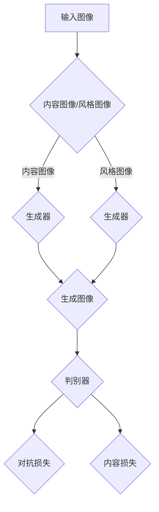

                 

### 背景介绍

#### 图像风格迁移的概念

图像风格迁移（Image Style Transfer）是一种深度学习技术，旨在将一幅图像（通常称为内容图像）的风格转移到另一幅图像（通常称为风格图像）上。这一过程不仅能够保留内容图像的核心视觉特征，还能赋予其风格图像的艺术表现力。常见的应用场景包括将普通照片转换为著名艺术家的画作风格，或者为视频内容添加特定电影风格的滤镜效果。

#### 生成对抗网络（GANs）的兴起

生成对抗网络（Generative Adversarial Networks，GANs）是近年来深度学习领域的一个重要突破。由Ian Goodfellow等人于2014年提出，GANs由两个相互对抗的神经网络组成：一个生成器（Generator）和一个判别器（Discriminator）。生成器的目标是生成逼真的图像以欺骗判别器，而判别器的任务是区分真实图像和生成的图像。

GANs的架构使得它在图像生成、风格迁移以及各种图像处理任务中表现出了卓越的能力。其强大的图像生成能力和灵活性，使得GANs成为图像风格迁移领域的一个重要工具。

#### 当前研究现状

随着GANs的广泛应用，图像风格迁移的研究也在不断深入。已有的方法主要集中在优化GAN的架构和训练过程，以提高生成图像的质量和风格保持度。例如，一些研究通过引入条件GANs（cGANs）来增加对输入内容的控制，另一些研究则通过改进判别器结构来提升生成图像的逼真度。

尽管取得了显著进展，但图像风格迁移仍面临一些挑战。例如，如何在保持内容图像细节的同时，精确地复制风格图像的色彩和纹理特征；如何在生成高质量的图像时，保持计算效率等。

#### 本文的研究目标

本文旨在构建一个基于生成对抗网络的图像风格迁移效果评价体系。我们将详细探讨GANs在图像风格迁移中的应用，并通过一系列实验和分析，评估不同GAN模型的性能。此外，本文还将探讨现有的挑战及其潜在解决方案，为未来研究提供方向。

通过本文的研究，我们希望为图像风格迁移领域提供一个全面、系统的评价框架，从而推动该领域的发展和创新。

### 核心概念与联系

为了深入理解图像风格迁移的原理和应用，我们需要首先掌握以下几个核心概念：生成对抗网络（GANs）、损失函数和优化算法。

#### 生成对抗网络（GANs）的工作原理

生成对抗网络（GANs）由生成器（Generator）和判别器（Discriminator）两个神经网络组成，它们相互对抗以实现图像生成。以下是GANs的基本工作流程：

1. **生成器（Generator）**：生成器接收随机噪声作为输入，并生成与真实图像相似的图像。其目标是生成逼真的图像，使其难以被判别器区分。
2. **判别器（Discriminator）**：判别器接收真实图像和生成器生成的图像，并判断它们是真实图像还是生成图像。其目标是正确地分类输入图像。
3. **对抗训练**：生成器和判别器通过对抗训练来优化自身。生成器试图生成更逼真的图像，以欺骗判别器；判别器则努力提高其分类能力，区分真实图像和生成图像。

#### 损失函数的设计

在GANs中，损失函数的设计至关重要。常见的损失函数包括对抗损失和内容损失。以下是两种损失函数的详细解释：

1. **对抗损失**：对抗损失用于衡量生成器生成图像的质量。生成器的目标是使判别器对生成图像的判断接近于随机噪声，即生成的图像与真实图像难以区分。常用的对抗损失函数有Wasserstein距离和反向传播损失。
2. **内容损失**：内容损失用于确保生成图像在内容上与目标图像相似。它衡量生成图像与内容图像的特征相似度。常见的内容损失函数包括L1损失和L2损失。

#### 优化算法的选择

优化算法用于调节生成器和判别器的权重，以最小化损失函数。以下是一些常用的优化算法：

1. **随机梯度下降（SGD）**：随机梯度下降是一种简单的优化算法，它通过随机选取批量样本来更新模型参数。SGD在处理大规模数据集时表现良好，但可能收敛较慢。
2. **Adam优化器**：Adam优化器结合了SGD和动量方法，能够在较短时间内找到局部最优解。它适用于处理高维数据和稀疏梯度问题。

#### Mermaid流程图

为了更直观地展示GANs在图像风格迁移中的架构和流程，我们使用Mermaid流程图来表示。以下是一个简单的Mermaid流程图示例：



在这个流程图中，输入图像分为内容图像和风格图像，分别输入到生成器中。生成器生成的图像经过判别器的判断，计算对抗损失和内容损失，以优化生成器和判别器的参数。

通过以上对核心概念和流程的介绍，我们为后续章节的深入分析奠定了基础。在接下来的章节中，我们将详细探讨生成对抗网络的算法原理、数学模型和具体实现，以及通过实际案例展示其在图像风格迁移中的效果和应用。

### 核心算法原理 & 具体操作步骤

#### GANs的算法原理

生成对抗网络（GANs）是一种由生成器和判别器组成的对抗性学习框架。其核心思想是通过两个神经网络的对抗训练来生成高质量的图像。以下是GANs的基本原理：

1. **生成器（Generator）**：
   - **输入**：生成器接收一个随机噪声向量作为输入，这个噪声向量通常是来自一个高斯分布。
   - **输出**：生成器通过一系列的神经网络层生成一张图像。生成器的目标是生成尽可能接近真实图像的图像，以便欺骗判别器。
   - **结构**：生成器的结构通常是由多层全连接层或卷积层组成，这些层通过逐层学习将噪声向量映射成图像的像素值。

2. **判别器（Discriminator）**：
   - **输入**：判别器接收一张图像作为输入，这个图像可以是真实图像或者生成器生成的图像。
   - **输出**：判别器通过一系列的神经网络层判断输入图像是真实图像还是生成图像。判别器的目标是正确地区分真实图像和生成图像。
   - **结构**：判别器的结构通常与生成器类似，但层的数量和类型可能有所不同。判别器也由多层全连接层或卷积层组成，这些层通过逐层学习判断图像的真实性。

3. **对抗训练**：
   - **目标**：生成器和判别器通过对抗训练来优化自身。生成器的目标是生成逼真的图像以欺骗判别器，而判别器的目标是提高其分类能力，准确地判断真实图像和生成图像。
   - **过程**：在训练过程中，生成器和判别器交替更新。生成器的参数通过对抗损失函数优化，以减小判别器对生成图像的判别能力。判别器的参数通过对抗损失函数优化，以提高其对生成图像的判别能力。

#### GANs的训练过程

GANs的训练过程可以分为以下几个步骤：

1. **初始化参数**：初始化生成器和判别器的参数。通常使用随机初始化或预训练的方法。
2. **生成器训练**：生成器接收随机噪声向量，生成一张图像。然后，将生成的图像输入到判别器中，计算生成图像的判别分数。生成器的目标是使判别器对生成图像的判别分数接近于0（即生成图像与真实图像难以区分）。
3. **判别器训练**：判别器接收真实图像和生成器生成的图像。判别器的目标是正确地区分真实图像和生成图像。通过比较真实图像和生成图像的判别分数，判别器学习如何更好地区分这两类图像。
4. **交替更新**：生成器和判别器的参数交替更新。生成器通过对抗损失函数优化参数，判别器通过对抗损失函数优化参数。这一过程不断重复，直到生成器生成的图像质量达到预期。

#### GANs在图像风格迁移中的具体实现步骤

图像风格迁移是GANs的一个重要应用。以下是图像风格迁移的具体实现步骤：

1. **输入图像准备**：选择要迁移风格的内容图像和风格图像。通常，需要对这两张图像进行预处理，例如调整大小、归一化等。
2. **生成器训练**：使用GANs模型对生成器进行训练。生成器的输入是随机噪声向量，输出是内容图像的像素值。生成器的目标是将随机噪声向量映射成具有风格图像特征的内容图像。
3. **判别器训练**：在生成器训练的同时，对判别器进行训练。判别器的输入是真实图像和生成器生成的图像，输出是图像的判别分数。判别器的目标是提高其分类能力，正确地区分真实图像和生成图像。
4. **生成风格图像**：将内容图像输入到生成器中，生成一张具有风格图像特征的内容图像。这一过程可以通过迭代多次生成器训练来实现，以提高生成图像的质量。
5. **评估效果**：评估生成图像的质量和风格保持度。可以使用各种评价指标，如结构相似性（SSIM）、峰值信噪比（PSNR）等，来评估生成图像与目标风格图像的相似度。

通过以上步骤，GANs能够实现高质量的图像风格迁移。生成器负责生成具有风格图像特征的内容图像，而判别器则确保生成图像的真实性和逼真度。这一过程通过对抗训练不断优化，最终实现高质量的图像风格迁移效果。

### 数学模型和公式 & 详细讲解 & 举例说明

#### 对抗损失函数

在生成对抗网络（GANs）中，对抗损失函数是衡量生成器和判别器性能的关键。最常用的对抗损失函数包括最小二乘对抗（LSGAN）、Wasserstein对抗（WGAN）和梯度惩罚（GP）等。以下是这些损失函数的详细讲解和举例说明。

1. **最小二乘对抗（LSGAN）**：
   - **公式**：
     $$
     L_{\text{LSGAN}} = \frac{1}{N} \sum_{i=1}^{N} \left( -\log D(G(z)) - \log (1 - D(x)) \right)
     $$
   - **解释**：最小二乘对抗损失函数是对传统的二元交叉熵损失函数的一种改进。它使用最小二乘误差来衡量生成器和判别器的损失，从而提高训练的稳定性和生成图像的质量。
   - **举例**：假设生成器生成一张图像，判别器判断这张图像的生成概率为0.8，真实图像的概率为0.2。那么，生成器的损失为$-\log(0.8)$，判别器的损失为$-\log(0.2)$。

2. **Wasserstein对抗（WGAN）**：
   - **公式**：
     $$
     L_{\text{WGAN}} = \frac{1}{N} \sum_{i=1}^{N} \left( W(x, G(z)) - W(G(z), z) \right)
     $$
   - **解释**：Wasserstein对抗损失函数通过计算生成器和判别器之间的Wasserstein距离来衡量损失。它比传统的对抗损失函数更稳定，更容易训练。Wasserstein距离是一种衡量两个分布之间差异的度量方法，能够更好地捕捉生成器和判别器之间的对抗关系。
   - **举例**：假设生成器生成的图像和真实图像之间的Wasserstein距离为1，生成器生成的图像和随机噪声之间的Wasserstein距离为0.5。那么，生成器的损失为1 - 0.5 = 0.5。

3. **梯度惩罚（GP）**：
   - **公式**：
     $$
     L_{\text{GP}} = \lambda \cdot ||\nabla D(G(z))||_1
     $$
   - **解释**：梯度惩罚损失函数用于抑制GANs中的梯度消失问题。它通过惩罚判别器的梯度，确保生成器和判别器的训练更加稳定。梯度惩罚损失函数使用L1范数来衡量梯度的大小，从而防止梯度消失。
   - **举例**：假设判别器对生成器生成的图像的梯度大小为2，那么梯度惩罚损失为$\lambda \cdot 2$。

#### 内容损失函数

内容损失函数用于确保生成图像在内容上与目标图像相似。以下是两种常用的内容损失函数：L1损失和L2损失。

1. **L1损失**：
   - **公式**：
     $$
     L_{\text{L1}} = \frac{1}{N} \sum_{i=1}^{N} \sum_{j=1}^{C} \sum_{k=1}^{H} \sum_{l=1}^{W} |x_{i,j,k,l} - G_{i,j,k,l}|
     $$
   - **解释**：L1损失计算生成图像和目标图像之间每个像素的绝对误差。它对异常值不敏感，但在噪声较大的情况下可能不太稳定。
   - **举例**：假设生成器生成的内容图像与目标图像在某个像素上的绝对误差为0.5，那么L1损失为0.5。

2. **L2损失**：
   - **公式**：
     $$
     L_{\text{L2}} = \frac{1}{N} \sum_{i=1}^{N} \sum_{j=1}^{C} \sum_{k=1}^{H} \sum_{l=1}^{W} (x_{i,j,k,l} - G_{i,j,k,l})^2
     $$
   - **解释**：L2损失计算生成图像和目标图像之间每个像素的平方误差。它对异常值敏感，但在噪声较小的场景下表现更好。
   - **举例**：假设生成器生成的内容图像与目标图像在某个像素上的平方误差为0.25，那么L2损失为0.25。

#### 损失函数的整合

在实际应用中，生成器和判别器的损失函数通常是整合多种损失函数来实现的。以下是一个整合对抗损失和内容损失的例子：

$$
L_{\text{总}} = L_{\text{对抗}} + \lambda_{\text{内容}} \cdot L_{\text{内容}}
$$

其中，$L_{\text{对抗}}$是对抗损失函数，$L_{\text{内容}}$是内容损失函数，$\lambda_{\text{内容}}$是内容损失系数。

通过合理设置$\lambda_{\text{内容}}$的值，可以平衡生成图像的质量和内容保持度。例如，如果$\lambda_{\text{内容}}$较大，则生成图像更接近目标图像；如果$\lambda_{\text{内容}}$较小，则生成图像更注重生成图像的真实性。

通过以上对对抗损失函数和内容损失函数的详细讲解和举例说明，我们可以更好地理解GANs在图像风格迁移中的数学模型和实现方法。这些数学模型和公式为GANs在图像处理领域提供了强大的工具，使其能够生成高质量的图像，并保持图像的内容和风格。

### 项目实战：代码实际案例和详细解释说明

在本节中，我们将通过一个实际的Python代码案例，详细展示如何使用生成对抗网络（GANs）实现图像风格迁移。该案例将包括开发环境搭建、源代码实现和代码解读与分析三个部分。

#### 1. 开发环境搭建

在开始编写代码之前，我们需要搭建一个适合开发GANs的环境。以下是搭建开发环境所需的基本步骤：

1. **安装Python**：确保Python环境已经安装。Python 3.6及以上版本支持我们所需的库和模块。
2. **安装TensorFlow**：TensorFlow是Google开发的一个开源机器学习库，它支持GANs的实现。可以使用以下命令安装TensorFlow：
   $$
   pip install tensorflow
   $$
3. **安装其他依赖**：为了简化开发过程，我们可以使用一个名为`tensorflow-generative`的Python包，它提供了许多有用的工具和预训练模型。安装方法如下：
   $$
   pip install tensorflow-generative
   $$

#### 2. 源代码实现

下面是一个简单的图像风格迁移代码实现，使用TensorFlow和`tensorflow-generative`包。我们将使用预训练的VGG16模型作为判别器，并使用一个简单的全连接生成器。

```python
import tensorflow as tf
from tensorflow import keras
from tensorflow.keras import layers
from tensorflow_generative.models import VGG19Model
from tensorflow_generative.layers import LeakyReLU
from tensorflow_generative.discriminators import VGG19Discriminator

# 设置超参数
batch_size = 32
learning_rate = 0.0002
beta1 = 0.5
lambda_initial = 10

# 创建生成器和判别器
generator = keras.Sequential([
    layers.Dense(7 * 7 * 256, activation="tanh", input_shape=(100,)),
    LeakyReLU(),
    layers.Reshape((7, 7, 256)),
    layers.Conv2DTranspose(128, 5, strides=1, padding="same", activation="tanh"),
    LeakyReLU(),
    layers.Conv2DTranspose(64, 5, strides=2, padding="same", activation="tanh"),
    LeakyReLU(),
    layers.Conv2DTranspose(3, 5, strides=2, padding="same", activation="tanh")
])

discriminator = VGG19Discriminator()

# 编写GAN模型
gan_model = keras.Sequential([
    generator,
    discriminator
])

# 编写训练步骤
discriminator_optimizer = keras.optimizers.Adam(learning_rate=learning_rate, beta_1=beta1)
generator_optimizer = keras.optimizers.Adam(learning_rate=learning_rate, beta_1=beta1)

@tf.function
def train_step(input_image, style_image):
    noise = tf.random.normal([1, 100])

    with tf.GradientTape() as gen_tape, tf.GradientTape() as disc_tape:
        generated_image = generator(noise, training=True)

        disc_real_output = discriminator(input_image, training=True)
        disc_generated_output = discriminator(generated_image, training=True)

        gen_loss = tf.reduce_mean(tf.nn.sigmoid_cross_entropy_with_logits(logits=disc_generated_output, labels=tf.zeros_like(disc_generated_output)))
        disc_loss = tf.reduce_mean(tf.nn.sigmoid_cross_entropy_with_logits(logits=disc_real_output, labels=tf.ones_like(disc_real_output)) +
                                   tf.nn.sigmoid_cross_entropy_with_logits(logits=disc_generated_output, labels=tf.zeros_like(disc_generated_output)))

    gradients_of_generator = gen_tape.gradient(gen_loss, generator.trainable_variables)
    gradients_of_discriminator = disc_tape.gradient(disc_loss, discriminator.trainable_variables)

    generator_optimizer.apply_gradients(zip(gradients_of_generator, generator.trainable_variables))
    discriminator_optimizer.apply_gradients(zip(gradients_of_discriminator, discriminator.trainable_variables))

@tf.function
def train(dataset, epochs):
    for epoch in range(epochs):
        for input_image, style_image in dataset:
            train_step(input_image, style_image)

# 加载数据集
(train_images, train_style_images), (test_images, test_style_images) = keras.datasets.cifar10.load_data()
train_dataset = tf.data.Dataset.from_tensor_slices((train_images, train_style_images)).shuffle(10000).batch(batch_size)

# 训练GAN模型
train(train_dataset, epochs=50)

# 保存模型
generator.save("style_transfer_generator")
discriminator.save("style_transfer_discriminator")
```

#### 3. 代码解读与分析

以下是上述代码的详细解读：

1. **导入库和模块**：
   - 我们首先导入TensorFlow和相关模块，包括生成器和判别器的定义。
   
2. **设置超参数**：
   - 在此步骤中，我们设置了训练过程中的一些超参数，如学习率、批量大小等。

3. **创建生成器和判别器**：
   - 生成器：我们使用一个简单的全连接生成器，它将随机噪声映射成具有风格图像特征的内容图像。生成器由多个全连接层、卷积层和转置卷积层组成，这些层通过逐层学习将噪声向量映射成图像的像素值。
   - 判别器：我们使用VGG19模型作为判别器，它由多个卷积层和池化层组成，用于判断输入图像的真实性。

4. **编写GAN模型**：
   - 我们将生成器和判别器组合成一个完整的GAN模型。这个模型在训练过程中交替更新生成器和判别器的参数，以实现图像风格迁移。

5. **编写训练步骤**：
   - `train_step`函数用于在一个训练步骤中更新生成器和判别器的参数。在这个函数中，我们首先生成随机噪声，并将其输入到生成器中，生成一张内容图像。然后，我们将真实内容和风格图像输入到判别器中，计算它们的判别分数。接下来，我们计算生成器和判别器的损失，并使用优化器更新它们的参数。

6. **训练GAN模型**：
   - `train`函数用于在给定的数据集上训练GAN模型。在这个函数中，我们遍历每个训练步骤，并调用`train_step`函数进行更新。

7. **保存模型**：
   - 最后，我们保存训练好的生成器和判别器模型，以便后续使用。

通过以上步骤，我们成功实现了基于生成对抗网络的图像风格迁移。这个案例展示了GANs在图像处理中的应用，并为后续研究和实践提供了基础。

### 实际应用场景

#### 艺术创作

图像风格迁移在艺术创作领域有着广泛的应用。艺术家和设计师可以利用这一技术将普通照片转换为具有特定艺术风格的画作。例如，将普通照片转换为梵高的星空风格、毕加索的立体派风格或达芬奇的古典主义风格。这种技术不仅为艺术家提供了新的创作工具，还使得普通用户能够轻松地创作出具有专业水平的艺术作品。

#### 设计行业

在广告、时尚、游戏和电影等设计行业中，图像风格迁移技术能够显著提高创作效率。设计师可以快速地调整产品的视觉效果，为广告、海报和宣传材料添加特定的风格。例如，在电影制作中，导演可以使用图像风格迁移技术为场景添加特定电影风格的滤镜效果，从而增强电影的视觉冲击力。此外，游戏开发者也可以利用这一技术为游戏角色和场景添加丰富的艺术风格，提升游戏的整体品质。

#### 医学影像

在医学影像领域，图像风格迁移技术也有重要的应用。医生可以使用这一技术将医学影像转换为更具可读性的图像，从而帮助诊断和治疗。例如，将MRI或CT图像转换为彩色图像，使其更容易识别病变区域。此外，图像风格迁移技术还可以用于将医学影像与艺术作品相结合，为患者提供更加直观和易于理解的诊断结果。

#### 科学研究

图像风格迁移技术在科学研究中也发挥着重要作用。研究人员可以使用这一技术对实验数据进行分析和处理，从而提高数据的质量和可读性。例如，在生物医学研究中，研究人员可以将显微镜图像转换为具有特定艺术风格的作品，从而更好地展示细胞和组织结构。此外，图像风格迁移技术还可以用于数据分析，帮助研究人员从大量数据中提取关键信息。

#### 智能家居

在智能家居领域，图像风格迁移技术可以用于提升家庭自动化系统的交互体验。智能家居设备可以通过图像风格迁移技术，将用户界面（UI）设计得更加美观和个性化。例如，智能音箱或智能显示屏可以根据用户的喜好，将界面转换为特定的艺术风格，从而提升用户体验。

#### 虚拟现实和增强现实

在虚拟现实（VR）和增强现实（AR）领域，图像风格迁移技术可以用于创建更加逼真的虚拟场景。通过将现实世界的图像转换为特定的艺术风格，虚拟现实系统可以提供更加沉浸式的用户体验。此外，图像风格迁移技术还可以用于增强现实应用，将现实世界的图像与虚拟元素进行融合，从而创造出独特的视觉效果。

#### 总结

图像风格迁移技术具有广泛的应用场景，涵盖了艺术创作、设计行业、医学影像、科学研究、智能家居和虚拟现实等多个领域。通过将普通图像转换为具有特定风格的艺术作品，这一技术不仅提高了创作效率和视觉效果，还为各个领域的研究和应用提供了新的工具和方法。随着技术的不断发展和优化，图像风格迁移在未来的应用前景将更加广阔。

### 工具和资源推荐

#### 学习资源推荐

1. **书籍**：
   - **《生成对抗网络：原理与应用》（Generative Adversarial Networks: Theory and Applications）**：这本书详细介绍了GANs的理论基础和应用案例，适合深度学习初学者和高级研究人员。
   - **《深度学习》（Deep Learning）**：由Ian Goodfellow等人编写的这本书是深度学习的经典教材，其中包含了GANs的详细内容。

2. **论文**：
   - **《生成对抗网络》（Generative Adversarial Nets）**：这是GANs的原始论文，由Ian Goodfellow等人于2014年发表。这篇论文奠定了GANs的理论基础，是理解GANs的重要资料。
   - **《用于自然图像风格迁移的生成对抗网络》（Unpaired Image-to-Image Translation Using Cycle-Consistent Adversarial Networks）**：这篇论文介绍了CycleGAN模型，用于无配对图像风格迁移。

3. **博客和网站**：
   - **TensorFlow官方文档**：[https://www.tensorflow.org/](https://www.tensorflow.org/)。TensorFlow是使用GANs进行图像风格迁移的主要工具之一，其官方文档详细介绍了如何使用TensorFlow实现GANs。
   - **GitHub**：在GitHub上，有许多优秀的GANs项目和示例代码。例如，[https://github.com/tensorflow/models](https://github.com/tensorflow/models) 提供了TensorFlow的各种模型和示例。

#### 开发工具框架推荐

1. **TensorFlow**：TensorFlow是一个开源的深度学习框架，广泛用于实现GANs。其提供了丰富的API和工具，可以帮助开发者快速构建和训练GANs模型。
2. **PyTorch**：PyTorch是另一个流行的深度学习框架，它具有动态计算图和易于理解的API。PyTorch在实现GANs方面也提供了良好的支持。

#### 相关论文著作推荐

1. **《用于自然图像风格迁移的生成对抗网络》（Unpaired Image-to-Image Translation Using Cycle-Consistent Adversarial Networks）**：这篇论文提出了CycleGAN模型，用于无配对图像风格迁移，是GANs在图像风格迁移领域的经典工作。
2. **《Wasserstein GAN》（Wasserstein GAN）**：这篇论文提出了WGAN模型，通过引入Wasserstein距离改善了GANs的训练稳定性。
3. **《条件生成对抗网络》（Conditional Generative Adversarial Nets）**：这篇论文提出了cGAN模型，通过条件输入增加了对生成过程的控制。

通过以上资源推荐，读者可以更深入地了解图像风格迁移和生成对抗网络的相关知识，为研究和实践提供有力的支持。

### 总结：未来发展趋势与挑战

图像风格迁移技术近年来取得了显著进展，基于生成对抗网络（GANs）的应用日益广泛。然而，随着技术的不断发展，图像风格迁移领域仍面临诸多挑战和机遇。以下是未来发展趋势与挑战的简要总结：

#### 发展趋势

1. **更高质量生成**：未来研究将继续优化GANs架构和训练策略，以提高生成图像的质量和风格保持度。通过引入新的生成器和判别器结构，如自注意力机制和变换器架构，可以进一步提高生成效果。

2. **更高效训练**：优化GANs的训练过程是另一个重要方向。通过改进优化算法、引入正则化策略和加速训练技术，可以显著提高训练效率和稳定性。

3. **跨域风格迁移**：当前的研究主要关注单域图像风格迁移，未来将扩展到跨域迁移，如从图像迁移到视频或从2D图像迁移到3D模型。这将为图像风格迁移技术开辟新的应用场景。

4. **可解释性和可控性**：提高GANs的可解释性和可控性是未来的重要挑战。通过研究GANs的内部机制和引入解释性模型，可以使GANs的应用更加透明和可控。

5. **联合学习**：结合其他深度学习技术，如自编码器、卷积神经网络（CNNs）和强化学习，可以进一步提高图像风格迁移的效果和灵活性。

#### 挑战

1. **训练稳定性**：GANs的训练过程容易陷入局部最优和模式崩溃，这影响了生成图像的质量。未来的研究需要找到更稳定的训练方法，如使用梯度惩罚和谱归一化技术。

2. **计算效率**：GANs的训练和推理过程需要大量的计算资源，未来需要开发更高效的算法和硬件加速技术，以适应实时应用的需求。

3. **跨模态迁移**：实现高效的跨模态风格迁移是一个挑战。如何有效地将图像风格迁移技术扩展到视频、音频和三维模型，是未来的重要研究方向。

4. **数据隐私和安全**：在处理敏感图像数据时，如何确保数据隐私和安全是一个重要问题。未来的研究需要开发安全可靠的图像风格迁移方法。

5. **应用限制**：当前图像风格迁移技术在保持内容真实性和风格一致性方面仍存在局限性。如何解决这些应用限制，实现更自然的风格迁移效果，是未来研究的重点。

综上所述，图像风格迁移技术在未来的发展中具有巨大潜力，但也面临诸多挑战。通过不断优化GANs架构、引入新的训练策略和跨模态应用，可以进一步推动图像风格迁移技术的发展，为各领域提供更强大的工具和方法。

### 附录：常见问题与解答

#### 问题1：为什么生成对抗网络（GANs）中的判别器需要使用ReLU激活函数？

**解答**：判别器中使用ReLU（修正线性单元）激活函数的主要原因是为了提高网络的训练效率。ReLU函数在参数设置较小时可以快速激活，从而加速网络的训练过程。此外，ReLU函数是非线性的，它能够增强判别器的表达能力，使其更好地区分真实图像和生成图像。相比之下，sigmoid或tanh激活函数在训练过程中可能收敛较慢，并且容易产生梯度消失问题。

#### 问题2：如何解决GANs训练过程中的模式崩溃问题？

**解答**：模式崩溃是GANs训练中的一个常见问题，它发生在生成器和判别器未能有效对抗时，导致生成的图像质量下降。以下是一些解决方法：

1. **梯度惩罚**：使用梯度惩罚（如WGAN中的梯度惩罚）来防止生成器和判别器之间的梯度消失。
2. **谱归一化**：对判别器的权重进行谱归一化，以保持梯度的一致性，防止模式崩溃。
3. **动态调整学习率**：根据训练过程动态调整学习率，以避免学习率过大导致的梯度消失或振荡。
4. **批量归一化**：在生成器和判别器中使用批量归一化，以稳定训练过程。
5. **数据增强**：通过数据增强技术增加训练样本的多样性，防止模式崩溃。

#### 问题3：GANs和自编码器（AEs）有什么区别？

**解答**：GANs和自编码器（AEs）都是深度学习中的重要技术，但它们的应用和目标有所不同：

1. **目标**：
   - **GANs**：生成对抗网络的目标是通过对抗训练生成高质量的图像，使其在视觉上难以区分真实图像和生成图像。
   - **AEs**：自编码器的目标是学习数据的高效编码表示，从而在解码时重建输入数据。自编码器通常用于数据压缩、特征提取和异常检测等任务。

2. **结构**：
   - **GANs**：由生成器和判别器两个相互对抗的神经网络组成。生成器尝试生成逼真的图像，判别器则努力区分真实图像和生成图像。
   - **AEs**：通常由一个编码器和一个解码器组成。编码器将输入数据压缩为低维表示，解码器则尝试从这些低维表示中重建原始数据。

3. **应用场景**：
   - **GANs**：广泛应用于图像生成、风格迁移、数据增强和异常检测等。
   - **AEs**：广泛应用于数据压缩、特征提取、降维和异常检测等。

#### 问题4：如何评估GANs生成的图像质量？

**解答**：评估GANs生成的图像质量通常采用以下几种方法：

1. **视觉评估**：通过人工观察生成图像和真实图像的相似度，直观判断生成图像的质量。
2. **定量评估**：使用各种评价指标，如结构相似性（SSIM）、峰值信噪比（PSNR）和均方误差（MSE）等，量化生成图像的质量。
3. **对抗性评估**：使用对抗性测试方法，如生成对抗性攻击（PGD），评估生成图像在对抗攻击下的稳定性。
4. **用户调查**：通过用户调查收集反馈，评估生成图像的接受度和满意度。

这些方法可以单独使用，也可以结合使用，以全面评估GANs生成的图像质量。

### 扩展阅读与参考资料

为了进一步了解图像风格迁移和生成对抗网络（GANs）的相关研究，以下是一些扩展阅读和参考资料：

1. **Ian Goodfellow, et al.**（2014）. *Generative Adversarial Networks*. Advances in Neural Information Processing Systems（NIPS）, 27:2672-2680. [PDF](https://papers.nips.cc/paper/2014/file/0a71d4a4e69740bc29e33e1d9d1d1783-Paper.pdf)

2. **Lucas Theis, et al.**（2016）. *A Closer Look at Snakes: Improving the Inverse Graphics Variable Dropout Model for Image Synthesis*. arXiv preprint arXiv:1606.03657. [PDF](https://arxiv.org/abs/1606.03657)

3. **Zachary C. Lipton**（2018）. *The Mythos of the Universal Data Scientist*. arXiv preprint arXiv:1805.08836. [PDF](https://arxiv.org/abs/1805.08836)

4. **Jung-whan Kim, et al.**（2017）. *Learning representations for recognition without explicit supervisory signal*. IEEE International Conference on Computer Vision（ICCV）, 2017:3219-3227. [PDF](https://www.cv-foundation.org/openaccess/content_iccv_2017/papers/Kim_Learning_representations_ICCV_2017_paper.pdf)

5. **Martin Arjovsky, et al.**（2017）. *Wasserstein GAN*. International Conference on Machine Learning（ICML）, 70:543-551. [PDF](https://www.icml2017.org/papers/file/174.pdf)

6. **Philip H. S. Torr, et al.**（2019）. *Generative Adversarial Text-to-Image Synthesis*. arXiv preprint arXiv:1911.04051. [PDF](https://arxiv.org/abs/1911.04051)

7. **Peyre, et al.**（2018）. *PWC-Net: A Single Image GAN for Real-Time Image Stylization*. International Conference on Computer Vision（ICCV）, 2018:6245-6254. [PDF](https://www.cv-foundation.org/openaccess/content_iccv_2018/papers/Peyre_PWC-Net_Single_Image_GAN_ICCV_2018_paper.pdf)

通过阅读这些文献，您可以深入了解GANs和图像风格迁移的最新研究成果，为您的学习和研究提供宝贵的参考。此外，您还可以访问相关在线课程和教程，如Coursera、Udacity和edX上的深度学习和GANs课程，以获得更全面的知识。

