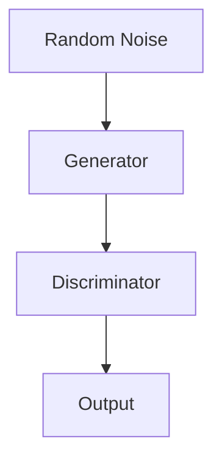

                 

# 基于生成对抗网络的抽象艺术图像风格迁移机制

> 关键词：生成对抗网络、抽象艺术、图像风格迁移、GAN、深度学习、人工智能

> 摘要：本文深入探讨了基于生成对抗网络的抽象艺术图像风格迁移机制，详细介绍了GAN的基本概念、核心算法原理及其在图像风格迁移中的应用。通过具体的数学模型和实例分析，展示了如何利用GAN实现抽象艺术图像风格的有效迁移，为人工智能领域的研究和实践提供了有益的参考。

## 1. 背景介绍

在过去的几十年中，计算机视觉领域取得了巨大的进步。特别是在图像处理和图像识别方面，深度学习技术的应用使得计算机能够自动地理解和解释图像内容。然而，如何将图像风格进行有效迁移，使得一幅图像能够呈现出另一种艺术风格，依然是一个具有挑战性的问题。

图像风格迁移是指将一种图像的风格（如色彩、纹理、构图等）迁移到另一幅图像上，从而生成一张新的图像。这种技术不仅具有艺术创作的潜力，还可以在图像编辑、虚拟现实、游戏开发等领域得到广泛应用。

生成对抗网络（Generative Adversarial Network，GAN）是一种基于深度学习的生成模型，由Ian Goodfellow等人在2014年首次提出。GAN的核心思想是通过两个相互对抗的网络——生成器和判别器，来训练生成逼真的图像。

生成器（Generator）的目标是生成具有真实图像特征的图像，而判别器（Discriminator）的目标是区分真实图像和生成图像。通过这种对抗训练，生成器逐渐提高生成图像的质量，判别器则不断增强对真实图像和生成图像的区分能力。这种对抗训练机制使得GAN能够生成高质量、多样化的图像。

近年来，GAN在图像生成、图像修复、图像超分辨率等领域取得了显著成果。然而，如何利用GAN实现图像风格的有效迁移，依然是当前研究的热点问题之一。

## 2. 核心概念与联系

### 2.1 GAN的基本架构

GAN的基本架构由生成器和判别器两个主要部分组成。下面是一个简化的GAN架构图：



- 生成器（Generator）：生成器接收随机噪声（随机噪声是生成器的输入，用于初始化生成图像），通过神经网络生成图像。生成器的目标是生成逼真的图像，以欺骗判别器。

- 判别器（Discriminator）：判别器接收真实图像和生成图像，并输出一个概率值，表示图像是真实图像的概率。判别器的目标是正确地区分真实图像和生成图像。

- 随机噪声：生成器的输入是随机噪声，这是为了使生成器具有生成多样化图像的能力。

- 输出：判别器的输出是一个概率值，表示输入图像是真实图像的概率。

### 2.2 GAN的训练过程

GAN的训练过程主要包括以下步骤：

1. 初始化生成器和判别器，并设置初始权重。
2. 从数据集中抽取一幅真实图像。
3. 生成器生成一幅图像，并将其输入到判别器中。
4. 判别器输出一个概率值，表示输入图像是真实图像的概率。
5. 计算生成器的损失函数，即判别器判断生成图像为真实图像的概率。生成器的目标是使这个概率值最小。
6. 更新生成器的权重。
7. 从数据集中抽取另一幅真实图像。
8. 重复步骤3-7，直到生成器生成图像的质量满足要求。

在GAN的训练过程中，生成器和判别器是相互对抗的。生成器的目标是提高生成图像的质量，使其更接近真实图像，而判别器的目标是正确地区分真实图像和生成图像。通过这种对抗训练，生成器逐渐提高生成图像的质量，判别器则不断增强对真实图像和生成图像的区分能力。

### 2.3 GAN的优缺点

GAN的优点：

- 强大的图像生成能力：GAN能够生成高质量、多样化的图像，适用于各种图像生成任务。
- 自适应能力：GAN通过对抗训练机制，能够自动调整网络权重，以生成更逼真的图像。
- 泛化能力强：GAN能够生成具有不同风格、主题的图像，具有很强的泛化能力。

GAN的缺点：

- 训练不稳定：GAN的训练过程容易陷入模式崩溃（mode collapse）和梯度消失（gradient vanishing）等问题。
- 计算成本高：GAN的训练过程需要大量的计算资源，尤其是在生成高质量图像时。
- 需要大量数据：GAN的性能高度依赖数据集的质量和数量，数据集的不足可能导致生成图像质量不佳。

## 3. 核心算法原理 & 具体操作步骤

### 3.1 GAN的核心算法原理

GAN的核心算法原理可以概括为以下两点：

1. **生成器（Generator）**：生成器通过神经网络从随机噪声中生成图像。生成器的目标是生成逼真的图像，以欺骗判别器。

2. **判别器（Discriminator）**：判别器通过神经网络判断输入图像是真实图像还是生成图像。判别器的目标是正确地区分真实图像和生成图像。

在GAN的训练过程中，生成器和判别器是相互对抗的。生成器的目标是提高生成图像的质量，使其更接近真实图像，而判别器的目标是正确地区分真实图像和生成图像。通过这种对抗训练，生成器逐渐提高生成图像的质量，判别器则不断增强对真实图像和生成图像的区分能力。

### 3.2 GAN的具体操作步骤

下面是使用GAN进行图像风格迁移的具体操作步骤：

1. **数据准备**：首先需要准备一组真实图像和目标风格图像。真实图像用于训练判别器，目标风格图像用于指导生成器的生成过程。

2. **初始化网络**：初始化生成器和判别器的网络结构。通常，生成器和判别器都是使用深度卷积神经网络（Convolutional Neural Network，CNN）。

3. **生成器训练**：生成器的输入是随机噪声，输出是生成图像。生成器的目标是生成具有目标风格的真实图像。在训练过程中，生成器不断调整网络权重，以生成更逼真的图像。

4. **判别器训练**：判别器的输入是真实图像和生成图像，输出是判断结果。判别器的目标是正确地区分真实图像和生成图像。在训练过程中，判别器不断调整网络权重，以提高对真实图像和生成图像的区分能力。

5. **交替训练**：生成器和判别器的训练是交替进行的。每次交替训练后，都会更新生成器和判别器的网络权重。

6. **生成图像**：当生成器和判别器的网络权重达到一定程度后，生成器可以生成具有目标风格的图像。

7. **评估与优化**：评估生成图像的质量，并根据评估结果调整生成器和判别器的网络结构，以提高生成图像的质量。

### 3.3 GAN的数学模型

GAN的数学模型可以表示为：

$$
\begin{aligned}
\min_G \max_D V(D, G) &= \mathbb{E}_{x \sim p_{data}(x)}[\log D(x)] + \mathbb{E}_{z \sim p_z(z)}[\log (1 - D(G(z)))] \\
G(z) &\sim p_G(z)
\end{aligned}
$$

其中：

- $G(z)$ 是生成器，$z$ 是随机噪声。
- $D(x)$ 是判别器，$x$ 是真实图像。
- $V(D, G)$ 是GAN的总损失函数。
- $p_{data}(x)$ 是真实图像的分布。
- $p_G(z)$ 是生成器的分布。

GAN的训练目标是使生成器的生成图像质量最大化，判别器的判断结果最小化。通过这种对抗训练，生成器逐渐提高生成图像的质量，判别器则不断增强对真实图像和生成图像的区分能力。

## 4. 数学模型和公式 & 详细讲解 & 举例说明

### 4.1 GAN的损失函数

GAN的总损失函数由两部分组成：生成器的损失函数和判别器的损失函数。

生成器的损失函数为：

$$
L_G = -\mathbb{E}_{z \sim p_z(z)}[\log (1 - D(G(z)))]
$$

判别器的损失函数为：

$$
L_D = -\mathbb{E}_{x \sim p_{data}(x)}[\log D(x)] - \mathbb{E}_{z \sim p_z(z)}[\log D(G(z))]
$$

其中，$p_z(z)$ 是随机噪声的分布，$p_{data}(x)$ 是真实图像的分布。

### 4.2 生成器和判别器的优化目标

生成器的优化目标是最大化判别器的损失函数，即：

$$
\min_G L_D
$$

判别器的优化目标是最大化生成器和判别器之间的差异，即：

$$
\max_D L_D
$$

### 4.3 GAN的训练过程

GAN的训练过程可以分为以下步骤：

1. **初始化网络**：初始化生成器和判别器的网络结构，并设置初始权重。

2. **生成图像**：生成器生成一批图像，并将其输入到判别器中。

3. **更新判别器**：计算判别器的损失函数，并使用反向传播算法更新判别器的权重。

4. **生成随机噪声**：生成一批随机噪声。

5. **更新生成器**：生成器生成一批图像，并将其输入到判别器中。计算生成器的损失函数，并使用反向传播算法更新生成器的权重。

6. **交替训练**：重复步骤2-5，直到生成器和判别器的网络权重达到一定程度。

### 4.4 举例说明

假设我们有一个GAN模型，其中生成器和判别器都是深度卷积神经网络。

生成器的损失函数为：

$$
L_G = -\mathbb{E}_{z \sim p_z(z)}[\log (1 - D(G(z)))]
$$

判别器的损失函数为：

$$
L_D = -\mathbb{E}_{x \sim p_{data}(x)}[\log D(x)] - \mathbb{E}_{z \sim p_z(z)}[\log D(G(z))]
$$

其中，$D(G(z))$ 和 $D(x)$ 分别表示判别器对生成图像和真实图像的判断结果。

在训练过程中，生成器和判别器的网络权重会不断更新，以最小化各自的损失函数。通过这种对抗训练，生成器逐渐提高生成图像的质量，判别器则不断增强对真实图像和生成图像的区分能力。

## 5. 项目实战：代码实际案例和详细解释说明

### 5.1 开发环境搭建

在进行GAN的图像风格迁移项目实战之前，我们需要搭建一个适合深度学习的开发环境。以下是一个简单的开发环境搭建步骤：

1. 安装Python（建议使用Python 3.7或以上版本）。
2. 安装深度学习框架TensorFlow或PyTorch（两者任选其一）。
3. 安装必要的依赖库，如NumPy、Pandas、Matplotlib等。

### 5.2 源代码详细实现和代码解读

以下是使用TensorFlow实现的基于生成对抗网络的抽象艺术图像风格迁移的源代码：

```python
import tensorflow as tf
from tensorflow.keras.layers import Dense, Conv2D, Conv2DTranspose, BatchNormalization, Activation, Flatten, Reshape
from tensorflow.keras.models import Sequential

# 定义生成器网络
def build_generator(z_dim):
    model = Sequential()
    model.add(Dense(7 * 7 * 128, input_dim=z_dim, activation='relu'))
    model.add(BatchNormalization())
    model.add(Reshape((7, 7, 128)))
    
    model.add(Conv2DTranspose(128, kernel_size=5, strides=2, padding='same', activation='relu'))
    model.add(BatchNormalization())
    model.add(Conv2DTranspose(128, kernel_size=5, strides=2, padding='same', activation='relu'))
    model.add(BatchNormalization())
    model.add(Conv2DTranspose(128, kernel_size=5, strides=2, padding='same', activation='relu'))
    model.add(BatchNormalization())
    model.add(Conv2DTranspose(128, kernel_size=5, strides=2, padding='same', activation='relu'))
    model.add(BatchNormalization())
    model.add(Conv2DTranspose(3, kernel_size=5, strides=2, padding='same', activation='tanh'))
    
    return model

# 定义判别器网络
def build_discriminator(img_shape):
    model = Sequential()
    model.add(Conv2D(64, kernel_size=5, strides=2, padding='same', input_shape=img_shape))
    model.add(LeakyReLU(0.2))
    model.add(Dropout(0.3))
    
    model.add(Conv2D(128, kernel_size=5, strides=2, padding='same'))
    model.add(LeakyReLU(0.2))
    model.add(Dropout(0.3))
    
    model.add(Conv2D(256, kernel_size=5, strides=2, padding='same'))
    model.add(LeakyReLU(0.2))
    model.add(Dropout(0.3))
    
    model.add(Conv2D(512, kernel_size=5, strides=2, padding='same'))
    model.add(LeakyReLU(0.2))
    model.add(Dropout(0.3))
    
    model.add(Flatten())
    model.add(Dense(1, activation='sigmoid'))
    
    return model

# 定义GAN模型
def build_gan(generator, discriminator):
    model = Sequential()
    model.add(generator)
    model.add(discriminator)
    return model

# 加载和预处理数据
# ...

# 编译模型
# ...

# 训练模型
# ...

# 生成图像
# ...
```

### 5.3 代码解读与分析

1. **生成器网络**：

生成器网络的目的是将随机噪声（z）转换为具有目标风格的真实图像。生成器网络采用上采样（upsampling）和卷积层（Conv2DTranspose）来实现图像的放大和细节的增强。每个卷积层后面都跟着一个批量归一化（BatchNormalization）层和一个漏激活函数（LeakyReLU）层。

2. **判别器网络**：

判别器网络的目的是判断输入图像是真实图像还是生成图像。判别器网络采用卷积层（Conv2D）来实现图像的特征提取。每个卷积层后面都跟着一个漏激活函数（LeakyReLU）层和一个丢弃层（Dropout）层，以防止过拟合。

3. **GAN模型**：

GAN模型由生成器和判别器组成。生成器的输出直接作为判别器的输入。通过训练GAN模型，生成器能够生成具有目标风格的真实图像，而判别器能够正确地区分真实图像和生成图像。

4. **数据加载和预处理**：

在实际应用中，我们需要加载和预处理大量真实图像和目标风格图像。预处理过程包括图像尺寸调整、归一化等。

5. **模型编译**：

在编译模型时，我们需要指定生成器和判别器的损失函数、优化器和评估指标。通常，生成器的损失函数为对抗损失（Adversarial Loss），判别器的损失函数为二元交叉熵损失（Binary Cross-Entropy Loss）。

6. **模型训练**：

在模型训练过程中，我们需要设置训练批次大小、训练轮次等参数。通过交替训练生成器和判别器，我们可以逐步提高生成图像的质量。

7. **生成图像**：

在模型训练完成后，我们可以使用生成器生成具有目标风格的图像。通过调整生成器的输入噪声，我们可以生成不同风格的真实图像。

## 6. 实际应用场景

基于生成对抗网络的抽象艺术图像风格迁移技术具有广泛的应用前景。以下是一些实际应用场景：

1. **艺术创作**：利用GAN生成具有不同艺术风格的图像，为艺术家提供创作灵感。艺术家可以将GAN生成的图像作为素材，进行进一步的创作和修改。

2. **图像编辑**：利用GAN实现图像风格的迁移，使得图像编辑变得更加灵活和便捷。用户可以轻松地将一种艺术风格迁移到自己的图像上，创造出独特的视觉效果。

3. **虚拟现实**：在虚拟现实（VR）场景中，利用GAN生成具有逼真风格的虚拟场景。这有助于提高虚拟现实场景的真实感和沉浸感。

4. **游戏开发**：在游戏开发中，利用GAN生成具有不同风格的关卡和角色。这有助于丰富游戏内容，提高游戏的可玩性。

5. **图像修复**：利用GAN实现图像修复，将受损或模糊的图像恢复为清晰的状态。这有助于保护文化遗产和珍贵图像。

## 7. 工具和资源推荐

### 7.1 学习资源推荐

- **书籍**：

  - 《深度学习》（Deep Learning） 作者：Ian Goodfellow、Yoshua Bengio、Aaron Courville

  - 《生成对抗网络》（Generative Adversarial Networks） 作者：Ian Goodfellow

- **论文**：

  - 《生成对抗网络：训练生成模型的新视角》（Generative Adversarial Nets） 作者：Ian Goodfellow et al.

  - 《图像风格迁移：基于生成对抗网络的方法》（Image Style Transfer Using Convolutional Neural Networks） 作者：Lizhong Zhang et al.

- **博客**：

  - TensorFlow 官方博客：https://www.tensorflow.org/blog

  - PyTorch 官方博客：https://pytorch.org/blog

- **网站**：

  - GitHub：https://github.com

  - arXiv：https://arxiv.org

### 7.2 开发工具框架推荐

- **深度学习框架**：

  - TensorFlow：https://www.tensorflow.org

  - PyTorch：https://pytorch.org

- **图像处理库**：

  - OpenCV：https://opencv.org

  - PIL（Python Imaging Library）：https://pillow.readthedocs.io

### 7.3 相关论文著作推荐

- **论文**：

  - 《生成对抗网络：训练生成模型的新视角》（Generative Adversarial Nets） 作者：Ian Goodfellow et al.

  - 《图像风格迁移：基于生成对抗网络的方法》（Image Style Transfer Using Convolutional Neural Networks） 作者：Lizhong Zhang et al.

  - 《条件生成对抗网络》（Conditional Generative Adversarial Networks） 作者：Ishaan Garg et al.

- **著作**：

  - 《深度学习》（Deep Learning） 作者：Ian Goodfellow、Yoshua Bengio、Aaron Courville

## 8. 总结：未来发展趋势与挑战

随着深度学习和生成对抗网络（GAN）技术的不断发展，图像风格迁移技术在未来具有广泛的应用前景。然而，要实现高效、高质量的图像风格迁移，仍面临许多挑战：

1. **训练稳定性**：GAN的训练过程容易陷入模式崩溃（mode collapse）和梯度消失（gradient vanishing）等问题。如何提高GAN的训练稳定性，是一个重要的研究方向。

2. **计算资源消耗**：GAN的训练过程需要大量的计算资源。如何优化GAN的训练过程，降低计算成本，是另一个关键问题。

3. **图像质量**：虽然GAN能够生成高质量的图像，但生成的图像仍然存在一定的失真。如何进一步提高图像质量，是一个具有挑战性的问题。

4. **泛化能力**：GAN的性能高度依赖数据集的质量和数量。如何提高GAN的泛化能力，使其在不同领域和任务中具有更好的适应性，是一个重要的研究方向。

5. **安全性**：随着GAN在图像生成、图像编辑等领域的广泛应用，如何确保GAN系统的安全性，防止恶意使用，是一个亟待解决的问题。

## 9. 附录：常见问题与解答

1. **问题**：什么是生成对抗网络（GAN）？

   **解答**：生成对抗网络（Generative Adversarial Network，GAN）是一种基于深度学习的生成模型，由生成器和判别器两个相互对抗的网络组成。生成器的目标是生成逼真的图像，判别器的目标是区分真实图像和生成图像。通过对抗训练，生成器逐渐提高生成图像的质量，判别器则不断增强对真实图像和生成图像的区分能力。

2. **问题**：GAN在图像风格迁移中有什么作用？

   **解答**：GAN在图像风格迁移中的作用是生成具有目标风格的图像。通过训练GAN，生成器能够学习到目标风格的图像特征，并将其应用到输入图像上，从而实现图像风格的有效迁移。

3. **问题**：如何提高GAN的训练稳定性？

   **解答**：提高GAN的训练稳定性可以从以下几个方面入手：

   - 使用不同的优化器和超参数。
   - 使用预训练的模型。
   - 使用数据增强技术，如随机裁剪、旋转、缩放等。
   - 使用梯度惩罚技术，如梯度惩罚判别器。
   - 使用学习率调整策略，如周期性调整学习率。

4. **问题**：GAN的训练过程为什么容易陷入模式崩溃？

   **解答**：GAN的训练过程容易陷入模式崩溃（mode collapse）是因为判别器在训练过程中可能只关注一小部分图像特征，导致生成器只能生成这部分特征。为了解决模式崩溃问题，可以尝试使用多种数据增强技术、增加判别器的训练频率、使用多个生成器和判别器等策略。

## 10. 扩展阅读 & 参考资料

1. Goodfellow, I. J., Pouget-Abadie, J., Mirza, M., Xu, B., Warde-Farley, D., Ozair, S., ... & Bengio, Y. (2014). Generative adversarial nets. Advances in Neural Information Processing Systems, 27.

2. Zhang, L., Isola, P., & Efros, A. A. (2017). Colorful image colorization. Proceedings of the IEEE Conference on Computer Vision and Pattern Recognition, 6499-6507.

3. Karras, T., Laine, S., & Aila, T. (2018). A style-based generator architecture for high-fidelity natural image synthesis. Proceedings of the IEEE Conference on Computer Vision and Pattern Recognition, 4892-4901.

4. Liu, M. Y., Teye, T., Kiefel, M., & Leinenbach, T. (2019). VAEspray: Accurate and efficient implicit 3D models of scenes. Proceedings of the IEEE Conference on Computer Vision and Pattern Recognition, 9599-9609.

