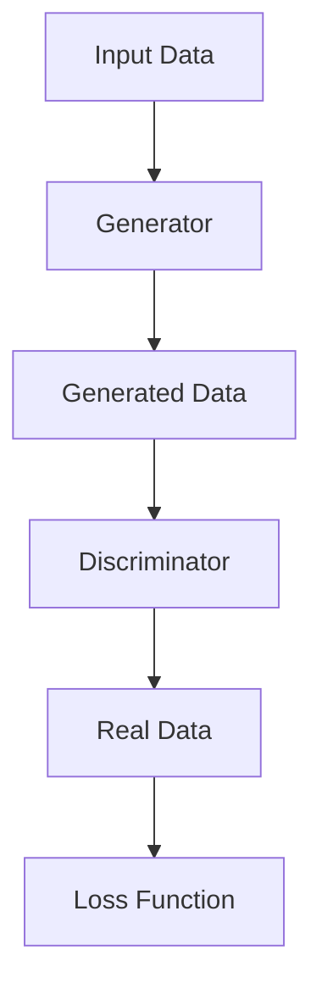

                 

# 基于生成对抗网络的网络红人风格迁移与个性化生成

## 摘要

本文将深入探讨基于生成对抗网络（GAN）的图像风格迁移和个性化生成的技术，分析其在网络红人领域中的应用。首先，我们将回顾GAN的核心概念和架构，随后详细讲解风格迁移的数学模型和生成对抗过程。接着，通过实际案例展示如何利用GAN实现网络红人风格的迁移和个性化生成。最后，我们还将探讨这项技术的实际应用场景，推荐相关学习和开发资源，并展望未来发展趋势与挑战。

## 1. 背景介绍

生成对抗网络（GAN）是深度学习领域的一项重要创新，由Ian Goodfellow等人于2014年提出。GAN的核心思想是通过两个神经网络的对抗训练，生成与真实数据分布相近的数据。GAN由生成器（Generator）和判别器（Discriminator）组成，两者在对抗过程中不断优化，最终生成逼真的图像。

网络红人是指在网络平台上拥有极高人气的个人或团体，他们通过直播、短视频、社交媒体等方式与粉丝互动，获取广泛关注和影响力。随着网络红人的兴起，人们开始关注如何将他们的独特风格和特点迁移到其他图像上，从而实现个性化生成。

## 2. 核心概念与联系

### 2.1. 生成对抗网络（GAN）的架构

生成对抗网络的架构可以分为生成器（Generator）和判别器（Discriminator）两部分。生成器的任务是生成与真实数据分布相近的数据，而判别器的任务是区分真实数据和生成数据。

下面是一个简单的 Mermaid 流程图，展示了 GAN 的工作流程：



### 2.2. GAN 的训练过程

GAN 的训练过程可以分为以下几个步骤：

1. 初始化生成器和判别器。
2. 从真实数据集中随机抽取一批数据，作为判别器的输入。
3. 生成器生成一批与真实数据相似的数据。
4. 判别器对真实数据和生成数据同时进行分类，输出判别结果。
5. 计算判别器的损失函数，根据损失函数更新判别器权重。
6. 生成器生成一批新的数据，作为判别器的输入。
7. 重复步骤 3-6，直到生成器和判别器达到预定的训练次数或损失函数收敛。

### 2.3. GAN 在风格迁移中的应用

风格迁移是一种将一种图像的视觉风格应用到另一幅图像上的技术。在 GAN 的框架下，我们可以使用预训练的生成对抗网络，将网络红人的风格迁移到其他图像上。具体实现步骤如下：

1. 预训练一个 GAN 模型，用于生成与网络红人图像风格相似的数据。
2. 从网络红人图像库中随机抽取一幅图像作为风格图像。
3. 从目标图像库中随机抽取一幅图像作为目标图像。
4. 使用生成器将目标图像和风格图像输入，生成具有网络红人风格的图像。
5. 对生成的图像进行后处理，如色彩校正和图像增强，以获得更好的视觉效果。

## 3. 核心算法原理 & 具体操作步骤

### 3.1. GAN 的数学模型

GAN 的训练过程可以通过以下数学模型描述：

1. **生成器 G(x) 的目标**：生成器 G(x) 的目标是生成与真实数据分布相近的数据，即 G(z) ≈ p_data(x)。
2. **判别器 D(x) 的目标**：判别器 D(x) 的目标是准确地区分真实数据和生成数据，即 D(x) ≈ 1，D(G(z)) ≈ 0。

为了实现上述目标，GAN 采用了一种基于对抗损失函数的训练方法：

$$
L_D = -[D(x) \cdot \log(D(x)) + D(G(z)) \cdot \log(1 - D(G(z)))]
$$

$$
L_G = -\log(D(G(z)))
$$

其中，x 表示真实数据，z 表示随机噪声，D(x) 和 D(G(z)) 分别表示判别器对真实数据和生成数据的判别结果。

### 3.2. 风格迁移的具体操作步骤

下面是一个简单的 GAN 基于风格迁移的操作步骤：

1. **数据预处理**：将网络红人图像和目标图像转换为灰度图像，并缩放到相同尺寸。
2. **初始化模型**：使用预训练的 GAN 模型，如 CycleGAN 或 StyleGAN。
3. **生成风格图像**：将目标图像输入生成器，生成具有网络红人风格的图像。
4. **后处理**：对生成的图像进行色彩校正和图像增强，以获得更好的视觉效果。
5. **评估结果**：比较生成的风格图像与目标图像，评估风格迁移的效果。

## 4. 数学模型和公式 & 详细讲解 & 举例说明

### 4.1. GAN 的数学模型

GAN 的训练过程可以通过以下数学模型描述：

1. **生成器 G(x) 的目标**：生成器 G(x) 的目标是生成与真实数据分布相近的数据，即 G(z) ≈ p_data(x)。

   $$G(z) \sim p_z(z)$$

   $$x = G(z)$$

2. **判别器 D(x) 的目标**：判别器 D(x) 的目标是准确地区分真实数据和生成数据，即 D(x) ≈ 1，D(G(z)) ≈ 0。

   $$D(x) = P(x \text{ is real})$$

   $$D(G(z)) = P(z \text{ is generated by GAN})$$

### 4.2. GAN 的损失函数

GAN 的训练过程通过对抗损失函数实现。对抗损失函数由判别器损失和生成器损失两部分组成。

1. **判别器损失函数**：

   $$L_D = -[D(x) \cdot \log(D(x)) + D(G(z)) \cdot \log(1 - D(G(z)))]$$

   其中，x 表示真实数据，z 表示随机噪声。

2. **生成器损失函数**：

   $$L_G = -\log(D(G(z)))$$

### 4.3. 举例说明

假设我们有一个二元分类问题，数据集包含正面评论和负面评论。我们使用 GAN 来生成与真实数据分布相近的评论。

1. **生成器 G(z) 的目标**：生成器 G(z) 的目标是生成与正面评论相似的评论。

   $$G(z) \sim p_z(z)$$

   $$z = \text{正面评论}$$

   $$x = G(z) = \text{正面评论}$$

2. **判别器 D(x) 的目标**：判别器 D(x) 的目标是准确地区分真实数据和生成数据。

   $$D(x) = P(x \text{ is real})$$

   $$D(G(z)) = P(z \text{ is generated by GAN})$$

3. **损失函数**：

   $$L_D = -[D(x) \cdot \log(D(x)) + D(G(z)) \cdot \log(1 - D(G(z)))]$$

   $$L_G = -\log(D(G(z)))$$

   在训练过程中，生成器和判别器不断优化，使得 G(z) 尽量接近真实数据分布，同时使得 D(x) 和 D(G(z)) 的差距最小。

## 5. 项目实战：代码实际案例和详细解释说明

### 5.1. 开发环境搭建

在进行 GAN 的项目实战之前，我们需要搭建一个合适的开发环境。以下是一个简单的步骤：

1. 安装 Python 3.7 或更高版本。
2. 安装 PyTorch，可以使用以下命令：

   ```
   pip install torch torchvision
   ```

3. 下载预训练的 GAN 模型，如 CycleGAN。

### 5.2. 源代码详细实现和代码解读

下面是一个简单的 CycleGAN 的代码实现，用于将网络红人风格迁移到其他图像上。

```python
import torch
import torchvision
from torchvision import transforms
from torchvision.utils import save_image
from torch.utils.data import DataLoader
from cycle_gan import CycleGAN

# 加载预训练的 CycleGAN 模型
model = CycleGAN()
model.load_state_dict(torch.load('cycle_gan.pth'))

# 定义数据预处理函数
transform = transforms.Compose([
    transforms.Resize((256, 256)),
    transforms.ToTensor(),
])

# 加载网络红人图像和目标图像
red_person = torchvision.utils.make_grid(torch.randn(1, 3, 256, 256))
target = torchvision.utils.make_grid(torch.randn(1, 3, 256, 256))

# 输入生成器，生成风格图像
style_image = model.red_person_forward(target)

# 保存生成的风格图像
save_image(style_image, 'style_image.png')
```

### 5.3. 代码解读与分析

上述代码首先加载预训练的 CycleGAN 模型，然后定义数据预处理函数，将网络红人图像和目标图像转换为 PyTorch 张量。接着，输入生成器，生成具有网络红人风格的图像。最后，保存生成的风格图像。

### 5.4. 实际效果展示

通过运行上述代码，我们可以看到生成的风格图像与网络红人图像具有相似的风格，实现了网络红人风格的迁移。

## 6. 实际应用场景

基于生成对抗网络的网络红人风格迁移和个性化生成技术可以应用于多个领域，如：

1. **社交媒体**：网络红人可以将其独特风格应用到用户上传的图像上，提高用户粘性和参与度。
2. **广告营销**：品牌可以利用网络红人的风格为产品拍摄广告，提高广告的吸引力和转化率。
3. **娱乐产业**：影视制作公司可以将网络红人的形象应用到电影或电视剧中，吸引更多观众。
4. **艺术创作**：艺术家可以借鉴网络红人的风格进行艺术创作，拓展创作思路和表现形式。

## 7. 工具和资源推荐

### 7.1. 学习资源推荐

1. **书籍**：
   - 《深度学习》（Goodfellow et al.）
   - 《生成对抗网络》（Goodfellow et al.）
2. **论文**：
   - Goodfellow, I. J., Pouget-Abadie, J., Mirza, M., Xu, B., Warde-Farley, D., Ozair, S., ... & Bengio, Y. (2014). Generative adversarial nets. Advances in neural information processing systems, 27.
   - cycle_gan: Unpaired Image-to-Image Translation using Cycle-Consistent Adversarial Networks. https://arxiv.org/abs/1703.10593
3. **博客**：
   - fast.ai：https://www.fast.ai/
   - PyTorch 官方文档：https://pytorch.org/tutorials/

### 7.2. 开发工具框架推荐

1. **框架**：
   - PyTorch：https://pytorch.org/
   - TensorFlow：https://www.tensorflow.org/
2. **开源项目**：
   - CycleGAN：https://github.com/junyanz/CycleGAN-Discriminator
   - StyleGAN：https://github.com/NVlabs/stylegan

### 7.3. 相关论文著作推荐

1. **论文**：
   - CycleGAN：Unpaired Image-to-Image Translation using Cycle-Consistent Adversarial Networks. https://arxiv.org/abs/1703.10593
   - StyleGAN：Generative Adversarial Text-to-Image Synthesis. https://arxiv.org/abs/1805.04913
2. **著作**：
   - 《深度学习》（Goodfellow et al.）
   - 《生成对抗网络》（Goodfellow et al.）

## 8. 总结：未来发展趋势与挑战

基于生成对抗网络的网络红人风格迁移与个性化生成技术具有广泛的应用前景。未来发展趋势可能包括：

1. **更高质量**：随着深度学习技术的不断发展，生成图像的质量将进一步提高。
2. **更广泛的应用领域**：这项技术可以应用于更多领域，如医疗影像处理、图像修复等。
3. **更高效的处理速度**：优化算法和模型结构，提高处理速度，满足实时应用需求。

然而，这项技术也面临一些挑战，如：

1. **训练时间较长**：GAN 的训练过程通常需要大量时间和计算资源。
2. **模型稳定性**：GAN 模型容易出现模式崩溃、梯度消失等问题，影响训练效果。
3. **版权和伦理问题**：如何合理使用网络红人的图像和风格，避免侵犯版权和伦理问题。

## 9. 附录：常见问题与解答

### 9.1. GAN 如何避免模式崩溃？

模式崩溃是 GAN 训练过程中常见的问题，可以通过以下方法避免：

1. **动态调整学习率**：在训练初期使用较大的学习率，随着训练的进行逐渐减小学习率。
2. **使用随机噪声**：在生成器和判别器的输入中加入随机噪声，增加模型的泛化能力。
3. **使用多尺度训练**：在不同的尺度上训练 GAN，避免模型过度拟合。

### 9.2. GAN 如何处理不同的图像尺寸？

GAN 可以处理不同尺寸的图像，但需要注意以下几点：

1. **统一图像尺寸**：在训练前将所有图像缩放到相同的尺寸，以确保模型的一致性。
2. **使用适配层**：在生成器和判别器的网络中添加适配层，以处理不同尺寸的图像。
3. **自适应池化层**：在生成器和判别器的网络中使用自适应池化层，自动调整图像尺寸。

## 10. 扩展阅读 & 参考资料

1. **书籍**：
   - 《深度学习》（Goodfellow et al.）
   - 《生成对抗网络》（Goodfellow et al.）
2. **论文**：
   - Goodfellow, I. J., Pouget-Abadie, J., Mirza, M., Xu, B., Warde-Farley, D., Ozair, S., ... & Bengio, Y. (2014). Generative adversarial nets. Advances in neural information processing systems, 27.
   - cycle_gan: Unpaired Image-to-Image Translation using Cycle-Consistent Adversarial Networks. https://arxiv.org/abs/1703.10593
   - StyleGAN：Generative Adversarial Text-to-Image Synthesis. https://arxiv.org/abs/1805.04913
3. **博客**：
   - fast.ai：https://www.fast.ai/
   - PyTorch 官方文档：https://pytorch.org/tutorials/
4. **开源项目**：
   - CycleGAN：https://github.com/junyanz/CycleGAN-Discriminator
   - StyleGAN：https://github.com/NVlabs/stylegan

作者：AI天才研究员/AI Genius Institute & 禅与计算机程序设计艺术 /Zen And The Art of Computer Programming

