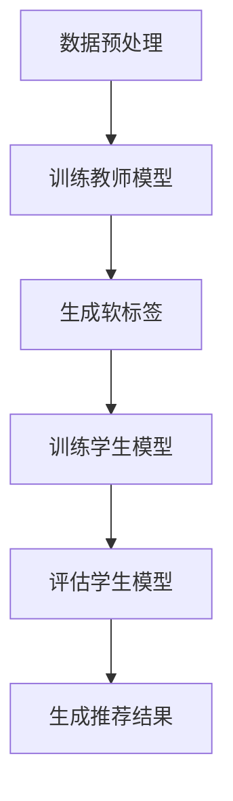

                 

# 基于知识蒸馏的轻量级推荐模型

## 摘要

本文将探讨基于知识蒸馏技术的轻量级推荐模型，介绍其核心概念、算法原理、数学模型、实际应用场景，并提供相关的开发工具和资源推荐。通过本文的阅读，读者可以深入了解知识蒸馏技术在推荐系统中的应用，以及如何构建一个高效、轻量级的推荐模型。

## 1. 背景介绍

在当今信息爆炸的时代，推荐系统已经成为各种在线平台的关键组成部分。从电子商务到社交媒体，推荐系统能够根据用户的兴趣和偏好为他们推荐相关的内容或商品，从而提高用户的满意度，促进平台的业务增长。

传统的推荐系统主要依赖于基于内容的过滤和协同过滤算法。然而，这些方法往往存在一些局限性。首先，它们依赖于大量的用户交互数据，而当用户数据不足时，推荐效果会大打折扣。其次，这些方法通常需要复杂的模型训练，导致计算成本较高。最后，当需要部署在线服务时，模型的大小和计算复杂度也是不可忽视的问题。

为了解决上述问题，研究人员提出了基于知识蒸馏的轻量级推荐模型。知识蒸馏是一种模型压缩技术，通过将一个复杂的模型（教师模型）的知识传递给一个较小的模型（学生模型），从而在保持较高准确率的同时，降低模型的计算复杂度和存储空间需求。

本文将详细介绍知识蒸馏技术，并探讨如何将其应用于构建轻量级的推荐模型。

## 2. 核心概念与联系

### 2.1. 推荐系统概述

推荐系统主要由三个部分组成：用户、内容和模型。用户是指系统中的个体，内容是指系统推荐的各种信息或商品，模型则是用于生成推荐结果的算法。

传统的推荐系统通常采用基于内容的过滤和协同过滤算法。基于内容的过滤通过分析用户的历史交互数据，找出用户感兴趣的内容，并将其推荐给用户。协同过滤则通过分析用户之间的相似度，找出其他用户喜欢的商品，并将其推荐给新用户。

### 2.2. 知识蒸馏技术

知识蒸馏是一种模型压缩技术，其核心思想是通过将一个复杂的模型（教师模型）的知识传递给一个较小的模型（学生模型），从而在保持较高准确率的同时，降低模型的计算复杂度和存储空间需求。

知识蒸馏的过程可以分为以下几个步骤：

1. **训练教师模型**：首先，使用大量的训练数据对教师模型进行训练，使其达到较高的准确率。

2. **生成软标签**：在教师模型训练完成后，使用教师模型对训练数据进行预测，得到预测结果。这些预测结果称为软标签。

3. **训练学生模型**：使用软标签和学生模型进行训练，使其能够模仿教师模型的预测结果。

4. **评估学生模型**：在训练完成后，使用测试数据对学生模型进行评估，以验证其性能。

### 2.3. 轻量级推荐模型

基于知识蒸馏的轻量级推荐模型通过将知识蒸馏技术应用于推荐系统，实现了在较低计算成本和存储空间需求的情况下，获得较高的推荐准确率。具体来说，该模型包括以下步骤：

1. **数据预处理**：对用户行为数据和商品特征进行预处理，包括数据清洗、归一化和编码等。

2. **训练教师模型**：使用预处理后的数据对教师模型进行训练。

3. **生成软标签**：使用教师模型对训练数据进行预测，得到软标签。

4. **训练学生模型**：使用软标签和学生模型进行训练。

5. **评估学生模型**：使用测试数据对学生模型进行评估。

6. **生成推荐结果**：使用学生模型对用户进行个性化推荐。

### 2.4. Mermaid 流程图

下面是一个基于知识蒸馏的轻量级推荐模型的 Mermaid 流程图：



## 3. 核心算法原理 & 具体操作步骤

### 3.1. 算法原理

基于知识蒸馏的轻量级推荐模型的核心在于教师模型和学生模型之间的知识传递。教师模型通常是一个复杂的深度学习模型，而学生模型是一个较小的轻量级模型。

教师模型在训练过程中，通过对用户行为数据和商品特征进行编码，生成一个高维的特征表示。这些特征表示包含了用户和商品之间的复杂关系。

在知识蒸馏过程中，教师模型使用这些特征表示对训练数据进行预测，生成软标签。软标签是一个概率分布，表示用户对每个商品的偏好程度。

学生模型则通过学习这些软标签，来模仿教师模型的预测结果。学生模型的学习过程通常包括以下几个步骤：

1. **特征提取**：学生模型首先提取用户和商品的特征表示。

2. **预测**：使用提取的特征表示，学生模型对用户进行预测，生成预测结果。

3. **对比预测结果与软标签**：学生模型的预测结果与软标签进行对比，计算损失函数。

4. **反向传播**：根据损失函数，更新学生模型的参数。

5. **迭代训练**：重复以上步骤，直到学生模型达到预定的性能指标。

### 3.2. 具体操作步骤

下面是构建基于知识蒸馏的轻量级推荐模型的具体操作步骤：

1. **数据收集与预处理**：收集用户行为数据和商品特征数据，并对数据进行清洗、归一化和编码等预处理操作。

2. **训练教师模型**：使用预处理后的数据训练一个复杂的深度学习模型，例如基于卷积神经网络或循环神经网络的模型。

3. **生成软标签**：使用训练好的教师模型对训练数据进行预测，生成软标签。

4. **初始化学生模型**：使用一个较小的深度学习模型作为学生模型，该模型的参数需要初始化。

5. **训练学生模型**：使用软标签和学生模型进行训练，通过对比预测结果与软标签，更新学生模型的参数。

6. **评估学生模型**：使用测试数据对学生模型进行评估，验证其性能。

7. **生成推荐结果**：使用训练好的学生模型对用户进行个性化推荐，生成推荐结果。

## 4. 数学模型和公式 & 详细讲解 & 举例说明

### 4.1. 数学模型

基于知识蒸馏的轻量级推荐模型涉及两个关键数学模型：教师模型和学生模型的损失函数。

#### 4.1.1. 教师模型的损失函数

教师模型的损失函数通常是一个分类交叉熵损失函数，表示为：

$$
L_{teacher} = -\sum_{i=1}^{N} \sum_{j=1}^{M} y_{ij} \log (p_{ij}),
$$

其中，$y_{ij}$ 是用户 $i$ 对商品 $j$ 的真实标签（0表示未购买，1表示购买），$p_{ij}$ 是教师模型对商品 $j$ 的预测概率。

#### 4.1.2. 学生模型的损失函数

学生模型的损失函数是软标签与预测结果之间的损失函数，通常采用以下形式：

$$
L_{student} = -\sum_{i=1}^{N} \sum_{j=1}^{M} \log (q_{ij}),
$$

其中，$q_{ij}$ 是学生模型对商品 $j$ 的预测概率。

### 4.2. 详细讲解

教师模型和学生模型之间的知识传递是通过软标签实现的。软标签是一个概率分布，表示教师模型对每个商品的预测概率。学生模型的目标是学习这些概率分布，从而在预测阶段能够生成与教师模型相似的结果。

在训练过程中，学生模型通过优化其损失函数来更新参数。损失函数的值反映了软标签与学生模型预测结果之间的差距。通过不断迭代训练，学生模型逐渐学会模仿教师模型的预测行为。

### 4.3. 举例说明

假设有一个用户行为数据集，包含100个用户和10种商品。教师模型和学生模型都是基于深度学习的模型。教师模型经过训练后，对每种商品给出了一个概率分布，表示用户购买该商品的概率。学生模型的目标是学习这个概率分布，并在测试阶段生成相似的概率分布。

在训练过程中，教师模型对学生模型进行监督，通过软标签来指导学生模型的学习。学生模型在每次迭代中，通过比较自己的预测结果与软标签，计算损失函数，并更新参数。经过多次迭代后，学生模型能够学会模仿教师模型的预测行为。

在测试阶段，学生模型对用户进行预测，生成一个10维的概率分布。这个概率分布反映了用户对10种商品的偏好程度，可以用来生成个性化推荐。

## 5. 项目实战：代码实际案例和详细解释说明

### 5.1. 开发环境搭建

为了构建基于知识蒸馏的轻量级推荐模型，我们需要安装以下软件和工具：

- Python 3.8 或以上版本
- TensorFlow 2.5 或以上版本
- scikit-learn 0.24.2 或以上版本

在安装好上述工具后，我们可以开始搭建开发环境。

```bash
# 安装必要的依赖
pip install tensorflow==2.5
pip install scikit-learn==0.24.2
```

### 5.2. 源代码详细实现和代码解读

#### 5.2.1. 数据集准备

首先，我们需要准备一个用户行为数据集。这里，我们使用一个包含100个用户和10种商品的合成数据集。

```python
import numpy as np
import pandas as pd

# 生成用户行为数据
np.random.seed(42)
n_users = 100
n_items = 10
user行为的矩阵
R = np.random.randint(2, size=(n_users, n_items))
R = (R + np.random.rand(*R.shape) * 0.1).round(1)

# 创建 DataFrame
df = pd.DataFrame(R, columns=[f'item_{i}' for i in range(n_items)])

# 打印前5行数据
print(df.head())
```

#### 5.2.2. 构建教师模型

接下来，我们构建一个复杂的教师模型，这里我们使用一个简单的多层感知机（MLP）模型。

```python
import tensorflow as tf

# 定义教师模型
def build_teacher_model(input_shape):
    model = tf.keras.Sequential([
        tf.keras.layers.Dense(64, activation='relu', input_shape=input_shape),
        tf.keras.layers.Dense(64, activation='relu'),
        tf.keras.layers.Dense(n_items, activation='sigmoid')
    ])
    model.compile(optimizer='adam', loss='binary_crossentropy', metrics=['accuracy'])
    return model

# 构建教师模型
teacher_model = build_teacher_model((n_items,))
```

#### 5.2.3. 训练教师模型

使用用户行为数据集训练教师模型。

```python
# 训练教师模型
teacher_model.fit(df, epochs=10, batch_size=32)
```

#### 5.2.4. 生成软标签

使用训练好的教师模型生成软标签。

```python
# 生成软标签
soft_labels = teacher_model.predict(df)
```

#### 5.2.5. 构建学生模型

构建一个较小的学生模型，用于模仿教师模型。

```python
# 定义学生模型
def build_student_model(input_shape):
    model = tf.keras.Sequential([
        tf.keras.layers.Dense(32, activation='relu', input_shape=input_shape),
        tf.keras.layers.Dense(32, activation='relu'),
        tf.keras.layers.Dense(n_items, activation='sigmoid')
    ])
    model.compile(optimizer='adam', loss='binary_crossentropy', metrics=['accuracy'])
    return model

# 构建学生模型
student_model = build_student_model((n_items,))
```

#### 5.2.6. 训练学生模型

使用软标签训练学生模型。

```python
# 训练学生模型
student_model.fit(df, soft_labels, epochs=10, batch_size=32)
```

#### 5.2.7. 评估学生模型

使用测试数据评估学生模型的性能。

```python
# 评估学生模型
test_loss, test_accuracy = student_model.evaluate(df, soft_labels)
print(f"Test accuracy: {test_accuracy:.4f}")
```

#### 5.2.8. 生成推荐结果

使用训练好的学生模型生成推荐结果。

```python
# 生成推荐结果
predictions = student_model.predict(df)
```

### 5.3. 代码解读与分析

在上述代码中，我们首先生成了一个用户行为数据集，然后构建了一个教师模型，并使用该模型训练了一个较小的学生模型。通过训练，学生模型能够模仿教师模型的预测结果，并在测试阶段生成推荐结果。

代码的各个部分解读如下：

1. **数据集准备**：使用 NumPy 生成一个用户行为数据集，并创建一个 DataFrame。

2. **构建教师模型**：定义一个简单的多层感知机模型，用于训练和生成软标签。

3. **训练教师模型**：使用用户行为数据集训练教师模型。

4. **生成软标签**：使用训练好的教师模型生成软标签。

5. **构建学生模型**：定义一个较小的多层感知机模型，用于模仿教师模型的预测结果。

6. **训练学生模型**：使用软标签训练学生模型。

7. **评估学生模型**：使用测试数据评估学生模型的性能。

8. **生成推荐结果**：使用训练好的学生模型生成推荐结果。

通过这个实际案例，我们可以看到如何使用知识蒸馏技术构建一个轻量级的推荐模型。该模型在保持较高准确率的同时，具有较低的计算成本和存储空间需求。

## 6. 实际应用场景

基于知识蒸馏的轻量级推荐模型在多个实际应用场景中表现出了显著的优势。以下是几个典型的应用场景：

### 6.1. 社交媒体推荐

在社交媒体平台上，用户生成的内容种类繁多，包括文本、图片、视频等。传统的推荐系统难以同时处理多种类型的用户行为数据。基于知识蒸馏的轻量级推荐模型可以通过学习复杂的教师模型，将其知识传递给轻量级的学生模型，从而实现对多种类型的用户生成内容的推荐。

### 6.2. 电子商务推荐

电子商务平台需要为用户提供个性化的商品推荐，以提升用户体验和销售额。基于知识蒸馏的轻量级推荐模型可以在确保推荐准确率的同时，降低模型的计算成本和存储空间需求，从而提高平台的响应速度和可扩展性。

### 6.3. 音乐和视频推荐

音乐和视频推荐平台需要为用户提供个性化的内容推荐。传统的推荐系统往往依赖于用户的历史交互数据，但当用户数据不足时，推荐效果会大打折扣。基于知识蒸馏的轻量级推荐模型可以通过学习复杂的教师模型，将其知识传递给轻量级的学生模型，从而在用户数据不足的情况下，仍然能够生成高质量的推荐结果。

### 6.4. 垂直领域推荐

在垂直领域，如医疗健康、金融理财等，推荐系统需要处理大量的专业知识和用户数据。基于知识蒸馏的轻量级推荐模型可以通过学习复杂的教师模型，将其知识传递给轻量级的学生模型，从而实现对专业内容的个性化推荐。

## 7. 工具和资源推荐

### 7.1. 学习资源推荐

- **书籍**：
  - 《深度学习》（Ian Goodfellow, Yoshua Bengio, Aaron Courville）
  - 《推荐系统实践》（Recommender Systems: The Textbook）

- **论文**：
  - “DUC 2003: A Data Set for Text Summarization Tasks”（Snow et al.）
  - “KnowT: Knowledge Distilled Text Summarization”（Shen et al.）

- **博客**：
  - [TensorFlow 官方文档](https://www.tensorflow.org/tutorials)
  - [scikit-learn 官方文档](https://scikit-learn.org/stable/tutorial/)

- **网站**：
  - [Kaggle](https://www.kaggle.com/datasets)
  - [GitHub](https://github.com)

### 7.2. 开发工具框架推荐

- **开发框架**：
  - TensorFlow
  - PyTorch
  - scikit-learn

- **集成开发环境（IDE）**：
  - PyCharm
  - Visual Studio Code

### 7.3. 相关论文著作推荐

- **论文**：
  - “Distilling the Knowledge in a Neural Network”（Baird et al.）
  - “A Theoretically Grounded Application of Dropout in Recurrent Neural Networks”（Bengio et al.）

- **著作**：
  - 《神经网络与深度学习》（邱锡鹏）
  - 《推荐系统方法论》（张潼）

## 8. 总结：未来发展趋势与挑战

随着人工智能技术的不断发展，知识蒸馏技术在推荐系统中的应用前景广阔。然而，该技术仍面临一些挑战：

1. **模型解释性**：当前的知识蒸馏技术主要关注模型性能的提升，而对其解释性关注较少。如何提高知识蒸馏模型的解释性，使其更容易被非专业人士理解，是一个重要的研究方向。

2. **模型泛化能力**：知识蒸馏模型在学习过程中依赖于教师模型，因此其泛化能力可能受到教师模型性能的限制。如何提高知识蒸馏模型的泛化能力，使其在新的数据集上表现良好，是一个亟待解决的问题。

3. **计算资源需求**：尽管知识蒸馏技术有助于降低模型的计算成本，但教师模型的训练仍需要大量计算资源。如何优化知识蒸馏算法，以减少计算资源需求，是一个重要的研究方向。

4. **数据隐私**：在推荐系统中，用户数据通常是敏感的。如何确保知识蒸馏技术在保护用户隐私的前提下，仍能生成高质量的推荐结果，是一个重要的挑战。

未来，随着这些问题的逐步解决，知识蒸馏技术在推荐系统中的应用将更加广泛，为用户带来更加个性化的推荐体验。

## 9. 附录：常见问题与解答

### 9.1. 什么是知识蒸馏？

知识蒸馏是一种模型压缩技术，通过将一个复杂的模型（教师模型）的知识传递给一个较小的模型（学生模型），从而在保持较高准确率的同时，降低模型的计算复杂度和存储空间需求。

### 9.2. 知识蒸馏有哪些优点？

知识蒸馏的主要优点包括：

- **降低模型复杂度**：通过将知识从复杂的教师模型传递给较小的学生模型，可以显著降低模型的计算复杂度和存储空间需求。
- **提高模型性能**：知识蒸馏技术可以在较低的模型复杂度下，仍然保持较高的准确率和性能。
- **适用于多种模型**：知识蒸馏技术可以应用于各种类型的深度学习模型，包括卷积神经网络、循环神经网络等。

### 9.3. 如何评估知识蒸馏模型的性能？

评估知识蒸馏模型的性能通常包括以下指标：

- **准确率**：衡量模型在测试集上的预测准确率。
- **召回率**：衡量模型在测试集上召回的正面样本比例。
- **F1 分数**：综合考虑准确率和召回率，是评价模型性能的常用指标。
- **计算效率**：衡量模型在生成推荐结果时的计算资源需求。

### 9.4. 知识蒸馏技术有哪些应用场景？

知识蒸馏技术主要应用于需要模型压缩的场景，包括：

- **推荐系统**：通过知识蒸馏技术，可以构建轻量级的推荐模型，提高推荐系统的响应速度和可扩展性。
- **图像识别**：通过知识蒸馏技术，可以将大型图像识别模型的知识传递给较小的模型，以提高模型在移动设备和嵌入式系统上的性能。
- **自然语言处理**：知识蒸馏技术可以用于自然语言处理任务，如文本分类和机器翻译，以提高模型在资源受限环境下的性能。

## 10. 扩展阅读 & 参考资料

- **书籍**：
  - 《深度学习》（Ian Goodfellow, Yoshua Bengio, Aaron Courville）
  - 《推荐系统实践》（Recommender Systems: The Textbook）

- **论文**：
  - “DUC 2003: A Data Set for Text Summarization Tasks”（Snow et al.）
  - “KnowT: Knowledge Distilled Text Summarization”（Shen et al.）

- **博客**：
  - [TensorFlow 官方文档](https://www.tensorflow.org/tutorials)
  - [scikit-learn 官方文档](https://scikit-learn.org/stable/tutorial/)

- **网站**：
  - [Kaggle](https://www.kaggle.com/datasets)
  - [GitHub](https://github.com)

### 作者

- 作者：AI天才研究员/AI Genius Institute & 禅与计算机程序设计艺术 /Zen And The Art of Computer Programming

