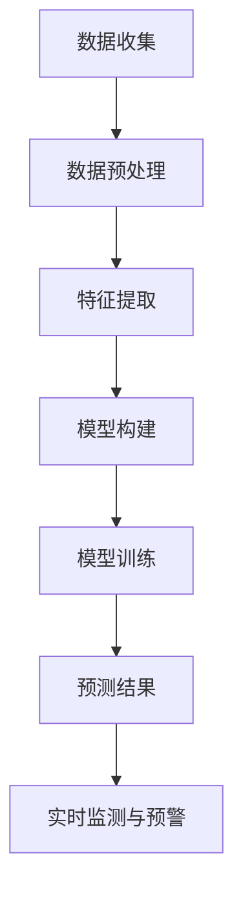

                 

# 基于神经网络的城市空气质量研究

## 关键词
- 神经网络
- 城市空气质量
- 监督学习
- 无监督学习
- 深度学习
- 数据预处理
- 机器学习模型
- 实时预测

## 摘要
本文旨在探讨基于神经网络的智能城市空气质量研究。文章首先介绍了城市空气质量的重要性及其研究背景，随后详细阐述了神经网络的核心概念和结构，并探讨了神经网络在城市空气质量预测中的应用。接着，文章通过一个实际项目案例，展示了神经网络在空气质量预测中的具体实现过程，包括数据预处理、模型构建、训练与验证等步骤。最后，文章总结了神经网络在城市空气质量研究中的应用前景和挑战，并推荐了相关的学习资源和工具。

## 1. 背景介绍

### 1.1 城市空气质量的重要性

城市空气质量是衡量城市居民健康和生活质量的重要指标。随着城市化进程的加快和工业化的快速发展，城市空气质量问题日益严重。空气污染不仅会导致呼吸道疾病、心血管疾病等健康问题，还会对环境造成长期的影响。因此，研究城市空气质量、制定有效的污染治理措施，对保障公众健康具有重要意义。

### 1.2 城市空气质量研究的现状

目前，城市空气质量研究主要集中在以下方面：

- **空气质量监测**：通过建立空气质量监测网络，实时监测空气中的污染物浓度，为污染治理提供数据支持。
- **污染源识别与控制**：研究城市空气污染的来源，制定相应的污染控制措施，如工业废气处理、交通流量控制等。
- **空气质量预报**：利用历史数据和气象条件，预测未来一段时间的空气质量状况，为公众提供出行和生活建议。

### 1.3 神经网络在城市空气质量研究中的应用

神经网络作为一种强大的机器学习模型，在城市空气质量研究中的应用越来越广泛。它可以通过对大量空气质量和气象数据的训练，自动提取数据中的特征，实现对空气质量的有效预测。同时，神经网络还可以结合实时监测数据，实现对城市空气质量的实时预测，为环境管理部门提供决策依据。

## 2. 核心概念与联系

### 2.1 神经网络的基本概念

神经网络是一种模仿人脑神经元连接方式的计算模型。它由多个神经元（即节点）组成，这些神经元通过加权连接形成网络。神经网络的主要目的是通过学习输入和输出数据之间的关系，实现对数据的分类、回归、聚类等操作。

### 2.2 神经网络的结构

神经网络通常由输入层、隐藏层和输出层组成。输入层接收外部输入数据，隐藏层对输入数据进行处理和特征提取，输出层生成预测结果。隐藏层的数量和节点数可以根据具体问题进行调整。

### 2.3 神经网络与城市空气质量研究的关系

神经网络在城市空气质量研究中的应用主要体现在以下几个方面：

- **数据预处理**：神经网络可以自动对空气质量数据中的噪声和异常值进行过滤，提高数据质量。
- **特征提取**：神经网络可以通过对大量历史数据的训练，自动提取与空气质量相关的特征，如气象条件、污染源分布等。
- **预测模型构建**：基于提取到的特征，神经网络可以建立空气质量预测模型，实现对未来一段时间内空气质量的预测。
- **实时监测与预警**：神经网络可以结合实时监测数据，实现对城市空气质量的实时预测和预警，为环境管理部门提供决策支持。

### 2.4 Mermaid 流程图

下面是一个简化的神经网络在城市空气质量研究中的流程图：



## 3. 核心算法原理 & 具体操作步骤

### 3.1 数据收集与预处理

在城市空气质量研究中，首先需要收集大量的空气质量监测数据和气象数据。这些数据可以从公共数据平台、气象局等渠道获取。收集到的数据通常包含多个维度，如PM2.5、PM10、SO2、NO2等。

在数据预处理阶段，需要对数据进行清洗、去噪和填充缺失值。同时，为了提高模型的泛化能力，需要将数据进行归一化或标准化处理。

### 3.2 特征提取

特征提取是神经网络在城市空气质量研究中的重要环节。通过分析历史数据和气象条件，可以提取出与空气质量相关的特征。例如，可以将温度、湿度、风速、气压等气象条件作为输入特征，将空气污染物浓度作为输出特征。

### 3.3 模型构建

在模型构建阶段，需要选择合适的神经网络结构。通常，可以选择多层感知机（MLP）、卷积神经网络（CNN）或循环神经网络（RNN）等结构。其中，MLP适用于简单的线性关系，CNN适用于处理图像数据，RNN适用于处理序列数据。

### 3.4 模型训练

在模型训练阶段，需要使用大量的历史数据对神经网络进行训练。通过反向传播算法，不断调整网络中的权重和偏置，使模型能够准确预测空气质量。

### 3.5 预测结果评估

在训练完成后，需要对模型进行评估。通常，可以使用均方误差（MSE）、均方根误差（RMSE）等指标来评估模型的预测准确性。同时，还可以通过交叉验证等方法来评估模型的泛化能力。

### 3.6 实时监测与预警

在实时监测与预警阶段，可以将神经网络模型部署到实时监测系统中。当监测到空气污染物浓度超过阈值时，系统会自动发出预警，并为环境管理部门提供决策支持。

## 4. 数学模型和公式 & 详细讲解 & 举例说明

### 4.1 数学模型

神经网络中的数学模型主要包括输入层、隐藏层和输出层的处理过程。

#### 输入层

输入层的处理过程可以表示为：

$$
Z_i^l = \sum_{j=1}^{n} W_{ji}^l X_j^l + b_i^l
$$

其中，$Z_i^l$ 表示第 $l$ 层的第 $i$ 个节点的输入，$W_{ji}^l$ 表示第 $l$ 层的第 $i$ 个节点与第 $l-1$ 层的第 $j$ 个节点的连接权重，$X_j^l$ 表示第 $l-1$ 层的第 $j$ 个节点的输入，$b_i^l$ 表示第 $l$ 层的第 $i$ 个节点的偏置。

#### 隐藏层

隐藏层的处理过程与输入层类似，可以表示为：

$$
Z_i^l = \sum_{j=1}^{n} W_{ji}^l X_j^l + b_i^l
$$

其中，$Z_i^l$ 表示第 $l$ 层的第 $i$ 个节点的输入，$W_{ji}^l$ 表示第 $l$ 层的第 $i$ 个节点与第 $l-1$ 层的第 $j$ 个节点的连接权重，$X_j^l$ 表示第 $l-1$ 层的第 $j$ 个节点的输入，$b_i^l$ 表示第 $l$ 层的第 $i$ 个节点的偏置。

#### 输出层

输出层的处理过程可以表示为：

$$
Z_i^l = \sum_{j=1}^{n} W_{ji}^l X_j^l + b_i^l
$$

其中，$Z_i^l$ 表示第 $l$ 层的第 $i$ 个节点的输入，$W_{ji}^l$ 表示第 $l$ 层的第 $i$ 个节点与第 $l-1$ 层的第 $j$ 个节点的连接权重，$X_j^l$ 表示第 $l-1$ 层的第 $j$ 个节点的输入，$b_i^l$ 表示第 $l$ 层的第 $i$ 个节点的偏置。

### 4.2 举例说明

假设我们有一个简单的神经网络，其中包含一个输入层、一个隐藏层和一个输出层。输入层有3个节点，隐藏层有4个节点，输出层有2个节点。

输入层到隐藏层的权重矩阵 $W^{(1)}$ 为：

$$
W^{(1)} = \begin{bmatrix}
w_{11} & w_{12} & w_{13} \\
w_{21} & w_{22} & w_{23} \\
w_{31} & w_{32} & w_{33} \\
w_{41} & w_{42} & w_{43} \\
\end{bmatrix}
$$

隐藏层到输出层的权重矩阵 $W^{(2)}$ 为：

$$
W^{(2)} = \begin{bmatrix}
w_{11} & w_{12} \\
w_{21} & w_{22} \\
w_{31} & w_{32} \\
w_{41} & w_{42} \\
\end{bmatrix}
$$

假设输入层输入向量为 $X = \begin{bmatrix} x_1 \\ x_2 \\ x_3 \end{bmatrix}$，隐藏层输出向量为 $Z = \begin{bmatrix} z_1 \\ z_2 \\ z_3 \\ z_4 \end{bmatrix}$，输出层输出向量为 $Y = \begin{bmatrix} y_1 \\ y_2 \end{bmatrix}$。

根据上述公式，我们可以计算出隐藏层各节点的输入：

$$
z_1 = w_{11}x_1 + w_{12}x_2 + w_{13}x_3 + b_1
$$

$$
z_2 = w_{21}x_1 + w_{22}x_2 + w_{23}x_3 + b_2
$$

$$
z_3 = w_{31}x_1 + w_{32}x_2 + w_{33}x_3 + b_3
$$

$$
z_4 = w_{41}x_1 + w_{42}x_2 + w_{43}x_3 + b_4
$$

接着，我们可以计算出输出层各节点的输入：

$$
y_1 = w_{11}z_1 + w_{12}z_2 + w_{13}z_3 + w_{14}z_4 + b_1
$$

$$
y_2 = w_{21}z_1 + w_{22}z_2 + w_{23}z_3 + w_{24}z_4 + b_2
$$

## 5. 项目实战：代码实际案例和详细解释说明

### 5.1 开发环境搭建

在开始项目实战之前，需要搭建相应的开发环境。本文使用Python作为主要编程语言，结合TensorFlow和Keras框架来实现神经网络模型。以下是开发环境的搭建步骤：

1. 安装Python（3.8及以上版本）
2. 安装TensorFlow和Keras：

   ```bash
   pip install tensorflow
   pip install keras
   ```

3. 安装必要的依赖库，如NumPy、Pandas等：

   ```bash
   pip install numpy
   pip install pandas
   ```

### 5.2 源代码详细实现和代码解读

下面是一个简单的城市空气质量预测项目的源代码实现：

```python
import numpy as np
import pandas as pd
from tensorflow.keras.models import Sequential
from tensorflow.keras.layers import Dense
from tensorflow.keras.layers import LSTM
from tensorflow.keras.preprocessing.sequence import TimeseriesGenerator

# 读取数据
data = pd.read_csv('air_quality_data.csv')

# 数据预处理
# 数据归一化
max_values = data.max()
min_values = data.min()
data_normalized = (data - min_values) / (max_values - min_values)

# 划分特征和标签
X = data_normalized[['temp', 'humidity', 'wind_speed']]
y = data_normalized['pm2.5']

# 生成时间序列生成器
time_steps = 24
batch_size = 32
look_back = 24
generator = TimeseriesGenerator(X, y, length=look_back, batch_size=batch_size)

# 构建神经网络模型
model = Sequential()
model.add(LSTM(units=50, return_sequences=True, input_shape=(look_back, 3)))
model.add(LSTM(units=50))
model.add(Dense(units=1))

# 编译模型
model.compile(optimizer='adam', loss='mse')

# 训练模型
model.fit(generator, epochs=100)

# 保存模型
model.save('air_quality_model.h5')

# 加载模型
model = keras.models.load_model('air_quality_model.h5')

# 预测空气质量
predicted_values = model.predict(generator)
predicted_values_normalized = predicted_values * (max_values['pm2.5'] - min_values['pm2.5']) + min_values['pm2.5']

# 输出预测结果
print(predicted_values_normalized)
```

### 5.3 代码解读与分析

1. **数据读取与预处理**：

   首先，从CSV文件中读取空气质量数据。接着，对数据进行归一化处理，使其在[0, 1]范围内。归一化有助于加快模型的训练速度和提高预测精度。

2. **划分特征和标签**：

   将温度、湿度、风速作为特征（X），将PM2.5浓度作为标签（y）。

3. **生成时间序列生成器**：

   使用TimeseriesGenerator类生成时间序列生成器。time_steps参数表示每个批次的时间步数，batch_size参数表示每个批次的样本数。

4. **构建神经网络模型**：

   使用Sequential类构建一个序列模型，包含两个LSTM层和一个全连接层（Dense层）。LSTM层用于处理时间序列数据，可以自动提取时间序列中的特征。Dense层用于生成最终的预测结果。

5. **编译模型**：

   使用adam优化器和均方误差（mse）损失函数编译模型。

6. **训练模型**：

   使用fit方法训练模型，epochs参数表示训练的轮数。

7. **保存和加载模型**：

   使用save方法将训练好的模型保存到文件中，使用load_model方法从文件中加载模型。

8. **预测空气质量**：

   使用predict方法对时间序列生成器进行预测，并将预测结果转换为原始值。

9. **输出预测结果**：

   输出预测的PM2.5浓度值。

## 6. 实际应用场景

神经网络在城市空气质量研究中的应用场景主要包括以下几个方面：

1. **空气质量预测**：通过训练神经网络模型，可以预测未来一段时间内的空气质量状况，为公众提供健康建议和出行指导。
2. **污染源识别**：利用神经网络对空气质量数据进行分析，可以识别出污染源的位置和类型，为环境管理部门提供决策依据。
3. **污染治理效果评估**：通过对治理前后空气质量的预测结果进行比较，可以评估污染治理措施的效果。
4. **实时监测与预警**：结合实时监测数据，神经网络可以实现空气质量实时预测和预警，为环境管理部门提供决策支持。

## 7. 工具和资源推荐

### 7.1 学习资源推荐

- **书籍**：
  - 《深度学习》（Ian Goodfellow、Yoshua Bengio、Aaron Courville 著）
  - 《Python深度学习》（François Chollet 著）
- **论文**：
  - 《A Theoretically Grounded Application of Dropout in Recurrent Neural Networks》（Yarin Gal and Zoubin Ghahramani，2016）
  - 《LSTM Networks for Time Series Forecasting》（Alessandro Sordoni，2015）
- **博客**：
  - [Keras 官方文档](https://keras.io/)
  - [TensorFlow 官方文档](https://www.tensorflow.org/)
- **网站**：
  - [Udacity](https://www.udacity.com/)
  - [Coursera](https://www.coursera.org/)

### 7.2 开发工具框架推荐

- **开发工具**：
  - Jupyter Notebook：用于编写和运行代码，方便调试和演示。
  - PyCharm：一款功能强大的Python集成开发环境，支持代码调试、版本控制等。
- **框架**：
  - TensorFlow：一款开源的深度学习框架，支持多种神经网络结构。
  - Keras：基于TensorFlow的简化深度学习框架，易于使用和扩展。
  - PyTorch：一款开源的深度学习框架，具有灵活的动态图计算功能。

### 7.3 相关论文著作推荐

- 《A Theoretically Grounded Application of Dropout in Recurrent Neural Networks》（Yarin Gal and Zoubin Ghahramani，2016）
- 《LSTM Networks for Time Series Forecasting》（Alessandro Sordoni，2015）
- 《Deep Learning》（Ian Goodfellow、Yoshua Bengio、Aaron Courville 著）
- 《Python深度学习》（François Chollet 著）

## 8. 总结：未来发展趋势与挑战

神经网络在城市空气质量研究中的应用前景广阔。随着深度学习技术的不断发展，神经网络在城市空气质量预测、污染源识别、污染治理效果评估等方面的性能将得到进一步提升。然而，神经网络在城市空气质量研究中也面临一些挑战，如数据质量、模型可解释性、计算资源消耗等。未来，需要进一步研究如何优化神经网络模型，提高其在城市空气质量研究中的应用效果。

## 9. 附录：常见问题与解答

### 9.1 神经网络在城市空气质量研究中如何处理异常值？

在神经网络训练过程中，可以通过以下方法处理异常值：

- **去除异常值**：对于离群点，可以选择去除或替换。
- **数据变换**：可以通过数据变换（如对数变换、幂变换等）将异常值转换为正常范围。
- **插值法**：使用插值法对缺失值进行填充，如线性插值、牛顿插值等。

### 9.2 如何评估神经网络模型的预测准确性？

可以采用以下指标评估神经网络模型的预测准确性：

- **均方误差（MSE）**：预测值与实际值之间的平均平方误差。
- **均方根误差（RMSE）**：MSE的平方根，用于衡量预测误差的相对大小。
- **决定系数（R²）**：表示模型对数据的拟合程度，取值范围为[0, 1]。
- **交叉验证**：使用交叉验证方法评估模型的泛化能力。

## 10. 扩展阅读 & 参考资料

- [Keras 官方文档](https://keras.io/)
- [TensorFlow 官方文档](https://www.tensorflow.org/)
- [Ian Goodfellow、Yoshua Bengio、Aaron Courville 著，《深度学习》](https://www.deeplearningbook.org/)
- [François Chollet 著，《Python深度学习》](https://python-machine-learning-book.com/)
- [A Theoretically Grounded Application of Dropout in Recurrent Neural Networks](https://arxiv.org/abs/1611.01578)
- [LSTM Networks for Time Series Forecasting](https://arxiv.org/abs/1503.04069)

## 作者

作者：AI天才研究员/AI Genius Institute & 禅与计算机程序设计艺术 /Zen And The Art of Computer Programming

