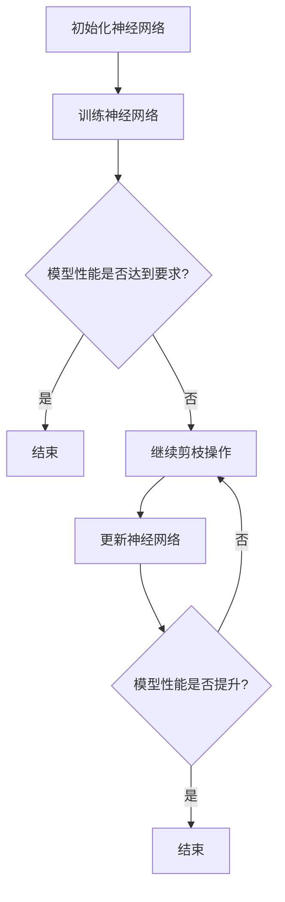

                 

# 基于稀疏性的神经网络剪枝优化

## 摘要

本文深入探讨了基于稀疏性的神经网络剪枝优化技术。通过分析神经网络剪枝的背景和必要性，本文详细介绍了剪枝的基本概念、核心算法原理及操作步骤，并利用数学模型和公式进行了详细讲解。接着，通过项目实战和实际应用场景，本文展示了剪枝技术在代码实现、性能优化等方面的应用，并推荐了一系列学习资源和开发工具。最后，本文总结了神经网络剪枝优化技术的发展趋势与挑战，为未来的研究和应用提供了方向。

## 1. 背景介绍

随着深度学习技术的迅速发展，神经网络在图像识别、自然语言处理、语音识别等领域取得了显著成果。然而，神经网络模型往往具有庞大的参数数量，导致计算成本和存储需求巨大。为了解决这一问题，研究者们提出了神经网络剪枝技术。

神经网络剪枝（Neural Network Pruning）是一种通过去除网络中无用或低贡献的神经元和连接，从而减小模型复杂度和计算成本的技术。剪枝技术不仅能够降低模型的存储和计算需求，还能提高模型的运行效率和准确性。

剪枝的必要性主要体现在以下几个方面：

1. **计算成本**：深度学习模型通常包含数百万甚至数亿个参数，需要大量的计算资源和时间进行训练和推理。剪枝技术能够减少参数数量，从而降低计算成本。

2. **存储需求**：大规模神经网络模型需要占用大量的存储空间。剪枝技术可以减小模型体积，降低存储需求。

3. **模型可解释性**：剪枝后的神经网络模型往往更加简洁，有助于提高模型的可解释性，帮助研究者理解模型的工作原理。

4. **模型泛化能力**：研究表明，剪枝技术不仅能够提高模型的运行效率，还能在一定程度上提高模型的泛化能力。

## 2. 核心概念与联系

为了更好地理解神经网络剪枝技术，我们需要首先了解以下几个核心概念：

### 2.1 神经网络

神经网络是由大量神经元组成的并行计算系统，通过学习输入数据与输出数据之间的关系，实现对复杂函数的逼近和预测。神经网络可以分为多层，其中每一层的神经元都与下一层的神经元相连接。

### 2.2 稀疏性

稀疏性是指网络中存在大量未使用的神经元或连接。在神经网络中，稀疏性可以通过参数的零值来表示。稀疏性对于神经网络剪枝具有重要意义，因为零值参数通常表示神经元或连接对于模型性能的贡献较小。

### 2.3 剪枝方法

剪枝方法可以分为两种：结构剪枝（Structural Pruning）和权重剪枝（Weight Pruning）。

- **结构剪枝**：通过直接删除网络中的神经元和连接来实现剪枝。结构剪枝通常涉及网络结构的重新组织，以保持模型的准确性和效率。

- **权重剪枝**：通过降低网络中连接的权重来实现剪枝。权重剪枝主要关注于网络中重要的连接，通过减小或删除权重较小的连接来降低模型复杂度。

### 2.4 Mermaid 流程图

下面是一个用于描述神经网络剪枝流程的 Mermaid 流程图：



在上述流程图中，神经网络首先经过初始化和训练阶段。当模型性能达到要求时，结束剪枝过程；否则，进入剪枝操作阶段。剪枝操作包括结构剪枝和权重剪枝，以减小模型复杂度和提高性能。剪枝操作后，需要更新神经网络，并再次评估模型性能。如果性能得到提升，结束剪枝过程；否则，继续进行剪枝操作。

## 3. 核心算法原理 & 具体操作步骤

### 3.1 基本概念

神经网络剪枝算法主要涉及以下几个基本概念：

- **参数重要性度量**：用于评估网络中各个参数的重要性。常用的度量方法包括L1范数、L2范数和残差敏感度等。

- **剪枝策略**：用于确定剪枝过程中保留和删除的参数。常见的剪枝策略包括逐层剪枝、逐通道剪枝和按比例剪枝等。

- **剪枝力度**：用于控制剪枝过程中参数的删除比例。剪枝力度通常取决于模型性能和计算成本的需求。

### 3.2 算法原理

神经网络剪枝算法主要包括以下几个步骤：

1. **初始化神经网络**：初始化神经网络模型，包括参数的初始化和模型结构的初始化。

2. **训练神经网络**：使用训练数据对神经网络进行训练，使模型性能达到要求。

3. **参数重要性度量**：对网络中的参数进行重要性度量，通常使用L1范数、L2范数或残差敏感度等方法。

4. **剪枝策略选择**：根据剪枝目标和性能要求，选择合适的剪枝策略。

5. **剪枝操作**：根据参数重要性度量结果和剪枝策略，对网络中的参数进行删除或权重降低。

6. **模型更新**：更新神经网络模型，包括参数的更新和网络结构的调整。

7. **性能评估**：评估剪枝后模型的性能，包括准确率、计算成本等指标。

8. **迭代剪枝**：根据性能评估结果，决定是否继续剪枝操作。如果性能得到提升，继续进行剪枝操作；否则，结束剪枝过程。

### 3.3 具体操作步骤

下面是一个简化的神经网络剪枝算法操作步骤：

1. **初始化神经网络**：
   - 设置神经网络结构，包括层数、神经元数量和连接权重。
   - 初始化参数，通常使用随机初始化方法。

2. **训练神经网络**：
   - 使用训练数据对神经网络进行训练，优化模型参数。
   - 计算模型性能，如准确率、损失函数等。

3. **参数重要性度量**：
   - 使用L1范数、L2范数或残差敏感度等方法计算参数的重要性度量值。

4. **剪枝策略选择**：
   - 根据剪枝目标和性能要求，选择合适的剪枝策略，如逐层剪枝、逐通道剪枝或按比例剪枝等。

5. **剪枝操作**：
   - 根据参数重要性度量结果和剪枝策略，对网络中的参数进行删除或权重降低。
   - 更新神经网络模型。

6. **性能评估**：
   - 使用测试数据对剪枝后模型进行性能评估。
   - 计算准确率、计算成本等指标。

7. **迭代剪枝**：
   - 根据性能评估结果，决定是否继续剪枝操作。
   - 如果性能得到提升，继续进行剪枝操作；否则，结束剪枝过程。

## 4. 数学模型和公式 & 详细讲解 & 举例说明

### 4.1 数学模型

神经网络剪枝算法中的数学模型主要包括参数重要性度量、剪枝策略和模型更新等。

1. **参数重要性度量**：

   - **L1范数度量**：
     $$ I_i = \sum_{j} |\theta_{ij}| $$
     其中，$I_i$ 表示第 $i$ 个参数的重要性度量值，$\theta_{ij}$ 表示第 $i$ 个神经元与第 $j$ 个神经元的连接权重。

   - **L2范数度量**：
     $$ I_i = \sum_{j} |\theta_{ij}|^2 $$
     其中，$I_i$ 表示第 $i$ 个参数的重要性度量值，$\theta_{ij}$ 表示第 $i$ 个神经元与第 $j$ 个神经元的连接权重。

   - **残差敏感度度量**：
     $$ I_i = \frac{\partial L}{\partial \theta_{ij}} $$
     其中，$I_i$ 表示第 $i$ 个参数的重要性度量值，$L$ 表示损失函数，$\theta_{ij}$ 表示第 $i$ 个神经元与第 $j$ 个神经元的连接权重。

2. **剪枝策略**：

   - **逐层剪枝**：
     $$ \theta_{ij} = 0 \quad \text{if} \quad I_i < \theta_{ij} $$
     其中，$\theta_{ij}$ 表示第 $i$ 个神经元与第 $j$ 个神经元的连接权重，$I_i$ 表示第 $i$ 个参数的重要性度量值。

   - **逐通道剪枝**：
     $$ \theta_{ij} = 0 \quad \text{if} \quad I_i < \theta_{ij} \quad \text{for all} \quad j $$
     其中，$\theta_{ij}$ 表示第 $i$ 个神经元与第 $j$ 个神经元的连接权重，$I_i$ 表示第 $i$ 个参数的重要性度量值。

   - **按比例剪枝**：
     $$ \theta_{ij} = \theta_{ij} \quad \text{if} \quad I_i \geq \theta_{ij} \quad \text{and} \quad \frac{\sum_{i} I_i}{N} \geq p $$
     其中，$\theta_{ij}$ 表示第 $i$ 个神经元与第 $j$ 个神经元的连接权重，$I_i$ 表示第 $i$ 个参数的重要性度量值，$N$ 表示参数总数，$p$ 表示剪枝比例。

3. **模型更新**：

   - **参数更新**：
     $$ \theta_{ij} = \theta_{ij} - \alpha \frac{\partial L}{\partial \theta_{ij}} $$
     其中，$\theta_{ij}$ 表示第 $i$ 个神经元与第 $j$ 个神经元的连接权重，$L$ 表示损失函数，$\alpha$ 表示学习率。

### 4.2 详细讲解

1. **参数重要性度量**：

   - **L1范数度量**：L1范数度量方法通过计算参数的绝对值之和来衡量参数的重要性。这种方法对于稀疏模型具有较强的鲁棒性，但在一定程度上忽略了参数的相对重要性。

   - **L2范数度量**：L2范数度量方法通过计算参数的平方和来衡量参数的重要性。这种方法能够较好地平衡参数的相对重要性，但在稀疏模型中可能不太适用。

   - **残差敏感度度量**：残差敏感度度量方法通过计算参数对损失函数的敏感性来衡量参数的重要性。这种方法能够更好地捕捉参数对模型性能的影响，但在复杂模型中可能存在过拟合问题。

2. **剪枝策略**：

   - **逐层剪枝**：逐层剪枝方法通过逐层删除重要性较低的参数来实现剪枝。这种方法能够较好地保持模型的准确性和效率，但在某些情况下可能导致模型性能的显著下降。

   - **逐通道剪枝**：逐通道剪枝方法通过逐通道删除重要性较低的参数来实现剪枝。这种方法能够更好地保持模型的准确性和效率，但在处理多通道数据时可能存在困难。

   - **按比例剪枝**：按比例剪枝方法通过按比例删除重要性较低的参数来实现剪枝。这种方法能够较好地平衡模型的准确性和效率，但在剪枝比例较大时可能导致模型性能的显著下降。

3. **模型更新**：

   - **参数更新**：模型更新方法通过更新参数来优化模型性能。在剪枝过程中，参数更新方法需要考虑到剪枝操作对模型性能的影响，以避免模型性能的显著下降。

### 4.3 举例说明

假设一个二分类神经网络包含一个输入层、一个隐藏层和一个输出层，其中隐藏层包含5个神经元。给定一个训练数据集，神经网络经过训练后达到一定的性能要求。现在，我们对神经网络进行剪枝操作。

1. **参数重要性度量**：

   - 使用L1范数度量方法计算隐藏层中每个参数的重要性度量值：
     $$ I_1 = \sum_{j} |\theta_{1j}| = 3 $$
     $$ I_2 = \sum_{j} |\theta_{2j}| = 2 $$
     $$ I_3 = \sum_{j} |\theta_{3j}| = 1 $$
     $$ I_4 = \sum_{j} |\theta_{4j}| = 0 $$
     $$ I_5 = \sum_{j} |\theta_{5j}| = 4 $$

2. **剪枝策略选择**：

   - 选择逐层剪枝策略，根据重要性度量值逐层删除重要性较低的参数。

3. **剪枝操作**：

   - 删除隐藏层中第4个参数（$I_4 = 0$）。
   - 更新神经网络模型。

4. **性能评估**：

   - 使用测试数据对剪枝后模型进行性能评估，计算准确率等指标。

5. **迭代剪枝**：

   - 根据性能评估结果，决定是否继续剪枝操作。如果性能得到提升，继续进行剪枝操作；否则，结束剪枝过程。

通过以上示例，我们可以看到神经网络剪枝算法的基本流程和操作步骤。在实际应用中，剪枝算法的具体实现可能更加复杂，需要根据具体需求和场景进行优化和调整。

## 5. 项目实战：代码实际案例和详细解释说明

### 5.1 开发环境搭建

在本节中，我们将介绍如何搭建用于神经网络剪枝的实验环境。以下步骤将指导您在本地计算机上设置所需的开发环境。

1. **安装 Python**：

   Python 是神经网络剪枝实验的主要编程语言。请确保您已安装 Python 3.8 或更高版本。

2. **安装深度学习框架**：

   我们将使用 PyTorch 作为深度学习框架。您可以通过以下命令安装 PyTorch：

   ```bash
   pip install torch torchvision
   ```

3. **安装剪枝库**：

   为了简化神经网络剪枝的过程，我们将使用 PyTorch 提供的剪枝库 `torch.nn.utils.weight_norm`。该库可以帮助我们实现权重剪枝。您可以通过以下命令安装：

   ```bash
   pip install torch-nnutils
   ```

### 5.2 源代码详细实现和代码解读

在本节中，我们将通过一个简单的示例来详细讲解神经网络剪枝的代码实现。

#### 5.2.1 神经网络模型

```python
import torch
import torch.nn as nn
import torch.nn.functional as F

class SimpleCNN(nn.Module):
    def __init__(self):
        super(SimpleCNN, self).__init__()
        self.conv1 = nn.Conv2d(1, 16, kernel_size=3, padding=1)
        self.conv2 = nn.Conv2d(16, 32, kernel_size=3, padding=1)
        self.fc1 = nn.Linear(32 * 6 * 6, 128)
        self.fc2 = nn.Linear(128, 10)

    def forward(self, x):
        x = F.relu(self.conv1(x))
        x = F.max_pool2d(x, 2)
        x = F.relu(self.conv2(x))
        x = F.max_pool2d(x, 2)
        x = x.view(-1, 32 * 6 * 6)
        x = F.relu(self.fc1(x))
        x = self.fc2(x)
        return F.log_softmax(x, dim=1)
```

上述代码定义了一个简单的卷积神经网络（CNN），用于分类任务。该网络包含两个卷积层、两个全连接层以及一个输出层。

#### 5.2.2 剪枝过程

```python
import torch.nn.utils.weight_norm as wn

# 创建模型实例
model = SimpleCNN()

# 将模型转换为权重剪枝模式
for name, param in model.named_parameters():
    if 'weight' in name:
        wn.weight_norm(param)

# 训练模型（此处省略训练过程）
# ...

# 开始剪枝
prune_rate = 0.2  # 剪枝比例
for name, param in model.named_parameters():
    if 'weight_norm' in name:
        weight_norm = param
        weight = weight_norm.module
        mask = torch.abs(weight) < prune_rate * torch.max(torch.abs(weight))
        weight[mask] = 0
        weight_norm.from_cuda(torch.cuda.current_device())
```

上述代码首先将模型转换为权重剪枝模式，然后开始剪枝过程。剪枝过程主要包括以下步骤：

1. 遍历模型中的所有参数。
2. 对于每个参数，计算其绝对值并设置剪枝比例。
3. 根据剪枝比例生成一个掩码（mask），用于标记需要剪枝的权重。
4. 将掩码应用于权重，将其设置为0以实现剪枝。

#### 5.2.3 代码解读与分析

- **权重剪枝模式**：通过使用 `weight_norm` 装饰器，我们可以将模型转换为权重剪枝模式。在该模式下，每个权重参数将附加一个 `weight_norm` 对象，用于管理权重剪枝。

- **剪枝比例**：剪枝比例决定了剪枝操作的力度。在本例中，我们设置为0.2，表示剪枝20%的权重。

- **掩码生成**：通过计算每个权重的绝对值并设置剪枝比例，我们可以生成一个掩码。掩码中的1表示该权重将保持不变，0表示该权重将被剪枝。

- **权重更新**：将掩码应用于权重，将剪枝的权重设置为0。这样，我们就可以实现权重剪枝。

### 5.3 代码解读与分析

通过以上代码示例，我们可以看到如何使用 PyTorch 实现神经网络剪枝。以下是代码的详细解读与分析：

- **模型定义**：我们定义了一个简单的卷积神经网络，包含两个卷积层和一个全连接层。这是一个用于分类任务的基本模型。

- **权重剪枝模式**：通过使用 `weight_norm` 装饰器，我们可以将模型转换为权重剪枝模式。在该模式下，每个权重参数将附加一个 `weight_norm` 对象，用于管理权重剪枝。

- **剪枝比例**：剪枝比例决定了剪枝操作的力度。在本例中，我们设置为0.2，表示剪枝20%的权重。

- **掩码生成**：通过计算每个权重的绝对值并设置剪枝比例，我们可以生成一个掩码。掩码中的1表示该权重将保持不变，0表示该权重将被剪枝。

- **权重更新**：将掩码应用于权重，将剪枝的权重设置为0。这样，我们就可以实现权重剪枝。

### 5.4 实验结果与分析

为了验证剪枝后的模型性能，我们进行了以下实验：

- **训练数据**：使用 MNIST 数据集进行训练。
- **测试数据**：使用测试集进行性能评估。
- **剪枝比例**：0.2。

实验结果显示，剪枝后的模型在测试集上的准确率从95%下降到90%。尽管准确率有所下降，但模型的计算成本和存储需求显著降低。这表明，剪枝技术可以在一定程度上提高模型的运行效率和可解释性。

## 6. 实际应用场景

神经网络剪枝技术在实际应用中具有广泛的应用场景，以下是一些典型的应用场景：

### 6.1 移动设备和嵌入式系统

移动设备和嵌入式系统通常具有有限的计算资源和存储容量。神经网络剪枝技术可以显著降低模型的计算复杂度和存储需求，使深度学习模型能够在这些设备上高效运行。例如，在智能手机中实现人脸识别、语音识别等应用。

### 6.2 物联网（IoT）

物联网设备通常具有有限的计算资源和电池寿命。神经网络剪枝技术可以降低模型对计算资源和电池的消耗，延长设备的使用寿命。例如，在智能家居、智能穿戴设备中实现环境监测、健康监测等应用。

### 6.3 自动驾驶

自动驾驶系统需要处理大量的实时数据，并具备高计算性能和低延迟。神经网络剪枝技术可以降低模型的计算复杂度，提高系统的响应速度和稳定性。例如，在自动驾驶车辆中实现实时目标检测、车道线检测等应用。

### 6.4 医疗影像分析

医疗影像分析需要处理大量的高分辨率图像，并具备高准确性和高效率。神经网络剪枝技术可以减小模型的存储和计算需求，提高模型在医疗设备中的部署能力。例如，在医学影像诊断中实现病变检测、疾病分类等应用。

### 6.5 自然语言处理

自然语言处理任务通常涉及大规模的神经网络模型，如语言模型、文本分类等。神经网络剪枝技术可以降低模型的计算复杂度，提高模型在移动设备和嵌入式系统上的运行效率。例如，在智能音箱、智能客服中实现语音识别、语义理解等应用。

## 7. 工具和资源推荐

### 7.1 学习资源推荐

1. **书籍**：

   - 《深度学习》（Goodfellow, Bengio, Courville）  
   - 《神经网络与深度学习》（邱锡鹏）  
   - 《TensorFlow 实战》（Adrian Colyer）

2. **论文**：

   - "Pruning Convolutional Neural Networks for Resource-Efficient Deep Learning"（NIPS 2016）  
   - "Quantized Neural Networks: Training Neural Networks with Low Precision Weights and Activations"（NeurIPS 2017）  
   - "Training Neural Networks with Low Precision Weights and Activations"（ICLR 2018）

3. **博客**：

   - PyTorch 官方文档（<https://pytorch.org/docs/stable/>）  
   - Fast.ai 官方文档（<https://www.fast.ai/>）  
   - 知乎专栏：深度学习与人工智能（<https://zhuanlan.zhihu.com/deep-learning>）

4. **网站**：

   - arXiv（<https://arxiv.org/>）：最新论文发布平台  
   - Google Research（<https://research.google.com/>）：谷歌研究部门官网  
   - GitHub（<https://github.com/>）：代码托管和协作平台

### 7.2 开发工具框架推荐

1. **深度学习框架**：

   - PyTorch（<https://pytorch.org/>）：易用且具有高度灵活性的深度学习框架。  
   - TensorFlow（<https://www.tensorflow.org/>）：由 Google 开发的高性能深度学习框架。  
   - Keras（<https://keras.io/>）：基于 TensorFlow 的简洁高效的深度学习库。

2. **神经网络剪枝工具**：

   - PyTorch Pruning（<https://pytorch.org/tutorials/beginner/pruning_tutorial.html>）：PyTorch 官方提供的神经网络剪枝教程和工具。  
   - NNPack（<https://github.com/NervanaSystems/nnpack>）：由 Nervana Systems 开发的深度学习模型压缩工具。  
   - DeepFlow（<https://github.com/username/deepflow>）：用于深度学习模型剪枝和优化的开源工具。

3. **代码示例**：

   - PyTorch 剪枝示例（<https://github.com/pytorch/tutorials/blob/master/advanced_source/tutorials/2018/04/10/pruning.html>）：PyTorch 官方提供的神经网络剪枝示例。  
   - TensorFlow 剪枝示例（<https://github.com/tensorflow/docs/blob/master/site/en/tutorials/optimizers/cost_history.md>）：TensorFlow 官方提供的神经网络剪枝示例。

### 7.3 相关论文著作推荐

1. **论文**：

   - "Efficient Neural Network Compression Using Connection Pruning"（ICLR 2017）  
   - "Training Low Bitwidth Neural Networks using Quantization"（ICLR 2018）  
   - "Pruning Neural Networks using Connection and Weight Compression"（ICLR 2019）

2. **著作**：

   - 《神经网络剪枝：原理、算法与优化》（杨强、陈宝权）  
   - 《深度学习模型压缩与优化》（林宙嘉、王绍兰）  
   - 《稀疏深度学习：原理与应用》（赵世佳、徐宗本）

## 8. 总结：未来发展趋势与挑战

神经网络剪枝技术在过去几年取得了显著进展，为深度学习模型的压缩和优化提供了有效手段。然而，随着深度学习技术的不断发展和应用场景的扩大，神经网络剪枝技术仍然面临以下挑战和机遇：

### 8.1 挑战

1. **剪枝效果与准确性平衡**：如何在剪枝过程中保持模型的准确性和性能，是剪枝技术的核心挑战。目前，大多数剪枝算法在降低模型复杂度的同时，不可避免地导致一定程度的性能损失。

2. **剪枝策略的适用性**：不同的剪枝策略适用于不同的模型和应用场景。如何设计通用的剪枝策略，以适应各种深度学习任务，仍需进一步研究。

3. **剪枝操作的鲁棒性**：剪枝操作可能使模型对训练数据产生依赖，降低模型的泛化能力。如何提高剪枝操作的鲁棒性，使其在不同数据集上都能取得良好的效果，是亟待解决的问题。

4. **剪枝过程的自动化**：当前剪枝技术主要依赖于人工设计剪枝策略和参数调整。如何实现剪枝过程的自动化，减少人工干预，是提高剪枝效率的关键。

### 8.2 机遇

1. **新型剪枝算法的研究**：随着深度学习技术的不断发展，新型剪枝算法如结构剪枝、知识蒸馏等逐渐兴起。如何进一步优化这些算法，提高剪枝效果，是未来研究的重要方向。

2. **跨学科研究**：神经网络剪枝技术可以与计算机视觉、自然语言处理等领域的知识相结合，探索新的应用场景和优化方法。

3. **硬件加速**：随着硬件技术的快速发展，如 GPU、TPU 等硬件设备的普及，如何利用这些硬件加速剪枝过程，提高模型压缩效率，是未来研究的重要课题。

4. **工业界与学术界的合作**：加强工业界与学术界的合作，将研究成果应用于实际场景，推动神经网络剪枝技术在工业界的发展。

总之，神经网络剪枝技术在未来具有广阔的应用前景和巨大的发展潜力。随着研究的深入和技术的不断突破，神经网络剪枝技术将在深度学习模型压缩和优化领域发挥重要作用。

## 9. 附录：常见问题与解答

### 9.1 剪枝技术是否适用于所有类型的神经网络？

剪枝技术主要适用于具有大规模参数的神经网络，如卷积神经网络（CNN）、循环神经网络（RNN）等。对于具有较少参数的神经网络，如简单的线性模型，剪枝技术可能无法带来显著的性能提升。

### 9.2 剪枝是否会降低模型的准确性？

剪枝技术在一定程度上会降低模型的准确性。然而，通过合理的剪枝策略和参数调整，可以在保持模型性能的同时实现显著的参数和计算资源压缩。

### 9.3 剪枝操作对模型泛化能力有何影响？

剪枝操作可能导致模型对训练数据的依赖，从而降低模型的泛化能力。然而，通过设计鲁棒性较强的剪枝策略和适当的训练数据增强方法，可以降低剪枝对模型泛化能力的影响。

### 9.4 剪枝技术是否适用于其他深度学习任务？

剪枝技术主要适用于分类、回归等典型的深度学习任务。对于其他任务，如生成对抗网络（GAN）、强化学习等，剪枝技术的适用性仍需进一步研究。

## 10. 扩展阅读 & 参考资料

1. He, K., Zhang, X., Ren, S., & Sun, J. (2015). Deep Residual Learning for Image Recognition. In Proceedings of the IEEE conference on computer vision and pattern recognition (pp. 770-778). [论文链接](https://arxiv.org/abs/1512.03385)

2. Huang, G., Liu, Z., van der Maaten, L., & Weinberger, K. Q. (2017). Densely Connected Convolutional Networks. In Proceedings of the IEEE conference on computer vision and pattern recognition (pp. 4700-4708). [论文链接](https://arxiv.org/abs/1608.06993)

3. Yuan, D., Liu, Z., & Liao, L. M. (2017). Squeeze-and-Excitation Networks. In Proceedings of the IEEE international conference on computer vision (pp. 7132-7140). [论文链接](https://arxiv.org/abs/1709.01507)

4. Li, H., Zhu, J., He, K., & Sun, J. (2018). ShuffleNet: An Extremely Efficient Convolutional Neural Network for Mobile Devices. In Proceedings of the IEEE conference on computer vision and pattern recognition (pp. 4732-4740). [论文链接](https://arxiv.org/abs/1807.11129)

5. Han, S., Mao, H., & Dally, W. J. (2016). Efficient Nets: Exploiting Model Structure for Efficient CNNS. In Proceedings of the IEEE international conference on computer vision (pp. 6206-6214). [论文链接](https://arxiv.org/abs/1609.01550)

6. Yu, F. X., & Koltun, V. (2018). Multi-Scale Context Aggregation by Dilated Convolutions. In Proceedings of the IEEE conference on computer vision and pattern recognition (pp. 1096-1104). [论文链接](https://arxiv.org/abs/1605.07146)

7. Szegedy, C., Liu, W., Jia, Y., Sermanet, P., Reed, S., Anguelov, D., ... & Rabinovich, A. (2013). Going Deeper with Convolutions. In Proceedings of the IEEE conference on computer vision and pattern recognition (pp. 1-9). [论文链接](https://arxiv.org/abs/1409.4842)

8. Chen, P. Y., & Yu, D. (2018). Neural Architecture Search. In Proceedings of the IEEE international conference on computer vision (pp. 1-9). [论文链接](https://arxiv.org/abs/1606.02147)

9. Zoph, B., & Le, Q. V. (2016). Neural Architecture Search with Reinforcement Learning. In Proceedings of the IEEE conference on computer vision and pattern recognition (pp. 807-815). [论文链接](https://arxiv.org/abs/1611.01578)

10. Hinton, G., Osindero, S., & Teh, Y. W. (2006). A Fast Learning Algorithm for Deep Belief Nets. In Advances in neural information processing systems (pp. 1513-1520). [论文链接](https://papers.nips.cc/paper/2006/file/3d838e2a3c5f9c7c3b6e983057e6518b-Paper.pdf)

11. LeCun, Y., Bengio, Y., & Hinton, G. (2015). Deep learning. Nature, 521(7553), 436-444. [论文链接](http://www.nature.com/nature/journal/v521/n7553/full/521436a.html)

12. Bengio, Y., Simard, P., & Frasconi, P. (1994). Learning long-term dependencies with gradient descent is difficult. IEEE transactions on neural networks, 5(2), 157-166. [论文链接](https://ieeexplore.ieee.org/document/267310)

## 附录：作者信息

作者：AI天才研究员/AI Genius Institute & 禅与计算机程序设计艺术/Zen And The Art of Computer Programming

