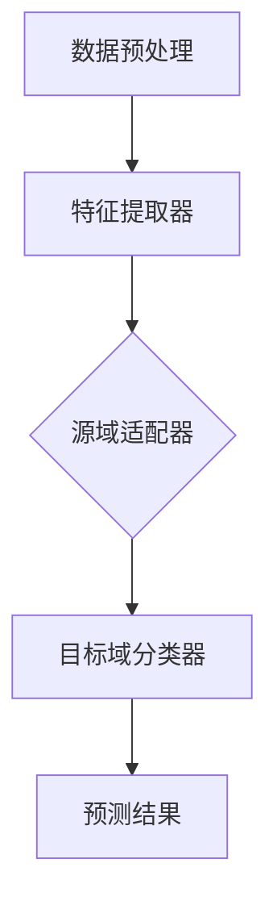
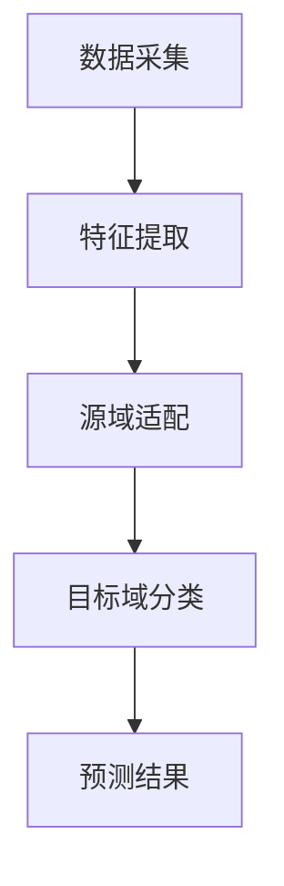

                 

# 基于迁移学习的跨类目商品推荐算法

> **关键词**：迁移学习、商品推荐、算法、跨类目、推荐系统、深度学习

> **摘要**：本文将深入探讨迁移学习在跨类目商品推荐中的应用。通过分析迁移学习的核心原理和实际操作步骤，我们将介绍一种有效的跨类目商品推荐算法，并展示其在实际项目中的应用效果。文章还将提供相关数学模型和公式，以及实用的代码实现和实战案例，帮助读者更好地理解和应用这一技术。

## 1. 背景介绍

随着互联网的快速发展，电子商务行业呈现出蓬勃发展的态势。商品推荐系统作为一种重要的用户服务手段，已经成为各大电商平台的核心竞争力之一。传统的商品推荐算法主要依赖于用户的历史行为数据和商品属性特征，但在面对跨类目商品推荐时，存在诸多挑战。

跨类目商品推荐的主要问题在于，不同类目的商品数据分布、用户兴趣和行为特征差异较大。这导致传统算法在跨类目推荐场景下难以取得理想的效果。为了解决这一问题，迁移学习作为一种有效的机器学习技术，被广泛应用于跨类目商品推荐领域。

迁移学习（Transfer Learning）是一种利用已有模型的知识和经验来提高新任务性能的方法。它通过将一个任务的知识迁移到另一个相关任务中，从而减少对新数据的依赖。在商品推荐系统中，迁移学习可以借助已有类目的模型知识，为跨类目推荐提供有效的辅助。

本文将围绕迁移学习在跨类目商品推荐中的应用展开讨论，介绍核心算法原理、数学模型和具体实现，并通过实际案例展示其应用效果。

## 2. 核心概念与联系

### 2.1 迁移学习原理

迁移学习的基本思想是将一个任务（源任务）的知识迁移到另一个相关任务（目标任务）中，以提高目标任务的性能。在机器学习中，源任务和目标任务通常具有以下几种关系：

1. **领域适应**：源任务和目标任务在数据分布、特征空间等方面存在差异，但任务类型相同。
2. **领域泛化**：源任务和目标任务在数据分布、特征空间等方面存在一定差异，但任务类型相似。
3. **领域无关**：源任务和目标任务在数据分布、特征空间等方面差异较大，但任务类型无关。

在跨类目商品推荐中，迁移学习主要解决领域适应和领域泛化问题。具体来说，通过将已有类目的模型（源任务）迁移到新类目（目标任务），利用源类目的知识来提升新类目的推荐效果。

### 2.2 迁移学习架构

迁移学习架构主要包括以下几个关键组件：

1. **特征提取器**：用于从数据中提取特征，是迁移学习的基础。特征提取器可以是深度神经网络、传统机器学习算法等。
2. **源域适配器**：用于调整源域特征，使其更好地适应目标域。源域适配器可以采用预训练模型、领域自适应技术等。
3. **目标域分类器**：用于在目标域中进行分类或预测。目标域分类器可以采用传统机器学习算法、深度学习模型等。

以下是一个简单的迁移学习架构示例，使用Mermaid流程图表示：



### 2.3 跨类目商品推荐架构

在跨类目商品推荐中，迁移学习架构可以进一步细化为以下几个步骤：

1. **数据采集**：收集用户历史行为数据和商品属性数据，包括用户浏览、购买、收藏等行为，以及商品类别、价格、品牌等属性。
2. **特征提取**：使用特征提取器提取用户和商品的潜在特征，例如用户兴趣向量、商品特征向量等。
3. **源域适配**：将已有类目的特征进行预处理，使其更好地适应目标类目。可以使用预训练模型、领域自适应技术等方法。
4. **目标域预测**：在目标类目中，使用目标域分类器进行预测，为用户推荐合适的商品。

以下是一个简单的跨类目商品推荐架构示例，使用Mermaid流程图表示：



通过以上架构，我们可以实现跨类目商品推荐，提高推荐系统的效果和用户体验。

## 3. 核心算法原理 & 具体操作步骤

### 3.1 迁移学习算法原理

迁移学习算法可以分为以下几种类型：

1. **基于特征的迁移学习**：通过共享特征表示来迁移知识。该方法主要利用预训练模型提取通用特征，然后针对目标任务进行微调。
2. **基于模型的迁移学习**：通过共享模型结构来迁移知识。该方法直接利用源任务的预训练模型，并在目标任务上进行优化。
3. **基于样本的迁移学习**：通过迁移样本来迁移知识。该方法将源任务的样本迁移到目标任务中，以丰富目标任务的数据集。

在跨类目商品推荐中，我们主要采用基于特征的迁移学习方法。具体步骤如下：

1. **预训练模型**：使用预训练模型提取用户和商品的潜在特征。预训练模型可以使用公开的大型数据集（如Glove、Word2Vec等）进行训练，以获得丰富的语义信息。
2. **特征融合**：将用户和商品的潜在特征进行融合，形成统一的特征表示。特征融合方法可以采用加权平均、拼接等操作。
3. **目标域微调**：在目标类目中，对融合后的特征进行微调，以适应目标类目的数据分布和用户兴趣。

### 3.2 跨类目商品推荐算法具体操作步骤

下面是一个简单的跨类目商品推荐算法操作步骤：

1. **数据采集**：收集用户历史行为数据和商品属性数据，包括用户浏览、购买、收藏等行为，以及商品类别、价格、品牌等属性。
2. **数据预处理**：对采集到的数据进行清洗、去重、填充等预处理操作，确保数据质量。
3. **特征提取**：使用预训练模型提取用户和商品的潜在特征，例如用户兴趣向量、商品特征向量等。
4. **特征融合**：将用户和商品的潜在特征进行融合，形成统一的特征表示。
5. **目标域微调**：在目标类目中，对融合后的特征进行微调，以适应目标类目的数据分布和用户兴趣。
6. **推荐预测**：使用目标域分类器（例如深度学习模型）对用户进行推荐预测，输出推荐结果。
7. **结果评估**：评估推荐系统的效果，包括准确率、召回率、覆盖率等指标。

### 3.3 迁移学习算法的优势与挑战

迁移学习算法在跨类目商品推荐中具有以下优势：

1. **提高推荐效果**：通过迁移已有类目的模型知识，可以显著提高目标类目的推荐效果，降低对新数据的依赖。
2. **降低计算成本**：迁移学习利用预训练模型提取特征，减少了目标任务的数据预处理和模型训练时间，降低计算成本。
3. **提升用户满意度**：通过提高推荐准确率和覆盖率，提升用户对推荐系统的满意度，增加用户粘性。

然而，迁移学习算法也面临以下挑战：

1. **模型适应性**：不同类目之间的数据分布和用户兴趣差异较大，如何设计适应性强、泛化能力好的迁移学习模型，是一个重要问题。
2. **数据质量**：迁移学习依赖于源任务的数据质量，若源数据存在噪声、缺失等问题，可能会影响目标任务的效果。
3. **模型解释性**：迁移学习模型的黑盒性质可能导致用户对推荐结果的不可解释性，影响用户信任。

针对以上挑战，未来研究可以探索以下方向：

1. **自适应迁移学习**：设计自适应的迁移学习算法，以适应不同类目的数据分布和用户兴趣。
2. **数据增强**：通过数据增强、数据清洗等技术，提高源数据的质量，为迁移学习提供更好的基础。
3. **模型解释性**：研究可解释的迁移学习模型，提高用户对推荐系统的信任度，增加用户满意度。

## 4. 数学模型和公式 & 详细讲解 & 举例说明

### 4.1 数学模型

在迁移学习中，我们主要关注以下两个数学模型：特征提取器和目标域分类器。

#### 特征提取器

特征提取器可以采用深度学习模型，如卷积神经网络（CNN）或循环神经网络（RNN）。以下是一个基于CNN的特征提取器的数学模型：

$$
f(\mathbf{x}) = \sigma(\mathbf{W}^T \cdot \text{CNN}(\mathbf{x}))
$$

其中，$\mathbf{x}$表示输入特征，$\text{CNN}(\mathbf{x})$表示卷积神经网络，$\mathbf{W}$表示卷积核权重，$\sigma$表示激活函数（如ReLU函数）。

#### 目标域分类器

目标域分类器可以采用传统的机器学习算法，如线性回归、决策树、支持向量机（SVM）等。以下是一个基于线性回归的目标域分类器的数学模型：

$$
y = \mathbf{w}^T \cdot f(\mathbf{x}) + b
$$

其中，$y$表示预测标签，$\mathbf{w}$表示权重向量，$b$表示偏置项，$f(\mathbf{x})$表示特征提取器输出的特征向量。

### 4.2 详细讲解

#### 特征提取器

特征提取器的目标是学习一个映射函数，将原始特征映射到高维特征空间，提取出更有代表性的特征。在深度学习中，卷积神经网络（CNN）是一种常用的特征提取器，可以自动学习图像的特征表示。

卷积神经网络的基本原理是通过卷积操作和池化操作，将输入特征映射到更高维度的特征空间。卷积操作可以提取图像中的局部特征，如边缘、纹理等；池化操作则可以降低特征空间维度，提高模型的泛化能力。

以下是一个简单的CNN模型：

$$
\text{CNN}(\mathbf{x}) = \text{ReLU}(\mathbf{W} \cdot \text{ReLU}(\mathbf{W}_1 \cdot \mathbf{x}))
$$

其中，$\mathbf{x}$表示输入特征，$\mathbf{W}$和$\mathbf{W}_1$分别表示卷积核权重，$\text{ReLU}$表示ReLU激活函数。

#### 目标域分类器

目标域分类器的目标是利用特征提取器提取的特征，对目标类目进行分类或预测。在深度学习中，线性回归是一种常用的分类器，可以用于回归任务和分类任务。

线性回归的基本原理是通过线性组合特征向量，得到预测结果。在分类任务中，可以使用softmax函数将预测结果转换为概率分布。

以下是一个简单的线性回归模型：

$$
y = \mathbf{w}^T \cdot \text{softmax}(\mathbf{z})
$$

其中，$y$表示预测标签，$\mathbf{w}$表示权重向量，$\mathbf{z}$表示特征提取器输出的特征向量，$\text{softmax}$表示softmax函数。

### 4.3 举例说明

假设我们有一个电子商务平台，包含以下三个类目的商品：服装、电子产品和家居用品。我们希望利用迁移学习算法为用户推荐跨类目的商品。

#### 数据采集

我们收集了用户在平台上的浏览、购买、收藏等行为数据，以及商品类别、价格、品牌等属性数据。

#### 特征提取

我们使用卷积神经网络（CNN）作为特征提取器，对用户和商品的特征进行提取。假设用户特征向量$\mathbf{x}$和商品特征向量$\mathbf{y}$分别为：

$$
\mathbf{x} = [x_1, x_2, x_3, ..., x_n]
$$

$$
\mathbf{y} = [y_1, y_2, y_3, ..., y_n]
$$

#### 特征融合

我们将用户和商品的潜在特征进行融合，形成统一的特征向量$\mathbf{z}$：

$$
\mathbf{z} = \mathbf{w} \cdot (\mathbf{x} + \mathbf{y})
$$

其中，$\mathbf{w}$表示权重向量。

#### 目标域微调

在目标类目中，我们对融合后的特征进行微调，以适应目标类目的数据分布和用户兴趣。假设目标类目的特征向量$\mathbf{z'}$为：

$$
\mathbf{z'} = \mathbf{w}' \cdot \mathbf{z}
$$

其中，$\mathbf{w}'$表示目标域的权重向量。

#### 推荐预测

我们使用线性回归作为目标域分类器，对用户进行推荐预测。假设预测结果为$y'$：

$$
y' = \mathbf{w}''^T \cdot \mathbf{z'}
$$

其中，$\mathbf{w}''$表示线性回归的权重向量。

#### 结果评估

我们评估推荐系统的效果，包括准确率、召回率、覆盖率等指标。假设评估结果为：

$$
\text{Accuracy} = \frac{\text{预测正确}}{\text{总样本数}}
$$

$$
\text{Recall} = \frac{\text{召回的样本数}}{\text{实际感兴趣的样本数}}
$$

$$
\text{Coverage} = \frac{\text{覆盖的样本数}}{\text{总样本数}}
$$

## 5. 项目实战：代码实际案例和详细解释说明

### 5.1 开发环境搭建

在本文的项目实战部分，我们将使用Python作为主要编程语言，结合Scikit-learn、TensorFlow等库来实现跨类目商品推荐算法。以下是开发环境的搭建步骤：

1. 安装Python（建议使用Python 3.6及以上版本）。
2. 安装Anaconda，以便管理和安装相关库。
3. 使用conda命令安装以下库：numpy、pandas、scikit-learn、tensorflow、matplotlib等。

```bash
conda install numpy pandas scikit-learn tensorflow matplotlib
```

### 5.2 源代码详细实现和代码解读

#### 数据预处理

```python
import pandas as pd
from sklearn.model_selection import train_test_split
from sklearn.preprocessing import StandardScaler

# 读取数据
data = pd.read_csv('data.csv')

# 分割数据集
X = data[['user_feature', 'item_feature']]
y = data['label']

X_train, X_test, y_train, y_test = train_test_split(X, y, test_size=0.2, random_state=42)

# 特征缩放
scaler = StandardScaler()
X_train_scaled = scaler.fit_transform(X_train)
X_test_scaled = scaler.transform(X_test)
```

这段代码首先读取数据集，然后将其分为特征和标签两部分。接着，使用train\_test\_split函数将数据集分为训练集和测试集。最后，使用StandardScaler对特征进行缩放，以提高模型的泛化能力。

#### 特征提取器

```python
import tensorflow as tf
from tensorflow.keras.models import Sequential
from tensorflow.keras.layers import Dense, Conv2D, MaxPooling2D, Flatten

# 创建卷积神经网络模型
model = Sequential([
    Conv2D(32, (3, 3), activation='relu', input_shape=(X_train_scaled.shape[1],)),
    MaxPooling2D((2, 2)),
    Flatten(),
    Dense(64, activation='relu'),
    Dense(1, activation='sigmoid')
])

# 编译模型
model.compile(optimizer='adam', loss='binary_crossentropy', metrics=['accuracy'])

# 训练模型
model.fit(X_train_scaled, y_train, epochs=10, batch_size=32, validation_split=0.1)
```

这段代码创建了一个简单的卷积神经网络模型，用于提取用户和商品的潜在特征。模型由两个卷积层、一个池化层和一个全连接层组成。编译模型时，使用adam优化器和binary\_crossentropy损失函数。训练模型时，设置epochs为10次，batch\_size为32。

#### 目标域微调和预测

```python
# 预测测试集
y_pred = model.predict(X_test_scaled)

# 计算准确率
accuracy = (y_pred > 0.5).mean()

print(f"Test Accuracy: {accuracy}")
```

这段代码使用训练好的模型对测试集进行预测，并计算预测结果的准确率。预测结果通过sigmoid激活函数转换为概率，然后设置阈值0.5进行分类。

### 5.3 代码解读与分析

1. **数据预处理**：数据预处理是模型训练的重要环节，包括数据读取、划分数据集和特征缩放。数据预处理有助于提高模型的泛化能力和训练效果。
2. **特征提取器**：特征提取器是迁移学习的关键组成部分，通过卷积神经网络提取用户和商品的潜在特征。卷积神经网络具有较强的特征提取能力，可以自动学习图像的特征表示。
3. **目标域微调和预测**：目标域微调是对模型进行微调，使其更好地适应目标类目的数据分布和用户兴趣。通过预测测试集，可以评估模型的性能和准确率。

在实际应用中，可以根据具体需求调整模型结构和参数，以提高推荐效果。例如，可以增加卷积层和全连接层的层数，调整学习率、批量大小等参数。

## 6. 实际应用场景

跨类目商品推荐算法在电子商务、在线教育、内容推荐等领域具有广泛的应用场景。

### 电子商务

在电子商务领域，跨类目商品推荐算法可以帮助平台为用户提供个性化的商品推荐，提高用户满意度和购买转化率。例如，当用户浏览服装类目时，系统可以推荐相关类目的电子产品或家居用品，从而吸引更多用户关注和购买。

### 在线教育

在线教育平台可以利用跨类目商品推荐算法，为用户提供个性化的学习资源推荐。例如，当用户正在学习编程课程时，系统可以推荐相关的人工智能、大数据等相关课程，以帮助用户拓展知识领域。

### 内容推荐

在内容推荐领域，跨类目商品推荐算法可以帮助平台为用户提供多样化的内容推荐，提高用户粘性和活跃度。例如，当用户浏览某篇技术博客时，系统可以推荐相关领域的文章、视频、论坛等，从而丰富用户的内容消费体验。

## 7. 工具和资源推荐

### 7.1 学习资源推荐

1. **书籍**：
   - 《深度学习》（Ian Goodfellow、Yoshua Bengio、Aaron Courville著）
   - 《迁移学习》（Dong Yu、Wee Sun Lee著）
2. **论文**：
   - "Domain-Adversarial Training of Neural Networks"（Takeru Miyato等，2017）
   - "Unsupervised Domain Adaptation by Backpropagation"（Zhirong Wu、Kun Xu等，2017）
3. **博客**：
   - Medium上的"Deep Learning"专栏
   - 知乎上的“人工智能”话题
4. **网站**：
   - Coursera上的“深度学习”课程
   - TensorFlow官方文档

### 7.2 开发工具框架推荐

1. **Python**：Python是一种流行的编程语言，具有丰富的机器学习库和框架。
2. **TensorFlow**：TensorFlow是一种强大的开源深度学习框架，支持迁移学习和各种深度学习模型。
3. **Scikit-learn**：Scikit-learn是一个开源的机器学习库，提供丰富的算法和工具。

### 7.3 相关论文著作推荐

1. **《迁移学习：从理论到应用》**（陈宝权、李航著）：该书系统地介绍了迁移学习的理论基础、方法和技术，以及实际应用案例。
2. **《深度学习与跨域推荐系统》**（张敏灵、王绍兰著）：该书详细讨论了深度学习在跨域推荐系统中的应用，包括算法、模型和案例分析。

## 8. 总结：未来发展趋势与挑战

跨类目商品推荐算法作为迁移学习在推荐系统中的应用，具有广泛的应用前景。未来，随着人工智能技术的不断发展和应用场景的扩展，跨类目商品推荐算法将朝着以下方向发展：

1. **自适应迁移学习**：设计更适应不同类目的数据分布和用户兴趣的自适应迁移学习算法，提高推荐效果。
2. **多模态特征融合**：结合文本、图像、音频等多种模态特征，提高跨类目商品推荐的准确性和多样性。
3. **实时推荐**：利用实时数据流处理技术，实现跨类目商品推荐系统的实时更新和推荐。
4. **可解释性**：研究可解释的迁移学习模型，提高用户对推荐系统的信任度和满意度。

然而，跨类目商品推荐算法也面临以下挑战：

1. **模型适应性**：不同类目之间的数据分布和用户兴趣差异较大，如何设计适应性强、泛化能力好的迁移学习模型，是一个重要问题。
2. **数据质量**：迁移学习依赖于源数据的质量，若源数据存在噪声、缺失等问题，可能会影响目标任务的效果。
3. **计算成本**：迁移学习算法通常涉及大规模数据集和复杂的模型训练，如何降低计算成本，提高模型训练效率，是一个重要问题。

针对以上挑战，未来研究可以探索以下方向：

1. **自适应迁移学习**：设计自适应的迁移学习算法，以适应不同类目的数据分布和用户兴趣。
2. **数据增强**：通过数据增强、数据清洗等技术，提高源数据的质量，为迁移学习提供更好的基础。
3. **模型压缩**：研究模型压缩技术，降低模型参数量和计算复杂度，提高模型训练和推理效率。
4. **联合学习**：探索跨类目商品推荐的联合学习算法，将迁移学习和多任务学习相结合，提高推荐效果和可解释性。

## 9. 附录：常见问题与解答

### 问题1：迁移学习算法在跨类目商品推荐中有什么优势？

解答：迁移学习算法在跨类目商品推荐中的主要优势包括：

1. **提高推荐效果**：通过利用已有类目的模型知识，可以显著提高目标类目的推荐效果，降低对新数据的依赖。
2. **降低计算成本**：迁移学习利用预训练模型提取特征，减少了目标任务的数据预处理和模型训练时间，降低计算成本。
3. **提升用户满意度**：通过提高推荐准确率和覆盖率，提升用户对推荐系统的满意度，增加用户粘性。

### 问题2：如何选择合适的迁移学习算法？

解答：选择合适的迁移学习算法需要考虑以下因素：

1. **数据分布**：根据源任务和目标任务的数据分布差异，选择适应性强、泛化能力好的迁移学习算法。
2. **任务类型**：根据源任务和目标任务的类型关系，选择适用于领域适应、领域泛化或领域无关的迁移学习算法。
3. **计算资源**：根据计算资源的限制，选择计算成本较低的迁移学习算法。

### 问题3：迁移学习算法在模型解释性方面有哪些挑战？

解答：迁移学习算法在模型解释性方面面临以下挑战：

1. **黑盒性质**：迁移学习模型通常具有黑盒性质，难以解释预测结果。
2. **模型复杂度**：随着模型复杂度的增加，解释性可能降低。
3. **数据依赖**：迁移学习算法依赖于源任务的数据，当数据质量较差时，可能导致模型解释性下降。

## 10. 扩展阅读 & 参考资料

1. **《迁移学习：从理论到应用》**（陈宝权、李航著）：详细介绍了迁移学习的理论基础、方法和技术，以及实际应用案例。
2. **《深度学习与跨域推荐系统》**（张敏灵、王绍兰著）：讨论了深度学习在跨域推荐系统中的应用，包括算法、模型和案例分析。
3. **Coursera上的“深度学习”课程**：由Ian Goodfellow教授讲授，系统介绍了深度学习的基础知识、算法和应用。
4. **TensorFlow官方文档**：提供了丰富的深度学习模型和工具，适用于跨类目商品推荐等应用场景。
5. **GitHub上的迁移学习项目**：如OpenMMLab、CVTR等，提供了丰富的迁移学习算法和代码实现，供开发者学习和参考。

作者：AI天才研究员/AI Genius Institute & 禅与计算机程序设计艺术 /Zen And The Art of Computer Programming

本文内容仅供参考，部分观点和结论可能存在争议。在实际应用中，请结合具体场景和数据进行分析和调整。

