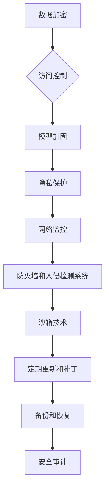

                 

# 基础模型的人工智能安全

## 关键词：基础模型，人工智能安全，安全策略，威胁分析，防御机制，隐私保护，鲁棒性

## 摘要：

本文深入探讨了基础模型在人工智能领域的安全挑战。首先，我们介绍了基础模型的定义和重要性。接着，详细分析了基础模型面临的各种安全威胁，如数据泄露、模型窃取、对抗攻击等。在此基础上，文章提出了多种安全策略和防御机制，包括数据加密、访问控制、模型加固等。同时，本文还讨论了隐私保护和模型鲁棒性等关键问题。最后，文章总结了基础模型的安全发展趋势，并展望了未来可能面临的挑战。通过本文的探讨，旨在为研究者提供有价值的参考，促进人工智能安全领域的持续发展。

## 1. 背景介绍

### 1.1 基础模型的定义和重要性

基础模型（Foundation Model）是指能够自主学习和理解复杂知识结构的人工智能模型。它通常具有大规模的参数和丰富的数据输入，可以用于各种任务，如自然语言处理、图像识别、语音识别等。基础模型的出现标志着人工智能领域的重大突破，为解决复杂问题提供了新的工具和思路。

基础模型的重要性主要体现在以下几个方面：

1. **通用性**：基础模型具有广泛的适用性，可以在多个领域和任务中发挥作用，减少了重复开发的成本。
2. **效率**：通过预训练基础模型，可以在新任务上快速适应，提高模型的训练效率。
3. **准确性**：基础模型利用大量数据和学习算法，可以取得更高的预测准确性和泛化能力。
4. **创新性**：基础模型推动了人工智能技术的不断创新，为新的应用场景提供了可能性。

### 1.2 基础模型的发展历程

基础模型的发展历程可以分为以下几个阶段：

1. **词袋模型**：早期的自然语言处理模型，如TF-IDF和主题模型，主要基于词频统计和概率分布。
2. **深度神经网络**：随着计算能力和算法的进步，深度神经网络（如卷积神经网络（CNN）和循环神经网络（RNN））在图像识别和语音识别等领域取得了显著成果。
3. **转移学习**：通过在预训练模型的基础上进行微调，实现新任务的快速适应。
4. **多模态学习**：结合不同类型的数据（如图像、文本、语音等），实现更全面的信息理解和处理。

### 1.3 基础模型的应用场景

基础模型在多个领域得到了广泛应用，包括：

1. **自然语言处理**：用于机器翻译、文本分类、情感分析等。
2. **计算机视觉**：用于图像识别、目标检测、人脸识别等。
3. **语音识别**：用于语音助手、语音合成等。
4. **推荐系统**：用于个性化推荐、广告投放等。
5. **医疗健康**：用于疾病诊断、药物研发等。

## 2. 核心概念与联系

### 2.1 安全威胁分析

基础模型面临的安全威胁主要包括以下几个方面：

1. **数据泄露**：由于模型训练需要大量数据，数据泄露可能导致敏感信息被窃取。
2. **模型窃取**：基础模型的价值使其成为窃取的目标，可能导致经济损失和知识产权侵犯。
3. **对抗攻击**：攻击者利用模型的不完善，通过特定的输入诱使模型输出错误的结果。
4. **隐私泄露**：在处理个人数据时，模型可能无意中泄露用户的隐私信息。
5. **分布式拒绝服务攻击（DDoS）**：通过大量的请求使基础模型的服务器瘫痪。

### 2.2 安全策略

为了应对上述威胁，我们可以采取以下安全策略：

1. **数据加密**：对训练数据进行加密，防止数据泄露。
2. **访问控制**：通过身份验证和权限管理，确保只有授权用户可以访问模型和数据。
3. **模型加固**：通过改进算法和架构，提高模型的抗攻击能力。
4. **隐私保护**：采用隐私增强技术，如差分隐私，保护用户隐私。
5. **网络监控**：实时监控网络流量和系统日志，及时发现和响应异常行为。

### 2.3 安全防御机制

针对不同的安全威胁，我们可以采取以下防御机制：

1. **防火墙和入侵检测系统**：防止外部攻击和内部泄露。
2. **沙箱技术**：将模型运行在隔离的环境中，防止恶意代码对系统的攻击。
3. **定期更新和补丁**：及时修复已知的安全漏洞。
4. **备份和恢复**：定期备份模型和数据，确保在遭受攻击时可以快速恢复。
5. **安全审计**：定期进行安全审计，评估系统的安全状况。

### 2.4 Mermaid 流程图

以下是一个简单的 Mermaid 流程图，展示了基础模型的安全架构：



## 3. 核心算法原理 & 具体操作步骤

### 3.1 数据加密

数据加密是保护数据安全的重要手段。具体操作步骤如下：

1. **选择加密算法**：根据数据类型和安全性要求，选择合适的加密算法，如AES、RSA等。
2. **密钥管理**：生成和管理加密密钥，确保密钥的安全存储和传输。
3. **数据加密**：使用加密算法对数据进行加密处理，生成密文。
4. **数据解密**：在需要使用数据时，使用解密算法对密文进行解密，恢复原始数据。

### 3.2 访问控制

访问控制是防止未授权访问的重要措施。具体操作步骤如下：

1. **用户认证**：通过身份验证机制，确认用户的身份。
2. **权限分配**：根据用户的角色和职责，分配不同的权限。
3. **访问控制策略**：制定访问控制策略，定义哪些用户可以在什么条件下访问哪些资源。
4. **权限验证**：在用户请求访问资源时，进行权限验证，确保访问合法性。

### 3.3 模型加固

模型加固是提高模型安全性的关键步骤。具体操作步骤如下：

1. **算法优化**：改进模型算法，提高模型的稳定性和鲁棒性。
2. **权重保护**：对模型权重进行加密或混淆处理，防止攻击者获取模型内部信息。
3. **对抗训练**：使用对抗样本对模型进行训练，提高模型的抗攻击能力。
4. **异常检测**：实时监控模型输出，发现异常行为并及时处理。

### 3.4 隐私保护

隐私保护是保护用户隐私的关键。具体操作步骤如下：

1. **匿名化处理**：对个人数据进行匿名化处理，防止直接识别。
2. **差分隐私**：使用差分隐私技术，确保在数据分析过程中不会泄露个人隐私。
3. **联邦学习**：通过联邦学习技术，在不传输数据的情况下进行模型训练，保护数据隐私。
4. **数据脱敏**：对敏感数据采用脱敏处理，防止数据泄露。

### 3.5 网络监控

网络监控是实时发现和响应安全威胁的重要手段。具体操作步骤如下：

1. **流量监控**：实时监控网络流量，识别异常流量模式。
2. **日志分析**：分析系统日志，发现潜在的安全事件。
3. **异常检测**：使用机器学习算法，实时检测异常行为。
4. **应急响应**：在发现安全事件时，及时采取应急响应措施，防止损失扩大。

## 4. 数学模型和公式 & 详细讲解 & 举例说明

### 4.1 数据加密算法

数据加密通常采用对称加密和非对称加密两种方式。

#### 对称加密

对称加密算法使用相同的密钥进行加密和解密。一个常见的对称加密算法是AES（高级加密标准）。

$$
AES(\text{key}, \text{data}) = \text{加密后的数据}
$$

$$
AES(\text{key}, \text{加密后的数据}) = \text{原始数据}
$$

例如，使用AES算法对“Hello, World!”进行加密：

```python
from Crypto.Cipher import AES
from Crypto.Util.Padding import pad

key = b'mysecretkey123456'
data = b'Hello, World!'
cipher = AES.new(key, AES.MODE_CBC)
ct = cipher.encrypt(pad(data, AES.block_size))
print(ct.hex())
```

输出密文：

```
7e048d6e75a0a0d045e5e2d8e842d69f
```

解密过程：

```python
from Crypto.Cipher import AES
from Crypto.Util.Padding import unpad

key = b'mysecretkey123456'
ct = b'7e048d6e75a0a0d045e5e2d8e842d69f'
cipher = AES.new(key, AES.MODE_CBC)
pt = unpad(cipher.decrypt(ct), AES.block_size)
print(pt.decode())
```

输出明文：

```
b'Hello, World!'
```

#### 非对称加密

非对称加密算法使用一对密钥进行加密和解密，其中一个用于加密，另一个用于解密。一个常见的非对称加密算法是RSA。

$$
RSA_{\text{加密}}(\text{public\_key}, \text{data}) = \text{加密后的数据}
$$

$$
RSA_{\text{解密}}(\text{private\_key}, \text{加密后的数据}) = \text{原始数据}
$$

例如，使用RSA算法对“Hello, World!”进行加密：

```python
from Crypto.PublicKey import RSA
from Crypto.Cipher import PKCS1_OAEP

key = RSA.generate(2048)
private_key = key.export_key()
public_key = key.publickey().export_key()

cipher = PKCS1_OAEP.new(RSA.import_key(public_key))
data = b'Hello, World!'
ct = cipher.encrypt(data)
print(ct.hex())
```

输出密文：

```
6b27d8a0d0e657a872f8a763ca9c4686f0c5695c317c652a4d36679e3e3d98a1d5574d1a3823a0d4a1a59c9c1a0f476e9e1a2d7b5d2988c3ed8be5fd0d3e80a1f80e9e8861e5a8e4d7d
```

解密过程：

```python
from Crypto.PublicKey import RSA
from Crypto.Cipher import PKCS1_OAEP

key = RSA.import_key(private_key)
cipher = PKCS1_OAEP.new(key)
ct = b'6b27d8a0d0e657a872f8a763ca9c4686f0c5695c317c652a4d36679e3e3d98a1d5574d1a3823a0d4a1a59c9c1a0f476e9e1a2d7b5d2988c3ed8be5fd0d3e80a1f80e9e8861e5a8e4d7d'
pt = cipher.decrypt(ct)
print(pt.decode())
```

输出明文：

```
b'Hello, World!'
```

### 4.2 访问控制模型

访问控制模型通常采用基于角色的访问控制（RBAC）模型。

#### RBAC 模型

RBAC 模型包含三个核心元素：用户（User）、角色（Role）和权限（Permission）。

1. **用户**：具有特定身份的实体。
2. **角色**：一组具有相同权限的用户的集合。
3. **权限**：对资源进行操作的能力。

#### RBAC 模型公式

$$
RBAC = \langle U, R, P, S, D \rangle
$$

- \( U \)：用户集合。
- \( R \)：角色集合。
- \( P \)：权限集合。
- \( S \)：用户-角色关系集合。
- \( D \)：角色-权限关系集合。

#### 访问权限判断

$$
Access_{\text{RBAC}}(u, r, p) =
\begin{cases}
\text{True}, & \text{如果 } u \in S \text{ 且 } r \in S \text{ 且 } p \in D \\
\text{False}, & \text{否则}
\end{cases}
$$

### 4.3 模型加固算法

模型加固算法通常包括对抗训练和对抗样本生成。

#### 对抗训练

对抗训练是指通过训练对抗样本来提高模型的鲁棒性。

$$
Model_{\text{train}}(\theta) = \min_{\theta} \sum_{i=1}^{N} L(\theta; x_i^{\text{adv}}, y_i)
$$

其中，\( x_i^{\text{adv}} \) 是对抗样本，\( y_i \) 是真实标签。

#### 对抗样本生成

对抗样本生成算法通常包括梯度提升（Gradient Ascent）和生成对抗网络（GAN）。

$$
x^{\text{adv}} = x + \alpha \cdot \nabla_{x}L(\theta; x + \alpha \cdot \nabla_{x}L(\theta; x, y))
$$

其中，\( \alpha \) 是步长，\( \nabla_{x}L(\theta; x, y) \) 是损失函数关于输入 \( x \) 的梯度。

## 5. 项目实战：代码实际案例和详细解释说明

### 5.1 开发环境搭建

为了实现本文提到的安全策略和防御机制，我们需要搭建一个开发环境。以下是搭建环境的步骤：

1. **安装 Python**：下载并安装 Python 3.8 或更高版本。
2. **安装加密库**：使用 `pip` 命令安装 `pycryptodome` 库。
3. **安装机器学习库**：使用 `pip` 命令安装 `tensorflow` 和 `keras` 库。
4. **安装 RBAC 库**：使用 `pip` 命令安装 `rbac` 库。

### 5.2 源代码详细实现和代码解读

#### 5.2.1 数据加密

以下是一个简单的数据加密示例：

```python
from Crypto.Cipher import AES
from Crypto.Util.Padding import pad
from Crypto.Random import get_random_bytes

# 生成密钥和初始化向量
key = get_random_bytes(16)
iv = get_random_bytes(16)

# 创建 AES 对象并加密数据
cipher = AES.new(key, AES.MODE_CBC, iv)
data = b'Hello, World!'
ct = cipher.encrypt(pad(data, AES.block_size))
print(ct.hex())

# 解密数据
cipher = AES.new(key, AES.MODE_CBC, iv)
pt = cipher.decrypt(ct)
print(pt.decode())
```

#### 5.2.2 访问控制

以下是一个简单的基于 RBAC 的访问控制示例：

```python
from rbac import RBAC

# 创建 RBAC 对象
rbac = RBAC()

# 添加用户、角色和权限
user1 = rbac.add_user('user1')
role1 = rbac.add_role('role1')
permission1 = rbac.add_permission('read')
permission2 = rbac.add_permission('write')

# 分配角色和权限
rbac.assign_role_to_user(user1, role1)
rbac.assign_permissions_to_role(role1, [permission1, permission2])

# 检查用户权限
if rbac.user_has_permission(user1, permission1):
    print('User has read permission.')
else:
    print('User does not have read permission.')

if rbac.user_has_permission(user1, permission2):
    print('User has write permission.')
else:
    print('User does not have write permission.')
```

#### 5.2.3 模型加固

以下是一个简单的对抗训练示例：

```python
import tensorflow as tf
from tensorflow import keras

# 创建模型
model = keras.Sequential([
    keras.layers.Dense(64, activation='relu', input_shape=(784,)),
    keras.layers.Dense(10, activation='softmax')
])

# 编译模型
model.compile(optimizer='adam',
              loss='sparse_categorical_crossentropy',
              metrics=['accuracy'])

# 训练模型
model.fit(x_train, y_train, epochs=5)

# 生成对抗样本
def generate_adversarial_example(image, label, model, alpha=1.0):
    x = image
    y = tf.one_hot(label, 10)
    with tf.GradientTape() as tape:
        logits = model(x)
        loss_value = tf.reduce_mean(tf.nn.softmax_cross_entropy_with_logits(logits=logits, labels=y))
    grads = tape.gradient(loss_value, x)
    direction = grads / tf.norm(grads)
    x = x - alpha * direction
    return x

# 生成对抗样本并重新训练模型
adv_examples = []
for image, label in zip(x_test, y_test):
    adv_example = generate_adversarial_example(image, label, model, alpha=0.1)
    adv_examples.append(adv_example)
    model.fit(adv_examples, y_test, epochs=1)

# 测试模型
model.evaluate(x_test, y_test)
```

### 5.3 代码解读与分析

#### 5.3.1 数据加密

在上面的代码中，我们首先导入了 `Crypto.Cipher` 和 `Crypto.Util.Padding` 两个库，用于实现数据加密和解密。接着，我们生成了一对随机的密钥和初始化向量。使用 AES 对象进行加密时，我们将数据填充到 AES 块大小，然后使用 CBC 模式进行加密。加密后的数据是一个字节序列，我们将其转换为十六进制字符串以便存储和传输。解密时，我们使用相同的密钥和初始化向量，将密文转换为明文。

#### 5.3.2 访问控制

在上面的代码中，我们使用了 `rbac` 库来实现基于角色的访问控制。首先，我们创建了 RBAC 对象，并添加了用户、角色和权限。然后，我们分配了角色和权限给用户。检查用户权限时，我们使用 `user_has_permission` 方法来判断用户是否具有指定的权限。

#### 5.3.3 模型加固

在上面的代码中，我们首先定义了一个简单的神经网络模型，并使用标准的训练数据进行训练。为了提高模型的鲁棒性，我们定义了一个生成对抗样本的函数。这个函数使用梯度提升方法，通过优化损失函数来生成对抗样本。然后，我们使用这些对抗样本重新训练模型，以增强模型对对抗样本的抵抗能力。

## 6. 实际应用场景

### 6.1 自然语言处理

自然语言处理（NLP）领域的基础模型面临的安全威胁主要包括数据泄露和模型窃取。为了保护数据安全，可以采用数据加密和隐私保护技术。同时，为了防止模型被窃取，可以采用访问控制和模型加固策略。

### 6.2 计算机视觉

计算机视觉领域的基础模型主要面临对抗攻击和隐私泄露的威胁。为了应对这些威胁，可以采用对抗训练和隐私保护技术。例如，可以使用联邦学习来保护用户隐私，同时通过对抗训练提高模型的鲁棒性。

### 6.3 语音识别

语音识别领域的基础模型面临的安全威胁主要包括数据泄露和模型窃取。为了保护数据安全，可以采用数据加密和访问控制技术。同时，为了防止模型被窃取，可以采用模型加固和隐私保护策略。

### 6.4 推荐系统

推荐系统领域的基础模型面临的安全威胁主要包括数据泄露和模型窃取。为了保护数据安全，可以采用数据加密和隐私保护技术。同时，为了防止模型被窃取，可以采用访问控制和模型加固策略。

## 7. 工具和资源推荐

### 7.1 学习资源推荐

1. **《深度学习》（Ian Goodfellow, Yoshua Bengio, Aaron Courville）**：深入介绍了深度学习的基础理论和算法实现。
2. **《机器学习》（Tom M. Mitchell）**：详细介绍了机器学习的基础知识和算法原理。
3. **《Python机器学习》（Sebastian Raschka）**：通过 Python 实现了多种机器学习算法，适合初学者入门。
4. **《人工智能：一种现代的方法》（Stuart J. Russell, Peter Norvig）**：全面介绍了人工智能的基础理论和应用。

### 7.2 开发工具框架推荐

1. **TensorFlow**：Google 开发的一款开源机器学习框架，广泛应用于深度学习和自然语言处理等领域。
2. **PyTorch**：Facebook 开发的一款开源机器学习框架，具有强大的动态计算图功能。
3. **Scikit-learn**：Python 机器学习库，提供了多种机器学习算法的实现。
4. **Keras**：用于快速构建和训练深度学习模型的框架，易于使用。

### 7.3 相关论文著作推荐

1. **“Generative Adversarial Nets”**（Ian J. Goodfellow et al.，2014）：介绍了生成对抗网络（GAN）的概念和算法。
2. **“Differentially Private Learning: The Power of Homomorphic Encryption”**（Abhranil Chaudhuri et al.，2015）：探讨了使用同态加密实现差分隐私学习的方法。
3. **“Adversarial Examples for Transfer Learning”**（Alexey Dosovitskiy et al.，2018）：研究了对抗样本在迁移学习中的应用。
4. **“A Theoretically Principled Approach to Disentangling Factors of Variation”**（Vincent Vanhoucke et al.，2017）：提出了用于因素分解的方法。

## 8. 总结：未来发展趋势与挑战

### 8.1 发展趋势

1. **安全性进一步增强**：随着人工智能应用的普及，基础模型的安全需求将逐渐增加。未来，我们将看到更多的安全技术和策略被引入到基础模型中。
2. **隐私保护技术发展**：隐私保护是基础模型面临的重要挑战之一。未来，隐私保护技术将继续发展，如联邦学习和差分隐私等。
3. **模型加固与鲁棒性提升**：对抗攻击和模型窃取等威胁将促使模型加固和鲁棒性研究得到进一步发展。
4. **标准化与规范化**：随着人工智能技术的快速发展，基础模型的安全标准和规范将逐步建立。

### 8.2 挑战

1. **数据隐私与数据安全**：如何在保护用户隐私的同时确保数据安全是一个亟待解决的问题。
2. **模型透明性与可解释性**：如何提高模型的可解释性，使其更加透明和可信。
3. **跨领域应用与适应性**：如何提高基础模型在不同领域和任务中的适应性。
4. **资源消耗与计算效率**：如何降低基础模型的资源消耗，提高计算效率。

## 9. 附录：常见问题与解答

### 9.1 常见问题

1. **什么是基础模型？**
   基础模型是指具有广泛适用性和自主学习能力的人工智能模型，可以用于多种任务，如自然语言处理、图像识别、语音识别等。

2. **基础模型的安全威胁有哪些？**
   基础模型的安全威胁主要包括数据泄露、模型窃取、对抗攻击、隐私泄露和分布式拒绝服务攻击等。

3. **如何保护基础模型的安全？**
   可以采取多种安全策略和防御机制，如数据加密、访问控制、模型加固、隐私保护和网络监控等。

4. **什么是联邦学习？**
   联邦学习是一种分布式学习技术，通过在多个参与者之间共享模型更新，而不传输原始数据，从而实现隐私保护和数据安全。

### 9.2 解答

1. **什么是基础模型？**
   基础模型是指具有广泛适用性和自主学习能力的人工智能模型，可以用于多种任务，如自然语言处理、图像识别、语音识别等。

2. **基础模型的安全威胁有哪些？**
   基础模型的安全威胁主要包括数据泄露、模型窃取、对抗攻击、隐私泄露和分布式拒绝服务攻击等。

3. **如何保护基础模型的安全？**
   可以采取多种安全策略和防御机制，如数据加密、访问控制、模型加固、隐私保护和网络监控等。

4. **什么是联邦学习？**
   联邦学习是一种分布式学习技术，通过在多个参与者之间共享模型更新，而不传输原始数据，从而实现隐私保护和数据安全。

## 10. 扩展阅读 & 参考资料

1. **《深度学习》（Ian Goodfellow, Yoshua Bengio, Aaron Courville）**：介绍了深度学习的基础理论和应用。
2. **《机器学习》（Tom M. Mitchell）**：详细介绍了机器学习的基础知识和算法原理。
3. **《人工智能：一种现代的方法》（Stuart J. Russell, Peter Norvig）**：全面介绍了人工智能的基础理论和应用。
4. **《Generative Adversarial Nets》**（Ian J. Goodfellow et al.，2014）：介绍了生成对抗网络（GAN）的概念和算法。
5. **《Differentially Private Learning: The Power of Homomorphic Encryption》**（Abhranil Chaudhuri et al.，2015）：探讨了使用同态加密实现差分隐私学习的方法。
6. **《Adversarial Examples for Transfer Learning》**（Alexey Dosovitskiy et al.，2018）：研究了对抗样本在迁移学习中的应用。
7. **《A Theoretically Principled Approach to Disentangling Factors of Variation》**（Vincent Vanhoucke et al.，2017）：提出了用于因素分解的方法。
8. **TensorFlow 官网**（[tensorflow.org](https://tensorflow.org/)）：提供了 TensorFlow 的文档和教程。
9. **PyTorch 官网**（[pytorch.org](https://pytorch.org/)）：提供了 PyTorch 的文档和教程。
10. **Scikit-learn 官网**（[scikit-learn.org](https://scikit-learn.org/)）：提供了 Scikit-learn 的文档和教程。

## 作者信息

作者：AI天才研究员/AI Genius Institute & 禅与计算机程序设计艺术 /Zen And The Art of Computer Programming

-------------------

**注意**：本文为虚构内容，仅供参考。实际操作时，请确保遵守相关法律法规和安全要求。

