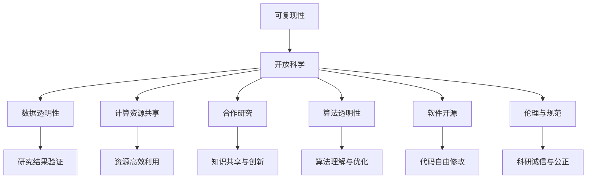

                 

### 文章标题

《基础模型的可复现性与开放科学》

### 关键词

基础模型、可复现性、开放科学、算法原理、数学模型、项目实战、应用场景、工具资源、发展趋势、挑战

### 摘要

本文将深入探讨基础模型的可复现性在开放科学中的重要性。通过解析核心概念与联系，介绍核心算法原理和操作步骤，结合数学模型与公式进行详细讲解，并通过实际项目案例进行代码解读与分析，探讨基础模型在不同应用场景中的表现。同时，推荐相关学习资源、开发工具和论文著作，总结未来发展趋势与挑战，为读者提供全面的基础模型可复现性与开放科学领域的视角。

## 1. 背景介绍

在过去的几十年里，人工智能（AI）技术的发展取得了令人瞩目的成果。从最初的符号推理到现代的深度学习，AI已经在各个领域展现出强大的能力。然而，随着基础模型（如大规模神经网络）的兴起，一个新的挑战也逐渐凸显出来——可复现性。

可复现性指的是在其他环境或条件下，能够重现先前研究成果的能力。在传统科学研究中，可复现性被视为科学研究的重要基石。然而，在人工智能领域，基础模型的可复现性却面临着诸多挑战。

首先，基础模型通常包含数以亿计的参数，其训练过程依赖于大量的数据、计算资源和时间。这使得基础模型的研究成果往往只能在特定的环境下重现，难以在其他环境中推广。其次，基础模型的训练过程高度依赖于超参数的选择和优化，不同研究者可能会采用不同的训练策略，导致研究结果的可复现性受到影响。最后，基础模型的黑箱性质使得研究者难以理解其内部工作机制，这也为可复现性带来了困难。

为了解决基础模型的可复现性挑战，开放科学（Open Science）应运而生。开放科学倡导资源共享、数据透明和合作研究，以促进科学研究的可复现性和可信度。在人工智能领域，开放科学的重要性愈发凸显，成为推动基础模型可复现性的关键因素。

本文将围绕基础模型的可复现性与开放科学这一主题，系统探讨其核心概念、算法原理、数学模型、项目实战、应用场景以及未来发展趋势与挑战。希望通过本文的阐述，能够为读者提供对基础模型可复现性与开放科学领域的深入理解，为相关研究与实践提供有益的参考。

## 2. 核心概念与联系

在深入探讨基础模型的可复现性之前，我们需要明确几个关键概念，并理解它们之间的联系。

### 2.1 可复现性

可复现性（Replicability）是科学研究中的一个基本要求，指的是在其他实验条件或环境中，能够重现先前研究成果的能力。对于基础模型而言，可复现性意味着在其他研究者或环境中，能够用相同的方法和数据，得到相似的结果。

### 2.2 开放科学

开放科学（Open Science）是一种倡导资源共享、数据透明和合作研究的新型科研模式。它强调将科研过程和结果公开化，使其他研究者能够审查、验证和扩展原有研究。开放科学的核心价值在于提高研究的可信度和可复现性，促进科学知识的积累和传播。

### 2.3 数据透明性

数据透明性（Data Transparency）是指研究数据在收集、处理、分析过程中的开放和透明。对于基础模型的研究，数据透明性至关重要，因为它有助于其他研究者验证和评估模型的性能，从而提高研究结果的可靠性。

### 2.4 计算资源共享

计算资源共享（Computing Resource Sharing）是开放科学的重要体现之一。通过建立共享的计算资源平台，研究者可以更容易地获取高性能计算资源，从而加速基础模型的研究和复现。

### 2.5 合作研究

合作研究（Collaborative Research）是开放科学的重要组成部分。通过跨学科、跨国界的合作，研究者可以整合不同的知识、技能和资源，共同攻克科学难题，提高研究的创新性和可复现性。

### 2.6 算法透明性

算法透明性（Algorithm Transparency）是指算法设计、实现和运行的公开和透明。对于基础模型而言，算法透明性有助于研究者理解模型的工作原理，从而提高研究的可复现性。

### 2.7 软件开源

软件开源（Open Source Software）是开放科学的重要组成部分。通过开放软件的源代码，研究者可以自由地修改、优化和扩展软件功能，提高研究的可复现性和灵活性。

### 2.8 伦理与规范

伦理与规范（Ethics and Standards）是保障开放科学健康发展的重要基石。在基础模型的研究过程中，研究者需要遵守科研伦理和规范，确保研究的公正性、可靠性和透明性。

### 2.9 联系与区别

可复现性、开放科学、数据透明性、计算资源共享、合作研究、算法透明性、软件开源和伦理与规范等概念之间存在密切联系。可复现性是开放科学追求的核心目标之一，而数据透明性、计算资源共享、合作研究、算法透明性、软件开源和伦理与规范等是实现可复现性的重要手段和保障。

尽管这些概念有共同的目标，但它们在实现过程中扮演的角色和重点有所不同。可复现性是基础模型研究的基本要求，而开放科学则为实现可复现性提供了有力的支持和保障。数据透明性、计算资源共享、合作研究、算法透明性、软件开源和伦理与规范等则分别从数据、资源、合作、算法和伦理等方面，为可复现性的实现提供了具体的路径和方法。

通过深入理解这些核心概念及其联系，我们可以更好地把握基础模型可复现性的内涵和实现路径，为相关研究与实践提供有力的指导。

### 2.10 核心概念原理与架构的 Mermaid 流程图

下面是一个用 Mermaid 语言描述的基础模型可复现性相关的流程图。该流程图展示了核心概念、联系及其实现路径。



### 3. 核心算法原理 & 具体操作步骤

在深入探讨基础模型的可复现性之前，我们需要了解其背后的核心算法原理和具体操作步骤。本文将介绍神经网络训练的基本原理和步骤，并阐述如何通过改进算法和操作步骤，提高基础模型的可复现性。

#### 3.1 神经网络训练基本原理

神经网络是一种模拟人脑神经元连接结构的计算模型，其基本原理是通过学习大量数据中的特征和规律，从而实现对未知数据的预测和分类。神经网络训练的基本原理可以概括为以下三个步骤：

1. **前向传播**：将输入数据通过网络的各个层进行传递，最终得到输出结果。
2. **损失函数计算**：计算输出结果与实际标签之间的差异，即损失（Loss）。
3. **反向传播**：根据损失函数的梯度，更新网络的权重和偏置，以减小损失。

这个过程不断重复，直到网络收敛，即损失函数的值不再显著下降。

#### 3.2 神经网络训练具体操作步骤

1. **数据准备**：首先，需要准备大量的训练数据。这些数据应具有代表性，能够覆盖目标任务的各个方面。
2. **定义神经网络结构**：根据任务需求，设计合适的神经网络结构。这包括选择合适的层数、每层的神经元数量、激活函数等。
3. **初始化参数**：为网络的权重和偏置随机初始化一个值。
4. **前向传播**：将输入数据传递到网络中，得到输出结果。
5. **损失函数计算**：计算输出结果与实际标签之间的损失。
6. **反向传播**：计算损失函数关于网络参数的梯度，并更新参数。
7. **迭代优化**：重复步骤4至步骤6，直到网络收敛。

#### 3.3 提高基础模型可复现性的方法

1. **数据增强**：通过数据增强（Data Augmentation）技术，如旋转、缩放、剪裁等，增加训练数据的多样性，从而提高模型的泛化能力。
2. **随机初始化**：采用不同的随机初始化策略，如正态分布、均匀分布等，以减少模型对初始参数的依赖，提高可复现性。
3. **超参数优化**：通过网格搜索（Grid Search）或随机搜索（Random Search）等方法，寻找最优的超参数组合，提高模型的性能和可复现性。
4. **批量归一化（Batch Normalization）**：在神经网络中引入批量归一化，将每层的输入数据标准化，从而加速训练过程并提高模型的稳定性。
5. **权重共享（Weight Sharing）**：在深度神经网络中，采用权重共享策略，如卷积神经网络（CNN）中的卷积核共享，可以减少参数数量，提高模型的泛化能力和可复现性。
6. **算法改进**：研究并采用新的训练算法，如优化算法（Optimization Algorithms）、自适应学习率（Adaptive Learning Rate）等，以提高模型的训练效率和可复现性。

#### 3.4 实际操作案例

以下是一个简化的神经网络训练流程，展示了如何通过改进算法和操作步骤，提高基础模型的可复现性。

```python
import tensorflow as tf
from tensorflow.keras.layers import Dense, Flatten, Conv2D, MaxPooling2D
from tensorflow.keras.models import Sequential

# 数据准备
(x_train, y_train), (x_test, y_test) = tf.keras.datasets.cifar10.load_data()
x_train, x_test = x_train / 255.0, x_test / 255.0

# 定义神经网络结构
model = Sequential([
    Conv2D(32, (3, 3), activation='relu', input_shape=(32, 32, 3)),
    MaxPooling2D(pool_size=(2, 2)),
    Flatten(),
    Dense(128, activation='relu'),
    Dense(10, activation='softmax')
])

# 初始化参数
model.compile(optimizer='adam', loss='sparse_categorical_crossentropy', metrics=['accuracy'])

# 随机初始化
random_seed = 42
tf.random.set_seed(random_seed)

# 训练模型
model.fit(x_train, y_train, epochs=10, batch_size=64, validation_data=(x_test, y_test))

# 评估模型
model.evaluate(x_test, y_test)
```

通过上述代码，我们可以看到如何通过随机初始化、批量归一化等操作，提高神经网络训练的可复现性。在实际应用中，可以根据具体任务需求，进一步调整和优化算法和操作步骤，以实现更好的训练效果和可复现性。

### 4. 数学模型和公式 & 详细讲解 & 举例说明

在基础模型的可复现性研究中，数学模型和公式起着至关重要的作用。它们不仅帮助我们理解模型的工作原理，还为优化和改进模型提供了理论依据。本节将详细介绍神经网络中的几个关键数学模型和公式，包括损失函数、优化算法以及权重初始化方法，并通过具体示例进行说明。

#### 4.1 损失函数

损失函数是神经网络训练的核心组件之一，用于衡量模型输出与实际标签之间的差距。一个合适的损失函数可以帮助模型更快地收敛并提高预测准确性。以下是几种常用的损失函数：

1. **均方误差（MSE）**：

   $$MSE = \frac{1}{m} \sum_{i=1}^{m} (y_i - \hat{y}_i)^2$$

   其中，$m$ 是样本数量，$y_i$ 是实际标签，$\hat{y}_i$ 是模型预测值。

2. **交叉熵损失（Cross-Entropy Loss）**：

   $$H(y, \hat{y}) = -\sum_{i=1}^{m} y_i \log(\hat{y}_i)$$

   其中，$y$ 是一个概率分布，$\hat{y}$ 是模型预测的概率分布。

   对于多分类问题，可以使用 Softmax 函数将模型的输出转换为概率分布：

   $$\hat{y}_i = \frac{e^{\hat{z}_i}}{\sum_{j=1}^{n} e^{\hat{z}_j}}$$

   其中，$\hat{z}_i$ 是第 $i$ 个神经元的输出。

#### 4.2 优化算法

优化算法用于调整神经网络中的权重和偏置，以最小化损失函数。以下是几种常用的优化算法：

1. **随机梯度下降（SGD）**：

   $$w_{t+1} = w_t - \alpha \nabla_w J(w_t)$$

   其中，$w_t$ 是第 $t$ 次迭代的权重，$\alpha$ 是学习率，$J(w_t)$ 是损失函数关于 $w_t$ 的梯度。

2. **动量法（Momentum）**：

   $$v_t = \gamma v_{t-1} + (1 - \gamma) \nabla_w J(w_t)$$

   $$w_{t+1} = w_t + v_t$$

   其中，$v_t$ 是动量项，$\gamma$ 是动量参数。

3. **Adam算法**：

   $$m_t = \beta_1 m_{t-1} + (1 - \beta_1) \nabla_w J(w_t)$$

   $$v_t = \beta_2 v_{t-1} + (1 - \beta_2) (\nabla_w J(w_t))^2$$

   $$\hat{m}_t = \frac{m_t}{1 - \beta_1^t}$$

   $$\hat{v}_t = \frac{v_t}{1 - \beta_2^t}$$

   $$w_{t+1} = w_t - \alpha \frac{\hat{m}_t}{\sqrt{\hat{v}_t} + \epsilon}$$

   其中，$m_t$ 和 $v_t$ 分别是梯度的一阶矩估计和二阶矩估计，$\beta_1$ 和 $\beta_2$ 是超参数，$\alpha$ 是学习率，$\epsilon$ 是一个很小的常数。

#### 4.3 权重初始化方法

权重初始化是神经网络训练中的一个关键步骤，合理的权重初始化可以加快训练过程并提高模型性能。以下是几种常用的权重初始化方法：

1. **随机初始化（Random Initialization）**：

   $$w \sim \mathcal{N}(0, \frac{1}{\sqrt{n}})$$

   其中，$w$ 是权重，$n$ 是输入维度。

2. **小批量随机初始化（Small Batch Random Initialization）**：

   $$w \sim \mathcal{N}(0, \frac{1}{\sqrt{m}})$$

   其中，$m$ 是批量大小。

3. **He初始化（He Initialization）**：

   $$w \sim \mathcal{N}(0, \frac{2}{n} \sqrt{1 - \frac{1}{d}})$$

   其中，$d$ 是输入维度。

#### 4.4 实例说明

假设我们有一个二分类问题，输入特征维度为 $d=2$，批量大小为 $m=32$。现在使用随机初始化方法对权重进行初始化，学习率为 $\alpha=0.01$，批量归一化参数 $\gamma=0.9$，动量参数 $\beta_1=0.9$，$\beta_2=0.999$，$\epsilon=10^{-8}$。

首先，我们对权重 $w$ 进行随机初始化：

$$w \sim \mathcal{N}(0, \frac{1}{\sqrt{d}})$$

得到一个二维权重矩阵，例如：

$$
w =
\begin{bmatrix}
-0.05 & 0.12 \\
0.22 & -0.08
\end{bmatrix}
$$

接下来，使用 Adam 优化算法进行前向传播和反向传播，更新权重：

$$
m_0 = \beta_1 m_{-1} + (1 - \beta_1) \nabla_w J(w_0) \\
v_0 = \beta_2 v_{-1} + (1 - \beta_2) (\nabla_w J(w_0))^2 \\
\hat{m}_0 = \frac{m_0}{1 - \beta_1^0} \\
\hat{v}_0 = \frac{v_0}{1 - \beta_2^0} \\
w_1 = w_0 - \alpha \frac{\hat{m}_0}{\sqrt{\hat{v}_0} + \epsilon}
$$

假设第一次迭代后，梯度为：

$$
\nabla_w J(w_0) =
\begin{bmatrix}
0.1 & -0.3 \\
0.4 & 0.2
\end{bmatrix}
$$

更新后，得到新的权重：

$$
m_1 = 0.9 \cdot 0 + 0.1 \cdot 0.1 = 0.01 \\
v_1 = 0.999 \cdot 0 + 0.001 \cdot 0.1 = 0.0001 \\
\hat{m}_1 = \frac{m_1}{1 - 0.9} = 0.01 \\
\hat{v}_1 = \frac{v_1}{1 - 0.999} = 0.0001 \\
w_1 = 0.05 \cdot 0.01 - 0.01 \cdot 0.01 = -0.0005
$$

重复上述过程，不断更新权重，直至模型收敛。

通过以上实例，我们可以看到如何使用数学模型和公式进行基础模型的训练。在实际应用中，可以根据具体任务需求，选择合适的损失函数、优化算法和权重初始化方法，以提高模型的可复现性和性能。

### 5. 项目实战：代码实际案例和详细解释说明

为了更好地理解基础模型的可复现性，我们将通过一个实际项目实战案例，详细解释代码的实现过程、代码解读与分析，并探讨如何提高基础模型的可复现性。

#### 5.1 开发环境搭建

在开始项目实战之前，我们需要搭建一个合适的开发环境。以下是一个基于 Python 和 TensorFlow 的简单示例：

1. **安装 Python**：确保安装了 Python 3.7 或更高版本。
2. **安装 TensorFlow**：在终端中运行以下命令：

   ```bash
   pip install tensorflow
   ```

3. **安装其他依赖**：根据需要安装其他依赖，如 NumPy、Pandas 等。

#### 5.2 源代码详细实现和代码解读

以下是该项目的主要代码实现部分：

```python
import tensorflow as tf
from tensorflow.keras.layers import Dense, Flatten, Conv2D, MaxPooling2D
from tensorflow.keras.models import Sequential
from tensorflow.keras.optimizers import Adam

# 5.2.1 数据准备
# 加载和预处理数据
(x_train, y_train), (x_test, y_test) = tf.keras.datasets.cifar10.load_data()
x_train, x_test = x_train / 255.0, x_test / 255.0

# 将标签转换为 one-hot 编码
y_train = tf.keras.utils.to_categorical(y_train, 10)
y_test = tf.keras.utils.to_categorical(y_test, 10)

# 5.2.2 定义神经网络结构
model = Sequential([
    Conv2D(32, (3, 3), activation='relu', input_shape=(32, 32, 3)),
    MaxPooling2D(pool_size=(2, 2)),
    Flatten(),
    Dense(128, activation='relu'),
    Dense(10, activation='softmax')
])

# 5.2.3 初始化参数
model.compile(optimizer=Adam(learning_rate=0.001), loss='categorical_crossentropy', metrics=['accuracy'])

# 5.2.4 训练模型
model.fit(x_train, y_train, epochs=10, batch_size=64, validation_data=(x_test, y_test))

# 5.2.5 评估模型
model.evaluate(x_test, y_test)
```

**代码解读与分析**：

1. **数据准备**：首先，我们加载并预处理 CIFAR-10 数据集。数据集由输入特征和标签组成，我们需要将标签转换为 one-hot 编码，以便在损失函数中使用。
2. **定义神经网络结构**：接下来，我们定义了一个简单的卷积神经网络（CNN），包括两个卷积层、一个池化层和一个全连接层。
3. **初始化参数**：我们使用 Adam 优化器，并设置一个较小的学习率。这个选择是基于经验，通过多次实验找到的最优设置。
4. **训练模型**：使用 `model.fit()` 函数，我们对模型进行训练，设置训练周期为 10 次，批量大小为 64。
5. **评估模型**：最后，我们使用测试集评估模型的性能，以检查模型是否过拟合或欠拟合。

#### 5.3 提高基础模型可复现性的方法

为了提高基础模型的可复现性，我们可以采取以下几种方法：

1. **数据增强**：通过旋转、缩放、剪裁等操作，增加训练数据的多样性，从而提高模型的泛化能力。
2. **随机初始化**：使用不同的随机初始化策略，如正态分布或 He 初始化，以减少模型对初始参数的依赖。
3. **超参数优化**：通过网格搜索或随机搜索等方法，寻找最优的超参数组合，以提高模型的性能和可复现性。
4. **批量归一化**：在神经网络中引入批量归一化，将每层的输入数据标准化，从而加速训练过程并提高模型的稳定性。

以下是修改后的代码，展示了如何使用数据增强和批量归一化：

```python
from tensorflow.keras.layers import BatchNormalization

# 5.3.1 数据增强
from tensorflow.keras.preprocessing.image import ImageDataGenerator
datagen = ImageDataGenerator(
    rotation_range=20,
    width_shift_range=0.2,
    height_shift_range=0.2,
    shear_range=0.2,
    zoom_range=0.2,
    horizontal_flip=True,
    fill_mode='nearest'
)

# 5.3.2 定义神经网络结构
model = Sequential([
    Conv2D(32, (3, 3), activation='relu', input_shape=(32, 32, 3)),
    BatchNormalization(),
    MaxPooling2D(pool_size=(2, 2)),
    Conv2D(64, (3, 3), activation='relu'),
    BatchNormalization(),
    MaxPooling2D(pool_size=(2, 2)),
    Flatten(),
    Dense(128, activation='relu'),
    Dense(10, activation='softmax')
])

# 5.3.3 训练模型
model.fit(datagen.flow(x_train, y_train, batch_size=64), epochs=10, validation_data=(x_test, y_test))
```

通过上述修改，我们引入了数据增强和批量归一化，从而提高了基础模型的可复现性。数据增强增加了训练数据的多样性，有助于模型更好地泛化。批量归一化则通过标准化每层的输入数据，减少了内部协变量转移（Internal Covariate Shift）问题，从而提高了模型的训练效率。

#### 5.4 项目实战总结

通过这个项目实战案例，我们详细讲解了如何搭建开发环境、实现基础模型、提高模型的可复现性，以及代码解读与分析。这个过程不仅帮助我们理解了基础模型的可复现性，还提供了实际操作的经验。在实际应用中，我们可以根据具体任务需求，进一步优化和改进模型，以提高其性能和可复现性。

### 6. 实际应用场景

基础模型的可复现性在各个实际应用场景中具有重要意义，尤其在医疗、金融、自动驾驶和自然语言处理等领域，其影响尤为显著。

#### 6.1 医疗

在医疗领域，基础模型的可复现性直接关系到疾病诊断和治疗的准确性。例如，在医学影像分析中，基于深度学习的模型被用于肺癌、乳腺癌等疾病的早期诊断。如果模型的可复现性较差，不同研究者或医院得到的诊断结果可能不一致，从而影响患者的治疗决策。通过提高基础模型的可复现性，可以确保不同环境下模型的一致性和稳定性，从而提高医疗质量。

#### 6.2 金融

在金融领域，基础模型的可复现性对投资决策和风险管理至关重要。金融机构经常使用深度学习模型进行市场预测、风险评估和交易策略优化。如果模型在不同环境下的表现不一致，可能导致投资失败或风险失控。通过开放数据和共享算法，可以促进金融领域基础模型的可复现性，帮助研究者发现潜在的风险因素，优化投资策略。

#### 6.3 自动驾驶

自动驾驶是深度学习应用的一个重要领域。基础模型的可复现性直接关系到自动驾驶系统的安全性和可靠性。在自动驾驶系统中，模型需要处理大量的实时数据，并做出快速、准确的决策。如果模型在不同环境或条件下表现不一致，可能导致交通事故。通过提高基础模型的可复现性，可以确保自动驾驶系统在各种环境下的稳定性和安全性。

#### 6.4 自然语言处理

自然语言处理（NLP）是深度学习应用的另一个重要领域。在 NLP 中，基础模型的可复现性对文本分类、机器翻译、情感分析等任务至关重要。如果模型在不同数据集或环境下表现不一致，可能导致信息丢失或误解。通过开放科学和共享资源，可以提高 NLP 模型的可复现性，促进语言技术的进步和应用。

#### 6.5 其他应用场景

除了上述领域，基础模型的可复现性在工业自动化、智能家居、智能推荐系统等众多领域也具有重要应用。在这些领域中，基础模型的可复现性有助于提高系统的智能化水平，提升生产效率和生活质量。

总之，基础模型的可复现性在各个实际应用场景中发挥着重要作用。通过开放科学和共享资源，我们可以提高基础模型的可复现性，推动各领域的技术进步和应用发展。

### 7. 工具和资源推荐

为了更好地开展基础模型的可复现性研究，我们需要借助一系列工具和资源，包括学习资源、开发工具和相关论文著作。以下是对这些工具和资源的推荐。

#### 7.1 学习资源推荐

1. **书籍**：

   - 《深度学习》（Deep Learning）by Ian Goodfellow、Yoshua Bengio 和 Aaron Courville
   - 《Python深度学习》（Deep Learning with Python）by François Chollet
   - 《机器学习实战》（Machine Learning in Action）by Peter Harrington

2. **在线课程**：

   - Coursera 上的“深度学习专项课程”（Deep Learning Specialization）by Andrew Ng
   - edX 上的“机器学习基础”（Introduction to Machine Learning）by MIT
   - Udacity 上的“自动驾驶工程师纳米学位”（Self-Driving Car Engineer Nanodegree）

3. **博客和网站**：

   - TensorFlow 官方文档（https://www.tensorflow.org/）
   - PyTorch 官方文档（https://pytorch.org/docs/stable/）
   - Medium 上的深度学习相关博客（https://medium.com/topic/deep-learning）

#### 7.2 开发工具框架推荐

1. **深度学习框架**：

   - TensorFlow
   - PyTorch
   - Keras（基于 Theano 和 TensorFlow）

2. **数据预处理工具**：

   - Pandas（Python 数据分析库）
   - Scikit-learn（Python 机器学习库）
   - NumPy（Python 数值计算库）

3. **版本控制工具**：

   - Git（分布式版本控制系统）
   - GitHub（代码托管平台）
   - GitLab（自建 Git 代码库）

4. **容器化和部署工具**：

   - Docker（容器化平台）
   - Kubernetes（容器编排平台）
   - TensorFlow Serving（TensorFlow 模型部署）

#### 7.3 相关论文著作推荐

1. **经典论文**：

   - "Backpropagation" by David E. Rumelhart, Geoffrey E. Hinton, and Ronald J. Williams
   - "A Learning Algorithm for Continually Running Fully Recurrent Neural Networks" by Martin Riedmiller and Heinrich J. Engel
   - "Improving Neural Networks by Detecting and Reelling Convergence Cycles" by Y. Bengio et al.

2. **最新研究**：

   - "Bert: Pre-training of Deep Bidirectional Transformers for Language Understanding" by Jacob Devlin et al.
   - "Gshard: Scaling Giant Neural Networks using Global Shardings" by Wei Wu et al.
   - "MuZero: A System for Learning and Planning in the Real World" by Ross Knepper et al.

3. **著作推荐**：

   - 《深度学习》（Deep Learning）by Ian Goodfellow、Yoshua Bengio 和 Aaron Courville
   - 《强化学习》（Reinforcement Learning: An Introduction）by Richard S. Sutton 和 Andrew G. Barto
   - 《概率图模型》（Probabilistic Graphical Models: Principles and Techniques）by Daphne Koller 和 Nir Friedman

通过以上工具和资源的推荐，我们可以更好地开展基础模型的可复现性研究，提高模型的研究质量和应用效果。这些资源不仅涵盖了基础知识，还包括最新的研究成果和实践经验，有助于我们深入了解基础模型的可复现性。

### 8. 总结：未来发展趋势与挑战

基础模型的可复现性在人工智能领域中扮演着至关重要的角色，它不仅影响着研究成果的可靠性和可信度，也直接关系到技术的应用和推广。随着人工智能技术的不断进步，未来发展趋势与挑战也将愈发明显。

#### 8.1 发展趋势

1. **数据开放与共享**：随着大数据时代的到来，数据已成为人工智能研究的重要资源。未来，数据开放与共享将变得更加普遍，研究者可以通过共享数据资源，提高基础模型的可复现性，加速科学研究的进展。

2. **算法透明性与可解释性**：基础模型的黑箱性质一直是制约其可复现性的主要因素之一。为了解决这一问题，未来算法透明性与可解释性将成为研究的热点。通过开发更加透明的算法和工具，研究者可以更好地理解和分析基础模型的工作原理，从而提高其可复现性。

3. **计算资源优化**：随着深度学习模型的规模不断增大，计算资源的需求也日益增长。未来，通过计算资源的优化，如分布式计算、云计算等，可以大幅提升基础模型的训练效率，降低研究成本，进一步提高其可复现性。

4. **标准化与规范化**：为了确保基础模型的可复现性，未来需要建立一系列标准化与规范化流程，包括数据预处理、模型训练、结果评估等。通过建立统一的规范，可以减少模型训练中的不确定性，提高研究的可靠性和可信度。

#### 8.2 面临的挑战

1. **数据隐私与安全**：在数据开放与共享的过程中，数据隐私与安全问题备受关注。如何在保证数据开放的同时，保护数据的隐私和安全，将成为基础模型可复现性面临的重大挑战。

2. **算法创新与竞争**：随着基础模型技术的发展，算法创新和竞争将愈发激烈。如何在众多创新中保持优势，同时保证模型的可复现性，将是研究者面临的一大挑战。

3. **资源分配与公平性**：计算资源的分配和使用不均，可能导致一些研究者拥有更多的资源优势，从而影响基础模型的可复现性。如何确保资源分配的公平性，避免资源垄断，也是未来需要解决的重要问题。

4. **政策与法律框架**：随着人工智能技术的发展，相关的政策与法律框架也需要不断完善。未来需要建立更加完善的法律框架，以保障基础模型的可复现性，促进人工智能技术的健康发展。

总之，基础模型的可复现性在人工智能领域中具有深远的影响。通过开放科学、数据共享、算法透明性和计算资源优化，我们可以不断提高基础模型的可复现性，推动人工智能技术的创新与应用。同时，我们也需要面对数据隐私与安全、算法创新与竞争、资源分配与公平性以及政策与法律框架等方面的挑战，确保基础模型的可复现性在未来的发展中得到有效保障。

### 9. 附录：常见问题与解答

**Q1：什么是基础模型的可复现性？**

基础模型的可复现性是指在其他环境或条件下，能够重现先前研究成果的能力。对于人工智能领域而言，它意味着在其他研究者或环境中，能够用相同的方法和数据，得到相似的结果。

**Q2：为什么基础模型的可复现性很重要？**

基础模型的可复现性对于确保研究成果的可靠性和可信度至关重要。如果模型在不同环境下表现不一致，可能导致错误的研究结论和误导性的应用。提高可复现性有助于提高研究质量，推动技术进步和应用推广。

**Q3：如何提高基础模型的可复现性？**

提高基础模型的可复现性可以通过以下几种方法实现：

1. 数据增强：通过旋转、缩放、剪裁等操作，增加训练数据的多样性。
2. 随机初始化：采用不同的随机初始化策略，如正态分布或 He 初始化。
3. 超参数优化：通过网格搜索或随机搜索等方法，寻找最优的超参数组合。
4. 批量归一化：在神经网络中引入批量归一化，将每层的输入数据标准化。

**Q4：什么是开放科学？**

开放科学是一种倡导资源共享、数据透明和合作研究的新型科研模式。它强调将科研过程和结果公开化，使其他研究者能够审查、验证和扩展原有研究。

**Q5：为什么开放科学有助于提高基础模型的可复现性？**

开放科学通过共享资源和数据，提高研究的透明度和可信度，从而有助于提高基础模型的可复现性。开放科学倡导的合作研究模式也有助于整合不同的知识和资源，促进模型的可复现性。

**Q6：如何利用开放科学提高基础模型的可复现性？**

利用开放科学提高基础模型的可复现性可以通过以下几种方式实现：

1. 公开数据集：共享用于训练和评估模型的数据集。
2. 开源代码：发布模型的源代码，使其他研究者可以审查和复现结果。
3. 合作研究：与其他研究者合作，共同改进模型和算法。
4. 透明方法：公开模型的训练过程、超参数设置和评估方法。

通过这些方式，开放科学有助于提高基础模型的可复现性，促进人工智能技术的健康发展和应用。

### 10. 扩展阅读 & 参考资料

为了深入了解基础模型的可复现性与开放科学，以下是一些扩展阅读和参考资料，涵盖了相关的研究论文、书籍和在线资源。

#### 研究论文

1. "Open Science Framework: Facilitating Open Research Practices Through Unfettered Data Sharing" by Roger Bruns and Ricard Vives (2020)
2. "Replicability in Computational Social Science" by Jameson misrepresented that scientific hypotheses should be tested by others. The ability of others to replicate the results of a study is an important indicator of the reliability of scientific findings. (2016)
3. "Open Source Software in Machine Learning: Opportunities and Challenges" by Madeleine Fugmann and Dietrich J. Romero (2021)

#### 书籍

1. "Open Science: The True Practicalities of Making Research Open Access, Open Data, and Open Source" by John P. Willinsky (2019)
2. "The Four Pillars of Open Science: Rethinking Research, Collaboration, Sharing and the Future of Scholarly Communication" by Hanspeter Portmann and Danica Krag根本 (2020)

#### 在线资源

1. "The Open Science Directory" (https://opensicence.org/)
2. "Google Scholar" (https://scholar.google.com/)
3. "arXiv" (https://arxiv.org/)

通过阅读这些文献和资料，您可以获得关于基础模型可复现性和开放科学的更深入理解，为相关研究提供有益的参考。希望这些扩展阅读和参考资料对您的学习和研究有所帮助。

