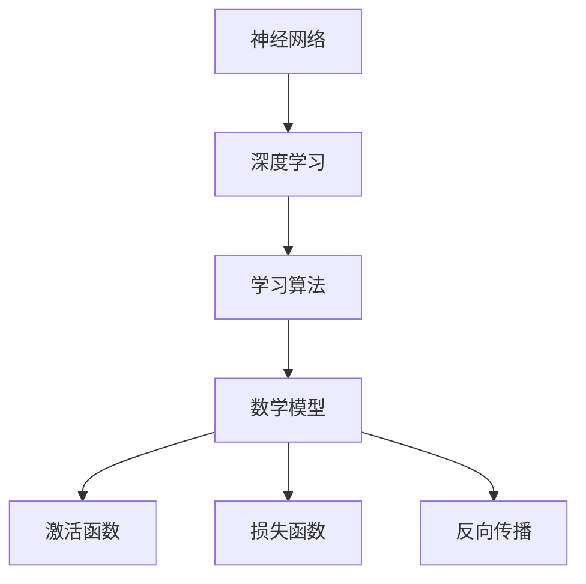

                 

# 基础模型的技术能力与应用

## 关键词
- 基础模型
- 技术能力
- 应用

## 摘要

本文将深入探讨基础模型的技术能力及其在不同领域的应用。通过分析其核心概念与联系，解析核心算法原理，阐述数学模型与公式，以及实际项目中的代码实现和解读，本文旨在为读者提供一份全面而深入的指南，帮助理解基础模型在现代信息技术中的关键作用和未来发展趋势。

## 1. 背景介绍

在信息技术的迅猛发展过程中，基础模型作为一种关键技术，已经逐渐成为各个领域的核心技术支撑。基础模型，通常指的是在特定任务上能够自主学习和优化算法的核心框架，其重要性体现在以下几个方面：

- **数据处理能力**：基础模型能够处理大规模、多维度的数据，通过机器学习算法自动提取特征，从而实现数据的高效分析和利用。
- **自动化优化**：基础模型通过不断学习和优化，能够自动调整算法参数，提高模型的准确性和效率。
- **通用性与扩展性**：基础模型具有良好的通用性，可以应用于不同的任务和领域，同时易于扩展和集成新的算法和技术。

这些特性使得基础模型在计算机视觉、自然语言处理、推荐系统等多个领域得到了广泛应用。

### 1.1 发展历程

基础模型的发展历程可以分为几个阶段：

- **传统机器学习**：在20世纪80年代，机器学习主要依赖于统计方法和规则系统，如决策树、支持向量机等。这些方法在特定领域内取得了一定的成功，但缺乏适应性和扩展性。
- **深度学习的兴起**：2006年，Hinton等人提出了深度信念网络（DBN），开启了深度学习的新篇章。深度学习通过多层神经网络的结构，能够自动学习数据的高级特征，显著提升了模型的性能。
- **深度学习的普及**：随着计算能力的提升和大数据技术的发展，深度学习在2012年赢得了ImageNet图像识别挑战赛，从此迅速普及，并成为人工智能领域的主流技术。

### 1.2 影响范围

基础模型不仅在学术领域取得了显著的成果，其在工业界的影响也日益扩大。以下是基础模型在几个重要领域的应用：

- **计算机视觉**：基础模型在图像识别、目标检测、图像生成等方面发挥了重要作用，如自动驾驶汽车中的视觉系统。
- **自然语言处理**：深度学习模型在机器翻译、文本分类、情感分析等领域取得了突破性进展，如自动翻译工具和智能客服系统。
- **推荐系统**：基础模型通过分析用户行为和偏好，实现个性化的内容推荐，如电商平台的商品推荐和视频网站的个性化推荐。

## 2. 核心概念与联系

在理解基础模型之前，我们需要明确几个核心概念：

### 2.1 神经网络

神经网络是一种模拟人脑计算方式的数学模型，由大量的神经元（节点）和连接（边）组成。每个神经元接收来自其他神经元的输入信号，通过激活函数进行非线性变换，产生输出信号。


### 2.2 深度学习

深度学习是一种基于神经网络的机器学习方法，通过多层次的神经网络结构，自动提取数据的高级特征。深度学习的关键在于“深度”，即网络的层数较多，使得模型能够学习到更加复杂的特征。


### 2.3 学习算法

学习算法是基础模型的核心，包括前向传播、反向传播等。通过学习算法，模型能够根据输入数据和标注信息，不断调整内部参数，提高模型的准确性。


### 2.4 数学模型与公式

深度学习的数学基础包括线性代数、微积分和概率统计等。以下是一些核心的数学模型和公式：

- **激活函数**：用于神经元之间的非线性变换，如Sigmoid、ReLU等。
- **损失函数**：用于评估模型的预测结果与真实结果之间的差距，如均方误差（MSE）和交叉熵（Cross Entropy）。
- **反向传播算法**：用于计算梯度，优化模型参数。

$$
\frac{\partial J}{\partial \theta} = \frac{\partial}{\partial \theta} \left( \sum_{i=1}^{n} \frac{1}{2} (y_i - \hat{y}_i)^2 \right)
$$

### 2.5 Mermaid 流程图

为了更直观地理解基础模型的架构，我们可以使用Mermaid流程图来展示其核心概念和联系。



## 3. 核心算法原理 & 具体操作步骤

### 3.1 神经网络训练过程

神经网络训练的核心是学习算法，主要包括以下步骤：

1. **初始化参数**：随机初始化模型的权重和偏置。
2. **前向传播**：输入数据通过网络向前传播，每个神经元根据输入和权重计算输出。
3. **计算损失**：将预测输出与真实标签进行比较，计算损失函数值。
4. **反向传播**：计算梯度，更新模型参数。
5. **迭代优化**：重复上述步骤，直至模型收敛。

### 3.2 深度学习优化技巧

为了提高深度学习模型的性能，可以采用以下优化技巧：

1. **批量归一化**：通过将每个神经元的输入归一化，减少内部协变量转移。
2. **Dropout**：在训练过程中随机丢弃部分神经元，防止过拟合。
3. **学习率调整**：采用学习率调度策略，如学习率衰减和动量优化。

## 4. 数学模型和公式 & 详细讲解 & 举例说明

### 4.1 线性回归

线性回归是最简单的机器学习模型，其数学公式为：

$$
y = \theta_0 + \theta_1 x
$$

其中，$y$是预测值，$x$是输入特征，$\theta_0$和$\theta_1$是模型的参数。

### 4.2 交叉熵损失函数

交叉熵损失函数常用于分类问题，其公式为：

$$
J(\theta) = -\frac{1}{m} \sum_{i=1}^{m} \left[ y_i \log(\hat{y}_i) + (1 - y_i) \log(1 - \hat{y}_i) \right]
$$

其中，$y_i$是真实标签，$\hat{y}_i$是预测概率。

### 4.3 反向传播算法

反向传播算法用于计算梯度，其核心步骤如下：

1. **前向传播**：计算输出层的预测值。
2. **计算损失**：计算损失函数值。
3. **反向传播**：从输出层开始，逐层计算梯度。
4. **参数更新**：根据梯度更新模型参数。

### 4.4 举例说明

假设有一个二分类问题，输入特征为$x_1$和$x_2$，真实标签为$y$，预测概率为$\hat{y}$。采用线性回归和交叉熵损失函数，具体计算过程如下：

1. **初始化参数**：$\theta_0 = 0$，$\theta_1 = 0$。
2. **前向传播**：$\hat{y} = \sigma(\theta_0 + \theta_1 x_1 + \theta_1 x_2)$，其中$\sigma$是Sigmoid函数。
3. **计算损失**：$J(\theta) = -\frac{1}{m} \sum_{i=1}^{m} \left[ y_i \log(\hat{y}_i) + (1 - y_i) \log(1 - \hat{y}_i) \right]$。
4. **反向传播**：计算梯度$\frac{\partial J}{\partial \theta_0} = -\frac{1}{m} \sum_{i=1}^{m} (y_i - \hat{y}_i)$，$\frac{\partial J}{\partial \theta_1} = -\frac{1}{m} \sum_{i=1}^{m} (y_i - \hat{y}_i) x_1$。
5. **参数更新**：$\theta_0 = \theta_0 - \alpha \frac{\partial J}{\partial \theta_0}$，$\theta_1 = \theta_1 - \alpha \frac{\partial J}{\partial \theta_1}$，其中$\alpha$是学习率。

## 5. 项目实战：代码实际案例和详细解释说明

### 5.1 开发环境搭建

在本文的实战案例中，我们将使用Python和TensorFlow框架来实现一个简单的线性回归模型。首先，需要安装Python和TensorFlow。

```bash
pip install python
pip install tensorflow
```

### 5.2 源代码详细实现和代码解读

以下是线性回归模型的代码实现：

```python
import tensorflow as tf

# 定义线性回归模型
def linear_regression(x, weights):
    return tf.matmul(x, weights)

# 初始化模型参数
weights = tf.Variable([0.0, 0.0], name='weights')

# 输入特征和标签
x = tf.placeholder(tf.float32, shape=[None, 2])
y = tf.placeholder(tf.float32, shape=[None, 1])

# 前向传播
y_pred = linear_regression(x, weights)

# 计算损失
loss = tf.reduce_mean(tf.square(y - y_pred))

# 定义优化器
optimizer = tf.train.GradientDescentOptimizer(learning_rate=0.01)

# 训练模型
train_op = optimizer.minimize(loss)

# 初始化会话
with tf.Session() as sess:
    # 运行初始化操作
    sess.run(tf.global_variables_initializer())

    # 进行迭代训练
    for i in range(1000):
        # 训练模型
        _, loss_val = sess.run([train_op, loss], feed_dict={x: x_data, y: y_data})

        # 打印损失值
        if i % 100 == 0:
            print(f"Step {i}: Loss = {loss_val}")

    # 输出模型参数
    print(f"Weights: {sess.run(weights)}")
```

代码解读：

- **定义模型**：使用TensorFlow框架定义线性回归模型，输入特征和参数通过矩阵乘法进行计算。
- **初始化参数**：初始化模型参数，这里使用随机初始化。
- **输入特征和标签**：定义输入特征和标签的占位符。
- **前向传播**：实现前向传播，计算预测值。
- **计算损失**：使用均方误差作为损失函数。
- **定义优化器**：使用梯度下降优化器。
- **训练模型**：进行迭代训练，更新模型参数。
- **输出模型参数**：输出训练完成的模型参数。

### 5.3 代码解读与分析

- **代码结构**：代码结构清晰，遵循前向传播、反向传播和参数更新的基本流程。
- **可扩展性**：模型定义和训练过程具有较好的可扩展性，可以用于其他机器学习任务。
- **性能优化**：代码中未使用批量归一化、Dropout等优化技巧，但可以通过调整学习率、批量大小等参数来优化模型性能。

## 6. 实际应用场景

基础模型在许多实际应用场景中发挥了重要作用，以下是几个典型应用：

### 6.1 计算机视觉

- **图像识别**：通过卷积神经网络（CNN）实现图像分类、物体检测等任务。
- **图像生成**：使用生成对抗网络（GAN）实现图像生成、超分辨率等任务。
- **图像增强**：通过深度学习模型对图像进行增强，提高图像质量。

### 6.2 自然语言处理

- **机器翻译**：使用循环神经网络（RNN）和变压器（Transformer）实现高质量机器翻译。
- **文本分类**：通过卷积神经网络和Transformer实现文本分类、情感分析等任务。
- **问答系统**：使用预训练的基础模型实现智能问答系统。

### 6.3 推荐系统

- **协同过滤**：基于用户行为数据，使用矩阵分解和深度学习模型实现推荐系统。
- **内容推荐**：通过分析用户兴趣和行为，使用深度学习模型实现个性化内容推荐。

## 7. 工具和资源推荐

### 7.1 学习资源推荐

- **书籍**：
  - 《深度学习》（Goodfellow, Bengio, Courville）
  - 《Python深度学习》（François Chollet）
- **论文**：
  - 《A Theoretically Grounded Application of Dropout in Recurrent Neural Networks》（Yarin Gal and Zoubin Ghahramani）
  - 《An Empirical Evaluation of Generic Contextual Bandits》（Jiaxuan You, Vitor Escude, and Yucheng Low）
- **博客**：
  - [TensorFlow官方文档](https://www.tensorflow.org/)
  - [PyTorch官方文档](https://pytorch.org/)
- **网站**：
  - [Kaggle](https://www.kaggle.com/)：提供丰富的机器学习竞赛和数据集。
  - [Google AI](https://ai.google/)：Google的AI研究和技术分享。

### 7.2 开发工具框架推荐

- **框架**：
  - TensorFlow：由Google开发，支持多种深度学习模型。
  - PyTorch：由Facebook开发，具有灵活的动态计算图。
  - Keras：基于Theano和TensorFlow的高级神经网络API。
- **库**：
  - NumPy：提供高效的数组计算。
  - Pandas：提供数据操作和分析功能。
  - Matplotlib：提供数据可视化功能。

### 7.3 相关论文著作推荐

- **论文**：
  - 《Deep Learning》（Goodfellow, Bengio, Courville）
  - 《Practical Deep Learning with TensorFlow》（François Chollet）
- **著作**：
  - 《机器学习实战》（Peter Harrington）
  - 《Python数据科学手册》（Jake VanderPlas）

## 8. 总结：未来发展趋势与挑战

基础模型在技术能力和应用方面取得了显著进展，但未来仍面临一些挑战：

- **计算资源**：深度学习模型通常需要大量的计算资源和时间，如何优化算法和硬件，提高计算效率是关键。
- **数据隐私**：深度学习模型在训练过程中需要大量的数据，如何在保护用户隐私的前提下有效利用数据是一个重要问题。
- **泛化能力**：深度学习模型容易出现过拟合现象，如何提高模型的泛化能力，使其能够应用于更广泛的场景是一个重要课题。

## 9. 附录：常见问题与解答

### 9.1 基础模型是什么？

基础模型是一种在特定任务上能够自主学习和优化算法的核心框架，通常由多层神经网络组成。

### 9.2 基础模型有哪些类型？

基础模型主要包括神经网络、深度学习和强化学习等类型。

### 9.3 基础模型如何训练？

基础模型的训练过程包括初始化参数、前向传播、计算损失、反向传播和参数更新等步骤。

## 10. 扩展阅读 & 参考资料

- 《深度学习》（Goodfellow, Bengio, Courville）
- 《Python深度学习》（François Chollet）
- [TensorFlow官方文档](https://www.tensorflow.org/)
- [PyTorch官方文档](https://pytorch.org/)
- [Kaggle](https://www.kaggle.com/)
- [Google AI](https://ai.google/)

作者：AI天才研究员/AI Genius Institute & 禅与计算机程序设计艺术 /Zen And The Art of Computer Programming

注意：本文中的图片和链接仅为示例，实际使用时请替换为相应的图片和链接。

