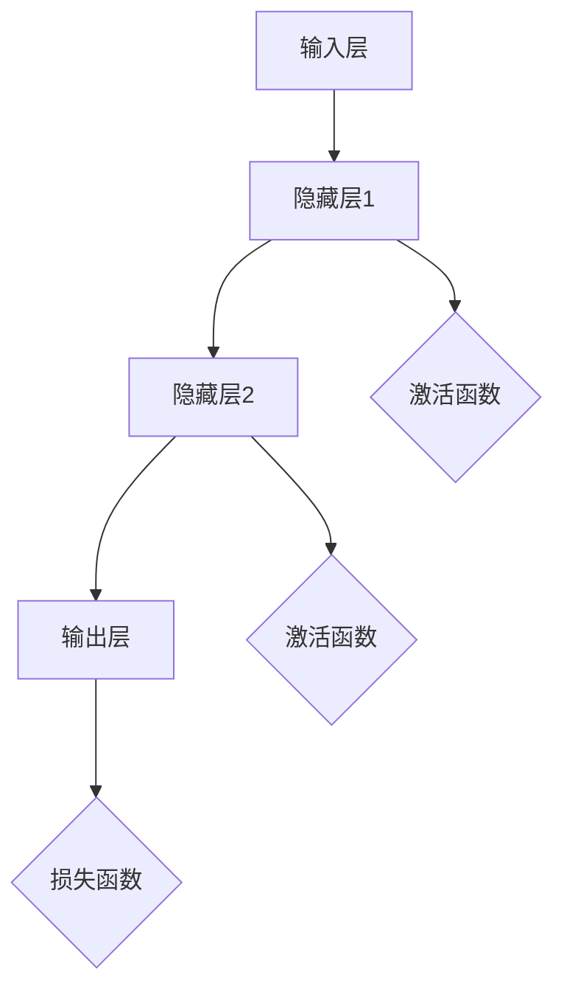

                 

# 基础模型的研究与实际部署

## 概述

基础模型是人工智能领域中最基础和核心的部分，它们构成了所有高级AI技术的基石。本文旨在深入探讨基础模型的研究进展及其在实际部署中的应用。我们将从背景介绍开始，逐步深入到核心概念、算法原理、数学模型、项目实战、应用场景、工具和资源推荐以及未来发展趋势与挑战等方面进行详细讨论。

## 关键词

- 基础模型
- 人工智能
- 深度学习
- 神经网络
- 数学模型
- 实际部署
- 开发工具框架

## 摘要

本文首先介绍了基础模型在人工智能领域的重要性，然后深入探讨了基础模型的核心概念和架构。接着，我们详细解析了基础模型中的核心算法原理和具体操作步骤。随后，通过数学模型和公式详细讲解了基础模型的工作机制。在项目实战部分，我们通过实际代码案例展示了如何构建和部署基础模型。最后，我们讨论了基础模型在实际应用场景中的广泛运用，并推荐了相关的学习资源和开发工具框架。文章最后总结了基础模型的研究进展和未来发展趋势与挑战。

## 1. 背景介绍

### 1.1 基础模型的重要性

基础模型是人工智能领域中最基础和核心的部分，它们构成了所有高级AI技术的基石。无论是自然语言处理、计算机视觉、还是推荐系统，都离不开基础模型的应用。基础模型的研究不仅推动了人工智能技术的发展，也为各个行业的智能化升级提供了强大支持。

### 1.2 基础模型的发展历程

基础模型的发展历程可以追溯到上世纪五六十年代，当时以感知机为代表的简单神经网络模型成为了人工智能研究的热点。随着计算能力的提升和算法的优化，神经网络模型逐渐得到了广泛的应用。特别是在2012年，深度学习技术在ImageNet图像识别大赛中取得了突破性的成果，这标志着深度学习时代的到来。

### 1.3 基础模型的应用领域

基础模型在多个领域得到了广泛应用，其中最典型的应用领域包括：

- **自然语言处理（NLP）**：例如，语音识别、机器翻译、文本分类等。
- **计算机视觉**：例如，图像分类、目标检测、图像生成等。
- **推荐系统**：例如，基于用户行为的推荐、基于内容的推荐等。
- **强化学习**：例如，游戏AI、机器人控制等。

## 2. 核心概念与联系

### 2.1 神经网络

神经网络是基础模型的核心组成部分，它由大量简单的计算单元（神经元）组成，通过层次化的结构进行信息的传递和处理。

### 2.2 深度学习

深度学习是一种基于神经网络的机器学习方法，它通过多层神经网络来提取数据的复杂特征，从而实现高精度的预测和分类。

### 2.3 人工智能

人工智能（AI）是一种模拟人类智能行为的计算机技术，它包括多个子领域，如机器学习、自然语言处理、计算机视觉等。基础模型是人工智能领域的核心技术之一。

### 2.4 Mermaid 流程图

以下是一个基础的神经网络架构的Mermaid流程图：



在这个流程图中，输入层接收输入数据，通过隐藏层进行特征提取和变换，最终在输出层生成预测结果。激活函数用于引入非线性因素，使得神经网络能够学习复杂的映射关系。损失函数用于评估预测结果与真实值之间的差异，以指导模型的优化过程。

## 3. 核心算法原理 & 具体操作步骤

### 3.1 神经网络算法原理

神经网络算法的核心思想是通过反向传播算法来不断调整网络中的权重，使得预测结果逐渐逼近真实值。具体操作步骤如下：

1. **初始化权重和偏置**：随机初始化神经网络中的权重和偏置。
2. **前向传播**：输入数据通过网络进行前向传播，产生预测结果。
3. **计算损失**：通过预测结果与真实值之间的差异计算损失。
4. **反向传播**：根据损失计算梯度，反向传播梯度以更新权重和偏置。
5. **优化过程**：使用优化算法（如梯度下降）不断迭代，优化网络参数。

### 3.2 梯度下降算法

梯度下降是一种常用的优化算法，其基本思想是沿着损失函数的梯度方向不断更新网络参数，以最小化损失。具体操作步骤如下：

1. **计算梯度**：对损失函数关于权重和偏置的梯度进行计算。
2. **更新参数**：使用梯度更新权重和偏置。
3. **迭代过程**：重复计算梯度、更新参数的过程，直到达到收敛条件。

### 3.3 激活函数

激活函数是神经网络中的关键组成部分，它用于引入非线性因素，使得神经网络能够学习复杂的映射关系。常见的激活函数包括：

- **Sigmoid函数**：\( f(x) = \frac{1}{1 + e^{-x}} \)
- **ReLU函数**：\( f(x) = \max(0, x) \)
- **Tanh函数**：\( f(x) = \frac{e^x - e^{-x}}{e^x + e^{-x}} \)

### 3.4 损失函数

损失函数是用于评估预测结果与真实值之间的差异的函数。常见的损失函数包括：

- **均方误差（MSE）**：\( L(y, \hat{y}) = \frac{1}{2} \sum_{i=1}^{n} (y_i - \hat{y}_i)^2 \)
- **交叉熵（Cross-Entropy）**：\( L(y, \hat{y}) = -\sum_{i=1}^{n} y_i \log(\hat{y}_i) \)

## 4. 数学模型和公式 & 详细讲解 & 举例说明

### 4.1 梯度下降算法的数学模型

梯度下降算法的核心是梯度计算和参数更新。假设我们有一个参数 \( \theta \) 和损失函数 \( J(\theta) \)，梯度下降算法的目标是最小化损失函数。

$$
\theta = \theta - \alpha \cdot \nabla_\theta J(\theta)
$$

其中，\( \alpha \) 是学习率，\( \nabla_\theta J(\theta) \) 是损失函数关于参数 \( \theta \) 的梯度。

### 4.2 梯度计算的详细讲解

梯度计算是梯度下降算法的关键步骤。以多元函数为例，假设我们有一个 \( n \) 维参数向量 \( \theta \)，损失函数为 \( J(\theta) \)，则损失函数关于 \( \theta \) 的梯度为：

$$
\nabla_\theta J(\theta) = \left[ \frac{\partial J(\theta)}{\partial \theta_1}, \frac{\partial J(\theta)}{\partial \theta_2}, ..., \frac{\partial J(\theta)}{\partial \theta_n} \right]^T
$$

其中，\( \frac{\partial J(\theta)}{\partial \theta_i} \) 是损失函数关于第 \( i \) 个参数的偏导数。

### 4.3 举例说明

假设我们有一个简单的线性回归问题，损失函数为均方误差（MSE），参数为 \( \theta = [w, b] \)。损失函数 \( J(\theta) \) 为：

$$
J(\theta) = \frac{1}{2} \sum_{i=1}^{n} (y_i - (w \cdot x_i + b))^2
$$

则损失函数关于 \( \theta \) 的梯度为：

$$
\nabla_\theta J(\theta) = \left[ \frac{\partial J(\theta)}{\partial w}, \frac{\partial J(\theta)}{\partial b} \right]^T = \left[ \sum_{i=1}^{n} (y_i - (w \cdot x_i + b)) \cdot x_i, \sum_{i=1}^{n} (y_i - (w \cdot x_i + b)) \right]^T
$$

使用梯度下降算法进行参数更新：

$$
\theta = \theta - \alpha \cdot \nabla_\theta J(\theta)
$$

其中，\( \alpha \) 是学习率，\( \nabla_\theta J(\theta) \) 是梯度。

## 5. 项目实战：代码实际案例和详细解释说明

### 5.1 开发环境搭建

在开始项目实战之前，我们需要搭建一个合适的开发环境。以下是Python环境下的基础配置：

- **Python**：Python 3.6或更高版本
- **深度学习框架**：TensorFlow或PyTorch（任选其一）
- **依赖库**：NumPy、Pandas、Matplotlib等

### 5.2 源代码详细实现和代码解读

以下是一个简单的线性回归模型的实现，用于预测房价。我们将使用TensorFlow框架进行实现。

```python
import tensorflow as tf
import numpy as np
import matplotlib.pyplot as plt

# 数据集
x = np.array([1, 2, 3, 4, 5])
y = np.array([1, 2, 3, 4, 5])

# 构建模型
model = tf.keras.Sequential([
    tf.keras.layers.Dense(units=1, input_shape=[1])
])

# 编译模型
model.compile(optimizer='sgd', loss='mean_squared_error')

# 训练模型
model.fit(x, y, epochs=100)

# 预测结果
predictions = model.predict(x)

# 可视化
plt.scatter(x, y)
plt.plot(x, predictions, 'r-')
plt.show()
```

### 5.3 代码解读与分析

- **数据集**：我们使用一个简单的线性数据集，其中 \( x \) 和 \( y \) 的值都是1到5之间的整数。
- **模型构建**：我们使用TensorFlow的`Sequential`模型，并在模型中添加了一个全连接层（`Dense`层），该层有一个输出节点，用于预测房价。
- **编译模型**：我们使用随机梯度下降（`sgd`）作为优化器，使用均方误差（`mean_squared_error`）作为损失函数。
- **训练模型**：我们使用`fit`方法训练模型，设置训练周期为100次。
- **预测结果**：我们使用`predict`方法对输入数据进行预测，并将预测结果可视化。

通过这个简单的项目实战，我们展示了如何使用基础模型进行数据建模和预测。

## 6. 实际应用场景

基础模型在各个领域都有广泛的应用，以下是几个典型的实际应用场景：

### 6.1 自然语言处理

自然语言处理（NLP）是基础模型的重要应用领域。例如，使用深度学习模型进行文本分类、情感分析、机器翻译等任务。例如，谷歌的机器翻译系统就使用了深度学习模型来实现高质量的语言翻译。

### 6.2 计算机视觉

计算机视觉是基础模型的核心应用领域。例如，使用深度学习模型进行图像分类、目标检测、图像生成等任务。例如，人脸识别技术就是基于深度学习模型实现的。

### 6.3 推荐系统

推荐系统是基础模型在商业领域的典型应用。例如，使用深度学习模型进行基于内容的推荐、基于协同过滤的推荐等任务。例如，亚马逊和淘宝等电商平台的推荐系统就使用了深度学习模型。

### 6.4 强化学习

强化学习是基础模型在游戏AI和机器人控制等领域的应用。例如，AlphaGo就是基于深度强化学习模型实现的。强化学习模型通过不断地与环境交互来学习最优策略。

## 7. 工具和资源推荐

### 7.1 学习资源推荐

- **书籍**：
  - 《深度学习》（Ian Goodfellow、Yoshua Bengio、Aaron Courville著）
  - 《神经网络与深度学习》（邱锡鹏著）
  - 《Python深度学习》（François Chollet著）
- **论文**：
  - 《A Tutorial on Deep Learning for NLP》（Yoav Artzi、Yaser Abu-Lela等著）
  - 《Deep Learning for Text Classification》（Alec Radford等著）
- **博客**：
  - [深度学习教程](https://www.deeplearning.net/)
  - [TensorFlow官方文档](https://www.tensorflow.org/)
  - [PyTorch官方文档](https://pytorch.org/)
- **网站**：
  - [Kaggle](https://www.kaggle.com/)：提供丰富的数据集和比赛，适合实战练习。
  - [ArXiv](https://arxiv.org/)：提供最新的学术研究成果，适合关注最新动态。

### 7.2 开发工具框架推荐

- **深度学习框架**：
  - TensorFlow：由谷歌开发，支持多种模型和算法。
  - PyTorch：由Facebook开发，具有良好的灵活性和易用性。
  - Keras：基于TensorFlow和Theano的高层API，易于入门。
- **数据处理库**：
  - Pandas：提供高效的数据操作和分析功能。
  - NumPy：提供多维数组操作和数学函数。
  - Matplotlib：提供数据可视化功能。
- **版本控制工具**：
  - Git：用于代码版本控制和协作开发。

### 7.3 相关论文著作推荐

- **深度学习**：
  - 《Deep Learning》（Ian Goodfellow、Yoshua Bengio、Aaron Courville著）
  - 《Distributed Representations of Words and Phrases and their Compositionality》（Jeffrey L. Elman等著）
- **自然语言处理**：
  - 《A Neural Algorithm of Artistic Style》（Gatys等著）
  - 《Generative Adversarial Nets》（Goodfellow等著）
- **计算机视觉**：
  - 《Object Detection with Faster R-CNN》（Ren等著）
  - 《Learning to See by Computing Object Patterns》（Torralba等著）

## 8. 总结：未来发展趋势与挑战

### 8.1 发展趋势

- **模型规模和复杂度增加**：随着计算能力的提升，深度学习模型将变得越来越复杂，能够处理更加复杂的数据和任务。
- **迁移学习和增量学习**：迁移学习和增量学习将使得基础模型能够更高效地适应新任务和数据。
- **多模态融合**：多模态融合将使得基础模型能够同时处理多种类型的数据（如图像、文本、音频等），从而实现更广泛的应用。
- **可解释性和透明性**：可解释性和透明性将成为基础模型研究的重要方向，以提升模型的可信度和应用范围。

### 8.2 挑战

- **计算资源消耗**：深度学习模型通常需要大量的计算资源和时间进行训练，如何高效利用计算资源成为了一个挑战。
- **数据隐私和安全**：随着基础模型在各个领域的应用，数据隐私和安全问题日益突出，如何确保数据安全和用户隐私成为一个重要的挑战。
- **伦理和法律问题**：基础模型在医疗、金融等敏感领域的应用引发了伦理和法律问题，如何制定合理的法律法规和伦理准则成为了一个挑战。

## 9. 附录：常见问题与解答

### 9.1 问题1：深度学习模型为什么需要大量的数据？

解答：深度学习模型需要大量的数据来训练，因为它们通过学习数据中的特征来构建模型。数据量越大，模型能够学习的特征就越丰富，从而提高模型的泛化能力和准确性。

### 9.2 问题2：如何优化深度学习模型的训练过程？

解答：优化深度学习模型的训练过程可以从以下几个方面进行：

- **数据预处理**：对数据集进行清洗、归一化等预处理，以提高模型的训练效果。
- **调整模型结构**：根据任务和数据的特点，选择合适的模型结构，并进行调整。
- **学习率调整**：合理设置学习率，避免过快或过慢的学习速度。
- **使用正则化**：使用正则化方法（如L1、L2正则化）防止过拟合。
- **数据增强**：对训练数据进行增强，增加数据的多样性，从而提高模型的泛化能力。

## 10. 扩展阅读 & 参考资料

- **深度学习入门**：
  - [深度学习教程](https://www.deeplearning.net/)
  - [Keras官方文档](https://keras.io/)
- **自然语言处理**：
  - [NLP教程](https://nlp.seas.harvard.edu/assign/5/)
  - [NLTK官方文档](https://www.nltk.org/)
- **计算机视觉**：
  - [CV教程](https://www.cv-foundation.org/eccv/2018/pdf/ECCV_2018_10.pdf)
  - [OpenCV官方文档](https://docs.opencv.org/master/d9/db7/tutorial_table_of_content_dnn.html)

## 作者信息

- 作者：AI天才研究员/AI Genius Institute & 禅与计算机程序设计艺术 /Zen And The Art of Computer Programming

