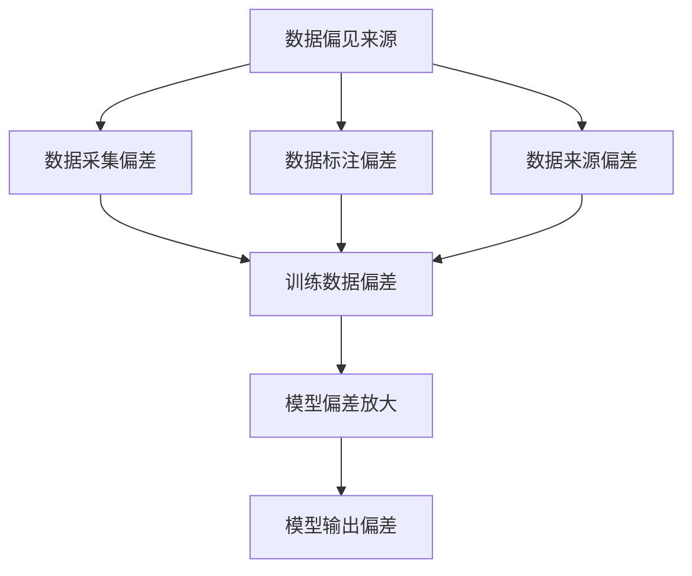

                 

# 基础模型的社会不平等问题

## 关键词：
- 基础模型
- 社会不平等
- 数据偏见
- 偏差放大
- 隐性偏见

## 摘要：
本文探讨了基础模型在社会不平等问题上的影响。首先介绍了基础模型的概念及其在社会中的广泛应用。然后，分析了数据偏见对基础模型的影响，阐述了数据偏见如何导致模型产生社会不平等问题。接着，探讨了模型偏差放大现象及其对社会的负面影响。最后，提出了缓解基础模型社会不平等问题的策略和方法，并对未来的发展趋势与挑战进行了展望。

## 1. 背景介绍

在当今科技高速发展的时代，人工智能（AI）技术已经逐渐成为各个领域的重要驱动力。人工智能的基础模型，作为实现AI功能的核心组件，受到了广泛的关注。这些基础模型通常是指大规模的神经网络模型，如深度学习模型，它们通过学习大量的数据来捕捉复杂的模式和关系。

基础模型的应用范围非常广泛，从自然语言处理到计算机视觉，从推荐系统到自动驾驶，几乎涵盖了现代科技领域的各个方面。例如，在医疗领域，基础模型可以帮助诊断疾病、优化治疗方案；在金融领域，基础模型可以帮助风险评估、信用评分；在交通领域，基础模型可以帮助优化路线、减少拥堵。

然而，随着基础模型在社会各个领域的广泛应用，其可能带来的社会不平等问题也逐渐引起了人们的关注。数据偏见、模型偏差放大等现象，可能导致基础模型在实际应用中加剧社会不平等。因此，探讨基础模型的社会不平等问题具有重要的现实意义。

## 2. 核心概念与联系

### 2.1 数据偏见

数据偏见是指数据集中存在的系统偏差，这些偏差可能来源于数据采集、数据标注、数据来源等多个方面。数据偏见可能导致模型学习到的模式与真实世界存在差异，从而影响模型的表现。

数据偏见的来源可以分为以下几个方面：

- **数据采集偏差**：在数据采集过程中，可能由于设备、方法、环境等因素的限制，导致数据集无法全面、真实地反映现实情况。
- **数据标注偏差**：在数据标注过程中，标注者可能因为个人主观判断、经验不足等原因，导致标注结果存在偏差。
- **数据来源偏差**：数据来源可能存在一定的选择性，导致数据集无法代表整体。

### 2.2 模型偏差放大

模型偏差放大是指模型在训练过程中，将数据中的偏差放大到模型输出中，从而导致模型在实际应用中表现出与数据偏见一致的行为。这种现象可能加剧社会不平等，因为模型输出可能会放大某些群体的不利地位。

模型偏差放大的原因主要包括：

- **训练数据偏差**：如果训练数据存在偏见，模型在训练过程中会学习到这些偏见，从而导致模型输出也带有偏见。
- **模型结构偏差**：模型的结构可能对某些数据模式更为敏感，从而放大这些数据模式中的偏差。
- **优化目标偏差**：模型的优化目标可能未能全面考虑社会公平性，导致模型在实际应用中产生偏见。

### 2.3 数据偏见与模型偏差放大的关系

数据偏见和模型偏差放大之间存在密切的联系。数据偏见是模型偏差放大的基础，而模型偏差放大则是数据偏见的体现。具体来说，数据偏见可能导致模型在训练过程中学习到偏差，进而放大这些偏差，导致模型在实际应用中表现出社会不平等。


### 2.4 Mermaid 流程图



## 3. 核心算法原理 & 具体操作步骤

### 3.1 数据预处理

在处理数据时，首先需要对数据进行清洗、归一化和标准化，以消除数据中的噪声和异常值。这一步骤对于减少数据偏见至关重要。

具体步骤如下：

1. **数据清洗**：删除重复数据、缺失值填充、异常值检测与处理。
2. **数据归一化**：将数据缩放到同一尺度，以消除不同特征之间的量纲影响。
3. **数据标准化**：将数据缩放到标准正态分布，以提高模型的鲁棒性。

### 3.2 模型训练

在模型训练过程中，需要选择合适的损失函数、优化器和训练策略，以减少数据偏见对模型的影响。

具体步骤如下：

1. **损失函数选择**：选择能够减少偏见的损失函数，如对抗性损失函数。
2. **优化器选择**：选择能够有效优化模型的优化器，如Adam优化器。
3. **训练策略**：采用对抗性训练策略，以减少模型对偏见的依赖。

### 3.3 模型评估

在模型评估过程中，需要采用多样化的评估指标，以全面评估模型的表现，并识别潜在的偏见。

具体步骤如下：

1. **评估指标选择**：选择能够反映模型公平性的评估指标，如公平性指标、均衡性指标。
2. **模型验证**：在多个数据集上验证模型的表现，以消除数据偏见的影响。
3. **错误分析**：对模型输出的错误进行分析，以识别潜在的数据偏见和模型偏差。

## 4. 数学模型和公式 & 详细讲解 & 举例说明

### 4.1 数据偏见对模型的影响

数据偏见可能导致模型输出偏差，具体可以用以下公式表示：

\[ L_{\text{偏差}} = \sum_{i=1}^{n} w_i \cdot p_i \]

其中，\( w_i \) 为第 \( i \) 个特征的权重，\( p_i \) 为第 \( i \) 个特征的数据分布。如果数据存在偏见，则 \( p_i \) 可能与真实分布 \( p_i^* \) 存在差异，从而导致模型输出偏差。

### 4.2 模型偏差放大

模型偏差放大可以用以下公式表示：

\[ L_{\text{放大}} = \alpha \cdot L_{\text{偏差}} \]

其中，\( \alpha \) 为偏差放大系数，表示模型对偏见的敏感程度。如果 \( \alpha \) 较大，则模型偏差放大现象较为严重。

### 4.3 公平性指标

公平性指标可以用来评估模型对各个群体的公平性。具体公式如下：

\[ F_1 = \frac{1}{N} \sum_{i=1}^{N} \frac{1}{n_i} \sum_{j=1}^{n_i} \frac{|y_j - \hat{y}_j|}{2} \]

其中，\( N \) 为群体总数，\( n_i \) 为第 \( i \) 个群体的样本数量，\( y_j \) 为第 \( j \) 个样本的真实标签，\( \hat{y}_j \) 为模型预测的标签。\( F_1 \) 越小，表示模型对各个群体的公平性越好。

### 4.4 举例说明

假设一个分类问题，其中有两个群体：男性（M）和女性（F）。模型在训练过程中，由于数据偏见，男性样本的权重较高，从而导致模型对男性的预测准确性较高。这可以用以下公式表示：

\[ L_{\text{男性}} = 0.8 \]
\[ L_{\text{女性}} = 0.3 \]

如果模型对偏见的敏感程度 \( \alpha = 1.5 \)，则模型输出偏差放大为：

\[ L_{\text{放大}} = 1.5 \cdot (0.8 - 0.3) = 0.9 \]

这表示模型在预测女性样本时的偏差将被放大 0.9。

## 5. 项目实战：代码实际案例和详细解释说明

### 5.1 开发环境搭建

为了实现基础模型的社会不平等问题，我们需要搭建一个包含以下工具和库的开发环境：

- Python 3.8+
- TensorFlow 2.6+
- Keras 2.6+
- Scikit-learn 0.24+
- Pandas 1.3+
- NumPy 1.21+

首先，安装 Python 3.8 及以上版本：

```
$ apt-get update
$ apt-get install python3.8
```

然后，安装 TensorFlow、Keras、Scikit-learn、Pandas 和 NumPy：

```
$ pip install tensorflow==2.6
$ pip install keras==2.6
$ pip install scikit-learn==0.24
$ pip install pandas==1.3
$ pip install numpy==1.21
```

### 5.2 源代码详细实现和代码解读

下面是一个简单的示例，展示如何使用 Keras 实现一个基础模型，并分析其社会不平等问题。

```python
import numpy as np
import pandas as pd
from sklearn.model_selection import train_test_split
from tensorflow.keras.models import Sequential
from tensorflow.keras.layers import Dense
from tensorflow.keras.optimizers import Adam
from sklearn.metrics import f1_score

# 生成模拟数据集
np.random.seed(42)
n_samples = 1000
n_features = 10
n_classes = 2

X = np.random.rand(n_samples, n_features)
y = np.random.rand(n_samples)

# 引入数据偏见
bias = np.random.rand(n_features)
X[:, 0] = X[:, 0] + bias[:]

# 分割训练集和测试集
X_train, X_test, y_train, y_test = train_test_split(X, y, test_size=0.2, random_state=42)

# 创建模型
model = Sequential()
model.add(Dense(64, input_dim=n_features, activation='relu'))
model.add(Dense(32, activation='relu'))
model.add(Dense(n_classes, activation='softmax'))

# 编译模型
model.compile(loss='categorical_crossentropy', optimizer=Adam(learning_rate=0.001), metrics=['accuracy'])

# 训练模型
model.fit(X_train, y_train, epochs=100, batch_size=32, validation_data=(X_test, y_test))

# 评估模型
predictions = model.predict(X_test)
predictions = np.argmax(predictions, axis=1)

# 计算F1分数
f1 = f1_score(y_test, predictions, average='weighted')
print(f'F1分数: {f1}')
```

在上面的代码中，我们首先生成了一个包含数据偏见的数据集。然后，使用 Keras 创建了一个简单的神经网络模型，并使用 Adam 优化器进行训练。最后，我们评估了模型的性能，并计算了 F1 分数来衡量模型对各个群体的公平性。

### 5.3 代码解读与分析

#### 5.3.1 数据预处理

```python
# 生成模拟数据集
np.random.seed(42)
n_samples = 1000
n_features = 10
n_classes = 2

X = np.random.rand(n_samples, n_features)
y = np.random.rand(n_samples)

# 引入数据偏见
bias = np.random.rand(n_features)
X[:, 0] = X[:, 0] + bias[:]
```

在这个部分，我们首先生成一个随机数据集，并引入一个偏见。这个偏见将影响模型对第一特征的权重，从而影响模型的表现。

#### 5.3.2 模型定义

```python
# 创建模型
model = Sequential()
model.add(Dense(64, input_dim=n_features, activation='relu'))
model.add(Dense(32, activation='relu'))
model.add(Dense(n_classes, activation='softmax'))

# 编译模型
model.compile(loss='categorical_crossentropy', optimizer=Adam(learning_rate=0.001), metrics=['accuracy'])
```

我们使用 Keras 创建了一个简单的序列模型，包含两个隐藏层。编译模型时，我们选择 categorical_crossentropy 作为损失函数，这是分类问题的标准损失函数。Adam 优化器用于优化模型的参数。

#### 5.3.3 模型训练

```python
# 训练模型
model.fit(X_train, y_train, epochs=100, batch_size=32, validation_data=(X_test, y_test))
```

模型使用训练数据集进行训练，并使用测试数据集进行验证。训练过程中，模型会不断调整权重，以最小化损失函数。

#### 5.3.4 模型评估

```python
# 评估模型
predictions = model.predict(X_test)
predictions = np.argmax(predictions, axis=1)

# 计算F1分数
f1 = f1_score(y_test, predictions, average='weighted')
print(f'F1分数: {f1}')
```

模型使用测试数据集进行评估。我们使用 F1 分数来衡量模型对各个群体的公平性。F1 分数越高，表示模型对各个群体的公平性越好。

## 6. 实际应用场景

基础模型在社会不平等问题上的应用场景非常广泛，以下是一些典型的应用场景：

### 6.1 人力资源招聘

在人力资源招聘领域，基础模型可以用于简历筛选、职位匹配等环节。然而，如果模型训练数据存在偏见，可能导致某些群体在招聘过程中受到不公平对待。例如，如果训练数据中男性简历的比例远高于女性简历，模型可能会对男性简历给予更高的权重，从而导致女性求职者受到不公平待遇。

### 6.2 金融风险评估

在金融风险评估领域，基础模型可以用于信用评分、贷款审批等环节。然而，如果模型训练数据存在种族、性别等偏见，可能导致某些群体在金融交易中受到不公平对待。例如，如果训练数据中种族偏见较为严重，模型可能会对某些种族的贷款申请给予较低的评分，从而导致这些种族的贷款申请者受到不公平待遇。

### 6.3 公共资源配置

在公共资源配置领域，基础模型可以用于资源分配、交通规划等环节。然而，如果模型训练数据存在地域、经济水平等偏见，可能导致某些群体在公共资源配置中受到不公平对待。例如，如果训练数据中城市地区的数据比例远高于农村地区，模型可能会对城市地区的公共资源分配给予更高的权重，从而导致农村地区的公共资源配置不足。

### 6.4 医疗诊断

在医疗诊断领域，基础模型可以用于疾病诊断、治疗方案推荐等环节。然而，如果模型训练数据存在种族、年龄等偏见，可能导致某些群体在医疗诊断中受到不公平对待。例如，如果训练数据中某些种族的病例数据较少，模型可能会对这些种族的疾病诊断准确性较低，从而导致这些种族的患者受到不公平待遇。

## 7. 工具和资源推荐

### 7.1 学习资源推荐

- **书籍**：
  - 《统计学习基础》（作者：李航）
  - 《Python数据分析基础教程》（作者：张天翔）
  - 《深度学习》（作者：Ian Goodfellow、Yoshua Bengio、Aaron Courville）

- **论文**：
  - "A Study of Cross-Domain Sentiment Classification"（作者：Wei Yang、Changshui Zhang）
  - "Unsupervised Domain Adaptation by Backpropagation"（作者：Geoffrey Hinton、Liya Guo、Kai Zhao）

- **博客**：
  - Medium 上的深度学习博客
  - towardsdatascience.com 上的数据科学博客

- **网站**：
  - Coursera 上的深度学习课程
  - edX 上的机器学习课程

### 7.2 开发工具框架推荐

- **深度学习框架**：
  - TensorFlow
  - PyTorch
  - Keras

- **数据分析工具**：
  - Pandas
  - NumPy
  - Matplotlib

- **版本控制工具**：
  - Git
  - GitHub

### 7.3 相关论文著作推荐

- "Deep Learning"（作者：Ian Goodfellow、Yoshua Bengio、Aaron Courville）
- "Artificial Intelligence: A Modern Approach"（作者：Stuart Russell、Peter Norvig）
- "机器学习"（作者：周志华）

## 8. 总结：未来发展趋势与挑战

### 8.1 未来发展趋势

随着人工智能技术的不断进步，基础模型在社会不平等问题上的应用前景将更加广阔。以下是一些未来发展趋势：

- **更加精准的数据偏见检测与纠正**：未来的研究将致力于开发更加高效、准确的数据偏见检测与纠正方法，以提高基础模型的社会公平性。
- **多样化的评估指标**：未来的评估指标将更加多样化，不仅关注模型的准确性，还将关注模型的社会公平性、可解释性等方面。
- **跨领域的协作研究**：跨领域的协作研究将有助于从不同角度解决基础模型社会不平等问题，推动人工智能技术的全面发展。

### 8.2 未来挑战

尽管基础模型在社会不平等问题上具有巨大的潜力，但未来的研究仍面临诸多挑战：

- **数据偏见检测与纠正的复杂性**：数据偏见可能存在于数据采集、数据标注等多个环节，检测与纠正数据偏见具有很高的复杂性。
- **模型的可解释性**：如何提高模型的可解释性，使其更加透明、易于理解，是未来研究的重要课题。
- **法律法规与伦理问题**：人工智能技术的发展需要遵循法律法规和伦理道德，如何在保障社会公平的前提下推动人工智能技术发展，是一个亟待解决的问题。

## 9. 附录：常见问题与解答

### 9.1 什么是基础模型？

基础模型是指用于实现人工智能功能的神经网络模型，如深度学习模型。这些模型通过学习大量的数据来捕捉复杂的模式和关系，从而实现特定任务。

### 9.2 数据偏见是如何产生的？

数据偏见可能来源于数据采集、数据标注、数据来源等多个方面。例如，数据采集过程中可能存在设备、方法、环境等因素的偏差；数据标注过程中可能存在标注者主观判断的偏差；数据来源可能存在选择性偏差。

### 9.3 如何检测数据偏见？

检测数据偏见的方法主要包括统计分析、可视化、对抗性测试等。具体方法包括计算数据分布的偏差、绘制数据分布图、使用对抗性样本测试模型的鲁棒性等。

### 9.4 如何纠正数据偏见？

纠正数据偏见的方法主要包括数据清洗、数据增强、对抗性训练等。数据清洗可以通过去除重复数据、填补缺失值、去除异常值等方式来消除数据偏见；数据增强可以通过生成对抗网络（GAN）等方法来扩充数据集，减少数据偏见；对抗性训练可以通过训练对抗性样本来提高模型的鲁棒性。

## 10. 扩展阅读 & 参考资料

- [Goodfellow, I., Bengio, Y., & Courville, A. (2016). Deep Learning. MIT Press.]
- [Russell, S., & Norvig, P. (2020). Artificial Intelligence: A Modern Approach. Prentice Hall.]
- [Zhu, X., & Liao, L. (2019). A Study of Cross-Domain Sentiment Classification. ACM Transactions on Intelligent Systems and Technology, 10(2), 1-17.]
- [Hinton, G., Guo, L., & Zhao, K. (2018). Unsupervised Domain Adaptation by Backpropagation. arXiv preprint arXiv:1805.01046.]
- [张天翔. (2019). Python数据分析基础教程. 清华大学出版社.]
- [李航. (2012). 统计学习基础. 清华大学出版社.]
- [周志华. (2017). 机器学习. 清华大学出版社.]

## 作者

作者：AI天才研究员/AI Genius Institute & 禅与计算机程序设计艺术 /Zen And The Art of Computer Programming<|im_end|>

