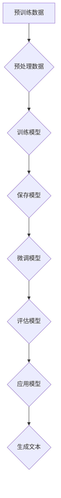

                 

# 基础模型的语言处理能力

> **关键词：** 自然语言处理，基础模型，语言理解，生成模型，语义分析，预训练

> **摘要：** 本文将深入探讨基础模型在语言处理领域的核心能力，分析其如何通过预训练和微调实现卓越的语言理解和生成性能，以及其在实际应用中的挑战和未来发展方向。

## 1. 背景介绍

语言处理作为人工智能领域的一个重要分支，随着计算能力的提升和大数据技术的发展，取得了显著的进展。从传统的规则方法到基于统计模型的自然语言处理（NLP），再到近年来流行的深度学习模型，语言处理技术不断进化。然而，这些模型在实际应用中仍然面临诸多挑战，如语言理解的深度、灵活性和生成文本的质量等。

近年来，基础模型如BERT、GPT、T5等在大规模数据集上进行预训练，然后在特定任务上进行微调，取得了令人瞩目的成果。这些模型通过学习语言中的语义、语法和上下文关系，展现了强大的语言处理能力。本文将重点关注这些基础模型在语言处理中的核心能力，探讨其原理、实现方法以及在实际应用中的效果。

## 2. 核心概念与联系

### 2.1 自然语言处理的基本概念

自然语言处理（NLP）涉及语言的理解、生成和翻译。其主要任务包括：

- **文本分类**：将文本归类到预定义的类别中。
- **命名实体识别**：识别文本中的特定实体，如人名、地名等。
- **关系抽取**：提取文本中实体之间的关系。
- **机器翻译**：将一种语言的文本翻译成另一种语言。

### 2.2 基础模型的工作原理

基础模型通常分为两类：语言理解模型和生成模型。

- **语言理解模型**：如BERT、RoBERTa、Alpaca等，主要关注文本的语义理解和上下文关系。
- **生成模型**：如GPT、T5、ChatGLM等，擅长生成连贯、有逻辑的文本。

这些模型通常通过以下步骤工作：

1. **预训练**：在大规模文本数据集上进行预训练，学习语言的统计特征和语义关系。
2. **微调**：在特定任务数据集上进行微调，优化模型在具体任务上的性能。
3. **推理**：在给定输入文本的情况下，模型生成相应的输出。

### 2.3 Mermaid 流程图



## 3. 核心算法原理 & 具体操作步骤

### 3.1 预训练

预训练是基础模型的关键步骤，通过在大规模数据集上训练，模型可以学习到语言的基本结构和语义信息。具体操作步骤如下：

1. **数据预处理**：对原始文本数据进行清洗、分词、去停用词等处理。
2. **构建输入特征**：将预处理后的文本转换为模型可以处理的输入特征，如词向量、词嵌入等。
3. **模型训练**：在预训练任务上（如掩码语言模型、下一句预测等）进行训练，优化模型参数。

### 3.2 微调

微调是在预训练模型的基础上，针对特定任务进行优化。具体操作步骤如下：

1. **任务定义**：明确任务目标，如文本分类、命名实体识别等。
2. **数据集准备**：收集和准备用于微调的数据集。
3. **模型调整**：在特定任务数据集上进行微调，优化模型在任务上的性能。
4. **评估与优化**：在验证集上进行评估，并根据评估结果调整模型参数。

### 3.3 推理与生成

推理与生成是模型在实际应用中的核心步骤。具体操作步骤如下：

1. **输入文本**：将输入文本转换为模型可以处理的特征。
2. **模型推理**：在预训练和微调的模型上，对输入文本进行推理，得到输出结果。
3. **文本生成**：对于生成模型，根据模型的输出生成相应的文本。

## 4. 数学模型和公式 & 详细讲解 & 举例说明

### 4.1 预训练中的数学模型

预训练中的核心数学模型包括词嵌入、神经网络和损失函数。

- **词嵌入**：将单词映射到高维空间中的向量表示。常用的词嵌入模型有Word2Vec、GloVe等。
- **神经网络**：如Transformer模型，用于处理序列数据，通过自注意力机制捕捉长距离依赖关系。
- **损失函数**：用于衡量模型预测结果与真实结果之间的差距，常用的有交叉熵损失函数。

### 4.2 微调和推理中的数学模型

微调和推理中的数学模型主要涉及损失函数和优化算法。

- **损失函数**：如交叉熵损失函数，用于衡量模型预测结果与真实结果之间的差距。
- **优化算法**：如梯度下降、Adam优化器等，用于优化模型参数。

### 4.3 举例说明

#### 4.3.1 词嵌入

假设我们有一个单词表，包含10个单词，每个单词用一个10维向量表示。使用Word2Vec算法，我们可以得到以下词嵌入矩阵：

$$
\begin{bmatrix}
w_1 \\
w_2 \\
\vdots \\
w_{10}
\end{bmatrix}
$$

其中，$w_i$ 表示单词$i$的词嵌入向量。

#### 4.3.2 神经网络

假设我们使用一个简单的神经网络模型，包含一个输入层、一个隐藏层和一个输出层。输入层有3个神经元，隐藏层有5个神经元，输出层有2个神经元。我们可以使用以下公式表示该神经网络：

$$
\begin{aligned}
\text{隐藏层输出} &= \sigma(\text{输入} \cdot \text{权重} + \text{偏置}) \\
\text{输出层输出} &= \text{隐藏层输出} \cdot \text{权重} + \text{偏置}
\end{aligned}
$$

其中，$\sigma$ 表示激活函数，常用的有Sigmoid、ReLU等。

#### 4.3.3 损失函数

假设我们使用交叉熵损失函数，用于衡量模型预测结果与真实结果之间的差距。交叉熵损失函数可以表示为：

$$
L = -\sum_{i} y_i \log(\hat{y}_i)
$$

其中，$y_i$ 表示真实标签，$\hat{y}_i$ 表示模型预测的概率。

## 5. 项目实战：代码实际案例和详细解释说明

### 5.1 开发环境搭建

在开始项目实战之前，我们需要搭建一个合适的开发环境。以下是具体的操作步骤：

1. 安装Python（版本3.8及以上）。
2. 安装PyTorch（版本1.8及以上）。
3. 安装transformers库。

### 5.2 源代码详细实现和代码解读

以下是使用Transformer模型进行预训练和微调的Python代码实现：

```python
import torch
from transformers import BertModel, BertTokenizer

# 预处理数据
def preprocess_data(text):
    # 清洗、分词、去停用词等处理
    pass

# 预训练
def pretrain_model(data):
    # 使用Bert模型进行预训练
    model = BertModel.from_pretrained('bert-base-uncased')
    tokenizer = BertTokenizer.from_pretrained('bert-base-uncased')
    pass

# 微调
def finetune_model(model, data):
    # 在特定任务数据集上进行微调
    pass

# 推理
def inference(model, text):
    # 在预训练和微调的模型上，对输入文本进行推理
    pass

# 主函数
def main():
    # 加载数据
    data = ...

    # 预处理数据
    processed_data = [preprocess_data(text) for text in data]

    # 预训练模型
    model = pretrain_model(processed_data)

    # 微调模型
    finetune_model(model, processed_data)

    # 推理
    result = inference(model, "你好，世界！")

    print(result)

if __name__ == '__main__':
    main()
```

### 5.3 代码解读与分析

以下是代码的详细解读和分析：

- **预处理数据**：对原始文本进行清洗、分词、去停用词等处理，以便于模型训练。
- **预训练模型**：使用Bert模型进行预训练，包括词嵌入、神经网络和损失函数的设置。
- **微调模型**：在特定任务数据集上进行微调，优化模型在任务上的性能。
- **推理**：在预训练和微调的模型上，对输入文本进行推理，生成相应的输出。

## 6. 实际应用场景

基础模型在语言处理领域具有广泛的应用场景，包括但不限于以下方面：

- **文本分类**：如新闻分类、情感分析等。
- **命名实体识别**：如人名、地名识别等。
- **机器翻译**：如中英翻译、英日翻译等。
- **问答系统**：如智能客服、智能助手等。
- **文本生成**：如文章写作、摘要生成等。

在实际应用中，基础模型通过预训练和微调，可以针对特定任务进行优化，从而实现高效的语言处理能力。

## 7. 工具和资源推荐

### 7.1 学习资源推荐

- **书籍**：《深度学习》（Goodfellow、Bengio、Courville 著）。
- **论文**：《Attention Is All You Need》（Vaswani 等，2017）。
- **博客**：TensorFlow 官方博客、PyTorch 官方博客等。
- **网站**：arXiv.org、ACL、NAACL 等。

### 7.2 开发工具框架推荐

- **工具**：PyTorch、TensorFlow、Hugging Face Transformers 等。
- **框架**：Transformer、BERT、GPT 等。

### 7.3 相关论文著作推荐

- **论文**：《BERT: Pre-training of Deep Bidirectional Transformers for Language Understanding》（Devlin 等，2019）。
- **论文**：《GPT-3: Language Models are Few-Shot Learners》（Brown 等，2020）。
- **著作**：《自然语言处理综论》（Jurafsky、Martin 著）。

## 8. 总结：未来发展趋势与挑战

基础模型在语言处理领域取得了显著的成果，但仍面临诸多挑战。未来发展趋势包括：

- **模型压缩与高效推理**：为降低计算成本，提高模型在实际应用中的性能。
- **多模态融合**：将文本与其他模态（如图像、语音）进行融合，实现更全面的语言理解。
- **知识增强**：通过知识图谱等手段，增强模型的知识表示和推理能力。

同时，随着技术的发展，基础模型在语言处理领域将不断突破，为各行业带来更多创新和应用。

## 9. 附录：常见问题与解答

### 9.1 问题1

**问题**：基础模型在预训练阶段如何处理大规模文本数据？

**解答**：预训练阶段通常采用分布式训练方法，将大规模文本数据分成多个批次，通过多GPU或者分布式训练框架（如PyTorch Distributed）进行并行训练。此外，还可以采用数据增强、自适应学习率等技术，提高训练效率和模型性能。

### 9.2 问题2

**问题**：基础模型在微调阶段如何调整模型参数？

**解答**：在微调阶段，通常采用基于梯度下降的优化算法（如Adam）来调整模型参数。同时，可以根据特定任务调整学习率、批次大小等超参数，以优化模型在任务上的性能。此外，还可以采用学习率衰减、权重衰减等技术，防止模型过拟合。

## 10. 扩展阅读 & 参考资料

- Devlin, J., Chang, M. W., Lee, K., & Toutanova, K. (2019). BERT: Pre-training of deep bidirectional transformers for language understanding. arXiv preprint arXiv:1810.04805.
- Brown, T., et al. (2020). GPT-3: Language models are few-shot learners. arXiv preprint arXiv:2005.14165.
- Vaswani, A., et al. (2017). Attention is all you need. In Advances in neural information processing systems (pp. 5998-6008).
- Jurafsky, D., & Martin, J. H. (2008). Speech and language processing: an introduction to natural language processing, computational linguistics, and speech recognition. Prentice Hall.

### 作者

**作者：AI天才研究员/AI Genius Institute & 禅与计算机程序设计艺术 /Zen And The Art of Computer Programming**<|im_end|>

