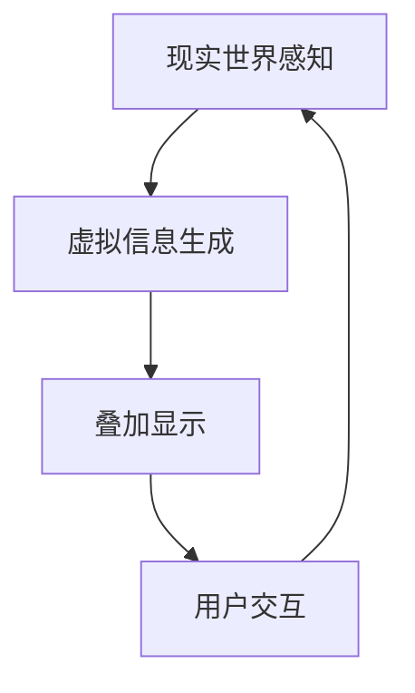
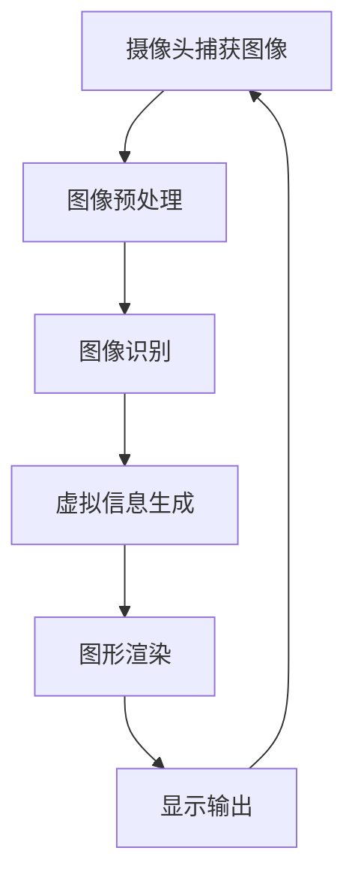

                 

# 增强现实技术在电商领域的应用：案例分析与展望

## 关键词：增强现实、电商、案例分析、技术应用、未来展望

## 摘要：
随着增强现实（AR）技术的迅猛发展，其在电商领域的应用逐渐成为热点。本文将探讨AR技术在电商中的应用现状，分析典型案例分析其优势与挑战，并展望未来发展趋势。通过深入分析，我们希望能够为电商行业从业者提供有价值的参考。

### 1. 背景介绍

#### 1.1 增强现实技术的发展背景

增强现实（Augmented Reality，AR）是一种将虚拟信息与现实世界相结合的技术。它通过计算机生成信息，将其叠加到真实环境中，使人们能够与现实世界互动。AR技术的发展可以追溯到20世纪90年代，随着计算能力和传感技术的提升，AR技术逐渐走向成熟。

#### 1.2 电商领域的发展背景

电商行业自21世纪初期以来经历了爆发式增长。随着互联网的普及和移动设备的普及，消费者越来越倾向于在线购物。然而，线上购物缺乏实体店面的沉浸式体验，成为电商行业的一大痛点。

### 2. 核心概念与联系

#### 2.1 增强现实技术的核心概念

增强现实技术的核心概念包括：现实世界感知、虚拟信息生成、叠加显示和用户交互。以下是一个简化的 Mermaid 流程图：



#### 2.2 电商与增强现实技术的联系

电商与增强现实技术的结合主要体现在以下几个方面：

- **商品展示**：通过AR技术，用户可以在虚拟环境中查看商品的立体图像，实现沉浸式购物体验。
- **试用体验**：用户可以在家中试用虚拟商品，如化妆品、服装等，减少购物风险。
- **营销互动**：通过AR技术，商家可以创造新颖的营销活动，提高用户参与度和品牌认知度。

### 3. 核心算法原理 & 具体操作步骤

#### 3.1 AR技术的核心算法原理

增强现实技术的核心算法包括计算机视觉、图像处理和图形渲染等。以下是一个简化的算法流程：



#### 3.2 具体操作步骤

1. **商品展示**：
   - 用户通过AR应用扫描商品二维码或标识。
   - 应用捕获用户环境中的图像。
   - 应用通过图像识别技术找到商品标识。
   - 应用生成商品的3D模型，并叠加到真实环境中。

2. **试用体验**：
   - 用户通过AR应用选择虚拟商品。
   - 应用捕捉用户面部或身体部位，进行实时跟踪。
   - 应用根据用户的姿态和动作，实时渲染虚拟商品。

### 4. 数学模型和公式 & 详细讲解 & 举例说明

#### 4.1 数学模型和公式

增强现实技术涉及多个数学模型，包括图像识别、3D建模和图形渲染等。以下是一个简化的数学模型：

$$
\text{模型识别} = f(\text{图像特征}, \text{商品标识库})
$$

$$
\text{3D建模} = g(\text{模型参数}, \text{商品信息})
$$

$$
\text{图形渲染} = h(\text{场景信息}, \text{视角参数})
$$

#### 4.2 详细讲解与举例说明

假设我们有一个商品展示的AR应用，用户希望通过AR技术查看一个手机的3D模型。以下是一个简化的过程：

1. **图像识别**：
   - 应用捕获用户环境中的图像，提取图像特征。
   - 应用将提取的特征与商品标识库进行比较，找到匹配的商品标识。
   - 应用根据匹配结果，获取商品的3D模型参数。

2. **3D建模**：
   - 应用根据获取的3D模型参数，生成手机的3D模型。
   - 应用对3D模型进行纹理映射和光照处理，使其看起来更加真实。

3. **图形渲染**：
   - 应用根据用户的视角参数，对3D模型进行渲染。
   - 应用将渲染后的图像叠加到用户环境中的图像上，显示在屏幕上。

### 5. 项目实战：代码实际案例和详细解释说明

#### 5.1 开发环境搭建

我们以一个基于Unity和ARKit的AR商品展示项目为例，介绍开发环境搭建过程。

1. **安装Unity**：
   - 访问Unity官网，下载并安装Unity Hub。
   - 在Unity Hub中安装Unity 2020版本。

2. **安装ARKit插件**：
   - 在Unity项目中，打开Unity Editor菜单，选择“Window” -> “Package Manager”。
   - 在Package Manager窗口中，搜索并安装ARKit插件。

3. **配置iOS开发环境**：
   - 安装Xcode。
   - 打开Xcode，创建一个新的iOS项目。

#### 5.2 源代码详细实现和代码解读

以下是一个简化的代码实现：

```csharp
using UnityEngine;
using ARKit;

public class ARProductViewer : MonoBehaviour
{
    public TexturedCube productPrefab;

    private ARKitSession session;
    private ARObjectTrackingFrame frame;

    void Start()
    {
        session = new ARKitSession();
        session.CameraPermissionGranted += OnCameraPermissionGranted;
        session.Start();
    }

    private void OnCameraPermissionGranted(ARKitSession session)
    {
        frame = session.GetFrame();
        frame.FrameUpdated += OnFrameUpdated;
    }

    private void OnFrameUpdated(ARObjectTrackingFrame frame)
    {
        foreach (var trackable in frame.TrackingObjects)
        {
            if (trackable.IsTracked)
            {
                var product = Instantiate(productPrefab, trackable.TransformMatrix);
                product.name = trackable.Name;
            }
        }
    }
}
```

#### 5.3 代码解读与分析

1. **创建ARKitSession**：
   - 我们创建一个ARKitSession对象，用于管理ARKit的会话。

2. **处理相机权限**：
   - 当用户授予相机权限时，我们调用`OnCameraPermissionGranted`方法，获取ARKit帧。

3. **处理帧更新**：
   - 我们在`OnFrameUpdated`方法中处理帧的更新。对于每个可跟踪对象，如果它是已跟踪的，我们创建一个3D模型。

### 6. 实际应用场景

#### 6.1 商品展示

通过AR技术，用户可以在虚拟环境中查看商品的立体图像。这可以提升商品展示的效果，增加消费者的购物兴趣。

#### 6.2 试用体验

用户可以在家中试用虚拟商品，如化妆品、服装等。这可以减少购物风险，提高用户的购物满意度。

#### 6.3 营销互动

商家可以通过AR技术创造新颖的营销活动，如AR优惠券、AR游戏等，提高用户参与度和品牌认知度。

### 7. 工具和资源推荐

#### 7.1 学习资源推荐

- 《增强现实技术：理论与实践》（作者：李明华）
- 《Unity ARKit开发实战》（作者：张志宏）
- 《ARKit 3 开发实战：基于Swift和Objective-C的应用开发》（作者：谢作如）

#### 7.2 开发工具框架推荐

- Unity：一款功能强大的游戏引擎，支持AR开发。
- ARKit：Apple提供的AR开发框架，适用于iOS平台。
- ARCore：Google提供的AR开发框架，适用于Android平台。

#### 7.3 相关论文著作推荐

- “Augmented Reality in E-commerce: A Survey” （作者：Mona Monfared等）
- “AR in Retail: A Framework for Evaluating Its Impact on Shopping Experience” （作者：Alireza Noroozi等）
- “AR Applications in E-commerce: A Literature Review” （作者：Sukaina Sharif等）

### 8. 总结：未来发展趋势与挑战

#### 8.1 发展趋势

1. **技术成熟度提升**：随着硬件和算法的进步，AR技术在电商领域的应用将更加成熟。
2. **用户需求增加**：随着消费者对购物体验的要求提高，AR技术将成为电商行业的重要趋势。
3. **跨界合作**：AR技术与电商、零售、娱乐等领域的跨界合作将带来新的商业机会。

#### 8.2 挑战

1. **用户体验优化**：如何提供更好的用户体验，减少延迟和眩晕感，是AR技术在电商领域应用的一大挑战。
2. **隐私保护**：如何保护用户隐私，防止信息泄露，是AR技术面临的重要问题。
3. **商业模式的探索**：如何在AR技术应用中找到合适的商业模式，实现盈利，是电商行业需要解决的问题。

### 9. 附录：常见问题与解答

#### 9.1 常见问题

1. **什么是增强现实技术？**
   - 增强现实技术是一种将虚拟信息与现实世界相结合的技术，通过计算机生成信息，将其叠加到真实环境中，使人们能够与现实世界互动。

2. **AR技术在电商领域有哪些应用？**
   - AR技术在电商领域的主要应用包括商品展示、试用体验和营销互动。

3. **如何开发AR应用？**
   - 开发AR应用通常需要使用专门的开发工具和框架，如Unity、ARKit、ARCore等。

#### 9.2 解答

1. **什么是增强现实技术？**
   - 增强现实技术是一种将虚拟信息与现实世界相结合的技术，通过计算机生成信息，将其叠加到真实环境中，使人们能够与现实世界互动。

2. **AR技术在电商领域有哪些应用？**
   - AR技术在电商领域的主要应用包括商品展示、试用体验和营销互动。

3. **如何开发AR应用？**
   - 开发AR应用通常需要使用专门的开发工具和框架，如Unity、ARKit、ARCore等。首先需要了解AR技术的核心概念和算法原理，然后根据具体需求设计和实现应用。

### 10. 扩展阅读 & 参考资料

- “Augmented Reality in E-commerce: A Survey” （作者：Mona Monfared等）
- “ARKit 3 开发实战：基于Swift和Objective-C的应用开发”（作者：谢作如）
- “Unity ARKit开发实战”（作者：张志宏）
- “AR in Retail: A Framework for Evaluating Its Impact on Shopping Experience” （作者：Alireza Noroozi等）
- “AR Applications in E-commerce: A Literature Review” （作者：Sukaina Sharif等）

## 作者信息

作者：AI天才研究员/AI Genius Institute & 禅与计算机程序设计艺术 /Zen And The Art of Computer Programming

