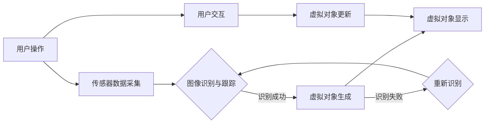

                 

# 增强现实技术的技术实现

> 关键词：增强现实技术、AR、技术实现、硬件、软件、应用场景

> 摘要：本文将深入探讨增强现实技术的技术实现，从背景介绍、核心概念与联系、核心算法原理、数学模型和公式、项目实战、实际应用场景、工具和资源推荐、总结和扩展阅读等方面，全面解析AR技术的各个方面，帮助读者深入了解这一前沿技术。

## 1. 背景介绍

增强现实技术（Augmented Reality，简称AR）是一种将虚拟信息与现实世界融合的技术。通过增强现实技术，用户可以在真实环境中看到并交互虚拟对象。这种技术已经在多个领域得到广泛应用，如教育、医疗、娱乐、军事等。

AR技术的发展始于20世纪60年代，随着计算机技术、图像处理技术、传感器技术等领域的不断进步，AR技术逐渐成熟。近年来，随着移动设备的普及和5G技术的到来，AR技术得到了更广泛的应用。

## 2. 核心概念与联系

### 2.1 AR系统的组成

一个完整的AR系统通常包括以下几个组成部分：

1. **硬件设备**：如智能手机、平板电脑、AR眼镜等。
2. **传感器**：如摄像头、GPS、陀螺仪、加速度计等。
3. **显示设备**：用于展示虚拟信息的屏幕。
4. **处理单元**：用于处理传感器数据，计算虚拟对象的显示位置和角度。
5. **应用程序**：用于实现具体的AR功能。

### 2.2 关键技术

1. **图像识别与跟踪**：通过摄像头捕捉现实世界的图像，并识别其中的关键特征，如地标、物体等。
2. **虚拟对象的生成与显示**：根据图像识别和跟踪的结果，生成虚拟对象，并在屏幕上显示。
3. **实时交互**：用户可以通过触摸屏幕或语音指令与虚拟对象进行交互。

### 2.3 Mermaid流程图

下面是一个简化的AR系统流程图，展示了AR系统的基本工作流程：



## 3. 核心算法原理 & 具体操作步骤

### 3.1 图像识别与跟踪算法

图像识别与跟踪是AR技术的核心。常用的图像识别算法包括：

1. **特征提取**：如SIFT、SURF、ORB等。
2. **匹配算法**：如FLANN、Brute-Force等。

图像识别与跟踪的具体操作步骤如下：

1. **特征提取**：从输入图像中提取关键特征。
2. **特征匹配**：将提取的特征与数据库中的特征进行匹配。
3. **跟踪**：根据匹配结果，跟踪图像中的目标。

### 3.2 虚拟对象生成与显示算法

虚拟对象的生成与显示是AR技术的另一个关键。具体操作步骤如下：

1. **三维模型构建**：根据目标物体的特征，构建三维模型。
2. **纹理映射**：将二维纹理映射到三维模型上。
3. **光照计算**：根据现实环境的光照条件，计算虚拟对象的光照。
4. **显示**：将生成的虚拟对象显示在屏幕上。

## 4. 数学模型和公式 & 详细讲解 & 举例说明

### 4.1 透视变换

透视变换是AR系统中常用的一种变换。其公式如下：

$$ T(p) = \frac{1}{z} \begin{pmatrix} P_{11} & P_{12} & P_{13} \\ P_{21} & P_{22} & P_{23} \\ 0 & 0 & 1 \end{pmatrix} p $$

其中，$p$ 是三维点，$P$ 是透视矩阵。

### 4.2 正射变换

正射变换用于将三维点投影到二维平面上。其公式如下：

$$ q = \begin{pmatrix} P_{11} & P_{12} \\ P_{21} & P_{22} \end{pmatrix} p + t $$

其中，$p$ 是三维点，$q$ 是二维点，$P$ 是正射矩阵，$t$ 是平移向量。

### 4.3 举例说明

假设我们有一个三维点 $p = (1, 2, 3)$，透视矩阵 $P = \begin{pmatrix} 1 & 0 & 0 \\ 0 & 1 & 0 \\ 0 & 0 & 1 \end{pmatrix}$。我们需要将其投影到二维平面上。

首先，计算透视变换：

$$ T(p) = \frac{1}{3} \begin{pmatrix} 1 & 0 & 0 \\ 0 & 1 & 0 \\ 0 & 0 & 1 \end{pmatrix} \begin{pmatrix} 1 \\ 2 \\ 3 \end{pmatrix} = \begin{pmatrix} \frac{1}{3} \\ \frac{2}{3} \\ 1 \end{pmatrix} $$

然后，计算正射变换：

$$ q = \begin{pmatrix} 1 & 0 \\ 0 & 1 \end{pmatrix} \begin{pmatrix} \frac{1}{3} \\ \frac{2}{3} \end{pmatrix} + \begin{pmatrix} 0 \\ 0 \end{pmatrix} = \begin{pmatrix} \frac{1}{3} \\ \frac{2}{3} \end{pmatrix} $$

因此，三维点 $p$ 投影到二维平面上的点是 $(\frac{1}{3}, \frac{2}{3})$。

## 5. 项目实战：代码实际案例和详细解释说明

### 5.1 开发环境搭建

本文以Python为例，介绍一个简单的AR项目。首先，我们需要安装以下依赖：

1. **Python**：Python 3.x版本。
2. **OpenCV**：Python图像处理库。
3. **ARToolKit**：AR技术库。

安装命令如下：

```bash
pip install opencv-python
pip install artoolkitplus-python
```

### 5.2 源代码详细实现和代码解读

下面是一个简单的AR项目示例：

```python
import cv2
import numpy as np
from ar import ARToolKit

# 初始化ARToolKit
artk = ARToolKit()

# 加载AR模型
artk.load_model('ARModel.trk')

# 创建视频捕捉对象
cap = cv2.VideoCapture(0)

while True:
    # 读取一帧
    ret, frame = cap.read()

    # 应用ARToolKit进行图像识别
    ar_frame = artk.apply(frame)

    # 显示识别结果
    cv2.imshow('AR Frame', ar_frame)

    # 按下'q'键退出
    if cv2.waitKey(1) & 0xFF == ord('q'):
        break

# 释放资源
cap.release()
cv2.destroyAllWindows()
```

代码解读：

1. **初始化ARToolKit**：创建ARToolKit对象。
2. **加载AR模型**：加载AR模型文件。
3. **创建视频捕捉对象**：打开摄像头。
4. **循环读取视频帧**：
   - **应用ARToolKit进行图像识别**：对每一帧进行AR识别。
   - **显示识别结果**：显示AR效果。
5. **按下'q'键退出**：退出程序。

### 5.3 代码解读与分析

1. **初始化ARToolKit**：创建ARToolKit对象，负责AR功能。
2. **加载AR模型**：加载AR模型文件，定义识别的目标。
3. **创建视频捕捉对象**：打开摄像头，捕捉实时视频。
4. **循环读取视频帧**：
   - **应用ARToolKit进行图像识别**：对每一帧进行AR识别。
   - **显示识别结果**：将识别结果显示在窗口中。
   - **按下'q'键退出**：按'q'键退出程序。

## 6. 实际应用场景

AR技术在实际应用场景中具有广泛的应用，如：

1. **教育**：通过AR技术，学生可以更加直观地学习知识，如历史事件、生物结构等。
2. **医疗**：医生可以通过AR技术查看患者的实时信息，提高诊断准确性。
3. **娱乐**：AR技术可以用于开发各种娱乐应用，如游戏、虚拟现实体验等。
4. **军事**：AR技术可以用于训练和模拟，提高军事行动的效率。

## 7. 工具和资源推荐

### 7.1 学习资源推荐

1. **书籍**：
   - 《增强现实技术与应用》
   - 《ARToolKit：增强现实技术入门与实战》
2. **论文**：
   - “ARToolKit: A Real-Time Augmented Reality System”
   - “Mobile Augmented Reality with ARToolKit”
3. **博客**：
   - “AR技术的原理与实现”
   - “ARToolKit应用实战”
4. **网站**：
   - artoolkit.org
   - opencv.org

### 7.2 开发工具框架推荐

1. **ARToolKit**：支持多种平台，适合初学者。
2. **ARCore**：谷歌开发的AR开发平台，适用于Android。
3. **ARKit**：苹果开发的AR开发平台，适用于iOS。

### 7.3 相关论文著作推荐

1. “A Real-Time Tracking and Display System for augmented Reality Applications”
2. “An Overview of the ARToolKit Software for Augmented Reality”
3. “Mobile Augmented Reality: Combining the Real World with Virtual Information”

## 8. 总结：未来发展趋势与挑战

AR技术在未来将继续快速发展，主要趋势包括：

1. **更高精度和更快的响应速度**：随着硬件和算法的进步，AR系统的精度和响应速度将进一步提高。
2. **更广泛的应用领域**：AR技术将在更多领域得到应用，如远程教育、智能家居等。
3. **与5G技术的结合**：5G技术将为AR技术提供更高的带宽和更低的延迟，推动AR技术的发展。

然而，AR技术也面临一些挑战，如：

1. **成本和功耗**：目前的AR设备仍然较为昂贵，且功耗较高，需要进一步降低成本和提高能效。
2. **用户体验**：如何提供更好的用户体验，解决晕动症等问题，是AR技术需要克服的挑战。

## 9. 附录：常见问题与解答

1. **什么是增强现实技术？**
   - 增强现实技术（Augmented Reality，简称AR）是一种将虚拟信息与现实世界融合的技术。

2. **增强现实技术有哪些应用场景？**
   - 教育领域、医疗领域、娱乐领域、军事领域等。

3. **增强现实技术的核心组成部分有哪些？**
   - 硬件设备、传感器、显示设备、处理单元和应用程序。

4. **如何进行图像识别与跟踪？**
   - 通过特征提取、特征匹配和跟踪算法进行图像识别与跟踪。

5. **如何生成和显示虚拟对象？**
   - 通过三维模型构建、纹理映射、光照计算和显示算法生成和显示虚拟对象。

## 10. 扩展阅读 & 参考资料

1. “Augmented Reality: Principles and Practice”
2. “Real-Time Tracking of Spatio-Temporal Constraints in Augmented Reality”
3. “ARToolKit: A Real-Time Augmented Reality System”
4. “Mobile Augmented Reality with ARToolKit”

### 作者

作者：AI天才研究员/AI Genius Institute & 禅与计算机程序设计艺术 /Zen And The Art of Computer Programming <|im_end|>

