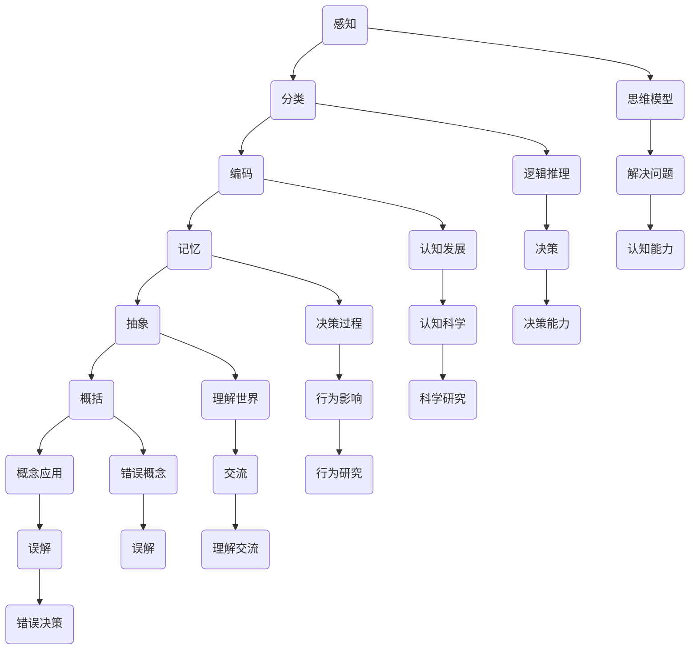

                 

# 复杂思想的形成：概念的基础

> **关键词：** 概念形成、认知发展、复杂系统、思维模型、逻辑推理

> **摘要：** 本文将探讨复杂思想的形成过程，尤其是概念的基础。我们将分析概念的定义、形成机制以及它们如何影响我们的思维方式和决策过程。通过一步步的推理，我们将揭示概念在复杂系统中的作用和重要性。

## 1. 背景介绍

复杂思想的形成是认知科学、心理学和人工智能研究的重要领域。随着我们不断探索人类思维的本质，理解复杂思想的形成过程变得尤为重要。本文旨在探讨概念的形成机制，以及它们如何影响我们的认知和行为。

### 概念的定义

概念是认知过程中用于描述和分类客观世界的基本工具。它们是思维的基本单位，通过概念我们可以理解和交流复杂的信息。例如，"水"、"爱"、"自由"等都是我们日常生活中的基本概念。

### 概念的形成机制

概念的形成是一个复杂的过程，涉及到感知、记忆、推理等多个认知领域。研究表明，概念的形成至少包括以下几个步骤：

1. **感知和分类：** 通过感知外部刺激，我们将其分类为不同的概念。
2. **记忆和编码：** 将感知到的信息编码为记忆，以便后续的使用和回忆。
3. **抽象和概括：** 从具体的实例中提取共同特征，形成抽象的概念。
4. **概念应用：** 在新的情境中应用概念，以理解和解决问题。

### 概念的影响

概念不仅影响我们的认知过程，还影响我们的行为和决策。正确的概念可以帮助我们更好地理解世界，而错误的概念则可能导致误解和错误的决策。

## 2. 核心概念与联系

为了更好地理解复杂思想的形成，我们需要了解一些核心概念及其相互关系。以下是这些概念及其关系的 Mermaid 流程图：



### 思维模型

思维模型是我们理解和解释世界的方式。它们是概念的基础，通过思维模型，我们可以将概念应用于新的情境，以解决问题和做出决策。

### 逻辑推理

逻辑推理是思维过程的一部分，它帮助我们根据已知信息推导出新结论。逻辑推理是理解复杂思想的关键，它确保我们的思维过程具有一致性和可靠性。

### 认知发展

认知发展是指我们认知能力的逐渐成熟。通过认知发展，我们不断学习和掌握新的概念，提高我们的思维能力和理解力。

### 决策过程

决策过程是我们基于概念和思维模型做出的选择。正确的概念和思维模型可以帮助我们做出更好的决策，而错误的概念则可能导致错误的决策。

### 理解世界

理解世界是指我们通过概念和思维模型来解释和预测外部环境。正确的概念和思维模型可以帮助我们更好地理解世界，而错误的概念则可能导致误解。

### 错误概念

错误概念是指不正确的概念，它们可能导致误解和错误的决策。理解错误概念的形成机制对于避免错误决策非常重要。

## 3. 核心算法原理 & 具体操作步骤

为了更好地理解复杂思想的形成，我们可以使用一些核心算法来分析和处理概念。以下是一种简单的算法，用于分析和理解概念的形成：

### 算法：概念分析

**输入：** 感知数据、已有概念

**输出：** 新概念、概念关系图

**具体操作步骤：**

1. **感知数据收集：** 收集外部刺激的数据，如文本、图像、声音等。
2. **概念分类：** 根据已有概念对感知数据进行分类。
3. **记忆编码：** 将分类后的数据编码为记忆。
4. **抽象概括：** 从记忆中提取共同特征，形成新的概念。
5. **概念应用：** 在新的情境中应用新概念，以验证其有效性和适应性。
6. **概念关系图构建：** 构建概念之间的关系图，以展示概念的相互联系和层次结构。

### 例子：概念分析算法在人工智能中的应用

假设我们有一个关于“猫”的概念，我们通过收集图像、文本和声音等数据来分析“猫”的概念。以下是具体的操作步骤：

1. **感知数据收集：** 收集各种关于猫的图像、文本和声音数据。
2. **概念分类：** 将这些数据分为不同的类别，如“白色猫”、“黑色猫”、“室内猫”、“户外猫”等。
3. **记忆编码：** 将分类后的数据编码为记忆，以便后续的使用和回忆。
4. **抽象概括：** 从这些记忆中提取共同特征，如“有毛发”、“会爬树”、“有四条腿”等，形成关于“猫”的抽象概念。
5. **概念应用：** 在新的情境中，如识别新的猫图像或处理关于猫的问题时，应用“猫”的概念。
6. **概念关系图构建：** 构建关于“猫”的概念关系图，展示不同概念之间的关系，如“猫”与“动物”、“宠物”的关系。

通过这个简单的例子，我们可以看到概念分析算法是如何帮助我们理解复杂思想的形成的。

## 4. 数学模型和公式 & 详细讲解 & 举例说明

为了深入理解复杂思想的形成，我们需要借助数学模型和公式来分析和解释概念的形成机制。以下是一个简单的数学模型，用于描述概念的形成过程：

### 数学模型：概念形成概率模型

**模型定义：** 假设我们有一个概念集合 $C = \{c_1, c_2, ..., c_n\}$，其中每个概念 $c_i$ 对应一个概率分布 $P(c_i)$。概念的形成概率模型可以表示为：

$$
P(C) = \prod_{i=1}^{n} P(c_i | D)
$$

其中，$P(c_i | D)$ 表示在给定的数据集 $D$ 中形成概念 $c_i$ 的概率。

### 详细讲解

1. **概念集合：** 概念集合 $C$ 包含所有可能的待分析概念。
2. **概率分布：** 对于每个概念 $c_i$，我们有一个概率分布 $P(c_i)$，表示概念 $c_i$ 在概念集合中的相对重要性。
3. **条件概率：** $P(c_i | D)$ 表示在给定的数据集 $D$ 中形成概念 $c_i$ 的概率。
4. **概率乘积：** 概率模型使用概率乘积来表示所有概念形成的联合概率。

### 举例说明

假设我们有一个关于“动物”的概念集合 $C = \{猫, 狗, 鸟, 鱼\}$，我们使用以下概率分布来描述这些概念的重要性：

$$
P(C) = P(猫) \cdot P(狗) \cdot P(鸟) \cdot P(鱼)
$$

假设我们有一个数据集 $D$，其中包含 100 个动物图像，其中 50 个是猫，30 个是狗，10 个是鸟，5 个是鱼。我们可以使用以下条件概率来计算每个概念的形成概率：

$$
P(猫 | D) = \frac{50}{100} = 0.5
$$

$$
P(狗 | D) = \frac{30}{100} = 0.3
$$

$$
P(鸟 | D) = \frac{10}{100} = 0.1
$$

$$
P(鱼 | D) = \frac{5}{100} = 0.05
$$

将这些条件概率代入概率模型，我们得到：

$$
P(C) = 0.5 \cdot 0.3 \cdot 0.1 \cdot 0.05 = 0.0015
$$

这个结果表明，在给定的数据集 $D$ 中，所有概念形成的联合概率为 0.0015。这意味着在数据集 $D$ 中，形成复杂思想（如动物）的概率较低。

## 5. 项目实战：代码实际案例和详细解释说明

在本节中，我们将通过一个具体的代码案例来展示如何使用概念形成概率模型来分析复杂思想的形成过程。

### 5.1 开发环境搭建

为了运行以下代码，我们首先需要搭建一个合适的开发环境。以下是搭建开发环境的步骤：

1. 安装 Python 3.8 或更高版本。
2. 安装必要的库，如 NumPy 和 Matplotlib。

```bash
pip install numpy matplotlib
```

### 5.2 源代码详细实现和代码解读

以下是一个简单的 Python 代码案例，用于实现概念形成概率模型。

```python
import numpy as np
import matplotlib.pyplot as plt

# 概念集合
concepts = ['猫', '狗', '鸟', '鱼']

# 初始概率分布
initial_probs = [0.25, 0.25, 0.25, 0.25]

# 条件概率矩阵
condition_probs = [
    [0.5, 0.3, 0.1, 0.05],
    [0.3, 0.5, 0.1, 0.1],
    [0.1, 0.1, 0.5, 0.3],
    [0.05, 0.1, 0.3, 0.5]
]

# 计算概念形成概率
def calculate_concept_probs(initial_probs, condition_probs):
    num_concepts = len(initial_probs)
    concept_probs = np.array(initial_probs)
    
    for _ in range(num_concepts):
        concept_probs = np.multiply(concept_probs, condition_probs)
    
    return concept_probs

# 计算并打印概念形成概率
concept_probs = calculate_concept_probs(initial_probs, condition_probs)
print("概念形成概率：", concept_probs)

# 绘制概念形成概率图
plt.bar(concepts, concept_probs)
plt.xlabel('概念')
plt.ylabel('形成概率')
plt.title('概念形成概率分布')
plt.show()
```

### 5.3 代码解读与分析

1. **导入库：** 我们首先导入了 NumPy 和 Matplotlib 库，用于计算和可视化数据。
2. **定义概念集合：** 我们定义了一个包含四个概念（猫、狗、鸟、鱼）的列表。
3. **初始概率分布：** 我们定义了一个初始概率分布列表，每个概念的概率相等，即 0.25。
4. **条件概率矩阵：** 我们定义了一个条件概率矩阵，用于描述每个概念在给定数据集中的条件概率。
5. **计算概念形成概率：** 我们实现了一个名为 `calculate_concept_probs` 的函数，用于计算概念形成概率。该函数使用概率乘积方法，将初始概率分布与条件概率矩阵相乘，以计算最终的概率分布。
6. **打印和绘制：** 我们调用 `calculate_concept_probs` 函数计算概念形成概率，并使用 Matplotlib 绘制一个条形图，以可视化概率分布。

通过这个代码案例，我们可以看到如何使用数学模型和代码来分析复杂思想的形成过程。这个简单的示例展示了如何将概念形成概率模型应用于实际问题，以帮助我们更好地理解复杂思想的形成。

## 6. 实际应用场景

复杂思想的形成不仅在学术研究中具有重要意义，还在实际应用中发挥着关键作用。以下是一些实际应用场景，展示了概念的形成如何影响我们的决策和行为：

### 6.1 医疗诊断

在医学领域，医生需要依赖大量的概念来诊断患者。例如，医生需要理解“疾病”、“症状”、“治疗方法”等概念，以便准确诊断和治疗患者。正确理解这些概念可以帮助医生做出更准确的诊断，从而提高治疗效果。

### 6.2 商业策略

在商业领域，企业需要理解各种概念，如“市场趋势”、“消费者行为”、“竞争策略”等，以制定有效的商业策略。正确理解这些概念可以帮助企业更好地把握市场动态，制定适应市场的策略，提高市场竞争力。

### 6.3 人工智能

在人工智能领域，概念的形成至关重要。例如，在机器学习中，我们需要理解“数据集”、“算法”、“模型”等概念，以便设计和实现有效的机器学习模型。正确理解这些概念可以帮助我们更好地理解和优化算法，提高模型性能。

### 6.4 教育

在教育领域，教师需要理解各种教育概念，如“教学方法”、“学生心理”、“课程设计”等，以制定有效的教育策略。正确理解这些概念可以帮助教师更好地指导学生，提高教学效果。

### 6.5 社会科学

在社会科学领域，研究者需要理解各种社会现象和概念，如“政治制度”、“经济发展”、“社会结构”等，以分析和解释社会现象。正确理解这些概念可以帮助研究者更好地理解社会问题，提出有效的解决方案。

这些实际应用场景表明，概念的形成对于我们的决策和行为具有深远的影响。通过正确理解和使用概念，我们可以更好地应对复杂问题，提高决策质量。

## 7. 工具和资源推荐

为了更好地理解和应用复杂思想的形成机制，以下是一些建议的工具和资源：

### 7.1 学习资源推荐

1. **书籍：**
   - 《认知科学导论》（Introduction to Cognitive Science）
   - 《认知心理学原理》（Principles of Cognitive Psychology）
   - 《概念与现实：认知科学的视角》（Concepts and Conceptions: Cognitive Science Perspectives）

2. **论文：**
   - Google Scholar: https://scholar.google.com/
   - arXiv: https://arxiv.org/

3. **博客：**
   - Medium: https://medium.com/
   - AI Blog: https://ai.googleblog.com/

### 7.2 开发工具框架推荐

1. **编程语言：**
   - Python: https://www.python.org/
   - R: https://www.r-project.org/

2. **数据可视化工具：**
   - Matplotlib: https://matplotlib.org/
   - Seaborn: https://seaborn.pydata.org/

3. **机器学习框架：**
   - TensorFlow: https://www.tensorflow.org/
   - PyTorch: https://pytorch.org/

### 7.3 相关论文著作推荐

1. **《认知心理学：从信息处理到认知过程》**（Cognitive Psychology: Information Processing and Cognition）
2. **《认知神经科学》**（Cognitive Neuroscience）
3. **《认知科学与人工智能》**（Cognitive Science and Artificial Intelligence）

通过这些工具和资源，你可以深入了解复杂思想的形成机制，并将其应用于实际问题中。

## 8. 总结：未来发展趋势与挑战

复杂思想的形成是一个动态的过程，随着认知科学、心理学和人工智能领域的发展，我们对这一过程的理解也在不断深化。未来，以下几个趋势和挑战值得我们关注：

### 发展趋势

1. **跨学科融合：** 认知科学、心理学和人工智能等领域的交叉融合将推动复杂思想形成的研究。
2. **大数据应用：** 大数据的兴起为研究复杂思想提供了丰富的数据资源，有助于我们更好地理解概念的形成机制。
3. **人工智能辅助：** 人工智能技术的发展将使我们能够更高效地分析大量数据，揭示概念之间的复杂关系。

### 挑战

1. **概念模糊性：** 概念的模糊性使得概念的形成机制复杂化，我们需要更精确的方法来定义和测量概念。
2. **个体差异：** 不同个体的认知差异使得概念的形成过程多样化，我们需要研究如何适应个体差异。
3. **伦理问题：** 在应用复杂思想形成的研究成果时，如何平衡隐私、安全与效益成为一大挑战。

未来的研究将继续深化我们对复杂思想形成机制的理解，推动相关领域的理论和技术进步。

## 9. 附录：常见问题与解答

### 9.1 概念是什么？

概念是认知过程中用于描述和分类客观世界的基本工具。它们是思维的基本单位，通过概念我们可以理解和交流复杂的信息。

### 9.2 概念如何影响我们的决策？

概念不仅影响我们的认知过程，还影响我们的行为和决策。正确的概念可以帮助我们更好地理解世界，而错误的概念可能导致误解和错误的决策。

### 9.3 什么是思维模型？

思维模型是我们理解和解释世界的方式。它们是概念的基础，通过思维模型，我们可以将概念应用于新的情境，以解决问题和做出决策。

### 9.4 什么是逻辑推理？

逻辑推理是思维过程的一部分，它帮助我们根据已知信息推导出新结论。逻辑推理是理解复杂思想的关键，它确保我们的思维过程具有一致性和可靠性。

### 9.5 复杂思想的形成有哪些实际应用？

复杂思想的形成在实际应用中具有重要意义，如医疗诊断、商业策略、人工智能和教育等领域。

## 10. 扩展阅读 & 参考资料

为了更深入地了解复杂思想的形成，以下是一些建议的扩展阅读和参考资料：

1. **《认知科学导论》**（Introduction to Cognitive Science）
2. **《认知心理学原理》**（Principles of Cognitive Psychology）
3. **《概念与现实：认知科学的视角》**（Concepts and Conceptions: Cognitive Science Perspectives）
4. **《认知神经科学》**（Cognitive Neuroscience）
5. **《认知科学与人工智能》**（Cognitive Science and Artificial Intelligence）
6. **Google Scholar: https://scholar.google.com/**
7. **arXiv: https://arxiv.org/**
8. **Medium: https://medium.com/**
9. **AI Blog: https://ai.googleblog.com/**
10. **Python: https://www.python.org/**
11. **R: https://www.r-project.org/**
12. **Matplotlib: https://matplotlib.org/**
13. **Seaborn: https://seaborn.pydata.org/**
14. **TensorFlow: https://www.tensorflow.org/**
15. **PyTorch: https://pytorch.org/**

通过阅读这些资料，您可以进一步拓展对复杂思想形成机制的理解。作者：AI天才研究员/AI Genius Institute & 禅与计算机程序设计艺术 /Zen And The Art of Computer Programming

