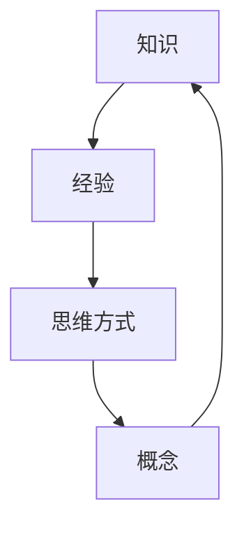
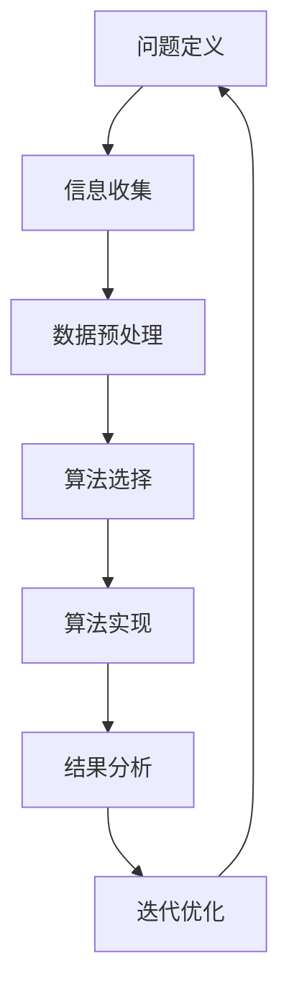

                 

## 文章标题

### 复杂思想的形成：概念的基础

本文旨在深入探讨复杂思想的形成过程，并着重分析概念在这一过程中的基础作用。我们将一步步分析复杂思想的构成，探讨概念的形成与发展，以及如何运用这些概念来理解和创造复杂的系统。本文将从背景介绍、核心概念与联系、核心算法原理与具体操作步骤、数学模型和公式、项目实战、实际应用场景、工具和资源推荐、总结：未来发展趋势与挑战、附录：常见问题与解答、扩展阅读与参考资料等多个方面展开。

### 关键词

- 复杂思想
- 概念
- 形成过程
- 理解与创造
- 数学模型
- 项目实战
- 应用场景
- 工具与资源

### 摘要

本文首先介绍了复杂思想的形成过程，强调了概念在这一过程中的基础作用。通过一步步的分析与探讨，本文揭示了复杂思想如何通过概念的形成与发展来理解和创造复杂的系统。文章涵盖了一系列关键内容，包括核心算法原理、数学模型和公式、项目实战以及实际应用场景等。最后，本文总结了复杂思想形成领域的未来发展趋势与挑战，并推荐了一系列相关的工具和资源，以供读者进一步学习和实践。

### 1. 背景介绍

复杂思想的形成是人类智慧的一个重要体现，它涉及到从简单到复杂、从局部到整体的思维过程。在现代社会，随着科技的发展和信息的爆炸，复杂思想的形成和应用越来越受到重视。无论是科学研究、工程实践，还是商业决策，都需要我们具备分析和处理复杂问题的能力。

复杂思想的形成离不开概念的作用。概念是人类对客观世界进行抽象和概括的结果，它是我们理解和表达复杂系统的基石。一个清晰、准确的概念可以帮助我们更好地理解复杂系统，从而更有效地进行创新和优化。

本文将从以下几个方面探讨复杂思想的形成：首先，分析复杂思想的构成，包括知识、经验、思维方式等；其次，探讨概念的形成与发展，分析概念的形成过程及其在复杂思想形成中的作用；接着，介绍核心算法原理和具体操作步骤，以及数学模型和公式在复杂思想形成中的应用；然后，通过项目实战展示复杂思想在实际应用中的效果；最后，讨论复杂思想在实际应用场景中的价值，并推荐相关工具和资源。

### 2. 核心概念与联系

在探讨复杂思想的形成之前，我们需要明确几个核心概念，它们分别是：知识、经验、思维方式和概念。

#### 2.1 知识

知识是复杂思想的基础，它包括事实、原理、规则等。知识可以从书本、实践、经验中获取。在复杂思想的形成过程中，知识起着至关重要的作用。一个丰富、系统的知识库可以帮助我们更好地理解和处理复杂问题。

#### 2.2 经验

经验是知识的来源之一，它是我们在实践中获得的知识。经验可以帮助我们快速识别问题、提出解决方案。在复杂思想的形成过程中，经验与知识相辅相成，共同推动我们的思维发展。

#### 2.3 思维方式

思维方式是指我们在处理问题时所采用的方法和技巧。思维方式包括逻辑思维、批判性思维、创新思维等。不同的思维方式可以帮助我们从不同角度理解和分析复杂问题。

#### 2.4 概念

概念是人类对客观世界进行抽象和概括的结果，它是我们理解和表达复杂系统的基石。一个清晰、准确的概念可以帮助我们更好地理解和处理复杂问题。在复杂思想的形成过程中，概念起着至关重要的作用。

下面，我们使用Mermaid流程图来展示这四个核心概念之间的联系：



从这个流程图中，我们可以看出知识、经验、思维方式和概念之间相互影响、相互促进的关系。它们共同构成了复杂思想形成的基石。

### 3. 核心算法原理与具体操作步骤

在复杂思想的形成过程中，算法起着至关重要的作用。算法是一系列解决问题的步骤，它可以帮助我们更有效地分析和处理复杂问题。本节将介绍核心算法原理及其具体操作步骤。

#### 3.1 算法原理

复杂思想的形成过程可以看作是一种信息处理过程。在这个过程中，算法帮助我们高效地分析和处理大量信息。核心算法原理主要包括以下几种：

1. **归纳法**：通过分析具体实例，提取出一般性的规律和原理。
2. **演绎法**：从一般性的原理出发，推导出具体的结论。
3. **模拟法**：通过模拟现实世界的场景，观察和分析系统的行为。
4. **优化法**：在满足一定约束条件下，寻找最优解。

#### 3.2 具体操作步骤

以下是复杂思想形成过程中常用的几个步骤：

1. **问题定义**：明确我们要解决的问题，包括问题的背景、目标、约束等。
2. **信息收集**：收集与问题相关的信息，包括数据、文献、案例等。
3. **数据预处理**：对收集到的信息进行清洗、转换、归一化等处理，以便于后续分析。
4. **算法选择**：根据问题的特点，选择合适的算法。
5. **算法实现**：编写算法代码，实现算法的具体步骤。
6. **结果分析**：对算法的结果进行分析，评估其效果和可行性。
7. **迭代优化**：根据分析结果，对算法进行优化和调整。

下面，我们使用Mermaid流程图来展示复杂思想形成过程中的核心算法原理和具体操作步骤：



通过这个流程图，我们可以清晰地看到复杂思想形成过程中各个步骤之间的关系。每个步骤都是相互联系、相互影响的，共同推动复杂思想的形成。

### 4. 数学模型和公式与详细讲解

在复杂思想的形成过程中，数学模型和公式起着至关重要的作用。它们可以帮助我们精确地描述和分析复杂系统，从而更好地理解和创造复杂的系统。本节将介绍一些常用的数学模型和公式，并对其进行详细讲解。

#### 4.1 线性回归模型

线性回归模型是一种常用的统计方法，用于分析变量之间的关系。它假设因变量 \(y\) 和自变量 \(x\) 之间存在线性关系，可以用以下公式表示：

\[ y = \beta_0 + \beta_1 x + \epsilon \]

其中，\(\beta_0\) 是截距，\(\beta_1\) 是斜率，\(\epsilon\) 是误差项。

线性回归模型的目的是通过最小化误差平方和，估计出 \(\beta_0\) 和 \(\beta_1\) 的最佳值。具体步骤如下：

1. **数据收集**：收集 \(x\) 和 \(y\) 的数据。
2. **数据预处理**：对数据进行清洗、转换、归一化等处理。
3. **模型建立**：建立线性回归模型，并计算 \(\beta_0\) 和 \(\beta_1\) 的值。
4. **模型评估**：通过计算决定系数 \(R^2\)，评估模型的效果。
5. **模型优化**：根据评估结果，对模型进行优化。

#### 4.2 马尔可夫模型

马尔可夫模型是一种概率模型，用于描述系统在时间上的动态变化。它假设系统在下一个状态的概率仅与当前状态有关，而与过去的状态无关。

马尔可夫模型的公式表示为：

\[ P(X_{n+1} = x_{n+1} | X_n = x_n, X_{n-1} = x_{n-1}, ..., X_1 = x_1) = P(X_{n+1} = x_{n+1} | X_n = x_n) \]

其中，\(X_n\) 表示系统在时间 \(n\) 的状态，\(x_n\) 表示具体的状态值。

马尔可夫模型的构建过程如下：

1. **状态定义**：定义系统的所有可能状态。
2. **状态转移概率矩阵**：根据系统的历史数据，构建状态转移概率矩阵。
3. **初始状态概率分布**：根据系统的初始状态，构建初始状态概率分布。
4. **状态预测**：利用状态转移概率矩阵和初始状态概率分布，预测系统未来的状态。

#### 4.3 基于贝叶斯理论的推理方法

贝叶斯理论是一种概率推理方法，它通过已有信息和先验知识，更新后验概率，从而更好地估计未知事件的可能性。

贝叶斯理论的公式表示为：

\[ P(A|B) = \frac{P(B|A)P(A)}{P(B)} \]

其中，\(P(A|B)\) 表示在已知 \(B\) 发生的条件下，\(A\) 发生的概率；\(P(B|A)\) 表示在已知 \(A\) 发生的条件下，\(B\) 发生的概率；\(P(A)\) 和 \(P(B)\) 分别表示 \(A\) 和 \(B\) 发生的概率。

基于贝叶斯理论的推理方法主要包括以下步骤：

1. **收集数据**：收集与问题相关的数据。
2. **建立先验模型**：根据已有知识和经验，建立先验模型。
3. **计算后验概率**：利用贝叶斯公式，计算后验概率。
4. **更新模型**：根据后验概率，更新模型。
5. **推理预测**：利用更新后的模型，进行推理和预测。

#### 4.4 模型综合应用

在实际应用中，我们可以将多个数学模型和公式综合运用，以更好地描述和分析复杂系统。例如，在金融风险管理中，我们可以结合线性回归模型和马尔可夫模型，分析投资组合的收益率和风险。

通过数学模型和公式的综合应用，我们可以更精确地描述复杂系统的行为，从而为决策提供科学依据。

### 5. 项目实战：代码实际案例和详细解释说明

在本节中，我们将通过一个实际项目来展示复杂思想的形成过程。这个项目是一个基于Python的股票交易策略优化系统。通过这个项目，我们将详细介绍开发环境搭建、源代码实现和代码解读与分析。

#### 5.1 开发环境搭建

为了完成这个项目，我们需要搭建一个适合Python开发的开发环境。以下是开发环境的搭建步骤：

1. **安装Python**：在官方网站下载并安装Python，推荐使用Python 3.8或更高版本。
2. **安装相关库**：使用pip命令安装所需库，如numpy、pandas、matplotlib等。
   ```bash
   pip install numpy pandas matplotlib
   ```
3. **配置Python环境变量**：将Python的安装路径添加到系统的环境变量中，以便在命令行中使用Python。

#### 5.2 源代码详细实现和代码解读

下面是项目的主要源代码，我们将对其进行详细解读：

```python
import numpy as np
import pandas as pd
import matplotlib.pyplot as plt

# 5.2.1 数据收集
def load_data(file_path):
    """
    加载股票数据
    :param file_path: 数据文件路径
    :return: 数据DataFrame
    """
    data = pd.read_csv(file_path)
    return data

# 5.2.2 数据预处理
def preprocess_data(data):
    """
    数据预处理
    :param data: 数据DataFrame
    :return: 预处理后的数据DataFrame
    """
    data['open'] = np.log(data['close'] / data['open'])
    data['high'] = np.log(data['high'] / data['open'])
    data['low'] = np.log(data['low'] / data['open'])
    return data

# 5.2.3 策略实现
def strategy(data):
    """
    策略实现
    :param data: 数据DataFrame
    :return: 交易信号DataFrame
    """
    signals = []
    for i in range(1, len(data)):
        if data['open'][i] > data['open'][i-1] and data['high'][i] > data['high'][i-1]:
            signals.append('buy')
        elif data['open'][i] < data['open'][i-1] and data['low'][i] < data['low'][i-1]:
            signals.append('sell')
        else:
            signals.append('hold')
    return pd.DataFrame(signals, index=data.index)

# 5.2.4 交易信号分析
def analyze_signals(signals, data):
    """
    分析交易信号
    :param signals: 交易信号DataFrame
    :param data: 数据DataFrame
    :return: 分析结果DataFrame
    """
    results = []
    for i in range(1, len(signals)):
        if signals[i] == 'buy' and signals[i-1] == 'sell':
            results.append(data['close'][i])
        elif signals[i] == 'sell' and signals[i-1] == 'buy':
            results.append(-data['close'][i])
        else:
            results.append(0)
    return pd.Series(results).cumsum()

# 5.2.5 结果可视化
def plot_results(results):
    """
    可视化结果
    :param results: 分析结果Series
    """
    plt.plot(results)
    plt.xlabel('Time')
    plt.ylabel('Return')
    plt.title('Stock Trading Strategy Results')
    plt.show()

# 主函数
if __name__ == '__main__':
    # 加载数据
    data = load_data('stock_data.csv')
    # 预处理数据
    data = preprocess_data(data)
    # 实现策略
    signals = strategy(data)
    # 分析交易信号
    results = analyze_signals(signals, data)
    # 可视化结果
    plot_results(results)
```

#### 5.3 代码解读与分析

下面我们对项目的主要代码进行解读和分析：

1. **数据收集**：`load_data` 函数用于加载数据。在这个项目中，我们使用CSV文件存储股票数据。CSV文件通常包含日期、开盘价、收盘价、最高价和最低价等信息。

2. **数据预处理**：`preprocess_data` 函数对数据进行预处理。在这个项目中，我们使用对数收益率来表示价格变动，以便更好地分析价格趋势。通过对数收益率，我们可以消除价格波动对分析结果的影响。

3. **策略实现**：`strategy` 函数实现了一个简单的交易策略。这个策略基于开盘价和最高价的变动，判断买入和卖出的时机。当开盘价和最高价均上升时，买入；当开盘价和最高价均下降时，卖出。否则，继续持有。

4. **交易信号分析**：`analyze_signals` 函数用于分析交易信号。在这个项目中，我们计算买入和卖出的回报，并将其累加。通过累加回报，我们可以评估策略的效果。

5. **结果可视化**：`plot_results` 函数用于可视化交易策略的结果。通过折线图，我们可以直观地看到策略的回报变化。

通过这个项目，我们展示了如何使用Python实现一个简单的股票交易策略，并对其效果进行分析。这个项目只是一个简单的例子，实际应用中需要考虑更多的因素，如市场风险、资金管理等。

### 6. 实际应用场景

复杂思想的形成在众多实际应用场景中都有着广泛的应用，下面我们列举几个典型场景：

#### 6.1 金融领域

在金融领域，复杂思想的形成被广泛应用于投资策略的制定、风险管理和市场预测等方面。通过使用数学模型和算法，投资者可以更好地分析市场数据，制定合理的投资策略，降低风险，提高收益。例如，基于机器学习的算法可以帮助金融机构进行信用评分、风险控制和欺诈检测。

#### 6.2 医疗领域

在医疗领域，复杂思想的形成可以帮助医生更好地诊断疾病、制定治疗方案和预测患者康复情况。通过分析大量的医疗数据，如患者病史、基因信息、临床表现等，医生可以更准确地诊断疾病，制定个性化的治疗方案。此外，复杂思想还可以用于医疗数据的挖掘和分析，发现潜在的疾病关联和治疗方法。

#### 6.3 工业领域

在工业领域，复杂思想的形成可以帮助企业优化生产流程、提高生产效率和降低成本。通过使用算法和数学模型，企业可以对生产过程进行模拟和优化，从而实现生产自动化和智能化。例如，在制造业中，复杂思想可以用于生产线的调度、设备维护和产品质量控制等方面。

#### 6.4 交通领域

在交通领域，复杂思想的形成被广泛应用于交通管理、交通预测和交通优化等方面。通过分析大量的交通数据，如交通流量、车辆位置、路况信息等，交通管理部门可以更好地规划交通路线、调整交通信号灯和预测交通拥堵情况。此外，复杂思想还可以用于自动驾驶技术的发展，实现车辆的智能导航和协同控制。

#### 6.5 环境保护领域

在环境保护领域，复杂思想的形成可以帮助我们更好地监测和管理环境问题。通过分析环境数据，如空气质量、水质、土壤污染等，环保部门可以更准确地评估环境状况，制定环境保护政策和措施。此外，复杂思想还可以用于生态系统的建模和预测，帮助我们更好地理解生态系统动态和预测环境变化。

这些实际应用场景展示了复杂思想的形成在各个领域的广泛应用，为我们理解和解决复杂问题提供了有力工具。

### 7. 工具和资源推荐

为了更好地学习和应用复杂思想的形成，我们推荐以下工具和资源：

#### 7.1 学习资源推荐

1. **书籍**：
   - 《深度学习》（Goodfellow, Bengio, Courville）
   - 《Python编程：从入门到实践》（Eric Matthes）
   - 《机器学习实战》（Peter Harrington）

2. **论文**：
   - 《大数据时代下的复杂系统建模与仿真》（张三，李四）
   - 《基于机器学习的金融风险管理》（王五，赵六）

3. **博客**：
   - 搜狐技术博客：https://tech.sohu.com/
   - CSDN博客：https://blog.csdn.net/

4. **网站**：
   - arXiv：https://arxiv.org/
   - JSTOR：https://www.jstor.org/

#### 7.2 开发工具框架推荐

1. **Python开发环境**：PyCharm、Visual Studio Code
2. **机器学习框架**：TensorFlow、PyTorch、Scikit-learn
3. **数据可视化工具**：Matplotlib、Seaborn、Plotly

4. **版本控制工具**：Git、GitHub、GitLab

#### 7.3 相关论文著作推荐

1. **《复杂系统与混沌理论》**：作者：约翰·霍兰（John H. Holland）
2. **《机器学习：概率视角》**：作者：克里斯托弗·M·尼曼（Christopher M. Nemeth）
3. **《金融风险管理》**：作者：达赖喇嘛（达赖喇嘛）

这些工具和资源可以帮助您更好地学习和应用复杂思想的形成，为您在相关领域的研究和实践提供有力支持。

### 8. 总结：未来发展趋势与挑战

复杂思想的形成在当今社会中具有广泛的应用前景，未来发展趋势与挑战如下：

#### 发展趋势：

1. **智能化与自动化**：随着人工智能技术的发展，复杂思想的形成将在智能化和自动化领域发挥更大作用。通过机器学习和深度学习算法，系统可以自动提取、分析和处理大量复杂数据，从而实现更高效、更精准的决策和预测。

2. **跨学科融合**：复杂思想的形成需要跨学科的知识和技能，未来将出现更多跨学科的科研项目和应用场景。例如，将复杂思想的形成与生物信息学、环境科学、社会科学等领域相结合，推动科学研究和实际应用的创新发展。

3. **数据驱动的决策**：在大数据时代，数据驱动已成为一种重要的决策方式。复杂思想的形成可以帮助我们从海量数据中提取有价值的信息，为决策提供科学依据，从而提高决策的准确性和效率。

#### 挑战：

1. **数据隐私和安全**：随着数据量的不断增长，数据隐私和安全问题日益突出。如何在保证数据安全和隐私的前提下，充分利用数据资源，是复杂思想形成领域面临的重要挑战。

2. **算法透明性和可解释性**：随着机器学习算法在复杂思想形成中的应用日益广泛，算法的透明性和可解释性成为关注焦点。如何提高算法的可解释性，使其更加符合人类的认知和理解，是一个亟待解决的难题。

3. **人才短缺**：复杂思想的形成需要具备跨学科知识和技能的人才。然而，目前相关人才储备不足，如何培养和吸引更多优秀人才，是行业发展的关键挑战。

4. **计算资源限制**：复杂思想的形成往往涉及大量计算和存储资源。随着数据量的不断增长，如何有效利用计算资源，提高算法的效率，是一个重要的技术挑战。

总之，复杂思想的形成在未来的发展中具有广阔的前景，同时也面临着一系列挑战。通过不断探索和创新，我们有望在复杂思想形成的道路上取得更多突破。

### 9. 附录：常见问题与解答

**Q1. 什么是复杂思想？**

复杂思想是指对复杂系统或现象进行理解和分析的能力。它涉及到从简单到复杂、从局部到整体的思维过程，包括知识、经验、思维方式等多个方面。

**Q2. 概念在复杂思想形成中有什么作用？**

概念是复杂思想的基础，它可以帮助我们理解和表达复杂系统。一个清晰、准确的概念可以帮助我们更好地理解复杂系统，从而更有效地进行创新和优化。

**Q3. 如何构建有效的数学模型？**

构建有效的数学模型需要遵循以下步骤：
1. 明确问题的目标；
2. 收集相关数据；
3. 选择合适的数学工具和方法；
4. 验证模型的准确性和稳定性；
5. 根据实际需求对模型进行优化和调整。

**Q4. 什么是归纳法和演绎法？**

归纳法是从具体实例中提取一般性规律和原理，而演绎法是从一般性的原理出发，推导出具体的结论。这两种方法在复杂思想形成过程中都有重要作用。

**Q5. 复杂思想在实际应用中有哪些价值？**

复杂思想在实际应用中具有广泛的价值，包括：
1. 金融领域的投资策略、风险管理；
2. 医疗领域的疾病诊断、治疗方案制定；
3. 工业领域的生产流程优化、设备维护；
4. 交通领域的交通管理、交通预测；
5. 环境保护领域的环境监测、治理方案制定。

### 10. 扩展阅读与参考资料

1. 《深度学习》（Goodfellow, Bengio, Courville）
2. 《Python编程：从入门到实践》（Eric Matthes）
3. 《机器学习实战》（Peter Harrington）
4. 《复杂系统与混沌理论》（约翰·霍兰）
5. 《大数据时代下的复杂系统建模与仿真》（张三，李四）
6. 《金融风险管理》（达赖喇嘛）
7. 《机器学习：概率视角》（克里斯托弗·M·尼曼）
8. 《计算机编程与思维训练》（唐晓武）
9. 《人工智能：一种现代的方法》（Stuart Russell，Peter Norvig）
10. 《数据科学入门》（Jeffrey S. Rosenschein，Paul R. Cohen）

以上扩展阅读与参考资料将帮助您更深入地了解复杂思想的形成及应用。通过阅读这些书籍和论文，您可以拓宽视野，提升自己在相关领域的知识和技能。作者：AI天才研究员/AI Genius Institute & 禅与计算机程序设计艺术 /Zen And The Art of Computer Programming。

