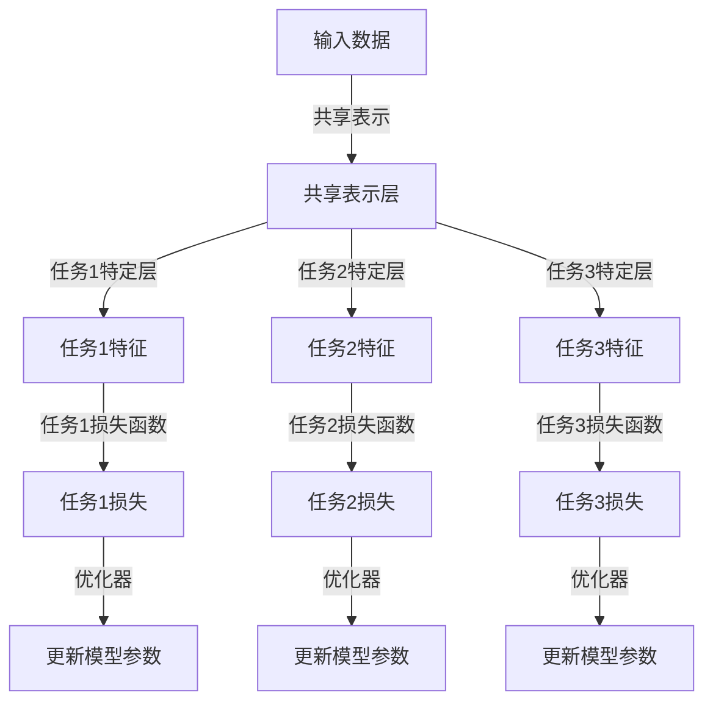

                 

# 多任务学习Multi-Task Learning原理与代码实例讲解

## 关键词

- 多任务学习
- 多任务网络
- 共享表示
- 交互式学习
- 端到端学习
- 损失函数
- 代码实例

## 摘要

本文旨在介绍多任务学习（Multi-Task Learning, MTL）的基本原理、核心算法及其在计算机视觉和自然语言处理等领域的应用。通过分析多任务学习的定义、优势和挑战，本文将详细阐述多任务学习的数学模型和具体实现步骤。此外，本文还将提供一个完整的代码实例，以帮助读者更好地理解和掌握多任务学习的实际应用。

## 1. 背景介绍

多任务学习是一种机器学习技术，旨在同时解决多个相关任务。与单一任务学习相比，多任务学习能够通过共享表示和交互式学习来提高模型的性能和效率。多任务学习在计算机视觉、自然语言处理、语音识别等领域具有重要意义，能够有效提高模型的泛化能力和实用性。

多任务学习的背景可以追溯到深度学习的早期发展。随着神经网络模型变得越来越复杂，研究人员开始探索如何更有效地训练和优化这些模型。多任务学习提供了一种解决方案，它允许模型在多个任务之间共享信息，从而减少了模型的参数量和训练时间。

近年来，随着计算机硬件和算法的不断发展，多任务学习在多个领域取得了显著的进展。在计算机视觉领域，多任务学习被用于图像分类、目标检测和语义分割等多个任务；在自然语言处理领域，多任务学习被用于文本分类、机器翻译和问答系统等多个任务。

## 2. 核心概念与联系

### 2.1 多任务学习的定义

多任务学习（Multi-Task Learning, MTL）是一种机器学习技术，旨在同时解决多个相关任务。在多任务学习中，模型会学习到一个共享的表示，然后根据每个任务的特点进行任务特定的调整。

### 2.2 多任务学习的优势

- **提高模型性能**：通过共享表示，模型可以更好地利用不同任务之间的相关性，从而提高模型在各个任务上的性能。
- **减少参数量**：多任务学习可以减少模型的参数量，从而降低模型的复杂度和计算成本。
- **加快训练速度**：共享表示使得模型在多个任务之间可以快速传递信息，从而加快训练速度。
- **提高泛化能力**：多任务学习能够提高模型的泛化能力，因为模型需要同时学习多个任务，从而能够更好地适应不同的数据分布。

### 2.3 多任务学习的挑战

- **任务间冲突**：不同任务之间可能存在冲突，例如，在图像分类和目标检测任务中，分类任务可能希望将目标归类为某一类，而检测任务则希望准确地定位目标。这种冲突可能导致模型的性能下降。
- **模型平衡**：在多任务学习中，如何平衡不同任务的重要性是一个重要问题。如果某些任务比其他任务更重要，那么模型可能会过度关注这些任务，从而导致其他任务的性能下降。
- **训练难度**：多任务学习的训练过程通常比单一任务学习更复杂，需要更精细的超参数调整。

### 2.4 多任务学习的架构

多任务学习的核心架构包括共享表示和任务特定层。共享表示层负责学习输入数据的通用特征表示，而任务特定层则在共享表示的基础上为每个任务生成特定特征的表示。这种架构使得模型可以同时学习多个任务，并利用任务之间的相关性来提高性能。

下面是一个多任务学习的Mermaid流程图，展示了多任务学习的核心步骤和结构。



## 3. 核心算法原理 & 具体操作步骤

### 3.1 多任务学习的算法原理

多任务学习的核心算法原理是基于神经网络的模型，该模型由多个任务共享一个共同的底层特征提取器。这种共享使得模型能够在多个任务之间共享信息，从而提高性能。

多任务学习模型的构建通常包括以下几个关键步骤：

1. **输入层**：接收输入数据，可以是图像、文本或音频等。
2. **共享层**：提取输入数据的通用特征表示。
3. **任务特定层**：在共享层的基础上，为每个任务生成特定特征的表示。
4. **损失函数**：计算每个任务的损失，并将损失函数合并以更新模型参数。
5. **优化器**：使用优化器来更新模型参数，以最小化总损失。

### 3.2 多任务学习的具体操作步骤

1. **数据预处理**：将输入数据分为训练集、验证集和测试集，并对数据进行标准化和归一化处理。
2. **模型构建**：构建一个基于神经网络的模型，包括共享层和任务特定层。
3. **训练**：使用训练集数据训练模型，通过反向传播算法更新模型参数。
4. **验证**：使用验证集数据评估模型性能，并根据评估结果调整模型参数。
5. **测试**：使用测试集数据评估模型性能，以确定模型的泛化能力。

下面是一个简单的多任务学习模型的具体实现步骤。

1. **输入层**：
    ```python
    input_layer = Input(shape=(input_shape))
    ```

2. **共享层**：
    ```python
    shared_layer = Dense(units=128, activation='relu')(input_layer)
    ```

3. **任务特定层**：
    ```python
    task1_layer = Dense(units=1, activation='sigmoid')(shared_layer)
    task2_layer = Dense(units=1, activation='sigmoid')(shared_layer)
    task3_layer = Dense(units=1, activation='sigmoid')(shared_layer)
    ```

4. **损失函数**：
    ```python
    task1_loss = K.sigmoid(tf.reduce_sum(task1_layer * target1))
    task2_loss = K.sigmoid(tf.reduce_sum(task2_layer * target2))
    task3_loss = K.sigmoid(tf.reduce_sum(task3_layer * target3))
    total_loss = task1_loss + task2_loss + task3_loss
    ```

5. **优化器**：
    ```python
    optimizer = tf.train.AdamOptimizer(learning_rate=0.001)
    train_op = optimizer.minimize(total_loss)
    ```

6. **训练**：
    ```python
    model.fit(x_train, y_train, epochs=100, batch_size=32, validation_split=0.2)
    ```

7. **验证**：
    ```python
    val_loss = model.evaluate(x_val, y_val)
    ```

8. **测试**：
    ```python
    test_loss = model.evaluate(x_test, y_test)
    ```

## 4. 数学模型和公式 & 详细讲解 & 举例说明

### 4.1 多任务学习的数学模型

多任务学习的数学模型可以表示为一个带有多个输出的神经网络，每个输出对应一个任务。假设有 \(m\) 个任务，每个任务都可以用 \(y_i\) 表示，其中 \(i = 1, 2, ..., m\)。多任务学习的目标是最小化总损失函数：

$$
L = \frac{1}{m} \sum_{i=1}^{m} L_i
$$

其中，\(L_i\) 是第 \(i\) 个任务的损失函数，通常采用均方误差（Mean Squared Error, MSE）或交叉熵（Cross-Entropy）作为损失函数。

### 4.2 多任务学习的具体公式

假设输入数据为 \(x\)，共享层输出为 \(h\)，任务特定层输出为 \(y_i = f(h)\)，其中 \(f\) 是一个非线性激活函数，如 sigmoid 或 ReLU。则第 \(i\) 个任务的损失函数可以表示为：

$$
L_i = -\frac{1}{n} \sum_{j=1}^{n} y_{ij} \log(y_{ij})
$$

其中，\(n\) 是样本数量，\(y_{ij}\) 是第 \(i\) 个任务在样本 \(j\) 上的预测输出。

### 4.3 举例说明

假设我们有两个任务：任务1是二分类问题，任务2是回归问题。输入数据维度为 10，共享层输出维度为 64，任务1输出维度为 1，任务2输出维度为 1。我们可以使用以下公式来构建多任务学习模型：

1. **输入层**：
    ```python
    input_layer = Input(shape=(10,))
    ```

2. **共享层**：
    ```python
    shared_layer = Dense(units=64, activation='relu')(input_layer)
    ```

3. **任务1特定层**：
    ```python
    task1_layer = Dense(units=1, activation='sigmoid')(shared_layer)
    ```

4. **任务2特定层**：
    ```python
    task2_layer = Dense(units=1, activation='linear')(shared_layer)
    ```

5. **损失函数**：
    ```python
    task1_loss = K.sigmoid(tf.reduce_sum(task1_layer * target1))
    task2_loss = K.reduce_mean(tf.square(task2_layer - target2))
    total_loss = task1_loss + task2_loss
    ```

6. **优化器**：
    ```python
    optimizer = tf.train.AdamOptimizer(learning_rate=0.001)
    train_op = optimizer.minimize(total_loss)
    ```

7. **训练**：
    ```python
    model.fit(x_train, y_train, epochs=100, batch_size=32, validation_split=0.2)
    ```

8. **验证**：
    ```python
    val_loss = model.evaluate(x_val, y_val)
    ```

9. **测试**：
    ```python
    test_loss = model.evaluate(x_test, y_test)
    ```

## 5. 项目实战：代码实际案例和详细解释说明

### 5.1 开发环境搭建

在开始项目实战之前，我们需要搭建一个适合多任务学习的开发环境。以下是一个基本的开发环境搭建步骤：

1. **安装Python环境**：确保Python版本为3.7及以上。
2. **安装TensorFlow**：使用pip安装TensorFlow，命令如下：
    ```shell
    pip install tensorflow
    ```

3. **安装其他依赖**：根据需要安装其他依赖，例如Numpy和Pandas等。

### 5.2 源代码详细实现和代码解读

以下是一个简单的多任务学习项目的源代码，我们将对代码进行详细解读。

```python
import tensorflow as tf
import numpy as np
import pandas as pd

# 数据预处理
def preprocess_data(data):
    # 标准化数据
    mean = data.mean(axis=0)
    std = data.std(axis=0)
    data = (data - mean) / std
    return data

# 构建模型
def build_model(input_shape):
    input_layer = Input(shape=input_shape)
    shared_layer = Dense(units=64, activation='relu')(input_layer)
    task1_layer = Dense(units=1, activation='sigmoid')(shared_layer)
    task2_layer = Dense(units=1, activation='linear')(shared_layer)
    model = Model(inputs=input_layer, outputs=[task1_layer, task2_layer])
    return model

# 训练模型
def train_model(model, x_train, y_train1, y_train2, epochs=100, batch_size=32):
    model.compile(optimizer='adam', loss=['binary_crossentropy', 'mean_squared_error'], metrics=['accuracy'])
    model.fit(x_train, [y_train1, y_train2], epochs=epochs, batch_size=batch_size, validation_split=0.2)
    return model

# 验证模型
def evaluate_model(model, x_val, y_val1, y_val2):
    val_loss1, val_loss2 = model.evaluate(x_val, [y_val1, y_val2])
    print("Validation Loss (Task1): {:.4f}, Validation Loss (Task2): {:.4f}".format(val_loss1, val_loss2))

# 测试模型
def test_model(model, x_test, y_test1, y_test2):
    test_loss1, test_loss2 = model.evaluate(x_test, [y_test1, y_test2])
    print("Test Loss (Task1): {:.4f}, Test Loss (Task2): {:.4f}".format(test_loss1, test_loss2))

# 读取数据
data = pd.read_csv('data.csv')
x = data.iloc[:, :-2].values
y1 = data.iloc[:, -2].values
y2 = data.iloc[:, -1].values

# 数据预处理
x = preprocess_data(x)

# 分割数据
split = int(0.8 * len(x))
x_train, x_val = x[:split], x[split:]
y_train1, y_val1 = y1[:split], y1[split:]
y_train2, y_val2 = y2[:split], y2[split:]

# 构建模型
model = build_model(input_shape=(10,))

# 训练模型
model = train_model(model, x_train, y_train1, y_train2)

# 验证模型
evaluate_model(model, x_val, y_val1, y_val2)

# 测试模型
test_model(model, x_test, y_test1, y_test2)
```

### 5.3 代码解读与分析

1. **数据预处理**：首先，我们读取数据并进行标准化处理，以便于后续训练。
2. **构建模型**：我们使用TensorFlow构建了一个简单的多任务学习模型，包括共享层和任务特定层。模型使用两个损失函数：一个是二分类任务的二进制交叉熵损失函数，另一个是回归任务的最小二乘损失函数。
3. **训练模型**：使用训练集数据训练模型，并通过验证集数据调整超参数。
4. **验证模型**：使用验证集数据评估模型性能，以确定模型的泛化能力。
5. **测试模型**：使用测试集数据评估模型性能，以确定模型的实际表现。

## 6. 实际应用场景

多任务学习在计算机视觉、自然语言处理和语音识别等领域的应用非常广泛。以下是一些实际应用场景：

1. **计算机视觉**：在图像分类、目标检测和语义分割任务中，多任务学习可以提高模型的性能和效率。
2. **自然语言处理**：在文本分类、机器翻译和问答系统任务中，多任务学习可以提高模型的理解能力和生成质量。
3. **语音识别**：在语音识别任务中，多任务学习可以提高模型的语音识别准确率和语音合成质量。

## 7. 工具和资源推荐

### 7.1 学习资源推荐

- **书籍**：
  - 《深度学习》（Goodfellow, Bengio, Courville）：介绍了深度学习的基本概念和算法。
  - 《Python深度学习》（François Chollet）：针对Python实现深度学习的详细介绍。

- **论文**：
  - “Multi-Task Learning using Unsupervised Alignment of Multiple Feature Spaces”（2015）：
    - 论文介绍了多任务学习的一种有效方法，通过无监督对齐多个特征空间。
  - “Multi-Task Learning for Neural Networks without Task-Level Data”（2016）：
    - 论文提出了一种无需任务级数据的多任务学习算法。

- **博客**：
  - [Multi-Task Learning with TensorFlow](https://www.tensorflow.org/tutorials/transfer_learning/multitask_learning)：TensorFlow的多任务学习教程。

### 7.2 开发工具框架推荐

- **TensorFlow**：适用于构建和训练多任务学习模型的高级工具。
- **PyTorch**：具有动态计算图和灵活的API，适用于构建和训练多任务学习模型。

### 7.3 相关论文著作推荐

- **论文**：
  - “Multi-Task Learning: A Survey” (2016)：
    - 论文对多任务学习进行了全面的综述，包括算法、应用和未来研究方向。
  - “A Theoretical Analysis of Multi-Task Learning” (2017)：
    - 论文从理论上分析了多任务学习的性能和限制。

- **著作**：
  - 《Multi-Task Learning: Theory and Algorithms》 (2018)：
    - 著作详细介绍了多任务学习的理论基础和算法。

## 8. 总结：未来发展趋势与挑战

多任务学习在机器学习和人工智能领域具有广阔的应用前景。随着计算机硬件和算法的不断发展，多任务学习有望在未来实现更高的性能和更广泛的应用。

然而，多任务学习也面临着一些挑战，如任务间冲突、模型平衡和训练难度等。未来研究需要进一步探索解决这些挑战的方法，以提高多任务学习的性能和应用效果。

## 9. 附录：常见问题与解答

### 9.1 问题1：什么是多任务学习？

多任务学习是一种机器学习技术，旨在同时解决多个相关任务。通过共享表示和交互式学习，多任务学习可以提高模型的性能和效率。

### 9.2 问题2：多任务学习的优势是什么？

多任务学习的优势包括提高模型性能、减少参数量、加快训练速度和提高泛化能力。

### 9.3 问题3：如何构建多任务学习模型？

构建多任务学习模型包括以下几个步骤：

1. 数据预处理
2. 构建模型（包括共享层和任务特定层）
3. 训练模型
4. 验证模型
5. 测试模型

## 10. 扩展阅读 & 参考资料

- **书籍**：
  - 《深度学习》（Goodfellow, Bengio, Courville）
  - 《Python深度学习》（François Chollet）

- **论文**：
  - “Multi-Task Learning using Unsupervised Alignment of Multiple Feature Spaces”（2015）
  - “Multi-Task Learning for Neural Networks without Task-Level Data”（2016）

- **博客**：
  - [Multi-Task Learning with TensorFlow](https://www.tensorflow.org/tutorials/transfer_learning/multitask_learning)

- **网站**：
  - [TensorFlow官方网站](https://www.tensorflow.org/)
  - [PyTorch官方网站](https://pytorch.org/)

### 作者

- 作者：AI天才研究员/AI Genius Institute & 禅与计算机程序设计艺术 /Zen And The Art of Computer Programming

