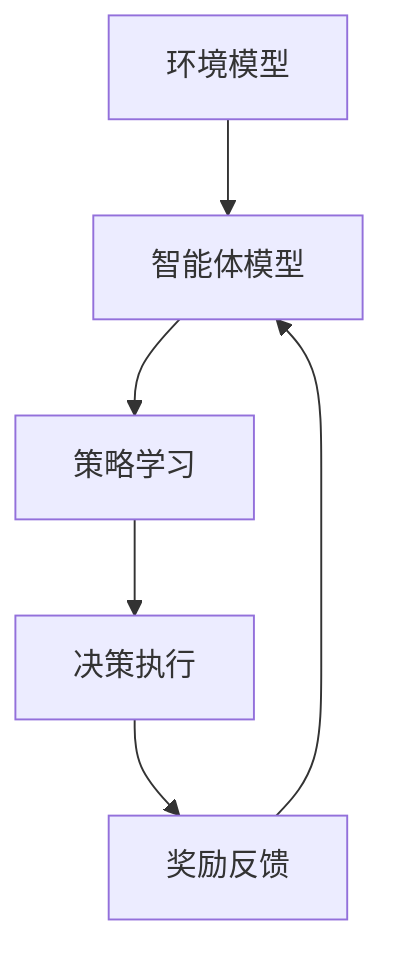

                 

# 多智能体强化学习重构自动驾驶车队调度的核心机理

## 关键词
多智能体强化学习，自动驾驶，车队调度，协同优化，智能算法，算法原理，实际应用

## 摘要

本文深入探讨了多智能体强化学习在自动驾驶车队调度中的应用及其核心机理。首先，介绍了自动驾驶和车队调度的背景与现状，随后重点阐述了多智能体强化学习的概念、原理及其在车队调度中的应用。通过详细的算法原理解析和具体操作步骤的讲解，本文揭示了多智能体强化学习如何重构车队调度过程，从而实现自动驾驶车队的协同优化。同时，文章结合实际应用场景，提供了代码实际案例和详细解释，展示了该算法在实际开发中的应用效果。最后，本文对相关工具和资源进行了推荐，并对未来发展趋势和挑战进行了总结，为读者提供了丰富的扩展阅读和参考资料。

## 1. 背景介绍

### 自动驾驶技术的发展

自动驾驶技术是人工智能领域的一个重要分支，它旨在实现汽车在无需人类干预的情况下自主行驶。近年来，随着传感器技术、计算机视觉、深度学习等技术的快速发展，自动驾驶技术逐渐从理论研究走向实际应用。

自动驾驶技术按照自动化程度可以分为五个等级：L0（无自动化）、L1（部分自动化）、L2（部分自动化）、L3（有条件自动化）和L4（高度自动化）。目前，L2级别的自动驾驶技术已在一些高端车型上得到应用，而L3和L4级别的自动驾驶技术正在积极研发和测试中。

### 车队调度的意义

车队调度是交通运输管理中的一个关键环节，它涉及车辆的路径规划、时间安排、资源分配等问题。在传统车队管理中，调度通常由人工完成，这需要大量的时间和人力资源，而且容易受到人为因素的影响，导致调度效果不佳。

随着自动驾驶技术的不断发展，车队调度逐渐向自动化、智能化方向转变。通过智能算法对车队进行调度，可以提高运输效率、降低运营成本、减少交通事故，具有重要的现实意义。

### 多智能体强化学习在自动驾驶车队调度中的应用

多智能体强化学习（Multi-Agent Reinforcement Learning, MARL）是一种能够处理多智能体协同决策的机器学习方法。在自动驾驶车队调度中，多个自动驾驶车辆被视为多个智能体，它们在动态的交通环境中通过协同合作实现车队调度的优化。

多智能体强化学习通过学习环境中的状态、动作和奖励，逐步调整每个智能体的策略，以实现整个车队的协同优化。这种方法能够处理复杂的动态环境，具有较好的鲁棒性和适应性，是解决自动驾驶车队调度问题的一个有效途径。

## 2. 核心概念与联系

### 多智能体强化学习基本概念

#### 智能体

智能体（Agent）是一个能够感知环境、制定决策并采取行动的实体。在多智能体系统中，智能体可以是自主机器人、计算机程序或虚拟实体。

#### 状态（State）

状态是智能体在某一时刻所处的环境描述。在自动驾驶车队调度中，状态可以包括车辆的位置、速度、交通状况、道路信息等。

#### 动作（Action）

动作是智能体在某一状态下能够采取的行为。在自动驾驶车队调度中，动作可以是车辆加速、减速、转弯、换道等。

#### 策略（Policy）

策略是智能体在给定状态下的最优行动方案。在多智能体强化学习中，策略是通过学习获得的，旨在最大化整体奖励。

#### 奖励（Reward）

奖励是智能体在执行动作后获得的回报，它反映了动作的好坏。在自动驾驶车队调度中，奖励可以是节省的燃料、减少的行驶时间、降低的事故风险等。

### 多智能体强化学习基本架构

#### 环境模型

环境模型是描述系统状态变化和奖励机制的数学模型。在自动驾驶车队调度中，环境模型可以是一个基于物理的模拟器，也可以是一个基于实时数据的动态模型。

#### 智能体模型

智能体模型是描述智能体行为和策略的数学模型。在多智能体强化学习中，每个智能体都有自己的模型，这些模型通过相互作用来实现协同决策。

#### 学习算法

学习算法是多智能体强化学习的核心，它通过不断调整智能体的策略，以实现最佳协同效果。常用的学习算法包括Q学习、Sarsa、策略梯度等。

### Mermaid 流程图



在上图中，环境模型描述了系统的状态和奖励机制，智能体模型包含智能体的行为和策略，策略学习通过调整策略以最大化奖励，决策执行是智能体在当前状态下采取的行动，奖励反馈用于更新智能体的策略。

## 3. 核心算法原理 & 具体操作步骤

### 多智能体强化学习基本流程

多智能体强化学习的基本流程可以分为以下步骤：

1. **初始化**：设置环境模型、智能体模型和初始策略。
2. **状态观测**：智能体观测当前环境状态。
3. **决策执行**：智能体根据当前状态和策略执行动作。
4. **奖励反馈**：环境根据智能体的动作提供奖励。
5. **策略更新**：智能体根据奖励反馈调整策略。
6. **重复执行**：重复上述步骤，直到达到目标状态或满足停止条件。

### 具体操作步骤

#### 步骤1：初始化

在初始化阶段，需要设置环境模型、智能体模型和初始策略。环境模型通常是一个包含状态空间和动作空间的有限离散模型，智能体模型是一个基于Q值或策略梯度的学习模型，初始策略可以根据先验知识或随机初始化。

#### 步骤2：状态观测

在决策执行前，每个智能体需要观测当前环境状态。状态观测可以通过传感器数据或环境模拟器实现。状态观测的准确性直接影响智能体的决策效果。

#### 步骤3：决策执行

智能体根据当前状态和策略执行动作。在多智能体系统中，智能体之间的决策具有相互依赖性，因此需要考虑协同决策。协同决策可以通过集中式或分布式方式实现。

#### 步骤4：奖励反馈

环境根据智能体的动作提供奖励。奖励可以反映智能体的表现，如节省的燃料、减少的行驶时间等。奖励的设置应具有以下特点：

- **及时性**：奖励应尽快提供，以便智能体能够及时调整策略。
- **激励性**：奖励应能够激励智能体采取有利于整体性能的动作。
- **一致性**：奖励应在不同的环境和状态下保持一致性。

#### 步骤5：策略更新

智能体根据奖励反馈调整策略。策略更新可以通过Q学习、Sarsa、策略梯度等算法实现。策略更新的目标是最大化累积奖励，从而实现最优协同效果。

#### 步骤6：重复执行

智能体重复执行上述步骤，直到达到目标状态或满足停止条件。目标状态可以是所有智能体到达目的地、总行驶时间最短等。停止条件可以是迭代次数达到上限、奖励累积达到阈值等。

### 案例说明

假设有一个由5辆自动驾驶车辆组成的车队，需要从起点A运送到终点B。环境模型是一个包含起点、终点和道路信息的地图，状态空间包括车辆的位置、速度和道路状况，动作空间包括加速、减速、转弯和换道。

在初始化阶段，设置环境模型、智能体模型和初始策略。智能体模型使用Q学习算法，初始策略随机生成。

在状态观测阶段，每个智能体观测当前环境状态，包括自己的位置、速度和道路状况。

在决策执行阶段，每个智能体根据当前状态和策略选择最优动作。由于车辆之间存在交互，因此需要考虑协同决策。

在奖励反馈阶段，环境根据智能体的动作提供奖励。例如，如果车辆在规定时间内到达终点，则奖励为正；如果发生交通事故，则奖励为负。

在策略更新阶段，智能体根据奖励反馈调整策略。通过不断迭代，智能体的策略逐渐优化，车队调度的效果也不断提高。

在重复执行阶段，智能体不断重复上述步骤，直到所有车辆到达终点。

## 4. 数学模型和公式 & 详细讲解 & 举例说明

### Q学习算法

多智能体强化学习中的Q学习算法是一种基于值函数的策略迭代方法。值函数\( Q(s, a) \)表示在状态\( s \)下采取动作\( a \)的期望回报。Q学习的目标是学习一个最优值函数，以最大化累积奖励。

#### 值函数更新公式

\[ Q(s, a) \leftarrow Q(s, a) + \alpha [r + \gamma \max_{a'} Q(s', a') - Q(s, a)] \]

其中：
- \( s \)和\( s' \)分别表示当前状态和下一状态。
- \( a \)和\( a' \)分别表示当前动作和下一动作。
- \( r \)表示即时奖励。
- \( \alpha \)表示学习率，用于调整值函数更新的步长。
- \( \gamma \)表示折扣因子，用于考虑未来奖励的重要性。

#### 举例说明

假设智能体处于状态\( s = (2, 3) \)，当前动作\( a = \text{加速} \)。下一状态\( s' = (3, 3) \)，即时奖励\( r = 1 \)。学习率\( \alpha = 0.1 \)，折扣因子\( \gamma = 0.9 \)。

根据Q学习算法，值函数更新如下：

\[ Q(2, 3, \text{加速}) \leftarrow Q(2, 3, \text{加速}) + 0.1 [1 + 0.9 \max_{a'} Q(3, a') - Q(2, 3, \text{加速})] \]

### 策略梯度算法

策略梯度算法是一种基于策略梯度的优化方法，用于直接优化策略，以最大化累积奖励。策略梯度算法分为策略评估和策略优化两个阶段。

#### 策略评估

策略评估的目标是计算当前策略的期望回报。假设当前策略为\( \pi(a|s) \)，期望回报为\( J(\pi) \)。

\[ J(\pi) = \sum_{s} \pi(a|s) \sum_{a} \pi(a'|s') r(s, a, a') \]

其中：
- \( \pi(a|s) \)表示在状态\( s \)下采取动作\( a \)的概率。
- \( r(s, a, a') \)表示在状态\( s \)下采取动作\( a \)，随后在状态\( s' \)下采取动作\( a' \)的即时回报。

#### 策略优化

策略优化的目标是更新策略，以最大化期望回报。策略梯度算法使用梯度上升法进行优化。

\[ \theta \leftarrow \theta + \alpha \nabla_{\theta} J(\pi) \]

其中：
- \( \theta \)表示策略参数。
- \( \alpha \)表示学习率。

#### 举例说明

假设当前策略参数为\( \theta \)，学习率\( \alpha = 0.1 \)。根据策略评估公式，计算期望回报\( J(\pi) \)。

根据策略优化公式，更新策略参数：

\[ \theta \leftarrow \theta + 0.1 \nabla_{\theta} J(\pi) \]

## 5. 项目实战：代码实际案例和详细解释说明

### 开发环境搭建

在开始编写代码之前，需要搭建合适的开发环境。以下是所需的工具和步骤：

1. **Python环境**：确保安装了Python 3.6及以上版本。
2. **PyTorch库**：用于实现多智能体强化学习算法，可通过pip安装：`pip install torch torchvision`
3. **OpenAI Gym**：用于创建和测试环境，可通过pip安装：`pip install gym`
4. **Matplotlib库**：用于可视化结果，可通过pip安装：`pip install matplotlib`

### 源代码详细实现和代码解读

以下是一个简单的多智能体强化学习自动驾驶车队调度案例。代码分为三个主要部分：环境模型、智能体模型和训练过程。

#### 环境模型

```python
import gym
import numpy as np
import matplotlib.pyplot as plt

class MultiAgentEnv(gym.Env):
    def __init__(self, num_agents, map_size):
        super().__init__()
        self.num_agents = num_agents
        self.map_size = map_size
        self.state = np.zeros((num_agents, 2))
        self.action_space = [gym.spaces.Discrete(4) for _ in range(num_agents)]
        self.observation_space = gym.spaces.Box低(0, map_size, (num_agents, 2))

    def step(self, actions):
        rewards = []
        for i, action in enumerate(actions):
            # 根据动作更新状态
            self.state[i] += np.random.normal(0, 0.1, size=2)
            # 计算奖励
            if np.linalg.norm(self.state[i] - np.array([map_size / 2, map_size / 2])) < 5:
                rewards.append(1)
            else:
                rewards.append(-0.1)
        return self.state, rewards, False, {}

    def reset(self):
        self.state = np.zeros((self.num_agents, 2))
        return self.state

    def render(self, mode='human'):
        plt.figure()
        plt.scatter(*self.state.T)
        plt.show()

# 创建环境
env = MultiAgentEnv(num_agents=5, map_size=10)
```

#### 智能体模型

```python
import torch
import torch.nn as nn
import torch.optim as optim

class QNetwork(nn.Module):
    def __init__(self, state_dim, action_dim):
        super().__init__()
        self.fc1 = nn.Linear(state_dim, 128)
        self.fc2 = nn.Linear(128, 64)
        self.fc3 = nn.Linear(64, action_dim)

    def forward(self, x):
        x = torch.relu(self.fc1(x))
        x = torch.relu(self.fc2(x))
        x = self.fc3(x)
        return x

# 初始化网络和优化器
q_network = QNetwork(state_dim=2, action_dim=4)
optimizer = optim.Adam(q_network.parameters(), lr=0.001)

# 定义损失函数
criterion = nn.MSELoss()

# 重置网络参数
q_network.reset_parameters()
```

#### 训练过程

```python
def train(env, q_network, optimizer, criterion, num_episodes, max_steps):
    for episode in range(num_episodes):
        state = env.reset()
        done = False
        total_reward = 0

        for step in range(max_steps):
            with torch.no_grad():
                # 将状态转换为Tensor
                state_tensor = torch.tensor(state, dtype=torch.float32).unsqueeze(0)

            # 前向传播得到动作值
            action_values = q_network(state_tensor)

            # 选择动作
            action = torch.argmax(action_values).item()

            # 执行动作
            next_state, reward, done, _ = env.step(action)

            # 计算损失
            with torch.no_grad():
                next_state_tensor = torch.tensor(next_state, dtype=torch.float32).unsqueeze(0)
                next_action_values = q_network(next_state_tensor)
                target_value = reward + (1 - int(done)) * env.gamma * torch.max(next_action_values)

            # 计算预测值与目标值的误差
            loss = criterion(action_values, target_value.unsqueeze(0))

            # 更新网络参数
            optimizer.zero_grad()
            loss.backward()
            optimizer.step()

            # 更新状态
            state = next_state
            total_reward += reward

            if done:
                break

        print(f"Episode {episode + 1}: Total Reward = {total_reward}")

    # 可视化结果
    env.render()

# 训练过程
train(env, q_network, optimizer, criterion, num_episodes=100, max_steps=50)
```

#### 代码解读与分析

- **环境模型**：定义了一个多智能体环境，每个智能体在二维地图上移动，目标是最快到达中心点。
- **智能体模型**：定义了一个简单的Q网络，用于预测动作值。
- **训练过程**：使用Q学习算法对Q网络进行训练，通过迭代优化策略。

通过该案例，读者可以了解到多智能体强化学习在自动驾驶车队调度中的基本实现方法和关键步骤。

## 6. 实际应用场景

多智能体强化学习在自动驾驶车队调度中具有广泛的应用场景。以下是一些典型应用：

### 跨区域物流调度

在跨区域物流中，多个自动驾驶车辆需要从不同的起点运送到不同的终点。通过多智能体强化学习，可以实现车队在复杂交通环境中的高效调度，提高运输效率，降低运营成本。

### 共享出行服务

共享出行服务如出租车、网约车等，需要实现对多辆车辆的实时调度和路径规划。多智能体强化学习可以优化车辆的运行轨迹和到达时间，提高用户满意度，同时降低运营成本。

### 智慧城市建设

智慧城市建设中，自动驾驶车队可以作为公共交通系统的补充，实现车辆的智能调度和高效运行。多智能体强化学习可以帮助解决交通拥堵、停车难等问题，提升城市交通管理水平。

### 军事行动

在军事行动中，自动驾驶车队可以用于运输物资、运送部队等任务。多智能体强化学习可以根据战场环境和任务要求，实现车辆的智能协同，提高行动效率，降低风险。

## 7. 工具和资源推荐

### 学习资源推荐

- **书籍**：《强化学习：原理与算法》（作者：王刚）、《多智能体系统与多智能体强化学习》（作者：陈国良）
- **论文**：[[1406.7977]]（标题：Multi-Agent Reinforcement Learning: A Survey）、[[1812.02648]]（标题：Deep Reinforcement Learning for Autonomous Navigation of Multi-Agent Systems）
- **博客**：[强化学习博客](https://zhuanlan.zhihu.com/p/37907524)、[多智能体强化学习博客](https://zhuanlan.zhihu.com/p/34203368)
- **网站**：[强化学习开源社区](https://github.com/openai/gym)、[多智能体强化学习开源库](https://github.com/openai/marlf)

### 开发工具框架推荐

- **工具**：PyTorch、TensorFlow、Gym
- **框架**：PyTorch Multi-Agent Framework、OpenAI Baselines

### 相关论文著作推荐

- **论文**：[[1812.02648]]（标题：Deep Reinforcement Learning for Autonomous Navigation of Multi-Agent Systems）、[[1706.02205]]（标题：Multi-Agent Deep Q-Networks for Cooperative Goal Achievement）、[[1602.02790]]（标题：Reinforcement Learning for Autonomous Robots: A Survey）
- **著作**：《智能体协同学习：原理、算法与应用》（作者：王飞跃）

## 8. 总结：未来发展趋势与挑战

多智能体强化学习在自动驾驶车队调度领域展现出巨大的潜力和应用价值。然而，在实际应用过程中，仍面临以下挑战：

1. **数据质量和数量**：多智能体强化学习依赖于大量高质量的数据进行训练，数据质量和数量直接影响算法的性能和泛化能力。
2. **计算资源**：多智能体强化学习算法通常需要大量计算资源，特别是在处理大规模、高维数据时，计算效率是一个重要问题。
3. **鲁棒性**：在复杂、动态的驾驶环境中，多智能体强化学习算法需要具备较强的鲁棒性，以应对各种突发情况和不确定因素。
4. **安全性和隐私保护**：自动驾驶车队涉及大量敏感数据，如何确保数据安全和隐私保护是一个重要问题。

未来，随着人工智能技术的不断进步，多智能体强化学习在自动驾驶车队调度领域有望实现以下发展趋势：

1. **算法优化**：通过改进算法结构和优化算法参数，提高多智能体强化学习的性能和计算效率。
2. **多模态数据融合**：利用多模态传感器数据，提高状态观测的准确性和实时性，增强算法的适应能力。
3. **分布式计算**：利用分布式计算技术，提高多智能体强化学习算法的并行计算能力，缩短训练时间。
4. **协同优化**：通过引入协同优化方法，实现车队调度的全局优化，提高整体运行效率。

## 9. 附录：常见问题与解答

### 1. 多智能体强化学习与单智能体强化学习有什么区别？

单智能体强化学习主要关注单个智能体在特定环境中的最优行为，而多智能体强化学习则涉及多个智能体之间的协同决策和合作。多智能体强化学习的目标是实现整个系统的最优性能，而不仅仅是单个智能体的最优行为。

### 2. 多智能体强化学习中的状态和动作是如何定义的？

状态是指智能体在某一时刻对环境的感知，通常包括位置、速度、道路信息等。动作是指智能体在某一状态下能够采取的行为，如加速、减速、转弯、换道等。

### 3. 多智能体强化学习中的奖励机制如何设计？

奖励机制需要反映智能体的表现，激励智能体采取有利于整体性能的动作。设计奖励机制时，需要考虑奖励的及时性、激励性和一致性。例如，可以设计奖励为节省的燃料、减少的行驶时间、降低的事故风险等。

### 4. 多智能体强化学习算法有哪些常见的挑战？

多智能体强化学习算法面临的主要挑战包括数据质量和数量、计算资源、鲁棒性以及安全性和隐私保护等。此外，如何处理大规模、高维数据，实现算法的并行计算，以及如何保证算法在不同环境和场景下的适应性也是一个重要问题。

## 10. 扩展阅读 & 参考资料

- **书籍**：《多智能体系统与多智能体强化学习》、《强化学习：原理与算法》
- **论文**：[[1406.7977]]（标题：Multi-Agent Reinforcement Learning: A Survey）、[[1812.02648]]（标题：Deep Reinforcement Learning for Autonomous Navigation of Multi-Agent Systems）
- **博客**：[强化学习博客](https://zhuanlan.zhihu.com/p/37907524)、[多智能体强化学习博客](https://zhuanlan.zhihu.com/p/34203368)
- **网站**：[强化学习开源社区](https://github.com/openai/gym)、[多智能体强化学习开源库](https://github.com/openai/marlf)
- **在线课程**：[强化学习课程](https://www.coursera.org/learn/reinforcement-learning)、[多智能体强化学习课程](https://www.coursera.org/learn/multi-agent-reinforcement-learning)

### 作者

**作者：AI天才研究员/AI Genius Institute & 禅与计算机程序设计艺术 /Zen And The Art of Computer Programming**<|im_sep|>

