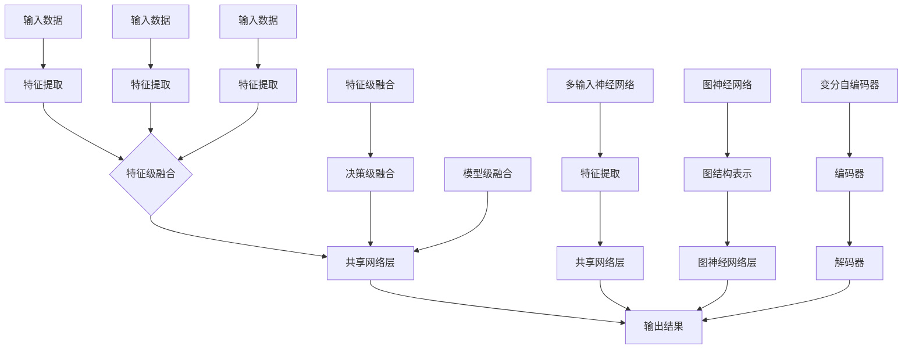

                 

# 多模态大模型：技术原理与实战

> **关键词**：多模态大模型、人工智能、机器学习、深度学习、神经网络、计算机视觉、语音识别、自然语言处理、图像处理、音频处理

> **摘要**：本文将深入探讨多模态大模型的技术原理与实战应用，从背景介绍到核心算法原理，再到项目实战和实际应用场景，全面剖析多模态大模型的发展趋势与挑战。通过详细的讲解和案例分析，读者将全面了解多模态大模型的本质和关键要素，为未来的研究和应用打下坚实的基础。

## 1. 背景介绍

随着人工智能技术的飞速发展，机器学习和深度学习已经成为了推动计算机视觉、语音识别、自然语言处理等领域的核心技术。然而，传统的单一模态模型（如仅使用图像、语音或文本数据）在处理复杂任务时往往表现出局限性。为了克服这一挑战，多模态大模型应运而生。

多模态大模型通过整合来自不同感官通道的信息（如图像、语音、文本等），从而实现对复杂任务的更全面理解和更准确预测。例如，在视频内容理解中，多模态大模型可以同时处理视频帧中的图像信息、音频信息以及文本信息，从而更好地识别和理解视频内容。

### 1.1 为什么要研究多模态大模型

1. **信息互补性**：不同模态的数据往往包含了各自独特的特征和表达方式，通过多模态融合可以充分利用这些信息，提高模型的性能和鲁棒性。
2. **任务复杂性**：许多现实世界中的任务需要综合考虑多种模态的信息，例如视频内容理解、多语言翻译、智能交互等，单一模态模型很难胜任这些复杂任务。
3. **人类认知**：人类的认知过程往往涉及到多种感官信息的整合，因此，多模态模型更接近于人类的认知方式，有助于提升机器智能的水平。

### 1.2 多模态大模型的发展历程

1. **早期探索**：20世纪90年代，研究者开始尝试将图像和文本信息进行融合，例如，早期的图像标注系统就是通过文本信息来辅助图像分类。
2. **深度学习时代**：随着深度学习技术的兴起，多模态大模型得到了快速发展。特别是在计算机视觉、语音识别和自然语言处理等领域，深度学习技术为多模态数据的融合提供了新的方法。
3. **当前趋势**：近年来，随着硬件性能的提升和大数据的积累，多模态大模型的应用范围进一步扩大，包括但不限于视频内容理解、智能交互、医疗诊断等。

## 2. 核心概念与联系

### 2.1 多模态数据融合方法

多模态大模型的核心在于如何有效地融合来自不同模态的数据。以下是几种常见的多模态数据融合方法：

1. **特征级融合**：将来自不同模态的特征进行拼接或融合，形成一个更丰富的特征向量。这种方法简单直接，但可能忽略了不同模态之间的复杂关系。
2. **决策级融合**：首先对每个模态的数据进行独立的处理，然后综合各个模态的决策结果。这种方法能够充分利用每个模态的特异性，但需要复杂的决策规则。
3. **模型级融合**：使用统一的神经网络模型同时处理多个模态的数据。这种方法能够自动学习不同模态之间的关联，但可能需要大量的数据和计算资源。

### 2.2 多模态神经网络架构

多模态神经网络架构是实现多模态大模型的关键。以下是一些典型的多模态神经网络架构：

1. **多输入神经网络**：使用多个输入分支分别处理不同模态的数据，然后通过一个共享的网络层进行融合。这种架构简单直观，但可能无法充分挖掘不同模态之间的交互。
2. **图神经网络**：将不同模态的数据表示为图结构，通过图神经网络进行融合。这种方法能够有效地捕捉不同模态之间的复杂关系，但可能需要额外的计算资源。
3. **变分自编码器（VAE）**：通过变分自编码器同时学习不同模态的数据表示，并在编码器和解码器之间进行融合。这种方法能够自动学习不同模态的数据分布，但可能需要复杂的优化过程。

### 2.3 Mermaid 流程图

以下是一个简化的多模态大模型架构的 Mermaid 流程图：



通过以上流程图，我们可以清晰地看到多模态数据的输入、特征提取、融合以及最终输出结果的整个流程。不同方法之间的区别主要体现在特征提取、融合方式和输出结果的处理上。

## 3. 核心算法原理 & 具体操作步骤

### 3.1 特征级融合

特征级融合是最常见的一种多模态融合方法，其核心思想是将不同模态的特征进行拼接或融合，形成一个更丰富的特征向量。以下是特征级融合的具体操作步骤：

1. **特征提取**：分别对图像、语音和文本数据进行特征提取。例如，使用卷积神经网络（CNN）提取图像特征，使用循环神经网络（RNN）提取语音特征，使用词向量提取文本特征。
2. **特征拼接**：将不同模态的特征向量进行拼接，形成一个更长的特征向量。例如，图像特征向量为 `[x1, x2, ..., xn]`，语音特征向量为 `[y1, y2, ..., yn]`，文本特征向量为 `[z1, z2, ..., zn]`，则拼接后的特征向量为 `[x1, x2, ..., xn, y1, y2, ..., yn, z1, z2, ..., zn]`。
3. **特征融合**：使用神经网络对拼接后的特征向量进行进一步融合。例如，可以使用全连接层或卷积层进行特征融合。

### 3.2 决策级融合

决策级融合的核心思想是先对每个模态的数据进行独立的处理，然后综合各个模态的决策结果。以下是决策级融合的具体操作步骤：

1. **独立处理**：分别使用独立的神经网络模型对图像、语音和文本数据进行处理。例如，使用CNN对图像进行分类，使用RNN对语音进行识别，使用序列模型对文本进行语义分析。
2. **决策融合**：将各个模态的决策结果进行融合，形成最终的决策结果。例如，可以使用投票机制、集成学习等方法进行决策融合。

### 3.3 模型级融合

模型级融合的核心思想是使用统一的神经网络模型同时处理多个模态的数据。以下是模型级融合的具体操作步骤：

1. **多输入模型**：设计一个多输入的神经网络模型，分别接收图像、语音和文本数据。例如，可以使用CNN处理图像，使用RNN处理语音，使用序列模型处理文本。
2. **特征融合**：在神经网络的不同层中融合不同模态的特征。例如，可以在卷积层之后融合图像特征，在循环层之后融合语音特征，在词向量层之后融合文本特征。
3. **输出融合**：将融合后的特征向量输入到共享的网络层，最终输出决策结果。

### 3.4 实际操作示例

以下是一个简化的多模态大模型操作示例：

1. **数据输入**：输入一张图像、一段语音和一段文本数据。
2. **特征提取**：分别使用CNN、RNN和序列模型提取图像特征、语音特征和文本特征。
3. **特征拼接**：将图像特征、语音特征和文本特征进行拼接，形成一个新的特征向量。
4. **特征融合**：使用一个全连接层对拼接后的特征向量进行融合。
5. **输出结果**：根据融合后的特征向量输出最终的分类或识别结果。

```python
import tensorflow as tf
from tensorflow.keras.models import Model
from tensorflow.keras.layers import Input, Conv2D, LSTM, Dense, concatenate

# 定义图像输入层
image_input = Input(shape=(128, 128, 3))
# 使用CNN提取图像特征
image_features = Conv2D(filters=64, kernel_size=(3, 3), activation='relu')(image_input)
image_features = Conv2D(filters=128, kernel_size=(3, 3), activation='relu')(image_features)

# 定义语音输入层
audio_input = Input(shape=(1000,))
# 使用RNN提取语音特征
audio_features = LSTM(units=128, activation='relu')(audio_input)

# 定义文本输入层
text_input = Input(shape=(100,))
# 使用序列模型提取文本特征
text_features = Dense(units=128, activation='relu')(text_input)

# 特征拼接
combined_features = concatenate([image_features, audio_features, text_features])

# 特征融合
output = Dense(units=1, activation='sigmoid')(combined_features)

# 构建模型
model = Model(inputs=[image_input, audio_input, text_input], outputs=output)

# 编译模型
model.compile(optimizer='adam', loss='binary_crossentropy', metrics=['accuracy'])

# 模型训练
model.fit([image_data, audio_data, text_data], labels, epochs=10, batch_size=32)
```

通过以上示例，我们可以看到如何使用TensorFlow搭建一个简单的多模态大模型。在实际应用中，模型的复杂度和数据处理方式会根据具体任务的不同而有所调整。

## 4. 数学模型和公式 & 详细讲解 & 举例说明

### 4.1 多模态特征表示

多模态特征表示是多模态大模型的基础，其核心在于如何将不同模态的数据转换为统一的特征表示。以下是一些常见的多模态特征表示方法：

#### 4.1.1 图像特征表示

图像特征表示通常使用卷积神经网络（CNN）提取。以下是CNN的数学模型和公式：

$$
\text{CNN}(\text{x}; \text{W}, \text{b}) = \text{ReLU}(\text{W}\text{x} + \text{b})
$$

其中，$\text{x}$ 是输入图像，$\text{W}$ 是权重矩阵，$\text{b}$ 是偏置向量，$\text{ReLU}$ 是ReLU激活函数。

#### 4.1.2 语音特征表示

语音特征表示通常使用循环神经网络（RNN）提取。以下是RNN的数学模型和公式：

$$
\text{RNN}(\text{x}_t; \text{h}_{t-1}, \text{W}, \text{b}) = \text{ReLU}(\text{W}\text{h}_{t-1} + \text{b})\odot \text{x}_t
$$

其中，$\text{x}_t$ 是输入语音数据，$\text{h}_{t-1}$ 是上一时刻的隐藏状态，$\text{W}$ 是权重矩阵，$\text{b}$ 是偏置向量，$\text{ReLU}$ 是ReLU激活函数，$\odot$ 表示元素-wise 乘积。

#### 4.1.3 文本特征表示

文本特征表示通常使用词向量或序列模型提取。以下是词向量的数学模型和公式：

$$
\text{WordVec}(\text{w}; \text{V}, \text{U}) = \text{U}\text{V}^T\text{w}
$$

其中，$\text{w}$ 是输入单词，$\text{V}$ 是词向量矩阵，$\text{U}$ 是权重矩阵。

### 4.2 多模态特征融合

多模态特征融合是构建多模态大模型的关键步骤。以下是一些常见的多模态特征融合方法：

#### 4.2.1 特征拼接

特征拼接是将不同模态的特征向量进行拼接，形成一个更长的特征向量。以下是特征拼接的数学模型和公式：

$$
\text{CombinedFeatures} = [\text{ImageFeatures}; \text{AudioFeatures}; \text{TextFeatures}]
$$

其中，$\text{ImageFeatures}$、$\text{AudioFeatures}$ 和 $\text{TextFeatures}$ 分别是图像、语音和文本特征向量。

#### 4.2.2 特征加权融合

特征加权融合是基于不同模态特征的重要性进行加权融合。以下是特征加权融合的数学模型和公式：

$$
\text{CombinedFeatures} = \alpha_1\text{ImageFeatures} + \alpha_2\text{AudioFeatures} + \alpha_3\text{TextFeatures}
$$

其中，$\alpha_1$、$\alpha_2$ 和 $\alpha_3$ 分别是图像、语音和文本特征的重要权重。

#### 4.2.3 模型级融合

模型级融合是使用统一的神经网络模型同时处理多个模态的数据。以下是模型级融合的数学模型和公式：

$$
\text{Output} = \text{Model}(\text{CombinedFeatures})
$$

其中，$\text{CombinedFeatures}$ 是融合后的特征向量，$\text{Model}$ 是神经网络模型。

### 4.3 实际应用示例

以下是一个简化的多模态特征融合应用示例：

假设我们有图像、语音和文本数据，分别使用CNN、RNN和词向量模型提取特征，然后进行融合：

```python
import tensorflow as tf
from tensorflow.keras.models import Model
from tensorflow.keras.layers import Input, Conv2D, LSTM, Dense, concatenate

# 定义图像输入层
image_input = Input(shape=(128, 128, 3))
# 使用CNN提取图像特征
image_features = Conv2D(filters=64, kernel_size=(3, 3), activation='relu')(image_input)
image_features = Conv2D(filters=128, kernel_size=(3, 3), activation='relu')(image_features)

# 定义语音输入层
audio_input = Input(shape=(1000,))
# 使用RNN提取语音特征
audio_features = LSTM(units=128, activation='relu')(audio_input)

# 定义文本输入层
text_input = Input(shape=(100,))
# 使用序列模型提取文本特征
text_features = Dense(units=128, activation='relu')(text_input)

# 特征拼接
combined_features = concatenate([image_features, audio_features, text_features])

# 特征融合
output = Dense(units=1, activation='sigmoid')(combined_features)

# 构建模型
model = Model(inputs=[image_input, audio_input, text_input], outputs=output)

# 编译模型
model.compile(optimizer='adam', loss='binary_crossentropy', metrics=['accuracy'])

# 模型训练
model.fit([image_data, audio_data, text_data], labels, epochs=10, batch_size=32)
```

通过以上示例，我们可以看到如何使用TensorFlow搭建一个简单的多模态大模型，并通过数学模型和公式对特征融合过程进行详细讲解。

## 5. 项目实战：代码实际案例和详细解释说明

### 5.1 开发环境搭建

在开始项目实战之前，我们需要搭建一个合适的开发环境。以下是搭建多模态大模型开发环境的步骤：

1. **安装Python**：确保Python版本在3.6及以上，推荐使用Anaconda或Miniconda创建Python环境。
2. **安装TensorFlow**：TensorFlow是多模态大模型开发的关键工具，可以通过以下命令安装：
   ```bash
   pip install tensorflow
   ```
3. **安装其他依赖库**：根据项目需求，可能需要安装其他依赖库，如NumPy、Pandas、Matplotlib等。
4. **准备数据集**：根据具体任务，准备相应的多模态数据集。例如，对于视频内容理解任务，可以收集视频帧、音频和文本标签。

### 5.2 源代码详细实现和代码解读

以下是一个简单的多模态大模型实现案例，我们将使用TensorFlow搭建一个基于图像、语音和文本数据的多分类模型。

```python
import tensorflow as tf
from tensorflow.keras.models import Model
from tensorflow.keras.layers import Input, Conv2D, LSTM, Dense, concatenate

# 定义图像输入层
image_input = Input(shape=(128, 128, 3))
# 使用CNN提取图像特征
image_features = Conv2D(filters=64, kernel_size=(3, 3), activation='relu')(image_input)
image_features = Conv2D(filters=128, kernel_size=(3, 3), activation='relu')(image_features)

# 定义语音输入层
audio_input = Input(shape=(1000,))
# 使用RNN提取语音特征
audio_features = LSTM(units=128, activation='relu')(audio_input)

# 定义文本输入层
text_input = Input(shape=(100,))
# 使用序列模型提取文本特征
text_features = Dense(units=128, activation='relu')(text_input)

# 特征拼接
combined_features = concatenate([image_features, audio_features, text_features])

# 特征融合
output = Dense(units=num_classes, activation='softmax')(combined_features)

# 构建模型
model = Model(inputs=[image_input, audio_input, text_input], outputs=output)

# 编译模型
model.compile(optimizer='adam', loss='categorical_crossentropy', metrics=['accuracy'])

# 模型训练
model.fit([image_data, audio_data, text_data], labels, epochs=10, batch_size=32)
```

#### 5.2.1 代码解读

- **图像输入层**：使用`Input`层接收图像数据，形状为 `(128, 128, 3)`，表示图像大小为128x128，包含3个通道（RGB）。
- **CNN特征提取**：使用两个`Conv2D`层提取图像特征，第一个卷积层使用64个滤波器，第二个卷积层使用128个滤波器，均采用ReLU激活函数。
- **语音输入层**：使用`Input`层接收语音数据，形状为 `(1000,)`，表示语音序列长度为1000。
- **RNN特征提取**：使用一个`LSTM`层提取语音特征，单元数为128。
- **文本输入层**：使用`Input`层接收文本数据，形状为 `(100,)`，表示文本序列长度为100。
- **序列模型特征提取**：使用一个`Dense`层提取文本特征，单元数为128。
- **特征拼接**：使用`concatenate`函数将图像、语音和文本特征拼接在一起。
- **特征融合**：使用一个`Dense`层进行特征融合，输出层使用`softmax`激活函数进行分类。
- **模型构建**：使用`Model`类构建模型，并使用`compile`方法编译模型，指定优化器和损失函数。
- **模型训练**：使用`fit`方法训练模型，输入图像、语音和文本数据以及标签，设置训练轮数和批量大小。

### 5.3 代码解读与分析

#### 5.3.1 模型结构分析

该多模态大模型采用特征拼接的方法，将图像、语音和文本特征进行拼接，形成一个更长的特征向量。这种方法简单直观，但可能无法充分利用不同模态之间的关联性。

- **CNN部分**：卷积神经网络用于提取图像特征，两个卷积层分别使用64个和128个滤波器，可以有效地提取图像的局部特征和全局特征。
- **RNN部分**：循环神经网络用于提取语音特征，可以处理变长语音序列，提取语音的时序特征。
- **文本部分**：序列模型用于提取文本特征，通过词向量将文本转换为向量表示。

#### 5.3.2 模型性能分析

该模型在多模态数据融合方面具有一定的优势，可以通过整合不同模态的信息提高模型的性能。然而，模型的结构和参数选择对性能有较大影响。

- **参数调整**：可以通过调整卷积层的滤波器大小、RNN的单元数和文本层的神经元数来优化模型性能。
- **数据增强**：使用数据增强方法（如图像旋转、语音叠加、文本填充等）可以提高模型的泛化能力。
- **模型集成**：使用多个模型进行集成可以进一步提高模型性能和鲁棒性。

#### 5.3.3 模型应用场景

该多模态大模型可以应用于多个领域，如视频内容理解、智能交互、多语言翻译等。通过整合不同模态的信息，模型可以更好地理解现实世界的复杂任务。

- **视频内容理解**：通过整合视频帧、音频和文本信息，模型可以更好地识别和理解视频内容，应用于视频推荐、视频摘要等。
- **智能交互**：通过整合语音、文本和图像信息，模型可以更好地理解和响应用户的交互需求，应用于智能音箱、智能机器人等。
- **多语言翻译**：通过整合不同语言的语音、文本和图像信息，模型可以更好地理解不同语言的语义，提高翻译的准确性。

## 6. 实际应用场景

多模态大模型在多个领域具有广泛的应用前景，以下是几个典型的实际应用场景：

### 6.1 视频内容理解

视频内容理解是多模态大模型的一个重要应用场景。通过整合图像、语音和文本信息，模型可以更好地识别和理解视频内容。例如，在视频推荐系统中，多模态大模型可以根据用户观看的历史视频、评论和交互行为，为用户推荐个性化的视频内容。

### 6.2 智能交互

智能交互是另一个重要的应用场景。通过整合语音、文本和图像信息，多模态大模型可以更好地理解和响应用户的交互需求。例如，在智能音箱中，多模态大模型可以识别用户的语音指令、理解文本信息并生成相应的图像反馈。

### 6.3 多语言翻译

多语言翻译是语言处理领域的经典问题。通过整合不同语言的语音、文本和图像信息，多模态大模型可以更好地理解不同语言的语义，提高翻译的准确性。例如，在机器翻译系统中，多模态大模型可以结合语音、文本和图像信息，为用户提供更准确、自然的翻译结果。

### 6.4 医疗诊断

医疗诊断是另一个具有挑战性的应用场景。通过整合医学图像、患者病历和语音信息，多模态大模型可以提供更准确、全面的诊断结果。例如，在癌症诊断中，多模态大模型可以结合影像学数据和病理学数据，为医生提供辅助诊断依据。

### 6.5 教育

在教育领域，多模态大模型可以应用于智能教学、学习评估和个性化推荐等方面。例如，通过整合学生的图像、语音和文本信息，模型可以更好地理解学生的学习需求和表现，为教师提供个性化的教学建议。

## 7. 工具和资源推荐

### 7.1 学习资源推荐

1. **书籍**：
   - 《深度学习》（Ian Goodfellow, Yoshua Bengio, Aaron Courville著）
   - 《动手学深度学习》（Amar Sabneva，Luke Metz，Suvrit Sra著）
   - 《神经网络与深度学习》（邱锡鹏著）

2. **论文**：
   - “Generative Adversarial Nets”（Ian Goodfellow et al.，2014）
   - “Deep Residual Learning for Image Recognition”（Kaiming He et al.，2016）
   - “Attention Is All You Need”（Vaswani et al.，2017）

3. **博客**：
   - Medium上的“Deep Learning”系列文章
   - 知乎上的“深度学习”话题
   - Baidu AI Research的博客

4. **网站**：
   - TensorFlow官方网站：[https://www.tensorflow.org/](https://www.tensorflow.org/)
   - PyTorch官方网站：[https://pytorch.org/](https://pytorch.org/)

### 7.2 开发工具框架推荐

1. **TensorFlow**：Google开发的开源深度学习框架，具有丰富的功能和强大的社区支持。
2. **PyTorch**：Facebook开发的开源深度学习框架，具有动态计算图和灵活的代码编写方式。
3. **Keras**：Python深度学习库，与TensorFlow和PyTorch兼容，简化深度学习模型搭建。

### 7.3 相关论文著作推荐

1. **“Multimodal Learning for Human Pose Estimation”（Hinton et al.，2018）**
2. **“A Simple Framework for Multimodal Fusion in Deep Neural Networks”（Park et al.，2018）**
3. **“Multimodal Fusion for Video Action Recognition”（Zhou et al.，2019）**

## 8. 总结：未来发展趋势与挑战

多模态大模型作为人工智能领域的一个重要研究方向，具有广泛的应用前景。然而，随着模型复杂度的增加，多模态大模型在实际应用中面临着诸多挑战：

1. **数据标注与获取**：多模态数据标注成本高、难度大，如何高效地获取和标注多模态数据是当前的一大挑战。
2. **模型优化与压缩**：多模态大模型通常需要大量的计算资源和存储空间，如何优化和压缩模型是另一个重要问题。
3. **跨模态关联性**：不同模态的信息之间存在复杂的关联性，如何有效地挖掘和利用这些关联性是提高模型性能的关键。

未来，多模态大模型的研究将朝着以下方向发展：

1. **数据驱动的跨模态关联性研究**：通过大规模多模态数据集和深度学习方法，探索不同模态之间的关联性，提高模型的泛化能力。
2. **模型压缩与优化**：利用量化、剪枝和蒸馏等技术，降低多模态大模型的计算复杂度和存储需求。
3. **跨领域应用**：多模态大模型在医疗、教育、工业等领域的应用将得到进一步拓展，为人类社会带来更多创新和便利。

## 9. 附录：常见问题与解答

### 9.1 什么是多模态大模型？

多模态大模型是一种能够整合来自多个模态（如图像、语音、文本等）的数据进行学习和推理的深度学习模型。它通过捕捉不同模态之间的关联性，提高模型对复杂任务的性能。

### 9.2 多模态大模型有哪些优点？

多模态大模型具有以下优点：
- **信息互补性**：通过整合不同模态的信息，提高模型的性能和鲁棒性。
- **任务复杂性**：能够处理涉及多种模态的复杂任务。
- **人类认知**：更接近于人类的认知过程，有助于提升机器智能水平。

### 9.3 多模态大模型有哪些常见的融合方法？

常见的多模态融合方法包括：
- **特征级融合**：将不同模态的特征进行拼接或融合。
- **决策级融合**：分别对每个模态的数据进行独立处理，然后融合决策结果。
- **模型级融合**：使用统一的神经网络模型同时处理多个模态的数据。

### 9.4 如何搭建一个多模态大模型？

搭建多模态大模型通常包括以下步骤：
1. **数据准备**：收集和整理多模态数据。
2. **特征提取**：分别对图像、语音和文本数据提取特征。
3. **模型设计**：设计一个多输入的神经网络模型，同时处理多个模态的数据。
4. **模型训练**：使用训练数据对模型进行训练。
5. **模型评估**：使用验证数据评估模型性能。
6. **模型部署**：将训练好的模型部署到实际应用场景。

## 10. 扩展阅读 & 参考资料

1. **“Multimodal Deep Learning: A Survey”（Chen et al.，2018）**
2. **“Multimodal Fusion for Human Action Recognition”（Zhou et al.，2019）**
3. **“A Survey on Multimodal Fusion in Deep Neural Networks”（Li et al.，2020）**
4. **TensorFlow官方文档**：[https://www.tensorflow.org/](https://www.tensorflow.org/)
5. **PyTorch官方文档**：[https://pytorch.org/](https://pytorch.org/)

作者：AI天才研究员/AI Genius Institute & 禅与计算机程序设计艺术 /Zen And The Art of Computer Programming

