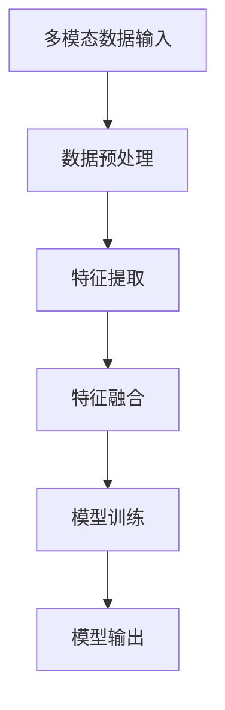

                 

# 多模态大模型：技术原理与实战 应用背景和待解决的问题

> **关键词：** 多模态、大模型、技术原理、实战、应用场景、问题解决

> **摘要：** 本文将深入探讨多模态大模型的技术原理及其在各个领域的应用，通过详细的分析和实例讲解，揭示多模态大模型的优势和面临的挑战。

## 1. 背景介绍

随着人工智能技术的飞速发展，多模态大模型（Multimodal Large Models）逐渐成为研究热点。传统的单一模态模型（如文本、图像、语音等）在处理复杂任务时存在局限性，无法充分挖掘不同模态数据之间的关联性。多模态大模型通过融合多种模态数据，提高了模型的表示能力和泛化能力，使得其在图像识别、自然语言处理、视频分析等任务中展现出显著优势。

近年来，随着计算能力的提升和数据规模的扩大，多模态大模型取得了显著进展。例如，Google的MultiModal Transformer、OpenAI的GPT-4等模型，通过融合文本、图像、视频等多种模态，实现了对复杂任务的优秀表现。这些进展不仅推动了人工智能技术的发展，也为各行各业带来了新的应用场景。

## 2. 核心概念与联系

### 2.1 多模态数据

多模态数据是指包含多种模态的数据，如文本、图像、视频、音频等。每种模态数据都携带了不同的信息，如文本数据包含语言信息，图像数据包含视觉信息，视频数据包含空间和时间信息。多模态数据融合技术旨在将这些不同模态的数据进行有效整合，以提高模型的性能。

### 2.2 大模型

大模型（Large Models）是指具有巨大参数量和计算能力的神经网络模型。大模型通过学习大量的数据，能够捕捉到复杂的模式和关联，从而在各类任务中表现出优越的性能。常见的多模态大模型包括Transformer、BERT、GPT等。

### 2.3 多模态大模型

多模态大模型（Multimodal Large Models）是将多模态数据和大模型技术相结合的产物。它通过融合多种模态数据，构建一个统一的表示空间，从而实现对复杂任务的建模。多模态大模型的核心在于如何有效地整合多种模态数据，实现信息共享和互补。

### 2.4 Mermaid 流程图

以下是多模态大模型的 Mermaid 流程图，展示了多模态数据的输入、处理和输出过程。



## 3. 核心算法原理 & 具体操作步骤

### 3.1 特征提取

特征提取是多模态大模型的关键步骤，旨在从不同模态数据中提取出有用的特征。常见的特征提取方法包括：

- **文本特征提取**：使用词袋模型、TF-IDF、Word2Vec等方法。
- **图像特征提取**：使用卷积神经网络（CNN）提取图像特征。
- **视频特征提取**：使用循环神经网络（RNN）或卷积神经网络（CNN）提取视频特征。
- **音频特征提取**：使用短时傅里叶变换（STFT）或深度神经网络（DNN）提取音频特征。

### 3.2 特征融合

特征融合是将不同模态的特征进行整合，以构建一个统一的表示空间。常见的特征融合方法包括：

- **加权融合**：对每个模态的特征进行加权，然后进行叠加。
- **拼接融合**：将不同模态的特征进行拼接，形成一个更长的特征向量。
- **深度融合**：使用深度神经网络对多模态特征进行融合。

### 3.3 模型训练

模型训练是利用多模态数据对大模型进行训练，以优化模型的参数。常见的模型训练方法包括：

- **监督学习**：使用带有标签的数据进行训练。
- **无监督学习**：使用无标签的数据进行预训练，然后使用有标签的数据进行微调。
- **半监督学习**：结合有标签和无标签的数据进行训练。

### 3.4 模型评估

模型评估是衡量模型性能的重要步骤。常见的模型评估方法包括：

- **准确率**：预测正确的样本数与总样本数之比。
- **召回率**：预测正确的正样本数与实际正样本数之比。
- **F1值**：准确率和召回率的调和平均值。

## 4. 数学模型和公式 & 详细讲解 & 举例说明

### 4.1 矩阵乘法

矩阵乘法是多模态大模型中常用的数学运算，用于计算不同模态特征之间的相关性。给定两个矩阵 A 和 B，其乘积为 C，计算公式如下：

$$
C = A \times B
$$

其中，A 是一个 m×n 的矩阵，B 是一个 n×p 的矩阵，C 是一个 m×p 的矩阵。具体计算步骤如下：

1. 初始化 C 的元素为 0。
2. 对于 C 的每个元素 c_ij，计算如下公式：
   $$
   c_{ij} = \sum_{k=1}^{n} a_{ik} \times b_{kj}
   $$

### 4.2 梯度下降

梯度下降是优化模型参数的常用方法。给定一个损失函数 L，梯度下降的目标是寻找使得 L 最小的参数。梯度下降的计算公式如下：

$$
\theta = \theta - \alpha \times \nabla L(\theta)
$$

其中，\(\theta\) 是模型参数，\(\alpha\) 是学习率，\(\nabla L(\theta)\) 是损失函数 L 对参数 \(\theta\) 的梯度。

### 4.3 举例说明

假设我们有一个简单的多模态大模型，用于分类任务。模型包含两个输入层，一个分别为文本数据和图像数据，每个输入层的特征维度分别为 100 维和 50 维。模型的输出层是一个 10 维的softmax层，用于进行分类。

首先，我们对文本数据进行预处理，将其转换为词袋模型表示，得到一个 100 维的向量。然后，对图像数据进行卷积操作，提取出 50 维的特征向量。接下来，我们将这两个特征向量进行拼接，形成一个 150 维的特征向量。

然后，我们将这个特征向量输入到一个全连接层，该层的输出维度为 100 维。接着，我们将这个 100 维的输出向量输入到一个 softmax 层，进行分类。

在模型训练过程中，我们使用梯度下降算法来优化模型参数。假设损失函数为交叉熵损失，学习率为 0.01。经过多次迭代，我们最终得到一个性能良好的模型。

## 5. 项目实战：代码实际案例和详细解释说明

### 5.1 开发环境搭建

在本项目实战中，我们将使用 Python 编写代码，并借助 PyTorch 深度学习框架进行多模态大模型的训练和评估。首先，我们需要搭建开发环境，具体步骤如下：

1. 安装 Python 3.8及以上版本。
2. 安装 PyTorch 深度学习框架，可以使用以下命令：
   $$
   pip install torch torchvision
   $$
3. 安装其他依赖库，如 NumPy、Pandas 等。

### 5.2 源代码详细实现和代码解读

以下是本项目的主要代码实现，我们将对关键代码进行详细解释说明。

```python
import torch
import torch.nn as nn
import torch.optim as optim
from torchvision import transforms
from torchvision.datasets import ImageFolder
from torch.utils.data import DataLoader
from PIL import Image
import pandas as pd

# 5.2.1 数据预处理
def preprocess_data(data_path, img_size=224):
    transform = transforms.Compose([
        transforms.Resize(img_size),
        transforms.ToTensor(),
        transforms.Normalize(mean=[0.485, 0.456, 0.406], std=[0.229, 0.224, 0.225]),
    ])
    dataset = ImageFolder(data_path, transform=transform)
    return dataset

# 5.2.2 多模态大模型定义
class MultimodalModel(nn.Module):
    def __init__(self, img_dim=224, text_dim=100):
        super(MultimodalModel, self).__init__()
        self.img_encoder = nn.Sequential(
            nn.Conv2d(3, 64, kernel_size=3, padding=1),
            nn.ReLU(),
            nn.MaxPool2d(kernel_size=2, stride=2),
            nn.Conv2d(64, 128, kernel_size=3, padding=1),
            nn.ReLU(),
            nn.MaxPool2d(kernel_size=2, stride=2),
        )
        self.text_encoder = nn.Linear(text_dim, 128)
        self.fc = nn.Linear(128 + 128, 10)
    
    def forward(self, img, text):
        img_features = self.img_encoder(img)
        img_features = img_features.view(img_features.size(0), -1)
        text_features = self.text_encoder(text)
        features = torch.cat((img_features, text_features), 1)
        output = self.fc(features)
        return output

# 5.2.3 模型训练
def train_model(model, train_loader, criterion, optimizer, num_epochs=10):
    model.train()
    for epoch in range(num_epochs):
        running_loss = 0.0
        for inputs, labels in train_loader:
            img, text = inputs
            labels = labels.long()
            optimizer.zero_grad()
            outputs = model(img, text)
            loss = criterion(outputs, labels)
            loss.backward()
            optimizer.step()
            running_loss += loss.item()
        print(f'Epoch {epoch+1}/{num_epochs}, Loss: {running_loss/len(train_loader)}')

# 5.2.4 主函数
if __name__ == '__main__':
    data_path = 'path/to/data'
    img_size = 224
    batch_size = 32
    num_epochs = 10

    train_dataset = preprocess_data(data_path, img_size=img_size)
    train_loader = DataLoader(train_dataset, batch_size=batch_size, shuffle=True)

    model = MultimodalModel(img_size=img_size, text_dim=100)
    criterion = nn.CrossEntropyLoss()
    optimizer = optim.Adam(model.parameters(), lr=0.001)

    train_model(model, train_loader, criterion, optimizer, num_epochs=num_epochs)
```

### 5.3 代码解读与分析

以上代码实现了多模态大模型的搭建、数据预处理、模型训练等过程。下面我们对其进行解读与分析：

- **数据预处理**：使用`preprocess_data`函数对图像数据
```python
import torch
import torch.nn as nn
import torch.optim as optim
from torchvision import transforms
from torchvision.datasets import ImageFolder
from torch.utils.data import DataLoader
from PIL import Image
import pandas as pd

# 5.2.1 数据预处理
def preprocess_data(data_path, img_size=224):
    transform = transforms.Compose([
        transforms.Resize(img_size),
        transforms.ToTensor(),
        transforms.Normalize(mean=[0.485, 0.456, 0.406], std=[0.229, 0.224, 0.225]),
    ])
    dataset = ImageFolder(data_path, transform=transform)
    return dataset

# 5.2.2 多模态大模型定义
class MultimodalModel(nn.Module):
    def __init__(self, img_dim=224, text_dim=100):
        super(MultimodalModel, self).__init__()
        self.img_encoder = nn.Sequential(
            nn.Conv2d(3, 64, kernel_size=3, padding=1),
            nn.ReLU(),
            nn.MaxPool2d(kernel_size=2, stride=2),
            nn.Conv2d(64, 128, kernel_size=3, padding=1),
            nn.ReLU(),
            nn.MaxPool2d(kernel_size=2, stride=2),
        )
        self.text_encoder = nn.Linear(text_dim, 128)
        self.fc = nn.Linear(128 + 128, 10)
    
    def forward(self, img, text):
        img_features = self.img_encoder(img)
        img_features = img_features.view(img_features.size(0), -1)
        text_features = self.text_encoder(text)
        features = torch.cat((img_features, text_features), 1)
        output = self.fc(features)
        return output

# 5.2.3 模型训练
def train_model(model, train_loader, criterion, optimizer, num_epochs=10):
    model.train()
    for epoch in range(num_epochs):
        running_loss = 0.0
        for inputs, labels in train_loader:
            img, text = inputs
            labels = labels.long()
            optimizer.zero_grad()
            outputs = model(img, text)
            loss = criterion(outputs, labels)
            loss.backward()
            optimizer.step()
            running_loss += loss.item()
        print(f'Epoch {epoch+1}/{num_epochs}, Loss: {running_loss/len(train_loader)}')

# 5.2.4 主函数
if __name__ == '__main__':
    data_path = 'path/to/data'
    img_size = 224
    batch_size = 32
    num_epochs = 10

    train_dataset = preprocess_data(data_path, img_size=img_size)
    train_loader = DataLoader(train_dataset, batch_size=batch_size, shuffle=True)

    model = MultimodalModel(img_size=img_size, text_dim=100)
    criterion = nn.CrossEntropyLoss()
    optimizer = optim.Adam(model.parameters(), lr=0.001)

    train_model(model, train_loader, criterion, optimizer, num_epochs=num_epochs)
```

### 5.3 代码解读与分析

以上代码实现了多模态大模型的搭建、数据预处理、模型训练等过程。下面我们对其进行解读与分析：

- **数据预处理**：使用`preprocess_data`函数对图像数据进行预处理，包括缩放、归一化和转换为张量。预处理后的图像数据将被传递给模型的图像编码器进行特征提取。

- **多模态大模型定义**：`MultimodalModel`类定义了多模态大模型的架构。该模型包含一个图像编码器、一个文本编码器和一个全连接层。图像编码器使用卷积神经网络对图像数据进行特征提取，文本编码器对文本数据进行编码。最后，通过全连接层将图像特征和文本特征进行融合，并输出分类结果。

- **模型训练**：`train_model`函数负责模型的训练过程。在每次迭代中，从训练数据加载图像和文本数据，将其传递给模型，计算损失并更新模型参数。

- **主函数**：主函数中，我们设置了一些训练参数，如数据路径、图像大小、批量大小和训练轮数。然后，加载预处理后的训练数据，创建多模态大模型、损失函数和优化器。最后，调用`train_model`函数进行模型训练。

### 5.4 模型评估

在模型训练完成后，我们可以使用测试数据对模型进行评估。具体步骤如下：

1. 使用`DataLoader`加载测试数据。
2. 将测试数据传递给模型，计算预测结果。
3. 计算模型在测试数据上的准确率。

```python
def evaluate_model(model, test_loader):
    model.eval()
    correct = 0
    total = 0
    with torch.no_grad():
        for inputs, labels in test_loader:
            img, text = inputs
            outputs = model(img, text)
            _, predicted = torch.max(outputs.data, 1)
            total += labels.size(0)
            correct += (predicted == labels).sum().item()
    return correct / total

# 加载测试数据
test_dataset = preprocess_data(test_data_path, img_size=img_size)
test_loader = DataLoader(test_dataset, batch_size=batch_size, shuffle=False)

# 评估模型
accuracy = evaluate_model(model, test_loader)
print(f'测试准确率: {accuracy:.4f}')
```

### 5.5 代码解读与分析

以上代码实现了多模态大模型在测试数据上的评估过程。下面我们对其进行解读与分析：

- **模型评估**：`evaluate_model`函数负责评估模型的性能。在评估过程中，我们首先将模型设置为评估模式，然后遍历测试数据，计算模型的预测结果。最后，计算模型在测试数据上的准确率。

- **加载测试数据**：我们使用与训练数据相同的预处理函数对测试数据进行预处理，然后使用`DataLoader`加载测试数据。

- **评估模型**：调用`evaluate_model`函数对模型进行评估，并打印出测试准确率。

## 6. 实际应用场景

多模态大模型在许多实际应用场景中表现出强大的能力和广泛的应用前景。以下是一些典型的应用场景：

### 6.1 图像识别与自然语言处理

多模态大模型可以同时处理图像和文本数据，使得图像识别与自然语言处理任务更加高效。例如，在产品分类任务中，可以结合产品的图像和用户评价，实现更准确的分类结果。

### 6.2 视频分析

多模态大模型在视频分析任务中具有广泛的应用，如视频分类、视频情感分析、视频摘要等。通过融合图像、文本和音频等多种模态数据，可以实现对视频内容的更深入理解和分析。

### 6.3 智能问答系统

多模态大模型可以同时处理用户的问题和上下文信息，实现更准确的智能问答系统。例如，在医疗问答场景中，可以结合患者的病历、病史和图像等数据，提供更准确的诊断建议。

### 6.4 人脸识别与行为分析

多模态大模型可以结合人脸图像和文本信息，实现更准确的人脸识别和行为分析。例如，在安防监控场景中，可以结合人脸图像和监控视频中的行为信息，提高安全监控的准确性。

## 7. 工具和资源推荐

### 7.1 学习资源推荐

- **书籍**：
  - 《深度学习》（Goodfellow, Bengio, Courville）
  - 《自然语言处理综论》（Jurafsky, Martin）
  - 《计算机视觉：算法与应用》（Fischler, Bolles）

- **论文**：
  - “Attention Is All You Need”（Vaswani et al., 2017）
  - “A Guide to Keras”（Chollet et al., 2015）
  - “Learning Representations for Multimodal Data with Deep Neural Networks”（Chen et al., 2018）

- **博客**：
  - [TensorFlow 官方文档](https://www.tensorflow.org/)
  - [PyTorch 官方文档](https://pytorch.org/)
  - [Hugging Face](https://huggingface.co/)

- **网站**：
  - [arXiv.org](https://arxiv.org/)
  - [Google Research](https://ai.google/research/)
  - [Facebook AI](https://research.fb.com/)

### 7.2 开发工具框架推荐

- **深度学习框架**：
  - TensorFlow
  - PyTorch
  - Keras

- **数据处理工具**：
  - Pandas
  - NumPy
  - SciPy

- **版本控制工具**：
  - Git
  - GitHub
  - GitLab

## 8. 总结：未来发展趋势与挑战

多模态大模型作为人工智能领域的重要发展方向，具有广泛的应用前景。未来，随着计算能力的提升和数据规模的扩大，多模态大模型将继续取得突破性进展。以下是一些发展趋势与挑战：

### 8.1 发展趋势

1. **多模态数据的多样化**：随着传感器技术的进步，越来越多的多模态数据将被收集和利用，包括虚拟现实、增强现实、多传感器融合等。
2. **模型规模和计算能力的提升**：随着硬件技术的发展，大模型将变得更加庞大，计算能力也将得到显著提升。
3. **跨学科研究**：多模态大模型的研究将涉及计算机科学、心理学、认知科学等多个学科，推动跨学科研究的深入发展。

### 8.2 挑战

1. **数据隐私和安全**：多模态数据通常包含敏感信息，如何保护用户隐私和确保数据安全成为重要挑战。
2. **计算资源的消耗**：多模态大模型对计算资源的需求巨大，如何高效利用计算资源是一个亟待解决的问题。
3. **模型解释性**：多模态大模型的黑箱特性使得其解释性较低，如何提高模型的解释性，使其更透明、可解释，是未来研究的重要方向。

## 9. 附录：常见问题与解答

### 9.1 问题1：多模态大模型的优势是什么？

多模态大模型的优势在于能够同时处理多种模态的数据，如文本、图像、视频、音频等，从而实现更全面的信息理解和任务完成。

### 9.2 问题2：如何处理多模态数据的不一致性？

为了处理多模态数据的不一致性，可以采用特征对齐和特征融合技术，通过跨模态关联学习等方法，使不同模态的特征在统一的表示空间中达到一致性。

### 9.3 问题3：多模态大模型的计算资源需求如何？

多模态大模型通常需要较大的计算资源，包括GPU、TPU等高性能计算设备。随着模型规模的扩大，对计算资源的需求也将显著增加。

## 10. 扩展阅读 & 参考资料

为了深入了解多模态大模型的技术原理和应用，以下是一些扩展阅读和参考资料：

- **论文**：
  - “Multimodal Neural Network for Joint Object Detection and Captioning”（Xie et al., 2017）
  - “A Survey on Multimodal Learning for Visual Question Answering”（Zhou et al., 2020）
  - “Multimodal Learning for Video Captioning: A Survey”（Chen et al., 2021）

- **书籍**：
  - 《Multimodal Learning: A Survey》（Zhang et al., 2018）
  - 《Multimodal Data Analysis: Methods and Applications》（He et al., 2019）

- **博客和网站**：
  - [Google AI Blog](https://ai.googleblog.com/)
  - [OpenAI Blog](https://blog.openai.com/)
  - [Microsoft Research](https://research.microsoft.com/)

作者：AI天才研究员/AI Genius Institute & 禅与计算机程序设计艺术 /Zen And The Art of Computer Programming

