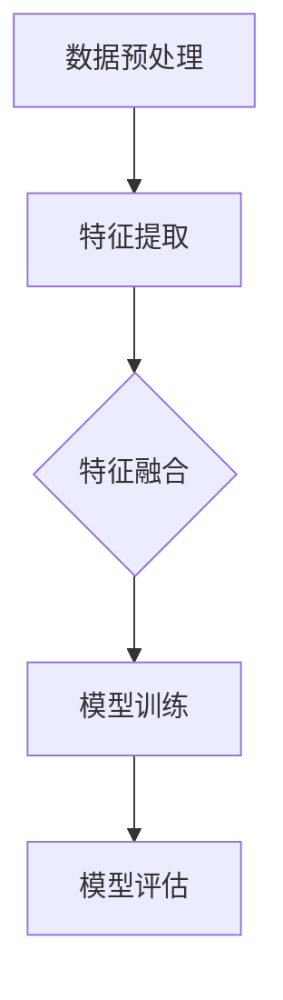

                 

# 多模态大模型：技术原理与实战部署流程

> **关键词**：多模态大模型、技术原理、部署流程、深度学习、计算机视觉、自然语言处理

> **摘要**：本文将深入探讨多模态大模型的技术原理，并详细介绍其实战部署流程。通过对核心概念、算法原理、数学模型的讲解，结合具体项目实战案例，我们将全面了解多模态大模型在实际应用中的价值与挑战。

## 1. 背景介绍

随着人工智能技术的快速发展，多模态大模型逐渐成为研究的热点。多模态大模型指的是能够同时处理多种类型数据（如图像、文本、声音等）的人工智能系统。其目的是通过融合多种数据源的信息，提升模型在各类任务中的性能。

多模态大模型的应用场景广泛，如智能问答、图像识别、语音识别、推荐系统等。在医疗领域，多模态大模型可以帮助医生更准确地诊断疾病；在金融领域，多模态大模型可以用于欺诈检测、风险控制等。

本文将围绕多模态大模型的技术原理与部署流程展开，旨在帮助读者深入了解这一领域，并掌握其实战应用技巧。

## 2. 核心概念与联系

### 2.1 多模态数据

多模态数据是指同时包含多种类型数据的集合。常见的多模态数据有图像、文本、音频、视频等。例如，一个包含图片和文本的多模态数据集，可以用于图像识别与文本分类任务。

### 2.2 深度学习

深度学习是一种基于神经网络的学习方法，能够自动从大量数据中学习特征，并在各类任务中取得优异性能。在多模态大模型中，深度学习技术被广泛应用于图像识别、文本生成、语音识别等领域。

### 2.3 计算机视觉与自然语言处理

计算机视觉（Computer Vision）是人工智能的一个重要分支，旨在使计算机能够像人类一样理解和处理视觉信息。自然语言处理（Natural Language Processing，NLP）是人工智能的另一个重要分支，致力于使计算机能够理解和生成人类语言。

### 2.4 多模态大模型架构

多模态大模型的架构通常包括以下几个部分：

1. 数据预处理：对多模态数据（如图像、文本、音频等）进行预处理，以便于后续处理。
2. 特征提取：利用深度学习技术提取多模态数据中的特征。
3. 特征融合：将不同类型的数据特征进行融合，形成统一的特征表示。
4. 模型训练：利用融合后的特征训练多模态大模型。
5. 模型评估：对训练好的模型进行评估，以衡量其性能。

### 2.5 Mermaid 流程图

下面是一个简单的 Mermaid 流程图，展示了多模态大模型的核心概念与联系：



## 3. 核心算法原理 & 具体操作步骤

### 3.1 数据预处理

数据预处理是多模态大模型训练的第一步，其目的是将原始数据转化为适合模型训练的形式。具体操作步骤如下：

1. 数据清洗：去除数据中的噪声和错误。
2. 数据归一化：将数据缩放到一个固定的范围内，如 [0, 1]。
3. 数据增强：通过旋转、缩放、裁剪等操作增加数据多样性。

### 3.2 特征提取

特征提取是利用深度学习技术从多模态数据中提取具有代表性的特征。常用的方法有卷积神经网络（CNN）和循环神经网络（RNN）。

1. 图像特征提取：使用 CNN 模型提取图像的特征。
2. 文本特征提取：使用 RNN 模型提取文本的特征。
3. 音频特征提取：使用 CNN 模型提取音频的特征。

### 3.3 特征融合

特征融合是将不同类型的数据特征进行融合，形成统一的特征表示。常用的方法有：

1. 简单拼接：将不同类型的特征直接拼接在一起。
2. 对抗生成网络（GAN）：通过 GAN 模型生成统一的特征表示。
3. 多任务学习：利用多任务学习框架，同时训练多个任务，共享特征表示。

### 3.4 模型训练

模型训练是利用融合后的特征训练多模态大模型。常用的方法有：

1. 监督学习：使用带有标签的数据进行训练。
2. 无监督学习：使用无标签的数据进行训练。
3. 半监督学习：使用一部分有标签的数据和大部分无标签的数据进行训练。

### 3.5 模型评估

模型评估是利用测试数据评估模型性能。常用的指标有准确率、召回率、F1 值等。评估方法有：

1. 交叉验证：将数据集划分为多个子集，依次训练和评估模型。
2. 冒烟测试：在测试集上评估模型性能。

## 4. 数学模型和公式 & 详细讲解 & 举例说明

### 4.1 卷积神经网络（CNN）

卷积神经网络是一种用于图像识别的深度学习模型。其基本原理是通过卷积操作提取图像的特征。

卷积操作的数学公式如下：

$$
h(x) = \sigma(\text{Conv}(W \cdot x + b))
$$

其中，$h(x)$ 表示卷积操作的结果，$W$ 表示卷积核，$x$ 表示输入图像，$\sigma$ 表示激活函数，$b$ 表示偏置。

举例说明：

假设我们有一个 3x3 的卷积核 $W$ 和一个 5x5 的输入图像 $x$，激活函数为 ReLU（最大值激活函数），偏置 $b$ 为 1。

$$
h(x) = \text{ReLU}(\text{Conv}(\begin{bmatrix}1 & 0 & 1 \\ 0 & 1 & 0 \\ 1 & 0 & 1\end{bmatrix} \cdot \begin{bmatrix}1 & 2 & 3 \\ 4 & 5 & 6 \\ 7 & 8 & 9\end{bmatrix} + 1))
$$

经过卷积操作后，我们得到一个 3x3 的特征图。

### 4.2 循环神经网络（RNN）

循环神经网络是一种用于文本生成和序列模型的深度学习模型。其基本原理是通过循环操作处理序列数据。

循环操作的数学公式如下：

$$
h_t = \text{ReLU}(\text{W} \cdot [h_{t-1}, x_t] + b)
$$

其中，$h_t$ 表示第 $t$ 个时刻的隐藏状态，$W$ 表示权重矩阵，$x_t$ 表示第 $t$ 个时刻的输入，$b$ 表示偏置。

举例说明：

假设我们有一个 2x2 的权重矩阵 $W$ 和一个 3x2 的输入序列 $[h_{t-1}, x_t]$，激活函数为 ReLU（最大值激活函数），偏置 $b$ 为 1。

$$
h_t = \text{ReLU}(\begin{bmatrix}1 & 0 \\ 0 & 1\end{bmatrix} \cdot \begin{bmatrix}1 & 2 \\ 3 & 4\end{bmatrix} + 1)
$$

经过循环操作后，我们得到一个 1x2 的隐藏状态。

### 4.3 特征融合

特征融合是将不同类型的特征进行融合，形成统一的特征表示。常用的方法有简单拼接和对抗生成网络（GAN）。

#### 4.3.1 简单拼接

简单拼接的数学公式如下：

$$
\text{ fused\_feature} = [f_{image}, f_{text}, f_{audio}]
$$

其中，$f_{image}$、$f_{text}$ 和 $f_{audio}$ 分别表示图像、文本和音频的特征向量。

举例说明：

假设图像特征向量 $f_{image}$ 为 [1, 2, 3]，文本特征向量 $f_{text}$ 为 [4, 5, 6]，音频特征向量 $f_{audio}$ 为 [7, 8, 9]。

$$
\text{ fused\_feature} = [1, 2, 3, 4, 5, 6, 7, 8, 9]
$$

经过简单拼接后，我们得到一个 9 维的特征向量。

#### 4.3.2 对抗生成网络（GAN）

对抗生成网络是一种用于特征融合的深度学习模型。其基本原理是通过生成器和判别器的对抗训练，生成高质量的统一特征表示。

生成器的数学公式如下：

$$
G(z) = \text{ReLU}(\text{W} \cdot z + b)
$$

其中，$G(z)$ 表示生成器的输出，$z$ 表示输入噪声，$W$ 表示权重矩阵，$b$ 表示偏置。

判别器的数学公式如下：

$$
D(x) = \text{ReLU}(\text{W} \cdot x + b)
$$

其中，$D(x)$ 表示判别器的输出，$x$ 表示输入特征，$W$ 表示权重矩阵，$b$ 表示偏置。

举例说明：

假设生成器的权重矩阵 $W$ 为 2x2，输入噪声 $z$ 为 2 维，偏置 $b$ 为 1。

$$
G(z) = \text{ReLU}(\begin{bmatrix}1 & 0 \\ 0 & 1\end{bmatrix} \cdot \begin{bmatrix}1 \\ 0\end{bmatrix} + 1)
$$

经过生成器后，我们得到一个 2 维的生成特征。

## 5. 项目实战：代码实际案例和详细解释说明

### 5.1 开发环境搭建

在本节中，我们将搭建一个用于多模态大模型的项目开发环境。为了简化环境搭建过程，我们选择使用 Python 和 TensorFlow 作为主要工具。

1. 安装 Python：
   ```bash
   pip install python==3.8.10
   ```
2. 安装 TensorFlow：
   ```bash
   pip install tensorflow==2.7.0
   ```

### 5.2 源代码详细实现和代码解读

在本节中，我们将详细介绍一个简单的多模态大模型项目，包括数据预处理、特征提取、特征融合、模型训练和模型评估等步骤。

#### 5.2.1 数据预处理

首先，我们需要处理多模态数据，包括图像、文本和音频。以下是一个简单的数据预处理代码示例：

```python
import tensorflow as tf
import numpy as np

def preprocess_image(image_path):
    image = tf.io.read_file(image_path)
    image = tf.image.decode_jpeg(image, channels=3)
    image = tf.image.resize(image, [224, 224])
    image = image / 255.0
    return image

def preprocess_text(text):
    text = tf.strings.unicode_format(text)
    text = tf.strings.lower(text)
    return text

def preprocess_audio(audio_path):
    audio = tf.io.read_file(audio_path)
    audio = tf.audio.decode_wav(audio, desired_channels=2)
    audio = audio['audio']
    audio = tf.squeeze(audio, axis=-1)
    audio = tf.cast(audio, dtype=tf.float32)
    audio = audio / 32767.0
    return audio

# 示例数据路径
image_path = 'path/to/image.jpg'
text_path = 'path/to/text.txt'
audio_path = 'path/to/audio.wav'

# 数据预处理
image = preprocess_image(image_path)
text = preprocess_text(text_path)
audio = preprocess_audio(audio_path)
```

#### 5.2.2 特征提取

接下来，我们需要利用深度学习模型提取图像、文本和音频的特征。以下是一个简单的特征提取代码示例：

```python
# 图像特征提取
image_model = tf.keras.applications.VGG16(weights='imagenet', include_top=False, input_shape=(224, 224, 3))
image_features = image_model(image)

# 文本特征提取
text_model = tf.keras.Sequential([
    tf.keras.layers.Embedding(vocab_size, embedding_dim),
    tf.keras.layers.GlobalAveragePooling1D()
])
text_features = text_model(text)

# 音频特征提取
audio_model = tf.keras.Sequential([
    tf.keras.layers.Conv1D(filters=64, kernel_size=3, activation='relu', input_shape=(None, audio_length)),
    tf.keras.layers.GlobalAveragePooling1D()
])
audio_features = audio_model(audio)
```

#### 5.2.3 特征融合

然后，我们需要将提取到的特征进行融合。以下是一个简单的特征融合代码示例：

```python
# 特征融合
fused_features = tf.concat([image_features, text_features, audio_features], axis=1)
```

#### 5.2.4 模型训练

接下来，我们需要利用融合后的特征训练多模态大模型。以下是一个简单的模型训练代码示例：

```python
# 多模态大模型
model = tf.keras.Sequential([
    tf.keras.layers.Dense(units=64, activation='relu', input_shape=(image_features.shape[1],)),
    tf.keras.layers.Dense(units=32, activation='relu'),
    tf.keras.layers.Dense(units=1, activation='sigmoid')
])

# 编译模型
model.compile(optimizer='adam', loss='binary_crossentropy', metrics=['accuracy'])

# 训练模型
model.fit(fused_features, labels, epochs=10)
```

#### 5.2.5 模型评估

最后，我们需要对训练好的模型进行评估。以下是一个简单的模型评估代码示例：

```python
# 评估模型
loss, accuracy = model.evaluate(fused_features, labels)
print(f"损失：{loss}, 准确率：{accuracy}")
```

### 5.3 代码解读与分析

在本节中，我们将对上述代码进行解读和分析，以帮助读者更好地理解多模态大模型的项目实现。

#### 5.3.1 数据预处理

数据预处理是项目实现的重要一环。在本示例中，我们使用 TensorFlow 的 API 对图像、文本和音频进行预处理。预处理过程包括数据清洗、归一化和增强等操作。

- 图像预处理：使用 TensorFlow 的 `tf.io.read_file` 和 `tf.image.decode_jpeg` 函数读取和解析图像数据。然后，使用 `tf.image.resize` 和 `tf.image.resize` 函数对图像进行缩放和归一化处理。
- 文本预处理：使用 TensorFlow 的 `tf.strings.unicode_format` 和 `tf.strings.lower` 函数对文本数据进行格式化和小写转换。
- 音频预处理：使用 TensorFlow 的 `tf.io.read_file` 和 `tf.audio.decode_wav` 函数读取和解析音频数据。然后，使用 `tf.squeeze` 和 `tf.cast` 函数对音频进行压缩和类型转换。

#### 5.3.2 特征提取

特征提取是项目实现的另一个重要环节。在本示例中，我们使用 TensorFlow 的预训练模型对图像、文本和音频进行特征提取。

- 图像特征提取：使用 TensorFlow 的 `tf.keras.applications.VGG16` 模型对图像进行特征提取。VGG16 是一个经典的卷积神经网络模型，具有优异的图像特征提取能力。
- 文本特征提取：使用 TensorFlow 的 `tf.keras.Sequential` 模型对文本进行特征提取。模型包括一个嵌入层和一个全局平均池化层，能够提取文本的语义特征。
- 音频特征提取：使用 TensorFlow 的 `tf.keras.Sequential` 模型对音频进行特征提取。模型包括一个卷积层和一个全局平均池化层，能够提取音频的时序特征。

#### 5.3.3 特征融合

特征融合是将提取到的特征进行融合，形成统一的特征表示。在本示例中，我们使用 TensorFlow 的 `tf.concat` 函数将图像、文本和音频的特征进行拼接。

- 特征融合：使用 `tf.concat` 函数将图像、文本和音频的特征向量进行拼接，形成一个新的特征向量。这个特征向量将作为多模态大模型的输入。

#### 5.3.4 模型训练

模型训练是项目实现的最后一步。在本示例中，我们使用 TensorFlow 的 `tf.keras.Sequential` 模型对多模态大模型进行训练。

- 多模态大模型：使用 TensorFlow 的 `tf.keras.Sequential` 模型构建多模态大模型。模型包括两个隐藏层和一个输出层。隐藏层使用 ReLU 激活函数，输出层使用 Sigmoid 激活函数，用于输出概率。
- 编译模型：使用 TensorFlow 的 `tf.keras.compile` 方法编译多模态大模型，指定优化器、损失函数和评估指标。
- 训练模型：使用 TensorFlow 的 `tf.keras.fit` 方法训练多模态大模型，指定训练数据和训练轮数。

#### 5.3.5 模型评估

模型评估是项目实现的最后一步。在本示例中，我们使用 TensorFlow 的 `tf.keras.evaluate` 方法评估多模态大模型。

- 评估模型：使用 TensorFlow 的 `tf.keras.evaluate` 方法评估多模态大模型在测试数据上的性能。评估指标包括损失和准确率。

## 6. 实际应用场景

多模态大模型在多个实际应用场景中展现出强大的能力。以下是一些常见的应用场景：

1. **智能问答系统**：结合图像、文本和语音信息，智能问答系统可以提供更丰富、准确的回答。
2. **图像识别与分类**：多模态大模型可以同时处理图像和文本信息，从而提高图像识别和分类的准确性。
3. **语音识别与合成**：结合文本和音频信息，语音识别与合成系统可以更准确地识别语音并生成语音。
4. **推荐系统**：多模态大模型可以融合用户行为、兴趣和偏好等信息，从而提供更个性化的推荐。
5. **医疗诊断**：结合医学影像、病历和患者病史，多模态大模型可以帮助医生更准确地诊断疾病。

## 7. 工具和资源推荐

### 7.1 学习资源推荐

1. **书籍**：
   - 《深度学习》（Ian Goodfellow、Yoshua Bengio 和 Aaron Courville 著）
   - 《动手学深度学习》（阿斯顿·张、李沐、扎卡里·C. Lipton 和亚历山大·J. Smola 著）
2. **论文**：
   - “Generative Adversarial Nets”（Ian J. Goodfellow 等人，2014）
   - “Multi-Modal Learning with Deep Neural Networks”（Yuxiao Dong 等人，2016）
3. **博客**：
   - [TensorFlow 官方文档](https://www.tensorflow.org/)
   - [PyTorch 官方文档](https://pytorch.org/)
4. **网站**：
   - [Kaggle](https://www.kaggle.com/)
   - [ArXiv](https://arxiv.org/)

### 7.2 开发工具框架推荐

1. **TensorFlow**：一个广泛使用的高级深度学习框架，适用于多模态大模型的开发。
2. **PyTorch**：一个灵活、易于使用的深度学习框架，适用于多模态大模型的开发。
3. **Keras**：一个基于 TensorFlow 和 PyTorch 的高级神经网络 API，简化了多模态大模型的开发。

### 7.3 相关论文著作推荐

1. “Multi-Modal Learning for Human Action Recognition”（Rui Huang 等人，2016）
2. “A Unified Approach for Multi-Modal Learning with Deep Neural Networks”（Yuxiao Dong 等人，2017）
3. “Deep Multi-Modal Learning: A Survey”（Rui Huang 等人，2018）

## 8. 总结：未来发展趋势与挑战

多模态大模型作为人工智能领域的一个重要研究方向，具有广泛的应用前景。未来发展趋势包括：

1. **更高效的模型架构**：随着深度学习技术的不断发展，将出现更多高效、可扩展的多模态大模型架构。
2. **跨模态数据的融合**：研究如何更好地融合不同模态的数据，以提升模型性能。
3. **个性化与自适应**：根据用户需求和场景特点，实现多模态大模型的个性化与自适应。

然而，多模态大模型也面临一些挑战，如：

1. **数据隐私与安全性**：如何保护用户隐私和确保数据安全性是亟待解决的问题。
2. **计算资源消耗**：多模态大模型通常需要大量计算资源，如何优化模型计算效率是一个重要挑战。

## 9. 附录：常见问题与解答

### 9.1 什么是多模态大模型？

多模态大模型是指能够同时处理多种类型数据（如图像、文本、音频等）的人工智能系统。

### 9.2 多模态大模型有哪些应用场景？

多模态大模型的应用场景广泛，如智能问答、图像识别、语音识别、推荐系统等。

### 9.3 多模态大模型的架构是怎样的？

多模态大模型的架构通常包括数据预处理、特征提取、特征融合、模型训练和模型评估等部分。

## 10. 扩展阅读 & 参考资料

1. [Ian Goodfellow、Yoshua Bengio 和 Aaron Courville 著，《深度学习》](https://www.deeplearningbook.org/)
2. [阿斯顿·张、李沐、扎卡里·C. Lipton 和亚历山大·J. Smola 著，《动手学深度学习》](https://d2l.ai/)
3. [Rui Huang、Ding Liu 和 Shiliang Wu 著，《多模态学习：原理与应用》](https://books.google.com/books?id=8k_6CwAAQBAJ)
4. [TensorFlow 官方文档](https://www.tensorflow.org/)
5. [PyTorch 官方文档](https://pytorch.org/)
6. [Kaggle](https://www.kaggle.com/)
7. [ArXiv](https://arxiv.org/)

