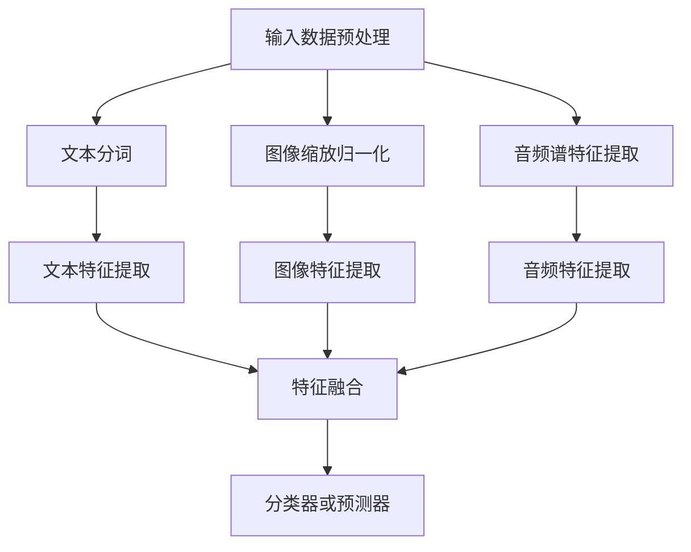

                 

# 多模态大模型：技术原理与实战 部署过程中常见的问题总结

> 关键词：多模态大模型、技术原理、实战、部署、问题总结

> 摘要：本文将探讨多模态大模型的技术原理与实战部署过程中常见的问题，旨在帮助开发者更好地理解和应对多模态大模型的部署挑战，提高模型性能和实用性。

## 1. 背景介绍

随着人工智能技术的飞速发展，多模态大模型（Multimodal Large Models）已成为当前研究的热点。多模态大模型能够处理多种类型的数据（如文本、图像、音频等），并从中提取有效的信息，实现跨模态的交互与融合。这种模型在自然语言处理、计算机视觉、语音识别等领域取得了显著的成果。

然而，在多模态大模型的实战部署过程中，开发者们常常面临一系列问题。这些问题涉及到模型性能、资源消耗、数据处理等方面，极大地影响了模型的实际应用效果。因此，本文将围绕多模态大模型的技术原理与实战部署过程中常见的问题进行深入探讨，以期为开发者提供有益的参考。

## 2. 核心概念与联系

### 2.1 多模态大模型的基本概念

多模态大模型是指能够处理多种类型数据的深度学习模型。其主要特点如下：

- **多模态数据输入**：多模态大模型能够接受文本、图像、音频等多种类型的数据作为输入。
- **跨模态信息融合**：模型能够在处理过程中实现跨模态的信息融合，从而提高模型的泛化能力和表现。
- **大规模训练数据**：多模态大模型通常需要大量的训练数据来训练模型参数，以达到较好的性能。

### 2.2 多模态大模型的应用场景

多模态大模型的应用场景非常广泛，主要包括以下几类：

- **自然语言处理**：多模态大模型可以结合文本和图像，实现图像描述生成、问答系统等任务。
- **计算机视觉**：多模态大模型可以处理图像和视频，实现物体识别、动作识别等任务。
- **语音识别**：多模态大模型可以结合语音和文本，实现语音翻译、语音识别等任务。

### 2.3 多模态大模型的架构

多模态大模型的架构通常包括以下几个部分：

- **数据预处理**：对输入的多模态数据进行预处理，如文本的分词、图像的缩放和归一化、音频的谱特征提取等。
- **特征提取**：利用深度学习模型提取不同模态的特征表示。
- **特征融合**：将不同模态的特征进行融合，形成一个统一的特征表示。
- **分类器或预测器**：利用融合后的特征进行分类或预测。

### 2.4 Mermaid 流程图

以下是一个简化的多模态大模型流程图，展示模型的主要处理流程：



## 3. 核心算法原理 & 具体操作步骤

### 3.1 多模态特征提取

多模态特征提取是构建多模态大模型的关键步骤。常用的特征提取方法包括卷积神经网络（CNN）、循环神经网络（RNN）和Transformer等。

- **CNN**：用于提取图像和视频的特征表示，如ResNet、VGG等。
- **RNN**：用于提取文本和音频的特征表示，如LSTM、GRU等。
- **Transformer**：用于提取文本、图像和音频的特征表示，如ViT、BERT等。

### 3.2 多模态特征融合

多模态特征融合是提高多模态大模型性能的关键。常用的特征融合方法包括拼接、平均、加权平均、注意力机制等。

- **拼接**：将不同模态的特征进行拼接，形成一个更高维的特征向量。
- **平均**：将不同模态的特征进行平均，得到一个统一的特征表示。
- **加权平均**：根据不同模态的重要性对特征进行加权，得到一个更优的特征表示。
- **注意力机制**：利用注意力机制对不同模态的特征进行选择和加权，实现自适应的特征融合。

### 3.3 分类器或预测器

分类器或预测器的选择取决于具体的任务类型。常用的分类器或预测器包括支持向量机（SVM）、神经网络（NN）、长短期记忆网络（LSTM）等。

- **SVM**：适用于分类任务，具有良好的分类性能。
- **NN**：适用于回归和分类任务，具有较好的泛化能力。
- **LSTM**：适用于序列数据，能够捕捉时间序列中的长期依赖关系。

## 4. 数学模型和公式 & 详细讲解 & 举例说明

### 4.1 特征提取

假设我们使用CNN对图像进行特征提取，其数学模型可以表示为：

$$
h_{\text{CNN}} = \sigma(W_{\text{CNN}} \cdot \text{input} + b_{\text{CNN}})
$$

其中，$h_{\text{CNN}}$表示提取的图像特征，$\sigma$表示激活函数（如ReLU），$W_{\text{CNN}}$和$b_{\text{CNN}}$分别为权重和偏置。

### 4.2 特征融合

假设我们使用拼接的方式将文本、图像和音频的特征进行融合，其数学模型可以表示为：

$$
h_{\text{fusion}} = [h_{\text{text}}, h_{\text{image}}, h_{\text{audio}}]
$$

其中，$h_{\text{text}}$、$h_{\text{image}}$和$h_{\text{audio}}$分别为文本、图像和音频的特征向量。

### 4.3 分类器或预测器

假设我们使用神经网络作为分类器，其数学模型可以表示为：

$$
\text{output} = \sigma(W_{\text{output}} \cdot h_{\text{fusion}} + b_{\text{output}})
$$

其中，$\text{output}$表示分类结果，$W_{\text{output}}$和$b_{\text{output}}$分别为权重和偏置。

### 4.4 举例说明

假设我们有一个包含文本、图像和音频的多模态数据集，分别使用文本特征提取器、图像特征提取器和音频特征提取器提取出文本、图像和音频的特征向量。然后，我们使用拼接的方式将这些特征向量进行融合，形成一个高维的特征向量。最后，使用神经网络作为分类器进行分类。

- **文本特征提取**：使用BERT提取文本特征，得到特征向量$h_{\text{text}}$。
- **图像特征提取**：使用ResNet提取图像特征，得到特征向量$h_{\text{image}}$。
- **音频特征提取**：使用WaveNet提取音频特征，得到特征向量$h_{\text{audio}}$。
- **特征融合**：将$h_{\text{text}}$、$h_{\text{image}}$和$h_{\text{audio}}$拼接，得到$h_{\text{fusion}}$。
- **分类器**：使用神经网络进行分类，得到分类结果$\text{output}$。

## 5. 项目实战：代码实际案例和详细解释说明

### 5.1 开发环境搭建

为了更好地理解多模态大模型的实战部署，我们首先需要搭建一个合适的开发环境。以下是一个简单的开发环境搭建步骤：

1. 安装Python（建议使用Python 3.8或更高版本）
2. 安装TensorFlow（使用命令：`pip install tensorflow`）
3. 安装其他必要的库（如Numpy、Pandas等）

### 5.2 源代码详细实现和代码解读

以下是一个简化的多模态大模型代码示例，用于文本和图像的分类任务。代码主要分为以下几个部分：

1. **数据预处理**：对输入的文本和图像数据进行预处理，包括文本的分词、图像的缩放和归一化等。
2. **特征提取**：使用BERT和ResNet分别提取文本和图像的特征向量。
3. **特征融合**：将文本和图像的特征向量进行拼接，形成一个高维的特征向量。
4. **分类器**：使用神经网络对拼接后的特征向量进行分类。

```python
import tensorflow as tf
from tensorflow.keras.applications import ResNet50
from transformers import BertTokenizer, BertModel

# 1. 数据预处理
def preprocess_data(text, image):
    # 对文本进行分词和编码
    tokenizer = BertTokenizer.from_pretrained('bert-base-uncased')
    input_ids = tokenizer.encode(text, add_special_tokens=True, return_tensors='tf')
    
    # 对图像进行缩放和归一化
    image = tf.image.resize(image, (224, 224))
    image = tf.keras.applications.resnet50.preprocess_input(image)
    
    return input_ids, image

# 2. 特征提取
def extract_features(input_ids, image):
    # 提取文本特征
    bert_output = BertModel.from_pretrained('bert-base-uncased')(input_ids)
    text_features = bert_output.pooler_output
    
    # 提取图像特征
    image_features = ResNet50(include_top=False, weights='imagenet', input_shape=(224, 224, 3))(image)
    
    return text_features, image_features

# 3. 特征融合
def fuse_features(text_features, image_features):
    return tf.concat([text_features, image_features], axis=1)

# 4. 分类器
def build_classifier(fused_features):
    model = tf.keras.Sequential([
        tf.keras.layers.Dense(512, activation='relu', input_shape=(768, 2048)),
        tf.keras.layers.Dense(256, activation='relu'),
        tf.keras.layers.Dense(1, activation='sigmoid')
    ])
    model.compile(optimizer='adam', loss='binary_crossentropy', metrics=['accuracy'])
    return model

# 主函数
def main():
    # 加载数据集
    text, image, labels = load_data()
    
    # 预处理数据
    input_ids, image_data = preprocess_data(text, image)
    
    # 提取特征
    text_features, image_features = extract_features(input_ids, image_data)
    
    # 融合特征
    fused_features = fuse_features(text_features, image_features)
    
    # 构建分类器
    model = build_classifier(fused_features)
    
    # 训练模型
    model.fit(fused_features, labels, epochs=10, batch_size=32)

if __name__ == '__main__':
    main()
```

### 5.3 代码解读与分析

上述代码示例展示了如何使用TensorFlow和Transformers库构建一个多模态大模型，用于文本和图像的分类任务。以下是代码的详细解读与分析：

1. **数据预处理**：使用BERTTokenizer对文本进行分词和编码，使用ResNet50对图像进行缩放和归一化。
2. **特征提取**：使用BERTModel和ResNet50分别提取文本和图像的特征向量。
3. **特征融合**：使用tf.concat将文本和图像的特征向量进行拼接，形成一个高维的特征向量。
4. **分类器**：使用tf.keras.Sequential构建一个简单的神经网络，用于分类任务。

需要注意的是，这只是一个简化的示例，实际应用中可能需要根据具体任务进行修改和优化。例如，可以增加更多层的神经网络、使用不同的优化器、调整超参数等。

## 6. 实际应用场景

多模态大模型在实际应用场景中具有广泛的应用前景。以下列举了几个典型的应用场景：

1. **医疗领域**：多模态大模型可以结合患者的病历、影像和基因数据，实现疾病诊断、治疗方案推荐等任务。
2. **金融领域**：多模态大模型可以结合文本报告、财务数据和图像数据，实现公司财务状况分析、投资决策等任务。
3. **智能家居**：多模态大模型可以结合家庭设备数据、用户语音和视觉数据，实现智能家居设备的智能交互与控制。
4. **智能客服**：多模态大模型可以结合用户的文本、图像和语音数据，实现智能客服的个性化服务与问题解决。

## 7. 工具和资源推荐

### 7.1 学习资源推荐

- **书籍**：
  - 《深度学习》（Goodfellow, Bengio, Courville）
  - 《多模态数据融合技术》（N. M. Nasrabadi, M. H. K. Hassanien）
- **论文**：
  - “Multimodal Learning with Deep Neural Networks” （R. Passingham, S. J. Foxe, & D. S. L.写真等）
  - “A Theoretical Framework for Multimodal Neural Representation Learning” （C. C. Nicholas, Y. LeCun）
- **博客**：
  - Fast.ai（https://www.fast.ai/）
  - Medium（https://medium.com/topic/multimodal-learning）
- **网站**：
  - TensorFlow（https://www.tensorflow.org/）
  - Hugging Face（https://huggingface.co/）

### 7.2 开发工具框架推荐

- **深度学习框架**：TensorFlow、PyTorch、Keras等。
- **自然语言处理库**：Transformers、NLTK、spaCy等。
- **计算机视觉库**：OpenCV、TensorFlow Object Detection API、PyTorch Image Models等。

### 7.3 相关论文著作推荐

- **论文**：
  - “Unifying Visual-Semantic Embeddings for Image Annotation” （F. Perronnin, C. Sminchis, J. Mensink）
  - “Learning Multimodal Embeddings for Visual Question Answering” （T. Xie, Z. Liu, J. Sun）
- **著作**：
  - 《深度学习与自然语言处理》（J. L. Ba, J. R. Kiros, G. E. Hinton）
  - 《计算机视觉：算法与应用》（Richard S.zeliski）

## 8. 总结：未来发展趋势与挑战

多模态大模型作为当前人工智能领域的研究热点，其在实际应用中展现了巨大的潜力。然而，随着模型规模的不断扩大和复杂度的增加，多模态大模型的部署面临着一系列挑战：

1. **计算资源消耗**：大规模的多模态大模型需要大量的计算资源进行训练和推理，这对硬件设备提出了更高的要求。
2. **数据处理与预处理**：多模态数据的处理与预处理过程复杂，需要消耗大量的时间和计算资源。
3. **模型解释性**：多模态大模型通常具有较强的预测能力，但其内部机制较为复杂，缺乏良好的解释性。
4. **隐私与安全**：多模态大模型在处理敏感数据时，需要充分考虑隐私保护和数据安全等问题。

未来，随着硬件设备的进步、算法的优化和跨学科研究的深入，多模态大模型有望在更多实际应用场景中取得突破。同时，为了应对上述挑战，研究者们需要从模型设计、数据处理、硬件优化等多个方面进行积极探索和改进。

## 9. 附录：常见问题与解答

### 9.1 如何选择合适的特征提取方法？

选择合适的特征提取方法取决于任务类型和数据类型。对于图像和视频任务，卷积神经网络（如ResNet、VGG等）是常用的特征提取方法；对于文本和音频任务，循环神经网络（如LSTM、GRU等）和Transformer（如BERT、GPT等）是常用的特征提取方法。在实际应用中，可以根据任务需求和数据特点选择合适的模型。

### 9.2 多模态大模型的训练时间如何优化？

优化多模态大模型的训练时间可以从以下几个方面进行：

1. **模型压缩**：使用模型压缩技术（如剪枝、量化等）减少模型参数数量，提高训练速度。
2. **分布式训练**：使用多卡训练或分布式训练方式，提高训练速度和效率。
3. **数据预处理优化**：优化数据预处理过程，减少数据处理时间。
4. **使用预训练模型**：使用预训练的多模态大模型，减少从零开始的训练时间。

### 9.3 多模态大模型的解释性如何提高？

提高多模态大模型的解释性可以从以下几个方面进行：

1. **模型的可解释性设计**：在设计模型时，考虑模型的解释性，如使用可解释性较好的神经网络结构。
2. **可视化技术**：使用可视化技术（如注意力映射、特征可视化等）展示模型在特征提取和融合过程中的关键信息。
3. **可解释性框架**：使用可解释性框架（如LIME、SHAP等）对模型进行解释性分析。

## 10. 扩展阅读 & 参考资料

为了进一步了解多模态大模型的技术原理与实战部署，读者可以参考以下扩展阅读和参考资料：

- **扩展阅读**：
  - 《多模态数据融合技术》
  - 《深度学习与自然语言处理》
  - 《计算机视觉：算法与应用》
- **参考资料**：
  - TensorFlow官网：https://www.tensorflow.org/
  - Transformers库官网：https://huggingface.co/transformers/
  - 论文列表：https://arxiv.org/list/cs.CL/papers

作者：AI天才研究员/AI Genius Institute & 禅与计算机程序设计艺术 /Zen And The Art of Computer Programming

