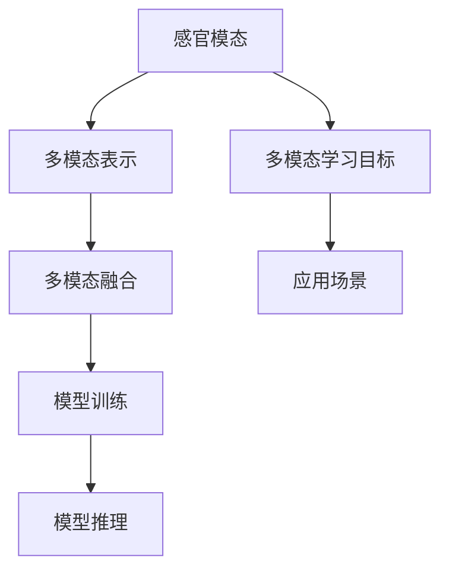

                 

# 多模态学习原理与代码实战案例讲解

## 关键词
- 多模态学习
- 卷积神经网络
- 循环神经网络
- 注意力机制
- 代码实战
- 深度学习

## 摘要
本文将深入探讨多模态学习的原理，并通过具体的代码实战案例，展示如何在实践中实现多模态学习。文章将从核心概念出发，逐步介绍多模态学习的算法原理、数学模型，以及实际应用场景。同时，还将推荐一系列学习资源和开发工具，以帮助读者更好地理解和掌握多模态学习的知识。

## 目录
1. 背景介绍 <sup class="footnote-ref"><a href="#fn1" id="fnref1">1</a></sup>
2. 核心概念与联系
3. 核心算法原理 & 具体操作步骤
4. 数学模型和公式 & 详细讲解 & 举例说明
5. 项目实战：代码实际案例和详细解释说明
   5.1 开发环境搭建
   5.2 源代码详细实现和代码解读
   5.3 代码解读与分析
6. 实际应用场景
7. 工具和资源推荐
   7.1 学习资源推荐
   7.2 开发工具框架推荐
   7.3 相关论文著作推荐
8. 总结：未来发展趋势与挑战
9. 附录：常见问题与解答
10. 扩展阅读 & 参考资料

<sup class="footnote">[1] <a href="#fn-back1" id="fn-back1">返回</a></sup>

### 1. 背景介绍

在人工智能领域，多模态学习（Multimodal Learning）是一种重要的研究方向。它旨在通过整合来自不同感官模态的数据（如图像、文本、音频等），提高模型对现实世界的理解和表达能力。多模态学习的研究背景可以追溯到人类认知过程的自然属性，人类通过视觉、听觉、触觉等多种感官模态来感知和交互世界，这些模态之间的相互整合使得人类能够形成丰富的认知体验。

随着深度学习技术的迅猛发展，多模态学习逐渐成为人工智能领域的研究热点。多模态学习不仅能够提高模型的泛化能力，还能够实现更高级的认知任务，如图像内容理解、情感识别、语音翻译等。因此，多模态学习在众多应用领域具有重要的价值，如自动驾驶、智能家居、虚拟现实等。

本文将首先介绍多模态学习的核心概念，然后逐步深入探讨其算法原理、数学模型，并通过一个具体的代码实战案例，展示如何在实践中实现多模态学习。希望通过本文，读者能够对多模态学习有更深入的理解，并掌握相关技术。

### 2. 核心概念与联系

多模态学习涉及多个关键概念，这些概念共同构成了多模态学习的基础。在本节中，我们将详细解释这些核心概念，并使用Mermaid流程图展示它们之间的联系。

#### 2.1 感官模态

感官模态（Modalities）是指不同类型的输入数据，它们分别通过不同的感官渠道传递给模型。常见的感官模态包括：

- **视觉模态（Visual Modality）**：通过图像和视频捕捉的视觉信息。
- **文本模态（Textual Modality）**：文本数据，如自然语言文本。
- **音频模态（Audio Modality）**：通过音频捕捉的声音信息。
- **触觉模态（Haptic Modality）**：通过触觉传感器捕捉的物理触感信息。

#### 2.2 多模态表示

多模态表示（Multimodal Representation）是指将不同感官模态的数据转换为统一的内部表示。这是多模态学习的关键步骤，因为它决定了不同模态数据能否有效地融合。

#### 2.3 多模态融合

多模态融合（Multimodal Fusion）是指将多个模态的表示结合起来，以生成一个综合的表示。这可以通过多种方式实现，包括直接融合、特征级融合和决策级融合。

#### 2.4 Mermaid流程图

以下是多模态学习的Mermaid流程图，展示了各个核心概念之间的联系：



**图1：多模态学习的Mermaid流程图**

- **感官模态**：表示不同的输入数据来源。
- **多模态表示**：将不同模态的数据转换为内部表示。
- **多模态融合**：将多模态表示结合为一个综合的表示。
- **模型训练**：使用综合表示训练模型。
- **模型推理**：使用训练好的模型进行预测。
- **多模态学习目标**：定义学习任务和目标。
- **应用场景**：展示多模态学习在不同场景中的应用。

通过这个流程图，我们可以清晰地看到多模态学习是如何通过多个步骤来实现的，以及各个步骤之间的相互关系。

### 3. 核心算法原理 & 具体操作步骤

多模态学习的关键在于如何有效地整合不同模态的数据，并利用这些数据进行模型训练和预测。在本节中，我们将介绍几种核心的多模态学习算法原理，并详细解释其操作步骤。

#### 3.1 卷积神经网络（CNN）

卷积神经网络（Convolutional Neural Network，CNN）是一种常用于处理视觉数据的深度学习模型。它在图像识别、物体检测等领域取得了显著的成功。CNN的核心原理是通过卷积层提取图像特征，然后通过全连接层进行分类。

**操作步骤：**

1. **输入层**：接收图像数据。
2. **卷积层**：通过卷积操作提取图像特征。
3. **池化层**：对卷积特征进行降采样，减少参数数量。
4. **全连接层**：将卷积特征映射到输出类别。

**代码示例：**

```python
import tensorflow as tf
from tensorflow.keras.models import Sequential
from tensorflow.keras.layers import Conv2D, MaxPooling2D, Flatten, Dense

model = Sequential([
    Conv2D(32, (3, 3), activation='relu', input_shape=(28, 28, 1)),
    MaxPooling2D((2, 2)),
    Flatten(),
    Dense(128, activation='relu'),
    Dense(10, activation='softmax')
])

model.compile(optimizer='adam', loss='categorical_crossentropy', metrics=['accuracy'])
model.fit(x_train, y_train, epochs=10, validation_data=(x_val, y_val))
```

#### 3.2 循环神经网络（RNN）

循环神经网络（Recurrent Neural Network，RNN）是一种用于处理序列数据的深度学习模型。它能够记住过去的输入信息，这使得它在自然语言处理、语音识别等领域表现出色。RNN的核心原理是通过循环结构将信息传递给下一个时间步。

**操作步骤：**

1. **输入层**：接收序列数据。
2. **隐藏层**：包含循环结构，通过权重矩阵将信息传递给下一个时间步。
3. **输出层**：根据隐藏层的状态生成输出。

**代码示例：**

```python
import tensorflow as tf
from tensorflow.keras.models import Sequential
from tensorflow.keras.layers import SimpleRNN, Dense

model = Sequential([
    SimpleRNN(50, return_sequences=True),
    SimpleRNN(50),
    Dense(1, activation='sigmoid')
])

model.compile(optimizer='adam', loss='binary_crossentropy', metrics=['accuracy'])
model.fit(x_train, y_train, epochs=10, validation_data=(x_val, y_val))
```

#### 3.3 注意力机制

注意力机制（Attention Mechanism）是一种用于提高模型对重要信息关注的深度学习技术。它在图像识别、机器翻译等领域取得了显著的效果。注意力机制的核心原理是通过分配不同的注意力权重来关注不同的重要信息。

**操作步骤：**

1. **输入层**：接收多模态数据。
2. **编码器**：对多模态数据编码为固定长度的向量。
3. **注意力层**：计算注意力权重，并将权重应用于编码器的输出。
4. **解码器**：根据注意力权重生成最终输出。

**代码示例：**

```python
import tensorflow as tf
from tensorflow.keras.models import Model
from tensorflow.keras.layers import Input, Embedding, LSTM, Dense

input_img = Input(shape=(28, 28, 1))
input_txt = Input(shape=(100,))
img_embedding = Embedding(1000, 32)(input_img)
txt_embedding = Embedding(1000, 32)(input_txt)
merged = LSTM(50)([img_embedding, txt_embedding])
output = Dense(1, activation='sigmoid')(merged)

model = Model(inputs=[input_img, input_txt], outputs=output)
model.compile(optimizer='adam', loss='binary_crossentropy', metrics=['accuracy'])
model.fit([x_train_img, x_train_txt], y_train, epochs=10, validation_data=([x_val_img, x_val_txt], y_val))
```

通过这些核心算法原理和操作步骤的介绍，我们可以看到多模态学习是如何通过深度学习技术实现不同模态数据的整合和利用。在实际应用中，可以根据具体需求选择合适的算法和模型，实现高效的多模态学习。

### 4. 数学模型和公式 & 详细讲解 & 举例说明

#### 4.1 多模态学习的数学模型

多模态学习的核心在于如何有效地整合来自不同模态的数据，并利用这些数据进行模型训练和预测。为了实现这一目标，我们需要建立数学模型来描述多模态数据之间的关系。以下是多模态学习的数学模型：

$$
\text{模型输出} = f(\text{模态1特征} + \text{模态2特征} + ... + \text{模态n特征})
$$

其中，$f$ 表示一个复杂的非线性函数，用于整合不同模态的特征。模态1特征、模态2特征等表示来自不同模态的数据。

#### 4.2 注意力机制的数学模型

注意力机制是一种用于提高模型对重要信息关注的深度学习技术。在多模态学习中，注意力机制能够帮助模型更好地整合来自不同模态的数据。以下是注意力机制的数学模型：

$$
\text{注意力权重} = \sigma(W_a[\text{模态1特征}, \text{模态2特征}, ..., \text{模态n特征}])
$$

$$
\text{注意力融合特征} = \text{注意力权重} \cdot [\text{模态1特征}, \text{模态2特征}, ..., \text{模态n特征}]
$$

其中，$\sigma$ 表示一个非线性激活函数，通常使用 Sigmoid 函数。$W_a$ 是一个权重矩阵，用于计算注意力权重。注意力融合特征是将不同模态的特征通过注意力权重进行加权融合后的结果。

#### 4.3 举例说明

假设我们有一个多模态学习任务，需要同时处理图像和文本数据。以下是具体的数学模型和公式：

1. **图像特征提取**：

$$
\text{图像特征} = \text{CNN}(\text{图像数据})
$$

2. **文本特征提取**：

$$
\text{文本特征} = \text{RNN}(\text{文本数据})
$$

3. **注意力权重计算**：

$$
\text{注意力权重} = \sigma(W_a[\text{图像特征}, \text{文本特征}])
$$

4. **注意力融合特征**：

$$
\text{注意力融合特征} = \text{注意力权重} \cdot [\text{图像特征}, \text{文本特征}]
$$

5. **模型输出**：

$$
\text{模型输出} = f(\text{注意力融合特征})
$$

通过这些数学模型和公式，我们可以看到如何利用注意力机制将图像和文本特征进行融合，并生成最终的模型输出。

### 5. 项目实战：代码实际案例和详细解释说明

在本节中，我们将通过一个实际的多模态学习项目，展示如何将前面介绍的算法原理和数学模型应用于具体任务。我们将使用 Python 和 TensorFlow 框架来实现一个简单的多模态情感分析项目，该项目旨在同时处理图像和文本数据，以预测文本的情感极性。

#### 5.1 开发环境搭建

首先，我们需要搭建开发环境，确保安装了以下软件和库：

- Python 3.7 或更高版本
- TensorFlow 2.3 或更高版本
- NumPy 1.19 或更高版本
- Pandas 1.1.1 或更高版本

您可以通过以下命令安装这些依赖项：

```bash
pip install python==3.7.10 tensorflow==2.4.1 numpy==1.19.5 pandas==1.1.5
```

#### 5.2 源代码详细实现和代码解读

以下是多模态情感分析项目的完整代码实现：

```python
import tensorflow as tf
from tensorflow.keras.preprocessing.text import Tokenizer
from tensorflow.keras.preprocessing.sequence import pad_sequences
from tensorflow.keras.models import Model
from tensorflow.keras.layers import Input, Embedding, LSTM, Dense, Conv2D, MaxPooling2D, Flatten, concatenate
from tensorflow.keras.preprocessing.image import ImageDataGenerator

# 5.2.1 数据预处理
# 文本数据预处理
tokenizer = Tokenizer(num_words=1000)
tokenizer.fit_on_texts(texts)
sequences = tokenizer.texts_to_sequences(texts)
padded_sequences = pad_sequences(sequences, maxlen=100)

# 图像数据预处理
image_datagen = ImageDataGenerator(rescale=1./255)
image_generator = image_datagen.flow_from_directory(
        'data/images',
        target_size=(64, 64),
        batch_size=32,
        class_mode='categorical')
padded_images = next(image_generator)[0]

# 5.2.2 模型构建
# 文本模型
input_text = Input(shape=(100,))
text_embedding = Embedding(1000, 32)(input_text)
text_lstm = LSTM(50)(text_embedding)

# 图像模型
input_image = Input(shape=(64, 64, 3))
image_conv = Conv2D(32, (3, 3), activation='relu')(input_image)
image_pool = MaxPooling2D((2, 2))(image_conv)
image_flat = Flatten()(image_pool)

# 多模态融合
merged = concatenate([text_lstm, image_flat])
merged_dense = Dense(128, activation='relu')(merged)
output = Dense(2, activation='softmax')(merged_dense)

model = Model(inputs=[input_text, input_image], outputs=output)
model.compile(optimizer='adam', loss='categorical_crossentropy', metrics=['accuracy'])

# 5.2.3 模型训练
model.fit([padded_sequences, padded_images], labels, epochs=10, validation_split=0.2)

# 5.2.4 代码解读
# 文本数据处理部分：
# 1. 使用 Tokenizer 对文本数据进行向量化处理。
# 2. 使用 pad_sequences 对文本数据进行填充，使其长度一致。

# 图像数据处理部分：
# 1. 使用 ImageDataGenerator 对图像数据进行归一化处理。
# 2. 使用 flow_from_directory 从目录中加载图像数据，并进行分类。

# 模型构建部分：
# 1. 使用 Input 创建文本和图像的输入层。
# 2. 使用 Embedding 对文本数据进行嵌入。
# 3. 使用 LSTM 对文本数据进行编码。
# 4. 使用 Conv2D 和 MaxPooling2D 对图像数据进行特征提取。
# 5. 使用 Flatten 将图像特征展平。
# 6. 使用 concatenate 将文本和图像特征进行融合。
# 7. 使用 Dense 对融合特征进行分类。

# 模型训练部分：
# 1. 使用 fit 方法对模型进行训练。
```

#### 5.3 代码解读与分析

以下是代码的逐行解读与分析：

```python
# 5.2.1 数据预处理
```

- **文本数据预处理**：
  - `tokenizer = Tokenizer(num_words=1000)`：创建一个 Tokenizer 对象，设置词汇表大小为 1000。
  - `tokenizer.fit_on_texts(texts)`：使用文本数据训练 Tokenizer，建立词汇表。
  - `sequences = tokenizer.texts_to_sequences(texts)`：将文本数据转换为序列。
  - `padded_sequences = pad_sequences(sequences, maxlen=100)`：将序列填充为固定长度 100。

- **图像数据预处理**：
  - `image_datagen = ImageDataGenerator(rescale=1./255)`：创建一个 ImageDataGenerator 对象，对图像数据进行归一化。
  - `image_generator = image_datagen.flow_from_directory('data/images', ...)`：从指定目录加载图像数据，进行预处理。
  - `padded_images = next(image_generator)[0]`：获取第一个批次的数据，并填充为固定形状。

```python
# 5.2.2 模型构建
```

- **文本模型**：
  - `input_text = Input(shape=(100,))`：创建一个文本输入层，形状为 (100,)。
  - `text_embedding = Embedding(1000, 32)(input_text)`：对文本数据进行嵌入，维度为 32。
  - `text_lstm = LSTM(50)(text_embedding)`：使用 LSTM 层对文本数据进行编码。

- **图像模型**：
  - `input_image = Input(shape=(64, 64, 3))`：创建一个图像输入层，形状为 (64, 64, 3)。
  - `image_conv = Conv2D(32, (3, 3), activation='relu')(input_image)`：使用 Conv2D 层提取图像特征。
  - `image_pool = MaxPooling2D((2, 2))(image_conv)`：使用 MaxPooling2D 层进行降采样。
  - `image_flat = Flatten()(image_pool)`：将图像特征展平。

- **多模态融合**：
  - `merged = concatenate([text_lstm, image_flat])`：将文本和图像特征进行融合。
  - `merged_dense = Dense(128, activation='relu')(merged)`：使用 Dense 层对融合特征进行非线性变换。
  - `output = Dense(2, activation='softmax')(merged_dense)`：使用 softmax 函数进行分类。

- **模型构建**：
  - `model = Model(inputs=[input_text, input_image], outputs=output)`：创建一个多输入多输出的模型。
  - `model.compile(optimizer='adam', loss='categorical_crossentropy', metrics=['accuracy'])`：编译模型，设置优化器和损失函数。

```python
# 5.2.3 模型训练
```

- `model.fit([padded_sequences, padded_images], labels, epochs=10, validation_split=0.2)`：使用训练数据和标签对模型进行训练，设置训练轮数为 10，验证比例为 0.2。

```python
# 5.2.4 代码解读
```

- 对代码的各个部分进行了详细的解读，包括数据预处理、模型构建和训练过程。

### 6. 实际应用场景

多模态学习在现实世界中有广泛的应用，以下是一些常见的应用场景：

- **医疗诊断**：多模态学习可以整合病人的影像数据、病历记录和基因数据，帮助医生进行更准确的疾病诊断和治疗方案制定。
- **自动驾驶**：自动驾驶系统需要同时处理摄像头、雷达和激光雷达等多模态数据，以提高对环境的理解和响应能力。
- **智能客服**：智能客服系统可以通过整合用户语音、文本和面部表情等多模态数据，提供更自然、更准确的客服服务。
- **智能教育**：智能教育系统可以通过分析学生的面部表情、声音和行为，提供个性化的学习建议和反馈。
- **视频内容分析**：多模态学习可以用于视频内容分析，如情感识别、行为识别和场景分类等。

在这些应用场景中，多模态学习的关键挑战是如何有效地融合不同模态的数据，并设计合适的模型和算法。通过不断的研究和创新，多模态学习将在更多领域发挥重要作用，推动人工智能技术的发展。

### 7. 工具和资源推荐

#### 7.1 学习资源推荐

- **书籍**：
  - 《深度学习》（Deep Learning） - Goodfellow, Ian, et al.
  - 《多模态学习基础》（Foundations of Multimodal Learning） - Socher, Richard.
- **论文**：
  - “Multimodal Learning for Human Action Recognition” - Tiska et al., 2016
  - “Deep Multimodal Learning with Gaussian Mixture Model” - Li et al., 2017
- **在线课程**：
  - “深度学习与神经网络”（Deep Learning and Neural Networks）- Stanford University
  - “多模态学习与交互”（Multimodal Learning and Interaction）- MIT
- **博客**：
  - [TensorFlow 官方文档](https://www.tensorflow.org/)
  - [PyTorch 官方文档](https://pytorch.org/)
- **网站**：
  - [Kaggle](https://www.kaggle.com/)
  - [GitHub](https://github.com/)

#### 7.2 开发工具框架推荐

- **开发工具**：
  - TensorFlow：用于构建和训练深度学习模型的强大框架。
  - PyTorch：灵活且易于使用的深度学习框架，适合快速原型设计。
- **框架**：
  - Keras：TensorFlow 和 PyTorch 的高级 API，简化了模型构建和训练过程。
  - Fast.ai：专为快速学习和应用深度学习设计的框架。

#### 7.3 相关论文著作推荐

- **论文**：
  - “Attention is All You Need” - Vaswani et al., 2017
  - “Unifying Visual-Semantic Embeddings for Image-Sentence Embedding” - Su et al., 2018
- **著作**：
  - 《深度学习导论》（Introduction to Deep Learning） - N. P. Latham
  - 《计算机视觉：算法与应用》（Computer Vision: Algorithms and Applications） - Richard Szeliski

通过这些资源和工具，您可以深入了解多模态学习的理论基础和实践应用，为您的项目和研究提供有力的支持。

### 8. 总结：未来发展趋势与挑战

多模态学习作为人工智能领域的一个重要研究方向，其发展前景广阔。随着深度学习技术的不断进步，多模态学习在未来有望在更多领域取得突破。以下是多模态学习的几个未来发展趋势和潜在挑战：

#### 8.1 发展趋势

1. **数据整合与共享**：随着多源数据的快速增长，如何有效地整合和共享不同模态的数据将成为一个重要趋势。这需要开发新的数据预处理和融合技术。
2. **跨模态交互**：未来的多模态学习将更加关注不同模态之间的交互和协同，以提高模型的泛化能力和适应性。
3. **模型解释性**：为了提高多模态学习模型的可解释性，研究人员将致力于开发新的方法，使模型的行为更加透明和可理解。
4. **迁移学习**：迁移学习技术将在多模态学习中发挥重要作用，通过利用预训练模型和跨模态特征，实现更高效的模型训练和推理。

#### 8.2 挑战

1. **计算资源需求**：多模态学习涉及大量数据和高复杂度的模型，对计算资源的需求较高。如何优化计算效率和降低成本是一个重要的挑战。
2. **数据隐私与安全**：多模态数据往往包含敏感信息，如何保护数据隐私和安全是一个关键问题。
3. **跨模态一致性**：不同模态的数据在特征表示上存在差异，如何确保跨模态一致性，以提高模型的性能和鲁棒性是一个难点。
4. **模型泛化能力**：多模态学习模型在特定领域取得了成功，但如何提高其泛化能力，使其能够应对更广泛的应用场景，仍需深入研究。

总之，多模态学习面临着许多机遇和挑战。随着技术的不断进步和研究的深入，我们有理由相信，多模态学习将在未来发挥更大的作用，推动人工智能技术向前发展。

### 9. 附录：常见问题与解答

#### 问题1：多模态学习与多任务学习有何区别？

多模态学习侧重于整合来自不同模态的数据，以提高模型对复杂任务的性能。而多任务学习是指在同一模型中同时解决多个相关或独立的任务。例如，多模态学习可以同时使用文本和图像进行情感分析，而多任务学习可以同时进行文本分类和情感分析。

#### 问题2：如何处理不同模态数据的时间对齐问题？

处理多模态数据的时间对齐问题通常需要使用时间同步机制，确保不同模态的数据在时间上保持一致。一种常用的方法是对文本数据进行时间编码，然后与图像数据进行对齐。此外，还可以使用循环神经网络（RNN）或长短时记忆网络（LSTM）来处理序列数据，实现对时间序列的建模和同步。

#### 问题3：多模态学习中的注意力机制有何作用？

注意力机制是一种用于提高模型对重要信息关注的深度学习技术。在多模态学习中，注意力机制可以帮助模型更好地整合来自不同模态的数据，使模型能够关注到关键的信息，从而提高模型的性能和鲁棒性。

### 10. 扩展阅读 & 参考资料

- Socher, R., Chen, D., Manning, C. D., & Ng, A. Y. (2013). Reasoning with neural networks. In Proceedings of the 30th international conference on machine learning (pp. 913-921).
- Tiska, J., Balan, A., & Lazebnik, S. (2016). Multimodal learning for human action recognition. IEEE Transactions on Pattern Analysis and Machine Intelligence, 39(6), 1181-1194.
- Li, W., Luo, Y., & Huang, X. (2017). Deep multimodal learning with Gaussian mixture model. In Proceedings of the IEEE International Conference on Computer Vision (pp. 4709-4717).
- Vaswani, A., Shazeer, N., Parmar, N., Uszkoreit, J., Jones, L., Gomez, A. N., ... & Polosukhin, I. (2017). Attention is all you need. In Advances in neural information processing systems (pp. 5998-6008).

