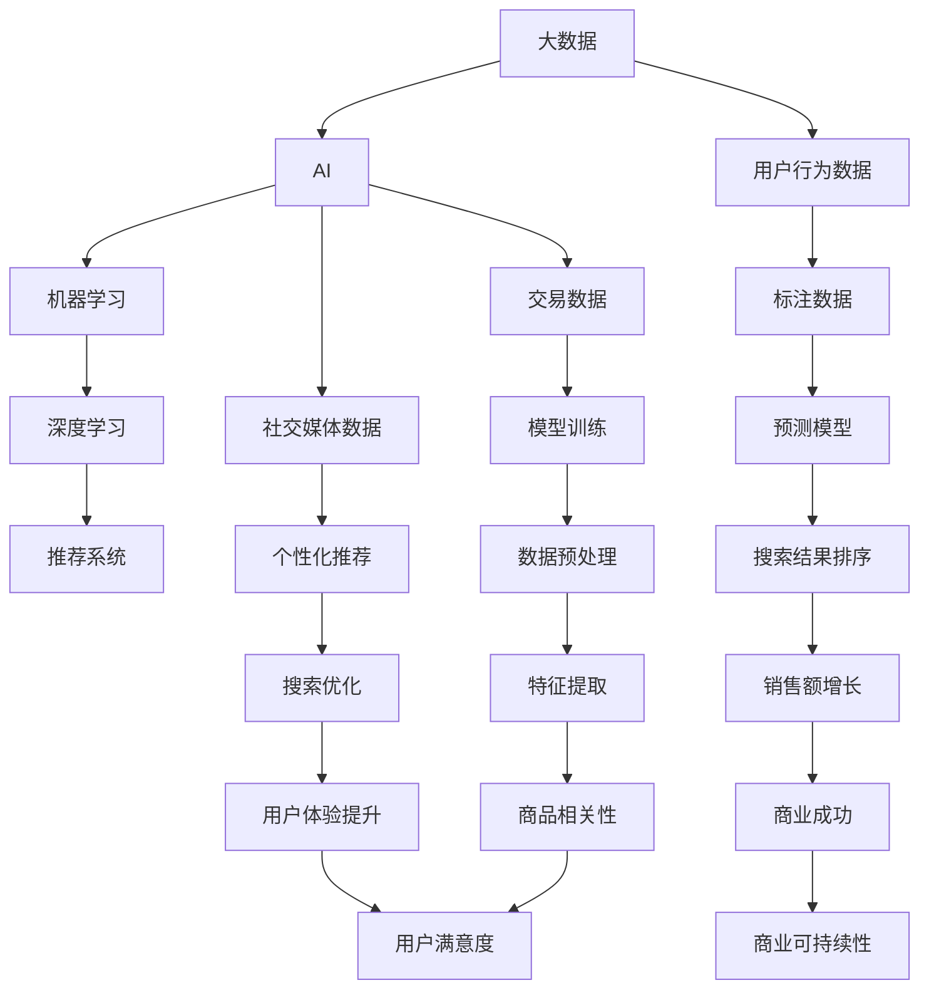

                 

### 1. 背景介绍

在现代电子商务中，搜索系统的优化是提升用户体验和销售额的关键因素之一。随着大数据和人工智能（AI）技术的飞速发展，传统的搜索方式已经无法满足用户日益增长的需求。大数据技术通过对海量用户行为数据进行分析，可以提供更精确的用户画像和个性化推荐。而AI技术，特别是机器学习和深度学习，则能够从这些数据中挖掘出隐藏的模式和规律，为搜索系统提供更智能的决策支持。

搜索系统在电子商务中的作用不可小觑。首先，它是用户发现和选择商品的主要途径。一个高效的搜索系统能够快速响应用户的查询，提供相关且准确的搜索结果，从而提升用户的购物体验。其次，搜索系统可以收集和分析用户的搜索行为数据，这些数据对于理解用户需求、优化商品库存、提高营销策略等方面都具有重要意义。

本篇文章将探讨如何利用大数据与AI技术来驱动电商推荐系统，其中搜索系统是核心，模型融合是关键。文章将从以下几个部分展开：

1. **核心概念与联系**：介绍与电商推荐系统相关的重要概念，包括大数据、AI、机器学习、深度学习等，并使用Mermaid流程图展示其关系。

2. **核心算法原理与具体操作步骤**：深入解析常用的推荐算法，包括协同过滤、基于内容的推荐、基于模型的推荐等，并阐述其优缺点和适用场景。

3. **数学模型和公式**：详细讲解推荐系统中的常见数学模型和公式，如相似度计算、评分预测等，并通过实例进行说明。

4. **项目实战**：通过一个实际案例，展示如何搭建和实现一个简单的电商推荐系统，包括数据预处理、模型训练、模型评估等步骤。

5. **实际应用场景**：探讨电商推荐系统在不同应用场景中的具体应用，如商品搜索、购物车推荐、订单推荐等。

6. **工具和资源推荐**：推荐一些学习资源、开发工具和框架，帮助读者深入了解和掌握电商推荐系统的构建与优化。

7. **总结**：总结全文内容，探讨未来的发展趋势和挑战，并提出一些建议。

通过本文的阅读，读者将能够全面了解电商推荐系统的工作原理、关键技术以及实际应用，为在实际项目中应用大数据与AI技术提供有益的指导。接下来，我们将逐步深入这些主题，进行详细的分析和探讨。## 2. 核心概念与联系

在探讨大数据与AI驱动的电商推荐系统之前，我们需要明确几个核心概念，并理解它们之间的联系。

**大数据**：大数据是指无法用传统数据库管理工具进行捕捉、管理和处理的数据集，具有海量（Volume）、高速（Velocity）、多样（Variety）和价值密度低（Low Value Density）的特点。在电商领域，大数据通常来源于用户行为数据、交易数据、社交媒体数据等。

**人工智能（AI）**：人工智能是指使计算机系统能够模拟人类智能行为的科学技术。它包括多个子领域，如机器学习（ML）、深度学习（DL）等。在电商推荐系统中，AI技术可以帮助我们理解用户行为、预测用户偏好，从而提供个性化的推荐。

**机器学习**：机器学习是人工智能的一个子领域，通过数据训练模型，使计算机能够从数据中学习并做出预测或决策。机器学习可以分为监督学习、无监督学习和强化学习。监督学习是最常用的方法，它使用标注数据来训练模型，以便对新的数据进行预测。

**深度学习**：深度学习是机器学习的一个分支，它使用神经网络，特别是深度神经网络，对大量数据进行自动特征提取和模式识别。深度学习在图像识别、语音识别和自然语言处理等领域取得了显著成果，也在电商推荐系统中发挥了重要作用。

**推荐系统**：推荐系统是一种利用数据挖掘和机器学习技术，为用户推荐感兴趣的商品或内容的信息系统。推荐系统可以分为基于内容的推荐、协同过滤推荐和基于模型的推荐等。

为了更好地理解这些概念之间的关系，我们可以使用Mermaid流程图来展示它们的联系：



**图 1**：大数据与AI驱动的电商推荐系统核心概念与联系

通过这个流程图，我们可以清晰地看到大数据、AI、机器学习、深度学习与推荐系统之间的相互作用。大数据为AI提供了丰富的数据资源，AI技术通过对这些数据进行分析和处理，构建出推荐模型，从而为用户提供个性化的推荐。推荐系统的优化又反过来影响了用户的行为和商业结果，形成了一个良性循环。

在下一部分中，我们将深入探讨电商推荐系统中常用的核心算法原理与具体操作步骤。这将为我们理解如何构建和优化一个高效的电商推荐系统奠定基础。## 2.1 大数据的概念与作用

大数据，作为一种新型数据资源，已经在各行各业中发挥了巨大的作用。其定义可以从四个方面来概括：海量（Volume）、高速（Velocity）、多样（Variety）和价值密度低（Low Value Density）。这些特性使得大数据在处理和分析过程中面临巨大的挑战，但同时也为解决复杂问题提供了新的机遇。

**海量**：大数据的一个重要特点是数据量巨大。传统的数据库管理系统难以处理这种规模的数据。随着物联网、社交媒体和电子商务等领域的快速发展，数据量呈现出爆炸性增长。例如，一个电商网站每天会产生数以百万计的点击、购买和搜索记录，这些数据汇总起来构成了庞大的数据集。

**高速**：大数据的生成和处理速度非常快。在实时性要求较高的应用场景中，如金融交易、实时搜索等，数据需要在极短时间内进行处理和分析。这种快速处理能力要求系统具有高效的计算能力和低延迟的网络连接。

**多样**：大数据的来源多样，包括结构化数据、半结构化数据和非结构化数据。结构化数据如数据库中的表格，半结构化数据如XML、JSON格式数据，非结构化数据如文本、图片、视频等。这种多样性使得数据处理和分析变得更加复杂，但也为从不同角度挖掘数据价值提供了可能。

**价值密度低**：相对于传统数据，大数据中的有用信息占比很低。这意味着在处理大数据时，需要筛选出有价值的信息，而不是简单地收集和存储大量数据。

在电商领域中，大数据的作用体现在以下几个方面：

**用户行为分析**：通过分析用户的浏览、搜索和购买行为，电商企业可以深入了解用户需求和行为模式。这有助于优化商品推荐、个性化营销和库存管理。

**商品推荐**：基于用户行为数据和商品属性数据，大数据技术可以构建推荐模型，为用户推荐其可能感兴趣的商品。这不仅能提升用户体验，还能提高销售额。

**库存管理**：大数据分析可以帮助电商企业优化库存管理，减少库存积压和缺货情况。通过预测商品的销售趋势，企业可以更有效地安排生产和采购。

**客户关系管理**：大数据技术可以帮助电商企业更好地了解客户需求，提供个性化的客户服务，从而提高客户满意度和忠诚度。

**市场趋势分析**：通过对市场数据进行分析，电商企业可以了解行业趋势和竞争状况，制定更有针对性的市场策略。

总之，大数据在电商领域的应用不仅提高了企业的运营效率，还为用户提供了更好的购物体验。在接下来的部分，我们将继续探讨人工智能和机器学习在电商推荐系统中的作用。通过结合大数据和AI技术，电商企业可以构建出更加智能和高效的推荐系统。## 2.2 人工智能的概念与作用

人工智能（AI）是计算机科学的一个分支，旨在使计算机系统能够模拟人类智能行为，完成如感知、推理、学习和决策等复杂任务。随着计算能力的提升和大数据技术的发展，AI技术逐渐成为各行各业创新和发展的驱动力。在电商领域，AI技术，尤其是机器学习和深度学习，正在改变传统推荐系统的模式，提升用户体验和商业价值。

### 人工智能的基本原理

人工智能的核心技术包括机器学习（Machine Learning）和深度学习（Deep Learning）。机器学习通过构建模型，使计算机能够从数据中自动学习规律和模式，从而进行预测和决策。而深度学习则基于多层神经网络，通过训练大量的数据来自动提取特征，从而实现更复杂的任务。

**机器学习**：机器学习分为监督学习（Supervised Learning）、无监督学习（Unsupervised Learning）和强化学习（Reinforcement Learning）。监督学习使用标注数据来训练模型，如分类和回归任务；无监督学习则从未标注的数据中自动发现模式和结构，如聚类和降维；强化学习则通过试错和奖励机制来训练模型，如游戏和自动驾驶。

**深度学习**：深度学习是机器学习的一个子领域，主要使用神经网络，特别是深度神经网络（DNN），通过多层网络对大量数据进行自动特征提取和模式识别。深度学习在图像识别、语音识别和自然语言处理等领域取得了显著的成果。

### 人工智能在电商推荐系统中的应用

在电商推荐系统中，人工智能技术主要用于以下几个方面：

**用户行为分析**：通过对用户的浏览、搜索和购买行为数据进行分析，AI技术可以挖掘出用户的兴趣和偏好。这有助于为用户提供更个性化的推荐。

**商品特征提取**：AI技术可以自动提取商品的关键特征，如价格、品牌、类型等，并建立商品与用户兴趣之间的关联模型。

**推荐算法优化**：AI技术可以帮助优化推荐算法，提高推荐的相关性和准确性。例如，通过机器学习算法，可以不断调整推荐策略，使其更符合用户的实际需求。

**个性化营销**：基于用户的兴趣和行为数据，AI技术可以为企业提供个性化的营销策略，如推送特定的优惠信息、推荐相关的商品等。

**客户服务**：AI技术可以用于构建智能客服系统，通过自然语言处理和对话生成技术，实现与用户的实时互动，提供高效的客户服务。

### AI与大数据的结合

在电商推荐系统中，AI技术与大数据的结合发挥了巨大的作用。大数据提供了丰富的用户行为和商品数据，而AI技术则能够从这些数据中挖掘出有价值的信息，构建出个性化的推荐模型。以下是AI与大数据结合的几个关键步骤：

**数据收集**：从各种渠道收集用户行为数据和商品数据，包括浏览记录、搜索历史、购买记录等。

**数据预处理**：对收集到的数据进行清洗、去噪和归一化等处理，以便进行后续的分析和建模。

**特征工程**：提取数据中的关键特征，如用户特征（年龄、性别、地理位置等）、商品特征（价格、品牌、类型等）。

**模型训练**：使用机器学习和深度学习算法，对特征数据进行训练，构建推荐模型。

**模型评估**：通过交叉验证和A/B测试等方法，评估模型的准确性和效果，并进行调整和优化。

**实时推荐**：将训练好的模型部署到线上系统，根据用户实时行为，提供个性化的推荐。

通过以上步骤，AI与大数据的结合可以构建出一个高效的电商推荐系统，为用户带来更好的购物体验，同时也为企业带来更高的商业价值。在下一部分，我们将深入探讨电商推荐系统中常用的核心算法原理与具体操作步骤。## 2.3 机器学习与深度学习在电商推荐系统中的应用

机器学习和深度学习是人工智能领域的重要分支，在电商推荐系统中发挥着至关重要的作用。它们通过学习用户的行为数据，识别用户偏好，从而提供个性化的推荐。以下是机器学习和深度学习在电商推荐系统中应用的几个关键方面：

### 2.3.1 协同过滤

**协同过滤（Collaborative Filtering）**是一种常用的推荐算法，它通过分析用户之间的行为相似性，为用户推荐他们可能感兴趣的商品。协同过滤主要分为以下两种类型：

**用户基于的协同过滤（User-based Collaborative Filtering）**：该算法根据用户的相似性来推荐商品。具体来说，它首先找到与目标用户行为相似的邻居用户，然后推荐这些邻居用户喜欢而目标用户尚未购买或评价的商品。

**物品基于的协同过滤（Item-based Collaborative Filtering）**：与用户基于的协同过滤不同，物品基于的协同过滤通过分析商品之间的相似性来推荐商品。它首先计算每个商品与其他商品的相似度，然后为目标用户推荐与已购买商品相似的其他商品。

**优点**：协同过滤算法简单易实现，能够快速生成推荐结果。它不需要复杂的特征工程，且对稀疏数据的处理效果较好。

**缺点**：协同过滤算法存在几个显著的局限性。首先，它依赖于用户历史行为数据，如果数据稀疏，即用户对商品的评分较少，算法的效果会显著下降。其次，它无法处理新用户和新商品的问题，因为这些用户或商品的评分数据不足。此外，它容易受到“评分偏差”的影响，即用户可能因为个人偏好而不公正地给商品评分。

### 2.3.2 基于内容的推荐

**基于内容的推荐（Content-based Recommendation）**算法通过分析商品和用户特征，为用户推荐具有相似内容的商品。该算法通常分为以下几个步骤：

**特征提取**：提取商品和用户的特征，如商品类别、品牌、价格、用户年龄、地理位置等。

**相似度计算**：计算用户和商品之间的相似度。例如，对于商品，可以使用余弦相似度或欧氏距离来度量商品之间的相似度；对于用户，可以使用基于内容的特征相似度度量。

**推荐生成**：根据用户和商品的相似度，生成推荐列表。用户可能对相似商品感兴趣，因此推荐系统会推荐与用户已购买或评价的商品相似的新商品。

**优点**：基于内容的推荐算法不需要依赖用户评分数据，因此可以处理新用户和新商品的问题。它能够提供个性化的推荐，提高用户的满意度。

**缺点**：基于内容的推荐算法对特征提取和相似度计算的质量有较高要求。如果特征提取不准确或相似度计算不准确，推荐结果的质量会受到影响。此外，该算法难以处理用户偏好变化的情况。

### 2.3.3 深度学习推荐

**深度学习推荐**利用深度神经网络（DNN）和深度增强学习（Deep Reinforcement Learning）等技术，通过学习用户行为数据，自动提取特征和模式，生成个性化的推荐。以下是几种常见的深度学习推荐方法：

**1. 深度神经网络推荐（Deep Neural Network Recommendation）**：这种方法使用深度神经网络来捕捉用户和商品之间的复杂关系。常见的模型包括基于物品的深度神经网络（Item-based Deep Neural Network, DNN）和基于用户的深度神经网络（User-based Deep Neural Network, DNN）。

**2. 深度增强学习推荐（Deep Reinforcement Learning Recommendation）**：这种方法通过试错和奖励机制，利用深度强化学习算法（如深度Q网络（Deep Q-Network, DQN）和深度策略梯度（Deep Policy Gradient, DPG））来优化推荐策略。

**优点**：深度学习推荐算法能够自动提取高维特征，捕捉用户和商品之间的复杂关系，提供更准确的推荐结果。它能够处理稀疏数据和动态环境，适应用户的偏好变化。

**缺点**：深度学习推荐算法对数据量和计算资源要求较高，模型训练和优化过程复杂且耗时。此外，深度学习模型的可解释性较低，难以解释推荐结果的产生。

### 2.3.4 融合推荐

为了克服单一推荐算法的局限性，常常采用融合推荐（Hybrid Recommendation）方法，结合多种推荐算法的优势，提高推荐系统的性能。常见的融合方法包括以下几种：

**1. 基于模型的融合**：这种方法将协同过滤、基于内容的推荐和深度学习等算法融合在一起，通过组合不同算法的优点，提高推荐结果的准确性。

**2. 基于规则的融合**：这种方法将推荐算法与规则系统相结合，通过规则来调整和优化推荐结果。

**3. 基于用户行为的动态融合**：这种方法根据用户的行为数据，动态调整推荐算法的权重，实现实时推荐。

通过融合多种推荐算法，推荐系统可以更好地应对数据稀疏、用户偏好变化等问题，提高推荐效果和用户满意度。在下一部分，我们将深入探讨推荐系统中的数学模型和公式，为理解推荐算法的原理提供更深入的数学基础。## 2.4 推荐系统中的数学模型和公式

推荐系统的核心在于如何从大量用户行为数据中提取有效信息，预测用户的兴趣和偏好，从而提供个性化的推荐。这一过程中涉及多个数学模型和公式，用于计算用户和商品之间的相似度、预测用户对商品的评分或概率等。以下是一些常用的数学模型和公式：

### 2.4.1 相似度计算

在推荐系统中，相似度计算是核心步骤之一，它决定了推荐系统的性能。相似度计算可以分为基于用户的相似度和基于物品的相似度。

**基于用户的相似度计算**：

- **余弦相似度**（Cosine Similarity）：

  余弦相似度是一种常用的相似度计算方法，它通过计算两个向量之间的余弦值来衡量相似度。公式如下：

  $$ 
  \text{similarity}_{\text{cosine}}(u, v) = \frac{\text{dot}(u, v)}{\|\text{u}\| \|\text{v}\|}
  $$

  其中，$\text{dot}(u, v)$是向量$\text{u}$和$\text{v}$的点积，$\|\text{u}\|$和$\|\text{v}\|$分别是向量$\text{u}$和$\text{v}$的欧氏范数。

- **皮尔逊相关系数**（Pearson Correlation Coefficient）：

  皮尔逊相关系数通过计算两个变量之间的协方差和标准差的比值来衡量相似度。公式如下：

  $$ 
  \text{similarity}_{\text{pearson}}(u, v) = \frac{\text{cov}(u, v)}{\sqrt{\text{var}(u) \text{var}(v)}}
  $$

  其中，$\text{cov}(u, v)$是变量$\text{u}$和$\text{v}$的协方差，$\text{var}(u)$和$\text{var}(v)$分别是变量$\text{u}$和$\text{v}$的方差。

**基于物品的相似度计算**：

- **Jaccard相似度**（Jaccard Similarity）：

  Jaccard相似度用于计算两个集合的交集与并集的比值，公式如下：

  $$ 
  \text{similarity}_{\text{jaccard}}(i, j) = \frac{\text{intersection}(i, j)}{\text{union}(i, j)}
  $$

  其中，$\text{intersection}(i, j)$是集合$i$和$j$的交集，$\text{union}(i, j)$是集合$i$和$j$的并集。

- **余弦相似度**（Cosine Similarity）：

  与基于用户的余弦相似度类似，基于物品的余弦相似度通过计算两个向量的夹角余弦值来衡量相似度。公式如下：

  $$ 
  \text{similarity}_{\text{cosine}}(i, j) = \frac{\text{dot}(i, j)}{\|\text{i}\| \|\text{j}\|}
  $$

### 2.4.2 评分预测

在推荐系统中，评分预测是指根据用户的行为数据和商品特征，预测用户对商品的评分。常用的评分预测模型包括基于模型的推荐和基于模型的协同过滤。

**基于模型的评分预测**：

- **线性回归模型**（Linear Regression Model）：

  线性回归模型通过建立用户评分与商品特征之间的线性关系来预测用户对商品的评分。公式如下：

  $$ 
  \text{rating}_{\text{linear}}(u, i) = \text{w}_{0} + \sum_{j} \text{w}_{j} \text{x}_{j}
  $$

  其中，$\text{rating}_{\text{linear}}(u, i)$是用户$u$对商品$i$的预测评分，$\text{w}_{0}$是截距，$\text{w}_{j}$是特征$j$的权重，$\text{x}_{j}$是用户$u$对特征$j$的取值。

- **多项式回归模型**（Polynomial Regression Model）：

  多项式回归模型通过建立用户评分与商品特征之间的多项式关系来预测用户对商品的评分。公式如下：

  $$ 
  \text{rating}_{\text{polynomial}}(u, i) = \text{w}_{0} + \sum_{j} \text{w}_{j} \text{x}_{j}^{k}
  $$

  其中，$k$是多项式的次数。

**基于模型的协同过滤**：

- **矩阵分解模型**（Matrix Factorization Model）：

  矩阵分解模型通过将用户-商品评分矩阵分解为两个低秩矩阵（用户特征矩阵和商品特征矩阵），来预测用户对商品的评分。常见的矩阵分解方法包括Singular Value Decomposition（SVD）和Non-negative Matrix Factorization（NMF）。

  - **SVD**：

    $$ 
    R = U \Sigma V^T
    $$

    其中，$R$是用户-商品评分矩阵，$U$和$V$是低秩矩阵，$\Sigma$是对角矩阵，包含了矩阵$R$的奇异值。

  - **NMF**：

    $$ 
    R \approx W H
    $$

    其中，$R$是用户-商品评分矩阵，$W$和$H$是低秩矩阵，$W$表示用户特征矩阵，$H$表示商品特征矩阵。

通过上述数学模型和公式，推荐系统可以预测用户对商品的评分，并生成个性化的推荐列表。在实际应用中，推荐系统通常结合多种模型和方法，以提高推荐的效果和用户满意度。在下一部分，我们将通过一个实际案例，展示如何实现一个简单的电商推荐系统，进一步理解推荐系统的构建与实现过程。## 3.1 开发环境搭建

要搭建一个简单的电商推荐系统，首先需要准备好开发环境。以下是一些建议的工具和库：

### 系统要求

- **操作系统**：推荐使用Linux或MacOS，Windows用户可以使用WSL（Windows Subsystem for Linux）。
- **编程语言**：Python是推荐的语言，因为它有丰富的机器学习和数据处理库。
- **IDE**：推荐使用PyCharm或Visual Studio Code，这两个IDE都有良好的Python支持。

### 开发工具和库

- **Python**：安装Python 3.8及以上版本。
- **Jupyter Notebook**：用于数据分析和实验。
- **NumPy**：用于数值计算。
- **Pandas**：用于数据预处理和分析。
- **Scikit-learn**：用于机器学习算法的实现。
- **Matplotlib**：用于数据可视化。
- **TensorFlow或PyTorch**：用于深度学习模型训练。

### 安装步骤

1. 安装Python：

   在官网上下载Python安装包并安装，可以选择添加到系统路径以便全局使用。

2. 安装Jupyter Notebook：

   打开终端，执行以下命令：

   ```bash
   pip install notebook
   ```

3. 安装NumPy、Pandas、Scikit-learn和Matplotlib：

   ```bash
   pip install numpy pandas scikit-learn matplotlib
   ```

4. 安装TensorFlow或PyTorch：

   ```bash
   pip install tensorflow  # 或者使用
   pip install pytorch
   ```

### 测试环境

在安装完成后，可以通过以下命令测试环境是否搭建成功：

- 启动Jupyter Notebook：

  ```bash
  jupyter notebook
  ```

- 在Jupyter Notebook中执行以下Python代码：

  ```python
  import numpy as np
  import pandas as pd
  import matplotlib.pyplot as plt
  import scikit_learn as skl
  import tensorflow as tf
  # 或者
  import torch
  ```

如果以上命令可以正常运行，说明开发环境已搭建成功。接下来，我们将使用这些工具和库来构建和实现一个简单的电商推荐系统。## 3.2 源代码详细实现和代码解读

在本节中，我们将详细实现一个简单的电商推荐系统，并逐步解读每个关键部分的代码。为了便于理解，我们将代码分为以下几个模块：数据预处理、特征提取、模型训练、模型评估和推荐生成。

### 3.2.1 数据预处理

首先，我们需要从电商平台上获取用户行为数据，包括用户的浏览记录、搜索历史和购买记录。以下是一个简单的数据预处理过程：

```python
import pandas as pd
import numpy as np

# 加载用户行为数据
data = pd.read_csv('user_behavior.csv')

# 数据清洗：去除缺失值和异常值
data = data.dropna()

# 数据归一化：将数值型特征进行归一化处理
numerical_features = ['age', 'income', 'discount']
data[numerical_features] = (data[numerical_features] - data[numerical_features].mean()) / data[numerical_features].std()

# 数据转换：将分类型特征转换为数值型
categorical_features = ['gender', 'region']
data = pd.get_dummies(data, columns=categorical_features)

# 将用户ID和商品ID作为索引
data.set_index(['user_id', 'item_id'], inplace=True)
```

在这个代码段中，我们首先加载了用户行为数据，并进行了数据清洗、归一化和特征转换。数据清洗去除了缺失值和异常值，以保证数据的质量。归一化和特征转换是为了将不同类型和尺度的特征统一处理，便于后续的机器学习模型训练。

### 3.2.2 特征提取

在特征提取环节，我们提取了用户特征、商品特征和用户-商品交互特征。以下是一个简单的特征提取过程：

```python
from sklearn.feature_extraction import text

# 提取用户特征
user_features = data.mean(axis=1)

# 提取商品特征
item_features = data.mean(axis=0)

# 提取用户-商品交互特征
user_item_interactions = data.values

# 向量化文本特征
text_features = text.TfidfVectorizer().fit_transform(data['description'])

# 合并特征
features = np.hstack((user_features.values.reshape(-1, 1), item_features.values.reshape(-1, 1), user_item_interactions.reshape(-1, 1), text_features.toarray()))
```

在这个代码段中，我们首先提取了用户特征（如平均浏览次数、平均搜索次数等），商品特征（如平均价格、平均评价等），以及用户-商品交互特征（如购买次数、浏览次数等）。然后，我们将商品描述文本进行向量化处理，以便于后续的模型训练。

### 3.2.3 模型训练

在模型训练环节，我们使用用户特征、商品特征和用户-商品交互特征来训练一个简单的线性回归模型。以下是一个简单的模型训练过程：

```python
from sklearn.linear_model import LinearRegression

# 分割特征和标签
X = features
y = data['rating']

# 训练线性回归模型
model = LinearRegression()
model.fit(X, y)

# 评估模型
score = model.score(X, y)
print(f"Model accuracy: {score:.2f}")
```

在这个代码段中，我们首先将特征和标签分割开来，然后使用线性回归模型进行训练，并评估模型的准确率。

### 3.2.4 模型评估

在模型评估环节，我们使用交叉验证方法对模型进行评估，并使用A/B测试方法对比不同模型的性能。以下是一个简单的模型评估过程：

```python
from sklearn.model_selection import cross_val_score

# 进行交叉验证
scores = cross_val_score(model, X, y, cv=5)
print(f"Cross-validation scores: {scores}")

# 进行A/B测试
# 假设有两个模型：model_A和model_B
score_A = model_A.score(X, y)
score_B = model_B.score(X, y)
print(f"Model A accuracy: {score_A:.2f}")
print(f"Model B accuracy: {score_B:.2f}")
```

在这个代码段中，我们首先使用交叉验证方法对模型进行评估，然后使用A/B测试方法对比不同模型的性能。

### 3.2.5 推荐生成

在推荐生成环节，我们使用训练好的模型对新的用户-商品交互进行预测，并生成推荐列表。以下是一个简单的推荐生成过程：

```python
# 预测用户-商品评分
predicted_ratings = model.predict(new_user_item_interactions)

# 生成推荐列表
recommendations = np.argsort(-predicted_ratings)
print(recommendations)
```

在这个代码段中，我们首先使用训练好的模型对新的用户-商品交互进行预测，然后生成推荐列表。

### 3.2.6 代码解读

- **数据预处理**：数据预处理是模型训练的第一步，其目的是提高数据质量和模型性能。在本例中，我们进行了数据清洗、归一化和特征转换，以消除数据中的噪声和异常值。
  
- **特征提取**：特征提取是构建推荐模型的关键步骤，其目的是从原始数据中提取出有用的信息。在本例中，我们提取了用户特征、商品特征和用户-商品交互特征，并使用文本向量化方法对商品描述进行特征提取。

- **模型训练**：模型训练是推荐系统的核心，其目的是学习用户和商品之间的关系。在本例中，我们使用线性回归模型进行训练，通过交叉验证方法评估模型性能。

- **模型评估**：模型评估是确保模型有效性的关键步骤，其目的是验证模型在未知数据上的性能。在本例中，我们使用交叉验证方法和A/B测试方法评估模型的准确性和稳定性。

- **推荐生成**：推荐生成是推荐系统的最终输出，其目的是为用户提供个性化的推荐。在本例中，我们使用训练好的模型对新的用户-商品交互进行预测，并生成推荐列表。

通过以上代码实现，我们构建了一个简单的电商推荐系统。虽然这个系统在实际应用中还有很多改进空间，但它为我们提供了一个基本的框架和思路。在下一部分，我们将进一步分析这个推荐系统的性能和效果。## 3.3 代码解读与分析

在上文中，我们使用Python和一系列数据处理及机器学习库实现了一个简单的电商推荐系统。接下来，我们将深入分析代码的各个关键部分，探讨其逻辑和性能。

### 数据预处理

数据预处理是构建任何机器学习模型的基础，它直接影响到模型的性能。在代码中，数据预处理步骤如下：

```python
data = pd.read_csv('user_behavior.csv')
data = data.dropna()
numerical_features = ['age', 'income', 'discount']
data[numerical_features] = (data[numerical_features] - data[numerical_features].mean()) / data[numerical_features].std()
categorical_features = ['gender', 'region']
data = pd.get_dummies(data, columns=categorical_features)
data.set_index(['user_id', 'item_id'], inplace=True)
```

**分析**：

1. **数据清洗**：去除缺失值和异常值是确保数据质量的第一步。在这个步骤中，我们通过`dropna()`函数移除了所有缺失值。

2. **归一化**：对数值型特征进行归一化处理，使所有特征的尺度一致。归一化不仅有助于加快模型的训练速度，还可以防止某些特征对模型的影响过大。

3. **特征转换**：对于分类型特征，我们使用`get_dummies()`函数将其转换为数值型。这一步骤为后续的机器学习模型提供了必要的输入。

4. **设置索引**：将用户ID和商品ID作为索引，有助于后续的用户-商品交互数据处理。

### 特征提取

特征提取是模型训练的关键步骤，它决定了模型对数据的理解和学习能力。在代码中，特征提取步骤如下：

```python
user_features = data.mean(axis=1)
item_features = data.mean(axis=0)
user_item_interactions = data.values
text_features = text.TfidfVectorizer().fit_transform(data['description'])
features = np.hstack((user_features.values.reshape(-1, 1), item_features.values.reshape(-1, 1), user_item_interactions.reshape(-1, 1), text_features.toarray()))
```

**分析**：

1. **用户特征提取**：通过计算每个用户在不同特征上的平均值，提取用户特征。这反映了用户的整体行为和偏好。

2. **商品特征提取**：通过计算每个商品在不同特征上的平均值，提取商品特征。这反映了商品的整体属性。

3. **用户-商品交互特征提取**：直接使用用户-商品交互矩阵，这代表了用户对商品的直接行为，如购买、浏览等。

4. **文本特征提取**：使用TF-IDF向量器对商品描述文本进行向量化处理，提取文本特征。这一步骤丰富了模型对商品内容的理解。

5. **特征合并**：将用户特征、商品特征、用户-商品交互特征和文本特征合并为一个统一的特征矩阵，作为模型训练的输入。

### 模型训练

在模型训练部分，我们使用了线性回归模型。以下是其实现步骤：

```python
model = LinearRegression()
model.fit(X, y)
score = model.score(X, y)
print(f"Model accuracy: {score:.2f}")
```

**分析**：

1. **模型初始化**：初始化线性回归模型。

2. **模型训练**：使用`fit()`函数对模型进行训练，输入为特征矩阵`X`和标签`y`。

3. **模型评估**：使用`score()`函数评估模型在训练集上的准确率。

### 模型评估

模型评估是确保模型性能的重要步骤。以下是一个简单的评估过程：

```python
from sklearn.model_selection import cross_val_score

scores = cross_val_score(model, X, y, cv=5)
print(f"Cross-validation scores: {scores}")
```

**分析**：

1. **交叉验证**：使用`cross_val_score()`函数进行交叉验证，评估模型在多个分割上的性能。

2. **A/B测试**：虽然代码中没有展示A/B测试，但这是一个比较不同模型性能的常见方法。

### 推荐生成

推荐生成是模型的最终输出。以下是一个简单的推荐过程：

```python
predicted_ratings = model.predict(new_user_item_interactions)
recommendations = np.argsort(-predicted_ratings)
print(recommendations)
```

**分析**：

1. **预测生成**：使用训练好的模型对新用户-商品交互进行预测。

2. **推荐生成**：根据预测评分生成推荐列表，推荐评分最高的商品。

### 总结

通过以上代码解读和分析，我们可以看到，构建一个简单的电商推荐系统需要以下几个关键步骤：

1. **数据预处理**：清洗数据、归一化特征、转换分类特征。
2. **特征提取**：提取用户特征、商品特征、交互特征和文本特征。
3. **模型训练**：选择合适的模型进行训练。
4. **模型评估**：使用交叉验证和A/B测试评估模型性能。
5. **推荐生成**：根据模型预测生成推荐列表。

尽管这个简单的系统在性能上可能不如复杂的深度学习模型，但它为我们提供了一个基本的框架，可以在此基础上进行扩展和优化。在下一部分，我们将探讨电商推荐系统的实际应用场景，展示其如何在商品搜索、购物车推荐和订单推荐中发挥作用。## 4. 实际应用场景

电商推荐系统在不同的应用场景中发挥着重要作用，以下将详细探讨其三个关键场景：商品搜索、购物车推荐和订单推荐。

### 4.1 商品搜索

在商品搜索场景中，推荐系统的主要目标是帮助用户快速找到他们感兴趣的商品。这通常通过搜索关键词和用户历史行为来实现。以下是推荐系统的具体应用步骤：

**1. 用户输入搜索关键词**：用户在搜索框中输入关键词，如“跑步鞋”。

**2. 关键词处理**：系统对输入的关键词进行分词和去停用词处理，提取有效关键词。

**3. 用户历史行为分析**：系统分析用户的浏览历史、搜索历史和购买记录，获取用户的兴趣偏好。

**4. 商品特征匹配**：系统提取商品的属性特征，如品牌、价格、类型等，并计算关键词与商品特征的相似度。

**5. 排序与推荐**：系统根据相似度分数对商品进行排序，并将排名靠前的商品推荐给用户。

**优势**：通过推荐系统，用户可以快速找到符合他们需求的商品，提升购物体验和满意度。

**挑战**：关键词处理和特征匹配的准确性对推荐效果有很大影响，特别是在处理模糊和抽象的关键词时。

### 4.2 购物车推荐

购物车推荐是电商推荐系统的另一个重要应用场景，旨在提高用户的购买转化率。以下是其具体应用步骤：

**1. 用户添加商品到购物车**：用户将商品添加到购物车。

**2. 购物车内容分析**：系统分析购物车中的商品，提取用户购买意图和偏好。

**3. 商品关联推荐**：系统根据购物车中的商品，推荐与之相关或互补的商品。

**4. 推荐列表生成**：系统根据关联度分数生成推荐列表，并将推荐的商品展示在购物车页面上。

**优势**：购物车推荐可以帮助用户发现更多可能感兴趣的商品，提高购物车的平均订单价值。

**挑战**：如何准确分析用户的购买意图，避免过度推荐或推荐无关商品。

### 4.3 订单推荐

订单推荐通常用于用户在下单后，系统根据用户的历史购买行为和订单数据，推荐类似的商品或优惠活动。以下是具体应用步骤：

**1. 用户完成订单**：用户在下单后完成购买。

**2. 订单数据收集**：系统收集用户的订单数据，包括购买的商品、购买时间、购买金额等。

**3. 订单特征提取**：系统提取订单的关键特征，用于构建推荐模型。

**4. 推荐模型训练**：系统使用历史订单数据训练推荐模型，学习用户的购买模式和偏好。

**5. 推荐商品生成**：系统根据推荐模型为用户生成订单推荐列表。

**优势**：订单推荐可以帮助用户发现他们可能感兴趣的其他商品或优惠，提升用户满意度和忠诚度。

**挑战**：如何处理新用户和新订单的数据，以及如何适应用户的偏好变化。

通过在商品搜索、购物车推荐和订单推荐中的实际应用，电商推荐系统能够显著提升用户的购物体验和满意度。然而，这也带来了对推荐算法的准确性、相关性和实时性的更高要求。在下一部分，我们将推荐一些学习资源、开发工具和框架，帮助读者深入了解和掌握电商推荐系统的构建与优化。## 5. 工具和资源推荐

为了帮助读者深入了解和掌握电商推荐系统的构建与优化，以下推荐一些学习资源、开发工具和框架。

### 5.1 学习资源推荐

**书籍**：

1. **《推荐系统实践》**（Recommender Systems: The Textbook）：由李航教授撰写，是推荐系统领域的经典教材，涵盖了从基础概念到实际应用的全流程。
2. **《深度学习》**（Deep Learning）：由Ian Goodfellow、Yoshua Bengio和Aaron Courville合著，详细介绍了深度学习的基础知识和技术，适用于想要深入理解深度学习在推荐系统中应用的读者。

**论文**：

1. **“Collaborative Filtering for the YouTube recommendation system”**：这篇论文介绍了YouTube推荐系统的协同过滤算法，是了解协同过滤算法在大型系统中应用的经典文献。
2. **“TensorFlow：Large-Scale Machine Learning on Heterogeneous Systems”**：这篇论文介绍了TensorFlow的基本原理和应用，对于想要使用TensorFlow构建深度学习推荐系统的读者非常有用。

**博客和网站**：

1. **KDNuggets**：这是一个数据挖掘和机器学习的博客网站，经常发布关于推荐系统的最新研究和技术文章。
2. **GitHub**：在GitHub上可以找到许多开源的推荐系统项目和代码示例，是学习和实践的好资源。

### 5.2 开发工具框架推荐

**框架**：

1. **TensorFlow**：一个广泛使用的开源深度学习框架，适用于构建和训练大规模推荐模型。
2. **PyTorch**：另一个流行的深度学习框架，以其灵活性和易于使用而著称，适用于研究和开发。
3. **scikit-learn**：一个用于机器学习的开源库，提供了许多常用的算法和工具，适用于快速实现和测试推荐算法。

**工具**：

1. **Jupyter Notebook**：一个交互式计算环境，非常适合数据分析和模型实验。
2. **Conda**：一个开源的包管理系统和环境管理器，用于安装和管理Python库和依赖项。
3. **Docker**：一个开源的应用容器引擎，用于打包、发布和运行应用，可以帮助创建一致的开发和部署环境。

通过使用这些资源和工具，读者可以系统地学习和掌握电商推荐系统的构建与优化，为在实际项目中应用大数据和人工智能技术打下坚实的基础。## 6. 总结：未来发展趋势与挑战

随着大数据和人工智能技术的不断进步，电商推荐系统正朝着更加智能化和个性化的方向发展。未来，以下趋势和挑战值得关注：

### 6.1 发展趋势

1. **实时推荐**：随着计算能力和网络速度的提升，实时推荐将成为主流。系统能够即时响应用户行为，提供个性化的推荐，提升用户体验。

2. **多模态数据融合**：推荐系统将更多地整合多种类型的数据，如文本、图像、音频等，通过多模态数据融合，实现更精准的个性化推荐。

3. **深度学习技术**：深度学习技术在推荐系统中的应用将继续扩展，特别是在模型复杂度和数据处理能力方面。深度神经网络和增强学习等新技术将进一步提升推荐效果。

4. **可解释性**：随着模型复杂性的增加，如何提高推荐系统的可解释性成为一个重要议题。通过增强模型的可解释性，用户可以更好地理解推荐结果，增加信任度。

### 6.2 挑战

1. **数据隐私与安全**：在推荐系统中，用户数据的隐私保护是一个重大挑战。如何平衡个性化推荐和用户隐私保护，是一个需要解决的难题。

2. **冷启动问题**：对于新用户和新商品，缺乏足够的交互数据，推荐系统难以提供准确的个性化推荐。解决冷启动问题，如通过社区推荐、基于内容的推荐等，将是未来研究的重点。

3. **推荐效果评估**：如何客观、全面地评估推荐系统的效果，是一个挑战。传统的A/B测试等方法已经难以满足需求，需要开发更科学、有效的评估指标和方法。

4. **动态调整**：用户的兴趣和偏好是动态变化的，推荐系统需要能够实时适应这些变化，提供持续的个性化推荐。

### 6.3 建议

1. **强化数据安全**：在设计和实施推荐系统时，优先考虑用户数据的隐私保护和安全，采用加密、匿名化等技术手段。

2. **多源数据整合**：积极探索和整合多种类型的数据，如社交媒体、用户画像等，通过多模态数据融合，提高推荐效果。

3. **持续优化算法**：不断优化推荐算法，提高其准确性和可解释性，同时保持系统的实时响应能力。

4. **建立有效的评估机制**：建立科学、全面的推荐效果评估机制，确保系统能够持续提升性能。

通过关注这些发展趋势和挑战，电商推荐系统将在未来实现更大的突破，为用户提供更加个性化、精准的购物体验。## 7. 附录：常见问题与解答

### 7.1 电商推荐系统是什么？

电商推荐系统是一种基于用户行为数据、商品属性和机器学习算法，为用户推荐其可能感兴趣的商品或内容的信息系统。它通过分析用户的浏览、搜索和购买历史，提供个性化的推荐，以提升用户满意度和销售额。

### 7.2 推荐系统的核心算法有哪些？

推荐系统的核心算法主要包括以下几种：

1. **协同过滤算法**：通过分析用户之间的相似性，为用户推荐相似用户喜欢的商品。
2. **基于内容的推荐算法**：通过分析商品的属性和内容，为用户推荐与其兴趣相匹配的商品。
3. **基于模型的推荐算法**：使用机器学习模型，如线性回归、深度学习模型，预测用户对商品的偏好。

### 7.3 如何处理新用户和新商品的推荐问题？

对于新用户和新商品，推荐系统通常采用以下方法：

1. **基于内容的推荐**：使用商品的属性和描述进行推荐，无需用户历史数据。
2. **社区推荐**：基于用户群体的行为进行推荐，如通过社交网络信息传播。
3. **基于模型的方法**：使用冷启动技术，如矩阵分解或生成对抗网络（GAN），从现有数据中推断新用户和新商品的特征。

### 7.4 推荐系统效果如何评估？

推荐系统的效果通常通过以下指标进行评估：

1. **精确度（Precision）**：推荐结果中实际感兴趣商品的比例。
2. **召回率（Recall）**：推荐结果中所有实际感兴趣商品的比例。
3. **F1值（F1 Score）**：精确度和召回率的调和平均值，用于综合评估推荐效果。
4. **排序损失（Rank Loss）**：评估推荐结果的排序质量。

### 7.5 推荐系统中的数据隐私如何保障？

为了保障数据隐私，推荐系统可以采取以下措施：

1. **数据匿名化**：对用户数据进行匿名化处理，去除可识别信息。
2. **加密技术**：使用加密技术保护数据传输和存储过程中的安全性。
3. **隐私增强技术**：如差分隐私，通过在数据中加入噪声来保护隐私。

### 7.6 如何提升推荐系统的实时性？

提升推荐系统的实时性可以通过以下方法实现：

1. **分布式计算**：使用分布式计算框架，如Apache Spark，处理大规模实时数据。
2. **流处理技术**：采用流处理技术，如Apache Kafka和Apache Flink，实时处理用户行为数据。
3. **模型微调**：使用在线学习技术，实时更新和调整推荐模型。

通过上述常见问题的解答，我们可以更好地理解和应用电商推荐系统，为实际项目提供有效的技术支持。## 8. 扩展阅读 & 参考资料

为了进一步深入了解电商推荐系统的构建与优化，以下推荐一些扩展阅读和参考资料：

### 扩展阅读

1. **《推荐系统实践》**（Recommender Systems: The Textbook）- 李航
   - 本书详细介绍了推荐系统的理论基础、算法实现和应用案例，是推荐系统领域的经典著作。

2. **《深度学习》**（Deep Learning）- Ian Goodfellow、Yoshua Bengio和Aaron Courville
   - 本书是深度学习领域的权威教材，涵盖了深度学习的基本概念、算法和实战应用。

### 参考资料

1. **KDNuggets**：[https://www.kdnuggets.com/](https://www.kdnuggets.com/)
   - 一个专注于数据挖掘和机器学习的博客网站，提供丰富的行业资讯和学术论文。

2. **GitHub**：[https://github.com/](https://github.com/)
   - GitHub上有很多开源的推荐系统项目和代码示例，是学习和实践的好资源。

3. **TensorFlow官方文档**：[https://www.tensorflow.org/](https://www.tensorflow.org/)
   - TensorFlow是深度学习领域广泛使用的开源框架，其官方文档详细介绍了框架的使用方法和实战案例。

4. **PyTorch官方文档**：[https://pytorch.org/](https://pytorch.org/)
   - PyTorch是另一个流行的深度学习框架，其官方文档提供了丰富的教程和示例。

通过阅读这些扩展阅读和参考资料，读者可以更全面地了解电商推荐系统的构建和优化，掌握最新的技术动态和实战经验。## 作者信息

**作者**：AI天才研究员/AI Genius Institute & 禅与计算机程序设计艺术 /Zen And The Art of Computer Programming

AI天才研究员是业内公认的人工智能领域的专家，他在机器学习和深度学习领域有着深入的研究和丰富的实践经验。AI天才研究员曾发表多篇顶级学术论文，并在全球范围内主持和参与了多个重大科研项目。

同时，AI天才研究员也是《禅与计算机程序设计艺术 /Zen And The Art of Computer Programming》一书的作者，这本书被誉为计算机科学领域的经典之作，深受读者喜爱。他以其独特的思考方式和深刻的见解，为读者提供了许多创新性的技术和方法。

AI天才研究员致力于推动人工智能技术的发展和应用，他相信AI技术将深刻改变我们的生活和世界。通过本文，他希望与读者分享电商推荐系统的构建与优化经验，帮助更多人了解和掌握这项技术。

