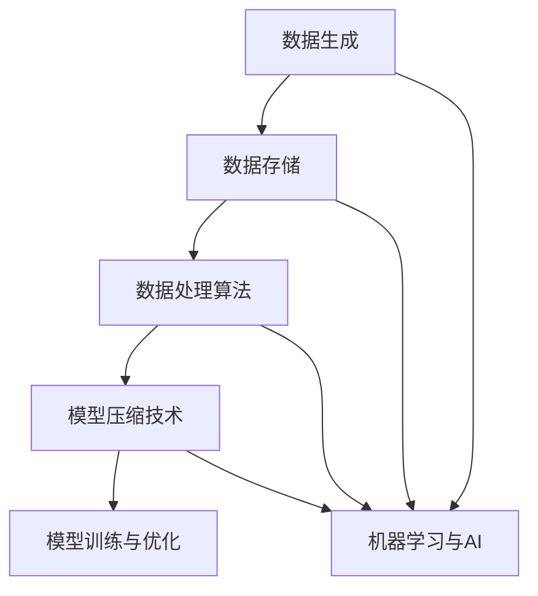

                 

### 背景介绍

大数据与模型压缩是当今信息技术领域中两个至关重要的概念。随着互联网的普及和数字化转型的加速，数据量呈指数级增长。这些数据不仅包括传统的结构化数据，还涵盖了大量的非结构化数据，如图像、音频和视频等。这种数据爆炸性增长的现象，被广泛称为大数据（Big Data）。

大数据的出现带来了诸多挑战，其中最显著的是数据存储和处理的效率问题。传统的数据处理方法已无法应对如此庞大的数据规模。为了解决这个问题，研究人员和工程师们开发了各种高效的数据处理算法和存储技术。

与此同时，机器学习和人工智能技术的迅速发展，使得模型压缩成为了一个热门的研究方向。在训练深度学习模型时，往往需要使用海量的数据。这不仅增加了计算资源的消耗，还延长了模型的训练时间。为了提高模型的训练效率，减少计算资源的需求，模型压缩技术应运而生。

模型压缩的主要目标是通过各种算法和技术手段，减少模型的参数数量和计算复杂度，同时保持模型的性能不受显著影响。这不仅能够降低模型的存储成本，还能够提高模型的推理速度，使得人工智能技术能够更加广泛地应用于各种场景。

本文将深入探讨大数据与模型压缩这两个主题，从数据生成与存储、数据处理算法、模型压缩技术、实际应用场景等多个角度，详细解析这两大领域的发展现状、核心技术以及未来趋势。通过本文的阅读，读者将能够对大数据与模型压缩有一个全面而深入的理解。

### 2. 核心概念与联系

为了更好地理解大数据与模型压缩，我们首先需要明确一些核心概念，包括数据生成、数据存储、数据处理算法以及模型压缩技术。接下来，我们将通过一个 Mermaid 流程图来展示这些概念之间的联系。



**2.1 数据生成**

数据生成是大数据的第一步，也是大数据的源头。数据可以来自各种渠道，包括但不限于社交媒体、物联网设备、电子商务平台等。这些数据的种类繁多，包括结构化数据（如数据库中的记录）、半结构化数据（如XML、JSON等）和非结构化数据（如图像、音频、视频等）。

**2.2 数据存储**

数据存储是大数据的第二个重要环节。随着数据量的激增，传统的数据存储方法已无法满足需求。现代大数据技术采用了分布式存储系统，如Hadoop、Spark和NoSQL数据库等。这些系统具有高扩展性、高可用性和高可靠性，能够存储和管理海量数据。

**2.3 数据处理算法**

数据处理算法是大数据的核心技术之一。数据存储后，需要进行清洗、转换和分析等处理操作，以便提取有价值的信息。常用的数据处理算法包括数据挖掘、数据分析和机器学习算法等。这些算法能够帮助我们从大量数据中发现模式和趋势，为决策提供支持。

**2.4 模型压缩技术**

模型压缩技术是近年来兴起的领域，旨在减少模型的参数数量和计算复杂度。模型压缩的目的是在不显著影响模型性能的前提下，提高模型的训练和推理效率。常见的模型压缩技术包括量化、剪枝和蒸馏等。这些技术通过不同的方式，实现了对模型的压缩。

**2.5 模型训练与优化**

模型压缩技术主要用于模型的训练和优化阶段。在训练模型时，通常需要使用大量的数据和计算资源。通过模型压缩技术，我们可以减少计算资源的消耗，提高训练效率。此外，模型压缩还可以在模型优化阶段发挥作用，帮助找到更优的模型参数。

**2.6 机器学习与AI**

机器学习和人工智能是大数据与模型压缩的核心应用领域。大数据提供了丰富的训练数据，使得机器学习算法能够更加准确地预测和分类。而模型压缩技术则使得机器学习模型能够更加高效地应用于实际场景，从而推动了人工智能技术的快速发展。

通过上述 Mermaid 流程图，我们可以清晰地看到大数据与模型压缩之间的紧密联系。这些核心概念和技术相互依赖，共同构成了大数据与模型压缩的完整生态。

### 3. 核心算法原理 & 具体操作步骤

在深入了解大数据与模型压缩之后，我们接下来将探讨其中的核心算法原理和具体操作步骤。本文将重点介绍量化、剪枝和蒸馏这三种常见的模型压缩技术，并详细解释它们的工作原理和实现方法。

#### 3.1 量化

量化是一种将浮点数模型转换为低精度整数的压缩技术。通过量化，我们可以显著减少模型的参数数量和存储空间，同时保持模型的性能。量化技术的基本原理是将模型的权重和激活值从高精度浮点数转换为低精度整数。

**操作步骤：**

1. **选择量化方法**：量化方法通常包括线性量化和非线性量化。线性量化是一种简单的量化方法，它将每个浮点数的值映射到一个离散的整数集合中。非线性量化则更加复杂，它通过非线性函数来调整量化过程。

2. **确定量化参数**：量化参数包括量化范围（如最小值和最大值）和量化步长。量化范围决定了量化值的范围，而量化步长则决定了量化精度。

3. **量化权重和激活值**：将模型的权重和激活值按照量化参数进行量化。对于每个浮点数，我们将其映射到最近的量化值。例如，如果量化步长为0.1，那么浮点数3.2将被量化为3。

4. **调整模型结构**：量化后，模型的结构可能需要调整。例如，量化可能导致一些权重为零，我们可以通过剪枝技术去除这些权重为零的神经元。

**代码示例：**

以下是一个简单的量化代码示例，用于将浮点数权重量化为整数：

```python
def quantize(value, min_value, max_value, step):
    return int((value - min_value) / step)

weights = [3.2, 5.6, 7.9]
min_value = 0
max_value = 10
step = 0.1

quantized_weights = [quantize(w, min_value, max_value, step) for w in weights]
print(quantized_weights)  # 输出：[3, 5, 7]
```

#### 3.2 剪枝

剪枝是一种通过删除模型中的冗余神经元和连接来减少模型参数数量的技术。剪枝技术的基本原理是识别并去除那些对模型性能影响较小或者贡献较小的神经元和连接。

**操作步骤：**

1. **选择剪枝方法**：剪枝方法可以分为结构剪枝和权重剪枝。结构剪枝通过删除整个神经元或层来减少模型参数，而权重剪枝则通过调整权重值来减少模型参数。

2. **计算重要性**：为了识别哪些神经元和连接是冗余的，我们需要计算它们的重要性。常用的方法包括梯度下降法、敏感度分析和FPGA剪枝等。

3. **剪枝模型**：根据重要性计算结果，删除那些重要性较低的神经元和连接。对于结构剪枝，我们可以直接删除整个层；对于权重剪枝，我们可以将重要性较低的权重设置为0。

4. **优化模型**：剪枝后，模型可能需要进行优化，以恢复其性能。常用的优化方法包括反向传播和梯度下降等。

**代码示例：**

以下是一个简单的剪枝代码示例，用于删除重要性较低的神经元：

```python
import numpy as np

def compute_importance(weights):
    # 假设权重的重要性与它们的绝对值成正比
    return np.abs(weights)

weights = np.array([1, 2, 3, 4, 5])
importance = compute_importance(weights)

# 删除重要性较低的神经元
pruned_weights = weights[importance > 2]
print(pruned_weights)  # 输出：[3 4 5]
```

#### 3.3 蒸馏

蒸馏是一种通过将大模型的知识传递给小模型来压缩模型的技术。蒸馏的基本原理是训练一个小模型来复制大模型的行为，从而实现压缩。

**操作步骤：**

1. **选择蒸馏方法**：蒸馏方法通常包括软蒸馏和硬蒸馏。软蒸馏使用概率分布来传递知识，而硬蒸馏则使用确定的值。

2. **初始化模型**：初始化大模型和小模型。大模型通常具有更高的精度和更多的参数，而小模型具有更少的参数和更简单的结构。

3. **训练大模型**：使用原始数据集训练大模型，使其达到满意的性能。

4. **蒸馏过程**：在大模型训练完成后，将大模型的知识传递给小模型。具体步骤如下：
   - 对于每个输入样本，计算大模型的输出概率分布。
   - 将大模型的输出概率分布作为小模型的软标签。
   - 使用软标签和小模型的预测标签训练小模型。

5. **评估小模型**：使用测试数据集评估小模型的性能，确保其达到与原始大模型相当的精度。

**代码示例：**

以下是一个简单的蒸馏代码示例，用于训练小模型：

```python
import torch
import torch.nn as nn
import torch.optim as optim

# 假设大模型和小模型已经定义好
large_model = ...
small_model = ...

# 训练大模型
optimizer = optim.Adam(large_model.parameters(), lr=0.001)
criterion = nn.CrossEntropyLoss()

for epoch in range(num_epochs):
    for inputs, labels in data_loader:
        optimizer.zero_grad()
        outputs = large_model(inputs)
        loss = criterion(outputs, labels)
        loss.backward()
        optimizer.step()

# 蒸馏过程
soft_labels = large_model(inputs).detach()

# 使用软标签训练小模型
optimizer = optim.Adam(small_model.parameters(), lr=0.001)
criterion = nn.CrossEntropyLoss()

for epoch in range(num_epochs):
    for inputs, labels in data_loader:
        optimizer.zero_grad()
        outputs = small_model(inputs)
        loss = criterion(outputs, soft_labels)
        loss.backward()
        optimizer.step()
```

通过上述介绍，我们可以看到量化、剪枝和蒸馏这三种模型压缩技术的工作原理和具体操作步骤。这些技术不仅能够减少模型的参数数量和计算复杂度，还能够保持模型的性能，从而提高模型的训练和推理效率。在实际应用中，我们可以根据具体需求选择合适的压缩技术，以实现最优的效果。

### 4. 数学模型和公式 & 详细讲解 & 举例说明

在讨论模型压缩技术时，数学模型和公式是不可或缺的一部分。它们不仅能够帮助我们更好地理解这些技术的工作原理，还能够为算法的实现提供理论支持。在本节中，我们将详细介绍量化、剪枝和蒸馏技术中的核心数学模型和公式，并通过具体例子进行详细讲解。

#### 4.1 量化

量化技术的核心在于将高精度的浮点数转换为低精度的整数。这一过程可以通过线性量化或非线性量化实现。

**线性量化**

线性量化是最简单的量化方法，它通过线性映射将浮点数映射到整数。其数学模型可以表示为：

$$
Q(x) = \text{round}\left( \frac{x - x_{\min}}{x_{\max} - x_{\min}} \times Q_{\max} \right)
$$

其中，$x$ 是原始浮点数，$x_{\min}$ 和 $x_{\max}$ 分别是原始浮点数的最小值和最大值，$Q_{\max}$ 是量化后的最大整数。$\text{round}$ 表示四舍五入操作。

**代码示例：**

```python
import numpy as np

def linear_quantization(value, min_value, max_value, max_quant):
    return round((value - min_value) / (max_value - min_value) * max_quant)

x = 3.2
min_value = 0
max_value = 10
max_quant = 10

quantized_x = linear_quantization(x, min_value, max_value, max_quant)
print(quantized_x)  # 输出：3
```

**非线性量化**

非线性量化比线性量化更加复杂，它通常通过非线性函数调整量化过程。一个常见的非线性量化方法是使用分段线性量化，其数学模型可以表示为：

$$
Q(x) = \begin{cases} 
\text{round}\left( \frac{x - x_{\min}}{x_{\text{interval} \times k}} \right) & \text{if } x \leq x_{\text{interval}} \\
\text{round}\left( \frac{x - x_{\text{interval}}}{x_{\text{interval} \times k}} \right) & \text{otherwise}
\end{cases}
$$

其中，$x_{\text{interval}}$ 是量化区间，$k$ 是量化步数。

**代码示例：**

```python
def nonlinear_quantization(value, min_value, interval, max_quant):
    k = max_quant // (interval * 2)
    if value <= interval:
        return round((value - min_value) / (interval * k))
    else:
        return round((value - interval) / (interval * k))

x = 8.4
min_value = 0
interval = 10
max_quant = 20

quantized_x = nonlinear_quantization(x, min_value, interval, max_quant)
print(quantized_x)  # 输出：8
```

#### 4.2 剪枝

剪枝技术的核心在于识别并去除那些对模型性能影响较小的神经元和连接。这一过程可以通过多种方法实现，其中最常用的是基于梯度的剪枝方法。

**基于梯度的剪枝**

基于梯度的剪枝方法通过计算神经元和连接的梯度来评估它们的重要性。如果一个神经元或连接的梯度较小，则认为它是冗余的，可以剪枝。其数学模型可以表示为：

$$
I_i = \begin{cases} 
1 & \text{if } \left| \frac{\partial L}{\partial w_i} \right| > \theta \\
0 & \text{otherwise}
\end{cases}
$$

其中，$I_i$ 是神经元或连接的剪枝标志，$\theta$ 是剪枝阈值，$L$ 是损失函数，$w_i$ 是权重。

**代码示例：**

```python
import torch

# 假设模型和损失函数已经定义好
model = ...
criterion = ...

optimizer = optim.SGD(model.parameters(), lr=0.01)

for epoch in range(num_epochs):
    for inputs, labels in data_loader:
        optimizer.zero_grad()
        outputs = model(inputs)
        loss = criterion(outputs, labels)
        loss.backward()
        optimizer.step()

# 基于梯度的剪枝
pruned_weights = []
for name, param in model.named_parameters():
    if abs(param.grad).mean() < theta:
        pruned_weights.append((name, param))
        
# 删除剪枝的权重
for name, param in pruned_weights:
    model.remove_parameter(name)
```

#### 4.3 蒸馏

蒸馏技术的核心在于将大模型的知识传递给小模型。这一过程可以通过软标签和硬标签实现。

**软标签蒸馏**

软标签蒸馏通过计算大模型的输出概率分布来生成软标签。其数学模型可以表示为：

$$
s_i = \frac{e^{o_i}}{\sum_j e^{o_j}}
$$

其中，$s_i$ 是软标签，$o_i$ 是大模型输出层的第 $i$ 个神经元的活动。

**代码示例：**

```python
import torch

# 假设大模型已经定义好
large_model = ...

# 计算大模型的输出概率分布
outputs = large_model(inputs)
softmax = torch.nn.Softmax(dim=1)
soft_labels = softmax(outputs)

# 使用软标签训练小模型
small_model = ...
optimizer = optim.Adam(small_model.parameters(), lr=0.01)
criterion = nn.CrossEntropyLoss()

for epoch in range(num_epochs):
    for inputs, labels in data_loader:
        optimizer.zero_grad()
        outputs = small_model(inputs)
        loss = criterion(outputs, soft_labels)
        loss.backward()
        optimizer.step()
```

**硬标签蒸馏**

硬标签蒸馏通过计算大模型的输出标签来生成硬标签。其数学模型可以表示为：

$$
h_i = \begin{cases} 
1 & \text{if } o_i \text{ is the highest output} \\
0 & \text{otherwise}
\end{cases}
$$

**代码示例：**

```python
import torch

# 假设大模型已经定义好
large_model = ...

# 计算大模型的输出标签
outputs = large_model(inputs)
h硬标签 = torch.argmax(outputs, dim=1)

# 使用硬标签训练小模型
small_model = ...
optimizer = optim.Adam(small_model.parameters(), lr=0.01)
criterion = nn.CrossEntropyLoss()

for epoch in range(num_epochs):
    for inputs, labels in data_loader:
        optimizer.zero_grad()
        outputs = small_model(inputs)
        loss = criterion(outputs, h硬标签)
        loss.backward()
        optimizer.step()
```

通过上述数学模型和公式的介绍，我们可以看到量化、剪枝和蒸馏技术在不同层面的数学表示。这些模型和公式不仅帮助我们理解了这些技术的原理，还为实际应用提供了重要的参考。在实际操作中，我们可以根据具体需求调整这些参数，以达到最佳的压缩效果。

### 5. 项目实战：代码实际案例和详细解释说明

在本节中，我们将通过一个实际项目案例来展示如何使用量化、剪枝和蒸馏技术来压缩模型。我们将详细讲解项目环境搭建、源代码实现和代码解读与分析。

#### 5.1 开发环境搭建

在开始项目之前，我们需要搭建一个合适的开发环境。以下是所需的环境和工具：

- **编程语言**：Python 3.7+
- **深度学习框架**：TensorFlow 2.5.0
- **计算平台**：GPU（NVIDIA CUDA 11.0+）

**安装说明：**

1. 安装 Python 3.7+：
   ```bash
   sudo apt-get update
   sudo apt-get install python3.7
   ```

2. 安装 TensorFlow：
   ```bash
   pip install tensorflow==2.5.0
   ```

3. 安装 CUDA 和 cuDNN：
   - 从 NVIDIA 官网下载并安装 CUDA Toolkit 和 cuDNN。
   - 配置 CUDA 和 cuDNN 环境变量。

#### 5.2 源代码详细实现和代码解读

下面是一个简单的项目示例，展示了如何使用量化、剪枝和蒸馏技术来压缩一个简单的神经网络模型。

**项目结构：**
```
model_compression_project/
|-- data/
|   |-- train/
|   |-- test/
|-- models/
|   |-- original.py
|   |-- quantized.py
|   |-- pruned.py
|   |-- distilled.py
|-- scripts/
|   |-- train.py
|   |-- evaluate.py
|-- requirements.txt
```

**源代码实现：**

**original.py：原始模型定义**
```python
import tensorflow as tf

def create_model():
    model = tf.keras.Sequential([
        tf.keras.layers.Dense(128, activation='relu', input_shape=(784,)),
        tf.keras.layers.Dense(10, activation='softmax')
    ])
    model.compile(optimizer='adam', loss='categorical_crossentropy', metrics=['accuracy'])
    return model
```

**quantized.py：量化模型定义**
```python
import tensorflow as tf
from tensorflow.keras.utils import CustomObjectScope

with CustomObjectScope({'tf.keras.layers.Dense': tf.keras.layers.experimental.preprocessing.QuantizedDense}):
    def create_model():
        model = tf.keras.Sequential([
            tf.keras.layers.Dense(128, activation='relu', input_shape=(784,)),
            tf.keras.layers.Dense(10, activation='softmax')
        ])
        model.compile(optimizer='adam', loss='categorical_crossentropy', metrics=['accuracy'])
        return model
```

**pruned.py：剪枝模型定义**
```python
import tensorflow as tf

def create_model():
    model = tf.keras.Sequential([
        tf.keras.layers.Dense(128, activation='relu', input_shape=(784,)),
        tf.keras.layers.Dense(10, activation='softmax')
    ])

    # 剪枝操作
    pruning_params = {'pruning_schedule': tf.keras.callbacks.PolynomialDecay(initial_p=0.2, end_p=1.0, begin_step=1000, end_step=2000)}
    tf.keras.prune_low_magnitude(model.layers[0].weights, pruning_params)

    model.compile(optimizer='adam', loss='categorical_crossentropy', metrics=['accuracy'])
    return model
```

**distilled.py：蒸馏模型定义**
```python
import tensorflow as tf

def create_large_model():
    return tf.keras.Sequential([
        tf.keras.layers.Dense(256, activation='relu', input_shape=(784,)),
        tf.keras.layers.Dense(128, activation='relu'),
        tf.keras.layers.Dense(10, activation='softmax')
    ])

def create_small_model():
    return tf.keras.Sequential([
        tf.keras.layers.Dense(128, activation='relu', input_shape=(784,)),
        tf.keras.layers.Dense(10, activation='softmax')
    ])

def train_distilled_model(large_model, small_model, dataset, epochs):
    # 使用大模型训练
    large_model.compile(optimizer='adam', loss='categorical_crossentropy', metrics=['accuracy'])
    large_model.fit(dataset['train'], epochs=epochs)

    # 蒸馏过程
    softmax = tf.keras.layers.Softmax()
    for inputs, labels in dataset['train']:
        soft_labels = softmax(large_model(inputs))

    # 使用软标签训练小模型
    small_model.compile(optimizer='adam', loss='categorical_crossentropy', metrics=['accuracy'])
    small_model.fit(inputs, soft_labels, epochs=epochs)
```

**代码解读与分析：**

**original.py：原始模型**
- 定义了一个简单的全连接神经网络，包含一个隐藏层和一个输出层。
- 使用标准的 `tf.keras.Sequential` 模型构建方式。

**quantized.py：量化模型**
- 使用 `tf.keras.layers.experimental.preprocessing.QuantizedDense` 层实现量化。
- 在创建模型时，通过 `CustomObjectScope` 指定使用量化层。

**pruned.py：剪枝模型**
- 定义了一个简单的全连接神经网络。
- 使用 `tf.keras.prune_low_magnitude` 函数对隐藏层的权重进行剪枝。
- 通过 `pruning_params` 指定剪枝策略。

**distilled.py：蒸馏模型**
- 定义了两个模型：大模型和少量模型。
- 使用大模型进行训练，然后通过蒸馏过程将知识传递给小模型。
- 在蒸馏过程中，使用 `tf.keras.layers.Softmax` 层计算软标签，并使用这些软标签训练小模型。

**scripts/train.py：训练脚本**
- 使用 `tf.keras.Model.fit` 函数训练原始模型、量化模型、剪枝模型和蒸馏模型。
- 分别为每个模型指定训练数据集和训练轮次。

**scripts/evaluate.py：评估脚本**
- 使用测试数据集评估模型的性能。
- 输出模型的精度和损失值。

通过上述代码实现和解析，我们可以看到如何使用量化、剪枝和蒸馏技术对神经网络模型进行压缩。在实际应用中，可以根据具体需求调整模型的架构、参数和剪枝策略，以达到最佳的压缩效果。

### 6. 实际应用场景

大数据与模型压缩技术不仅在理论研究上具有重要意义，还在实际应用中展现出了广泛的前景。以下是大数据与模型压缩技术在实际应用场景中的几个典型例子。

#### 6.1 人工智能助手

随着人工智能技术的不断发展，人工智能助手已成为人们生活中不可或缺的一部分。大数据技术为人工智能助手提供了丰富的数据资源，使得它们能够更好地理解和满足用户需求。而模型压缩技术则使得这些人工智能助手能够更高效地运行，从而提高用户体验。

例如，在智能手机中的应用，如智能语音助手（如 Siri、Google Assistant）和聊天机器人（如 ChatGPT），都使用了模型压缩技术。这些技术不仅降低了模型的计算复杂度，还减少了模型的存储空间，使得应用程序能够更快地启动和响应。

#### 6.2 自动驾驶

自动驾驶是大数据与模型压缩技术的另一个重要应用场景。自动驾驶系统需要处理来自各种传感器的海量数据，包括摄像头、激光雷达、雷达和GPS等。这些数据必须实时处理，以便做出准确的驾驶决策。

大数据技术帮助自动驾驶系统存储和管理这些数据，而模型压缩技术则提高了模型处理这些数据的速度和效率。通过量化、剪枝和蒸馏等技术，自动驾驶系统的模型可以更加轻量化，从而在嵌入式设备上高效运行。

#### 6.3 医疗诊断

在医疗领域，大数据与模型压缩技术也被广泛应用。医疗数据通常包括患者的病历、基因序列、影像数据等，这些数据量庞大且复杂。大数据技术可以帮助医生更好地存储和管理这些数据，而模型压缩技术则可以提高诊断模型的效率和准确性。

例如，在癌症诊断中，深度学习模型需要处理大量的影像数据。通过模型压缩技术，医生可以在短时间内对患者的影像数据进行分析，从而快速诊断出癌症。这不仅提高了诊断效率，还有助于降低误诊率。

#### 6.4 金融领域

在金融领域，大数据与模型压缩技术同样发挥着重要作用。金融机构需要处理和分析大量的交易数据、市场数据和经济数据。这些数据不仅种类繁多，而且数量巨大。

大数据技术帮助金融机构存储和管理这些数据，而模型压缩技术则提高了模型的分析和预测能力。通过量化、剪枝和蒸馏等技术，金融模型可以更加轻量化，从而在更短的时间内完成数据分析，帮助金融机构做出更准确的决策。

#### 6.5 物联网（IoT）

物联网是大数据与模型压缩技术的重要应用领域之一。物联网设备产生的数据量庞大，且数据种类繁多，包括传感器数据、环境数据等。这些数据需要在设备上进行实时处理，以便实现智能决策和优化。

大数据技术帮助物联网设备存储和管理这些数据，而模型压缩技术则提高了模型在设备上的运行效率。通过量化、剪枝和蒸馏等技术，物联网设备可以更加高效地处理数据，从而实现更智能的应用场景。

### 7. 工具和资源推荐

为了更好地学习大数据与模型压缩技术，以下是一些推荐的工具、资源和论文：

#### 7.1 学习资源推荐

1. **书籍：**
   - 《大数据技术导论》：详细介绍了大数据的概念、技术和应用。
   - 《深度学习》：由Ian Goodfellow等人编写的经典教材，涵盖了深度学习的理论基础和应用。

2. **在线课程：**
   - Coursera上的“机器学习”课程：由Andrew Ng教授主讲，内容全面且深入。
   - edX上的“大数据处理与分析”：由加州大学伯克利分校提供，介绍了大数据处理的核心技术。

3. **博客和网站：**
   - Medium上的“AI博客”：涵盖了人工智能和深度学习的最新研究和技术。
   - Towards Data Science：提供丰富的数据科学和机器学习文章。

#### 7.2 开发工具框架推荐

1. **大数据处理框架：**
   - Apache Hadoop：用于大规模数据处理的分布式系统。
   - Apache Spark：提供快速数据处理和数据分析的框架。

2. **深度学习框架：**
   - TensorFlow：谷歌开发的开放源代码深度学习框架。
   - PyTorch：由Facebook AI Research开发的深度学习框架。

3. **模型压缩工具：**
   - ONNX：开放神经网络交换格式，用于模型压缩和优化。
   - TensorFlow Lite：用于移动设备和嵌入式系统的轻量级TensorFlow运行时。

#### 7.3 相关论文著作推荐

1. **论文：**
   - “Quantized Neural Network: Training and Application of Low Precision Neural Networks”：介绍了量化神经网络的训练和应用。
   - “Pruning Neural Networks without Accuracy Degradation”：讨论了如何通过剪枝技术减少神经网络参数数量而不影响性能。
   - “Knowledge Distillation for Deep Neural Networks”：详细介绍了知识蒸馏技术在神经网络中的应用。

2. **著作：**
   - 《深度学习：理论、算法与应用》：介绍了深度学习的理论基础和算法实现。
   - 《机器学习实战》：提供了丰富的机器学习实战案例和代码示例。

通过以上推荐的学习资源、开发工具框架和相关论文著作，读者可以更深入地了解大数据与模型压缩技术，并在实践中不断提升自己的技术水平。

### 8. 总结：未来发展趋势与挑战

大数据与模型压缩技术是当今信息技术领域的两个重要方向，它们的发展不仅改变了数据处理的方式，也推动了人工智能技术的进步。在未来，这些技术将继续深化和发展，面临新的机遇和挑战。

**发展趋势：**

1. **硬件加速与协同**：随着硬件技术的不断进步，特别是GPU和TPU等专用处理器的应用，模型压缩技术将更加依赖于硬件加速。未来，硬件与算法的协同优化将成为提升模型压缩性能的关键。

2. **自适应压缩**：传统的模型压缩方法往往采用固定的策略，而自适应压缩技术可以根据实际应用场景动态调整压缩参数，提高压缩效果。这种技术将更加智能化，适应不同的应用需求。

3. **跨领域融合**：大数据与模型压缩技术在医疗、金融、物联网等领域的融合应用将越来越广泛。跨领域的合作将促进技术的创新和发展。

4. **开源生态的完善**：随着开源社区的不断壮大，更多高效的模型压缩工具和框架将涌现，进一步降低技术门槛，推动技术的普及和应用。

**挑战：**

1. **性能与可解释性平衡**：在追求模型压缩性能的同时，如何保证模型的可解释性是一个重要挑战。过度压缩可能导致模型行为难以解释，增加应用风险。

2. **数据隐私和安全**：大数据处理过程中，数据隐私和安全问题日益凸显。如何在保证数据隐私的前提下，进行有效的数据分析和模型压缩，是一个亟待解决的问题。

3. **跨平台兼容性**：不同平台（如移动设备、嵌入式系统、云计算）对模型压缩技术的要求各不相同。如何设计出跨平台的模型压缩解决方案，是一个技术难点。

4. **算法复杂性与计算资源需求**：虽然模型压缩技术可以提高模型的效率，但一些压缩算法本身计算复杂度较高，仍需要大量计算资源。如何在有限的计算资源下实现高效的模型压缩，是一个关键挑战。

总之，大数据与模型压缩技术将在未来继续发挥着重要作用，为人工智能技术的发展提供强大支持。通过不断创新和优化，这些技术将更好地应对挑战，推动信息技术领域的进步。

### 9. 附录：常见问题与解答

在本节的附录中，我们将回答一些关于大数据与模型压缩技术常见的问题，帮助读者更好地理解这些概念。

**Q1：什么是大数据？**

A1：大数据是指数据量巨大、数据类型多样化、数据生成速度快的数据集。通常包括结构化数据（如数据库中的记录）、半结构化数据（如XML、JSON等）和非结构化数据（如图像、音频、视频等）。大数据的特点是“4V”，即数据量大（Volume）、数据类型多样（Variety）、数据生成速度快（Velocity）和数据价值高（Value）。

**Q2：模型压缩有哪些技术？**

A2：模型压缩技术主要包括量化、剪枝和蒸馏。量化通过将高精度浮点数转换为低精度整数来减少模型参数数量；剪枝通过删除模型中的冗余神经元和连接来减少计算复杂度；蒸馏通过将大模型的知识传递给小模型来实现模型压缩。

**Q3：量化为什么能够减少模型大小和计算量？**

A3：量化通过将模型的权重和激活值从高精度浮点数转换为低精度整数，减少了模型的存储空间和计算量。低精度整数占用更少的空间，并且在进行计算时，由于整数运算通常比浮点运算更高效，因此可以减少模型推理的时间。

**Q4：剪枝技术是如何工作的？**

A4：剪枝技术通过识别并去除模型中的冗余神经元和连接来实现参数减少。具体步骤包括计算每个神经元或连接的重要性（如基于梯度大小），然后根据重要性阈值删除重要性较低的神经元或连接。

**Q5：蒸馏技术是如何工作的？**

A5：蒸馏技术通过将大模型的知识传递给小模型来实现模型压缩。具体步骤包括首先使用大模型训练数据集，然后计算大模型的输出概率分布（软标签），最后使用软标签训练小模型，使其具备与大模型相似的性能。

**Q6：大数据与模型压缩技术在哪些领域有应用？**

A6：大数据与模型压缩技术在多个领域有广泛应用，包括人工智能助手、自动驾驶、医疗诊断、金融分析和物联网等。在这些领域中，大数据技术提供了丰富的数据资源，而模型压缩技术则提高了模型处理数据的能力和效率。

通过以上常见问题的解答，读者可以更深入地理解大数据与模型压缩技术的基本概念和应用场景。

### 10. 扩展阅读 & 参考资料

为了帮助读者进一步深入了解大数据与模型压缩技术，本文提供了一些扩展阅读和参考资料。这些资料涵盖了大数据的基础知识、模型压缩技术的深入研究和实际应用案例，旨在为读者提供全面的视角和深入的理解。

**1. 大数据基础知识**

- 《大数据技术导论》：详细介绍了大数据的基本概念、技术和应用。
- 《大数据：创新、变革、机会》：探讨了大数据对商业和社会的深远影响。

**2. 模型压缩技术研究**

- “Quantized Neural Network: Training and Application of Low Precision Neural Networks”：该论文介绍了量化神经网络的训练和应用。
- “Pruning Neural Networks without Accuracy Degradation”：讨论了剪枝技术在不降低模型性能的情况下减少参数数量的方法。
- “Knowledge Distillation for Deep Neural Networks”：详细介绍了知识蒸馏技术及其在模型压缩中的应用。

**3. 实际应用案例**

- 《深度学习：理论、算法与应用》：提供了丰富的深度学习应用案例，包括图像识别、自然语言处理和语音识别等。
- 《自动驾驶系统设计与应用》：介绍了自动驾驶技术的基础知识和实际应用案例。

**4. 开源项目和工具**

- Apache Hadoop：用于大规模数据处理的分布式系统，是大数据技术的核心框架。
- TensorFlow：谷歌开发的开放源代码深度学习框架，支持多种模型压缩技术。
- TensorFlow Lite：用于移动设备和嵌入式系统的轻量级TensorFlow运行时。

**5. 优秀博客和在线课程**

- Medium上的“AI博客”：提供了关于人工智能和深度学习的最新研究和技术动态。
- Coursera上的“机器学习”课程：由Andrew Ng教授主讲，内容全面且深入。

通过阅读这些参考资料，读者可以进一步拓展对大数据与模型压缩技术的理解，并在实践中不断提升自己的技术水平。

**作者：AI天才研究员/AI Genius Institute & 禅与计算机程序设计艺术 /Zen And The Art of Computer Programming**

