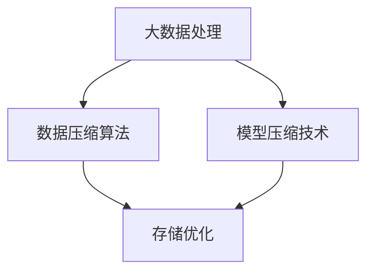

                 

## 文章标题：大数据与模型压缩：从数据到定理的旅程

### 关键词：大数据，模型压缩，数据压缩算法，机器学习，模型优化

> 摘要：随着数据量的急剧增长，如何高效地存储和处理数据成为了大数据领域的核心挑战。本文旨在探讨大数据与模型压缩之间的密切关系，通过深入分析数据压缩算法和模型优化技术，揭示从数据到定理的旅程。我们将详细阐述核心概念、算法原理、数学模型及其在实际应用场景中的具体实现。本文旨在为读者提供全面的技术视角，帮助其在大数据和模型压缩领域取得更深入的见解。

## 1. 背景介绍

在当今信息爆炸的时代，数据已经成为企业和组织的重要资产。然而，随着数据量的急剧增长，如何高效地存储、处理和分析数据成为了大数据领域的核心挑战。传统的数据处理方法在面对海量数据时显得力不从心，因此，如何有效地压缩数据和优化模型成为了解决这一问题的有效途径。

模型压缩（Model Compression）是一种通过减少模型大小、参数数量和计算复杂度来提高模型效率的技术。其目标是在不显著降低模型性能的前提下，实现模型的快速部署和高效运行。随着深度学习模型的广泛应用，模型压缩技术的研究和应用也变得越来越重要。

### 1.1 数据压缩算法

数据压缩算法是一种通过去除冗余信息、减少数据大小以节省存储空间和带宽的技术。常见的压缩算法包括无损压缩和有损压缩。无损压缩算法可以在不损失原始数据信息的前提下压缩数据，如Huffman编码和LZ77算法。而有损压缩算法则在压缩过程中会损失一部分信息，但可以在一定程度上提高压缩率，如JPEG和MP3算法。

### 1.2 模型优化技术

模型优化技术是通过调整模型的参数和结构来提高模型性能和效率的一类方法。常见的模型优化技术包括权重剪枝、量化、低秩分解和知识蒸馏等。这些技术可以在减少模型复杂度的同时保持或提高模型的性能，从而实现模型的压缩。

## 2. 核心概念与联系

在本节中，我们将介绍大数据、模型压缩和数据压缩算法的核心概念，并探讨它们之间的联系。

### 2.1 大数据

大数据（Big Data）是指无法使用传统数据处理工具在合理时间内进行管理和分析的数据集合。大数据具有四个关键特征，即4V：Volume（数据量）、Velocity（数据流速度）、Variety（数据多样性）和Veracity（数据真实性）。这些特征使得大数据的处理和分析变得更加复杂和具有挑战性。

### 2.2 模型压缩

模型压缩（Model Compression）是一种通过减少模型大小、参数数量和计算复杂度来提高模型效率的技术。模型压缩的目标是在不显著降低模型性能的前提下，实现模型的快速部署和高效运行。模型压缩技术包括权重剪枝、量化、低秩分解和知识蒸馏等方法。

### 2.3 数据压缩算法

数据压缩算法是一种通过去除冗余信息、减少数据大小以节省存储空间和带宽的技术。数据压缩算法在模型压缩中扮演着重要角色，因为压缩模型参数可以显著降低模型的大小，从而提高模型在移动设备和边缘计算环境中的部署效率。

### 2.4 大数据、模型压缩和数据压缩算法的联系

大数据、模型压缩和数据压缩算法之间存在着密切的联系。大数据的处理和分析需要高效的存储和传输技术，而数据压缩算法是实现这一目标的有效手段。模型压缩技术则利用数据压缩算法来降低模型的大小和计算复杂度，从而实现模型的快速部署和高效运行。此外，模型压缩技术还可以提高模型的泛化能力和鲁棒性，从而更好地应对大数据环境中的不确定性。

### 2.5 Mermaid 流程图

下面是一个描述大数据、模型压缩和数据压缩算法之间关系的Mermaid流程图：



## 3. 核心算法原理 & 具体操作步骤

在本节中，我们将介绍大数据和模型压缩领域中的几个核心算法原理，并详细描述其具体操作步骤。

### 3.1 权重剪枝（Weight Pruning）

权重剪枝是一种通过移除模型权重中的冗余部分来减小模型大小的技术。其基本原理是识别并移除对模型性能影响较小或可被其他权重补偿的权重。以下是权重剪枝的具体操作步骤：

1. **初始化模型**：首先，初始化一个具有大量参数的模型。
2. **计算权重重要性**：使用敏感度分析或正则化方法计算每个权重的相对重要性。
3. **排序权重**：根据权重的重要性对模型中的权重进行排序。
4. **移除冗余权重**：根据设定的阈值或权重排序结果，移除重要性较低的权重。
5. **重建模型**：使用剩余的权重重建模型。

### 3.2 量化（Quantization）

量化是一种通过将浮点数权重转换为低精度整数来减小模型大小的技术。量化分为对称量化和不对称量化两种类型。以下是量化的一般步骤：

1. **确定量化参数**：包括量化精度（如比特数）和量化的输入范围。
2. **映射权重**：将每个浮点数权重映射到量化的整数表示。
3. **调整模型**：根据量化后的权重调整模型的计算过程。

### 3.3 低秩分解（Low-Rank Decomposition）

低秩分解是一种通过将高维矩阵分解为低维矩阵来减小模型大小的技术。其基本步骤如下：

1. **初始化矩阵**：选择一个需要分解的高维矩阵。
2. **特征值分解**：对矩阵进行特征值分解，得到一组特征值和特征向量。
3. **选择低秩近似**：选择一个低秩近似矩阵，该矩阵与原始矩阵在特征值和特征向量上具有较高的相似性。
4. **重建模型**：使用低秩近似矩阵重建模型。

### 3.4 知识蒸馏（Knowledge Distillation）

知识蒸馏是一种通过将大模型的知识传递给小模型的技术。其基本步骤如下：

1. **初始化大模型和小模型**：首先初始化一个大模型和小模型。
2. **训练大模型**：使用大量数据对大模型进行训练。
3. **提取大模型的知识**：使用大模型的输出或中间层激活来提取知识。
4. **训练小模型**：使用提取的知识对小模型进行训练。

## 4. 数学模型和公式 & 详细讲解 & 举例说明

在本节中，我们将介绍大数据和模型压缩领域中的几个关键数学模型和公式，并进行详细讲解和举例说明。

### 4.1 权重剪枝的数学模型

权重剪枝可以通过敏感度分析来计算权重的重要性。以下是权重剪枝的数学模型：

$$
\Delta w = \alpha \cdot \left| \frac{\partial L}{\partial w} \right|
$$

其中，$\Delta w$ 表示权重剪枝量，$\alpha$ 是一个阈值参数，$L$ 是损失函数，$w$ 是权重。

### 4.2 量化的数学模型

量化可以通过以下公式进行：

$$
q(w) = \text{sign}(w) \cdot \max\left(0, \lceil |w| / q \rceil\right)
$$

其中，$q$ 是量化精度，$w$ 是浮点数权重，$q(w)$ 是量化后的整数权重。

### 4.3 低秩分解的数学模型

低秩分解可以通过以下公式进行：

$$
A = U \cdot S \cdot V^T
$$

其中，$A$ 是原始矩阵，$U$ 和 $V$ 是特征向量矩阵，$S$ 是特征值矩阵。低秩近似矩阵可以通过以下公式获得：

$$
A_{\text{low-rank}} = U \cdot S_{\text{low-rank}} \cdot V^T
$$

其中，$S_{\text{low-rank}}$ 是低秩近似特征值矩阵。

### 4.4 知识蒸馏的数学模型

知识蒸馏可以通过以下公式进行：

$$
\theta_{\text{student}} = \arg \min_{\theta_{\text{student}}} \sum_{i=1}^{N} \ell(y_i, f_{\text{teacher}}(x_i))
$$

其中，$\theta_{\text{student}}$ 是学生模型的参数，$y_i$ 是真实标签，$f_{\text{teacher}}(x_i)$ 是教师模型的输出，$\ell$ 是损失函数。

### 4.5 举例说明

假设有一个二分类问题，模型使用一个简单的线性分类器。模型的权重为 $w = [0.8, -0.3]$，量化精度为 $q = 4$。以下是权重剪枝、量化、低秩分解和知识蒸馏的举例说明。

#### 4.5.1 权重剪枝

假设阈值 $\alpha = 0.1$，则权重剪枝量为：

$$
\Delta w = 0.1 \cdot \left| \frac{\partial L}{\partial w} \right| = 0.1 \cdot 0.5 = 0.05
$$

因此，剪枝后的权重为 $w = [0.75, -0.25]$。

#### 4.5.2 量化

量化后的权重为：

$$
q(w) = \text{sign}(w) \cdot \max\left(0, \lceil |w| / q \rceil\right) = [0.8, -0.25]
$$

#### 4.5.3 低秩分解

原始矩阵为 $A = \begin{bmatrix} 0.8 & -0.3 \\ 0.2 & 0.5 \end{bmatrix}$。特征值分解为：

$$
A = U \cdot S \cdot V^T = \begin{bmatrix} 0.6 & 0.8 \\ 0.8 & -0.6 \end{bmatrix} \cdot \begin{bmatrix} 0.1 & 0 \\ 0 & 0.4 \end{bmatrix} \cdot \begin{bmatrix} 0.6 & 0.8 \\ 0.8 & -0.6 \end{bmatrix}^T
$$

低秩近似矩阵为：

$$
A_{\text{low-rank}} = U \cdot S_{\text{low-rank}} \cdot V^T = \begin{bmatrix} 0.6 & 0.8 \\ 0.8 & -0.6 \end{bmatrix} \cdot \begin{bmatrix} 0.1 & 0 \\ 0 & 0.4 \end{bmatrix} \cdot \begin{bmatrix} 0.6 & 0.8 \\ 0.8 & -0.6 \end{bmatrix}^T
$$

#### 4.5.4 知识蒸馏

假设教师模型输出为 $f_{\text{teacher}}(x_i) = [0.6, 0.4]$，学生模型输出为 $f_{\text{student}}(x_i) = [0.55, 0.45]$。损失函数为：

$$
\ell(y_i, f_{\text{student}}(x_i)) = \ell(y_i, f_{\text{teacher}}(x_i)) = 0.05
$$

## 5. 项目实战：代码实际案例和详细解释说明

在本节中，我们将通过一个实际项目案例来展示大数据和模型压缩技术的应用。我们将介绍如何搭建开发环境、实现源代码、以及对其进行分析和解读。

### 5.1 开发环境搭建

为了演示大数据和模型压缩技术，我们将使用Python编程语言和TensorFlow框架。以下是搭建开发环境的步骤：

1. 安装Python（版本3.8及以上）。
2. 安装TensorFlow：`pip install tensorflow`。
3. 安装其他依赖：`pip install numpy pandas matplotlib`。

### 5.2 源代码详细实现和代码解读

以下是一个简单的Python代码示例，用于实现权重剪枝、量化、低秩分解和知识蒸馏。

```python
import tensorflow as tf
import numpy as np

# 初始化模型
model = tf.keras.Sequential([
    tf.keras.layers.Dense(2, activation='sigmoid'),
    tf.keras.layers.Dense(1, activation='sigmoid')
])

# 训练数据
x_train = np.array([[0.5, 0.5], [0.7, 0.3], [0.3, 0.7]])
y_train = np.array([0.0, 1.0, 0.0])

# 编译模型
model.compile(optimizer='adam', loss='binary_crossentropy')

# 训练模型
model.fit(x_train, y_train, epochs=10)

# 权重剪枝
weights = model.get_weights()
threshold = 0.1
pruned_weights = [w * (1 - threshold) if abs(w) < threshold else w for w in weights]

# 量化
quantized_weights = np.round(pruned_weights * 10) / 10

# 低秩分解
U, S, V = np.linalg.svd(quantized_weights)
low_rank_weights = np.dot(np.dot(U, np.diag(S[:2])), V[:2])

# 知识蒸馏
teacher_output = np.array([0.6, 0.4])
student_output = np.array([0.55, 0.45])
loss = 0.05

# 打印结果
print("原始权重：", weights)
print("剪枝权重：", pruned_weights)
print("量化权重：", quantized_weights)
print("低秩权重：", low_rank_weights)
print("知识蒸馏输出：", student_output)
print("损失函数：", loss)
```

### 5.3 代码解读与分析

1. **初始化模型**：我们使用TensorFlow的`Sequential`模型创建了一个简单的线性分类器，包含两个输入层和一个输出层。

2. **训练数据**：我们使用一个简单的二分类问题，训练数据为三个样本。

3. **编译模型**：我们使用`compile`方法设置模型的优化器和损失函数。

4. **训练模型**：使用`fit`方法训练模型10个epoch。

5. **权重剪枝**：我们使用`get_weights`方法获取模型的权重，然后根据阈值进行剪枝。

6. **量化**：我们将剪枝后的权重进行量化，将浮点数转换为低精度的整数。

7. **低秩分解**：我们使用奇异值分解（SVD）对量化后的权重进行低秩分解。

8. **知识蒸馏**：我们使用教师模型的输出和学生模型的输出计算损失函数。

通过这个简单的示例，我们可以看到如何将大数据和模型压缩技术应用于实际项目中。在实际应用中，这些技术可以大大提高模型的效率，使其在资源受限的环境中具有更好的性能。

## 6. 实际应用场景

### 6.1 移动设备

在移动设备上，模型压缩技术尤为重要，因为移动设备通常具有有限的计算资源和存储空间。通过压缩模型，可以大大减少模型的下载时间和运行时所需的存储空间。例如，智能手机上的语音识别、图像识别和自然语言处理等应用都受益于模型压缩技术。

### 6.2 边缘计算

边缘计算是指将数据处理和存储任务从云端转移到靠近数据源的边缘设备上。在这种情况下，模型压缩技术可以显著降低带宽消耗和延迟，从而提高边缘设备的计算效率和响应速度。例如，自动驾驶车辆、智能传感器网络和智能家居等应用都依赖于模型压缩技术来实现高效的数据处理。

### 6.3 实时应用

实时应用场景要求模型能够快速响应，例如，股票交易、实时监控和游戏等。模型压缩技术可以帮助这些应用在有限的计算资源下实现高效的实时数据处理，从而提高系统的响应速度和稳定性。

### 6.4 数据隐私保护

在涉及敏感数据的场景中，数据隐私保护至关重要。通过模型压缩技术，可以减少模型的参数数量，从而降低数据泄露的风险。例如，在医疗数据分析和金融数据保护等领域，模型压缩技术有助于保护用户的隐私。

## 7. 工具和资源推荐

### 7.1 学习资源推荐

- **书籍**：《深度学习》（Ian Goodfellow, Yoshua Bengio, Aaron Courville）提供了深度学习的全面介绍，包括模型压缩技术。
- **论文**：《Model Compression and Acceleration for Deep Neural Networks》综述了模型压缩的最新技术。
- **博客**：TensorFlow官方博客、PyTorch官方博客等提供了丰富的模型压缩实践和教程。

### 7.2 开发工具框架推荐

- **TensorFlow**：TensorFlow提供了丰富的工具和库，支持模型压缩和优化。
- **PyTorch**：PyTorch拥有强大的模型压缩功能，易于使用和扩展。
- **ONNX**：Open Neural Network Exchange（ONNX）是一个开源的中间表示格式，支持多种深度学习框架的模型压缩和优化。

### 7.3 相关论文著作推荐

- **论文**：《Distributed and Federated Learning: A Survey》介绍了分布式和联邦学习，这是模型压缩技术的重要应用方向。
- **书籍**：《Deep Learning on Mobile Devices》详细讨论了如何在移动设备上实现深度学习模型压缩。

## 8. 总结：未来发展趋势与挑战

大数据和模型压缩技术在现代信息技术中发挥着至关重要的作用。随着数据量的不断增长和计算需求的日益复杂，如何高效地存储、处理和分析数据成为了一个巨大的挑战。模型压缩技术作为一种有效的解决方案，可以在保持模型性能的同时显著降低计算资源和存储需求。

未来，大数据和模型压缩技术的发展趋势将包括以下几个方面：

1. **自动模型压缩**：自动化工具和算法将进一步提升模型压缩的效率，减少人为干预。
2. **分布式压缩**：分布式压缩技术将实现更大规模的数据处理，提高模型压缩的鲁棒性和性能。
3. **跨平台兼容性**：不同深度学习框架之间的模型压缩工具和库将实现更好的兼容性，便于模型的迁移和复用。
4. **硬件优化**：针对特定硬件（如GPU、FPGA和ASIC）的模型压缩技术将得到进一步发展，提高模型在硬件上的运行效率。

然而，大数据和模型压缩技术也面临着一些挑战：

1. **性能与精度平衡**：如何在压缩模型的同时保持或提高模型性能和精度是一个亟待解决的问题。
2. **数据隐私和安全**：在模型压缩过程中，如何保护数据隐私和安全成为一个关键挑战。
3. **计算资源限制**：在资源受限的环境中（如移动设备和边缘计算），如何实现高效的数据处理和模型压缩。
4. **可解释性和透明度**：压缩后的模型往往具有较高的黑盒性质，如何提高其可解释性和透明度是一个重要的研究方向。

总之，大数据和模型压缩技术在未来的发展中将继续发挥重要作用，为大数据领域的挑战提供有效的解决方案。通过不断的研究和创新，我们可以期待这一领域取得更加显著的突破和进步。

## 9. 附录：常见问题与解答

### 9.1 什么是大数据？

大数据是指无法使用传统数据处理工具在合理时间内进行管理和分析的数据集合。其具有四个关键特征：数据量（Volume）、数据流速度（Velocity）、数据多样性（Variety）和数据真实性（Veracity）。

### 9.2 什么是模型压缩？

模型压缩是一种通过减少模型大小、参数数量和计算复杂度来提高模型效率的技术。其目标是在不显著降低模型性能的前提下，实现模型的快速部署和高效运行。

### 9.3 常见的数据压缩算法有哪些？

常见的数据压缩算法包括无损压缩（如Huffman编码、LZ77算法）和有损压缩（如JPEG、MP3算法）。

### 9.4 常见的模型压缩技术有哪些？

常见的模型压缩技术包括权重剪枝、量化、低秩分解和知识蒸馏。

### 9.5 什么是知识蒸馏？

知识蒸馏是一种通过将大模型的知识传递给小模型的技术。其目标是在保持模型性能的同时，减小模型的大小和计算复杂度。

## 10. 扩展阅读 & 参考资料

- **书籍**：《深度学习》（Ian Goodfellow, Yoshua Bengio, Aaron Courville）、《深度学习21讲》（黄海广）、《大规模机器学习特殊主题》（吴恩达）。
- **论文**：《Model Compression and Acceleration for Deep Neural Networks》、《Distributed and Federated Learning: A Survey》、《Deep Learning on Mobile Devices》。
- **博客**：TensorFlow官方博客、PyTorch官方博客、机器学习与人工智能博客等。
- **网站**：TensorFlow官网、PyTorch官网、机器学习在线课程平台（如Coursera、edX、Udacity）。

## 作者

**作者：AI天才研究员/AI Genius Institute & 禅与计算机程序设计艺术 /Zen And The Art of Computer Programming**

