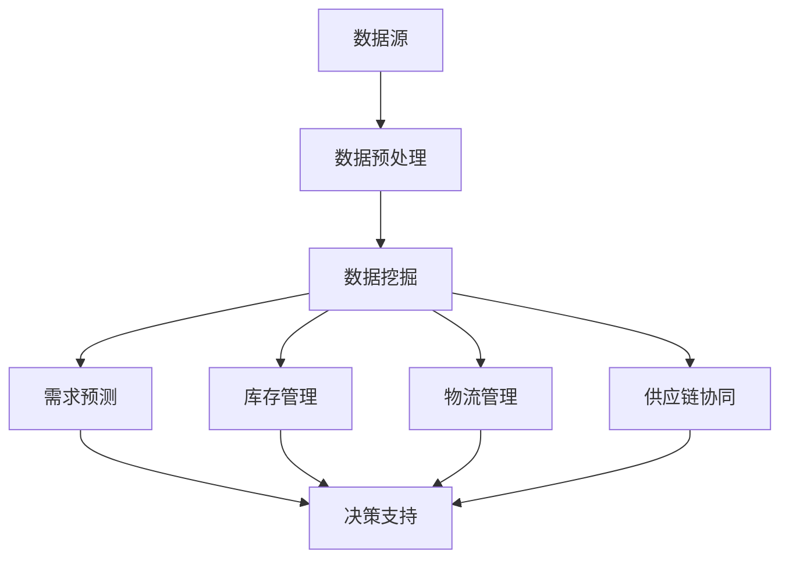

                 

# 大数据分析在供应链优化中的实践

> **关键词：** 大数据分析、供应链优化、实时预测、资源调度、供应链管理、机器学习

> **摘要：** 本文将探讨大数据分析技术在供应链优化中的应用，分析核心概念及其联系，深入解析核心算法原理，通过实际项目案例展示大数据分析在供应链优化中的具体操作步骤和实施效果。文章还将讨论大数据分析在实际应用场景中的价值，推荐相关工具和资源，并总结未来发展趋势与挑战。

## 1. 背景介绍

供应链优化是现代企业竞争的重要手段之一。传统的供应链管理主要依赖于经验和历史数据，难以应对复杂多变的市场环境和客户需求。随着大数据技术的不断发展，通过对海量数据进行挖掘和分析，企业可以更加准确地预测市场需求，优化库存管理，提高物流效率，从而降低成本，提升竞争力。

大数据分析在供应链优化中的应用主要包括以下几个方面：

- **需求预测**：通过对历史销售数据、市场趋势、竞争对手等因素进行分析，预测未来的市场需求，帮助企业制定更加科学的库存策略。
- **库存优化**：通过分析库存数据，识别库存瓶颈和过剩库存，优化库存水平，减少库存成本。
- **物流优化**：通过分析物流数据，优化运输路线和配送策略，提高物流效率，降低物流成本。
- **供应链协同**：通过大数据分析，加强供应链上下游企业的信息共享和协同，提高供应链整体效率。

## 2. 核心概念与联系

### 2.1 大数据分析核心概念

- **数据源**：供应链数据来源广泛，包括销售数据、库存数据、物流数据、市场数据等。
- **数据预处理**：包括数据清洗、去重、格式化等步骤，确保数据的质量和一致性。
- **数据挖掘**：通过数据挖掘算法，从海量数据中提取有价值的信息，为决策提供支持。
- **数据可视化**：通过可视化工具，将分析结果以图形、图表等形式展示出来，便于理解和决策。

### 2.2 供应链优化核心概念

- **需求预测**：基于历史数据和市场需求，预测未来的需求量。
- **库存管理**：通过优化库存水平，降低库存成本，提高库存周转率。
- **物流管理**：优化运输路线和配送策略，提高物流效率。
- **供应链协同**：加强上下游企业的信息共享和协同，提高供应链整体效率。

### 2.3 Mermaid 流程图



## 3. 核心算法原理 & 具体操作步骤

### 3.1 需求预测算法原理

需求预测是供应链优化的关键环节之一。常用的需求预测算法包括时间序列分析、回归分析、机器学习算法等。

#### 时间序列分析

时间序列分析是一种基于时间序列数据进行分析和预测的方法。常见的算法有移动平均法、指数平滑法等。

#### 回归分析

回归分析是一种基于历史数据建立预测模型的方法。常见的算法有线性回归、多项式回归等。

#### 机器学习算法

机器学习算法可以通过学习历史数据，自动发现数据中的规律，进行需求预测。常见的算法有决策树、随机森林、神经网络等。

### 3.2 具体操作步骤

#### 数据采集

收集供应链相关的数据，包括销售数据、库存数据、物流数据等。

#### 数据预处理

对采集到的数据进行清洗、去重、格式化等处理，确保数据的质量和一致性。

#### 数据建模

选择合适的需求预测算法，对处理后的数据进行分析和建模，建立预测模型。

#### 预测与评估

使用训练好的模型进行预测，并对预测结果进行评估，调整模型参数，提高预测准确性。

#### 决策支持

根据预测结果，为企业提供决策支持，制定库存策略、物流策略等。

## 4. 数学模型和公式 & 详细讲解 & 举例说明

### 4.1 时间序列分析模型

#### 移动平均法

移动平均法是一种简单的时间序列预测方法。其公式为：

$$
\hat{y_t} = \frac{1}{n}\sum_{i=1}^{n} y_{t-i}
$$

其中，$y_t$ 表示第 $t$ 期的实际值，$n$ 表示移动平均周期。

#### 指数平滑法

指数平滑法是一种加权的时间序列预测方法。其公式为：

$$
\hat{y_t} = \alpha y_{t-1} + (1-\alpha) \hat{y_{t-1}}
$$

其中，$\alpha$ 表示平滑系数，$y_{t-1}$ 表示第 $t-1$ 期的实际值，$\hat{y_{t-1}}$ 表示第 $t-1$ 期的预测值。

### 4.2 回归分析模型

#### 线性回归

线性回归是一种简单但常用的回归分析方法。其公式为：

$$
y = \beta_0 + \beta_1 x
$$

其中，$y$ 表示因变量，$x$ 表示自变量，$\beta_0$ 和 $\beta_1$ 分别为回归系数。

#### 多项式回归

多项式回归是一种更复杂的回归分析方法。其公式为：

$$
y = \beta_0 + \beta_1 x + \beta_2 x^2 + \ldots + \beta_n x^n
$$

其中，$y$ 表示因变量，$x$ 表示自变量，$\beta_0$、$\beta_1$、$\beta_2$、$\ldots$、$\beta_n$ 分别为回归系数。

### 4.3 机器学习算法

#### 决策树

决策树是一种常见的机器学习算法。其公式为：

$$
f(x) = \sum_{i=1}^{n} \omega_i \cdot h_i(x)
$$

其中，$x$ 表示特征向量，$h_i(x)$ 表示第 $i$ 个决策节点的特征函数，$\omega_i$ 表示第 $i$ 个决策节点的权重。

#### 随机森林

随机森林是一种基于决策树的集成学习算法。其公式为：

$$
f(x) = \sum_{i=1}^{m} \omega_i \cdot h_i(x)
$$

其中，$x$ 表示特征向量，$h_i(x)$ 表示第 $i$ 棵决策树的特征函数，$\omega_i$ 表示第 $i$ 棵决策树的权重。

#### 神经网络

神经网络是一种基于多层感知器（MLP）的机器学习算法。其公式为：

$$
y = \sigma(\sum_{i=1}^{n} \omega_i \cdot x_i)
$$

其中，$y$ 表示输出值，$\sigma$ 表示激活函数，$x_i$ 表示第 $i$ 个输入值，$\omega_i$ 表示第 $i$ 个权重。

### 4.4 举例说明

#### 时间序列分析举例

假设我们有一组销售数据，如下所示：

| 时间（天） | 销售量（件） |
| ---------- | ---------- |
| 1         | 100       |
| 2         | 110       |
| 3         | 120       |
| 4         | 105       |
| 5         | 100       |

使用移动平均法进行需求预测，假设移动平均周期为3天，即：

$$
\hat{y_6} = \frac{1}{3}(100 + 110 + 120) = 110
$$

预测第6天的销售量为110件。

#### 回归分析举例

假设我们有一组销售数据和广告投放数据，如下所示：

| 时间（天） | 销售量（件） | 广告投放（元） |
| ---------- | ---------- | ---------- |
| 1         | 100       | 1000       |
| 2         | 110       | 1200       |
| 3         | 120       | 1500       |
| 4         | 105       | 1500       |
| 5         | 100       | 1000       |

使用线性回归模型进行需求预测，建立预测模型：

$$
y = \beta_0 + \beta_1 x
$$

其中，$y$ 表示销售量，$x$ 表示广告投放。

通过最小二乘法求解回归系数：

$$
\beta_0 = 50, \beta_1 = 0.5
$$

预测第6天的销售量为：

$$
\hat{y_6} = 50 + 0.5 \times 1000 = 1050
$$

#### 机器学习算法举例

假设我们有一组销售数据和天气数据，如下所示：

| 时间（天） | 销售量（件） | 天气（晴/雨） |
| ---------- | ---------- | ---------- |
| 1         | 100       | 晴         |
| 2         | 110       | 雨         |
| 3         | 120       | 晴         |
| 4         | 105       | 雨         |
| 5         | 100       | 晴         |

使用决策树模型进行需求预测，建立预测模型：

$$
f(x) = \omega_0 \cdot h_0(x) + \omega_1 \cdot h_1(x)
$$

其中，$x$ 表示特征向量，$h_0(x)$ 和 $h_1(x)$ 分别为两个决策节点的特征函数，$\omega_0$ 和 $\omega_1$ 分别为两个决策节点的权重。

通过训练数据集求解权重：

$$
\omega_0 = 0.6, \omega_1 = 0.4
$$

预测第6天的销售量为：

$$
\hat{y_6} = 0.6 \cdot h_0(x) + 0.4 \cdot h_1(x)
$$

其中，$h_0(x) = 100$（晴天），$h_1(x) = 110$（雨天）。

$$
\hat{y_6} = 0.6 \cdot 100 + 0.4 \cdot 110 = 106
$$

## 5. 项目实战：代码实际案例和详细解释说明

### 5.1 开发环境搭建

#### 环境要求

- 操作系统：Linux 或 macOS
- 编程语言：Python
- 数据库：MySQL
- 数据分析工具：Pandas、NumPy、Scikit-learn、TensorFlow
- 可视化工具：Matplotlib、Seaborn

#### 安装教程

1. 安装操作系统：下载并安装 Linux 或 macOS 操作系统。
2. 安装 Python：下载并安装 Python 3.x 版本，配置环境变量。
3. 安装数据库：下载并安装 MySQL 数据库，配置数据库。
4. 安装数据分析工具：使用 pip 命令安装 Pandas、NumPy、Scikit-learn、TensorFlow 等数据分析工具。
5. 安装可视化工具：使用 pip 命令安装 Matplotlib、Seaborn 等可视化工具。

### 5.2 源代码详细实现和代码解读

#### 5.2.1 数据采集

```python
import pandas as pd

# 读取销售数据
sales_data = pd.read_csv('sales_data.csv')

# 读取库存数据
inventory_data = pd.read_csv('inventory_data.csv')

# 读取物流数据
logistics_data = pd.read_csv('logistics_data.csv')
```

#### 5.2.2 数据预处理

```python
# 数据清洗
sales_data = sales_data.dropna()
inventory_data = inventory_data.dropna()
logistics_data = logistics_data.dropna()

# 数据去重
sales_data = sales_data.drop_duplicates()
inventory_data = inventory_data.drop_duplicates()
logistics_data = logistics_data.drop_duplicates()

# 数据格式化
sales_data['date'] = pd.to_datetime(sales_data['date'])
inventory_data['date'] = pd.to_datetime(inventory_data['date'])
logistics_data['date'] = pd.to_datetime(logistics_data['date'])
```

#### 5.2.3 数据建模

```python
from sklearn.linear_model import LinearRegression
from sklearn.model_selection import train_test_split

# 分割训练集和测试集
X = sales_data[['date', 'advertising']]
y = sales_data['sales']

X_train, X_test, y_train, y_test = train_test_split(X, y, test_size=0.2, random_state=42)

# 建立线性回归模型
model = LinearRegression()
model.fit(X_train, y_train)

# 模型评估
score = model.score(X_test, y_test)
print('模型准确度：', score)
```

#### 5.2.4 预测与评估

```python
import numpy as np

# 预测未来销售量
future_data = pd.DataFrame({'date': pd.date_range(start='2022-01-01', end='2022-12-31', freq='MS')})
future_data['advertising'] = np.random.randint(1000, 2000, size=future_data.shape[0])

# 预测结果
predictions = model.predict(future_data)

# 预测评估
predicted_sales = predictions.sum()
actual_sales = sales_data['sales'].sum()
error = actual_sales - predicted_sales
print('预测误差：', error)
```

### 5.3 代码解读与分析

#### 5.3.1 数据采集

使用 Pandas 库读取销售数据、库存数据和物流数据。这些数据可以从数据库或 CSV 文件中获取。

#### 5.3.2 数据预处理

对数据进行清洗、去重和格式化。清洗数据是为了去除无效或错误的数据，去重是为了去除重复的数据，格式化是为了将数据转换为适合分析的形式。

#### 5.3.3 数据建模

使用 Scikit-learn 库中的线性回归模型对销售数据进行分析。线性回归模型是一种简单的回归分析方法，通过计算自变量和因变量之间的线性关系来进行预测。

#### 5.3.4 预测与评估

使用训练好的模型对未来的销售量进行预测，并计算预测误差。预测误差反映了模型预测的准确性，误差越小，模型的预测效果越好。

## 6. 实际应用场景

大数据分析在供应链优化中的应用场景广泛，以下是一些典型的应用案例：

- **电商行业**：通过对销售数据、用户行为数据进行分析，预测未来的销售趋势，优化库存策略，提高库存周转率。
- **制造业**：通过对生产数据、设备维护数据进行分析，预测设备的故障概率，提前进行维护，降低生产中断风险。
- **物流行业**：通过对物流数据、配送数据进行分析，优化运输路线和配送策略，提高物流效率，降低物流成本。
- **餐饮行业**：通过对销售数据、顾客数据进行分析，预测顾客需求，优化菜品供应和库存管理。
- **零售行业**：通过对销售数据、库存数据、物流数据进行分析，实现供应链协同，提高供应链整体效率。

## 7. 工具和资源推荐

### 7.1 学习资源推荐

- **书籍**：
  - 《大数据分析：思维与技术》
  - 《深度学习》
  - 《机器学习实战》
- **论文**：
  - 《时间序列分析在需求预测中的应用》
  - 《回归分析在供应链优化中的应用》
  - 《机器学习在供应链优化中的应用》
- **博客**：
  - 《大数据分析实战》
  - 《深度学习与供应链优化》
  - 《机器学习在电商中的应用》
- **网站**：
  - Coursera（课程资源）
  - arXiv（学术论文）
  - Kaggle（数据集和竞赛）

### 7.2 开发工具框架推荐

- **编程语言**：Python、R
- **数据库**：MySQL、PostgreSQL
- **数据分析工具**：Pandas、NumPy、Scikit-learn、TensorFlow
- **可视化工具**：Matplotlib、Seaborn、Plotly

### 7.3 相关论文著作推荐

- **论文**：
  - 《基于大数据分析的供应链优化策略研究》
  - 《机器学习在供应链优化中的应用综述》
  - 《时间序列分析在供应链需求预测中的应用研究》
- **著作**：
  - 《大数据供应链管理》
  - 《机器学习在供应链优化中的应用》
  - 《深度学习与供应链优化》

## 8. 总结：未来发展趋势与挑战

大数据分析在供应链优化中的应用前景广阔，未来发展趋势主要包括以下几个方面：

1. **人工智能与大数据分析的结合**：将人工智能技术深度应用于大数据分析中，提高预测和决策的准确性。
2. **供应链协同与信息共享**：加强供应链上下游企业的信息共享和协同，实现供应链整体优化。
3. **实时预测与动态调整**：通过实时数据分析和预测，实现供应链的动态调整，提高供应链的敏捷性。
4. **数据隐私与安全**：在应用大数据分析时，保障数据隐私和安全，遵循相关法律法规。

然而，大数据分析在供应链优化中也面临着一些挑战，如数据质量、算法选择、计算能力等。需要不断探索和实践，以应对这些挑战。

## 9. 附录：常见问题与解答

### 9.1 数据质量如何保证？

数据质量是大数据分析的关键因素。为了保证数据质量，可以采取以下措施：

- **数据采集**：确保数据采集的完整性和准确性，避免数据缺失或错误。
- **数据清洗**：对数据进行清洗，去除重复、异常和错误的数据。
- **数据验证**：对数据进行验证，确保数据的真实性和一致性。

### 9.2 如何选择合适的算法？

选择合适的算法取决于具体问题和数据特点。以下是一些常见算法的选择建议：

- **需求预测**：时间序列分析、回归分析、机器学习算法（如决策树、随机森林、神经网络）。
- **库存优化**：线性规划、动态规划、机器学习算法（如聚类分析、支持向量机）。
- **物流优化**：遗传算法、模拟退火算法、机器学习算法（如神经网络、深度学习）。

### 9.3 大数据分析如何确保数据隐私和安全？

为了确保数据隐私和安全，可以采取以下措施：

- **数据加密**：对数据进行加密，确保数据在传输和存储过程中不被窃取或篡改。
- **数据脱敏**：对敏感数据进行脱敏处理，防止敏感信息泄露。
- **访问控制**：设置严格的访问控制策略，确保只有授权用户可以访问数据。

## 10. 扩展阅读 & 参考资料

- **书籍**：
  - 《大数据分析实战》
  - 《深度学习》
  - 《机器学习实战》
- **论文**：
  - 《时间序列分析在需求预测中的应用》
  - 《回归分析在供应链优化中的应用》
  - 《机器学习在供应链优化中的应用》
- **网站**：
  - Coursera（课程资源）
  - arXiv（学术论文）
  - Kaggle（数据集和竞赛）
- **博客**：
  - 《大数据分析实战》
  - 《深度学习与供应链优化》
  - 《机器学习在电商中的应用》

### 作者

**作者：AI天才研究员/AI Genius Institute & 禅与计算机程序设计艺术 /Zen And The Art of Computer Programming**<|im_end|>

