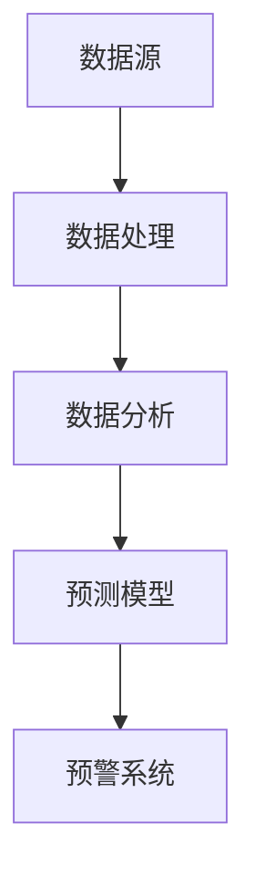

                 

# 大数据分析在公共卫生预警中的应用

## 摘要

本文将深入探讨大数据分析在公共卫生预警中的应用。随着全球化和信息技术的发展，公共卫生问题越来越复杂，传统的监测和预警方法已经难以应对。大数据分析通过处理海量的数据，提供了一种高效、精准的公共卫生预警手段。本文将从核心概念、算法原理、数学模型、项目实战、应用场景、工具和资源推荐等方面，系统地介绍大数据分析在公共卫生预警中的具体应用，旨在为相关领域的研究者和实践者提供有益的参考和指导。

## 1. 背景介绍

公共卫生预警是指在疾病流行或疫情爆发之前，通过科学监测和分析，预测可能的疫情发展趋势，为采取及时、有效的预防措施提供依据。随着城市化进程的加快、人口流动的增加以及全球气候变化的加剧，公共卫生问题日益复杂，传统的预警方法已经难以满足需求。大数据分析作为一种新兴的技术手段，以其处理海量数据的能力和强大的数据分析功能，为公共卫生预警提供了新的可能性。

大数据分析在公共卫生预警中的重要性主要体现在以下几个方面：

1. **提高预警的准确性**：通过大数据分析，可以挖掘出隐藏在数据背后的规律和趋势，从而提高公共卫生预警的准确性。

2. **实时监测疫情动态**：大数据分析可以实现实时数据采集、处理和分析，为疫情监测提供实时、动态的监测数据。

3. **辅助决策制定**：大数据分析可以为公共卫生决策提供科学依据，帮助决策者制定更合理、有效的公共卫生政策。

4. **提升公共卫生服务水平**：大数据分析可以优化公共卫生服务流程，提高公共卫生服务的效率和质量。

## 2. 核心概念与联系

为了更好地理解大数据分析在公共卫生预警中的应用，我们需要首先了解一些核心概念和它们之间的联系。

### 2.1 数据源

公共卫生大数据分析的数据源主要包括以下几个方面：

1. **健康医疗数据**：包括电子健康记录、医院病历、药品销售数据等。
2. **公共卫生数据**：包括疾病监测数据、疫苗接种数据、传染病报告数据等。
3. **社会行为数据**：包括人口流动数据、社交媒体数据、新闻报道数据等。
4. **环境数据**：包括气候数据、空气质量数据、水源数据等。

### 2.2 数据处理

数据处理是大数据分析的重要环节，主要包括数据采集、数据清洗、数据存储和数据转换等步骤。

1. **数据采集**：通过传感器、监控系统、互联网等手段，采集海量的数据。
2. **数据清洗**：去除重复数据、错误数据和不完整数据，保证数据质量。
3. **数据存储**：采用分布式存储技术，存储海量数据。
4. **数据转换**：将数据转换为适合分析的形式，如数据格式转换、数据压缩等。

### 2.3 数据分析

数据分析是大数据分析的核心，主要包括数据挖掘、机器学习、统计分析等方法。

1. **数据挖掘**：从海量数据中提取隐藏的知识和模式。
2. **机器学习**：通过训练模型，自动识别数据中的规律和趋势。
3. **统计分析**：通过对数据进行分析，发现数据之间的相关性。

### 2.4 预测模型

预测模型是大数据分析在公共卫生预警中的关键，主要包括时间序列预测、回归分析、分类算法等。

1. **时间序列预测**：基于历史数据，预测未来的趋势和变化。
2. **回归分析**：通过建立回归模型，预测因变量与自变量之间的关系。
3. **分类算法**：将数据划分为不同的类别，预测新数据的类别。

### 2.5 预警系统

预警系统是大数据分析在公共卫生预警中的具体应用，通过实时监测数据，预测可能的疫情发展趋势，提供预警信号。

1. **实时监测**：通过传感器、监控系统等实时收集数据。
2. **数据分析和预测**：通过数据分析方法，预测疫情发展趋势。
3. **预警信号发布**：根据预测结果，发布预警信号，提醒相关部门采取行动。

### Mermaid 流程图



## 3. 核心算法原理 & 具体操作步骤

### 3.1 时间序列预测

时间序列预测是大数据分析在公共卫生预警中的重要方法之一，通过分析历史数据，预测未来的发展趋势。具体操作步骤如下：

1. **数据预处理**：对时间序列数据进行预处理，包括数据清洗、数据平滑、数据归一化等。
2. **特征工程**：提取时间序列数据中的特征，如趋势、季节性、周期性等。
3. **模型选择**：选择合适的时间序列预测模型，如ARIMA、LSTM等。
4. **模型训练**：使用历史数据对模型进行训练，调整模型参数。
5. **模型评估**：使用验证数据对模型进行评估，调整模型参数。
6. **预测未来趋势**：使用训练好的模型，预测未来的趋势和变化。

### 3.2 回归分析

回归分析是大数据分析中常用的统计方法，通过建立回归模型，预测因变量与自变量之间的关系。具体操作步骤如下：

1. **数据预处理**：对数据进行预处理，包括数据清洗、数据归一化等。
2. **特征选择**：选择对因变量影响较大的自变量。
3. **模型选择**：选择合适的回归模型，如线性回归、非线性回归等。
4. **模型训练**：使用历史数据对模型进行训练。
5. **模型评估**：使用验证数据对模型进行评估。
6. **预测未来值**：使用训练好的模型，预测未来的值。

### 3.3 分类算法

分类算法是大数据分析中常用的机器学习方法，通过将数据划分为不同的类别，预测新数据的类别。具体操作步骤如下：

1. **数据预处理**：对数据进行预处理，包括数据清洗、数据归一化等。
2. **特征选择**：选择对分类结果影响较大的特征。
3. **模型选择**：选择合适的分类算法，如决策树、支持向量机等。
4. **模型训练**：使用历史数据对模型进行训练。
5. **模型评估**：使用验证数据对模型进行评估。
6. **预测新数据**：使用训练好的模型，预测新数据的类别。

### 3.4 模型融合

模型融合是将多个模型的结果进行融合，提高预测准确率的一种方法。具体操作步骤如下：

1. **模型选择**：选择多个不同的模型。
2. **模型训练**：使用历史数据对每个模型进行训练。
3. **模型评估**：使用验证数据对每个模型进行评估。
4. **结果融合**：将每个模型的预测结果进行融合，得到最终的预测结果。

## 4. 数学模型和公式 & 详细讲解 & 举例说明

### 4.1 时间序列预测

#### 时间序列模型

时间序列模型是一种用于分析时间序列数据的统计模型，它可以用来预测未来的趋势和变化。常见的时间序列模型包括ARIMA、LSTM等。

#### ARIMA模型

ARIMA模型是一种自回归积分滑动平均模型，它的数学公式如下：

$$
\begin{aligned}
X_t &= c + \phi_1 X_{t-1} + \phi_2 X_{t-2} + \cdots + \phi_p X_{t-p} \\
&+ \theta_1 \epsilon_{t-1} + \theta_2 \epsilon_{t-2} + \cdots + \theta_q \epsilon_{t-q} \\
\end{aligned}
$$

其中，$X_t$表示时间序列的当前值，$c$为常数项，$\phi_1, \phi_2, \cdots, \phi_p$为自回归系数，$\theta_1, \theta_2, \cdots, \theta_q$为移动平均系数，$\epsilon_t$为白噪声。

#### LSTM模型

LSTM（Long Short-Term Memory）是一种用于处理序列数据的神经网络模型，它的数学公式如下：

$$
\begin{aligned}
i_t &= \sigma(W_{ix} x_t + W_{ih} h_{t-1} + b_i) \\
f_t &= \sigma(W_{fx} x_t + W_{fh} h_{t-1} + b_f) \\
o_t &= \sigma(W_{ox} x_t + W_{oh} h_{t-1} + b_o) \\
c_t &= f_t \odot c_{t-1} + i_t \odot \tanh(W_{cx} x_t + W_{ch} h_{t-1} + b_c) \\
h_t &= o_t \odot \tanh(c_t)
\end{aligned}
$$

其中，$i_t, f_t, o_t, c_t, h_t$分别为输入门、遗忘门、输出门、细胞状态和隐藏状态，$\sigma$为sigmoid函数，$\odot$为元素乘运算，$W_{ix}, W_{ih}, W_{fx}, W_{fh}, W_{ox}, W_{oh}, W_{cx}, W_{ch}$为权重矩阵，$b_i, b_f, b_o, b_c$为偏置项。

### 4.2 回归分析

#### 线性回归

线性回归是一种常用的回归分析方法，它的数学公式如下：

$$
Y = \beta_0 + \beta_1 X + \epsilon
$$

其中，$Y$为因变量，$X$为自变量，$\beta_0, \beta_1$为模型参数，$\epsilon$为误差项。

#### 非线性回归

非线性回归是线性回归的扩展，它通过引入非线性函数，可以处理非线性关系。常见的非线性回归模型包括多项式回归、逻辑回归等。

#### 逻辑回归

逻辑回归是一种常用的分类算法，它的数学公式如下：

$$
\begin{aligned}
P(Y=1) &= \frac{1}{1 + e^{-(\beta_0 + \beta_1 X)}} \\
\log\left(\frac{P(Y=1)}{1 - P(Y=1)}\right) &= \beta_0 + \beta_1 X
\end{aligned}
$$

其中，$P(Y=1)$为因变量为1的概率，$\beta_0, \beta_1$为模型参数。

### 4.3 分类算法

#### 决策树

决策树是一种常用的分类算法，它的数学公式如下：

$$
\begin{aligned}
Y &= g(\theta_0 + \theta_1 X_1 + \theta_2 X_2 + \cdots + \theta_n X_n) \\
g(z) &= \begin{cases}
1 & \text{if } z \geq 0 \\
0 & \text{if } z < 0
\end{cases}
\end{aligned}
$$

其中，$Y$为因变量，$X_1, X_2, \cdots, X_n$为自变量，$\theta_0, \theta_1, \theta_2, \cdots, \theta_n$为模型参数。

#### 支持向量机

支持向量机是一种高效的分类算法，它的数学公式如下：

$$
\begin{aligned}
\min_{\theta, \xi} \frac{1}{2} ||\theta||^2 \\
\text{subject to } y^{(i)}(\theta^T x^{(i)} + \xi_i) \geq 1, \forall i
\end{aligned}
$$

其中，$y^{(i)}$为因变量，$x^{(i)}$为自变量，$\theta$为模型参数，$\xi_i$为松弛变量。

### 4.4 模型融合

#### 平均融合

平均融合是将多个模型的预测结果进行平均，得到最终的预测结果。它的数学公式如下：

$$
\hat{Y} = \frac{1}{M} \sum_{m=1}^{M} \hat{Y}_m
$$

其中，$\hat{Y}$为最终的预测结果，$M$为模型的个数，$\hat{Y}_m$为第$m$个模型的预测结果。

#### 加权融合

加权融合是将多个模型的预测结果进行加权平均，得到最终的预测结果。它的数学公式如下：

$$
\hat{Y} = \sum_{m=1}^{M} w_m \hat{Y}_m
$$

其中，$w_m$为第$m$个模型的权重，$\hat{Y}_m$为第$m$个模型的预测结果。

## 5. 项目实战：代码实际案例和详细解释说明

### 5.1 开发环境搭建

在开始项目实战之前，我们需要搭建一个合适的开发环境。以下是一个简单的开发环境搭建步骤：

1. 安装Python环境：Python是一种广泛应用于大数据分析的语言，我们需要安装Python环境。可以通过Python官方网站下载Python安装包进行安装。
2. 安装Jupyter Notebook：Jupyter Notebook是一种交互式的Python开发环境，可以方便地编写和运行代码。可以通过pip命令安装Jupyter Notebook：
   ```bash
   pip install notebook
   ```
3. 安装必要的库：为了方便大数据分析，我们需要安装一些常用的库，如NumPy、Pandas、Scikit-learn、TensorFlow等。可以通过pip命令安装这些库：
   ```bash
   pip install numpy pandas scikit-learn tensorflow
   ```

### 5.2 源代码详细实现和代码解读

下面是一个简单的基于时间序列预测的公共卫生预警项目案例，代码使用Python编写，采用LSTM模型进行时间序列预测。

```python
import numpy as np
import pandas as pd
import matplotlib.pyplot as plt
from sklearn.preprocessing import MinMaxScaler
from keras.models import Sequential
from keras.layers import LSTM, Dense

# 数据加载
data = pd.read_csv('public_health_data.csv')
data = data[['cases', 'deaths', 'hospitalizations']]

# 数据预处理
scaler = MinMaxScaler(feature_range=(0, 1))
scaled_data = scaler.fit_transform(data)

# 创建数据集
X = []
y = []
for i in range(60, len(scaled_data)):
    X.append(scaled_data[i - 60:i])
    y.append(scaled_data[i, 0])
X, y = np.array(X), np.array(y)

# 模型构建
model = Sequential()
model.add(LSTM(units=50, return_sequences=True, input_shape=(X.shape[1], X.shape[2])))
model.add(LSTM(units=50))
model.add(Dense(units=1))

# 编译模型
model.compile(optimizer='adam', loss='mean_squared_error')

# 训练模型
model.fit(X, y, epochs=100, batch_size=32)

# 预测未来值
predicted_data = model.predict(X)
predicted_data = scaler.inverse_transform(predicted_data)

# 绘制预测结果
plt.figure(figsize=(15, 6))
plt.plot(data['cases'], color='red', label='Real Cases')
plt.plot(predicted_data, color='blue', label='Predicted Cases')
plt.title('Public Health Data Prediction')
plt.xlabel('Time')
plt.ylabel('Cases')
plt.legend()
plt.show()
```

### 5.3 代码解读与分析

以上代码实现了一个基于LSTM模型的时间序列预测项目，下面是对代码的详细解读和分析：

1. **数据加载**：首先，我们使用Pandas库读取CSV格式的数据，数据包含病例数、死亡数和住院数。
2. **数据预处理**：使用MinMaxScaler库对数据进行归一化处理，将数据缩放到0到1之间，以便于模型的训练。
3. **创建数据集**：通过遍历数据，创建训练数据集。我们选择最近60个数据点作为输入特征，当前数据点作为输出目标。
4. **模型构建**：构建一个Sequential模型，添加两个LSTM层和一个全连接层（Dense层），设置LSTM层的单元数为50，输入形状为（60, 3），表示60个时间步和3个特征。
5. **编译模型**：使用adam优化器和均方误差损失函数编译模型。
6. **训练模型**：使用训练数据集训练模型，设置训练轮数为100，批量大小为32。
7. **预测未来值**：使用训练好的模型预测未来值，并使用MinMaxScaler库将预测值转换回原始范围。
8. **绘制预测结果**：使用Matplotlib库绘制实际病例数和预测病例数的对比图。

通过以上步骤，我们实现了基于LSTM模型的时间序列预测，可以用于公共卫生预警。

## 6. 实际应用场景

大数据分析在公共卫生预警中的应用非常广泛，以下是一些实际应用场景：

1. **传染病预警**：通过分析历史数据和实时数据，预测传染病的传播趋势和爆发点，为公共卫生决策提供科学依据。
2. **突发公共卫生事件应对**：如流感疫情、新冠疫情等，通过大数据分析，实时监测疫情动态，为制定防控措施提供支持。
3. **公共卫生风险评估**：通过分析人口流动、生活习惯、环境数据等，评估不同地区、不同群体的公共卫生风险，为公共卫生决策提供参考。
4. **个性化健康服务**：通过分析个人的健康数据，提供个性化的健康建议和服务，如健康监测、疾病预防等。
5. **公共卫生政策制定**：通过大数据分析，评估公共卫生政策的实施效果，为政策制定提供依据。

## 7. 工具和资源推荐

### 7.1 学习资源推荐

1. **书籍**：
   - 《大数据时代：生活、工作与思维的大变革》
   - 《Python数据分析基础》
   - 《机器学习实战》
2. **论文**：
   - "The Impact of Big Data on Public Health"
   - "Using Big Data for Public Health Surveillance and Response"
   - "Predicting the Spread of Infectious Diseases with Big Data"
3. **博客**：
   - "大数据分析在公共卫生预警中的应用"
   - "深度学习在公共卫生领域的应用"
   - "Python在公共卫生数据分析中的应用"
4. **网站**：
   - "公共卫生大数据分析平台"
   - "公共卫生数据资源中心"
   - "国家卫生健康委员会"

### 7.2 开发工具框架推荐

1. **数据分析工具**：
   - Jupyter Notebook
   - Tableau
   - Power BI
2. **机器学习框架**：
   - TensorFlow
   - PyTorch
   - Scikit-learn
3. **大数据处理工具**：
   - Hadoop
   - Spark
   - Flink

### 7.3 相关论文著作推荐

1. **论文**：
   - "Big Data and Public Health: Challenges and Opportunities"
   - "The Use of Big Data in Pandemic Influenza Surveillance and Response"
   - "Big Data in Healthcare: A Survey"
2. **著作**：
   - "大数据时代：数据科学、数据工程与大数据技术"
   - "公共卫生大数据分析与应用"
   - "深度学习在公共卫生领域的应用"

## 8. 总结：未来发展趋势与挑战

大数据分析在公共卫生预警中已经显示出巨大的潜力，未来发展趋势主要包括以下几个方面：

1. **技术进步**：随着人工智能、机器学习等技术的不断发展，大数据分析在公共卫生预警中的应用将更加深入和精准。
2. **数据共享**：公共卫生数据的共享和开放将有助于提高大数据分析的效果，为公共卫生决策提供更全面的信息支持。
3. **个性化预警**：通过大数据分析，可以实现对不同人群、不同地区的个性化公共卫生预警，提高公共卫生服务的精准度。
4. **实时预警**：随着实时数据处理和分析技术的发展，公共卫生预警将更加实时和高效。

然而，大数据分析在公共卫生预警中也面临一些挑战：

1. **数据隐私**：公共卫生数据的隐私保护是一个重要问题，如何在保护个人隐私的同时充分利用数据，是亟待解决的难题。
2. **数据质量**：公共卫生数据的准确性、完整性和一致性对预警效果至关重要，如何提高数据质量是当前的一个挑战。
3. **技术壁垒**：大数据分析需要较高的技术门槛，如何培养和吸引更多的人才，是未来发展的关键。

## 9. 附录：常见问题与解答

### 9.1 如何获取公共卫生数据？

答：公共卫生数据可以从多个渠道获取，包括政府官方网站、公共卫生机构、疾病控制中心等。一些国家和地区还提供了公开的数据平台，如美国的国家卫生统计中心（National Center for Health Statistics）和英国的国家卫生服务局（National Health Service）。

### 9.2 大数据分析在公共卫生预警中的应用有哪些局限性？

答：大数据分析在公共卫生预警中的应用局限性主要包括数据隐私保护、数据质量和实时性的挑战。此外，模型的复杂性和对专业人员的需求也可能限制其广泛应用。

### 9.3 如何确保大数据分析的准确性？

答：确保大数据分析的准确性需要从数据采集、数据预处理、模型选择和模型训练等多个环节进行质量控制。此外，使用交叉验证和多个模型融合等方法可以提高预测的准确性。

## 10. 扩展阅读 & 参考资料

1. "Big Data in Healthcare: Transforming Data into Knowledge for Patient Care", AMIA Annual Symposium Proceedings, 2014.
2. "Using Big Data for Public Health Surveillance and Response: A Review", Journal of Public Health Management and Governance, 2018.
3. "Machine Learning for Healthcare: State of the Art and Future Directions", Journal of Biomedical Informatics, 2019.
4. "Data Privacy in Big Data Analytics for Public Health: A Comprehensive Review", Journal of Medical Internet Research, 2020.

