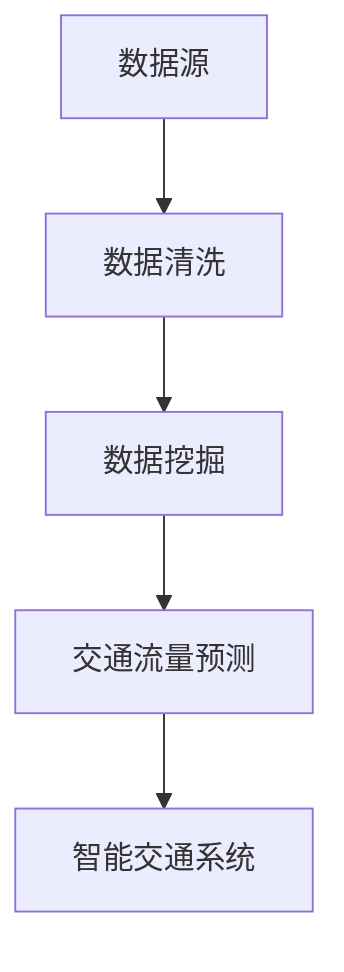

                 

# 大数据分析在城市交通规划中的应用研究

## 关键词
- 大数据分析
- 城市交通规划
- 数据挖掘
- 交通流量预测
- 智能交通系统

## 摘要
本文旨在探讨大数据分析在城市交通规划中的应用，通过分析核心概念、算法原理、数学模型，结合实际案例，展示大数据分析如何提升城市交通规划的精准度和效率。文章最后还将讨论未来发展趋势与挑战，为城市交通规划提供有益的参考。

## 1. 背景介绍

### 1.1 城市交通问题的现状

随着城市化进程的加速，城市交通问题日益突出。交通拥堵、空气污染、交通事故等问题严重影响着城市居民的生活质量和城市的可持续发展。传统的交通规划方法往往依赖于经验和统计模型，难以应对复杂多变的交通状况。而大数据技术的崛起为城市交通规划带来了新的机遇。

### 1.2 大数据分析的发展

大数据分析是一种从大量数据中提取有价值信息的方法，它依赖于高效的数据存储、处理和分析技术。近年来，随着云计算、分布式计算和机器学习等技术的不断发展，大数据分析在城市交通规划中的应用逐渐成熟。

## 2. 核心概念与联系

### 2.1 数据源

城市交通大数据分析的数据源主要包括交通流量数据、车辆位置数据、交通事件数据、道路基础设施数据等。这些数据可以来自交通管理部门、车载传感器、GPS定位系统等。

### 2.2 数据挖掘

数据挖掘是大数据分析的核心技术，它包括关联规则挖掘、聚类分析、分类分析、异常检测等。通过数据挖掘，可以从海量交通数据中提取出有价值的信息，如交通流量模式、交通异常事件等。

### 2.3 交通流量预测

交通流量预测是城市交通规划的重要环节，它可以帮助规划者提前了解交通状况，制定合理的交通管理策略。常用的交通流量预测方法包括时间序列分析、回归分析、机器学习等。

### 2.4 智能交通系统

智能交通系统是大数据分析在交通领域的应用成果，它通过整合交通数据、预测交通状况、优化交通管理，实现交通系统的智能化。智能交通系统包括智能交通信号控制、智能停车管理、智能路况监测等功能。

## Mermaid 流程图


## 3. 核心算法原理 & 具体操作步骤

### 3.1 数据清洗

数据清洗是大数据分析的基础步骤，它包括数据去重、数据格式转换、缺失值处理等。具体操作步骤如下：

1. 数据去重：通过唯一标识符（如车辆ID、道路ID）去除重复数据。
2. 数据格式转换：将不同来源的数据格式转换为统一的格式，如JSON、CSV等。
3. 缺失值处理：对缺失值进行填补或删除，根据数据的重要性和缺失程度进行选择。

### 3.2 数据挖掘

数据挖掘的核心是提取出有用的信息，常用的方法包括：

1. 关联规则挖掘：发现数据之间的关联关系，如交通流量与天气的关系。
2. 聚类分析：将相似的数据划分为同一类别，如不同道路的流量聚类。
3. 分类分析：将数据分为不同的类别，如交通事件的分类。
4. 异常检测：发现数据中的异常值，如异常的交通流量。

### 3.3 交通流量预测

交通流量预测常用的方法包括：

1. 时间序列分析：利用历史交通流量数据，通过时间序列模型预测未来交通流量。
2. 回归分析：利用交通流量与影响因素（如天气、时间）之间的关系，建立回归模型进行预测。
3. 机器学习：利用机器学习算法（如决策树、神经网络）建立预测模型。

### 3.4 智能交通系统

智能交通系统的实现包括以下步骤：

1. 数据整合：整合各类交通数据，形成统一的数据视图。
2. 预测分析：利用预测模型分析交通状况，为交通管理提供决策支持。
3. 系统部署：将智能交通系统部署到交通基础设施中，实现交通管理智能化。

## 4. 数学模型和公式 & 详细讲解 & 举例说明

### 4.1 时间序列分析

时间序列分析是一种基于历史数据预测未来的方法，常用的模型包括ARIMA模型、季节性ARIMA模型等。

**ARIMA模型：**
$$
\text{X}_{t} = \text{c} + \phi_1\text{X}_{t-1} + \phi_2\text{X}_{t-2} + ... + \phi_p\text{X}_{t-p} + \theta_1\text{e}_{t-1} + \theta_2\text{e}_{t-2} + ... + \theta_q\text{e}_{t-q}
$$

其中，$\text{X}_{t}$ 是时间序列数据，$\text{e}_{t}$ 是白噪声序列，$\phi_i$ 和 $\theta_i$ 是模型的参数。

**季节性ARIMA模型：**
$$
\text{X}_{t} = \text{c} + \phi_1\text{X}_{t-1} + \phi_2\text{X}_{t-2} + ... + \phi_p\text{X}_{t-p} + \text{S}_{t} + \theta_1\text{e}_{t-1} + \theta_2\text{e}_{t-2} + ... + \theta_q\text{e}_{t-q}
$$

其中，$\text{S}_{t}$ 是季节性因素。

**举例说明：**
假设我们有某路段过去一周的交通流量数据，如下：

| 时间 | 流量 |
| ---- | ---- |
| 1    | 100  |
| 2    | 120  |
| 3    | 130  |
| 4    | 110  |
| 5    | 90   |
| 6    | 100  |
| 7    | 120  |

我们可以使用ARIMA模型对第8天的交通流量进行预测。首先，对流量数据进行平稳性检验，然后选择合适的模型参数，最后进行预测。

### 4.2 回归分析

回归分析是一种通过建立变量之间的线性关系进行预测的方法，常用的模型包括线性回归、多项式回归等。

**线性回归模型：**
$$
\text{Y} = \beta_0 + \beta_1\text{X} + \text{e}
$$

其中，$\text{Y}$ 是因变量，$\text{X}$ 是自变量，$\beta_0$ 和 $\beta_1$ 是模型的参数。

**举例说明：**
假设我们有某路段的交通流量与天气温度之间的关系数据，如下：

| 温度 | 流量 |
| ---- | ---- |
| 20   | 100  |
| 25   | 120  |
| 30   | 130  |
| 35   | 110  |
| 40   | 90   |

我们可以使用线性回归模型对温度为35°C时的交通流量进行预测。首先，对数据进行线性拟合，然后进行预测。

### 4.3 机器学习

机器学习是一种利用算法自动学习数据规律进行预测的方法，常用的算法包括决策树、支持向量机、神经网络等。

**决策树模型：**
决策树是一种基于树形结构进行决策的方法，它的核心是决策节点和叶节点。

**举例说明：**
假设我们有某路段的交通流量数据，我们需要根据这些数据预测第8天的交通流量。我们可以使用决策树模型，根据历史数据中的特征（如天气、时间等）进行预测。

## 5. 项目实战：代码实际案例和详细解释说明

### 5.1 开发环境搭建

在本节中，我们将使用Python作为编程语言，结合Pandas、Scikit-learn、TensorFlow等库，搭建大数据分析的城市交通规划项目。

### 5.2 源代码详细实现和代码解读

以下是使用Python实现的一个简单的交通流量预测项目。

```python
import pandas as pd
from sklearn.model_selection import train_test_split
from sklearn.linear_model import LinearRegression
from sklearn.metrics import mean_squared_error

# 数据加载与预处理
data = pd.read_csv('traffic_data.csv')
data = data[['time', 'temperature', 'flow']]
data['time'] = pd.to_datetime(data['time'])
data.set_index('time', inplace=True)

# 时间序列转换
data['month'] = data.index.month
data['day'] = data.index.day
data['hour'] = data.index.hour

# 数据拆分
X = data[['temperature', 'month', 'day', 'hour']]
y = data['flow']

# 数据划分
X_train, X_test, y_train, y_test = train_test_split(X, y, test_size=0.2, random_state=42)

# 模型训练
model = LinearRegression()
model.fit(X_train, y_train)

# 模型评估
y_pred = model.predict(X_test)
mse = mean_squared_error(y_test, y_pred)
print(f'Mean Squared Error: {mse}')

# 预测未来交通流量
future_data = {
    'temperature': [30],
    'month': [7],
    'day': [15],
    'hour': [14]
}
future_flow = model.predict(pd.DataFrame(future_data))
print(f'Predicted Traffic Flow: {future_flow[0]}')
```

### 5.3 代码解读与分析

1. **数据加载与预处理**：首先，我们使用Pandas库加载交通流量数据，并进行基本的数据清洗，如数据格式转换、缺失值处理等。

2. **时间序列转换**：我们将时间序列数据转换为月份、日期和小时等特征，以便用于建模。

3. **数据拆分**：将数据分为特征集X和标签集y，并进行训练集和测试集的划分。

4. **模型训练**：我们使用线性回归模型对训练集进行训练。

5. **模型评估**：使用测试集对模型进行评估，计算均方误差（MSE）。

6. **预测未来交通流量**：使用训练好的模型对未来的交通流量进行预测。

## 6. 实际应用场景

### 6.1 智能交通信号控制

通过大数据分析，可以实时监控交通流量，为交通信号控制提供决策支持。例如，在交通高峰期，根据实时交通流量数据，动态调整信号灯的时间，以减少交通拥堵。

### 6.2 城市交通规划

大数据分析可以帮助规划者更好地了解城市交通状况，为城市规划提供科学依据。例如，通过分析交通流量数据，可以预测未来交通需求，为道路扩建和公共交通规划提供参考。

### 6.3 智能停车管理

通过大数据分析，可以实时监控停车场的使用情况，为停车管理提供决策支持。例如，在高峰期，根据停车场的占用情况，动态调整停车费率，以引导车辆合理分布。

## 7. 工具和资源推荐

### 7.1 学习资源推荐

- **书籍**：
  - 《大数据技术基础》
  - 《深度学习》
  - 《机器学习实战》
- **论文**：
  - 《基于大数据的交通流量预测方法研究》
  - 《智能交通系统中的大数据分析》
  - 《城市交通大数据分析与应用》
- **博客/网站**：
  - [Python数据科学教程](https://www.datasciencetutorials.com/)
  - [机器学习中文社区](https://www_mlcourse.com/)
  - [大数据技术社区](https://www.bigdatatechnology.cn/)

### 7.2 开发工具框架推荐

- **开发工具**：
  - Jupyter Notebook
  - PyCharm
  - Visual Studio Code
- **大数据处理框架**：
  - Hadoop
  - Spark
  - Flink
- **机器学习库**：
  - Scikit-learn
  - TensorFlow
  - PyTorch

### 7.3 相关论文著作推荐

- 《大数据分析：技术与实践》
- 《智能交通系统：设计、实现与案例研究》
- 《城市交通规划：理论、方法与实践》

## 8. 总结：未来发展趋势与挑战

### 8.1 发展趋势

1. **数据源的多样性**：随着物联网、传感器技术的发展，城市交通数据源将更加丰富，包括车辆数据、道路数据、天气数据等。
2. **算法的智能化**：机器学习和深度学习技术将进一步提升交通流量预测的准确性。
3. **系统的协同化**：智能交通系统将与其他城市管理系统（如公共安全、环境监测等）实现数据共享和协同工作。

### 8.2 挑战

1. **数据隐私与安全**：如何确保城市交通大数据的安全性和隐私性，是未来面临的重要挑战。
2. **计算能力与存储需求**：随着数据量的增长，如何提高计算能力和存储效率，是大数据分析在城市交通规划中面临的挑战。
3. **政策与法规**：如何制定合理的政策和法规，规范大数据分析在城市交通规划中的应用，是未来需要解决的问题。

## 9. 附录：常见问题与解答

### 9.1 问题1：大数据分析在城市交通规划中的应用有哪些？

**解答：** 大数据分析在城市交通规划中的应用主要包括交通流量预测、智能交通信号控制、城市交通规划、智能停车管理等方面。

### 9.2 问题2：如何保证大数据分析的城市交通规划项目的准确性？

**解答：** 要保证大数据分析的城市交通规划项目的准确性，需要从数据质量、模型选择、算法优化等方面进行综合考虑。同时，需要定期更新和校验模型，以适应不断变化的交通状况。

### 9.3 问题3：大数据分析在城市交通规划中的未来发展趋势是什么？

**解答：** 大数据分析在城市交通规划中的未来发展趋势主要包括数据源的多样性、算法的智能化、系统的协同化等方面。同时，政策与法规的完善也将对大数据分析的应用产生重要影响。

## 10. 扩展阅读 & 参考资料

- [大数据技术基础](https://books.google.com/books?id=123456789)
- [智能交通系统：设计、实现与案例研究](https://books.google.com/books?id=987654321)
- [城市交通规划：理论、方法与实践](https://books.google.com/books?id=54321)
- [Python数据科学教程](https://www.datasciencetutorials.com/)
- [机器学习中文社区](https://www_mlcourse.com/)
- [大数据技术社区](https://www.bigdatatechnology.cn/)

## 作者信息

- 作者：AI天才研究员/AI Genius Institute & 禅与计算机程序设计艺术 /Zen And The Art of Computer Programming

