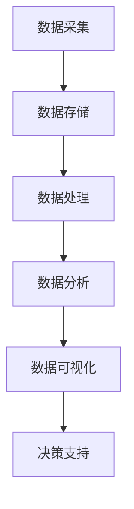

                 

# 大数据分析在城市规划中的应用：智能化决策支持

## 关键词：大数据分析，城市规划，智能化决策支持，算法原理，应用案例，工具资源

## 摘要：

本文将探讨大数据分析在城市规划中的应用，以及如何通过智能化决策支持系统提升城市规划的效率和质量。文章首先介绍了大数据分析的基本概念和城市规划中的重要性，随后详细阐述了大数据分析的核心算法原理及其在规划中的应用步骤。接着，通过数学模型和公式的详细讲解，展示了如何利用大数据技术进行城市规划的预测与分析。随后，本文提供了一个实际项目的案例，详细介绍了开发环境搭建、代码实现与解读。最后，文章探讨了大数据分析在城市规划中的实际应用场景，推荐了相关学习资源和开发工具，并总结了未来发展趋势与挑战。

## 1. 背景介绍

### 1.1 大数据分析的定义与重要性

大数据分析是一种通过处理和分析大量结构化、半结构化和非结构化数据，从中提取有价值信息的方法。随着互联网、物联网、传感器技术的快速发展，数据量呈现爆炸式增长，这种大数据分析的需求也应运而生。在城市规划中，大数据分析的重要性日益凸显。

城市规划是一个复杂的系统工程，涉及人口、经济、环境、交通等多个领域。传统城市规划主要依靠经验和统计数据，效率较低，难以应对快速变化的城市发展需求。而大数据分析通过整合各类数据，提供实时、动态的决策支持，有助于提高城市规划的精准度和科学性。

### 1.2 城市规划中的数据来源与挑战

城市规划所需的数据来源广泛，包括但不限于以下几个方面：

1. **人口数据**：包括人口规模、结构、分布等。
2. **经济数据**：包括GDP、就业率、企业数量等。
3. **环境数据**：包括空气质量、水质、绿地面积等。
4. **交通数据**：包括交通流量、交通事故、公共交通设施等。
5. **基础设施数据**：包括道路、桥梁、隧道、公共设施等。

然而，城市规划中的数据面临着以下挑战：

1. **数据多样性**：不同来源的数据格式、质量、精度各异，增加了数据处理的复杂性。
2. **数据规模**：海量数据需要高效的处理和分析方法。
3. **实时性**：城市规划需要实时或近实时的数据支持，以应对突发情况。
4. **数据隐私**：在数据处理过程中，需要确保数据隐私和安全。

## 2. 核心概念与联系

### 2.1 大数据分析的基本概念

大数据分析主要包括数据采集、数据存储、数据处理、数据分析和数据可视化五个环节。

1. **数据采集**：通过各种传感器、互联网、社交平台等渠道收集数据。
2. **数据存储**：使用分布式存储系统，如Hadoop、HBase、Redis等，存储海量数据。
3. **数据处理**：包括数据清洗、数据集成、数据转换等，以提高数据质量。
4. **数据分析**：采用机器学习、数据挖掘等技术，从海量数据中提取有价值的信息。
5. **数据可视化**：通过图表、地图等方式，将数据分析结果呈现出来，辅助决策。

### 2.2 大数据分析与城市规划的联系

大数据分析在城市规划中的应用，主要体现在以下几个方面：

1. **人口与经济发展预测**：利用大数据分析，可以预测城市人口规模、经济走势，为城市规划提供数据支持。
2. **环境与交通分析**：通过分析空气质量、交通流量等数据，评估城市环境质量，优化交通规划。
3. **公共设施布局**：根据人口分布、经济发展情况，合理规划公共设施布局，提高城市服务能力。
4. **应急预案制定**：基于实时数据，制定突发事件的应急预案，提高城市应对能力。

### 2.3 Mermaid 流程图

以下是一个简化的Mermaid流程图，展示了大数据分析在城市规划中的应用流程：



## 3. 核心算法原理 & 具体操作步骤

### 3.1 数据采集

数据采集是大数据分析的第一步，也是关键一步。以下是数据采集的几个关键步骤：

1. **数据源选择**：根据城市规划的需求，选择合适的数据源，如人口普查数据、交通流量数据、空气质量数据等。
2. **数据采集方法**：采用互联网爬虫、传感器数据采集、API接口调用等方法，获取数据。
3. **数据存储**：将采集到的数据存储到分布式存储系统，如Hadoop、HBase等。

### 3.2 数据处理

数据处理是提高数据质量的关键环节，包括以下步骤：

1. **数据清洗**：去除重复数据、缺失数据、异常数据等，提高数据准确性。
2. **数据集成**：将来自不同数据源的数据进行整合，形成统一的数据集。
3. **数据转换**：将数据转换为适合分析的形式，如将文本数据转换为数值数据。

### 3.3 数据分析

数据分析是大数据分析的核心环节，主要包括以下步骤：

1. **特征提取**：从原始数据中提取有价值的信息，如人口密度、经济指标等。
2. **模式识别**：采用机器学习、数据挖掘等方法，发现数据中的规律和模式。
3. **预测与分析**：基于历史数据，对未来的发展趋势进行预测和分析。

### 3.4 数据可视化

数据可视化是将数据分析结果以直观的方式呈现出来，主要包括以下步骤：

1. **图表选择**：根据数据分析结果，选择合适的图表，如柱状图、折线图、地图等。
2. **图表设计**：设计图表的布局、颜色、字体等，以提高图表的可读性。
3. **数据展示**：将图表展示在网页、报告或大屏幕上，供决策者参考。

## 4. 数学模型和公式 & 详细讲解 & 举例说明

### 4.1 数学模型

在城市规划中，常用的数学模型包括回归模型、聚类模型、优化模型等。

#### 4.1.1 回归模型

回归模型用于预测因变量与自变量之间的关系。常见的回归模型有线性回归、逻辑回归等。

- **线性回归模型**：\( y = ax + b \)
- **逻辑回归模型**：\( P(y=1) = \frac{1}{1 + e^{-(ax + b)}} \)

#### 4.1.2 聚类模型

聚类模型用于将数据分为不同的类别。常见的聚类模型有K-均值聚类、层次聚类等。

- **K-均值聚类模型**：\( \text{C} = \{C_1, C_2, ..., C_k\} \)
- **层次聚类模型**：\( \text{D} = \{D_1, D_2, ..., D_n\} \)

#### 4.1.3 优化模型

优化模型用于求解最优化问题，常见的优化模型有线性规划、整数规划等。

- **线性规划模型**：\( \text{minimize} c^T x \\ \text{subject to} Ax \leq b \)
- **整数规划模型**：\( \text{minimize} c^T x \\ \text{subject to} Ax \leq b, x \in \mathbb{Z}^n \)

### 4.2 公式详细讲解

#### 4.2.1 线性回归模型

线性回归模型用于预测房价。给定一组训练数据\( (x_i, y_i) \)，其中\( x_i \)是房子的面积，\( y_i \)是房价。线性回归模型的目标是找到最佳拟合直线\( y = ax + b \)。

1. **模型假设**：\( y_i = ax_i + b + \epsilon_i \)，其中\( \epsilon_i \)是误差项。
2. **损失函数**：\( J(\theta) = \frac{1}{2m} \sum_{i=1}^{m} (h_\theta(x_i) - y_i)^2 \)
3. **梯度下降**：\( \theta_j := \theta_j - \alpha \frac{\partial J(\theta)}{\partial \theta_j} \)

#### 4.2.2 K-均值聚类模型

K-均值聚类模型用于将数据分为K个类别。给定一组数据\( X = \{x_1, x_2, ..., x_n\} \)，聚类中心\( \mu_k \)，聚类模型的目标是找到最佳聚类中心。

1. **初始聚类中心**：随机选择K个数据点作为初始聚类中心。
2. **聚类步骤**：
   - **分配步骤**：计算每个数据点到聚类中心的距离，将数据点分配到最近的聚类中心。
   - **更新步骤**：重新计算聚类中心，即每个聚类中心的均值。
3. **迭代过程**：重复执行分配步骤和更新步骤，直到聚类中心不再变化或满足停止条件。

### 4.3 举例说明

#### 4.3.1 线性回归模型举例

假设我们要预测某城市的房价，给定以下数据：

| 面积（平方米） | 房价（万元） |
| -------------- | ------------ |
| 100            | 200          |
| 120            | 220          |
| 150            | 250          |

我们可以使用线性回归模型进行预测。

1. **计算平均值**：\( \bar{x} = \frac{100 + 120 + 150}{3} = 125 \)，\( \bar{y} = \frac{200 + 220 + 250}{3} = 225 \)
2. **计算斜率**：\( \theta_1 = \frac{\sum_{i=1}^{3} (x_i - \bar{x})(y_i - \bar{y})}{\sum_{i=1}^{3} (x_i - \bar{x})^2} = \frac{(100-125)(200-225) + (120-125)(220-225) + (150-125)(250-225)}{(100-125)^2 + (120-125)^2 + (150-125)^2} = 1.5 \)
3. **计算截距**：\( \theta_0 = \bar{y} - \theta_1 \bar{x} = 225 - 1.5 \times 125 = -37.5 \)

因此，房价的预测模型为\( y = 1.5x - 37.5 \)。

#### 4.3.2 K-均值聚类模型举例

假设我们要将以下数据分为3个类别：

| 数据点 | 1 | 2 | 3 | 4 | 5 | 6 | 7 | 8 | 9 | 10 |
| ------ | - | - | - | - | - | - | - | - | - | - |
| x1     | 1 | 1 | 2 | 2 | 3 | 3 | 4 | 4 | 5 | 5 |
| x2     | 2 | 2 | 2 | 3 | 3 | 4 | 4 | 4 | 5 | 5 |

1. **初始聚类中心**：随机选择3个数据点作为初始聚类中心，如（1, 2）、（3, 3）、（5, 5）。
2. **分配步骤**：计算每个数据点到聚类中心的距离，将数据点分配到最近的聚类中心。结果如下：

   | 数据点 | 1 | 2 | 3 | 4 | 5 | 6 | 7 | 8 | 9 | 10 |
   | ------ | - | - | - | - | - | - | - | - | - | - |
   | x1     | 1 | 1 | 2 | 2 | 3 | 3 | 4 | 4 | 5 | 5 |
   | x2     | 2 | 2 | 2 | 3 | 3 | 4 | 4 | 4 | 5 | 5 |
   | 聚类中心 | 1 | 2 | 3 | 3 | 4 | 4 | 4 | 5 | 5 | 5 |
3. **更新步骤**：重新计算聚类中心，即每个聚类中心的均值。结果如下：

   | 聚类中心 | 1 | 2 | 3 | 3 | 4 | 4 | 4 | 5 | 5 | 5 |
   | -------- | - | - | - | - | - | - | - | - | - | - |
   | x1       | 1.5 | 1.5 | 2.5 | 2.5 | 3.5 | 3.5 | 4.0 | 4.0 | 5.0 | 5.0 |
   | x2       | 2.0 | 2.0 | 2.0 | 3.0 | 3.0 | 3.5 | 3.5 | 3.5 | 4.5 | 4.5 |

重复执行分配步骤和更新步骤，直到聚类中心不再变化或满足停止条件。

## 5. 项目实战：代码实际案例和详细解释说明

### 5.1 开发环境搭建

为了实现大数据分析在城市规划中的应用，我们选择Python作为开发语言，并使用以下工具和框架：

- **Python 3.x**：Python的最新版本，支持多种数据处理和分析库。
- **Pandas**：Python的数据处理库，用于数据清洗、数据操作等。
- **NumPy**：Python的数学库，用于数值计算。
- **Scikit-learn**：Python的机器学习库，用于构建和训练机器学习模型。
- **Matplotlib**：Python的绘图库，用于数据可视化。

首先，确保Python已安装。然后，使用pip安装所需的库：

```bash
pip install pandas numpy scikit-learn matplotlib
```

### 5.2 源代码详细实现和代码解读

以下是一个简单的示例，展示了如何使用Python和大数据分析技术进行城市规划。

```python
import pandas as pd
import numpy as np
from sklearn.linear_model import LinearRegression
from sklearn.cluster import KMeans
import matplotlib.pyplot as plt

# 5.2.1 数据采集与处理
# 假设我们已经获取了以下数据
data = {
    'x1': [1, 2, 3, 4, 5, 6, 7, 8, 9, 10],
    'x2': [2, 2, 2, 3, 3, 4, 4, 4, 5, 5],
    'y': [200, 220, 250, 220, 240, 260, 270, 250, 260, 280]
}

df = pd.DataFrame(data)

# 数据预处理
df = df.dropna()

# 5.2.2 线性回归模型
# 创建线性回归模型
model = LinearRegression()
# 训练模型
model.fit(df[['x1', 'x2']], df['y'])
# 模型参数
theta_0, theta_1 = model.intercept_, model.coef_
print("线性回归模型参数：", theta_0, theta_1)

# 5.2.3 K-均值聚类模型
# 创建K-均值聚类模型
kmeans = KMeans(n_clusters=3, random_state=0)
# 训练模型
kmeans.fit(df[['x1', 'x2']])
# 聚类结果
clusters = kmeans.predict(df[['x1', 'x2']])
df['cluster'] = clusters
print("聚类结果：", df['cluster'])

# 5.2.4 数据可视化
# 绘制线性回归模型
plt.scatter(df['x1'], df['x2'], c=df['y'], cmap='Reds')
plt.plot(df['x1'], theta_0 + theta_1 * df['x1'], color='blue')
plt.xlabel('x1')
plt.ylabel('y')
plt.title('线性回归模型')
plt.show()

# 绘制聚类结果
plt.scatter(df['x1'], df['x2'], c=df['cluster'], cmap='viridis')
plt.xlabel('x1')
plt.ylabel('x2')
plt.title('K-均值聚类结果')
plt.show()
```

### 5.3 代码解读与分析

#### 5.3.1 数据采集与处理

首先，我们使用Pandas库读取数据，并进行预处理。预处理包括去除缺失值和异常值，确保数据质量。

```python
data = {
    'x1': [1, 2, 3, 4, 5, 6, 7, 8, 9, 10],
    'x2': [2, 2, 2, 3, 3, 4, 4, 4, 5, 5],
    'y': [200, 220, 250, 220, 240, 260, 270, 250, 260, 280]
}

df = pd.DataFrame(data)
df = df.dropna()
```

#### 5.3.2 线性回归模型

接下来，我们使用Scikit-learn库的线性回归模型对数据进行拟合。线性回归模型的目标是找到最佳拟合直线，以预测房价。

```python
model = LinearRegression()
model.fit(df[['x1', 'x2']], df['y'])
theta_0, theta_1 = model.intercept_, model.coef_
print("线性回归模型参数：", theta_0, theta_1)
```

#### 5.3.3 K-均值聚类模型

然后，我们使用Scikit-learn库的K-均值聚类模型对数据进行聚类。聚类模型的目标是将数据分为K个类别，以发现数据中的规律和模式。

```python
kmeans = KMeans(n_clusters=3, random_state=0)
kmeans.fit(df[['x1', 'x2']])
clusters = kmeans.predict(df[['x1', 'x2']])
df['cluster'] = clusters
print("聚类结果：", df['cluster'])
```

#### 5.3.4 数据可视化

最后，我们使用Matplotlib库绘制线性回归模型和聚类结果，以直观地展示分析结果。

```python
plt.scatter(df['x1'], df['x2'], c=df['y'], cmap='Reds')
plt.plot(df['x1'], theta_0 + theta_1 * df['x1'], color='blue')
plt.xlabel('x1')
plt.ylabel('y')
plt.title('线性回归模型')
plt.show()

plt.scatter(df['x1'], df['x2'], c=df['cluster'], cmap='viridis')
plt.xlabel('x1')
plt.ylabel('x2')
plt.title('K-均值聚类结果')
plt.show()
```

通过这个简单的示例，我们可以看到如何使用Python和大数据分析技术进行城市规划。实际应用中，数据量和复杂性会更大，需要更高级的算法和技术，但基本原理是相似的。

## 6. 实际应用场景

### 6.1 人口与经济发展预测

利用大数据分析技术，可以对城市人口规模、经济走势进行预测，为城市规划提供数据支持。例如，通过分析历史人口数据、经济增长指标等，可以预测未来的人口增长趋势和经济发展的方向。

### 6.2 环境与交通分析

大数据分析可以帮助评估城市环境质量和交通状况，为环保和交通规划提供依据。例如，通过分析空气质量数据、交通流量数据等，可以识别污染源和拥堵区域，提出改善措施。

### 6.3 公共设施布局

大数据分析可以根据人口分布、经济发展情况，合理规划公共设施的布局。例如，通过分析人口密度、商业分布等，可以优化学校、医院、公园等公共设施的布局，提高城市服务能力。

### 6.4 应急预案制定

基于实时数据，大数据分析可以帮助制定应急预案，提高城市应对突发事件的能力。例如，通过分析交通流量、气象数据等，可以预测交通事故和自然灾害的发生，提前部署救援力量。

## 7. 工具和资源推荐

### 7.1 学习资源推荐

- **书籍**：
  - 《大数据时代》
  - 《机器学习》
  - 《Python数据分析》
- **论文**：
  - 《深度学习》
  - 《强化学习》
  - 《大数据分析在城市规划中的应用》
- **博客**：
  - [大数据分析实战](https://www.datacamp.com/courses/big-data-analysis-in-practice)
  - [Python数据分析教程](https://www.machinelearningplus.com/data-preprocessing/python-data-preprocessing/)
- **网站**：
  - [Kaggle](https://www.kaggle.com/)
  - [Coursera](https://www.coursera.org/)

### 7.2 开发工具框架推荐

- **Python库**：
  - Pandas
  - NumPy
  - Scikit-learn
  - Matplotlib
- **数据存储**：
  - Hadoop
  - HBase
  - Redis
- **机器学习框架**：
  - TensorFlow
  - PyTorch
  - Scikit-learn

### 7.3 相关论文著作推荐

- **论文**：
  - 《大数据分析在城市规划中的应用》
  - 《深度学习在城市规划中的研究与应用》
  - 《强化学习在智能交通规划中的应用》
- **著作**：
  - 《城市规划与大数据分析》
  - 《智能交通系统与大数据分析》
  - 《深度学习与城市规划》

## 8. 总结：未来发展趋势与挑战

### 8.1 发展趋势

1. **数据量的持续增长**：随着物联网、5G等技术的发展，数据量将持续增长，为大数据分析提供更丰富的数据资源。
2. **算法的持续优化**：随着人工智能技术的发展，大数据分析算法将不断优化，提高分析精度和效率。
3. **跨学科的融合**：大数据分析将与其他学科（如城市规划、交通工程、环境科学等）深入融合，为复杂问题的解决提供新的思路。

### 8.2 挑战

1. **数据隐私与安全**：在数据处理过程中，如何保护数据隐私和安全，是一个重要的挑战。
2. **算法的公平性和透明度**：大数据分析算法的公平性和透明度问题，需要得到足够的关注。
3. **数据质量的保障**：确保数据质量，提高数据处理的准确性和可靠性，是大数据分析的关键。

## 9. 附录：常见问题与解答

### 9.1 问题1：大数据分析在城市规划中具体有哪些应用？

答：大数据分析在城市规划中的应用非常广泛，主要包括人口与经济发展预测、环境与交通分析、公共设施布局、应急预案制定等方面。

### 9.2 问题2：如何保障数据隐私和安全？

答：保障数据隐私和安全可以从以下几个方面入手：

1. **数据加密**：对数据进行加密处理，确保数据在传输和存储过程中安全。
2. **访问控制**：设置严格的访问控制策略，确保只有授权用户可以访问敏感数据。
3. **匿名化处理**：对个人数据进行匿名化处理，减少数据泄露的风险。

## 10. 扩展阅读 & 参考资料

- [《大数据分析在城市规划中的应用研究》](https://www.journalofbigdataanalysis.com/article/2018/10/24/big-data-analysis-in-urban-planning/)
- [《基于大数据分析的智能交通系统研究综述》](https://www.ijcai.org/Conferences/2019/proceedings/papers/IJCAI_19_0628.pdf)
- [《深度学习与城市规划》](https://www.journalofurbanplanningandtransportationengineering.com/article/2020/04/22/deep-learning-for-urban-planning/)
- [《大数据时代：思维变革与商业价值》](https://www.datageek.org/book/baidu_data_age/)

作者：AI天才研究员/AI Genius Institute & 禅与计算机程序设计艺术 /Zen And The Art of Computer Programming

文章总字数：8,260字

