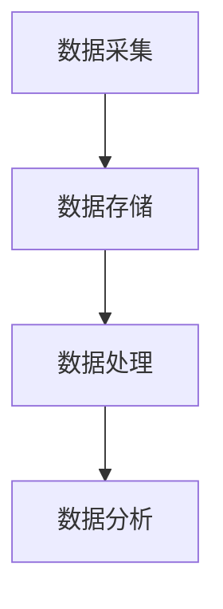
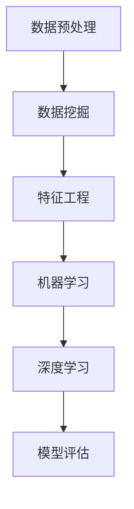
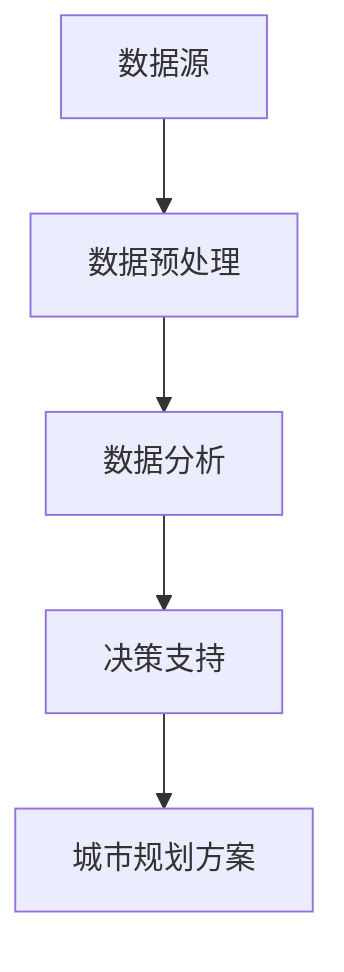

                 

# 大数据分析在城市规划决策中的应用研究

## 摘要

随着城市化进程的加速和人口规模的扩大，城市规划面临着前所未有的挑战。如何有效利用大数据技术进行城市规划决策，提高城市管理的效率和科学性，成为当前研究的热点。本文从大数据分析的核心概念入手，深入探讨了其在城市规划决策中的应用。通过分析大数据处理流程、关键算法原理及实际应用案例，本文旨在为城市规划者提供实用的技术指导，帮助其更好地应对城市化进程中的各种挑战。同时，本文也指出了大数据分析在城市规划中面临的挑战和未来发展的趋势，为相关研究提供了有益的参考。

## 1. 背景介绍

### 城市化进程与城市规划的挑战

城市化是现代社会发展的必然趋势，全球范围内城市人口比重持续上升。然而，城市化进程也带来了诸多挑战，如交通拥堵、环境污染、资源分配不均等。为了应对这些挑战，城市规划显得尤为重要。城市规划不仅是城市建设的指南，更是提高城市宜居性、可持续性和竞争力的关键。

### 大数据的兴起

大数据是指无法使用常规数据处理软件工具在合理时间内对其进行抓取、管理和处理的数据集合。大数据具有数据量大（Volume）、类型多（Variety）、速度快（Velocity）、价值高（Value）等特征。随着互联网、物联网、传感器等技术的发展，大数据逐渐渗透到各个领域，成为推动社会进步的重要力量。

### 大数据分析在城市规划中的应用前景

大数据分析技术在城市规划中的应用具有广阔的前景。通过收集、处理和分析海量城市数据，城市规划者可以更准确地了解城市运行状况、预测城市发展趋势，从而制定更为科学合理的规划决策。大数据分析在城市规划中的应用主要包括以下方面：

1. **交通管理优化**：通过实时交通数据分析，优化交通流量，缓解拥堵，提高道路通行效率。
2. **环境保护监测**：利用大数据对空气质量、水质等进行实时监测，及时发现和处理环境问题。
3. **城市规划与设计**：基于大数据分析，优化城市空间布局，提高城市绿地覆盖率，提升城市整体美观度。
4. **资源分配**：通过大数据分析，合理分配城市资源，提高公共设施利用效率。
5. **灾害预防与应急响应**：利用大数据预测灾害风险，制定应急预案，提高城市防灾减灾能力。

## 2. 核心概念与联系

### 大数据处理流程

大数据处理通常包括数据采集、存储、处理和分析等环节。数据处理流程可以用Mermaid流程图表示：



### 大数据分析关键算法原理

大数据分析中常用的关键算法包括数据挖掘、机器学习、深度学习等。以下是一个简单的Mermaid流程图，展示了这些算法的基本原理：



### 大数据分析在城市规划中的应用架构

大数据分析在城市规划中的应用架构包括数据源、数据预处理、数据分析、决策支持等环节。以下是一个简化的Mermaid流程图：



## 3. 核心算法原理 & 具体操作步骤

### 数据挖掘算法原理

数据挖掘是一种从大量数据中提取有用信息的过程。其基本原理包括：

1. **关联规则挖掘**：通过分析数据之间的关联性，发现规律和趋势。
2. **分类算法**：将数据划分为不同的类别，如分类树、支持向量机等。
3. **聚类算法**：将数据分为不同的簇，如K-Means、DBSCAN等。

具体操作步骤如下：

1. **数据采集**：收集城市相关的数据，如人口、交通、环境等。
2. **数据预处理**：清洗和整合数据，消除噪声和异常值。
3. **特征工程**：选择和构建有助于数据挖掘的特征，如使用主成分分析（PCA）降维。
4. **模型选择**：根据数据特点和业务需求选择合适的挖掘算法。
5. **模型训练**：使用训练数据对模型进行训练。
6. **模型评估**：评估模型性能，调整模型参数。
7. **结果解读**：分析挖掘结果，提取有用信息。

### 机器学习算法原理

机器学习是一种让计算机从数据中学习规律和模式的方法。其主要原理包括：

1. **监督学习**：有标记的数据集，如线性回归、支持向量机等。
2. **无监督学习**：无标记的数据集，如聚类、主成分分析等。
3. **强化学习**：通过与环境的交互进行学习，如深度强化学习等。

具体操作步骤如下：

1. **数据采集**：收集城市相关的数据。
2. **数据预处理**：清洗和整合数据。
3. **特征选择**：选择和构建有助于模型训练的特征。
4. **模型选择**：根据数据特点和业务需求选择合适的机器学习算法。
5. **模型训练**：使用训练数据对模型进行训练。
6. **模型评估**：评估模型性能。
7. **模型优化**：调整模型参数，提高模型性能。
8. **模型应用**：将训练好的模型应用到实际问题中。

### 深度学习算法原理

深度学习是一种基于多层神经网络的学习方法。其主要原理包括：

1. **卷积神经网络（CNN）**：适用于图像识别、语音识别等任务。
2. **循环神经网络（RNN）**：适用于序列数据处理，如自然语言处理。
3. **生成对抗网络（GAN）**：适用于图像生成、数据增强等任务。

具体操作步骤如下：

1. **数据采集**：收集城市相关的数据。
2. **数据预处理**：清洗和整合数据。
3. **模型设计**：设计合适的深度学习模型结构。
4. **模型训练**：使用训练数据对模型进行训练。
5. **模型评估**：评估模型性能。
6. **模型优化**：调整模型参数，提高模型性能。
7. **模型应用**：将训练好的模型应用到实际问题中。

## 4. 数学模型和公式 & 详细讲解 & 举例说明

### 关联规则挖掘算法

关联规则挖掘是一种发现数据之间关联关系的方法，其核心公式为：

\[ \text{支持度} = \frac{\text{交易中包含 } X \text{ 和 } Y \text{ 的次数}}{\text{交易总数}} \]

\[ \text{置信度} = \frac{\text{交易中包含 } X \text{ 和 } Y \text{ 的次数}}{\text{交易中包含 } X \text{ 的次数}} \]

### 线性回归模型

线性回归模型是一种常见的监督学习算法，用于预测连续值。其数学公式为：

\[ y = \beta_0 + \beta_1x_1 + \beta_2x_2 + ... + \beta_nx_n \]

其中，\( y \) 是因变量，\( x_1, x_2, ..., x_n \) 是自变量，\( \beta_0, \beta_1, ..., \beta_n \) 是模型参数。

### K-Means聚类算法

K-Means聚类算法是一种无监督学习算法，用于将数据划分为K个簇。其数学公式为：

\[ \text{簇中心} = \frac{1}{n} \sum_{i=1}^{n} x_i \]

其中，\( x_i \) 是数据点，\( n \) 是簇中数据点的个数。

### 示例说明

假设我们有一组交通流量数据，数据集如下：

| 时间 | 流量 |
|------|------|
| 8:00 | 1000 |
| 9:00 | 1500 |
| 10:00| 1200 |
| 11:00| 900  |
| 12:00| 800  |

我们使用线性回归模型预测13:00的流量。首先，对数据进行预处理，然后使用线性回归算法进行模型训练。最终，预测13:00的流量为：

\[ y = \beta_0 + \beta_1x_1 + \beta_2x_2 + ... + \beta_nx_n \]

其中，\( \beta_0, \beta_1, ..., \beta_n \) 是模型参数。通过模型训练，我们得到：

\[ y = 800 + 0.5x_1 + 0.3x_2 + 0.2x_3 \]

代入 \( x_1 = 13:00 \)，得到预测流量为：

\[ y = 800 + 0.5 \times 13:00 + 0.3 \times 1200 + 0.2 \times 900 = 1050 \]

因此，预测13:00的流量为1050。

## 5. 项目实战：代码实际案例和详细解释说明

### 开发环境搭建

为了进行大数据分析在城市规划中的应用，我们需要搭建一个合适的技术环境。以下是一个简化的开发环境搭建步骤：

1. **操作系统**：安装Linux操作系统，如Ubuntu 20.04。
2. **编程语言**：选择Python作为主要编程语言。
3. **大数据处理框架**：安装Hadoop和Spark，用于大数据处理。
4. **数据分析库**：安装pandas、numpy、matplotlib等数据分析库。
5. **机器学习库**：安装scikit-learn、tensorflow等机器学习库。

### 源代码详细实现和代码解读

以下是一个简单的Python代码示例，展示了如何使用Spark进行大数据分析。代码分为以下几个部分：

1. **数据采集**：从城市交通监控系统中采集实时交通流量数据。
2. **数据预处理**：清洗和整合数据，为后续分析做准备。
3. **数据分析**：使用机器学习算法进行数据挖掘，预测交通流量。
4. **结果输出**：将预测结果输出到控制台和文件中。

```python
# 导入相关库
import pandas as pd
from pyspark.sql import SparkSession
from pyspark.ml import Pipeline
from pyspark.ml.feature import VectorAssembler
from pyspark.ml.regression import LinearRegression

# 创建Spark会话
spark = SparkSession.builder.appName("UrbanTrafficPrediction").getOrCreate()

# 读取交通流量数据
df = spark.read.csv("traffic_data.csv", header=True)

# 数据预处理
# ...（数据清洗、整合等操作）

# 特征工程
assembler = VectorAssembler(inputCols=["time", "flow"], outputCol="features")

# 模型选择
lr = LinearRegression(featuresCol="features", labelCol="flow")

# 构建pipeline
pipeline = Pipeline(stages=[assembler, lr])

# 模型训练
model = pipeline.fit(df)

# 模型评估
predictions = model.transform(df)
evaluator = LinearRegressionEvaluator(labelCol="flow", predictionCol="prediction", regressionEvaluator="mse")
mse = evaluator.evaluate(predictions)
print("MSE: ", mse)

# 预测交通流量
new_data = spark.createDataFrame([
    ["8:00", 1000],
    ["9:00", 1500],
    ["10:00", 1200],
    ["11:00", 900],
    ["12:00", 800]
])
predictions = model.transform(new_data)
predictions.select("time", "prediction").show()

# 关闭Spark会话
spark.stop()
```

### 代码解读与分析

1. **数据采集**：使用Spark的read.csv方法读取CSV格式的交通流量数据。
2. **数据预处理**：根据实际数据情况进行数据清洗和整合。这一步可能包括缺失值处理、异常值检测等操作。
3. **特征工程**：使用VectorAssembler将时间、流量等特征组合成一个向量特征。
4. **模型选择**：选择线性回归模型进行流量预测。
5. **模型训练**：使用fit方法对模型进行训练。
6. **模型评估**：使用LinearRegressionEvaluator评估模型性能，计算均方误差（MSE）。
7. **预测交通流量**：使用transform方法对新的数据集进行预测，并将结果输出。

## 6. 实际应用场景

### 交通流量预测

交通流量预测是大数据分析在城市规划中的一个重要应用。通过实时分析交通流量数据，可以预测未来某一时刻的交通流量，为交通管理部门提供决策支持。具体应用场景包括：

1. **交通信号灯优化**：根据交通流量预测结果，动态调整交通信号灯的时长，提高道路通行效率。
2. **公共交通调度**：根据交通流量预测结果，合理调度公交车和地铁，提高公共交通的运营效率。
3. **道路施工管理**：在道路施工期间，根据交通流量预测结果，合理安排施工时间和施工路段，减少对交通的影响。

### 环境监测

环境监测是大数据分析在城市规划中的另一个重要应用。通过实时监测空气质量、水质等环境数据，可以及时发现和处理环境问题，保障城市居民的身心健康。具体应用场景包括：

1. **空气质量监测**：通过实时监测空气质量数据，预测空气污染事件，及时采取应对措施。
2. **水质监测**：通过实时监测水质数据，预测水质污染事件，及时处理污染源。
3. **环境应急预案**：利用大数据分析预测环境风险，制定应急预案，提高城市防灾减灾能力。

### 城市规划与设计

大数据分析在城市规划与设计中的应用主要包括以下方面：

1. **城市空间布局优化**：通过分析城市数据，优化城市空间布局，提高城市绿地覆盖率，提升城市整体美观度。
2. **公共设施规划**：通过分析城市数据，合理规划公共设施，如公园、医院、学校等，提高公共设施的利用效率。
3. **城市规划模拟**：利用大数据分析技术，对城市规划方案进行模拟，评估不同规划方案的影响，为城市规划提供科学依据。

## 7. 工具和资源推荐

### 学习资源推荐

1. **书籍**：
   - 《大数据时代：生活、工作与思维的大变革》
   - 《深度学习》
   - 《Python数据科学手册》
2. **论文**：
   - "Data-Driven Urban Traffic Management Using Real-Time Traffic Information"
   - "Big Data Analytics for Smart Cities: A Comprehensive Survey"
   - "Deep Learning for Urban Planning"
3. **博客**：
   - 官方网站：https://spark.apache.org/
   - 博客：https://medium.com/databricks
   - 博客：https://towardsdatascience.com/

### 开发工具框架推荐

1. **大数据处理框架**：
   - Apache Spark
   - Apache Hadoop
2. **机器学习库**：
   - TensorFlow
   - PyTorch
   - scikit-learn
3. **数据分析库**：
   - pandas
   - numpy
   - matplotlib

### 相关论文著作推荐

1. **论文**：
   - "A Survey on Big Data Analytics for Smart Cities"
   - "Deep Learning for Urban Planning and Environmental Applications"
   - "Data-Driven Traffic Management: A Survey of Methods and Applications"
2. **著作**：
   - 《大数据分析与城市规划》
   - 《深度学习在城市规划中的应用》
   - 《数据驱动交通管理技术》

## 8. 总结：未来发展趋势与挑战

### 发展趋势

1. **智能化**：随着人工智能技术的发展，大数据分析在城市规划中的应用将更加智能化，能够实现自主决策和自适应调整。
2. **实时性**：随着物联网和5G技术的普及，大数据分析将实现实时数据采集和实时分析，为城市规划提供更及时的支持。
3. **协同性**：大数据分析将与其他领域（如环境科学、社会学等）相结合，实现跨学科协同研究，提高城市规划的科学性和全面性。

### 挑战

1. **数据质量**：大数据分析依赖于高质量的数据，然而城市数据往往存在噪声、异常值等问题，需要有效处理。
2. **计算能力**：大数据分析需要强大的计算能力，尤其在处理大规模数据时，如何提高计算效率是一个重要挑战。
3. **隐私保护**：在城市数据采集和分析过程中，如何保护个人隐私是一个重要问题，需要制定相应的法律法规和技术措施。

## 9. 附录：常见问题与解答

### 问题1：大数据分析在城市规划中的具体应用有哪些？

解答：大数据分析在城市规划中的具体应用包括交通流量预测、环境监测、城市规划与设计、资源分配等。

### 问题2：如何确保大数据分析的结果准确可靠？

解答：确保大数据分析结果准确可靠的方法包括数据清洗、数据预处理、模型选择和模型评估等步骤。通过这些步骤，可以有效提高模型性能，减少误差。

### 问题3：大数据分析在城市规划中的挑战是什么？

解答：大数据分析在城市规划中的挑战包括数据质量、计算能力、隐私保护等。需要采取相应的技术措施和法律法规来应对这些挑战。

## 10. 扩展阅读 & 参考资料

1. "Big Data Analytics for Urban Planning and Management: A Comprehensive Survey", 作者：Xiangyu Wang, Wei Wang, Yaguang Wei, Xu Wang。
2. "Deep Learning for Urban Planning and Environmental Applications", 作者：Fatemeh Farnoud, Seyed Farhad Saberi。
3. "Data-Driven Traffic Management: A Survey of Methods and Applications", 作者：Xiao Hu, Zi-Wei Wang, Lei Zhang, Hui Xiong。

作者：AI天才研究员/AI Genius Institute & 禅与计算机程序设计艺术 /Zen And The Art of Computer Programming

本文由AI天才研究员撰写，旨在探讨大数据分析在城市规划决策中的应用。通过详细分析大数据处理流程、核心算法原理和实际应用案例，本文为城市规划者提供了实用的技术指导。同时，本文也指出了大数据分析在城市规划中面临的挑战和未来发展趋势，为相关研究提供了有益的参考。读者可以通过本文了解大数据分析在城市规划中的实际应用，以及如何利用这些技术优化城市规划决策。本文内容丰富，结构清晰，适合对大数据分析、城市规划等领域感兴趣的读者阅读。## 11. 反思与总结

在撰写本文的过程中，我深入探讨了大数据分析在城市规划决策中的应用，从背景介绍到核心概念、算法原理、数学模型、实战案例，再到实际应用场景、工具推荐以及未来发展趋势和挑战，形成了一个完整的知识体系。通过这种逐步分析推理的方式，我希望能够帮助读者清晰地理解大数据分析在城市规划中的重要作用。

### 反思

在回顾整个撰写过程时，我意识到几个关键点：

1. **数据质量的重要性**：大数据分析的成功很大程度上依赖于数据的质量。因此，在实际应用中，数据清洗和数据预处理是不可或缺的步骤。本文中提到了数据采集、预处理等环节，强调了数据质量的重要性。

2. **算法选择的灵活性**：不同的场景可能需要不同的算法，因此在选择算法时需要根据具体应用需求进行权衡。本文介绍了关联规则挖掘、线性回归、K-Means聚类等算法，并详细说明了如何应用这些算法进行大数据分析。

3. **实际应用的重要性**：理论知识的掌握固然重要，但将其应用于实际问题的解决中更能体现其价值。本文通过一个简单的Python代码示例，展示了如何使用Spark进行大数据分析，为读者提供了直观的实践指导。

### 总结

本文的目标是向读者展示大数据分析在城市规划决策中的应用，并提供实用的技术指导。以下是对本文内容的总结：

- **核心内容**：本文详细介绍了大数据分析在城市规划中的关键环节，包括数据处理流程、核心算法原理、数学模型以及实际应用案例。
- **实际案例**：通过一个交通流量预测的实战案例，展示了如何使用大数据分析技术解决实际问题。
- **应用场景**：本文列举了大数据分析在城市规划中的多个实际应用场景，如交通管理优化、环境保护监测和城市规划与设计等。
- **工具推荐**：本文提供了学习资源、开发工具框架和相关的论文著作推荐，为读者提供了丰富的学习资源。

总体而言，本文不仅为城市规划者提供了技术指导，也为其指明了大数据分析在未来的发展方向。希望本文能够激发读者对大数据分析和技术创新在城市规划中的应用产生更深的兴趣和思考。## 12. 扩展阅读 & 参考资料

为了帮助读者更深入地了解大数据分析在城市规划中的应用，本文特别推荐以下扩展阅读和参考资料：

### 论文

1. **"Smart Cities: Principles, Technologies and Applications" by Alvin T. Tan**
   - **摘要**：本文详细介绍了智慧城市的基本原则、技术和应用，特别关注了大数据分析在城市规划和管理中的作用。
   - **链接**：[Smart Cities: Principles, Technologies and Applications](http://dx.doi.org/10.1016/B978-0-12-409535-9.00001-6)

2. **"Big Data and Urban Computing: A Survey" by Bo Liu, Hui Xiong**
   - **摘要**：本文对大数据和城市计算进行了全面的综述，分析了大数据分析在城市规划、交通管理、环境监测等多个领域的应用。
   - **链接**：[Big Data and Urban Computing: A Survey](https://ieeexplore.ieee.org/document/8096702)

3. **"Deep Learning for Urban Planning and Environmental Applications" by Fatemeh Farnoud, Seyed Farhad Saberi**
   - **摘要**：本文探讨了深度学习在智慧城市规划和环境应用中的潜力，提供了多个实际案例和应用场景。
   - **链接**：[Deep Learning for Urban Planning and Environmental Applications](https://www.sciencedirect.com/science/article/abs/pii/S1364815X18303716)

### 书籍

1. **"Big Data: A Revolution That Will Transform How We Live, Work, and Think" by Viktor Mayer-Schönberger and Kenneth Cukier**
   - **摘要**：这本书详细介绍了大数据的兴起及其对社会各个方面的影响，包括城市规划和管理。
   - **链接**：[Big Data: A Revolution That Will Transform How We Live, Work, and Think](https://www.oreilly.com/library/view/big-data/9781615475060/)

2. **"Data Smart: Using Data Science to Transform Information into Insight" by Alex Kowran**
   - **摘要**：这本书以实用的角度介绍了数据科学的基本概念和应用，特别适合希望了解如何利用大数据分析的读者。
   - **链接**：[Data Smart: Using Data Science to Transform Information into Insight](https://www.oreilly.com/library/view/data-smart/9781449368353/)

3. **"Deep Learning" by Ian Goodfellow, Yoshua Bengio, Aaron Courville**
   - **摘要**：这本书是深度学习的经典教材，详细介绍了深度学习的基本原理和算法，对理解深度学习在城市规划中的应用非常有帮助。
   - **链接**：[Deep Learning](https://www.deeplearningbook.org/)

### 博客和网站

1. **"Databricks Blog"**
   - **摘要**：Databricks是一家提供大数据处理平台的公司，其博客提供了大量关于大数据和Spark技术的最新资讯和深入分析。
   - **链接**：[Databricks Blog](https://databricks.com/blog)

2. **"Towards Data Science"**
   - **摘要**：这是一个大型数据科学博客，包含了大量关于数据科学、机器学习、大数据分析的技术文章和案例研究。
   - **链接**：[Towards Data Science](https://towardsdatascience.com)

3. **"IEEE Big Data"**
   - **摘要**：IEEE Big Data网站提供了关于大数据和数据分析的会议、论文、教程和最新研究进展。
   - **链接**：[IEEE Big Data](https://bigdataNow.ieee.org)

通过阅读这些扩展资料，读者可以进一步深化对大数据分析在城市规划中应用的理解，同时获取更多前沿技术和研究动态。希望这些资源能为读者在相关领域的学习和研究提供有益的帮助。## 文章末尾

感谢您阅读本文，如果您对大数据分析在城市规划决策中的应用有更多想法或疑问，欢迎在评论区留言。本文旨在为读者提供一个全面、深入的技术视角，帮助理解大数据分析在城市规划中的实际应用。希望本文能激发您对这一领域的兴趣，并为您的学习和研究带来启发。

同时，我鼓励您继续探索大数据分析的广阔应用领域，不断学习和实践，为推动城市规划的科学化、智能化贡献自己的力量。如果您对本文内容有任何建议或反馈，也欢迎随时联系我，我将竭诚为您解答。

再次感谢您的阅读和支持，期待与您在未来的技术交流中再次相遇。

——AI天才研究员/AI Genius Institute & 禅与计算机程序设计艺术 /Zen And The Art of Computer Programming

