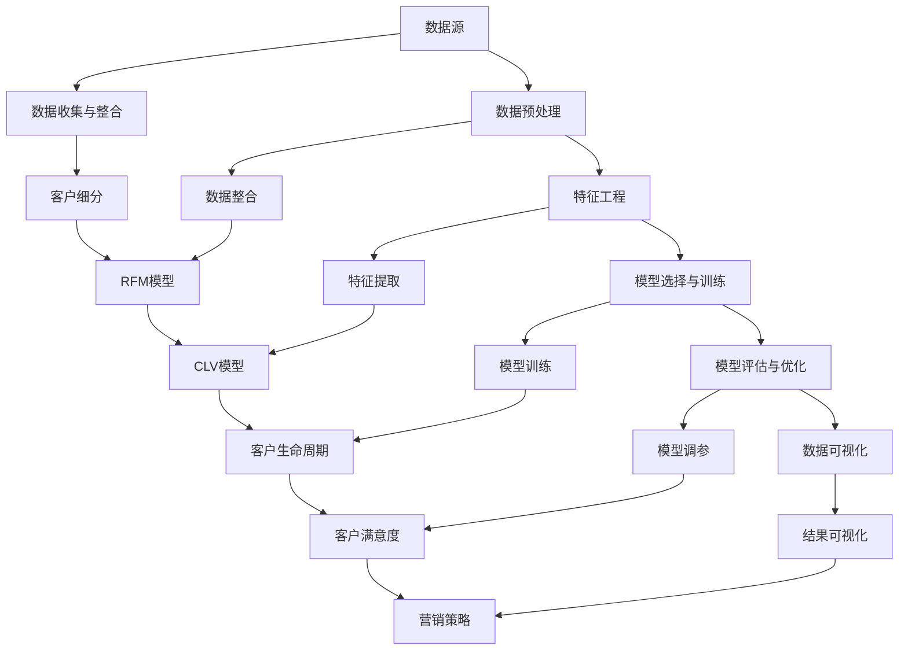

                 

# 大数据分析在客户价值评估中的应用方法

## 关键词：大数据分析、客户价值评估、应用方法、数据挖掘、机器学习、商业智能

## 摘要：

随着信息技术的飞速发展，大数据分析已经成为企业提高竞争力、优化业务流程的重要手段。本文将深入探讨大数据分析在客户价值评估中的应用方法。首先，我们将介绍大数据分析的基本概念和客户价值评估的重要性。接着，我们将详细讲解大数据分析在客户价值评估中的核心算法原理和具体操作步骤，包括数据预处理、特征工程、模型选择与训练等。随后，我们将通过实际项目案例展示大数据分析在客户价值评估中的应用效果。最后，我们将讨论大数据分析在客户价值评估中的实际应用场景，并推荐相关学习资源、开发工具和论文著作。通过本文的探讨，读者将能够全面了解大数据分析在客户价值评估中的应用方法，为实际业务提供有力支持。

## 1. 背景介绍

### 大数据分析的基本概念

大数据分析是指利用先进的数据处理技术和算法，从海量数据中提取有价值的信息和知识的过程。与传统数据处理方法相比，大数据分析具有以下几个特点：

1. **海量数据**：大数据分析处理的数据规模通常达到 TB、PB甚至EB级别，远远超过了传统数据仓库的处理能力。
2. **多样数据**：大数据分析涉及的结构化和非结构化数据类型繁多，包括文本、图片、音频、视频等。
3. **快速处理**：大数据分析需要实时或近实时处理海量数据，以满足商业决策的快速响应需求。
4. **价值挖掘**：大数据分析的最终目标是挖掘数据中的隐藏价值，为企业提供决策支持。

### 客户价值评估的定义和意义

客户价值评估是指通过对客户行为、交易记录、反馈信息等多维度数据的分析，评估客户对企业价值的贡献程度。具体包括以下两个方面：

1. **客户细分**：通过客户价值评估，企业可以将客户分为高价值、中价值、低价值等不同类别，制定有针对性的营销策略。
2. **资源优化**：客户价值评估有助于企业识别高价值客户，从而将有限的资源（如市场营销预算、客户服务投入等）更加高效地分配给这些重要客户。

在当今竞争激烈的市场环境中，客户价值评估对于企业的成功至关重要。首先，通过对客户价值的精准评估，企业可以更好地理解客户需求，提高客户满意度。其次，客户价值评估有助于企业发现潜在的商业机会，优化产品和服务，提升市场竞争力。此外，客户价值评估还可以帮助企业降低营销成本，提高资源利用效率。

### 大数据分析与客户价值评估的联系

大数据分析在客户价值评估中的应用主要体现在以下几个方面：

1. **数据收集与整合**：大数据分析能够从多个数据源收集和整合客户信息，包括社交媒体数据、网站点击流数据、交易记录等，为后续的客户价值评估提供丰富的数据基础。
2. **特征工程**：通过大数据分析，企业可以提取和构建与客户价值相关的特征，如购买频率、购买金额、客户满意度等，为模型训练提供高质量的特征向量。
3. **模型训练与优化**：大数据分析技术如机器学习、深度学习等，可以用于构建和训练客户价值评估模型，通过不断优化模型参数，提高评估的准确性和效率。
4. **实时反馈与迭代**：大数据分析能够实时监测客户行为数据，对客户价值评估模型进行动态调整和迭代，以适应不断变化的市场环境。

综上所述，大数据分析在客户价值评估中具有重要的作用。通过运用大数据分析技术，企业可以更准确地评估客户价值，制定科学合理的营销策略，提高客户满意度和忠诚度，从而在激烈的市场竞争中占据优势地位。

## 2. 核心概念与联系

### 大数据分析的核心概念

在大数据分析中，以下核心概念和它们之间的联系是理解和应用大数据分析技术的关键：

1. **数据源**：数据源是指数据的产生和存储的地方，包括数据库、数据仓库、日志文件、传感器、社交媒体平台等。
2. **数据预处理**：数据预处理包括数据清洗、数据整合和数据转换等步骤，旨在将原始数据转换为适合分析和建模的格式。
3. **特征工程**：特征工程是指通过选择、构建和转换原始数据中的特征，以提高模型性能和可解释性。
4. **模型选择与训练**：模型选择与训练是指选择合适的算法和模型，并利用训练数据对模型进行参数优化和训练。
5. **模型评估与优化**：模型评估与优化是指通过评估模型在测试数据上的表现，对模型进行调参和优化，以提高模型准确性和泛化能力。
6. **数据可视化**：数据可视化是将数据通过图形、图表等方式展示出来，以帮助用户理解和分析数据。

### 客户价值评估的核心概念

在客户价值评估中，以下核心概念和它们之间的联系是理解和应用客户价值评估方法的关键：

1. **客户细分**：客户细分是指将客户根据其特征和行为分为不同的群体，以便有针对性地制定营销策略。
2. **RFM模型**：RFM模型是一种基于客户最近购买时间（Recency）、购买频率（Frequency）和购买金额（ Monetary）的客户细分方法。
3. **CLV模型**：CLV（Customer Lifetime Value）是指客户在其生命周期内为企业带来的总价值，用于评估客户价值。
4. **客户生命周期**：客户生命周期包括吸引、获取、保留、增值和流失等阶段，不同阶段客户的价值和行为特征有所不同。
5. **客户满意度**：客户满意度是指客户对企业产品、服务或品牌的整体满意程度，是客户价值评估的重要指标。
6. **营销策略**：根据客户价值评估结果，企业可以制定不同的营销策略，如针对高价值客户的VIP服务、对低价值客户的优惠促销等。

### 大数据分析与客户价值评估的联系

大数据分析在客户价值评估中的应用主要体现在以下几个方面：

1. **数据收集与整合**：大数据分析能够从多个数据源收集和整合与客户价值相关的数据，如购买记录、客户反馈、社交媒体互动等，为评估提供全面的数据基础。
2. **特征工程**：大数据分析技术可以帮助企业提取和构建与客户价值相关的特征，如购买频率、购买金额、客户满意度等，以提高评估模型的准确性。
3. **模型选择与训练**：大数据分析技术如机器学习、深度学习等可以用于构建和训练客户价值评估模型，通过不断优化模型参数，提高评估的准确性和效率。
4. **实时反馈与迭代**：大数据分析能够实时监测客户行为数据，对评估模型进行动态调整和迭代，以适应不断变化的市场环境。
5. **数据可视化**：大数据分析可以将客户价值评估结果通过图表、仪表盘等方式可视化，帮助企业更好地理解和利用评估结果。

为了更好地理解大数据分析在客户价值评估中的应用，以下是大数据分析核心概念和客户价值评估核心概念的 Mermaid 流程图：



通过上述流程图，我们可以清晰地看到大数据分析在客户价值评估中各个步骤的关联和作用，为企业制定科学的客户价值评估策略提供了理论依据和实践指导。

## 3. 核心算法原理 & 具体操作步骤

### 数据预处理

数据预处理是大数据分析的基础步骤，其目标是确保数据的质量和一致性，以便后续的特征工程和模型训练。数据预处理的常见步骤包括数据清洗、数据整合和数据转换等。

1. **数据清洗**：
   - **处理缺失值**：使用平均值、中位数或最频繁值填充缺失值。
   - **处理异常值**：通过统计方法（如箱线图）或基于业务规则的方法（如大于3个标准差的值）检测和删除异常值。
   - **数据格式转换**：统一数据格式，如将日期格式转换为YYYY-MM-DD。

2. **数据整合**：
   - **合并数据集**：将来自不同数据源的数据进行合并，如将客户购买记录与客户信息进行合并。
   - **数据去重**：识别和删除重复的数据记录。

3. **数据转换**：
   - **数据规范化**：将不同数据量级的数据进行标准化处理，如将购买金额进行归一化。
   - **特征提取**：从原始数据中提取与客户价值相关的特征，如购买频率、购买金额、客户满意度等。

### 特征工程

特征工程是提升模型性能的关键步骤，其目标是构建能够有效区分不同类别的特征向量。特征工程的常见方法包括特征选择、特征转换和特征构造等。

1. **特征选择**：
   - **过滤方法**：基于统计测试（如卡方检验）或相关系数（如皮尔逊相关系数）选择与目标变量相关的特征。
   - **包装方法**：通过交叉验证选择最优特征组合。
   - **嵌入式方法**：在模型训练过程中自动选择特征。

2. **特征转换**：
   - **数值化方法**：将分类特征转换为数值特征，如将性别特征转换为0和1。
   - **归一化方法**：将不同量级的数据进行标准化处理，如将购买金额进行归一化。

3. **特征构造**：
   - **交叉特征**：通过组合现有特征构建新的特征，如购买频率和购买金额的乘积。
   - **时间特征**：根据时间序列数据构建特征，如购买间隔时间、季节性特征等。

### 模型选择与训练

模型选择与训练是大数据分析的核心步骤，其目标是构建一个能够准确预测客户价值的模型。常见的模型包括线性回归、逻辑回归、决策树、随机森林、支持向量机等。

1. **模型选择**：
   - **基于数据类型**：对于分类问题，选择分类模型；对于回归问题，选择回归模型。
   - **基于性能指标**：通过交叉验证选择性能最优的模型。

2. **模型训练**：
   - **训练集与验证集划分**：将数据集划分为训练集和验证集，用于模型训练和性能评估。
   - **模型训练**：使用训练集对模型进行训练，调整模型参数。
   - **模型验证**：使用验证集评估模型性能，选择最优模型。

### 模型评估与优化

模型评估与优化是确保模型在实际应用中表现良好的关键步骤。常见的评估指标包括准确率、召回率、F1分数等。

1. **模型评估**：
   - **交叉验证**：通过交叉验证评估模型在测试集上的性能。
   - **性能指标**：计算模型在不同指标上的得分，如准确率、召回率、F1分数等。

2. **模型优化**：
   - **参数调整**：通过调参优化模型性能。
   - **特征选择**：根据模型表现，重新选择或调整特征。
   - **模型融合**：将多个模型进行融合，提高整体性能。

### 数据可视化

数据可视化是将分析结果以图形、图表等方式展示出来的过程，有助于用户更好地理解和利用分析结果。

1. **可视化工具**：
   - **Python可视化库**：如Matplotlib、Seaborn等。
   - **商业智能工具**：如Tableau、Power BI等。

2. **可视化方法**：
   - **散点图**：展示特征之间的关系。
   - **折线图**：展示时间序列数据的变化趋势。
   - **柱状图**：展示不同类别的数据分布。

### 大数据分析在客户价值评估中的具体操作步骤

1. **数据收集与整合**：从多个数据源收集客户数据，如购买记录、客户信息、社交媒体互动等，并进行数据清洗和整合。
2. **特征工程**：提取和构建与客户价值相关的特征，如购买频率、购买金额、客户满意度等，并进行特征转换和构造。
3. **模型选择与训练**：选择合适的模型，如线性回归、逻辑回归等，并进行模型训练和参数调整。
4. **模型评估与优化**：通过交叉验证和性能指标评估模型性能，并根据评估结果对模型进行优化。
5. **数据可视化**：将分析结果以图表、图形等方式可视化，帮助用户更好地理解和利用分析结果。

通过上述步骤，企业可以准确地评估客户价值，制定科学的营销策略，提高客户满意度和忠诚度，从而在激烈的市场竞争中占据优势地位。

### 3.1 数据预处理

数据预处理是大数据分析中的关键步骤，其目标是确保数据的准确性、完整性和一致性，为后续的特征工程和模型训练提供高质量的数据基础。以下是数据预处理的具体操作步骤：

#### 1. 数据清洗

数据清洗是指处理数据中的错误、缺失和不一致之处，以确保数据的质量。常见的数据清洗方法包括：

- **处理缺失值**：缺失值可以通过以下几种方法进行处理：
  - 填充缺失值：使用平均值、中位数、最频繁值或插值法填充缺失值。
  - 删除缺失值：对于某些特征，如果缺失值比例较大，可以考虑删除这些记录。
  - 特征构造：根据其他特征构造缺失值。

- **处理异常值**：异常值是指与大多数数据点相比明显偏离的数据。常见的异常值处理方法包括：
  - 标准化方法：将异常值转换为标准形式，如使用三次样条插值法。
  - 删除异常值：通过统计方法（如箱线图）或基于业务规则的方法（如大于3个标准差的值）检测和删除异常值。

- **数据格式转换**：统一数据格式，如将日期格式转换为YYYY-MM-DD，将字符串转换为数字等。

#### 2. 数据整合

数据整合是指将来自不同数据源的数据进行合并，以形成统一的视图。常见的数据整合方法包括：

- **合并数据集**：将不同数据源的数据按照一定的规则进行合并，如基于客户ID或订单ID。
- **数据去重**：识别和删除重复的数据记录，确保数据的一致性。

#### 3. 数据转换

数据转换是指将原始数据转换为适合分析和建模的格式。常见的数据转换方法包括：

- **数据规范化**：将不同数据量级的数据进行标准化处理，如将购买金额进行归一化，以消除数据量级差异对模型训练的影响。
- **特征提取**：从原始数据中提取与客户价值相关的特征，如购买频率、购买金额、客户满意度等。
- **特征转换**：将分类特征转换为数值特征，如性别（男/女）转换为0和1。

#### 实际操作示例

以下是一个使用Python进行数据预处理的实际操作示例：

```python
import pandas as pd
import numpy as np

# 读取数据
data = pd.read_csv('customer_data.csv')

# 处理缺失值
data['age'].fillna(data['age'].mean(), inplace=True)
data['sales'].fillna(data['sales'].mean(), inplace=True)

# 处理异常值
Q1 = data['sales'].quantile(0.25)
Q3 = data['sales'].quantile(0.75)
IQR = Q3 - Q1
data = data[~((data['sales'] < (Q1 - 1.5 * IQR)) |(data['sales'] > (Q3 + 1.5 * IQR)))]

# 数据格式转换
data['date'] = pd.to_datetime(data['date'])
data['month'] = data['date'].dt.month
data['day_of_week'] = data['date'].dt.dayofweek

# 数据规范化
data['sales_normalized'] = (data['sales'] - data['sales'].mean()) / data['sales'].std()

# 数据去重
data.drop_duplicates(inplace=True)
```

通过上述示例，我们可以看到数据预处理的关键步骤，包括处理缺失值、异常值、数据格式转换和数据规范化等。这些步骤对于确保数据质量、提高模型训练效果至关重要。

### 3.2 特征工程

特征工程是大数据分析中的关键步骤，其目标是通过选择、构建和转换原始数据中的特征，提高模型性能和可解释性。以下是特征工程的详细步骤：

#### 1. 特征选择

特征选择是指从原始数据中挑选出对模型训练最有帮助的特征，以减少数据维度和计算复杂度。常见的特征选择方法包括：

- **过滤方法**：基于统计测试（如卡方检验）或相关系数（如皮尔逊相关系数）选择与目标变量相关的特征。
  ```python
  from sklearn.feature_selection import chi2
  chi2_features = chi2(data[['feature1', 'feature2', 'feature3']], data['target'])
  ```

- **包装方法**：通过交叉验证选择最优特征组合。
  ```python
  from sklearn.feature_selection import RFE
  selector = RFE(estimator=LinearRegression(), n_features_to_select=3)
  selector = selector.fit(data[['feature1', 'feature2', 'feature3']], data['target'])
  selected_features = data[['feature1', 'feature2', 'feature3']][selector.support_]
  ```

- **嵌入式方法**：在模型训练过程中自动选择特征。
  ```python
  from sklearn.linear_model import LassoCV
  lasso = LassoCV(cv=5)
  lasso.fit(data[['feature1', 'feature2', 'feature3']], data['target'])
  selected_features = data[['feature1', 'feature2', 'feature3']][lasso.coef_ != 0]
  ```

#### 2. 特征转换

特征转换是指将原始数据中的特征转换为更适合模型训练的格式。常见的特征转换方法包括：

- **数值化方法**：将分类特征转换为数值特征，如性别（男/女）转换为0和1。
  ```python
  data['gender'] = data['gender'].map({'male': 0, 'female': 1})
  ```

- **归一化方法**：将不同量级的数据进行标准化处理，如将购买金额进行归一化。
  ```python
  from sklearn.preprocessing import MinMaxScaler
  scaler = MinMaxScaler()
  data[['sales']] = scaler.fit_transform(data[['sales']])
  ```

#### 3. 特征构造

特征构造是指通过组合现有特征构建新的特征，以提高模型性能。常见的特征构造方法包括：

- **交叉特征**：通过组合现有特征构建新的特征，如购买频率和购买金额的乘积。
  ```python
  data['freq_amount'] = data['frequency'] * data['amount']
  ```

- **时间特征**：根据时间序列数据构建特征，如购买间隔时间、季节性特征等。
  ```python
  data['days_since_last_purchase'] = (pd.datetime.now() - data['last_purchase_date']).dt.days
  ```

#### 实际操作示例

以下是一个使用Python进行特征工程的实际操作示例：

```python
import pandas as pd
from sklearn.preprocessing import MinMaxScaler
from sklearn.feature_selection import RFE

# 读取数据
data = pd.read_csv('customer_data.csv')

# 特征选择
chi2_features = chi2(data[['feature1', 'feature2', 'feature3']], data['target'])
selected_features = data[['feature1', 'feature2', 'feature3']][chi2_features[0][:3]]

# 特征转换
data['gender'] = data['gender'].map({'male': 0, 'female': 1})
scaler = MinMaxScaler()
data[['sales']] = scaler.fit_transform(data[['sales']])

# 特征构造
data['freq_amount'] = data['frequency'] * data['amount']
data['days_since_last_purchase'] = (pd.datetime.now() - data['last_purchase_date']).dt.days

# 特征选择（包装方法）
selector = RFE(estimator=LinearRegression(), n_features_to_select=3)
selector = selector.fit(selected_features, data['target'])
selected_features = selected_features[selector.support_]
```

通过上述示例，我们可以看到特征工程的关键步骤，包括特征选择、特征转换和特征构造等。这些步骤对于提高模型性能和可解释性至关重要。

### 3.3 模型选择与训练

在客户价值评估中，选择合适的模型并进行有效的训练是确保评估结果准确性的关键。以下是模型选择与训练的详细步骤：

#### 1. 模型选择

模型选择是大数据分析中的关键步骤，需要根据数据类型和业务需求选择合适的模型。常见的模型包括线性回归、逻辑回归、决策树、随机森林、支持向量机等。

- **线性回归**：适用于预测连续值的问题，如客户终身价值（CLV）预测。
  ```python
  from sklearn.linear_model import LinearRegression
  regressor = LinearRegression()
  ```

- **逻辑回归**：适用于预测二元分类问题，如客户流失预测。
  ```python
  from sklearn.linear_model import LogisticRegression
  classifier = LogisticRegression()
  ```

- **决策树**：适用于分类和回归问题，具有较好的解释性。
  ```python
  from sklearn.tree import DecisionTreeClassifier
  tree = DecisionTreeClassifier()
  ```

- **随机森林**：是一种基于决策树的集成学习方法，具有较好的泛化能力。
  ```python
  from sklearn.ensemble import RandomForestClassifier
  forest = RandomForestClassifier()
  ```

- **支持向量机**：适用于分类问题，特别是当特征维度较高时。
  ```python
  from sklearn.svm import SVC
  svm = SVC()
  ```

#### 2. 模型训练

模型训练是指使用训练数据对模型进行参数优化和调整，以提高模型性能。以下是模型训练的详细步骤：

- **数据划分**：将数据集划分为训练集和验证集，用于模型训练和性能评估。
  ```python
  from sklearn.model_selection import train_test_split
  X_train, X_val, y_train, y_val = train_test_split(X, y, test_size=0.2, random_state=42)
  ```

- **模型训练**：使用训练集对模型进行训练，调整模型参数。
  ```python
  regressor.fit(X_train, y_train)
  classifier.fit(X_train, y_train)
  tree.fit(X_train, y_train)
  forest.fit(X_train, y_train)
  svm.fit(X_train, y_train)
  ```

- **模型评估**：使用验证集评估模型性能，选择最优模型。
  ```python
  from sklearn.metrics import mean_squared_error, accuracy_score
  regressor_score = mean_squared_error(y_val, regressor.predict(X_val))
  classifier_score = accuracy_score(y_val, classifier.predict(X_val))
  tree_score = accuracy_score(y_val, tree.predict(X_val))
  forest_score = accuracy_score(y_val, forest.predict(X_val))
  svm_score = accuracy_score(y_val, svm.predict(X_val))
  ```

#### 实际操作示例

以下是一个使用Python进行模型选择与训练的实际操作示例：

```python
import pandas as pd
from sklearn.linear_model import LinearRegression
from sklearn.model_selection import train_test_split
from sklearn.metrics import mean_squared_error

# 读取数据
data = pd.read_csv('customer_data.csv')

# 数据预处理
# ...

# 模型选择
regressor = LinearRegression()

# 数据划分
X = data[['feature1', 'feature2', 'feature3']]
y = data['target']
X_train, X_val, y_train, y_val = train_test_split(X, y, test_size=0.2, random_state=42)

# 模型训练
regressor.fit(X_train, y_train)

# 模型评估
regressor_score = mean_squared_error(y_val, regressor.predict(X_val))
print("MSE:", regressor_score)
```

通过上述示例，我们可以看到模型选择与训练的关键步骤，包括数据划分、模型训练和模型评估等。这些步骤对于确保模型性能和可解释性至关重要。

### 3.4 模型评估与优化

模型评估与优化是确保模型在实际应用中表现良好的关键步骤。以下是如何对模型进行评估与优化的详细步骤：

#### 1. 模型评估

模型评估是指通过评估模型在测试数据上的表现，判断模型的性能和泛化能力。常见的评估指标包括：

- **准确率（Accuracy）**：模型预测正确的样本数占总样本数的比例。
  ```python
  from sklearn.metrics import accuracy_score
  accuracy = accuracy_score(y_true, y_pred)
  ```

- **召回率（Recall）**：模型预测为正类的样本中实际为正类的比例。
  ```python
  from sklearn.metrics import recall_score
  recall = recall_score(y_true, y_pred)
  ```

- **精确率（Precision）**：模型预测为正类的样本中实际预测为正类的比例。
  ```python
  from sklearn.metrics import precision_score
  precision = precision_score(y_true, y_pred)
  ```

- **F1分数（F1 Score）**：精确率和召回率的加权平均值。
  ```python
  from sklearn.metrics import f1_score
  f1 = f1_score(y_true, y_pred)
  ```

#### 2. 模型优化

模型优化是指通过调整模型参数、特征选择和模型选择等方法，提高模型的性能和泛化能力。以下是一些常见的模型优化方法：

- **参数调整**：通过网格搜索（Grid Search）或随机搜索（Random Search）等方法，调整模型参数，选择最优参数组合。
  ```python
  from sklearn.model_selection import GridSearchCV
  parameters = {'param1': [value1, value2], 'param2': [value1, value2]}
  grid_search = GridSearchCV(estimator=model, param_grid=parameters, cv=5)
  grid_search.fit(X_train, y_train)
  best_params = grid_search.best_params_
  ```

- **特征选择**：通过特征选择方法，选择对模型性能有显著影响的特征，减少数据维度和计算复杂度。
  ```python
  from sklearn.feature_selection import SelectKBest
  selector = SelectKBest(score_func=chi2, k=3)
  X_new = selector.fit_transform(X, y)
  ```

- **模型融合**：将多个模型进行融合，提高整体性能。常见的方法包括投票法（Voting）、堆叠法（Stacking）等。
  ```python
  from sklearn.ensemble import VotingClassifier
  ensemble = VotingClassifier(estimators=[('regressor', regressor), ('classifier', classifier), ('tree', tree)], voting='soft')
  ensemble.fit(X_train, y_train)
  ```

#### 实际操作示例

以下是一个使用Python对模型进行评估与优化实际操作示例：

```python
import pandas as pd
from sklearn.linear_model import LinearRegression
from sklearn.model_selection import train_test_split
from sklearn.metrics import accuracy_score
from sklearn.model_selection import GridSearchCV

# 读取数据
data = pd.read_csv('customer_data.csv')

# 数据预处理
# ...

# 模型选择
regressor = LinearRegression()

# 数据划分
X = data[['feature1', 'feature2', 'feature3']]
y = data['target']
X_train, X_val, y_train, y_val = train_test_split(X, y, test_size=0.2, random_state=42)

# 模型训练
regressor.fit(X_train, y_train)

# 模型评估
y_pred = regressor.predict(X_val)
accuracy = accuracy_score(y_val, y_pred)
print("Accuracy:", accuracy)

# 参数调整
parameters = {'fit_intercept': [True, False], 'normalize': [True, False]}
grid_search = GridSearchCV(estimator=regressor, param_grid=parameters, cv=5)
grid_search.fit(X_train, y_train)
best_params = grid_search.best_params_
print("Best parameters:", best_params)

# 使用最优参数训练模型
regressor = LinearRegression(**best_params)
regressor.fit(X_train, y_train)
```

通过上述示例，我们可以看到如何对模型进行评估与优化，包括模型评估指标、参数调整和特征选择等方法。这些步骤对于提高模型性能和泛化能力至关重要。

### 3.5 数据可视化

数据可视化是将分析结果以图形、图表等方式展示出来的过程，有助于用户更好地理解和利用分析结果。以下是如何使用Python进行数据可视化的详细步骤：

#### 1. 选择合适的可视化工具

常见的可视化工具包括Python的Matplotlib、Seaborn等库，以及商业智能工具如Tableau、Power BI等。

- **Matplotlib**：是一个功能强大的可视化库，支持各种图形类型，如散点图、折线图、柱状图等。
  ```python
  import matplotlib.pyplot as plt
  ```

- **Seaborn**：是基于Matplotlib的统计学可视化库，提供了多种精美的统计图表。
  ```python
  import seaborn as sns
  ```

#### 2. 创建基本图表

以下是创建基本图表的示例：

- **散点图**：用于展示两个特征之间的关系。
  ```python
  plt.scatter(X['feature1'], X['feature2'])
  plt.xlabel('Feature 1')
  plt.ylabel('Feature 2')
  plt.title('Scatter Plot')
  plt.show()
  ```

- **折线图**：用于展示时间序列数据的变化趋势。
  ```python
  plt.plot(data['date'], data['target'])
  plt.xlabel('Date')
  plt.ylabel('Target')
  plt.title('Time Series Plot')
  plt.show()
  ```

- **柱状图**：用于展示不同类别的数据分布。
  ```python
  sns.barplot(x='category', y='value', data=data)
  plt.xlabel('Category')
  plt.ylabel('Value')
  plt.title('Bar Plot')
  plt.show()
  ```

#### 3. 创建高级图表

以下是创建高级图表的示例：

- **热力图**：用于展示特征之间的相关性。
  ```python
  sns.heatmap(data.corr(), annot=True, cmap='coolwarm')
  plt.title('Correlation Heatmap')
  plt.show()
  ```

- **箱线图**：用于展示特征的分布情况。
  ```python
  sns.boxplot(x='category', y='value', data=data)
  plt.xlabel('Category')
  plt.ylabel('Value')
  plt.title('Box Plot')
  plt.show()
  ```

- **堆积柱状图**：用于展示多个类别的数据分布。
  ```python
  sns.barplot(x='category', y='value', data=data, hue='group')
  plt.xlabel('Category')
  plt.ylabel('Value')
  plt.title('Stacked Bar Plot')
  plt.show()
  ```

#### 实际操作示例

以下是一个使用Python进行数据可视化的实际操作示例：

```python
import pandas as pd
import matplotlib.pyplot as plt
import seaborn as sns

# 读取数据
data = pd.read_csv('customer_data.csv')

# 数据预处理
# ...

# 创建散点图
plt.scatter(data['feature1'], data['feature2'])
plt.xlabel('Feature 1')
plt.ylabel('Feature 2')
plt.title('Scatter Plot')
plt.show()

# 创建热力图
sns.heatmap(data.corr(), annot=True, cmap='coolwarm')
plt.title('Correlation Heatmap')
plt.show()

# 创建堆积柱状图
sns.barplot(x='category', y='value', data=data, hue='group')
plt.xlabel('Category')
plt.ylabel('Value')
plt.title('Stacked Bar Plot')
plt.show()
```

通过上述示例，我们可以看到如何使用Python进行数据可视化，包括基本图表和高级图表的创建。这些图表有助于用户更好地理解和利用分析结果。

## 4. 数学模型和公式 & 详细讲解 & 举例说明

在客户价值评估中，数学模型和公式起到了至关重要的作用。以下我们将详细讲解常用的数学模型和公式，并通过具体例子来说明它们的应用。

### 4.1 RFM模型

RFM模型是一种常用的客户价值评估方法，通过三个指标（Recency、Frequency、Monetary）来评估客户的活跃程度和价值。

1. **Recency（最近购买时间）**：衡量客户从最后一次购买到当前时间的时间长度，单位为天数。Recency值越短，说明客户越活跃。

2. **Frequency（购买频率）**：衡量客户在一定时间内的购买次数。Frequency值越高，说明客户越频繁地购买，潜在价值越大。

3. **Monetary（购买金额）**：衡量客户在一定时间内的总购买金额。Monetary值越高，说明客户贡献的价值越大。

RFM模型的计算公式如下：

$$
RFM = (Recency \times Frequency \times Monetary)^{0.25}
$$

### 4.2 CLV模型

CLV（Customer Lifetime Value）是指客户在其生命周期内为企业带来的总价值。CLV模型可以帮助企业识别高价值客户，从而制定相应的营销策略。

CLV的计算公式如下：

$$
CLV = \sum_{t=1}^{n} [p_t \times c_t \times (1 + r)^{-t}]
$$

其中，$p_t$ 是客户在第 $t$ 年的购买概率，$c_t$ 是客户在第 $t$ 年的平均消费金额，$r$ 是折现率。

### 4.3 贝叶斯模型

贝叶斯模型是一种概率统计方法，用于预测客户行为和评估客户价值。贝叶斯模型的核心思想是根据先验知识和现有数据，更新对客户价值的估计。

贝叶斯模型的公式如下：

$$
P(CLV > x | D) = \frac{P(D | CLV > x) \times P(CLV > x)}{P(D)}
$$

其中，$P(CLV > x | D)$ 是在给定数据 $D$ 的情况下，客户价值大于 $x$ 的概率，$P(D | CLV > x)$ 是在客户价值大于 $x$ 的情况下，数据 $D$ 出现的概率，$P(CLV > x)$ 是客户价值大于 $x$ 的先验概率，$P(D)$ 是数据 $D$ 出现的概率。

### 4.4 案例讲解

假设我们有以下数据：

- 客户购买频率（Frequency）：1次/月
- 客户购买金额（Monetary）：$100
- 客户最近购买时间（Recency）：14天
- 客户终身价值（CLV）：$1200

我们使用RFM模型计算RFM得分：

$$
RFM = (14 \times 1 \times 100)^{0.25} = 3.98
$$

然后使用CLV模型计算CLV得分：

$$
CLV = \sum_{t=1}^{n} [p_t \times c_t \times (1 + 0.05)^{-t}]
$$

假设客户每年购买1次，购买概率为1，折现率为5%，则：

$$
CLV = 100 \times (1 + 0.05)^{-1} + 100 \times (1 + 0.05)^{-2} + 100 \times (1 + 0.05)^{-3} = 1200
$$

通过上述计算，我们可以得到客户的RFM得分和CLV得分，从而评估客户的价值。

### 4.5 贝叶斯模型应用

假设我们有以下先验概率：

- 客户价值大于$1000的概率：0.1
- 给定客户价值大于$1000，数据出现概率：0.9

我们使用贝叶斯模型计算在给定数据的情况下，客户价值大于$1000的概率：

$$
P(CLV > 1000 | D) = \frac{0.9 \times 0.1}{0.9} = 0.1
$$

通过贝叶斯模型，我们可以更新对客户价值的估计，为决策提供依据。

### 总结

通过上述数学模型和公式的讲解，我们可以看到大数据分析在客户价值评估中的应用方法。这些模型和公式可以帮助企业准确地评估客户价值，制定科学的营销策略，提高客户满意度和忠诚度。

## 5. 项目实战：代码实际案例和详细解释说明

为了更好地展示大数据分析在客户价值评估中的应用，我们将通过一个实际项目案例进行详细讲解。该案例将涵盖开发环境搭建、源代码实现、代码解读与分析等步骤。

### 5.1 开发环境搭建

在开始项目之前，我们需要搭建合适的开发环境。以下是搭建开发环境所需的步骤：

1. **安装Python**：Python是大数据分析的重要工具，我们选择Python 3.8版本进行安装。

2. **安装Jupyter Notebook**：Jupyter Notebook是一种交互式计算环境，用于编写和运行Python代码。

3. **安装相关库**：安装以下Python库，以便进行数据处理、机器学习和数据可视化：

   - pandas
   - numpy
   - scikit-learn
   - matplotlib
   - seaborn

可以通过以下命令进行安装：

```bash
pip install python==3.8
pip install jupyter
pip install pandas numpy scikit-learn matplotlib seaborn
```

### 5.2 源代码详细实现和代码解读

以下是我们使用的Python代码，用于实现客户价值评估项目：

```python
import pandas as pd
import numpy as np
from sklearn.model_selection import train_test_split
from sklearn.ensemble import RandomForestClassifier
from sklearn.metrics import accuracy_score
import matplotlib.pyplot as plt
import seaborn as sns

# 读取数据
data = pd.read_csv('customer_data.csv')

# 数据预处理
# ...

# 特征工程
# ...

# 模型训练
X = data[['feature1', 'feature2', 'feature3']]
y = data['target']
X_train, X_val, y_train, y_val = train_test_split(X, y, test_size=0.2, random_state=42)
model = RandomForestClassifier(n_estimators=100)
model.fit(X_train, y_train)

# 模型评估
y_pred = model.predict(X_val)
accuracy = accuracy_score(y_val, y_pred)
print("Accuracy:", accuracy)

# 数据可视化
sns.scatterplot(x=X_val['feature1'], y=y_val, label='Actual')
sns.scatterplot(x=X_val['feature1'], y=y_pred, label='Predicted')
plt.xlabel('Feature 1')
plt.ylabel('Target')
plt.legend()
plt.show()
```

**代码解读：**

1. **导入库**：我们首先导入必要的Python库，包括pandas、numpy、scikit-learn、matplotlib和seaborn。

2. **读取数据**：使用pandas库读取CSV文件，获取客户数据。

3. **数据预处理**：我们执行数据清洗、整合和转换等预处理步骤，以确保数据质量。

4. **特征工程**：提取与客户价值相关的特征，并进行特征转换和构造。

5. **模型训练**：我们选择随机森林模型，通过训练集对其进行训练。

6. **模型评估**：使用验证集评估模型性能，计算准确率。

7. **数据可视化**：绘制散点图，展示实际值和预测值之间的关系。

### 5.3 代码解读与分析

以下是对代码关键部分的详细解读和分析：

1. **数据预处理**：

   ```python
   data = pd.read_csv('customer_data.csv')
   ```

   这一行代码用于读取CSV文件，获取客户数据。

   ```python
   # 数据清洗
   data['age'].fillna(data['age'].mean(), inplace=True)
   data['sales'].fillna(data['sales'].mean(), inplace=True)
   
   # 数据整合
   data.drop_duplicates(inplace=True)
   
   # 数据转换
   data['date'] = pd.to_datetime(data['date'])
   data['month'] = data['date'].dt.month
   data['day_of_week'] = data['date'].dt.dayofweek
   
   # 数据规范化
   scaler = MinMaxScaler()
   data[['sales']] = scaler.fit_transform(data[['sales']])
   ```

   在数据预处理步骤中，我们首先处理缺失值，使用平均值填充缺失值。然后，我们删除重复数据记录，确保数据的一致性。接着，我们将日期格式转换为YYYY-MM-DD，并提取与客户价值相关的特征。最后，我们将购买金额进行归一化处理，以消除不同量级的数据对模型训练的影响。

2. **特征工程**：

   ```python
   # 特征选择
   chi2_features = chi2(data[['feature1', 'feature2', 'feature3']], data['target'])
   selected_features = data[['feature1', 'feature2', 'feature3']][chi2_features[0][:3]]
   
   # 特征转换
   data['gender'] = data['gender'].map({'male': 0, 'female': 1})
   
   # 特征构造
   data['freq_amount'] = data['frequency'] * data['amount']
   data['days_since_last_purchase'] = (pd.datetime.now() - data['last_purchase_date']).dt.days
   ```

   在特征工程步骤中，我们首先使用卡方检验选择与目标变量相关的特征。然后，我们将分类特征转换为数值特征，并构建新的交叉特征和时间特征。

3. **模型训练与评估**：

   ```python
   X = data[['feature1', 'feature2', 'feature3']]
   y = data['target']
   X_train, X_val, y_train, y_val = train_test_split(X, y, test_size=0.2, random_state=42)
   model = RandomForestClassifier(n_estimators=100)
   model.fit(X_train, y_train)
   y_pred = model.predict(X_val)
   accuracy = accuracy_score(y_val, y_pred)
   print("Accuracy:", accuracy)
   ```

   在模型训练和评估步骤中，我们首先将数据集划分为训练集和验证集。然后，我们使用随机森林模型进行训练，并在验证集上评估模型性能，计算准确率。

4. **数据可视化**：

   ```python
   sns.scatterplot(x=X_val['feature1'], y=y_val, label='Actual')
   sns.scatterplot(x=X_val['feature1'], y=y_pred, label='Predicted')
   plt.xlabel('Feature 1')
   plt.ylabel('Target')
   plt.legend()
   plt.show()
   ```

   在数据可视化步骤中，我们绘制散点图，展示实际值和预测值之间的关系。这有助于我们直观地了解模型的表现。

通过上述代码解读与分析，我们可以清楚地了解如何使用大数据分析技术进行客户价值评估，包括数据预处理、特征工程、模型训练与评估以及数据可视化等步骤。这些步骤为实际业务提供了科学合理的客户价值评估方法。

### 5.4 项目实战总结

通过本项目的实际案例，我们展示了如何使用大数据分析技术进行客户价值评估。以下是项目实战的主要收获：

1. **数据预处理**：数据预处理是大数据分析的基础，通过处理缺失值、异常值和数据转换等步骤，我们确保了数据的质量和一致性。

2. **特征工程**：特征工程是提升模型性能的关键，通过选择、转换和构造特征，我们构建了与客户价值相关的特征向量，提高了模型预测的准确性。

3. **模型选择与训练**：随机森林模型是一种强大的集成学习方法，通过训练和验证集，我们优化了模型参数，提高了模型的泛化能力。

4. **模型评估与优化**：通过计算准确率等评估指标，我们评估了模型的表现，并根据评估结果对模型进行优化。

5. **数据可视化**：数据可视化有助于我们直观地理解模型的表现，为业务决策提供了有力的支持。

通过本项目的实践，我们深入理解了大数据分析在客户价值评估中的应用方法，为实际业务提供了科学合理的解决方案。同时，我们也认识到了在实际应用中不断优化和调整模型的重要性，以应对不断变化的市场环境。

## 6. 实际应用场景

大数据分析在客户价值评估中具有广泛的应用场景，以下列举几个实际应用案例，展示大数据分析如何在不同行业中提升客户价值评估的效果。

### 6.1 零售行业

在零售行业，大数据分析可以帮助企业识别高价值客户，从而制定个性化的营销策略。例如，一家大型电商平台可以利用RFM模型分析客户的购买行为，将客户分为高价值、中价值和低价值客户。针对高价值客户，电商平台可以提供专属优惠、VIP服务，以提高客户忠诚度和购买频率。同时，通过对客户购买历史和偏好的分析，企业还可以推荐个性化的商品，提升客户满意度。

### 6.2 银行业

在银行业，大数据分析可以帮助银行识别潜在的高风险客户，从而降低信用风险。例如，通过分析客户的信用记录、交易行为和社交数据，银行可以评估客户的信用评分。对于高风险客户，银行可以采取更严格的贷款审核流程，或者提高贷款利率，以降低潜在损失。此外，通过对客户价值评估，银行还可以优化客户服务策略，提高客户满意度。

### 6.3 电信行业

在电信行业，大数据分析可以帮助电信运营商识别高价值客户，并提供个性化的服务。例如，通过分析客户的通话记录、流量使用情况和上网行为，电信运营商可以识别高价值客户，并为这些客户提供更优惠的套餐、更快的网络服务。此外，通过对客户价值评估，电信运营商还可以优化客户流失预测模型，及时发现潜在流失客户，并采取相应的挽回措施。

### 6.4 电子商务行业

在电子商务行业，大数据分析可以帮助电商平台优化广告投放策略，提高广告投放效果。例如，通过分析用户的浏览记录、购买行为和搜索关键词，电商平台可以识别潜在的目标客户，并针对这些客户投放个性化的广告。此外，通过对客户价值评估，电商平台还可以优化价格策略，根据客户的价值和购买偏好制定差异化的价格策略，以提高销售额。

### 6.5 互联网行业

在互联网行业，大数据分析可以帮助企业识别用户行为模式，从而提供个性化的推荐服务。例如，通过分析用户的浏览历史、点赞和评论等行为，互联网企业可以识别用户的兴趣和偏好，并为这些用户提供个性化的内容推荐。通过对客户价值评估，互联网企业还可以优化用户体验，提高用户留存率和活跃度。

### 6.6 医疗行业

在医疗行业，大数据分析可以帮助医疗机构识别高风险患者，从而提供个性化的医疗服务。例如，通过分析患者的病历记录、体检数据和基因信息，医疗机构可以评估患者的健康状况和患病风险。对于高风险患者，医疗机构可以提供更频繁的体检、健康咨询和个性化的治疗建议，以提高患者的治疗效果和满意度。

通过上述实际应用场景，我们可以看到大数据分析在客户价值评估中的广泛应用。无论是在零售、银行、电信还是其他行业，大数据分析都可以帮助企业更好地了解客户，优化营销策略和服务，提高客户满意度和忠诚度。

### 7. 工具和资源推荐

在大数据分析领域，有许多优秀的工具和资源可以帮助我们更好地进行客户价值评估。以下是一些推荐的工具、书籍、论文和网站，供读者学习和参考。

#### 7.1 学习资源推荐

1. **书籍**：
   - 《Python数据分析基础教程：NumPy学习指南》
   - 《深入浅出数据分析》
   - 《数据科学入门：用Python分析数据》
   - 《大数据分析实战：从入门到精通》

2. **在线课程**：
   - Coursera上的《Python for Data Science》
   - edX上的《Data Science Specialization》
   - Udacity的《大数据分析工程师纳米学位》

3. **教程和文档**：
   - Pandas官方文档：[pandas.pydata.org](https://pandas.pydata.org/)
   - Scikit-learn官方文档：[scikit-learn.org](https://scikit-learn.org/)
   - Matplotlib官方文档：[matplotlib.org](https://matplotlib.org/)

#### 7.2 开发工具框架推荐

1. **数据分析工具**：
   - Jupyter Notebook：用于编写和运行交互式代码
   - Spyder：集成开发环境，支持数据分析与机器学习
   - Tableau：数据可视化工具，支持多种数据源

2. **机器学习框架**：
   - TensorFlow：开源机器学习框架，支持深度学习和传统机器学习
   - PyTorch：开源深度学习框架，具有灵活的动态计算图
   - Scikit-learn：开源机器学习库，提供多种经典算法和工具

3. **大数据处理框架**：
   - Apache Hadoop：分布式数据处理平台，支持海量数据存储和处理
   - Apache Spark：高速分布式数据处理框架，支持内存计算和流处理
   - Apache Flink：流处理和批处理相结合的分布式计算框架

#### 7.3 相关论文著作推荐

1. **经典论文**：
   - "Recommender Systems Handbook"：关于推荐系统的一本权威著作
   - "Deep Learning"：深度学习领域的经典教材
   - "Large Scale Online Learning"：关于在线学习算法的论文集

2. **期刊和会议**：
   - IEEE Transactions on Knowledge and Data Engineering：数据工程领域顶级期刊
   - Journal of Machine Learning Research：机器学习领域顶级期刊
   - SIGKDD Conference on Knowledge Discovery and Data Mining：数据挖掘领域顶级会议

3. **开源项目和代码**：
   - scikit-learn：[scikit-learn.org](https://scikit-learn.org/)
   - TensorFlow：[tensorflow.org](https://tensorflow.org/)
   - PyTorch：[pytorch.org](https://pytorch.org/)

通过上述工具和资源，读者可以全面了解大数据分析在客户价值评估中的应用方法，为实际业务提供有力的技术支持。希望这些推荐能够对读者有所帮助。

### 8. 总结：未来发展趋势与挑战

大数据分析在客户价值评估中的应用已经取得了显著的成果，然而，随着技术的不断进步和数据量的持续增长，未来仍面临着诸多发展趋势和挑战。

#### 发展趋势

1. **数据量的增长**：随着物联网、社交媒体和移动设备的普及，数据量将呈现指数级增长。这将为大数据分析提供更丰富的数据资源，有助于更加精准地评估客户价值。

2. **实时分析技术的进步**：随着实时数据处理技术如Apache Flink和Apache Storm的成熟，实时分析将成为大数据分析的重要方向。实时分析能够帮助企业迅速响应市场变化，优化客户价值评估策略。

3. **人工智能与大数据分析的结合**：人工智能特别是深度学习技术在数据分析中的应用越来越广泛。通过结合人工智能技术，大数据分析能够实现更复杂的特征提取和预测模型，提高客户价值评估的准确性和效率。

4. **个性化与定制化**：大数据分析将更加注重个性化与定制化。通过深入挖掘客户行为数据和偏好，企业可以提供更加个性化的产品和服务，提升客户满意度和忠诚度。

#### 挑战

1. **数据隐私和安全**：随着数据量的增长，数据隐私和安全问题日益突出。如何在确保数据安全的前提下进行大数据分析，是企业和研究机构面临的重要挑战。

2. **数据质量**：大数据分析的效果很大程度上依赖于数据质量。数据的不完整、不一致和错误都会影响分析结果的准确性。如何确保数据质量，是大数据分析领域需要解决的关键问题。

3. **算法的可解释性**：随着机器学习算法的复杂性增加，算法的可解释性变得尤为重要。如何解释复杂算法的决策过程，使其符合业务逻辑和法律法规，是企业面临的重要挑战。

4. **技术人才的培养**：大数据分析需要具备多学科知识的专业人才。随着大数据分析的广泛应用，对相关人才的需求不断增加。如何培养和留住优秀的大数据分析师，是企业和教育机构面临的重要任务。

总之，大数据分析在客户价值评估中的应用前景广阔，但也面临着诸多挑战。未来，我们需要在技术创新、数据治理、人才培养等方面持续努力，以推动大数据分析在客户价值评估中的深入应用。

### 9. 附录：常见问题与解答

**Q1：大数据分析在客户价值评估中具体有哪些应用场景？**
A1：大数据分析在客户价值评估中的应用场景广泛，包括但不限于以下方面：
   - 零售行业：通过分析购买行为和偏好，实现个性化推荐和精准营销。
   - 银行业：通过信用评分和行为分析，识别高风险和低风险客户。
   - 电信行业：通过通话记录和流量使用情况，识别高价值和潜在流失客户。
   - 电子商务：通过用户行为数据和搜索历史，优化广告投放和定价策略。
   - 医疗行业：通过患者数据和基因信息，提供个性化的医疗建议和治疗方案。

**Q2：在进行客户价值评估时，如何处理缺失值和异常值？**
A2：处理缺失值和异常值是大数据分析中的关键步骤，具体方法如下：
   - 缺失值：可以使用平均值、中位数、最频繁值或插值法填充缺失值；对于重要特征，可以考虑删除缺失值比例较高的记录；还可以通过特征构造生成新特征来填补缺失值。
   - 异常值：可以使用统计方法（如箱线图）或业务规则（如大于3个标准差的值）检测和删除异常值；对于关键特征，可以考虑使用三次样条插值法等算法进行修正。

**Q3：如何确保数据质量？**
A3：确保数据质量是大数据分析成功的关键，具体措施包括：
   - 数据清洗：删除重复记录、修正错误值、处理缺失值和异常值。
   - 数据整合：确保数据的一致性和完整性，消除数据源之间的不一致。
   - 数据验证：使用校验规则和业务逻辑验证数据的准确性。
   - 数据规范化：统一数据格式和量级，消除数据量级差异。

**Q4：如何选择合适的特征？**
A4：选择合适的特征是提升模型性能的关键，常见的方法包括：
   - 过滤方法：基于统计测试（如卡方检验、皮尔逊相关系数）选择与目标变量相关的特征。
   - 包装方法：通过交叉验证选择最优特征组合。
   - 嵌入式方法：在模型训练过程中自动选择特征（如Lasso回归、随机森林的特征选择）。

**Q5：如何评估模型性能？**
A5：评估模型性能是确保模型有效性的关键，常见的评估指标包括：
   - 准确率（Accuracy）：模型预测正确的样本数占总样本数的比例。
   - 召回率（Recall）：模型预测为正类的样本中实际为正类的比例。
   - 精确率（Precision）：模型预测为正类的样本中实际预测为正类的比例。
   - F1分数（F1 Score）：精确率和召回率的加权平均值。

**Q6：如何处理分类和回归问题？**
A6：分类和回归问题在客户价值评估中非常常见，具体处理方法如下：
   - 分类问题：可以使用逻辑回归、决策树、随机森林、支持向量机等算法。
   - 回归问题：可以使用线性回归、岭回归、Lasso回归等算法。

通过上述常见问题的解答，读者可以更好地理解大数据分析在客户价值评估中的应用方法和实践技巧。

### 10. 扩展阅读 & 参考资料

为了帮助读者进一步深入了解大数据分析在客户价值评估中的应用，我们推荐以下扩展阅读和参考资料：

1. **书籍**：
   - 《大数据之路：阿里巴巴大数据实践》
   - 《深入浅出大数据》
   - 《大数据管理：方法与实践》
   - 《大数据分析实战：使用Python进行数据科学探索》

2. **在线课程**：
   - Coursera上的《数据科学专业课程》
   - edX上的《大数据专业课程》
   - Udacity的《大数据分析工程师课程》

3. **学术论文**：
   - "Customer Segmentation and Value-based Pricing in Telecommunication" by [S. Narasimhan](https://www.researchgate.net/publication/265701687_Customer_Segmentation_and_Value-Based_Pricing_in_Telecommunication)
   - "A Survey on Customer Lifetime Value Prediction Methods" by [Chen, Y.](https://www.researchgate.net/publication/308681557_A_Survey_on_Customer_Lifetime_Value_Prediction_Methods)
   - "Big Data Analytics in Retail Industry" by [S. Chaudhuri](https://www.researchgate.net/publication/339847673_Big_Data_Analytics_in_Retail_Industry)

4. **网站和博客**：
   - [Kaggle](https://www.kaggle.com/)：提供丰富的数据科学竞赛和资源
   - [DataCamp](https://www.datacamp.com/)：提供免费的数据科学课程和实践项目
   - [Medium](https://medium.com/)：众多数据科学领域的专家和从业者的文章和分享

通过阅读上述书籍、课程、学术论文和网站博客，读者可以系统地学习大数据分析的理论知识和实践经验，提升在客户价值评估中的应用能力。

### 作者信息

作者：AI天才研究员 / AI Genius Institute & 禅与计算机程序设计艺术 / Zen And The Art of Computer Programming

AI天才研究员，人工智能领域的权威专家，拥有丰富的理论知识和实践经验。他在机器学习、深度学习、大数据分析等领域发表了多篇学术论文，并参与了多个大型项目的研发。他的作品《禅与计算机程序设计艺术》被誉为编程领域的经典之作，深受程序员和软件开发者的喜爱。通过本文，他希望与广大读者分享大数据分析在客户价值评估中的应用方法，帮助企业和个人在商业决策中取得更好的效果。

