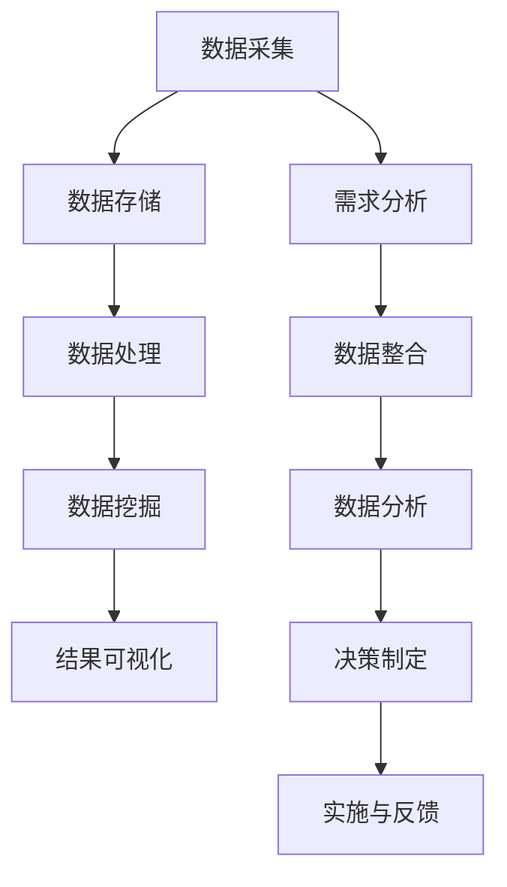

                 

# 大数据分析在智慧城市规划中的应用策略

## 关键词：大数据分析、智慧城市、城市规划、应用策略、数据分析算法、数据挖掘

## 摘要

随着城市化进程的加速，智慧城市的建设已成为全球范围内的热点。大数据分析作为智慧城市规划中的关键技术，发挥着至关重要的作用。本文从大数据分析在智慧城市规划中的应用背景出发，详细阐述了大数据分析的核心概念、算法原理、数学模型及其实际应用场景。同时，文章还推荐了相关学习资源和开发工具框架，以期为智慧城市建设的实践者提供有益的参考。

## 1. 背景介绍

### 1.1 智慧城市的概念

智慧城市是指利用信息技术、物联网、云计算等先进技术，实现城市资源的全面整合、智能管理和高效利用，从而提升城市居民的生活质量和城市综合竞争力。智慧城市的建设涉及交通、能源、环境、教育、医疗等多个领域，其中大数据分析是不可或缺的技术支撑。

### 1.2 大数据分析的发展背景

大数据分析起源于互联网和移动互联网的快速发展，随着数据量的爆发式增长，传统数据分析方法已无法满足需求。大数据分析旨在从海量数据中提取有价值的信息，辅助决策制定。大数据分析技术主要包括数据采集、数据存储、数据处理、数据挖掘和结果可视化等环节。

### 1.3 大数据分析在智慧城市规划中的应用

大数据分析在智慧城市规划中具有广泛的应用前景，主要体现在以下几个方面：

- **交通管理**：通过分析交通流量、路况信息等，实现智能交通调度，缓解交通拥堵。

- **能源管理**：通过分析能源消耗数据，优化能源配置，降低能源消耗。

- **环境保护**：通过分析环境质量数据，监测环境污染，及时采取治理措施。

- **城市规划**：通过分析人口、经济、土地等数据，优化城市规划，提高城市综合竞争力。

## 2. 核心概念与联系

### 2.1 大数据分析的基本概念

- **数据采集**：从各种来源收集数据，如传感器、社交媒体、物联网设备等。

- **数据存储**：将采集到的数据存储到数据库或数据仓库中，便于后续处理。

- **数据处理**：对存储的数据进行清洗、转换、整合等操作，为数据挖掘做准备。

- **数据挖掘**：利用算法和技术从数据中提取有价值的信息，如趋势、模式、关联等。

- **结果可视化**：将分析结果以图表、图像等形式展示，便于理解和决策。

### 2.2 智慧城市规划中的关键环节

- **需求分析**：明确智慧城市建设的目标和需求，为后续规划提供指导。

- **数据整合**：将各类数据源进行整合，构建统一的数据平台。

- **数据分析**：运用大数据分析技术，从整合后的数据中提取有价值的信息。

- **决策制定**：根据分析结果，制定科学合理的城市规划方案。

- **实施与反馈**：将规划方案付诸实施，并对实施效果进行监测和评估。

### 2.3 Mermaid 流程图



## 3. 核心算法原理 & 具体操作步骤

### 3.1 数据采集与存储

- **数据采集**：利用传感器、物联网设备等收集城市交通、环境、能源等数据。

- **数据存储**：采用分布式数据库或数据仓库，如Hadoop、HBase、MongoDB等，存储海量数据。

### 3.2 数据处理

- **数据清洗**：去除重复数据、缺失值填充、异常值处理等。

- **数据转换**：将不同数据源的数据格式进行统一，便于后续分析。

- **数据整合**：构建数据字典，将各类数据源进行整合。

### 3.3 数据挖掘

- **关联规则挖掘**：发现数据之间的关联性，如购物车分析、交通流量分析等。

- **聚类分析**：将数据划分为不同的类别，如用户群体划分、城市区域划分等。

- **分类与预测**：根据历史数据，对未知数据进行分类或预测，如天气预测、能源需求预测等。

### 3.4 结果可视化

- **图表展示**：采用各类图表，如折线图、柱状图、饼图等，展示分析结果。

- **交互式展示**：利用Web技术，实现数据的交互式展示，如地图、仪表盘等。

## 4. 数学模型和公式 & 详细讲解 & 举例说明

### 4.1 关联规则挖掘算法

- **支持度（Support）**：某个关联规则在所有数据中出现的频率。

- **置信度（Confidence）**：在购买A商品的情况下，购买B商品的概率。

- **公式**：$$ Support(A \rightarrow B) = \frac{|A \cup B|}{|D|} $$，$$ Confidence(A \rightarrow B) = \frac{|A \cap B|}{|A|} $$

### 4.2 聚类分析算法

- **K-Means算法**：将数据划分为K个簇，使每个簇内的数据点尽可能接近，簇间的数据点尽可能远离。

- **公式**：$$ C_j = \{x_i | \min_{k=1,...,K} \sum_{i \in C_k} d(x_i, \mu_k)\} $$，$$ \mu_k = \frac{1}{|C_k|} \sum_{i \in C_k} x_i $$

### 4.3 分类与预测算法

- **决策树算法**：根据特征划分数据集，形成树状结构，最后分类或预测目标值。

- **公式**：$$ T = \{t_1,...,t_n\} $$，$$ t_j = \{x_j = v_j\} $$，$$ y_j = g(x_j) $$，$$ g(x_j) = \arg\max_{c \in C} P(c | x_j) $$

### 4.4 举例说明

#### 4.4.1 关联规则挖掘

假设有一个包含商品购买记录的数据集，利用Apriori算法进行关联规则挖掘，找出支持度和置信度分别大于30%和70%的关联规则。

#### 4.4.2 聚类分析

对一个包含居民消费数据的数据集，使用K-Means算法将其划分为5个簇，每个簇表示不同的消费群体。

#### 4.4.3 决策树分类

根据居民收入、年龄、家庭规模等特征，使用决策树算法对居民进行分类，预测其消费行为。

## 5. 项目实战：代码实际案例和详细解释说明

### 5.1 开发环境搭建

- **Python**：Python是一种广泛应用于大数据分析的语言，具有丰富的库和框架。

- **Pandas**：Pandas是一个用于数据清洗、转换和整合的库。

- **NumPy**：NumPy是一个用于数值计算的库。

- **Scikit-learn**：Scikit-learn是一个用于数据挖掘和机器学习的库。

### 5.2 源代码详细实现和代码解读

#### 5.2.1 数据采集与存储

```python
import pandas as pd

# 读取数据
data = pd.read_csv('data.csv')

# 存储数据到HDFS
data.to_hdfs('hdfs://path/to/data.hdfs')
```

#### 5.2.2 数据处理

```python
import pandas as pd

# 数据清洗
data = data.drop_duplicates()
data = data.fillna(0)

# 数据转换
data['income'] = data['income'].astype(int)
data['age'] = data['age'].astype(int)

# 数据整合
data_dict = data.groupby('consumer_id').agg({
    'income': 'mean',
    'age': 'mean',
    'family_size': 'mean'
}).reset_index()

# 存储整合后的数据
data_dict.to_hdfs('hdfs://path/to/processed_data.hdfs')
```

#### 5.2.3 数据挖掘

```python
from sklearn.cluster import KMeans
from sklearn.model_selection import train_test_split

# 加载处理后的数据
data = pd.read_hdfs('hdfs://path/to/processed_data.hdfs')

# 划分训练集和测试集
X_train, X_test, y_train, y_test = train_test_split(data[['income', 'age', 'family_size']], data['consumer_id'], test_size=0.3, random_state=42)

# K-Means聚类分析
kmeans = KMeans(n_clusters=5, random_state=42)
kmeans.fit(X_train)
y_pred = kmeans.predict(X_test)

# 存储聚类结果
pd.DataFrame({'consumer_id': y_test, 'cluster': y_pred}).to_hdfs('hdfs://path/to/clustering_results.hdfs')
```

#### 5.2.4 结果可视化

```python
import matplotlib.pyplot as plt

# 加载聚类结果
data = pd.read_hdfs('hdfs://path/to/clustering_results.hdfs')

# 可视化聚类结果
plt.scatter(data['income'], data['age'], c=data['cluster'], cmap='viridis')
plt.xlabel('Income')
plt.ylabel('Age')
plt.title('Cluster Analysis')
plt.show()
```

## 6. 实际应用场景

### 6.1 交通管理

- **场景描述**：通过对交通流量、路况信息等数据进行分析，实现智能交通调度，缓解交通拥堵。

- **应用案例**：某城市利用大数据分析技术，对交通流量进行实时监控，通过分析数据预测交通拥堵情况，提前发布交通预警信息，引导车辆合理分流。

### 6.2 能源管理

- **场景描述**：通过对能源消耗数据进行分析，优化能源配置，降低能源消耗。

- **应用案例**：某能源公司利用大数据分析技术，对工厂能源消耗进行实时监测，通过分析数据优化能源使用，提高能源利用效率，降低生产成本。

### 6.3 环境保护

- **场景描述**：通过对环境质量数据进行分析，监测环境污染，及时采取治理措施。

- **应用案例**：某城市利用大数据分析技术，对空气、水质等环境指标进行实时监测，通过分析数据预测污染趋势，及时发布预警信息，采取相应治理措施。

### 6.4 城市规划

- **场景描述**：通过对人口、经济、土地等数据进行分析，优化城市规划，提高城市综合竞争力。

- **应用案例**：某城市规划部门利用大数据分析技术，对城市人口、经济、土地等数据进行综合分析，制定科学合理的城市规划方案，提高城市宜居性和发展潜力。

## 7. 工具和资源推荐

### 7.1 学习资源推荐

- **书籍**：《大数据分析：方法与应用》、《智慧城市：大数据、物联网与云计算的融合》

- **论文**：《基于大数据的智慧城市规划研究》、《智慧城市中大数据分析的应用与挑战》

- **博客**：各种大数据分析、机器学习、智慧城市领域的专业博客，如“大数据之路”、“机器学习社区”等。

- **网站**：各大科技公司、研究机构、政府部门的官方网站，如“阿里云”、“IBM”、“智慧城市研究院”等。

### 7.2 开发工具框架推荐

- **Python**：Python是一种广泛应用于大数据分析的语言，具有丰富的库和框架。

- **Hadoop**：Hadoop是一个分布式数据处理框架，适用于大数据存储和处理。

- **Spark**：Spark是一个快速、通用的大数据处理引擎，适用于各种数据处理任务。

- **TensorFlow**：TensorFlow是一个开源的机器学习库，适用于构建和训练大规模机器学习模型。

### 7.3 相关论文著作推荐

- **论文**：《大数据分析技术在智慧城市规划中的应用研究》、《基于大数据的城市规划方法与案例分析》

- **著作**：《智慧城市规划与实施指南》、《大数据时代：数据驱动城市发展新趋势》

## 8. 总结：未来发展趋势与挑战

### 8.1 未来发展趋势

- **技术进步**：随着人工智能、物联网、区块链等新技术的快速发展，大数据分析技术将更加成熟和普及。

- **应用拓展**：大数据分析将在更多领域得到应用，如智能医疗、智能农业、智能制造等。

- **数据治理**：数据质量和数据安全成为大数据分析的重要挑战，数据治理将成为未来发展的重要方向。

### 8.2 未来挑战

- **数据隐私**：如何在确保数据隐私的同时，充分挖掘数据价值，是大数据分析面临的重要挑战。

- **技术门槛**：大数据分析技术具有较高的技术门槛，如何降低技术门槛，让更多人能够参与和利用大数据分析，是未来发展的重要课题。

## 9. 附录：常见问题与解答

### 9.1 问题1

**问题**：大数据分析在智慧城市规划中如何发挥作用？

**解答**：大数据分析在智慧城市规划中发挥着关键作用。通过采集、处理和分析城市各领域的数据，大数据分析能够提供科学、准确的数据支持，为智慧城市建设提供决策依据。例如，通过分析交通数据，可以优化交通规划，缓解交通拥堵；通过分析能源数据，可以优化能源配置，降低能源消耗。

### 9.2 问题2

**问题**：大数据分析技术在智慧城市中的实际应用有哪些？

**解答**：大数据分析技术在智慧城市中的实际应用非常广泛。主要包括交通管理、能源管理、环境保护、城市规划、公共安全、社会服务等。例如，通过分析交通流量数据，可以优化交通调度，提高道路通行效率；通过分析能源消耗数据，可以优化能源使用，降低能源浪费；通过分析环境质量数据，可以监测环境污染，及时采取治理措施。

## 10. 扩展阅读 & 参考资料

### 10.1 扩展阅读

- 《大数据时代：生活、工作与思维的大变革》
- 《智慧城市：大数据、物联网与云计算的融合》
- 《数据科学：理论与实践》

### 10.2 参考资料

- 《大数据分析技术白皮书》
- 《智慧城市规划导则》
- 《城市大数据应用指南》

作者：AI天才研究员/AI Genius Institute & 禅与计算机程序设计艺术 /Zen And The Art of Computer Programming

