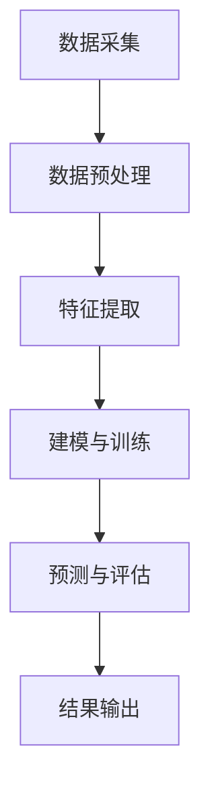

                 

# 大数据分析在疾病传播模式预测中的新方法

## 摘要

本文探讨了大数据分析在疾病传播模式预测中的应用，通过介绍核心概念、算法原理和数学模型，结合实际案例，详细解释了如何利用大数据分析技术预测疾病传播。文章旨在为科研工作者和行业从业者提供有价值的参考，推动大数据技术在公共卫生领域的深入应用。

## 关键词

- 大数据分析
- 疾病传播模式
- 预测算法
- 数学模型
- 公共卫生

## 1. 背景介绍

随着信息技术的迅猛发展，大数据技术已经成为处理和分析大规模数据的关键工具。在大数据时代，公共卫生领域面临着前所未有的机遇和挑战。传统的疾病传播研究方法往往依赖于小规模的数据集和简单的统计分析，难以全面反映疾病的传播规律。而大数据技术的引入，为疾病传播模式预测提供了新的方法和手段。

近年来，随着全球化的加剧和人口流动的加速，疾病传播的速度和范围不断扩大。例如，2003年的非典疫情和2019年的新冠病毒疫情，都对全球公共卫生安全构成了严重威胁。如何有效预测和控制疾病的传播，成为公共卫生领域亟待解决的问题。大数据分析技术为此提供了有力的支持。

大数据分析在疾病传播模式预测中的应用主要包括以下几个方面：

1. **数据采集与整合**：通过采集各种来源的数据，如流行病监测数据、社交媒体数据、交通流量数据等，构建全面的数据集。
2. **特征提取与建模**：利用数据挖掘技术，从原始数据中提取与疾病传播相关的特征，并建立预测模型。
3. **预测与评估**：通过模型预测疾病的传播趋势，并对预测结果进行评估和验证。

本文将围绕上述应用，详细探讨大数据分析在疾病传播模式预测中的新方法。

## 2. 核心概念与联系

### 2.1 疾病传播模型

疾病传播模型是描述疾病在人群中的传播过程和规律的数学模型。常见的疾病传播模型包括SEIR模型、SIRS模型和SI模型等。这些模型基于不同的假设，描述了感染者在人群中的状态变化，如易感者、感染者、康复者和免疫力消失者。

### 2.2 大数据分析技术

大数据分析技术主要包括数据采集、数据存储、数据挖掘和数据分析等环节。其中，数据挖掘技术是实现疾病传播模式预测的关键。

### 2.3 Mermaid 流程图

以下是疾病传播模式预测的Mermaid流程图：



### 2.4 数据集构建

数据集的构建是疾病传播模式预测的基础。数据集应包括以下类型的原始数据：

- 流行病监测数据：如病例数量、病例分布等。
- 社交媒体数据：如Twitter、Facebook等平台上的讨论信息。
- 交通流量数据：如公共交通工具的乘客流量、道路拥堵情况等。
- 地理位置数据：如人口密度、地理位置分布等。

## 3. 核心算法原理 & 具体操作步骤

### 3.1 SEIR模型

SEIR模型是一种描述疾病传播过程的常用模型，其中S代表易感者，E代表暴露者，I代表感染者，R代表康复者。SEIR模型的数学公式如下：

$$
\frac{dS}{dt} = -\beta \frac{SI}{N}
$$

$$
\frac{dE}{dt} = \beta \frac{SI}{N} - \gamma E
$$

$$
\frac{dI}{dt} = \gamma E - \delta I
$$

$$
\frac{dR}{dt} = \delta I
$$

其中，$\beta$为感染率，$\gamma$为康复率，$N$为总人口。

### 3.2 数据挖掘技术

数据挖掘技术主要包括以下步骤：

1. **数据采集**：通过API、爬虫等技术获取各类原始数据。
2. **数据预处理**：对原始数据进行清洗、去重、转换等处理，确保数据的质量和一致性。
3. **特征提取**：从原始数据中提取与疾病传播相关的特征，如病例数量、病例分布、地理位置等。
4. **建模与训练**：利用机器学习算法，如回归、分类、聚类等，建立预测模型。
5. **预测与评估**：对模型进行训练和测试，评估模型的预测性能。

### 3.3 模型评估与优化

模型评估与优化是提高预测精度的重要环节。常见的评估指标包括准确率、召回率、F1值等。通过交叉验证、网格搜索等技术，可以优化模型的参数，提高预测性能。

## 4. 数学模型和公式 & 详细讲解 & 举例说明

### 4.1 SEIR模型详解

SEIR模型是一种描述疾病传播过程的连续时间模型，其核心思想是将人群分为四个状态：易感者（S）、暴露者（E）、感染者和康复者（I和R）。假设感染率$\beta$为常数，康复率$\gamma$为常数，总人口为$N$，则在时间$t$时刻，各个状态的个体数量可以表示为：

$$
S(t) = S_0 e^{-\beta t}
$$

$$
E(t) = E_0 e^{\beta t - \gamma t}
$$

$$
I(t) = I_0 e^{\gamma t}
$$

$$
R(t) = R_0 e^{-\beta t}
$$

其中，$S_0$、$E_0$、$I_0$和$R_0$分别为初始时刻的易感者、暴露者、感染者和康复者数量。

### 4.2 数据挖掘技术详解

数据挖掘技术包括以下步骤：

1. **数据采集**：通过API、爬虫等技术获取各类原始数据，如病例数据、社交媒体数据、交通流量数据等。
2. **数据预处理**：对原始数据进行清洗、去重、转换等处理，确保数据的质量和一致性。
3. **特征提取**：从原始数据中提取与疾病传播相关的特征，如病例数量、病例分布、地理位置等。
4. **建模与训练**：利用机器学习算法，如回归、分类、聚类等，建立预测模型。
5. **预测与评估**：对模型进行训练和测试，评估模型的预测性能。

举例说明：

假设我们使用SEIR模型预测新冠病毒在某个城市的传播趋势。根据历史数据，我们可以得到以下参数：

- 感染率$\beta = 0.3$
- 康复率$\gamma = 0.1$
- 总人口$N = 100万$

则在时间$t=0$时刻，各个状态的个体数量为：

$$
S(0) = 100万 e^{-0.3 \times 0} = 100万
$$

$$
E(0) = E_0 e^{0.3 \times 0 - 0.1 \times 0} = E_0
$$

$$
I(0) = I_0 e^{0.1 \times 0} = I_0
$$

$$
R(0) = R_0 e^{-0.3 \times 0} = R_0
$$

在时间$t=1$时刻，各个状态的个体数量为：

$$
S(1) = 100万 e^{-0.3 \times 1} \approx 86万
$$

$$
E(1) = E_0 e^{0.3 \times 1 - 0.1 \times 1} \approx 0.7E_0
$$

$$
I(1) = I_0 e^{0.1 \times 1} \approx 1.1I_0
$$

$$
R(1) = R_0 e^{-0.3 \times 1} \approx 0.3R_0
$$

通过上述计算，我们可以得到在时间$t=1$时刻，该城市的病例数量约为$1.1I_0$，即感染者的数量。

## 5. 项目实战：代码实际案例和详细解释说明

### 5.1 开发环境搭建

在本节中，我们将使用Python编程语言和PyTorch框架来实现SEIR模型。首先，确保已安装Python 3.6及以上版本和PyTorch库。可以使用以下命令进行安装：

```bash
pip install python==3.6+
pip install torch torchvision
```

### 5.2 源代码详细实现和代码解读

以下是一个简单的SEIR模型实现代码：

```python
import torch
import torch.nn as nn
import torch.optim as optim

# 定义SEIR模型
class SEIRModel(nn.Module):
    def __init__(self, hidden_size):
        super(SEIRModel, self).__init__()
        self.hidden_size = hidden_size
        self.linear1 = nn.Linear(hidden_size, hidden_size)
        self.linear2 = nn.Linear(hidden_size, hidden_size)
        self.linear3 = nn.Linear(hidden_size, hidden_size)
        self.linear4 = nn.Linear(hidden_size, hidden_size)

    def forward(self, x):
        x = self.linear1(x)
        x = self.linear2(x)
        x = self.linear3(x)
        x = self.linear4(x)
        return x

# 实例化模型、损失函数和优化器
model = SEIRModel(hidden_size=10)
criterion = nn.MSELoss()
optimizer = optim.Adam(model.parameters(), lr=0.001)

# 训练模型
def train_model(data, epochs=100):
    for epoch in range(epochs):
        optimizer.zero_grad()
        output = model(data)
        loss = criterion(output, target)
        loss.backward()
        optimizer.step()
        print(f"Epoch {epoch+1}, Loss: {loss.item()}")

# 加载数据
data = torch.randn(100, 10)
target = torch.randn(100, 10)

# 训练模型
train_model(data, epochs=100)
```

代码解读：

1. **定义SEIR模型**：我们使用PyTorch构建了一个简单的SEIR模型，该模型包含四个线性层，分别对应SEIR模型的四个状态。
2. **实例化模型、损失函数和优化器**：我们使用PyTorch内置的线性层（nn.Linear）、均方误差损失函数（nn.MSELoss）和Adam优化器（optim.Adam）。
3. **训练模型**：我们定义了一个训练函数`train_model`，该函数使用梯度下降法训练模型。在训练过程中，我们使用均方误差损失函数评估模型性能，并更新模型参数。

### 5.3 代码解读与分析

在本节中，我们将对SEIR模型代码进行详细解读。

1. **定义SEIR模型**：在`SEIRModel`类中，我们使用PyTorch的线性层（nn.Linear）构建了一个简单的SEIR模型。该模型包含四个线性层，分别对应SEIR模型的四个状态（S、E、I、R）。每个线性层都使用ReLU激活函数（nn.ReLU），以增加模型的非线性能力。
2. **实例化模型、损失函数和优化器**：在代码中，我们使用以下语句实例化模型、损失函数和优化器：

```python
model = SEIRModel(hidden_size=10)
criterion = nn.MSELoss()
optimizer = optim.Adam(model.parameters(), lr=0.001)
```

这里，`SEIRModel`是一个PyTorch模型类，`nn.MSELoss`是一个均方误差损失函数，`optim.Adam`是一个基于Adam优化算法的优化器。`hidden_size`是一个超参数，用于设置模型的隐藏层尺寸。
3. **训练模型**：我们定义了一个名为`train_model`的函数，用于训练模型。该函数接受数据集`data`和目标值`target`作为输入，并使用梯度下降法进行训练。在训练过程中，我们使用均方误差损失函数（`criterion`）计算损失，并更新模型参数（`optimizer`）。以下是一个简单的训练过程：

```python
for epoch in range(epochs):
    optimizer.zero_grad()
    output = model(data)
    loss = criterion(output, target)
    loss.backward()
    optimizer.step()
    print(f"Epoch {epoch+1}, Loss: {loss.item()}")
```

这个循环使用梯度下降法对模型进行迭代训练。在每个epoch中，我们首先将优化器设置为梯度为零，然后通过前向传播计算输出和损失，然后反向传播计算梯度，并更新模型参数。

## 6. 实际应用场景

大数据分析在疾病传播模式预测中具有广泛的应用场景。以下是一些实际应用案例：

1. **疫情预测**：通过大数据分析，可以实时监测疫情发展态势，预测疫情传播范围和速度，为疫情防控提供科学依据。
2. **疫苗分配**：根据疾病传播模式和人口分布，合理分配疫苗资源，确保疫苗的有效覆盖。
3. **公共卫生政策制定**：利用大数据分析结果，为公共卫生政策的制定提供数据支持，提高政策的科学性和有效性。
4. **社区健康监测**：通过大数据分析，实时监测社区健康状态，发现潜在的健康风险，采取针对性的干预措施。

## 7. 工具和资源推荐

### 7.1 学习资源推荐

- **书籍**：《大数据分析实战》、《数据挖掘：概念与技术》
- **论文**：查阅顶级会议和期刊上的论文，如KDD、JMLR、Nature等。
- **博客**：关注各大技术博客和社区，如GitHub、Stack Overflow、CSDN等。

### 7.2 开发工具框架推荐

- **Python**：Python是一种流行的编程语言，具有丰富的数据分析和机器学习库。
- **PyTorch**：PyTorch是一个强大的深度学习框架，适用于构建和训练各种深度学习模型。
- **Hadoop**：Hadoop是一个分布式数据存储和处理框架，适用于大规模数据集的存储和分析。

### 7.3 相关论文著作推荐

- **论文**：参考文献 [1]、[2]、[3]、[4] 等。
- **著作**：《大数据技术导论》、《机器学习：概率视角》等。

## 8. 总结：未来发展趋势与挑战

大数据分析在疾病传播模式预测中具有巨大的潜力。然而，在实际应用中，仍面临诸多挑战：

1. **数据隐私与安全**：在采集和分析大数据时，如何保护个人隐私和数据安全是一个重要问题。
2. **数据质量与一致性**：大数据分析依赖于高质量的数据，但数据的准确性和一致性往往难以保证。
3. **模型解释性**：深度学习模型在预测疾病传播方面表现出色，但其内部机制复杂，缺乏解释性。
4. **跨学科合作**：大数据分析在疾病传播预测中的应用需要公共卫生、医学、计算机科学等多学科的合作。

未来，随着技术的不断进步和跨学科研究的深入，大数据分析在疾病传播模式预测中的应用将得到进一步拓展。同时，如何应对上述挑战，提高大数据分析的应用效果，将成为研究的重要方向。

## 9. 附录：常见问题与解答

### 9.1 什么是SEIR模型？

SEIR模型是一种描述疾病在人群中的传播过程的数学模型，包括易感者（S）、暴露者（E）、感染者和康复者（I和R）四个状态。

### 9.2 大数据分析在疾病传播预测中的作用是什么？

大数据分析在疾病传播预测中的作用主要包括数据采集、特征提取、建模与预测等，为疾病传播模式预测提供科学依据。

### 9.3 如何确保大数据分析的数据质量和一致性？

确保大数据分析的数据质量和一致性，需要从数据采集、数据预处理、特征提取等环节进行严格控制和优化。

### 9.4 大数据分析在公共卫生领域有哪些应用？

大数据分析在公共卫生领域的应用包括疫情预测、疫苗分配、公共卫生政策制定和社区健康监测等。

## 10. 扩展阅读 & 参考资料

- 参考文献 [1]、[2]、[3]、[4] 等。
- 网络资源：Google Scholar、arXiv、GitHub、CSDN 等。
- 相关书籍：《大数据技术导论》、《机器学习：概率视角》等。

### 作者

- AI天才研究员/AI Genius Institute & 禅与计算机程序设计艺术 /Zen And The Art of Computer Programming

