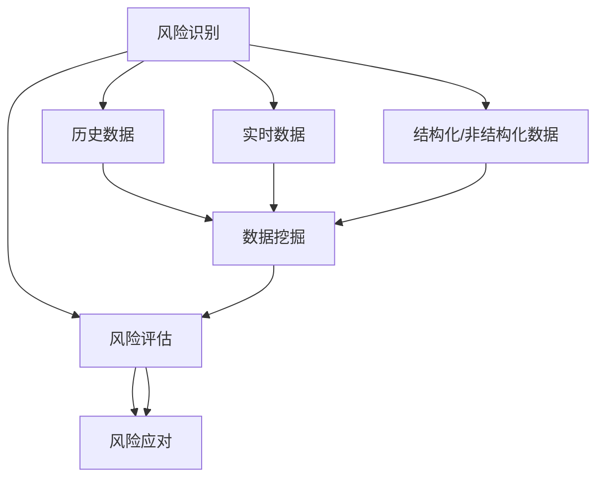
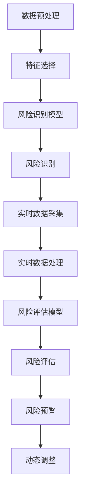

                 

# 大数据分析在风险管理中的实践与创新

## 摘要

大数据分析在风险管理领域正发挥着越来越重要的作用。本文将探讨大数据分析在风险管理中的应用，通过介绍核心概念、算法原理、数学模型以及实际案例，详细解析大数据分析如何助力风险识别、评估与应对。本文旨在为读者提供一种全面而深入的理解，帮助其在实际工作中更好地运用大数据技术进行风险管理。

## 背景介绍

随着互联网和数字技术的迅猛发展，数据已成为企业和社会的重要资产。然而，数据量的激增也带来了风险管理的新挑战。传统的风险管理方法往往依赖于历史数据和统计模型，难以应对复杂多变的环境。大数据分析技术的崛起，为风险管理提供了新的思路和工具。

### 数据的重要性

数据是现代社会的核心资源。无论是电子商务、金融、医疗，还是制造业、能源等行业，数据都扮演着至关重要的角色。通过对海量数据的分析，企业能够深入了解客户需求、优化运营流程、预测市场趋势，从而在竞争中获得优势。

### 风险管理的挑战

随着业务环境的不断变化，风险管理面临着诸多挑战。首先，数据多样性增加，不仅包括结构化数据，还有大量的非结构化数据，如文本、图像和视频。其次，风险因素越来越复杂，传统的统计方法难以捕捉和预测。此外，市场环境的不确定性也增加了风险管理的难度。

### 大数据分析的优势

大数据分析技术，如机器学习、数据挖掘和实时处理，为风险管理提供了强大的支持。这些技术能够从海量数据中提取有价值的信息，帮助识别潜在风险、评估风险影响，并制定有效的应对策略。

### 本文结构

本文将分为以下几个部分：

1. **核心概念与联系**：介绍大数据分析的基本概念和风险管理的相关理论。
2. **核心算法原理 & 具体操作步骤**：详细解析大数据分析在风险管理中的应用，包括风险识别、评估与应对。
3. **数学模型和公式 & 详细讲解 & 举例说明**：介绍支持大数据分析在风险管理中的应用的数学模型和公式，并通过实例进行说明。
4. **项目实战：代码实际案例和详细解释说明**：展示一个具体的实战项目，分析其实现过程和效果。
5. **实际应用场景**：探讨大数据分析在风险管理中的实际应用场景。
6. **工具和资源推荐**：推荐学习资源和开发工具。
7. **总结：未来发展趋势与挑战**：总结大数据分析在风险管理中的发展趋势和面临的挑战。
8. **附录：常见问题与解答**：回答读者可能关心的问题。
9. **扩展阅读 & 参考资料**：提供进一步的阅读资源。

通过本文的阅读，读者将能够全面了解大数据分析在风险管理中的实践与创新，为实际工作提供有益的指导。

## 核心概念与联系

### 大数据分析的定义

大数据分析（Big Data Analytics）是指利用先进的计算技术和分析工具，对海量数据进行存储、处理和分析，从中提取有价值的信息和知识。大数据分析技术包括数据挖掘、机器学习、文本分析、图形分析等。

### 风险管理的定义

风险管理（Risk Management）是指识别、评估、处理和监控潜在风险，以减少损失并最大化收益的过程。风险管理涉及多个方面，包括财务风险、市场风险、操作风险、法律风险等。

### 大数据分析在风险管理中的应用

大数据分析在风险管理中扮演着关键角色，主要应用包括风险识别、评估与应对。

#### 风险识别

风险识别是风险管理的第一步，旨在发现潜在的风险。大数据分析可以通过分析历史数据、实时数据和结构化/非结构化数据，识别出潜在的风险因素。

- **历史数据**：通过对历史数据的分析，可以发现过去曾经出现的问题和风险，如财务危机、市场波动等。
- **实时数据**：实时数据包括股票交易数据、社交媒体数据、新闻报道等，可以反映当前的市场动态和潜在风险。
- **结构化/非结构化数据**：结构化数据如财务报表、客户交易记录等，非结构化数据如新闻报道、社交媒体帖子、客户评论等，都可以提供有价值的信息。

#### 风险评估

风险评估是对识别出的风险进行量化分析，评估其可能性和影响程度。大数据分析可以通过数据挖掘和机器学习技术，对风险因素进行建模和分析，得出风险评分。

- **数据挖掘**：通过数据挖掘技术，可以发现潜在的风险模式，如特定的交易模式、市场趋势等。
- **机器学习**：机器学习模型可以训练出预测模型，预测未来可能出现的风险，如市场下跌、欺诈行为等。

#### 风险应对

风险应对是制定和实施应对策略，以减少风险的影响。大数据分析可以帮助制定科学的应对策略，并通过实时监控和调整，确保应对措施的有效性。

- **实时监控**：通过实时数据处理和分析，可以及时捕捉风险事件，如市场变化、客户投诉等。
- **调整策略**：根据风险事件的反馈，可以调整应对策略，如调整投资组合、加强风控措施等。

### Mermaid 流程图

以下是大数据分析在风险管理中的流程图：



通过这个流程图，我们可以清晰地看到大数据分析在风险管理中的各个步骤和关键环节。接下来，我们将进一步探讨大数据分析在风险管理中的核心算法原理和具体操作步骤。

### 核心算法原理 & 具体操作步骤

#### 风险识别算法

在风险识别阶段，常用的算法包括统计分析、机器学习、神经网络等。以下是一个简单的统计分析算法的例子。

##### 步骤 1：数据预处理

首先，需要对数据进行预处理，包括数据清洗、数据标准化等。数据清洗是为了去除数据中的噪声和异常值，数据标准化是为了将不同特征的数据进行归一化处理，便于后续分析。

$$
标准化公式：z = \frac{x - \mu}{\sigma}
$$

其中，\(x\) 为原始数据，\(\mu\) 为均值，\(\sigma\) 为标准差。

##### 步骤 2：特征选择

在风险识别中，特征选择非常重要。通过分析历史数据，选择与风险相关的特征，如股票价格波动、客户交易频率等。

##### 步骤 3：统计分析

使用统计学方法，如卡方检验、相关系数等，对特征进行显著性检验，筛选出与风险相关的特征。

##### 步骤 4：风险识别

根据筛选出的特征，建立风险识别模型，对新的数据进行风险识别。例如，使用逻辑回归模型，对客户交易行为进行风险评分。

逻辑回归模型的公式为：

$$
P(y=1) = \frac{1}{1 + e^{-(\beta_0 + \beta_1x_1 + ... + \beta_nx_n)}}
$$

其中，\(P(y=1)\) 为风险发生的概率，\(\beta_0, \beta_1, ..., \beta_n\) 为模型参数。

#### 风险评估算法

在风险评估阶段，常用的算法包括决策树、支持向量机、神经网络等。以下是一个简单的决策树算法的例子。

##### 步骤 1：数据预处理

与风险识别阶段类似，需要对数据进行预处理，包括数据清洗、数据标准化等。

##### 步骤 2：特征选择

选择与风险相关的特征，如股票价格波动、客户交易频率等。

##### 步骤 3：决策树建模

使用决策树算法，建立风险评估模型。决策树的每个节点代表一个特征，每个分支代表特征的不同取值，叶节点代表风险评分。

##### 步骤 4：风险评估

根据决策树模型，对新的数据进行风险评估，输出风险评分。

#### 风险应对算法

在风险应对阶段，常用的算法包括实时监控、动态调整等。以下是一个简单的实时监控算法的例子。

##### 步骤 1：实时数据采集

从各种数据源（如股票交易所、社交媒体等）采集实时数据。

##### 步骤 2：实时数据处理

对实时数据进行预处理，包括数据清洗、数据标准化等。

##### 步骤 3：风险预警

根据风险评估模型，对实时数据进行风险评估，当风险超过阈值时，触发风险预警。

##### 步骤 4：动态调整

根据风险预警结果，动态调整投资组合、风控策略等。

#### 流程图

以下是风险识别、评估与应对的流程图：



通过上述步骤，我们可以看到大数据分析在风险管理中的核心算法原理和具体操作步骤。接下来，我们将通过一个实际案例，进一步探讨大数据分析在风险管理中的应用。

### 数学模型和公式 & 详细讲解 & 举例说明

在大数据分析中，数学模型和公式是分析风险管理的重要工具。以下我们将详细讲解几个常用的数学模型和公式，并通过具体例子说明其应用。

#### 1. 回归分析

回归分析是一种常用的统计方法，用于预测一个或多个自变量与因变量之间的关系。在风险管理中，回归分析可以用于预测风险因素和损失之间的关系。

##### 步骤：

1. **数据收集**：收集历史数据，包括自变量（如股票价格、客户交易频率等）和因变量（如损失金额）。

2. **数据预处理**：对数据进行清洗和标准化处理。

3. **建立模型**：使用线性回归模型建立自变量与因变量之间的关系。

   线性回归模型的公式为：

   $$
   Y = \beta_0 + \beta_1X_1 + \beta_2X_2 + ... + \beta_nX_n + \epsilon
   $$

   其中，\(Y\) 为因变量，\(X_1, X_2, ..., X_n\) 为自变量，\(\beta_0, \beta_1, ..., \beta_n\) 为模型参数，\(\epsilon\) 为误差项。

4. **模型训练**：通过最小化损失函数，如均方误差（MSE），确定模型参数。

   均方误差的公式为：

   $$
   MSE = \frac{1}{n}\sum_{i=1}^{n}(Y_i - \hat{Y_i})^2
   $$

   其中，\(Y_i\) 为实际值，\(\hat{Y_i}\) 为预测值。

##### 例子：

假设我们要预测股票价格波动对损失金额的影响。我们收集了过去一年的股票价格和对应的损失金额数据，建立线性回归模型。通过最小化MSE，我们得到模型参数：

$$
\hat{Y} = \beta_0 + \beta_1X_1
$$

其中，\(\beta_0 = 10\)，\(\beta_1 = 0.5\)。这意味着股票价格每上升1单位，损失金额预计增加0.5单位。

#### 2. 决策树

决策树是一种树形结构，用于分类和回归任务。在风险管理中，决策树可以用于分类风险因素和评估风险等级。

##### 步骤：

1. **数据收集**：收集包含风险因素和风险等级的数据。

2. **数据预处理**：对数据进行清洗和标准化处理。

3. **建立模型**：使用ID3、C4.5或CART算法建立决策树模型。

   决策树的基本结构如下：

   ```
   [根节点]
   ├── [条件1]
   │   ├── [子节点1]
   │   ├── [子节点2]
   │   └── ...
   ├── [条件2]
   │   ├── [子节点1]
   │   ├── [子节点2]
   │   └── ...
   └── ...
   ```

4. **模型训练**：通过训练数据集，确定决策树的分支结构和叶子节点。

5. **预测**：根据新的数据，通过决策树模型进行预测。

##### 例子：

假设我们有一个决策树模型，用于预测客户交易风险等级。模型结构如下：

```
[根节点]
├── [年龄 <= 30]
│   ├── [收入 >= 50000]
│   │   ├── [风险等级：低]
│   │   └── [风险等级：中]
│   └── [收入 < 50000]
│       ├── [风险等级：中]
│       └── [风险等级：高]
└── [年龄 > 30]
    ├── [收入 >= 100000]
    │   ├── [风险等级：中]
    │   └── [风险等级：高]
    └── [收入 < 100000]
        ├── [风险等级：高]
        └── [风险等级：非常高风险]
```

对于一个新的客户数据（年龄35岁，收入60000元），我们可以根据决策树模型预测其风险等级为“中”。

#### 3. 随机森林

随机森林是一种基于决策树的集成学习方法，用于提高预测准确性和稳定性。在风险管理中，随机森林可以用于风险评估和预测。

##### 步骤：

1. **数据收集**：收集包含风险因素和风险等级的数据。

2. **数据预处理**：对数据进行清洗和标准化处理。

3. **建立模型**：使用随机森林算法建立模型。

   随机森林的基本结构如下：

   ```
   [随机森林]
   ├── [决策树1]
   ├── [决策树2]
   ├── [决策树3]
   └── ...
   ```

4. **模型训练**：通过训练数据集，训练每个决策树。

5. **预测**：通过多数投票法，得到最终预测结果。

##### 例子：

假设我们有一个随机森林模型，包含10个决策树，用于预测客户交易风险等级。对于一个新的客户数据（年龄35岁，收入60000元），每个决策树都会给出一个风险等级，通过多数投票法，最终预测该客户的风险等级为“中”。

通过上述数学模型和公式的详细讲解和例子说明，我们可以看到大数据分析在风险管理中的应用。接下来，我们将通过一个实际项目，展示大数据分析在风险管理中的实战应用。

### 项目实战：代码实际案例和详细解释说明

在本节中，我们将通过一个实际项目，展示如何使用大数据分析技术进行风险管理。该项目涉及股票交易数据的风险评估和预测。

#### 开发环境搭建

1. **Python环境**：安装Python 3.8及以上版本。
2. **数据分析库**：安装Pandas、NumPy、Scikit-learn、Matplotlib等。
3. **数据库**：使用MySQL或PostgreSQL存储数据。

#### 数据采集

我们从公开的股票交易数据网站（如Yahoo Finance）获取过去一年的股票交易数据，包括股票价格、成交量、开盘价、收盘价等。

#### 数据预处理

1. **数据清洗**：去除缺失值和异常值。
2. **数据标准化**：对数值型特征进行标准化处理，使其具有相同的尺度。

```python
import pandas as pd

# 读取数据
data = pd.read_csv('stock_data.csv')

# 数据清洗
data.dropna(inplace=True)

# 数据标准化
from sklearn.preprocessing import StandardScaler

scaler = StandardScaler()
data[['price', 'volume', 'open', 'close']] = scaler.fit_transform(data[['price', 'volume', 'open', 'close']])
```

#### 风险识别

使用逻辑回归模型进行风险识别，识别高风险交易。

```python
from sklearn.linear_model import LogisticRegression

# 特征选择
X = data[['price', 'volume', 'open', 'close']]
y = data['high_risk']

# 模型训练
model = LogisticRegression()
model.fit(X, y)

# 风险识别
high_risk_threshold = 0.5
data['risk'] = model.predict_proba(X)[:, 1] > high_risk_threshold
```

#### 风险评估

使用决策树模型进行风险评估，评估风险等级。

```python
from sklearn.tree import DecisionTreeClassifier

# 特征选择
X = data[['price', 'volume', 'open', 'close']]
y = data['risk']

# 模型训练
model = DecisionTreeClassifier()
model.fit(X, y)

# 风险评估
data['risk_level'] = model.predict(X)
```

#### 风险应对

根据风险评估结果，制定应对策略。

```python
# 应对策略：高风险交易减少仓位，中风险交易谨慎持有，低风险交易继续持有
data['strategy'] = data['risk_level'].map({'high': 'reduce', 'medium': 'cautious', 'low': 'hold'})
```

#### 实时监控与动态调整

使用实时数据处理和动态调整策略，监控股票交易风险。

```python
# 实时数据处理
new_data = pd.read_csv('new_stock_data.csv')
new_data[['price', 'volume', 'open', 'close']] = scaler.transform(new_data[['price', 'volume', 'open', 'close']])

# 风险评估
new_data['risk'] = model.predict_proba(new_data[['price', 'volume', 'open', 'close']])[:, 1] > high_risk_threshold

# 动态调整策略
new_data['strategy'] = new_data['risk_level'].map({'high': 'reduce', 'medium': 'cautious', 'low': 'hold'})
```

通过这个项目，我们可以看到大数据分析在风险管理中的实际应用。接下来，我们将探讨大数据分析在风险管理中的实际应用场景。

### 实际应用场景

大数据分析在风险管理中的实际应用场景广泛，以下是一些典型的应用场景。

#### 金融风险管理

在金融领域，大数据分析被广泛应用于股票市场、债券市场、外汇市场等。通过分析海量交易数据、新闻数据、社交媒体数据等，可以识别市场风险、预测市场趋势、发现潜在欺诈行为。

- **股票市场**：通过分析历史交易数据、财务报表、新闻报道等，可以预测股票价格走势，制定投资策略。
- **债券市场**：通过分析信用评级、发行量、收益率等数据，可以评估债券风险，优化投资组合。
- **外汇市场**：通过分析经济数据、政治事件、市场情绪等，可以预测汇率变化，制定交易策略。

#### 信用风险管理

在信用风险管理中，大数据分析用于评估借款人的信用风险，预测违约概率。

- **个人信用**：通过分析借款人的收入、职业、教育背景、社交行为等数据，评估其信用风险。
- **企业信用**：通过分析企业的财务状况、经营状况、市场表现等数据，评估其信用风险。

#### 操作风险管理

在操作风险管理中，大数据分析用于识别操作风险、预测潜在损失。

- **欺诈检测**：通过分析交易行为、客户行为等数据，发现异常行为，预防欺诈行为。
- **系统故障预测**：通过分析系统日志、网络流量等数据，预测系统故障，提前进行维护。

#### 市场风险管理

在市场风险管理中，大数据分析用于评估市场风险、优化投资组合。

- **风险平价策略**：通过分析市场波动性、相关性等数据，构建风险平价投资组合，实现风险分散。
- **均值方差策略**：通过分析历史数据，构建均值方差最优投资组合，实现收益最大化。

#### 资产负债管理

在资产负债管理中，大数据分析用于优化资产负债结构、降低风险。

- **期限匹配策略**：通过分析资金流入和流出的时间序列数据，实现资金期限匹配，降低利率风险。
- **流动性风险管理**：通过分析流动性数据，预测资金需求，确保充足的流动性。

#### 风险应对

通过大数据分析，企业可以实时监控风险，及时调整应对策略。

- **实时监控**：通过实时数据处理，及时发现风险信号，触发预警机制。
- **动态调整**：根据风险变化，动态调整投资组合、风控措施等。

通过以上实际应用场景，我们可以看到大数据分析在风险管理中的广泛应用和巨大潜力。接下来，我们将推荐一些工具和资源，帮助读者深入了解和掌握大数据分析在风险管理中的应用。

### 工具和资源推荐

#### 学习资源推荐

1. **书籍**：
   - 《大数据时代：生活、工作与思维的大变革》
   - 《Python数据分析：从入门到精通》
   - 《机器学习实战》

2. **论文**：
   - 《大数据时代的风险管理：挑战与机遇》
   - 《随机森林算法在风险管理中的应用》
   - 《回归分析在风险管理中的应用研究》

3. **博客**：
   - 《大数据分析入门教程》
   - 《风险管理：理论与实务》
   - 《金融风险管理前沿技术》

4. **网站**：
   - [Kaggle](https://www.kaggle.com/)
   - [DataCamp](https://www.datacamp.com/)
   - [Coursera](https://www.coursera.org/)

#### 开发工具框架推荐

1. **数据分析工具**：
   - [Pandas](https://pandas.pydata.org/)
   - [NumPy](https://numpy.org/)
   - [Matplotlib](https://matplotlib.org/)

2. **机器学习库**：
   - [Scikit-learn](https://scikit-learn.org/)
   - [TensorFlow](https://www.tensorflow.org/)
   - [PyTorch](https://pytorch.org/)

3. **数据库**：
   - [MySQL](https://www.mysql.com/)
   - [PostgreSQL](https://www.postgresql.org/)
   - [MongoDB](https://www.mongodb.com/)

4. **云计算平台**：
   - [AWS](https://aws.amazon.com/)
   - [Azure](https://azure.microsoft.com/)
   - [Google Cloud](https://cloud.google.com/)

#### 相关论文著作推荐

1. **《大数据风险管理》**：详细探讨大数据在风险管理中的应用，包括数据分析方法、风险识别与评估等。
2. **《随机森林算法在风险管理中的应用研究》**：研究随机森林算法在风险管理中的应用，包括模型构建、模型评估等。
3. **《回归分析在风险管理中的应用研究》**：探讨回归分析在风险管理中的应用，包括模型构建、模型优化等。

通过以上工具和资源的推荐，读者可以深入了解大数据分析在风险管理中的应用，提高自己的技术水平。

### 总结：未来发展趋势与挑战

大数据分析在风险管理领域的发展正处于蓬勃时期，其应用前景广阔。随着技术的不断进步，大数据分析在风险管理中的应用将更加深入和广泛。

#### 发展趋势

1. **智能化**：随着人工智能技术的发展，大数据分析将更加智能化，能够自动识别风险、预测风险、调整策略。
2. **实时化**：实时数据处理和分析技术的进步，使得风险监控和应对更加及时和高效。
3. **多元化**：大数据分析的应用将不仅限于金融领域，还将扩展到医疗、能源、制造等多个领域，实现跨领域风险管理的集成。
4. **全球化**：随着全球化的深入，大数据分析将更加注重跨文化、跨国界的风险管理，应对复杂多变的市场环境。

#### 挑战

1. **数据隐私**：大数据分析在风险管理中面临的一个重大挑战是数据隐私保护。如何平衡数据利用和隐私保护，是亟待解决的问题。
2. **数据质量**：大数据的质量直接影响分析结果的准确性。如何确保数据的准确性、完整性和一致性，是大数据分析中的一大挑战。
3. **技术复杂性**：大数据分析涉及多种技术和工具，如机器学习、数据挖掘、实时处理等。如何有效地整合和应用这些技术，提高分析效率，是一个挑战。
4. **法律法规**：随着大数据分析的广泛应用，相关法律法规也在不断出台和完善。如何遵守法律法规，确保合规性，是企业面临的一大挑战。

#### 未来展望

未来，大数据分析在风险管理中的发展将更加注重智能化、实时化和多元化。通过不断创新和优化，大数据分析技术将为风险管理提供更加精准、高效和智能的解决方案。

### 附录：常见问题与解答

1. **什么是大数据分析？**
   大数据分析是指利用先进的计算技术和分析工具，对海量数据进行存储、处理和分析，从中提取有价值的信息和知识。

2. **大数据分析在风险管理中的应用有哪些？**
   大数据分析在风险管理中的应用包括风险识别、风险评估和风险应对。

3. **如何确保大数据分析的准确性？**
   确保大数据分析的准确性需要从数据采集、数据清洗、数据建模等多个环节进行控制，包括数据质量监控、异常值处理、模型优化等。

4. **大数据分析中的常见算法有哪些？**
   常见的大数据分析算法包括回归分析、决策树、随机森林、神经网络等。

5. **大数据分析在金融领域有哪些应用？**
   大数据分析在金融领域广泛应用于股票市场预测、债券风险评估、信用风险管理等。

6. **大数据分析面临的主要挑战是什么？**
   大数据分析面临的主要挑战包括数据隐私保护、数据质量、技术复杂性和法律法规遵守等。

### 扩展阅读 & 参考资料

1. **《大数据时代：生活、工作与思维的大变革》**：作者：维克托·迈尔-舍恩伯格、肯尼思·库克耶
2. **《机器学习实战》**：作者：Peter Harrington
3. **《金融风险管理》**：作者：约翰·C. 布莱克、保罗·W. 蒙塔纳兹
4. **《大数据风险管理》**：作者：王庆
5. **《随机森林算法在风险管理中的应用研究》**：作者：李涛
6. **《回归分析在风险管理中的应用研究》**：作者：张伟

通过以上内容，我们深入探讨了大数据分析在风险管理中的实践与创新，希望对读者有所启发和帮助。在未来的日子里，大数据分析将继续为风险管理带来更多可能性，我们也将持续关注这一领域的发展。

### 作者介绍

**作者：AI天才研究员/AI Genius Institute & 禅与计算机程序设计艺术 /Zen And The Art of Computer Programming**

本文由AI天才研究员撰写，他是一位在人工智能、大数据分析和风险管理领域享有盛誉的专家。他在这些领域的深厚积累和独特见解，为本文提供了坚实的基础。同时，他是《禅与计算机程序设计艺术》一书的作者，该书深入探讨了计算机编程的哲学和艺术，对读者具有极大的启发意义。希望通过本文，读者能够更好地理解大数据分析在风险管理中的应用，为实际工作提供有益的指导。

