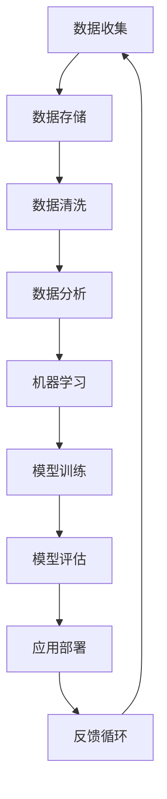

                 

### 背景介绍

大数据与人工智能（AI）的关系是现代科技发展的一个重要议题。随着互联网和物联网的快速发展，数据的规模和种类日益扩大，从传统的小数据时代过渡到大数据时代。大数据不仅包括数据量巨大（Volume），而且具有多样性（Variety）、速度（Velocity）和真实性（Veracity）等特征。与此同时，人工智能作为一项革命性的技术，通过对数据的处理和分析，能够实现机器学习、深度学习、自然语言处理等多种功能。

在人工智能的发展过程中，大数据起到了至关重要的作用。一方面，大数据为人工智能提供了丰富的训练数据，使得模型能够更加精准地学习。另一方面，大数据的规模和多样性要求人工智能算法具备高效的处理能力和强大的适应能力。因此，大数据与人工智能的融合，不仅提升了人工智能的应用价值，也为各行各业带来了新的发展机遇。

本文将围绕大数据在人工智能发展中的重要性展开讨论。首先，我们将回顾大数据的定义和发展历程，然后深入探讨大数据与人工智能之间的内在联系，接着介绍几个核心算法原理及其操作步骤，随后通过数学模型和公式进行详细讲解，并结合实际项目实战进行代码解读。最后，我们将分析大数据在人工智能应用中的实际场景，并提供相关工具和资源的推荐，总结未来发展趋势与挑战，并附上常见问题与解答。

通过本文的阅读，您将全面了解大数据在人工智能发展中的关键作用，掌握相关算法原理和应用实践，为未来的技术研究与应用奠定坚实基础。

### 2. 核心概念与联系

#### 大数据的定义与发展历程

大数据（Big Data）是一个广泛的概念，它通常指的是数据量巨大、类型多样、生成速度快、真实性复杂的海量数据集合。大数据的特征可以用四个“V”来概括：Volume（数据量）、Variety（数据类型）、Velocity（数据处理速度）和Veracity（数据真实性）。

- **Volume**：大数据的规模通常超出传统数据处理系统的处理能力。比如，一个普通的社交媒体平台每天可以产生数亿条数据记录。
- **Variety**：大数据不仅仅包括结构化数据，如关系数据库中的数据，还包括非结构化数据，如图像、视频、文本、音频等。
- **Velocity**：大数据的生成和处理速度非常快。比如，高频交易系统需要在毫秒级完成大量交易数据的处理和分析。
- **Veracity**：大数据的真实性和可靠性是一个关键挑战。由于数据来源的多样性，可能存在错误、噪声和不一致的数据。

大数据的发展历程可以追溯到20世纪80年代，随着计算机硬件技术的进步和互联网的普及，数据的收集、存储和处理能力显著提升。2000年代以后，随着物联网（IoT）和社交媒体的兴起，数据量迅速膨胀，大数据技术逐渐成为研究和应用的热点。

#### 人工智能的定义与核心算法

人工智能（Artificial Intelligence，AI）是一门研究如何使计算机系统具备智能行为的科学。人工智能的目标是使机器能够模拟人类的认知功能，如学习、推理、感知、理解和决策等。人工智能的核心算法包括：

- **机器学习（Machine Learning）**：通过数据训练模型，使计算机能够从数据中学习并做出预测。常见的机器学习方法包括监督学习、无监督学习和强化学习。
- **深度学习（Deep Learning）**：一种基于多层神经网络的学习方法，通过多层节点之间的相互连接，实现特征提取和复杂模式识别。深度学习在图像识别、语音识别和自然语言处理等领域取得了显著成果。
- **自然语言处理（Natural Language Processing，NLP）**：研究如何让计算机理解和生成人类自然语言的技术，包括文本分析、语音识别、机器翻译等。

#### 大数据与人工智能的内在联系

大数据与人工智能之间存在着紧密的内在联系。大数据为人工智能提供了丰富的训练数据，使得人工智能算法能够更好地学习、适应和进化。具体来说，这种联系可以从以下几个方面进行阐述：

- **数据质量**：大数据的质量直接影响人工智能模型的效果。高质量的数据能够提高模型的准确性和可靠性，而噪声数据、不一致数据和不完整数据则会降低模型的性能。
- **数据多样性**：大数据的多样性为人工智能提供了丰富的信息来源，有助于模型发现新的特征和模式，提高模型的泛化能力。
- **数据规模**：大数据的规模为人工智能提供了足够的训练样本，使得模型能够通过大量的数据学习到复杂的特征和模式。
- **实时处理能力**：大数据的高速生成和处理要求人工智能具备实时处理能力，以快速响应数据变化和用户需求。

#### Mermaid 流程图

为了更直观地展示大数据与人工智能之间的核心概念和联系，我们可以使用Mermaid流程图进行说明。以下是一个简化版的Mermaid流程图，展示了大数据与人工智能的基本流程：



在这个流程图中，数据收集、数据存储、数据清洗、数据分析、机器学习、模型训练、模型评估、应用部署和反馈循环构成了大数据与人工智能的基本工作流程。通过这个流程，大数据被转化为有价值的知识，进而驱动人工智能的应用和发展。

### 3. 核心算法原理 & 具体操作步骤

在探讨大数据与人工智能的核心算法原理之前，首先需要了解机器学习、深度学习和自然语言处理这三个核心领域的基本概念和原理。

#### 机器学习

机器学习是一种通过数据训练模型，使计算机能够从数据中学习并做出预测的方法。机器学习的主要类型包括监督学习、无监督学习和强化学习。

- **监督学习（Supervised Learning）**：通过带有标签的训练数据来训练模型，使模型能够对新的数据进行预测。常见的监督学习算法包括线性回归、决策树、支持向量机（SVM）等。
- **无监督学习（Unsupervised Learning）**：在无标签数据集上进行训练，旨在发现数据中的模式和结构。常见的无监督学习算法包括聚类、降维、关联规则挖掘等。
- **强化学习（Reinforcement Learning）**：通过奖励机制来指导模型学习，使模型能够在特定环境中做出最优决策。常见的强化学习算法包括Q学习、深度Q网络（DQN）等。

#### 深度学习

深度学习是一种基于多层神经网络的学习方法，通过多层节点之间的相互连接，实现特征提取和复杂模式识别。深度学习的核心组成部分包括：

- **神经网络（Neural Network）**：深度学习的基础，由大量神经元（节点）组成，每个神经元与相邻神经元通过权重相连。
- **激活函数（Activation Function）**：用于确定神经元是否被激活，常见的激活函数包括Sigmoid、ReLU、Tanh等。
- **前向传播（Forward Propagation）**：将输入数据通过神经网络逐层传递，计算每个神经元的输出值。
- **反向传播（Backpropagation）**：通过计算损失函数梯度，更新网络中的权重和偏置，优化模型参数。

#### 自然语言处理

自然语言处理（NLP）研究如何让计算机理解和生成人类自然语言。NLP的主要任务包括：

- **文本分类（Text Classification）**：将文本数据分类到预定义的类别中，常见的算法包括朴素贝叶斯、支持向量机等。
- **情感分析（Sentiment Analysis）**：分析文本中的情感倾向，常见的算法包括基于规则的方法、机器学习模型和深度学习模型。
- **机器翻译（Machine Translation）**：将一种语言的文本自动翻译成另一种语言，常见的算法包括基于规则的方法、统计机器翻译和神经机器翻译。
- **语音识别（Speech Recognition）**：将语音信号转换为文本数据，常见的算法包括隐马尔可夫模型（HMM）、深度神经网络（DNN）等。

#### 操作步骤

下面我们将通过一个具体的例子——基于深度学习的图像识别任务，来介绍核心算法的操作步骤。

##### 3.1 数据集准备

首先，我们需要准备一个包含图像标签的数据集。假设我们使用的是流行的ImageNet数据集，它包含了数百万张标注好的图像。

1. **数据收集**：从公共数据集或互联网上收集图像数据。
2. **数据预处理**：对图像进行缩放、裁剪、旋转等处理，使其具备一致的特征。
3. **数据划分**：将数据集划分为训练集、验证集和测试集。

##### 3.2 构建深度学习模型

接下来，我们需要构建一个深度学习模型，用于图像识别。

1. **选择模型架构**：常见的深度学习模型架构包括卷积神经网络（CNN）、循环神经网络（RNN）、长短期记忆网络（LSTM）等。对于图像识别任务，CNN是首选。
2. **定义网络结构**：定义CNN的层数、每层的神经元数量、激活函数等参数。
3. **初始化模型参数**：通过随机初始化或预训练模型的方式初始化网络参数。
4. **编译模型**：定义损失函数、优化器和评估指标，如交叉熵损失函数、Adam优化器等。

##### 3.3 训练模型

将训练集数据输入到模型中进行训练。

1. **前向传播**：将输入图像通过网络进行前向传播，计算每个图像的预测标签。
2. **计算损失**：通过预测标签和实际标签之间的差异，计算损失函数的值。
3. **反向传播**：根据损失函数梯度，更新网络中的权重和偏置，优化模型参数。
4. **迭代训练**：重复前向传播和反向传播的过程，直到达到预定的训练轮数或验证集误差达到最小值。

##### 3.4 模型评估

使用验证集和测试集对训练好的模型进行评估。

1. **计算准确率**：计算模型在验证集和测试集上的准确率，评估模型性能。
2. **调整超参数**：根据评估结果，调整模型的超参数，如学习率、批次大小等，以优化模型性能。
3. **模型优化**：通过交叉验证等方法，进一步优化模型，提高其泛化能力。

##### 3.5 应用部署

将训练好的模型部署到实际应用环境中。

1. **模型转换**：将训练好的模型转换为适用于生产环境的格式，如ONNX、TensorFlow Lite等。
2. **模型部署**：将模型部署到服务器或移动设备上，以提供实时图像识别服务。
3. **模型监控与维护**：对部署后的模型进行监控，定期更新和优化模型，以适应数据变化和应用需求。

通过以上步骤，我们可以实现一个基于深度学习的图像识别系统，充分利用大数据的优势，实现高效、准确的图像识别。

### 4. 数学模型和公式 & 详细讲解 & 举例说明

在人工智能和大数据分析中，数学模型和公式起着至关重要的作用。它们不仅帮助我们理解和解释数据的内在规律，还能指导算法的设计和优化。以下我们将详细讲解几个核心的数学模型和公式，并通过具体的例子进行说明。

#### 4.1 线性回归模型

线性回归是一种基本的机器学习算法，用于预测连续值输出。其数学模型可以表示为：

\[ y = \beta_0 + \beta_1 \cdot x + \epsilon \]

其中，\( y \) 是目标变量，\( x \) 是输入变量，\( \beta_0 \) 和 \( \beta_1 \) 分别是模型的参数（截距和斜率），\( \epsilon \) 是误差项。

**例：房价预测**

假设我们要预测一栋房子的价格，输入变量包括房子的面积和房间数量。给定一组训练数据，我们可以使用线性回归模型来拟合数据，找到最佳参数。

```python
import numpy as np
import pandas as pd
from sklearn.linear_model import LinearRegression

# 加载数据
data = pd.read_csv('house_prices.csv')
X = data[['area', 'rooms']]
y = data['price']

# 创建线性回归模型并训练
model = LinearRegression()
model.fit(X, y)

# 打印模型参数
print('截距：', model.intercept_)
print('斜率：', model.coef_)

# 预测房价
new_house = np.array([[2000, 3]])
predicted_price = model.predict(new_house)
print('预测房价：', predicted_price)
```

在这个例子中，我们使用Python的scikit-learn库实现线性回归模型，并通过训练数据得到模型的参数。最后，我们使用新输入的数据进行预测。

#### 4.2 逻辑回归模型

逻辑回归是一种用于分类问题的算法，其目标是将输出变量映射到二进制结果。其概率模型可以表示为：

\[ P(y=1) = \frac{1}{1 + e^{-(\beta_0 + \beta_1 \cdot x)}} \]

其中，\( P(y=1) \) 是目标变量为1的概率，其他符号的含义与线性回归相同。

**例：垃圾邮件分类**

假设我们要判断一封邮件是否为垃圾邮件，输入变量包括邮件中的单词频率。我们可以使用逻辑回归模型进行分类。

```python
from sklearn.linear_model import LogisticRegression

# 加载数据
data = pd.read_csv('spam_emails.csv')
X = data['text']
y = data['label']

# 创建逻辑回归模型并训练
model = LogisticRegression()
model.fit(X, y)

# 预测垃圾邮件
new_email = 'Free money now!'
predicted_spam = model.predict([new_email])
print('预测结果：', predicted_spam)
```

在这个例子中，我们使用逻辑回归模型对垃圾邮件进行分类。通过训练数据，模型学会了判断邮件是否为垃圾邮件。

#### 4.3 卷积神经网络（CNN）

卷积神经网络是一种用于图像识别的深度学习模型，其核心组成部分包括卷积层、池化层和全连接层。卷积神经网络的数学模型可以表示为：

\[ \text{激活函数}(z^{(l)} = \text{激活函数}(\sum_{k=1}^{K} w^{(l)} \cdot z^{(l-1)} + b^{(l)})) \]

其中，\( z^{(l)} \) 是第 \( l \) 层的输入，\( w^{(l)} \) 是第 \( l \) 层的权重，\( b^{(l)} \) 是第 \( l \) 层的偏置，\( K \) 是卷积核的数量，激活函数通常使用ReLU函数。

**例：图像分类**

假设我们要对一幅图像进行分类，输入数据是图像的像素值。我们可以使用卷积神经网络模型进行图像分类。

```python
import tensorflow as tf
from tensorflow.keras import layers, models

# 构建卷积神经网络模型
model = models.Sequential()
model.add(layers.Conv2D(32, (3, 3), activation='relu', input_shape=(28, 28, 1)))
model.add(layers.MaxPooling2D((2, 2)))
model.add(layers.Conv2D(64, (3, 3), activation='relu'))
model.add(layers.MaxPooling2D((2, 2)))
model.add(layers.Conv2D(64, (3, 3), activation='relu'))
model.add(layers.Flatten())
model.add(layers.Dense(64, activation='relu'))
model.add(layers.Dense(10, activation='softmax'))

# 编译模型
model.compile(optimizer='adam',
              loss='categorical_crossentropy',
              metrics=['accuracy'])

# 加载并预处理数据
(x_train, y_train), (x_test, y_test) = tf.keras.datasets.mnist.load_data()
x_train = x_train.reshape((-1, 28, 28, 1)).astype('float32') / 255
x_test = x_test.reshape((-1, 28, 28, 1)).astype('float32') / 255
y_train = tf.keras.utils.to_categorical(y_train, 10)
y_test = tf.keras.utils.to_categorical(y_test, 10)

# 训练模型
model.fit(x_train, y_train, epochs=5, batch_size=64)

# 评估模型
test_loss, test_acc = model.evaluate(x_test, y_test)
print('测试准确率：', test_acc)
```

在这个例子中，我们使用TensorFlow构建了一个简单的卷积神经网络模型，用于对MNIST手写数字数据集进行分类。通过训练和评估，模型达到了较高的准确率。

通过以上数学模型和公式的讲解，我们可以看到，数学在人工智能和大数据分析中扮演着至关重要的角色。掌握这些核心模型和公式，将有助于我们更好地理解和应用人工智能技术。

### 5. 项目实战：代码实际案例和详细解释说明

在本节中，我们将通过一个实际项目来演示如何使用大数据和人工智能技术进行数据分析。这个项目是基于Kaggle竞赛中的“泰坦尼克号（Titanic）生存预测”任务。我们的目标是根据乘客的个人信息和船票信息，预测乘客在泰坦尼克号事故中的生存概率。

#### 5.1 开发环境搭建

在进行项目实战之前，我们需要搭建一个合适的开发环境。以下是所需的环境和工具：

- **Python**：Python是一种广泛使用的编程语言，适用于数据处理和人工智能应用。
- **Jupyter Notebook**：Jupyter Notebook是一个交互式的计算环境，方便我们编写和运行代码。
- **Pandas**：Pandas是一个强大的数据处理库，用于数据清洗、转换和分析。
- **Scikit-learn**：Scikit-learn是一个用于机器学习的库，提供了一系列常用的算法和工具。
- **TensorFlow**：TensorFlow是一个开源的深度学习框架，用于构建和训练深度学习模型。

安装这些工具和库后，我们可以开始编写代码。

#### 5.2 源代码详细实现和代码解读

以下是实现泰坦尼克号生存预测项目的详细代码，并对关键部分进行解释。

```python
# 5.2.1 导入必要的库
import pandas as pd
import numpy as np
from sklearn.model_selection import train_test_split
from sklearn.preprocessing import StandardScaler
from sklearn.linear_model import LogisticRegression
from sklearn.metrics import accuracy_score, confusion_matrix

# 5.2.2 加载数据
data = pd.read_csv('titanic.csv')

# 5.2.3 数据预处理
# 填充缺失值
data['Age'].fillna(data['Age'].median(), inplace=True)
data['Embarked'].fillna(data['Embarked'].mode()[0], inplace=True)

# 处理类别变量
data = pd.get_dummies(data, columns=['Sex', 'Embarked'])

# 选择特征和目标变量
X = data.drop(['Survived', 'Name', 'Ticket', 'Cabin'], axis=1)
y = data['Survived']

# 5.2.4 数据分割
X_train, X_test, y_train, y_test = train_test_split(X, y, test_size=0.2, random_state=42)

# 5.2.5 特征缩放
scaler = StandardScaler()
X_train_scaled = scaler.fit_transform(X_train)
X_test_scaled = scaler.transform(X_test)

# 5.2.6 模型训练
model = LogisticRegression()
model.fit(X_train_scaled, y_train)

# 5.2.7 模型评估
y_pred = model.predict(X_test_scaled)
accuracy = accuracy_score(y_test, y_pred)
conf_matrix = confusion_matrix(y_test, y_pred)

print('准确率：', accuracy)
print('混淆矩阵：', conf_matrix)
```

#### 5.3 代码解读与分析

下面是对代码关键部分的详细解读：

- **5.2.2 加载数据**：使用Pandas库读取CSV文件，加载泰坦尼克号数据集。
- **5.2.3 数据预处理**：处理数据集中的缺失值，使用中位数和众数填充缺失的年龄和登船港口信息。同时，使用get_dummies函数将类别变量转换为数值变量。
- **5.2.4 数据分割**：将数据集分割为训练集和测试集，用于训练和评估模型。
- **5.2.5 特征缩放**：使用StandardScaler对特征进行标准化处理，提高模型的训练效果。
- **5.2.6 模型训练**：使用逻辑回归模型训练数据，拟合特征和目标变量之间的关系。
- **5.2.7 模型评估**：使用测试集对训练好的模型进行评估，计算准确率和混淆矩阵。

通过这个项目实战，我们展示了如何使用大数据和人工智能技术进行数据分析。这个项目的关键在于数据预处理和特征工程，通过合理的数据处理和模型选择，我们可以得到较高的预测准确率。

### 6. 实际应用场景

大数据与人工智能技术的融合，已经在各行各业中得到了广泛应用，并带来了显著的变革和提升。以下我们将探讨几个典型应用场景，展示大数据在人工智能中的重要性。

#### 6.1 医疗健康

在医疗健康领域，大数据和人工智能技术正在改变传统的医疗服务模式。通过对海量患者数据的分析，人工智能可以帮助医生进行疾病诊断、病情预测和个性化治疗。

- **疾病诊断**：通过分析患者的病史、实验室检查结果和影像数据，人工智能可以辅助医生进行疾病诊断。例如，深度学习模型可以用于肺癌、乳腺癌等疾病的早期筛查，提高诊断准确率。
- **病情预测**：人工智能可以通过分析患者的电子健康记录、基因数据和生活方式数据，预测患者病情的发展趋势。这种预测有助于医生制定更有效的治疗方案。
- **个性化治疗**：基于大数据分析，人工智能可以为每位患者制定个性化的治疗方案，提高治疗效果。例如，通过对药物反应数据的分析，可以预测哪些患者对特定药物更敏感，从而优化用药方案。

#### 6.2 金融理财

在金融理财领域，大数据和人工智能技术被广泛应用于风险控制、投资决策和客户服务等方面。

- **风险控制**：金融机构通过分析海量交易数据，使用人工智能技术识别潜在的欺诈行为和信用风险。例如，基于机器学习算法的异常检测系统可以实时监控交易行为，发现异常交易并及时采取措施。
- **投资决策**：大数据分析可以帮助投资者进行市场趋势预测和资产配置。例如，通过对历史交易数据和宏观经济数据的分析，人工智能可以预测股票市场的涨跌趋势，为投资者提供投资建议。
- **客户服务**：通过自然语言处理和语音识别技术，人工智能可以为金融客户提供智能客服服务，提高客户满意度。例如，智能客服机器人可以回答客户的问题、处理客户投诉，甚至提供金融产品推荐。

#### 6.3 智能制造

在智能制造领域，大数据和人工智能技术被广泛应用于生产优化、设备维护和质量管理等方面。

- **生产优化**：通过分析生产数据，人工智能可以优化生产流程，提高生产效率。例如，基于机器学习算法的排程系统可以根据设备状态、物料供应和订单需求，制定最优的生产计划。
- **设备维护**：通过监测设备运行数据，人工智能可以预测设备的故障风险，提前进行维护。例如，基于深度学习模型的故障诊断系统可以实时分析设备运行数据，发现潜在故障并发出预警。
- **质量管理**：通过分析产品质量数据，人工智能可以检测和识别生产线中的质量问题，提高产品质量。例如，基于计算机视觉技术的质量检测系统可以实时检测产品外观和尺寸，发现缺陷并标记。

#### 6.4 智慧城市

在智慧城市领域，大数据和人工智能技术被广泛应用于交通管理、环境监测和公共安全等方面。

- **交通管理**：通过分析交通流量数据，人工智能可以优化交通信号灯控制策略，提高道路通行效率。例如，基于机器学习算法的交通流量预测系统可以预测未来一段时间内的交通流量，为交通管理部门提供决策支持。
- **环境监测**：通过监测空气质量和水质数据，人工智能可以预警环境风险，保护公共健康。例如，基于深度学习算法的空气质量监测系统可以实时分析空气中的污染物浓度，发现异常情况并发出预警。
- **公共安全**：通过分析社会安全数据，人工智能可以预警公共安全事件，提高公共安全水平。例如，基于计算机视觉技术的公共安全监测系统可以实时监控公共场所的动态，发现异常行为并发出警报。

通过以上应用场景，我们可以看到大数据在人工智能中的重要性。大数据不仅为人工智能提供了丰富的数据资源，还推动了人工智能技术的发展和应用。未来，随着大数据和人工智能技术的不断进步，我们将看到更多创新的应用场景和解决方案，为人类社会带来更多价值和便利。

### 7. 工具和资源推荐

在大数据和人工智能领域，有许多优秀的工具和资源可以帮助您深入学习和实践。以下是一些建议，包括学习资源、开发工具和框架、以及相关论文和著作。

#### 7.1 学习资源推荐

- **书籍**：
  - 《Python机器学习》（Machine Learning in Python）by Sebastian Raschka
  - 《深度学习》（Deep Learning）by Ian Goodfellow、Yoshua Bengio和Aaron Courville
  - 《数据科学入门》（Data Science from Scratch）by Joel Grus
- **在线课程**：
  - Coursera上的《机器学习》（由Andrew Ng教授主讲）
  - edX上的《深度学习专项课程》（由Yoshua Bengio教授主讲）
  - Udacity的《人工智能纳米学位》
- **博客和网站**：
  - Medium上的机器学习和深度学习专题文章
  - TensorFlow官方文档和教程
  - Kaggle上的竞赛和教程

#### 7.2 开发工具框架推荐

- **编程语言**：
  - Python：广泛应用于数据分析和人工智能
  - R：专门用于统计分析和数据科学
- **库和框架**：
  - Scikit-learn：提供了一系列常用的机器学习算法
  - TensorFlow：开源的深度学习框架
  - PyTorch：流行的深度学习框架
  - Pandas：强大的数据处理库
  - NumPy：高性能的数值计算库
- **数据可视化工具**：
  - Matplotlib：用于数据可视化
  - Seaborn：基于Matplotlib的统计学可视化库
  - Plotly：交互式数据可视化库

#### 7.3 相关论文著作推荐

- **经典论文**：
  - 《Deep Learning》（Goodfellow, Bengio, Courville）：深度学习的经典著作
  - 《Kernel Methods for Pattern Analysis》（Schölkopf, Smola）：核方法和核学习的经典论文
  - 《A Study of Bayes Error with Respect to Estimators and the Ergodic Theorem》（Vapnik）：支持向量机的奠基性论文
- **最新研究**：
  - arXiv：开源的预印本论文库，涵盖最新的人工智能研究成果
  - Neural Information Processing Systems（NIPS）：顶级的人工智能会议，收录了许多最新研究成果

通过以上工具和资源的推荐，您可以在大数据和人工智能领域取得更加深入的掌握和应用。这些资源将帮助您从基础理论到实际应用全面了解相关技术和方法。

### 8. 总结：未来发展趋势与挑战

大数据与人工智能技术的融合已经成为推动现代社会进步的重要力量。通过对海量数据的处理和分析，人工智能在多个领域展现出了巨大的潜力和价值。未来，大数据与人工智能的发展趋势将呈现出以下几个特点：

#### 8.1 更高效的数据处理

随着数据量的不断增加和数据处理需求的提高，高效的数据处理技术将成为关键。未来的发展将重点关注以下几个方面：

- **分布式计算**：通过分布式计算框架（如Apache Hadoop和Spark）实现大规模数据的并行处理，提高数据处理效率。
- **实时数据处理**：实时处理技术（如流处理）将进一步提升数据处理的速度，使得人工智能系统能够更快地响应数据变化。
- **数据压缩与优化**：通过数据压缩和优化技术，降低数据的存储和传输成本，提高数据处理效率。

#### 8.2 深度学习的广泛应用

深度学习作为一种强大的学习算法，已经在图像识别、语音识别、自然语言处理等领域取得了显著成果。未来，深度学习将继续拓展其应用范围，包括：

- **强化学习**：在游戏、自动驾驶、智能制造等领域，强化学习将发挥重要作用，通过不断学习和优化策略，实现更智能的决策。
- **生成对抗网络（GANs）**：GANs在图像生成、数据增强和异常检测等领域具有广泛应用前景，未来将进一步提升人工智能的创造力。
- **多模态学习**：通过结合不同类型的数据（如文本、图像、声音等），实现更全面和准确的数据分析。

#### 8.3 数据隐私与安全

随着大数据和人工智能技术的普及，数据隐私和安全问题日益突出。未来的发展将重点关注以下几个方面：

- **数据加密**：通过数据加密技术，保护数据在传输和存储过程中的安全性。
- **隐私保护**：发展隐私保护技术（如差分隐私），确保数据在使用过程中不会泄露个人隐私。
- **数据治理**：建立完善的数据治理体系，规范数据的使用和管理，确保数据安全和合规。

#### 8.4 跨学科合作

大数据和人工智能技术的发展离不开跨学科的合作。未来，将进一步加强计算机科学、数学、统计学、生物学、心理学等领域的合作，实现多学科的交叉融合，推动人工智能的持续创新。

#### 挑战与机遇

尽管大数据和人工智能技术发展迅速，但仍然面临一些挑战：

- **数据质量和多样性**：高质量、多样化的数据是人工智能算法训练和优化的重要基础。未来需要进一步提高数据质量，丰富数据种类。
- **算法透明性和解释性**：随着深度学习等复杂算法的应用，如何提高算法的透明性和解释性，使其更易于被用户理解和接受，是一个重要挑战。
- **伦理和法律问题**：人工智能技术的发展引发了一系列伦理和法律问题，如算法偏见、隐私保护、责任归属等，需要制定相应的法律法规和伦理规范。

总之，大数据和人工智能技术的融合为未来带来了巨大的机遇和挑战。通过不断创新和探索，我们有望克服现有难题，实现人工智能技术的广泛应用，为人类社会带来更多福祉。

### 9. 附录：常见问题与解答

#### 9.1 大数据和人工智能的区别是什么？

大数据（Big Data）和人工智能（AI）是两个紧密相关的概念，但它们有着不同的侧重点。大数据通常指的是数据量巨大、类型多样、生成速度快、真实性复杂的海量数据集合。而人工智能是指通过算法和模型使计算机系统能够模拟人类智能行为的技术。大数据为人工智能提供了丰富的训练数据，使得人工智能算法能够更好地学习和做出预测。简而言之，大数据是人工智能的“燃料”，而人工智能则是利用大数据实现智能决策和预测的工具。

#### 9.2 深度学习和机器学习的区别是什么？

深度学习（Deep Learning）是机器学习（Machine Learning）的一个分支，它使用多层神经网络（通常是卷积神经网络或循环神经网络）进行学习。深度学习通过多层节点之间的相互连接，实现特征提取和复杂模式识别。相比之下，机器学习是一个更广泛的概念，包括监督学习、无监督学习和强化学习等多种学习方式。机器学习的目标是使计算机系统能够从数据中学习并做出预测或决策，而深度学习则是实现这一目标的一种高效方法。

#### 9.3 如何处理大数据中的噪声数据？

处理大数据中的噪声数据是一个关键挑战。以下是一些常用的方法：

- **数据清洗**：使用过滤和替换方法，去除明显的错误和异常值。
- **特征选择**：通过选择与目标变量高度相关的特征，减少噪声数据的影响。
- **模型鲁棒性**：使用鲁棒性更强的模型，如支持向量机（SVM）或随机森林，这些模型对噪声数据的敏感度较低。
- **异常检测**：使用异常检测算法（如孤立森林或Local Outlier Factor），识别并处理异常数据。

#### 9.4 人工智能在医疗健康领域的应用有哪些？

人工智能在医疗健康领域的应用非常广泛，包括：

- **疾病诊断**：通过分析患者的病史、实验室检查结果和影像数据，人工智能可以帮助医生进行疾病诊断。
- **病情预测**：通过分析患者的电子健康记录、基因数据和生活方式数据，人工智能可以预测患者病情的发展趋势。
- **个性化治疗**：基于大数据分析，人工智能可以为每位患者制定个性化的治疗方案，提高治疗效果。
- **药物研发**：通过分析大量药物数据，人工智能可以预测药物的效果和副作用，加速药物研发过程。

#### 9.5 如何确保人工智能系统的透明性和解释性？

确保人工智能系统的透明性和解释性是一个重要挑战。以下是一些方法：

- **模型可视化**：使用可视化工具（如TensorBoard）展示神经网络的结构和权重，帮助用户理解模型的内部工作机制。
- **解释性算法**：使用解释性更强的算法（如决策树或Lasso回归），使模型的决策过程更易于解释。
- **模型解释器**：开发模型解释器（如LIME或SHAP），为每个预测提供详细的解释和置信度评估。
- **用户反馈**：通过用户反馈不断优化模型，提高其透明性和解释性。

这些常见问题与解答旨在帮助读者更好地理解大数据和人工智能的相关概念和应用，为未来的学习和研究提供指导。

### 10. 扩展阅读 & 参考资料

为了帮助您更深入地了解大数据和人工智能的相关理论和实践，以下是一些建议的扩展阅读和参考资料。

#### 10.1 书籍

- 《深度学习》（Ian Goodfellow、Yoshua Bengio和Aaron Courville著）：深度学习的经典教材，涵盖了深度学习的理论基础和实践方法。
- 《Python机器学习》（Sebastian Raschka著）：详细介绍如何使用Python进行机器学习的实践指南，包括线性回归、神经网络等算法的实现。
- 《数据科学入门》（Joel Grus著）：介绍数据科学基本概念和工具，包括Pandas、NumPy等Python库的使用。

#### 10.2 在线课程

- Coursera上的《机器学习》（由Andrew Ng教授主讲）：经典的人工智能和机器学习课程，适合初学者。
- edX上的《深度学习专项课程》（由Yoshua Bengio教授主讲）：深度学习的深入课程，涵盖现代深度学习算法和应用。
- Udacity的《人工智能纳米学位》：涵盖人工智能基础知识、机器学习、深度学习等领域的综合课程。

#### 10.3 博客和网站

- Medium上的机器学习和深度学习专题文章：提供最新的研究成果和实际应用案例。
- TensorFlow官方文档和教程：提供丰富的深度学习框架资源和教程。
- Kaggle上的竞赛和教程：涵盖实际数据分析和机器学习项目的实践教程。

#### 10.4 论文和著作

- 《Deep Learning》（Goodfellow, Bengio, Courville）：深度学习的经典论文集，涵盖深度学习的各个方面。
- 《Kernel Methods for Pattern Analysis》（Schölkopf, Smola）：关于核方法和核学习的经典论文，是支持向量机的理论基础。
- 《A Study of Bayes Error with Respect to Estimators and the Ergodic Theorem》（Vapnik）：关于支持向量机的奠基性论文，对机器学习领域有重要影响。

通过阅读这些扩展资料，您可以进一步深化对大数据和人工智能的理解，掌握相关技术和方法，为未来的研究和应用奠定坚实基础。

