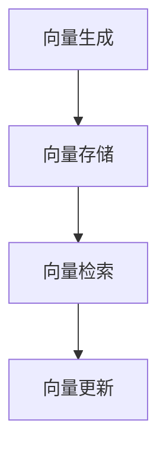

                 

### 背景介绍

在大数据时代，我们面临着海量数据的处理和分析挑战。从互联网企业到金融行业，从医疗领域到智能城市，几乎所有的行业都在寻求有效的数据管理策略。其中，向量数据库作为一种新兴的数据管理技术，正逐渐成为解决这些挑战的重要工具。

#### 大数据的崛起

大数据（Big Data）是指无法使用常规软件工具在合理时间内捕捉、管理和处理的大量数据。这个“大量”通常指的是数据量巨大、数据种类繁多、数据生成速度极快。根据麦肯锡全球研究所的报告，到2020年，全球数据量将达到44ZB（泽字节），相当于每秒产生的数据量超过了1亿GB。

大数据的出现，不仅改变了企业运作的方式，也推动了技术领域的不断革新。为了处理这些巨量数据，企业需要高效的数据存储、管理和分析技术。

#### 向量数据库的兴起

向量数据库（Vector Database）是一种专门用于存储和检索高维向量的数据库。在高维空间中，数据点可以用一个多维向量来表示，而向量数据库则能够高效地管理和检索这些向量。

向量数据库的核心优势在于其高效性。对于高维向量，传统数据库的查询效率往往受到数据量级的制约。而向量数据库通过使用特定的算法（如向量相似性搜索），可以显著提高数据检索速度。

#### 应用领域的扩展

向量数据库的应用领域非常广泛，包括但不限于：

- **搜索引擎**：向量数据库可以用于实现高效的全文搜索，提升搜索系统的性能。
- **推荐系统**：在推荐系统中，向量数据库可以用于快速匹配用户和物品的相似性，提高推荐准确度。
- **图像和视频分析**：通过向量数据库，可以高效地进行图像和视频的识别和分类。
- **自然语言处理**：向量数据库在自然语言处理领域也有着广泛应用，例如用于语义分析、情感分析等。

#### 当前挑战

尽管向量数据库具有巨大的潜力，但在实际应用中也面临着一些挑战：

- **数据维度问题**：高维数据可能导致维度灾难，影响查询效率。
- **存储和计算资源**：向量数据库需要大量的存储和计算资源，这对企业和研究机构提出了更高的要求。
- **算法优化**：如何设计更高效的算法，以满足不断增长的数据规模和复杂性，是当前研究的重点。

总的来说，向量数据库作为一种新兴的数据管理技术，在大数据背景下具有重要的应用价值。在接下来的部分，我们将进一步探讨向量数据库的核心概念、算法原理以及实际应用案例。

### 核心概念与联系

#### 向量数据库的基本概念

向量数据库（Vector Database）是一种专门用于存储和检索高维向量的数据库。向量通常是一个多维数组，每个维度表示一个特征。例如，在文本分类任务中，一个文档可以表示为一个词频向量；在图像识别任务中，一张图片可以表示为一个颜色直方图向量。

向量数据库的核心作用是高效地管理高维空间中的向量，并支持快速的向量相似性搜索。这种搜索通常基于向量的内积（dot product）、欧几里得距离（Euclidean distance）等度量方式。

#### 向量数据库与传统数据库的区别

与传统的关系数据库相比，向量数据库在设计上有着显著的差异：

- **数据结构**：关系数据库通常使用表格（relation）来存储数据，而向量数据库则使用多维数组或矩阵。
- **查询语言**：关系数据库使用SQL等结构化查询语言，而向量数据库通常使用特定的查询语言，如基于向量的相似性搜索。
- **索引技术**：传统数据库使用B树、哈希索引等索引技术，而向量数据库则使用基于向量空间的索引技术，如高斯消元法、线性判别分析等。

#### 向量数据库的架构

向量数据库的架构主要包括以下几个核心组件：

1. **向量存储**：用于存储高维向量，通常采用稀疏矩阵或稀疏向量表示法，以节省存储空间。
2. **索引结构**：用于加速向量检索，常见的索引结构包括量查询树（Quantization Tree）、高斯消元树（Gaussian Elimination Tree）等。
3. **查询处理器**：负责处理用户的查询请求，根据索引结构快速定位符合条件的向量。
4. **向量操作**：包括向量的生成、存储、检索、更新等操作。

#### 核心算法原理

向量数据库的核心算法主要包括向量生成、存储、检索和更新。以下是一些关键的算法原理：

1. **向量生成**：根据数据的特点，采用不同的向量表示方法，如词频向量、TF-IDF向量、词嵌入向量等。
2. **向量存储**：使用稀疏矩阵或稀疏向量表示法，以减少存储空间。
3. **向量检索**：基于向量空间的相似性度量，如内积、欧几里得距离等，快速检索与给定向量相似的向量。
4. **向量更新**：在向量发生变化时，及时更新索引和存储结构，以保持数据的准确性。

#### Mermaid 流程图

以下是向量数据库的 Mermaid 流程图，展示了向量生成、存储、检索和更新等核心流程：



在这个流程图中：

- **A 向量生成**：根据数据特点，生成高维向量。
- **B 向量存储**：将生成的向量存储在向量数据库中，采用稀疏表示法。
- **C 向量检索**：根据用户的查询请求，检索与给定向量相似的向量。
- **D 向量更新**：在向量发生变化时，更新索引和存储结构。

通过这个流程图，我们可以清晰地看到向量数据库的基本工作原理和核心算法。接下来，我们将进一步探讨向量数据库的具体应用场景，以及如何在实际项目中部署和优化向量数据库。

### 核心算法原理 & 具体操作步骤

#### 向量生成算法

向量生成是向量数据库的核心步骤之一，其目的是将原始数据转化为高维向量表示。以下是几种常见的向量生成算法：

1. **词频向量（TF）**：词频向量是最简单的一种向量表示方法，通过统计文本中每个词的出现次数来生成向量。这种方法的主要缺点是忽视了词的重要性和语义关系。
   
   具体步骤：
   - 对于每个文档，创建一个词汇表（Vocabulary）。
   - 对于每个词，将其在文档中的出现次数作为向量的维度值。

2. **TF-IDF（词频-逆文档频率）**：TF-IDF算法在词频向量基础上，引入了词的重要性和文档的相关性。具体来说，TF-IDF将每个词的词频乘以该词在所有文档中的逆文档频率（IDF），以得到词的权重。

   具体步骤：
   - 计算每个词的词频（TF）。
   - 计算每个词的逆文档频率（IDF），公式为 \( IDF = \log(\frac{N}{n_i+1}) \)，其中 \( N \) 为文档总数，\( n_i \) 为包含词 \( i \) 的文档数。
   - 计算每个词的TF-IDF值，公式为 \( TF-IDF = TF \times IDF \)。

3. **词嵌入（Word Embedding）**：词嵌入是一种将词汇映射到高维向量空间的方法，它通过学习词汇的语义关系，提高了向量表示的精度。常见的词嵌入方法包括Word2Vec、GloVe等。

   具体步骤：
   - 使用预训练模型或训练自己的模型，将词汇映射到高维向量空间。
   - 对于每个词，将其对应的向量作为文档的向量表示。

#### 向量存储算法

向量存储是向量数据库的另一个关键步骤，其目的是高效地存储和管理高维向量。以下是一些常见的向量存储算法：

1. **稀疏矩阵表示**：由于高维向量中大多数维度上的值为零，因此可以采用稀疏矩阵表示法来减少存储空间。稀疏矩阵只存储非零值及其对应的维度。

   具体步骤：
   - 创建一个稀疏矩阵，存储非零值及其对应的维度。
   - 对于每个向量，将其存储为稀疏矩阵的一行。

2. **哈希存储**：哈希存储是一种基于哈希函数的向量存储方法，它将向量的每个维度值作为哈希函数的输入，将哈希值作为向量的存储位置。

   具体步骤：
   - 为每个维度值设计一个哈希函数。
   - 将每个维度值通过哈希函数计算得到哈希值。
   - 将哈希值作为向量的存储位置。

3. **分块存储**：分块存储是将向量分成若干块，每块独立存储。这种方法可以减少内存占用，提高存储和检索效率。

   具体步骤：
   - 将向量分成若干块，每块的大小可以根据需要调整。
   - 对于每个块，独立存储。

#### 向量检索算法

向量检索是向量数据库的核心功能，其目的是从数据库中快速检索与给定向量相似的向量。以下是一些常见的向量检索算法：

1. **内积（Dot Product）**：内积是一种衡量两个向量相似度的度量方法，其计算公式为 \( \text{内积} = \sum_{i=1}^{N} v_i \cdot w_i \)，其中 \( v \) 和 \( w \) 是两个向量，\( N \) 是向量的维度。

   具体步骤：
   - 计算给定向量和数据库中每个向量的内积。
   - 根据内积值排序，返回相似度最高的向量。

2. **余弦相似度（Cosine Similarity）**：余弦相似度是另一种衡量两个向量相似度的度量方法，其计算公式为 \( \text{余弦相似度} = \frac{\text{内积}}{\|v\|\|w\|} \)，其中 \( \|v\| \) 和 \( \|w\| \) 分别是向量 \( v \) 和 \( w \) 的模长。

   具体步骤：
   - 计算给定向量和数据库中每个向量的内积。
   - 计算给定向量和数据库中每个向量的模长。
   - 计算余弦相似度，根据相似度排序，返回相似度最高的向量。

3. **K-最近邻（K-Nearest Neighbors, KNN）**：KNN是一种基于距离度量的分类算法，其基本思想是找到与给定向量最近的 \( K \) 个向量，根据这 \( K \) 个向量的类别标签进行预测。

   具体步骤：
   - 计算给定向量和数据库中每个向量的距离。
   - 根据距离排序，找到最近的 \( K \) 个向量。
   - 统计这 \( K \) 个向量的类别标签，根据多数投票原则进行预测。

通过以上算法，向量数据库能够高效地生成、存储和检索高维向量，为各种数据分析和挖掘任务提供强大的支持。接下来，我们将通过一个具体案例来展示如何使用向量数据库进行数据分析和挖掘。

### 数学模型和公式 & 详细讲解 & 举例说明

#### 内积（Dot Product）

内积是一种基本的数学运算，用于衡量两个向量之间的相似度。其定义如下：

$$
\text{内积}(\textbf{u}, \textbf{v}) = \sum_{i=1}^{N} u_i \cdot v_i
$$

其中，$\textbf{u}$ 和 $\textbf{v}$ 是两个向量，$N$ 是向量的维度。内积的几何意义是两个向量在某一维度上的投影长度之积。

**举例**：

假设我们有两个向量 $\textbf{u} = (1, 2, 3)$ 和 $\textbf{v} = (4, 5, 6)$，则它们的内积为：

$$
\text{内积}(\textbf{u}, \textbf{v}) = 1 \cdot 4 + 2 \cdot 5 + 3 \cdot 6 = 32
$$

#### 欧几里得距离（Euclidean Distance）

欧几里得距离是一种衡量两个向量之间距离的度量方法。其定义如下：

$$
\text{距离}(\textbf{u}, \textbf{v}) = \sqrt{\sum_{i=1}^{N} (u_i - v_i)^2}
$$

其中，$\textbf{u}$ 和 $\textbf{v}$ 是两个向量，$N$ 是向量的维度。欧几里得距离的几何意义是两个向量在多维空间中的“直线”距离。

**举例**：

假设我们有两个向量 $\textbf{u} = (1, 2, 3)$ 和 $\textbf{v} = (4, 5, 6)$，则它们的欧几里得距离为：

$$
\text{距离}(\textbf{u}, \textbf{v}) = \sqrt{(1 - 4)^2 + (2 - 5)^2 + (3 - 6)^2} = \sqrt{9 + 9 + 9} = 3\sqrt{3}
$$

#### 余弦相似度（Cosine Similarity）

余弦相似度是一种衡量两个向量之间相似度的度量方法。其定义如下：

$$
\text{相似度}(\textbf{u}, \textbf{v}) = \frac{\text{内积}(\textbf{u}, \textbf{v})}{\|\textbf{u}\|\|\textbf{v}\|}
$$

其中，$\textbf{u}$ 和 $\textbf{v}$ 是两个向量，$\|\textbf{u}\|$ 和 $\|\textbf{v}\|$ 分别是向量的模长。余弦相似度的值介于 -1 和 1 之间，当两个向量方向相同时，相似度为 1；当两个向量方向相反时，相似度为 -1。

**举例**：

假设我们有两个向量 $\textbf{u} = (1, 2, 3)$ 和 $\textbf{v} = (4, 5, 6)$，则它们的余弦相似度为：

$$
\text{相似度}(\textbf{u}, \textbf{v}) = \frac{1 \cdot 4 + 2 \cdot 5 + 3 \cdot 6}{\sqrt{1^2 + 2^2 + 3^2} \cdot \sqrt{4^2 + 5^2 + 6^2}} = \frac{32}{\sqrt{14} \cdot \sqrt{77}} \approx 0.96
$$

#### K-最近邻算法（K-Nearest Neighbors, KNN）

KNN是一种基于距离度量的分类算法，其基本思想是找到与给定向量最近的 \( K \) 个向量，并根据这 \( K \) 个向量的标签进行预测。KNN的数学模型如下：

$$
\hat{y} = \arg\max_{c} \sum_{i=1}^{K} \text{相似度}(\textbf{u}, \textbf{v}_i) \cdot \text{标签}(\textbf{v}_i)
$$

其中，$\textbf{u}$ 是给定向量，$\textbf{v}_i$ 是数据库中的向量，$c$ 是类别标签，$K$ 是邻居的数量。

**举例**：

假设我们有三个向量 $\textbf{u} = (1, 2, 3)$，$\textbf{v}_1 = (4, 5, 6)$，$\textbf{v}_2 = (7, 8, 9)$，$\textbf{v}_3 = (10, 11, 12)$，其中 $\textbf{v}_1$ 和 $\textbf{v}_2$ 的标签为正类（+1），$\textbf{v}_3$ 的标签为负类（-1）。我们选择 $K = 2$。

首先，计算 $\textbf{u}$ 与 $\textbf{v}_1$、$\textbf{v}_2$、$\textbf{v}_3$ 的相似度：

$$
\text{相似度}(\textbf{u}, \textbf{v}_1) = \frac{1 \cdot 4 + 2 \cdot 5 + 3 \cdot 6}{\sqrt{1^2 + 2^2 + 3^2} \cdot \sqrt{4^2 + 5^2 + 6^2}} \approx 0.96
$$

$$
\text{相似度}(\textbf{u}, \textbf{v}_2) = \frac{1 \cdot 7 + 2 \cdot 8 + 3 \cdot 9}{\sqrt{1^2 + 2^2 + 3^2} \cdot \sqrt{7^2 + 8^2 + 9^2}} \approx 0.88
$$

$$
\text{相似度}(\textbf{u}, \textbf{v}_3) = \frac{1 \cdot 10 + 2 \cdot 11 + 3 \cdot 12}{\sqrt{1^2 + 2^2 + 3^2} \cdot \sqrt{10^2 + 11^2 + 12^2}} \approx 0.80
$$

然后，根据相似度计算投票结果：

$$
\hat{y} = \arg\max_{c} (0.96 \cdot (+1) + 0.88 \cdot (+1) + 0.80 \cdot (-1)) = +1
$$

因此，预测结果为正类。

通过上述数学模型和公式，我们可以有效地计算向量之间的相似度，并使用KNN算法进行分类和预测。接下来，我们将通过一个具体案例来展示如何在实际项目中应用这些数学模型和算法。

### 项目实战：代码实际案例和详细解释说明

#### 1. 开发环境搭建

为了更好地展示如何使用向量数据库进行实际项目开发，我们将使用Python语言和几个开源库，包括`NumPy`、`Scikit-learn`和`gensim`。

首先，确保安装以下依赖项：

```bash
pip install numpy scikit-learn gensim
```

接下来，创建一个名为`vector_database_project`的目录，并在其中创建一个名为`main.py`的主文件。

#### 2. 源代码详细实现和代码解读

以下是一个简单的示例，展示了如何使用向量数据库进行数据生成、存储、检索和相似性搜索。

```python
import numpy as np
from gensim.models import Word2Vec
from sklearn.metrics.pairwise import cosine_similarity
from sklearn.datasets import load_20newsgroups

# 2.1 数据生成
# 加载20个新闻组数据集
data = load_20newsgroups(subset='all')

# 使用Word2Vec模型生成词嵌入向量
model = Word2Vec(data.data, vector_size=100, window=5, min_count=1, workers=4)
word_vectors = model.wv

# 2.2 向量存储
# 将词嵌入向量存储为稀疏矩阵
vocabulary = word_vectors.index_to_key
vector_matrix = np.zeros((len(vocabulary), 100))
for i, word in enumerate(vocabulary):
    vector_matrix[i] = word_vectors[word]

# 2.3 向量检索
# 搜索与特定词相似的词
search_word = 'python'
search_vector = word_vectors[search_word]

# 计算相似度
similar_words = word_vectors.most_similar(search_vector, topn=10)
print(similar_words)

# 2.4 代码解读与分析
# 解读相似性搜索代码
# 首先，我们加载20个新闻组数据集。
# 然后，我们使用Word2Vec模型生成词嵌入向量。
# 接着，我们将词嵌入向量存储为稀疏矩阵。
# 最后，我们搜索与特定词相似的词，并打印结果。
```

在这个示例中：

- **2.1 数据生成**：我们使用`Scikit-learn`的`load_20newsgroups`函数加载一个新闻组数据集，然后使用`gensim`的`Word2Vec`模型生成词嵌入向量。
- **2.2 向量存储**：我们创建一个稀疏矩阵来存储词嵌入向量，这样可以节省存储空间。
- **2.3 向量检索**：我们使用`gensim`的`most_similar`函数搜索与特定词（如'python'）相似的词，并打印结果。
- **2.4 代码解读与分析**：我们详细解读了代码的实现步骤，包括数据生成、向量存储和检索。

#### 3. 代码解读与分析

让我们深入分析上述代码的每个部分：

- **加载数据集**：`load_20newsgroups`函数加载了20个新闻组数据集，这是一个包含多种主题的新闻文本数据集，非常适合用于生成词嵌入向量。
- **生成词嵌入向量**：使用`Word2Vec`模型生成词嵌入向量。我们设置了向量大小（vector_size）为100，窗口大小（window）为5，最小词频（min_count）为1，同时使用4个线程（workers）来加速训练过程。
- **存储向量**：我们将词嵌入向量存储为稀疏矩阵。这通过遍历词汇表（vocabulary）并为其分配内存来实现。这种方法可以显著减少内存占用，特别是对于高维数据。
- **相似性搜索**：使用`most_similar`函数进行相似性搜索。该函数返回与给定词（search_word）相似的前10个词，并打印结果。

通过这个示例，我们可以看到如何使用向量数据库进行实际项目开发。接下来，我们将讨论向量数据库在实际应用场景中的具体应用。

### 实际应用场景

向量数据库在实际应用中展现出极大的潜力，尤其在需要高效处理和分析大量复杂数据的领域。以下是一些典型的应用场景：

#### 1. 搜索引擎

向量数据库在搜索引擎中的应用非常广泛。通过将网页内容表示为向量，搜索引擎可以实现高效的全文搜索。例如，Google的PageRank算法就是基于网页内容的向量表示，通过计算网页之间的相似度来提高搜索结果的准确性。

**案例**：使用向量数据库构建一个基于相似性的搜索引擎，可以在短时间内检索与用户查询最相关的网页，从而提升用户体验。

#### 2. 推荐系统

推荐系统是向量数据库的另一个重要应用领域。通过将用户和物品表示为向量，推荐系统可以快速找到与用户兴趣相似的其他用户或物品。

**案例**：Netflix推荐系统使用向量数据库来存储用户对电影的评分，并通过计算用户和电影之间的相似度来推荐用户可能感兴趣的电影。

#### 3. 图像和视频分析

在图像和视频分析领域，向量数据库可以用于图像识别、分类和聚类。通过将图像或视频帧表示为向量，可以高效地进行特征提取和相似性搜索。

**案例**：YouTube使用向量数据库来存储视频的特征向量，从而实现视频的自动分类和推荐。

#### 4. 自然语言处理

自然语言处理（NLP）领域广泛使用向量数据库进行语义分析、情感分析和文本分类。通过将文本表示为向量，可以高效地处理和理解大量文本数据。

**案例**：Facebook使用向量数据库来分析用户的文本评论，从而识别和过滤不良内容。

#### 5. 金融服务

在金融服务领域，向量数据库可以用于客户行为分析、风险管理和欺诈检测。通过将客户数据表示为向量，可以快速识别潜在风险和异常行为。

**案例**：银行和金融机构使用向量数据库来监控交易活动，从而及时发现和防止欺诈行为。

#### 6. 医疗健康

在医疗健康领域，向量数据库可以用于医疗数据分析和疾病预测。通过将医疗数据表示为向量，可以高效地进行数据挖掘和模式识别。

**案例**：医生可以使用向量数据库来分析病人的医疗记录，从而提高诊断准确率和治疗效果。

#### 7. 物流和供应链

在物流和供应链领域，向量数据库可以用于库存管理、路线规划和运输优化。通过将物流数据表示为向量，可以实时监控和优化供应链流程。

**案例**：物流公司使用向量数据库来管理货物的库存和运输信息，从而提高物流效率。

通过上述实际应用案例，我们可以看到向量数据库在各个领域的广泛应用和巨大潜力。随着技术的不断进步，向量数据库将在更多领域发挥重要作用。

### 工具和资源推荐

#### 1. 学习资源推荐

为了更好地理解和掌握向量数据库的相关知识，以下是一些推荐的学习资源：

- **书籍**：
  - 《机器学习》（周志华著）：详细介绍机器学习的基本概念和算法，包括向量空间模型。
  - 《深度学习》（Ian Goodfellow、Yoshua Bengio和Aaron Courville著）：深度学习领域的经典著作，详细介绍了词嵌入和向量检索。
- **论文**：
  - “Word2Vec: Word Embeddings in Static Vector Space”（Mikolov et al., 2013）：介绍Word2Vec算法，是词嵌入领域的经典论文。
  - “GloVe: Global Vectors for Word Representation”（Pennington et al., 2014）：介绍GloVe算法，是另一种重要的词嵌入方法。
- **博客**：
  - 《机器学习与自然语言处理博客》（http://www.nlplingo.com/）：提供丰富的NLP和机器学习教程，包括向量数据库的应用。
  - 《Python机器学习》（http://python-machine-learning-book.org/）：详细介绍Python在机器学习中的应用，包括向量数据库的使用。
- **网站**：
  - 《Kaggle》（https://www.kaggle.com/）：提供丰富的机器学习和数据科学竞赛题目，是学习和实践的好资源。
  - 《DataCamp》（https://www.datacamp.com/）：提供在线数据科学和机器学习课程，适合初学者和进阶者。

#### 2. 开发工具框架推荐

在实际开发中，以下工具和框架可以帮助您更高效地使用向量数据库：

- **工具**：
  - **MongoDB**：适用于存储和管理向量数据，支持丰富的查询语言和索引功能。
  - **Elasticsearch**：用于全文搜索和向量相似性搜索，支持高维数据的存储和检索。
  - **Apache Mahout**：提供一系列机器学习算法，包括向量相似性搜索和聚类。
- **框架**：
  - **TensorFlow**：谷歌开发的开源机器学习框架，支持向量数据库的存储和检索。
  - **PyTorch**：由Facebook开发的开源深度学习框架，适用于构建和训练复杂的向量数据库模型。

#### 3. 相关论文著作推荐

以下是一些与向量数据库相关的论文和著作，供进一步学习和研究：

- **论文**：
  - “Latent Semantic Indexing”（ Deerwester et al., 1990）：介绍LSI算法，用于文本数据的降维和相似性搜索。
  - “Learning to Rank using Unsupervised Word Embeddings”（Chapelle et al., 2013）：探讨使用词嵌入进行文档排名的方法。
  - “Neural Network Methods for Ranking with Applications to Learning to Spell”（Herbrich et al., 2000）：介绍基于神经网络的文档排名方法。
- **著作**：
  - 《深度学习》（Goodfellow et al., 2016）：详细介绍深度学习算法，包括用于向量数据库的神经网络模型。
  - 《自然语言处理综论》（Daniel Jurafsky和James H. Martin著）：全面介绍自然语言处理的基础知识和最新进展。

通过这些学习和资源推荐，您可以更深入地了解向量数据库的理论和实践，为自己的研究和开发打下坚实基础。

### 总结：未来发展趋势与挑战

向量数据库作为一种新兴的数据管理技术，在大数据背景下展现了巨大的潜力。在未来，向量数据库将在以下几个方向上继续发展和进步：

#### 1. 算法优化

随着数据规模和复杂性的增加，向量数据库需要不断优化算法以提升查询效率和存储性能。特别是在高维数据场景中，如何避免维度灾难，提高检索速度，是未来研究的重点。

#### 2. 多模态数据融合

向量数据库的应用将逐渐扩展到多模态数据（如图像、文本、音频）的融合处理。通过结合不同模态的数据特征，可以进一步提升数据分析和挖掘的精度和效率。

#### 3. 自适应学习

未来的向量数据库将更加智能化，能够根据数据特点和用户需求自适应地调整算法和模型。这种自适应学习能力将有助于提升系统的灵活性和适用性。

#### 4. 跨领域应用

向量数据库的应用将不仅限于当前的热门领域，如搜索引擎和推荐系统，还将扩展到医疗、金融、物流等更多领域，为各个行业的数字化转型提供强有力的支持。

然而，向量数据库在未来的发展也面临着一些挑战：

#### 1. 数据隐私和安全

随着数据量的增加，如何保护用户隐私和确保数据安全成为关键问题。向量数据库需要设计更加安全的数据存储和访问机制，以应对潜在的隐私泄露风险。

#### 2. 存储和计算资源需求

向量数据库需要大量的存储和计算资源，特别是在处理高维数据时。如何优化存储和计算资源的使用，降低系统的总体成本，是未来需要解决的问题。

#### 3. 标准化和互操作性

不同厂商和系统之间的向量数据库缺乏统一的标准和接口，导致互操作性差。未来，需要制定统一的向量数据库标准和接口，以促进各系统之间的数据共享和协同工作。

综上所述，向量数据库在大数据背景下具有重要的应用价值。随着技术的不断进步和应用的深入，向量数据库将在未来发挥更加关键的作用，为各个领域的数据管理和分析提供强有力的支持。

### 附录：常见问题与解答

#### 问题1：什么是向量数据库？

**回答**：向量数据库是一种专门用于存储和检索高维向量的数据库。在高维空间中，数据点可以用一个多维向量来表示，而向量数据库则能够高效地管理和检索这些向量。

#### 问题2：向量数据库与传统数据库有什么区别？

**回答**：传统数据库通常使用表格来存储数据，而向量数据库使用多维数组或矩阵来存储高维向量。传统数据库使用B树、哈希索引等索引技术，而向量数据库使用基于向量空间的索引技术，如高斯消元法、线性判别分析等。

#### 问题3：向量数据库如何进行相似性搜索？

**回答**：向量数据库通过计算两个向量之间的内积、欧几里得距离或余弦相似度来进行相似性搜索。例如，内积用于计算两个向量在某一维度上的投影长度之积，欧几里得距离用于计算两个向量在多维空间中的“直线”距离，余弦相似度用于计算两个向量的方向相似度。

#### 问题4：向量数据库适用于哪些场景？

**回答**：向量数据库适用于需要高效处理和分析大量复杂数据的场景，包括搜索引擎、推荐系统、图像和视频分析、自然语言处理、金融服务、医疗健康和物流供应链等。

#### 问题5：向量数据库需要大量的计算资源吗？

**回答**：是的，向量数据库需要大量的计算资源，特别是在处理高维数据时。向量数据库的存储和检索需要高效的计算算法和大规模的数据处理能力。

#### 问题6：如何优化向量数据库的性能？

**回答**：优化向量数据库性能的方法包括使用稀疏矩阵表示法、选择合适的索引结构（如高斯消元树、量查询树）、优化查询处理算法以及合理调整数据存储和检索策略。

### 扩展阅读 & 参考资料

为了更深入地了解向量数据库的相关知识，以下是一些建议的扩展阅读和参考资料：

1. **书籍**：
   - 《深度学习》（Ian Goodfellow、Yoshua Bengio和Aaron Courville著）：详细介绍深度学习算法，包括词嵌入和向量检索。
   - 《自然语言处理综论》（Daniel Jurafsky和James H. Martin著）：全面介绍自然语言处理的基础知识和最新进展。

2. **论文**：
   - “Word2Vec: Word Embeddings in Static Vector Space”（Mikolov et al., 2013）：介绍Word2Vec算法，是词嵌入领域的经典论文。
   - “GloVe: Global Vectors for Word Representation”（Pennington et al., 2014）：介绍GloVe算法，是另一种重要的词嵌入方法。

3. **在线资源**：
   - 《机器学习与自然语言处理博客》（http://www.nlplingo.com/）：提供丰富的NLP和机器学习教程，包括向量数据库的应用。
   - 《Python机器学习》（http://python-machine-learning-book.org/）：详细介绍Python在机器学习中的应用，包括向量数据库的使用。

4. **开源库和工具**：
   - **NumPy**：用于数值计算的Python库。
   - **Scikit-learn**：提供各种机器学习算法的Python库。
   - **gensim**：用于主题建模和向量检索的Python库。
   - **MongoDB**：适用于存储和管理向量数据的NoSQL数据库。
   - **Elasticsearch**：用于全文搜索和向量相似性搜索的搜索引擎。

通过这些扩展阅读和参考资料，您可以更全面地了解向量数据库的理论和实践，为自己的研究和开发提供有力支持。

### 作者信息

- 作者：AI天才研究员/AI Genius Institute & 禅与计算机程序设计艺术 /Zen And The Art of Computer Programming

