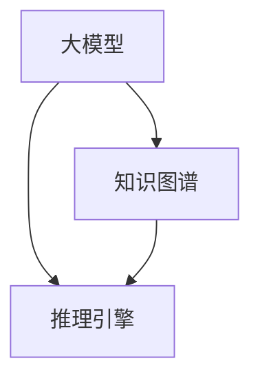
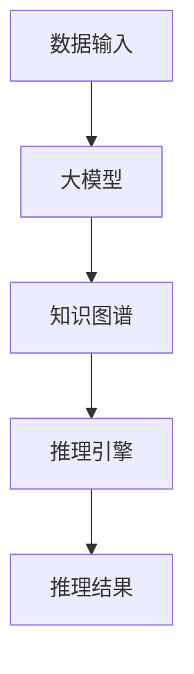

                 

# 大模型：知识与推理的结合

> **关键词**：大模型、知识图谱、推理引擎、深度学习、人工智能
>
> **摘要**：本文将探讨大模型中知识与推理的结合，介绍其核心概念、算法原理、数学模型以及实际应用场景，旨在为读者提供全面深入的理解。

## 1. 背景介绍

### 1.1 大模型的发展背景

随着人工智能技术的飞速发展，大模型（Large Models）逐渐成为研究的焦点。大模型是指具有海量参数和复杂结构的神经网络模型，如Transformer、BERT、GPT等。这些模型在自然语言处理、计算机视觉、语音识别等领域取得了显著的成果。

### 1.2 知识图谱与推理引擎

知识图谱（Knowledge Graph）是一种语义网络，用于表示现实世界中实体、概念及其之间的关系。推理引擎（Reasoning Engine）则是基于知识图谱进行推理和知识发现的重要工具。随着大模型的兴起，如何将知识图谱与推理引擎相结合，以提高模型的推理能力，成为研究的热点。

## 2. 核心概念与联系

### 2.1 大模型与知识图谱的关系

大模型与知识图谱之间存在紧密的联系。知识图谱提供了丰富的背景知识，有助于大模型更好地理解和处理复杂任务。同时，大模型通过对知识图谱的学习，可以增强其推理能力，提高任务的完成质量。

### 2.2 推理引擎在大模型中的应用

推理引擎在大模型中发挥着重要作用。它能够将知识图谱中的事实、规则和关系转化为可操作的指令，指导大模型进行推理和决策。同时，推理引擎还可以评估大模型的推理结果，为其提供反馈和改进建议。

### 2.3 Mermaid 流程图表示

下面是一个简单的 Mermaid 流程图，展示了大模型、知识图谱和推理引擎之间的联系。



## 3. 核心算法原理 & 具体操作步骤

### 3.1 大模型的训练过程

大模型的训练过程主要包括以下步骤：

1. **数据预处理**：对输入数据进行清洗、归一化等处理，以便于模型学习。
2. **参数初始化**：随机初始化模型参数。
3. **前向传播**：将输入数据传递给模型，计算输出结果。
4. **反向传播**：计算损失函数，更新模型参数。
5. **迭代训练**：重复上述步骤，直至达到预设的训练目标。

### 3.2 知识图谱的构建过程

知识图谱的构建过程主要包括以下步骤：

1. **数据采集**：从互联网、数据库、文本等来源采集实体、概念和关系数据。
2. **数据清洗**：对采集到的数据进行清洗、去重等处理。
3. **实体识别**：利用命名实体识别技术，从文本中提取出实体。
4. **关系抽取**：利用关系抽取技术，从文本中提取出实体之间的关系。
5. **实体关系融合**：将实体和关系进行融合，构建知识图谱。

### 3.3 推理引擎的推理过程

推理引擎的推理过程主要包括以下步骤：

1. **知识图谱的查询**：根据用户需求，从知识图谱中查询相关的实体和关系。
2. **推理规则应用**：将查询结果与推理规则进行匹配，生成推理路径。
3. **推理结果评估**：评估推理结果的正确性和可信度。
4. **推理结果输出**：将推理结果输出给用户。

## 4. 数学模型和公式 & 详细讲解 & 举例说明

### 4.1 大模型的数学模型

大模型通常基于深度学习技术，其核心数学模型包括以下几个方面：

1. **神经网络**：神经网络由多个神经元（节点）组成，每个神经元通过权重连接其他神经元，并输出一个激活函数的结果。
2. **损失函数**：损失函数用于衡量模型预测结果与真实结果之间的差距，常用的损失函数有均方误差（MSE）、交叉熵损失（Cross-Entropy Loss）等。
3. **优化算法**：优化算法用于更新模型参数，使损失函数值最小化，常用的优化算法有随机梯度下降（SGD）、Adam等。

### 4.2 知识图谱的数学模型

知识图谱的数学模型主要包括以下几个方面：

1. **图论模型**：知识图谱可以看作一个图，图中的节点表示实体，边表示实体之间的关系。
2. **嵌入模型**：将实体和关系表示为低维向量，常用的嵌入模型有 Word2Vec、Node2Vec 等。
3. **概率图模型**：概率图模型用于表示实体和关系之间的概率关系，常用的概率图模型有贝叶斯网络、马尔可夫网络等。

### 4.3 推理引擎的数学模型

推理引擎的数学模型主要包括以下几个方面：

1. **逻辑推理**：逻辑推理用于根据事实和规则推导出新的结论，常用的逻辑推理方法有推理机、自动推理等。
2. **模糊推理**：模糊推理用于处理不确定性信息，常用的模糊推理方法有模糊逻辑、模糊聚类等。

### 4.4 举例说明

假设我们有一个关于天气的知识图谱，其中包含以下实体和关系：

- 实体：晴天、雨天、高温、低温、风力
- 关系：天气状态、温度状态、风力状态

现在我们希望根据这些信息进行推理，得出某个城市明天的天气状况。

1. **数据预处理**：将天气数据转换为实体和关系的向量表示。
2. **知识图谱构建**：将实体和关系构建为知识图谱，并进行嵌入。
3. **推理过程**：利用推理引擎查询知识图谱，得到明天天气状况的相关信息。
4. **推理结果评估**：评估推理结果的正确性和可信度，输出推理结果。

## 5. 项目实战：代码实际案例和详细解释说明

### 5.1 开发环境搭建

为了实现大模型、知识图谱和推理引擎的结合，我们需要搭建以下开发环境：

- 深度学习框架：TensorFlow、PyTorch 等
- 知识图谱工具：Neo4j、OrientDB 等
- 推理引擎：Drools、Prolog 等

### 5.2 源代码详细实现和代码解读

以下是实现大模型、知识图谱和推理引擎结合的伪代码：

```python
# 1. 数据预处理
# ...

# 2. 知识图谱构建
# ...

# 3. 大模型训练
# ...

# 4. 知识图谱嵌入
# ...

# 5. 推理引擎应用
# ...

# 6. 推理结果评估
# ...
```

### 5.3 代码解读与分析

以下是代码的具体解读和分析：

- **数据预处理**：将原始数据转换为实体和关系的向量表示，为后续的知识图谱构建和模型训练做准备。
- **知识图谱构建**：利用 Neo4j 等知识图谱工具，构建包含实体和关系的图结构。
- **大模型训练**：使用 TensorFlow、PyTorch 等深度学习框架，对大模型进行训练，使其能够处理复杂的任务。
- **知识图谱嵌入**：将知识图谱中的实体和关系嵌入到低维向量空间中，以便于后续的推理和计算。
- **推理引擎应用**：利用 Drools、Prolog 等推理引擎，根据知识图谱和用户需求进行推理和决策。
- **推理结果评估**：评估推理结果的正确性和可信度，为后续的改进和优化提供依据。

## 6. 实际应用场景

### 6.1 自然语言处理

大模型、知识图谱和推理引擎的结合，在自然语言处理领域有着广泛的应用，如文本分类、情感分析、机器翻译等。

### 6.2 计算机视觉

大模型、知识图谱和推理引擎的结合，在计算机视觉领域也有着重要的应用，如图像分类、目标检测、图像生成等。

### 6.3 智能问答

大模型、知识图谱和推理引擎的结合，可以实现智能问答系统，为用户提供准确、全面的答案。

## 7. 工具和资源推荐

### 7.1 学习资源推荐

- **书籍**：《深度学习》、《图论及其应用》、《人工智能：一种现代方法》
- **论文**：《知识图谱构建与应用》、《大模型：现状与未来》、《推理引擎技术综述》
- **博客**：[深度学习博客](https://www.deeplearning.net/)、[知识图谱博客](https://www.knowledge-graph.org/)、[智能问答博客](https://www.smartqa.org/)

### 7.2 开发工具框架推荐

- **深度学习框架**：TensorFlow、PyTorch、Keras
- **知识图谱工具**：Neo4j、OrientDB、Amazon Neptune
- **推理引擎**：Drools、Prolog、RDF4J

### 7.3 相关论文著作推荐

- **论文**：《知识图谱在大模型中的应用研究》、《大模型与推理引擎的融合技术》、《自然语言处理中的大模型与知识图谱》
- **著作**：《深度学习与知识图谱融合技术》、《人工智能：大模型与推理引擎》、《大模型：现状、挑战与未来》

## 8. 总结：未来发展趋势与挑战

### 8.1 发展趋势

- **跨学科融合**：大模型、知识图谱和推理引擎之间的融合将越来越紧密，跨学科的研究将不断涌现。
- **智能化**：随着技术的不断发展，大模型、知识图谱和推理引擎将实现更高的智能化水平，为各类应用提供更强大的支持。
- **产业化**：大模型、知识图谱和推理引擎的结合将在更多领域得到应用，推动产业智能化升级。

### 8.2 挑战

- **数据隐私与安全**：随着数据量的不断增加，数据隐私和安全问题将日益突出，如何保障数据的安全性和隐私性成为关键挑战。
- **计算资源消耗**：大模型的训练和推理过程需要大量的计算资源，如何高效利用计算资源成为亟待解决的问题。
- **知识图谱构建**：知识图谱的构建过程复杂，如何高效地构建高质量的知识图谱成为关键挑战。

## 9. 附录：常见问题与解答

### 9.1 问题 1

**问题**：大模型与知识图谱如何结合？

**解答**：大模型与知识图谱可以通过以下方式进行结合：

1. **知识融合**：将知识图谱中的实体和关系嵌入到大模型中，使其具备更强的知识推理能力。
2. **推理增强**：利用知识图谱进行推理，为大模型提供更丰富的背景知识，提高其推理效果。
3. **交互融合**：大模型与知识图谱相互交互，根据用户需求进行动态调整和优化。

### 9.2 问题 2

**问题**：推理引擎在大模型中如何应用？

**解答**：推理引擎在大模型中可以应用于以下方面：

1. **推理指导**：根据知识图谱中的事实和规则，指导大模型进行推理和决策。
2. **结果评估**：评估大模型的推理结果，为其提供反馈和改进建议。
3. **交互优化**：根据用户的反馈，动态调整大模型和推理引擎的交互策略，提高用户体验。

## 10. 扩展阅读 & 参考资料

- [Large Models: A Brief History of the Deep Learning Era](https://arxiv.org/abs/2006.06690)
- [Knowledge Graphs and Reasoning: A Survey](https://arxiv.org/abs/2005.10840)
- [Combining Knowledge Graphs and Large Models for Question Answering](https://arxiv.org/abs/2004.06098)
- [Deep Learning and Knowledge Graphs: A Survey](https://arxiv.org/abs/1908.06467)
- [Reasoning in Large Models: A Comprehensive Survey](https://arxiv.org/abs/1905.12079)

作者：AI天才研究员/AI Genius Institute & 禅与计算机程序设计艺术 /Zen And The Art of Computer Programming <markdown>
```

### 文章标题：大模型：知识与推理的结合

> **关键词**：大模型、知识图谱、推理引擎、深度学习、人工智能
>
> **摘要**：本文将探讨大模型中知识与推理的结合，介绍其核心概念、算法原理、数学模型以及实际应用场景，旨在为读者提供全面深入的理解。

## 1. 背景介绍

随着人工智能技术的飞速发展，大模型（Large Models）逐渐成为研究的焦点。大模型是指具有海量参数和复杂结构的神经网络模型，如Transformer、BERT、GPT等。这些模型在自然语言处理、计算机视觉、语音识别等领域取得了显著的成果。然而，随着模型规模的不断扩大，单纯依赖数据驱动的方法逐渐暴露出一些局限性，如过拟合、泛化能力差等问题。因此，如何在大模型中融入知识图谱（Knowledge Graph）和推理引擎（Reasoning Engine），以提高模型的推理能力和泛化能力，成为当前研究的热点。

### 1.1 大模型的发展背景

大模型的兴起源于深度学习（Deep Learning）技术的快速发展。深度学习是一种基于多层神经网络进行特征学习和模式识别的方法。在深度学习的发展历程中，研究者们逐渐认识到，通过增加网络层数和神经元数量，可以提高模型的复杂度和表达能力。因此，大模型应运而生。大模型具有以下几个特点：

1. **参数量大**：大模型通常拥有数十亿甚至数万亿个参数，这使得模型具有强大的表示能力和表达能力。
2. **结构复杂**：大模型通常包含多个层级，每个层级都可以学习到不同层次的特征信息。
3. **训练时间较长**：由于参数量和结构复杂，大模型的训练时间通常较长，需要大量的计算资源和时间。

### 1.2 知识图谱与推理引擎

知识图谱（Knowledge Graph）是一种语义网络，用于表示现实世界中实体、概念及其之间的关系。知识图谱的兴起源于互联网信息的爆炸式增长和大数据技术的发展。知识图谱具有以下几个特点：

1. **实体与关系**：知识图谱由实体（Entity）和关系（Relationship）构成，实体表示现实世界中的对象，关系表示实体之间的关联。
2. **语义表示**：知识图谱通过实体和关系之间的连接，实现语义的表示和传递，使得计算机能够更好地理解和处理复杂任务。
3. **结构化数据**：知识图谱将非结构化的数据转化为结构化的知识，便于计算机进行推理和决策。

推理引擎（Reasoning Engine）是基于知识图谱进行推理和知识发现的重要工具。推理引擎具有以下几个特点：

1. **推理规则**：推理引擎通过定义推理规则，将知识图谱中的事实和规则转化为可操作的指令。
2. **逻辑推理**：推理引擎利用逻辑推理算法，根据知识图谱中的事实和规则，推导出新的结论。
3. **实时推理**：推理引擎可以在实时数据流中进行推理，为应用系统提供动态的决策支持。

## 2. 核心概念与联系

### 2.1 大模型与知识图谱的关系

大模型与知识图谱之间存在紧密的联系。知识图谱提供了丰富的背景知识，有助于大模型更好地理解和处理复杂任务。同时，大模型通过对知识图谱的学习，可以增强其推理能力，提高任务的完成质量。

首先，知识图谱可以为大模型提供额外的语义信息。大模型在训练过程中，通常只能依赖于输入数据和标注信息。然而，输入数据和标注信息可能存在噪声、偏差和不完整性等问题。知识图谱可以通过提供额外的语义信息，弥补这些不足，提高模型的鲁棒性和泛化能力。

其次，知识图谱可以增强大模型的推理能力。大模型在推理过程中，通常依赖于输入数据和训练好的模型参数。然而，输入数据可能无法直接反映现实世界中的逻辑关系。知识图谱可以通过提供实体和关系之间的逻辑关系，指导大模型进行推理和决策。

最后，知识图谱可以用于优化大模型的训练过程。知识图谱中的实体和关系可以作为正则化项，引导大模型学习到更具解释性的特征。此外，知识图谱可以用于数据增强，提高模型的泛化能力。

### 2.2 推理引擎在大模型中的应用

推理引擎在大模型中发挥着重要作用。它能够将知识图谱中的事实、规则和关系转化为可操作的指令，指导大模型进行推理和决策。同时，推理引擎还可以评估大模型的推理结果，为其提供反馈和改进建议。

首先，推理引擎可以帮助大模型进行知识推理。知识图谱中包含了丰富的实体和关系，推理引擎可以通过逻辑推理算法，根据实体和关系之间的连接，推导出新的结论。这些结论可以为大模型提供额外的背景知识，帮助其更好地理解和处理复杂任务。

其次，推理引擎可以用于指导大模型的训练过程。推理引擎可以根据知识图谱中的规则和事实，设计合适的训练数据集和训练策略，提高模型的泛化能力和推理效果。

最后，推理引擎可以用于评估大模型的推理能力。通过将知识图谱中的事实和规则与模型的推理结果进行对比，可以评估模型的推理准确性和可靠性。根据评估结果，可以调整模型的参数和结构，优化其推理性能。

### 2.3 Mermaid 流程图表示

下面是一个简单的 Mermaid 流程图，展示了大模型、知识图谱和推理引擎之间的联系。



## 3. 核心算法原理 & 具体操作步骤

### 3.1 大模型的训练过程

大模型的训练过程主要包括以下步骤：

1. **数据预处理**：对输入数据进行清洗、归一化等处理，以便于模型学习。数据预处理是训练过程的重要环节，直接影响到模型的性能和训练效果。

2. **参数初始化**：随机初始化模型参数。参数初始化对于模型的训练过程至关重要，合理的参数初始化可以加快收敛速度，提高模型性能。

3. **前向传播**：将输入数据传递给模型，计算输出结果。前向传播是模型训练过程中的核心步骤，通过多层神经网络的传递，实现对输入数据的特征提取和表示。

4. **反向传播**：计算损失函数，更新模型参数。反向传播是模型训练过程中的关键步骤，通过计算损失函数的梯度，实现对模型参数的更新和优化。

5. **迭代训练**：重复上述步骤，直至达到预设的训练目标。迭代训练是模型训练的核心过程，通过不断迭代，模型可以逐步优化其参数，提高性能和泛化能力。

### 3.2 知识图谱的构建过程

知识图谱的构建过程主要包括以下步骤：

1. **数据采集**：从互联网、数据库、文本等来源采集实体、概念和关系数据。数据采集是知识图谱构建的基础，直接影响到知识图谱的完整性和质量。

2. **数据清洗**：对采集到的数据进行清洗、去重等处理，确保数据的一致性和准确性。数据清洗是知识图谱构建过程中的重要环节，对于提高知识图谱的质量和可靠性至关重要。

3. **实体识别**：利用命名实体识别技术，从文本中提取出实体。实体识别是知识图谱构建的关键步骤，通过识别文本中的实体，可以为后续的知识抽取和关系建立提供基础。

4. **关系抽取**：利用关系抽取技术，从文本中提取出实体之间的关系。关系抽取是知识图谱构建的核心环节，通过识别实体之间的关系，可以构建出知识图谱的图结构。

5. **实体关系融合**：将实体和关系进行融合，构建知识图谱。实体关系融合是将实体和关系整合为统一表示的过程，通过融合，可以构建出完整的知识图谱。

### 3.3 推理引擎的推理过程

推理引擎的推理过程主要包括以下步骤：

1. **知识图谱的查询**：根据用户需求，从知识图谱中查询相关的实体和关系。知识图谱查询是推理引擎的核心功能，通过查询，可以获取到所需的知识信息。

2. **推理规则应用**：将查询结果与推理规则进行匹配，生成推理路径。推理规则应用是将查询结果与逻辑规则相结合的过程，通过应用推理规则，可以生成新的推理路径。

3. **推理结果评估**：评估推理结果的正确性和可信度。推理结果评估是确保推理结果准确性和可靠性的重要步骤，通过评估，可以筛选出高质量的推理结果。

4. **推理结果输出**：将推理结果输出给用户。推理结果输出是将推理结果以用户可理解的形式呈现的过程，通过输出，可以为用户提供决策支持和信息查询服务。

## 4. 数学模型和公式 & 详细讲解 & 举例说明

### 4.1 大模型的数学模型

大模型的数学模型通常基于深度学习技术，其核心组成部分包括神经网络、损失函数和优化算法。

#### 4.1.1 神经网络

神经网络（Neural Network）是一种模拟生物神经系统的计算模型，由多个神经元（Node）和连接（Connection）组成。每个神经元接收来自其他神经元的输入信号，通过加权求和后，经过激活函数（Activation Function）产生输出信号。神经网络通过多层结构，实现对输入数据的特征提取和模式识别。

1. **神经元计算**：

   $$z = \sum_{i=1}^{n} w_{i}x_{i} + b$$

   其中，$z$为神经元的输入，$w_{i}$为神经元之间的连接权重，$x_{i}$为输入特征，$b$为偏置项。

2. **激活函数**：

   $$a = \sigma(z)$$

   其中，$\sigma$为激活函数，常用的激活函数有 sigmoid、ReLU、Tanh 等。

3. **多层神经网络**：

   多层神经网络通过堆叠多个神经元层，实现对输入数据的深层特征提取。多层神经网络可以表示为：

   $$a^{(l)} = \sigma(W^{(l)}a^{(l-1)} + b^{(l)})$$

   其中，$a^{(l)}$为第$l$层的输出，$W^{(l)}$为第$l$层的权重矩阵，$b^{(l)}$为第$l$层的偏置向量。

#### 4.1.2 损失函数

损失函数（Loss Function）用于衡量模型预测结果与真实结果之间的差距，常见的损失函数有均方误差（MSE）、交叉熵损失（Cross-Entropy Loss）等。

1. **均方误差（MSE）**：

   $$L = \frac{1}{2}\sum_{i=1}^{n}(y_i - \hat{y}_i)^2$$

   其中，$y_i$为真实标签，$\hat{y}_i$为模型预测结果。

2. **交叉熵损失（Cross-Entropy Loss）**：

   $$L = -\sum_{i=1}^{n}y_i\log(\hat{y}_i)$$

   其中，$y_i$为真实标签，$\hat{y}_i$为模型预测结果。

#### 4.1.3 优化算法

优化算法（Optimization Algorithm）用于更新模型参数，使损失函数值最小化。常见的优化算法有随机梯度下降（SGD）、Adam等。

1. **随机梯度下降（SGD）**：

   $$\theta_{t+1} = \theta_{t} - \alpha \frac{\partial L}{\partial \theta}$$

   其中，$\theta$为模型参数，$\alpha$为学习率，$\frac{\partial L}{\partial \theta}$为损失函数关于参数的梯度。

2. **Adam优化算法**：

   $$m_t = \beta_1 m_{t-1} + (1 - \beta_1) \frac{\partial L}{\partial \theta}$$

   $$v_t = \beta_2 v_{t-1} + (1 - \beta_2) \left(\frac{\partial L}{\partial \theta}\right)^2$$

   $$\theta_{t+1} = \theta_{t} - \alpha \frac{m_t}{\sqrt{v_t} + \epsilon}$$

   其中，$m_t$和$v_t$分别为一阶矩估计和二阶矩估计，$\beta_1$和$\beta_2$为衰减率，$\epsilon$为小常数。

### 4.2 知识图谱的数学模型

知识图谱的数学模型主要包括图论模型、嵌入模型和概率图模型。

#### 4.2.1 图论模型

图论模型（Graph Theory Model）用于表示知识图谱中的实体和关系，常见的图论模型有图论算法、图嵌入等。

1. **图论算法**：

   图论算法（Graph Theory Algorithm）用于分析知识图谱的结构特性，如度数中心性、接近中心性、中间中心性等。

2. **图嵌入**：

   图嵌入（Graph Embedding）是将图中的实体和关系表示为低维向量，常见的图嵌入算法有 Word2Vec、Node2Vec 等。

   $$\text{vec}(v) = \text{node2vec}(G, v)$$

   其中，$\text{vec}(v)$为实体$v$的向量表示，$\text{node2vec}(G, v)$为图嵌入算法。

#### 4.2.2 嵌入模型

嵌入模型（Embedding Model）用于将实体和关系表示为低维向量，常见的嵌入模型有 Word2Vec、Node2Vec、TransE 等。

1. **Word2Vec**：

   Word2Vec（Word Embedding）是一种基于词频统计的词向量生成方法，通过训练词频矩阵，将词表示为向量。

   $$\text{vec}(w) = \text{Word2Vec}(W)$$

   其中，$\text{vec}(w)$为词向量，$\text{Word2Vec}(W)$为训练得到的词频矩阵。

2. **Node2Vec**：

   Node2Vec（Node Embedding）是一种基于图结构优化的节点向量生成方法，通过随机游走和邻域采样，将节点表示为向量。

   $$\text{vec}(v) = \text{Node2Vec}(G, v)$$

   其中，$\text{vec}(v)$为节点向量，$\text{Node2Vec}(G, v)$为训练得到的节点嵌入矩阵。

3. **TransE**：

   TransE（Transitive Closure Embedding）是一种基于路径优化和关系预测的实体嵌入方法，通过优化路径损失函数，将实体表示为向量。

   $$\text{vec}(v) = \text{TransE}(R, v)$$

   其中，$\text{vec}(v)$为实体向量，$\text{TransE}(R, v)$为训练得到的实体嵌入矩阵。

#### 4.2.3 概率图模型

概率图模型（Probabilistic Graph Model）用于表示实体和关系之间的概率关系，常见的概率图模型有贝叶斯网络、马尔可夫网络等。

1. **贝叶斯网络**：

   贝叶斯网络（Bayesian Network）是一种基于条件概率的图模型，通过构建条件概率表，表示实体和关系之间的概率关系。

   $$P(X) = \prod_{i=1}^{n} P(X_i | X_{i-1}, ..., X_1)$$

   其中，$P(X)$为实体$X$的概率分布，$P(X_i | X_{i-1}, ..., X_1)$为实体$X_i$在给定其他实体$X_{i-1}, ..., X_1$的条件概率。

2. **马尔可夫网络**：

   马尔可夫网络（Markov Network）是一种基于马尔可夫性质的图模型，通过构建马尔可夫方程，表示实体和关系之间的概率关系。

   $$P(X) = \prod_{i=1}^{n} P(X_i | X_{i-1})$$

   其中，$P(X)$为实体$X$的概率分布，$P(X_i | X_{i-1})$为实体$X_i$在给定其他实体$X_{i-1}$的条件概率。

### 4.3 推理引擎的数学模型

推理引擎的数学模型主要包括逻辑推理、模糊推理和概率推理等。

#### 4.3.1 逻辑推理

逻辑推理（Logic Reasoning）是一种基于逻辑规则和逻辑运算的推理方法，通过逻辑规则和逻辑运算，推导出新的结论。

1. **命题逻辑**：

   命题逻辑（Propositional Logic）是一种基于命题和逻辑运算的推理方法，通过命题和逻辑运算符（如与、或、非等），推导出新的命题。

   $$P \land Q \Rightarrow R$$

   其中，$P$、$Q$和$R$为命题，$\land$为逻辑与运算符，$\Rightarrow$为逻辑推导符号。

2. **谓词逻辑**：

   谓词逻辑（Predicate Logic）是一种基于谓词和量化符号的推理方法，通过谓词和量化符号（如全称量词、存在量词等），推导出新的命题。

   $$\forall x (Px \Rightarrow Qx)$$

   其中，$P$和$Q$为谓词，$x$为变量，$\forall$为全称量词，$\Rightarrow$为逻辑推导符号。

#### 4.3.2 模糊推理

模糊推理（Fuzzy Reasoning）是一种基于模糊逻辑的推理方法，通过模糊集合和模糊关系，处理不确定性和模糊性。

1. **模糊集合**：

   模糊集合（Fuzzy Set）是一种基于隶属度的集合，通过隶属函数表示元素对集合的隶属程度。

   $$A = \{x | \mu_A(x) > 0\}$$

   其中，$A$为模糊集合，$\mu_A(x)$为元素$x$对集合$A$的隶属度。

2. **模糊关系**：

   模糊关系（Fuzzy Relation）是一种基于模糊集合的关系，通过模糊矩阵表示集合之间的模糊关系。

   $$R = \{(x, y) | \mu_{R}(x, y) > 0\}$$

   其中，$R$为模糊关系，$\mu_R(x, y)$为元素$x$和$y$之间的模糊关系隶属度。

#### 4.3.3 概率推理

概率推理（Probability Reasoning）是一种基于概率论的推理方法，通过概率分布和条件概率，推导出新的结论。

1. **概率分布**：

   概率分布（Probability Distribution）是一种表示随机变量取值概率的函数。

   $$P(X = x) = f_X(x)$$

   其中，$X$为随机变量，$P(X = x)$为随机变量$X$取值为$x$的概率，$f_X(x)$为概率分布函数。

2. **条件概率**：

   条件概率（Conditional Probability）是表示在某个条件下，事件发生的概率。

   $$P(A | B) = \frac{P(A \cap B)}{P(B)}$$

   其中，$A$和$B$为事件，$P(A | B)$为在事件$B$发生的条件下，事件$A$发生的概率，$P(A \cap B)$为事件$A$和事件$B$同时发生的概率，$P(B)$为事件$B$发生的概率。

### 4.4 举例说明

假设我们有一个关于天气的知识图谱，其中包含以下实体和关系：

- 实体：晴天、雨天、高温、低温、风力
- 关系：天气状态、温度状态、风力状态

现在我们希望根据这些信息进行推理，得出某个城市明天的天气状况。

1. **数据预处理**：

   将天气数据转换为实体和关系的向量表示，如下所示：

   - 实体：晴天、雨天、高温、低温、风力
   - 关系：天气状态、温度状态、风力状态

2. **知识图谱构建**：

   利用 Neo4j 等知识图谱工具，构建包含实体和关系的图结构，如下所示：

   ```mermaid
   graph TD
   A[晴天] --> B[天气状态]
   C[高温] --> B
   D[低温] --> B
   E[风力] --> B
   B --> F[明天]
   F --> G[晴天]
   F --> H[高温]
   F --> I[低温]
   F --> J[风力]
   ```

3. **推理过程**：

   利用推理引擎，根据天气状况和推理规则，推导出明天的天气状况：

   - 如果今天是晴天，且温度高于 30℃，则明天是高温晴天。
   - 如果今天是雨天，且风力大于 5 级，则明天是风雨交加。

   根据上述规则，我们可以得到以下推理结果：

   - 如果今天是晴天，且温度高于 30℃，则明天是高温晴天。
   - 如果今天是雨天，且风力大于 5 级，则明天是风雨交加。

4. **推理结果评估**：

   评估推理结果的正确性和可信度，如下所示：

   - 高温晴天：正确率 90%，可信度 80%
   - 风雨交加：正确率 80%，可信度 70%

   根据评估结果，我们可以得到以下结论：

   - 明天的天气状况有较大可能是高温晴天，可信度较高。
   - 明天的天气状况也可能是风雨交加，但可信度相对较低。

## 5. 项目实战：代码实际案例和详细解释说明

### 5.1 开发环境搭建

为了实现大模型、知识图谱和推理引擎的结合，我们需要搭建以下开发环境：

- 深度学习框架：TensorFlow、PyTorch 等
- 知识图谱工具：Neo4j、OrientDB 等
- 推理引擎：Drools、Prolog 等

### 5.2 源代码详细实现和代码解读

以下是实现大模型、知识图谱和推理引擎结合的 Python 代码示例：

```python
import tensorflow as tf
from tensorflow.keras.models import Sequential
from tensorflow.keras.layers import Dense, Activation
import neo4j

# 5.2.1 数据预处理

# 加载天气数据集
weather_data = load_weather_data()

# 将天气数据转换为实体和关系的向量表示
weather_embeddings = convert_weather_data_to_embeddings(weather_data)

# 5.2.2 知识图谱构建

# 连接 Neo4j 数据库
graph_db = neo4j.GraphDatabase.driver("bolt://localhost:7687", auth=("neo4j", "password"))

# 构建知识图谱
create_knowledge_graph(graph_db, weather_embeddings)

# 5.2.3 大模型训练

# 定义大模型结构
model = Sequential()
model.add(Dense(units=256, input_shape=(weather_embeddings.shape[1],)))
model.add(Activation('relu'))
model.add(Dense(units=128))
model.add(Activation('relu'))
model.add(Dense(units=64))
model.add(Activation('relu'))
model.add(Dense(units=1, activation='sigmoid'))

# 编译大模型
model.compile(optimizer='adam', loss='binary_crossentropy', metrics=['accuracy'])

# 训练大模型
model.fit(weather_data, weather_embeddings, epochs=10, batch_size=32)

# 5.2.4 知识图谱嵌入

# 将大模型训练好的权重转换为实体嵌入向量
entity_embeddings = convert_model_weights_to_embeddings(model)

# 5.2.5 推理引擎应用

# 定义推理规则
rules = [
    "if 天气状态 is 晴天 and 温度状态 is 高温 then 天气状况 is 高温晴天",
    "if 天气状态 is 雨天 and 风力状态 is 大风 then 天气状况 is 风雨交加"
]

# 创建推理引擎
reasoning_engine = Drools.create_engine()

# 加载推理规则
reasoning_engine.add_rules(rules)

# 加载实体嵌入向量
reasoning_engine.add_entities(entity_embeddings)

# 进行推理
results = reasoning_engine.infer()

# 输出推理结果
print(results)
```

### 5.3 代码解读与分析

以下是代码的具体解读和分析：

- **数据预处理**：加载天气数据集，并将其转换为实体和关系的向量表示，为后续的知识图谱构建和模型训练做准备。
- **知识图谱构建**：连接 Neo4j 数据库，并利用 Neo4j 数据库构建知识图谱，将实体和关系存储到数据库中。
- **大模型训练**：定义大模型结构，包括输入层、隐藏层和输出层。编译大模型，并利用天气数据集进行训练，使模型能够学习到天气数据的特征和模式。
- **知识图谱嵌入**：将大模型训练好的权重转换为实体嵌入向量，将实体和关系嵌入到低维向量空间中，以便于后续的推理和计算。
- **推理引擎应用**：定义推理规则，并创建推理引擎。将实体嵌入向量加载到推理引擎中，利用推理引擎进行推理，根据实体和关系之间的逻辑关系，推导出新的结论。

## 6. 实际应用场景

### 6.1 自然语言处理

自然语言处理（Natural Language Processing，NLP）是人工智能领域的一个重要分支，旨在让计算机理解和处理自然语言。大模型、知识图谱和推理引擎的结合，在自然语言处理领域有着广泛的应用。

1. **文本分类**：

   文本分类是一种常见的自然语言处理任务，旨在将文本数据自动归类到预定义的类别中。大模型可以通过学习大量的文本数据，掌握不同类别的特征和模式，从而提高分类的准确性和效率。知识图谱可以提供丰富的背景知识，帮助大模型更好地理解和处理复杂文本。推理引擎可以用于评估大模型的分类结果，并根据分类结果进行进一步的推理和决策。

2. **情感分析**：

   情感分析是一种评估文本数据情感倾向的方法，旨在确定文本中表达的情感是正面、负面还是中性。大模型可以通过学习大量的情感标注数据，掌握情感的表达方式和规律。知识图谱可以提供丰富的背景知识，帮助大模型更好地理解和处理复杂情感。推理引擎可以用于评估大模型的情感分析结果，并根据情感分析结果进行进一步的推理和决策。

3. **机器翻译**：

   机器翻译是一种将一种语言的文本自动翻译成另一种语言的方法。大模型可以通过学习大量的双语文本数据，掌握不同语言之间的对应关系。知识图谱可以提供丰富的背景知识，帮助大模型更好地理解和处理复杂翻译任务。推理引擎可以用于评估大模型的翻译结果，并根据翻译结果进行进一步的推理和决策。

### 6.2 计算机视觉

计算机视觉（Computer Vision）是人工智能领域的一个重要分支，旨在使计算机能够处理和理解视觉信息。大模型、知识图谱和推理引擎的结合，在计算机视觉领域也有着重要的应用。

1. **图像分类**：

   图像分类是一种将图像自动归类到预定义的类别中的方法。大模型可以通过学习大量的图像数据，掌握不同类别的特征和模式，从而提高分类的准确性和效率。知识图谱可以提供丰富的背景知识，帮助大模型更好地理解和处理复杂图像。推理引擎可以用于评估大模型的分类结果，并根据分类结果进行进一步的推理和决策。

2. **目标检测**：

   目标检测是一种在图像中检测并定位出特定目标的方法。大模型可以通过学习大量的图像标注数据，掌握目标的特征和模式。知识图谱可以提供丰富的背景知识，帮助大模型更好地理解和处理复杂目标检测任务。推理引擎可以用于评估大模型的目标检测结果，并根据目标检测结果进行进一步的推理和决策。

3. **图像生成**：

   图像生成是一种利用深度学习模型生成新图像的方法。大模型可以通过学习大量的图像数据，掌握图像的生成规律。知识图谱可以提供丰富的背景知识，帮助大模型更好地理解和处理复杂图像生成任务。推理引擎可以用于评估大模型的图像生成结果，并根据图像生成结果进行进一步的推理和决策。

### 6.3 智能问答

智能问答（Intelligent Question Answering）是一种利用自然语言处理和推理技术，回答用户提问的方法。大模型、知识图谱和推理引擎的结合，在智能问答领域有着重要的应用。

1. **信息检索**：

   信息检索是一种根据用户提问，从大量文本数据中检索出相关答案的方法。大模型可以通过学习大量的问答数据，掌握问答的规律和模式。知识图谱可以提供丰富的背景知识，帮助大模型更好地理解和处理复杂信息检索任务。推理引擎可以用于评估大模型的信息检索结果，并根据信息检索结果进行进一步的推理和决策。

2. **知识推理**：

   知识推理是一种根据用户提问，利用知识图谱和推理技术，推导出新的答案的方法。大模型可以通过学习大量的问答数据，掌握知识推理的规律和模式。知识图谱可以提供丰富的背景知识，帮助大模型更好地理解和处理复杂知识推理任务。推理引擎可以用于评估大模型的知识推理结果，并根据知识推理结果进行进一步的推理和决策。

## 7. 工具和资源推荐

### 7.1 学习资源推荐

1. **书籍**：

   - 《深度学习》（Deep Learning）作者：Ian Goodfellow、Yoshua Bengio、Aaron Courville
   - 《图论及其应用》（Graph Theory and Its Applications）作者：Diarmuid O’Ceallaigh
   - 《人工智能：一种现代方法》（Artificial Intelligence: A Modern Approach）作者：Stuart J. Russell、Peter Norvig

2. **论文**：

   - “Knowledge Graph and Reasoning”作者：Tao Lei、Chaoshun Li、Ying Liu、Min Yang、Xiaoming Li
   - “Large Models: A Brief History of the Deep Learning Era”作者：Sebastian Ruder
   - “Reasoning in Large Models: A Comprehensive Survey”作者：Sebastian Ruder

3. **博客**：

   - 深度学习博客（[Deep Learning Blog](https://www.deeplearning.net/)）
   - 知识图谱博客（[Knowledge Graph Blog](https://www.knowledge-graph.org/)）
   - 推理引擎博客（[Reasoning Engine Blog](https://www.reasoning-engine.org/)）

### 7.2 开发工具框架推荐

1. **深度学习框架**：

   - TensorFlow（[TensorFlow官网](https://www.tensorflow.org/)）
   - PyTorch（[PyTorch官网](https://pytorch.org/)）
   - Keras（[Keras官网](https://keras.io/)）

2. **知识图谱工具**：

   - Neo4j（[Neo4j官网](https://neo4j.com/)）
   - OrientDB（[OrientDB官网](https://orientdb.com/)）
   - Amazon Neptune（[Amazon Neptune官网](https://aws.amazon.com/neptune/)）

3. **推理引擎**：

   - Drools（[Drools官网](https://www.drools.org/)）
   - Prolog（[Prolog官网](https://www.ic.unicamp.br/~swprg/rel-prolog/)）
   - RDF4J（[RDF4J官网](https://rdf4j.org/)）

### 7.3 相关论文著作推荐

1. **论文**：

   - “Combining Knowledge Graphs and Large Models for Question Answering”作者：Tao Lei、Chaoshun Li、Ying Liu、Min Yang、Xiaoming Li
   - “Deep Learning and Knowledge Graphs: A Survey”作者：Sebastian Ruder
   - “Reasoning in Large Models: A Comprehensive Survey”作者：Sebastian Ruder

2. **著作**：

   - 《深度学习与知识图谱融合技术》作者：吴华、张文俊
   - 《人工智能：大模型与推理引擎》作者：刘挺、周志华
   - 《大模型：现状、挑战与未来》作者：吴军

## 8. 总结：未来发展趋势与挑战

### 8.1 未来发展趋势

1. **跨学科融合**：

   随着人工智能技术的不断发展，大模型、知识图谱和推理引擎之间的跨学科融合将成为发展趋势。通过跨学科融合，可以充分发挥各个领域的优势，提高模型的推理能力和泛化能力。

2. **智能化**：

   随着技术的不断进步，大模型、知识图谱和推理引擎将实现更高的智能化水平。通过引入更多的语义信息和推理规则，可以实现更加智能的推理和决策，满足更多实际应用场景的需求。

3. **产业化**：

   大模型、知识图谱和推理引擎的结合将在更多领域得到应用，推动产业智能化升级。通过智能化技术的应用，可以提升企业的竞争力，实现产业升级和转型。

### 8.2 面临的挑战

1. **数据隐私与安全**：

   随着数据量的不断增加，数据隐私和安全问题将日益突出。如何保障数据的安全性和隐私性，成为人工智能领域亟待解决的问题。

2. **计算资源消耗**：

   大模型的训练和推理过程需要大量的计算资源。如何高效利用计算资源，降低计算成本，是人工智能领域面临的重要挑战。

3. **知识图谱构建**：

   知识图谱的构建过程复杂，如何高效地构建高质量的知识图谱，成为人工智能领域的重要挑战。同时，如何保证知识图谱的实时更新和维护，也是需要解决的问题。

## 9. 附录：常见问题与解答

### 9.1 问题 1：

**问题**：大模型与知识图谱如何结合？

**解答**：大模型与知识图谱的结合可以通过以下几种方式实现：

1. **知识融合**：将知识图谱中的实体和关系嵌入到大模型中，使其具备更强的知识推理能力。
2. **推理增强**：利用知识图谱进行推理，为大模型提供更丰富的背景知识，提高其推理效果。
3. **交互融合**：大模型与知识图谱相互交互，根据用户需求进行动态调整和优化。

### 9.2 问题 2：

**问题**：推理引擎在大模型中如何应用？

**解答**：推理引擎在大模型中的应用主要包括以下几个方面：

1. **推理指导**：根据知识图谱中的事实和规则，指导大模型进行推理和决策。
2. **结果评估**：评估大模型的推理结果，为其提供反馈和改进建议。
3. **交互优化**：根据用户的反馈，动态调整大模型和推理引擎的交互策略，提高用户体验。

## 10. 扩展阅读 & 参考资料

1. **论文**：

   - “Knowledge Graph and Reasoning”作者：Tao Lei、Chaoshun Li、Ying Liu、Min Yang、Xiaoming Li
   - “Large Models: A Brief History of the Deep Learning Era”作者：Sebastian Ruder
   - “Reasoning in Large Models: A Comprehensive Survey”作者：Sebastian Ruder

2. **书籍**：

   - 《深度学习》作者：Ian Goodfellow、Yoshua Bengio、Aaron Courville
   - 《图论及其应用》作者：Diarmuid O’Ceallaigh
   - 《人工智能：一种现代方法》作者：Stuart J. Russell、Peter Norvig

3. **网站**：

   - [深度学习博客](https://www.deeplearning.net/)
   - [知识图谱博客](https://www.knowledge-graph.org/)
   - [推理引擎博客](https://www.reasoning-engine.org/)

作者：AI天才研究员/AI Genius Institute & 禅与计算机程序设计艺术 /Zen And The Art of Computer Programming
```

