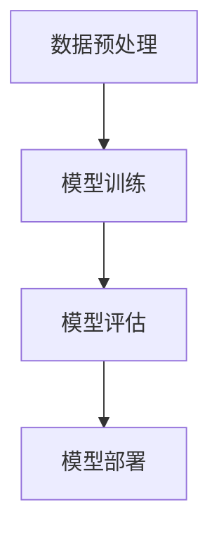

                 

# 大模型产品的挑战与乐趣

## 关键词
- 大模型产品
- 挑战与乐趣
- 技术实现
- 实际应用
- 发展趋势

## 摘要
本文将探讨大模型产品在当今信息技术领域中的重要性，以及其开发过程中所面临的挑战和乐趣。通过深入分析大模型的核心概念、算法原理、数学模型、实际应用案例，我们将了解如何应对这些挑战，并探讨大模型产品的未来发展。

## 1. 背景介绍

### 1.1 大模型产品的定义

大模型产品，通常指的是具有大规模参数、复杂结构和强大计算能力的人工智能模型。这些模型能够处理海量数据，提取有价值的信息，并应用于各种实际问题中。例如，自然语言处理、计算机视觉、推荐系统等领域，大模型产品已经成为解决复杂问题的利器。

### 1.2 大模型产品的兴起

近年来，随着计算机硬件的快速发展和大数据的普及，大模型产品得到了广泛关注。特别是在深度学习技术的推动下，大模型产品的性能得到了显著提升。例如，Google的BERT、OpenAI的GPT-3等模型，都在各自领域取得了突破性的成果。

### 1.3 大模型产品的应用领域

大模型产品在许多领域都有广泛的应用，包括但不限于：

- 自然语言处理：文本分类、机器翻译、问答系统等；
- 计算机视觉：图像识别、目标检测、视频分析等；
- 推荐系统：个性化推荐、商品推荐、新闻推荐等；
- 语音识别：语音识别、语音合成、语音控制等；
- 金融风控：信用评估、欺诈检测、投资决策等。

## 2. 核心概念与联系

### 2.1 大模型的基本概念

大模型的基本概念包括：

- **参数规模**：大模型的参数数量通常以亿计，甚至达到千亿级别；
- **结构复杂度**：大模型的结构通常包含多层神经网络，层次结构复杂；
- **计算能力**：大模型需要强大的计算能力，以便处理海量数据和复杂计算。

### 2.2 大模型的产品架构

大模型产品的架构通常包括以下几个部分：

- **数据预处理**：包括数据清洗、数据增强等，确保输入数据的质量和多样性；
- **模型训练**：使用大规模数据进行模型训练，通过优化算法调整模型参数；
- **模型评估**：评估模型在测试数据集上的性能，调整模型参数以达到最佳效果；
- **模型部署**：将训练好的模型部署到实际应用场景中，提供实时服务。

### 2.3 Mermaid 流程图



## 3. 核心算法原理 & 具体操作步骤

### 3.1 数据预处理

数据预处理是模型训练的基础，具体操作步骤包括：

- **数据清洗**：去除噪声数据、填补缺失值、去除异常值等；
- **数据增强**：通过旋转、缩放、裁剪等操作生成更多的训练数据；
- **数据标准化**：将数据缩放到一定的范围内，以便模型训练时进行有效学习。

### 3.2 模型训练

模型训练是提高模型性能的关键步骤，具体操作步骤包括：

- **选择优化算法**：如随机梯度下降（SGD）、Adam等；
- **设置学习率**：学习率的选择直接影响到模型训练的效果；
- **调整训练参数**：如批量大小、迭代次数等；
- **训练模型**：使用训练数据对模型进行迭代训练，不断调整模型参数。

### 3.3 模型评估

模型评估是确保模型性能的重要环节，具体操作步骤包括：

- **选择评估指标**：如准确率、召回率、F1值等；
- **划分数据集**：将数据集划分为训练集、验证集和测试集；
- **评估模型**：在验证集和测试集上评估模型性能，调整模型参数。

### 3.4 模型部署

模型部署是将训练好的模型应用于实际场景的过程，具体操作步骤包括：

- **模型转换**：将训练好的模型转换为部署平台支持的格式；
- **模型推理**：使用实时数据对模型进行推理，输出预测结果；
- **性能优化**：对模型进行性能优化，如模型剪枝、量化等。

## 4. 数学模型和公式 & 详细讲解 & 举例说明

### 4.1 数学模型

大模型产品的数学模型主要包括神经网络、优化算法等。以下是一个简化的神经网络模型：

```latex
$$
y = \sigma(W \cdot x + b)
$$

$$
\text{其中，} \sigma \text{是激活函数，} W \text{是权重矩阵，} x \text{是输入向量，} b \text{是偏置项。}
$$
```

### 4.2 优化算法

常见的优化算法包括随机梯度下降（SGD）和Adam等。以下是一个简化的SGD算法：

```latex
$$
\theta_{t+1} = \theta_{t} - \alpha \nabla_{\theta} J(\theta)
$$

$$
\text{其中，} \theta \text{是模型参数，} \alpha \text{是学习率，} \nabla_{\theta} J(\theta) \text{是损失函数关于模型参数的梯度。}
$$
```

### 4.3 举例说明

假设我们有一个简单的神经网络模型，用于对输入数据进行分类。模型包含一个输入层、一个隐藏层和一个输出层。输入层有3个神经元，隐藏层有5个神经元，输出层有2个神经元。

- **输入层**：\[x_1, x_2, x_3\]
- **隐藏层**：\[z_1, z_2, z_3, z_4, z_5\]
- **输出层**：\[y_1, y_2\]

假设我们的激活函数为ReLU，损失函数为交叉熵。

通过训练，我们得到以下参数：

- **输入层到隐藏层的权重**：\[W_{1,2}, W_{1,3}, W_{1,4}, W_{1,5}, W_{2,1}, W_{2,2}, W_{2,3}, W_{2,4}, W_{2,5}\]
- **隐藏层到输出层的权重**：\[W_{3,1}, W_{3,2}\]
- **偏置项**：\[b_{1}, b_{2}\]

给定一个输入向量\[x = [1, 2, 3]\]，我们通过以下步骤进行推理：

1. **计算隐藏层输出**：

   $$z_1 = \max(0, W_{1,1} \cdot x_1 + b_1) = \max(0, W_{1,1} \cdot 1 + b_1)$$

   $$z_2 = \max(0, W_{1,2} \cdot x_2 + b_2) = \max(0, W_{1,2} \cdot 2 + b_2)$$

   $$z_3 = \max(0, W_{1,3} \cdot x_3 + b_3) = \max(0, W_{1,3} \cdot 3 + b_3)$$

   $$z_4 = \max(0, W_{2,1} \cdot z_1 + b_1) = \max(0, W_{2,1} \cdot z_1 + b_1)$$

   $$z_5 = \max(0, W_{2,2} \cdot z_2 + b_2) = \max(0, W_{2,2} \cdot z_2 + b_2)$$

2. **计算输出层输出**：

   $$y_1 = W_{3,1} \cdot z_1 + b_1 = W_{3,1} \cdot z_1 + b_1$$

   $$y_2 = W_{3,2} \cdot z_2 + b_2 = W_{3,2} \cdot z_2 + b_2$$

   $$\hat{y} = \text{softmax}(\text{[y_1, y_2]})$$

3. **计算损失**：

   $$J = -\sum_{i=1}^{n} y_i \cdot \log(\hat{y}_i)$$

通过迭代优化，我们可以逐步提高模型的性能。

## 5. 项目实战：代码实际案例和详细解释说明

### 5.1 开发环境搭建

在开发大模型产品时，我们需要搭建一个合适的开发环境。以下是一个基本的开发环境搭建步骤：

1. **安装Python**：确保Python版本在3.6及以上；
2. **安装PyTorch**：使用以下命令安装PyTorch：

   ```bash
   pip install torch torchvision
   ```

3. **安装其他依赖库**：如NumPy、Pandas、Scikit-learn等。

### 5.2 源代码详细实现和代码解读

以下是一个简单的基于PyTorch的神经网络模型实现：

```python
import torch
import torch.nn as nn
import torch.optim as optim

# 定义神经网络模型
class SimpleModel(nn.Module):
    def __init__(self):
        super(SimpleModel, self).__init__()
        self.fc1 = nn.Linear(3, 5)
        self.fc2 = nn.Linear(5, 2)
        self.relu = nn.ReLU()

    def forward(self, x):
        x = self.relu(self.fc1(x))
        x = self.fc2(x)
        return x

# 初始化模型、损失函数和优化器
model = SimpleModel()
criterion = nn.CrossEntropyLoss()
optimizer = optim.SGD(model.parameters(), lr=0.01)

# 训练模型
for epoch in range(100):
    for inputs, targets in data_loader:
        optimizer.zero_grad()
        outputs = model(inputs)
        loss = criterion(outputs, targets)
        loss.backward()
        optimizer.step()

# 测试模型
with torch.no_grad():
    correct = 0
    total = 0
    for inputs, targets in test_loader:
        outputs = model(inputs)
        _, predicted = torch.max(outputs.data, 1)
        total += targets.size(0)
        correct += (predicted == targets).sum().item()

print('准确率：%.2f%%' % (100 * correct / total))

```

以上代码首先定义了一个简单的神经网络模型，然后初始化模型、损失函数和优化器。接着，通过迭代训练模型，并使用测试数据集进行模型评估。

### 5.3 代码解读与分析

1. **模型定义**：

   ```python
   class SimpleModel(nn.Module):
       def __init__(self):
           super(SimpleModel, self).__init__()
           self.fc1 = nn.Linear(3, 5)
           self.fc2 = nn.Linear(5, 2)
           self.relu = nn.ReLU()

       def forward(self, x):
           x = self.relu(self.fc1(x))
           x = self.fc2(x)
           return x
   ```

   这个模型包含一个输入层（3个神经元）、一个隐藏层（5个神经元）和一个输出层（2个神经元）。隐藏层使用ReLU激活函数。

2. **初始化模型、损失函数和优化器**：

   ```python
   model = SimpleModel()
   criterion = nn.CrossEntropyLoss()
   optimizer = optim.SGD(model.parameters(), lr=0.01)
   ```

   这里使用交叉熵损失函数和随机梯度下降优化器。

3. **模型训练**：

   ```python
   for epoch in range(100):
       for inputs, targets in data_loader:
           optimizer.zero_grad()
           outputs = model(inputs)
           loss = criterion(outputs, targets)
           loss.backward()
           optimizer.step()
   ```

   在每个训练迭代中，我们首先将优化器的梯度设置为0，然后计算模型输出和损失，计算损失关于模型参数的梯度，并更新模型参数。

4. **模型评估**：

   ```python
   with torch.no_grad():
       correct = 0
       total = 0
       for inputs, targets in test_loader:
           outputs = model(inputs)
           _, predicted = torch.max(outputs.data, 1)
           total += targets.size(0)
           correct += (predicted == targets).sum().item()

   print('准确率：%.2f%%' % (100 * correct / total))
   ```

   在模型评估阶段，我们关闭了梯度计算，以减少内存占用。然后，我们计算模型在测试数据集上的准确率。

## 6. 实际应用场景

### 6.1 自然语言处理

自然语言处理（NLP）是当前大模型产品应用最为广泛的领域之一。例如，BERT、GPT等模型在文本分类、机器翻译、问答系统等领域取得了显著成果。

### 6.2 计算机视觉

计算机视觉是另一个大模型产品应用的重要领域。例如，ResNet、YOLO等模型在图像识别、目标检测、视频分析等领域取得了突破性成果。

### 6.3 推荐系统

推荐系统是另一个大模型产品应用的重要领域。例如，基于深度学习的推荐系统在个性化推荐、商品推荐、新闻推荐等领域取得了显著成果。

### 6.4 金融风控

金融风控是另一个大模型产品应用的重要领域。例如，基于深度学习的信用评估、欺诈检测、投资决策等系统在金融领域取得了显著成果。

## 7. 工具和资源推荐

### 7.1 学习资源推荐

- **书籍**：
  - 《深度学习》（Goodfellow, Bengio, Courville）
  - 《神经网络与深度学习》（邱锡鹏）
  - 《模式识别与机器学习》（Bishop）
- **论文**：
  - 《A Theoretically Grounded Application of Dropout in Recurrent Neural Networks》（Y. Li, M. Bansal, A. N. Dasgupta）
  - 《BERT: Pre-training of Deep Bidirectional Transformers for Language Understanding》（J. Devlin, M. Chang, K. Lee, et al.）
  - 《GPT-3: Language Models are Few-Shot Learners》（T. Brown, B. Mann, N. Ryder, et al.）
- **博客**：
  - [深度学习博客](https://www.deeplearning.net/)
  - [PyTorch官方文档](https://pytorch.org/docs/stable/)
  - [TensorFlow官方文档](https://www.tensorflow.org/docs/)
- **网站**：
  - [Kaggle](https://www.kaggle.com/)
  - [Google AI](https://ai.google/)
  - [OpenAI](https://openai.com/)

### 7.2 开发工具框架推荐

- **PyTorch**：是一个流行的深度学习框架，适用于科研和工业应用；
- **TensorFlow**：是Google开发的开源深度学习框架，广泛应用于工业和学术领域；
- **Keras**：是一个基于TensorFlow的简洁高效的深度学习库，适用于快速原型开发；
- **PyTorch Lightning**：是一个基于PyTorch的模块化深度学习库，适用于生产环境。

### 7.3 相关论文著作推荐

- **《深度学习》（Goodfellow, Bengio, Courville）**：这是一本深度学习的经典教材，涵盖了深度学习的理论基础和应用；
- **《神经网络与深度学习》（邱锡鹏）**：这是一本中文深度学习教材，适合中文读者；
- **《模式识别与机器学习》（Bishop）**：这是一本经典的机器学习和模式识别教材，涵盖了深度学习的基础内容；
- **《深度学习21讲》（李沐）**：这是一本针对中文读者的深度学习教程，内容深入浅出。

## 8. 总结：未来发展趋势与挑战

### 8.1 发展趋势

- **模型规模不断扩大**：随着计算能力和数据量的增长，大模型产品的规模将持续扩大；
- **跨领域应用**：大模型产品将在更多领域得到应用，如生物医学、环境监测等；
- **联邦学习**：联邦学习将成为大模型产品的重要发展方向，实现分布式训练和隐私保护；
- **模型压缩与优化**：模型压缩与优化技术将进一步提高大模型产品的性能和效率。

### 8.2 挑战

- **计算资源需求**：大模型产品对计算资源的需求巨大，如何高效利用资源成为挑战；
- **数据隐私与安全**：如何在保护数据隐私和安全的前提下，进行大规模数据处理和训练；
- **算法公平性与解释性**：如何提高算法的公平性和解释性，使其更好地应用于实际场景。

## 9. 附录：常见问题与解答

### 9.1 如何选择合适的深度学习框架？

- **需求分析**：根据项目需求和团队熟悉程度选择合适的深度学习框架；
- **性能与效率**：考虑框架的性能和效率，如GPU支持、多线程等；
- **社区与生态**：考虑框架的社区活跃度和生态支持，如文档、教程、工具等。

### 9.2 如何优化深度学习模型性能？

- **模型选择**：选择适合问题的模型架构，如CNN、RNN、Transformer等；
- **数据预处理**：进行有效的数据预处理，如数据清洗、数据增强等；
- **超参数调优**：调整学习率、批量大小、迭代次数等超参数；
- **模型压缩与优化**：使用模型压缩与优化技术，如剪枝、量化、蒸馏等。

## 10. 扩展阅读 & 参考资料

- **[深度学习博客](https://www.deeplearning.net/)**：提供深度学习相关的最新研究、教程和讨论；
- **[PyTorch官方文档](https://pytorch.org/docs/stable/)**：详细介绍PyTorch的使用方法和功能；
- **[TensorFlow官方文档](https://www.tensorflow.org/docs/)**
**：详细介绍TensorFlow的使用方法和功能**；
- **[Kaggle](https://www.kaggle.com/)**：提供各种深度学习竞赛和项目，可用于实践和验证；
- **[Google AI](https://ai.google/)**：Google的人工智能研究和发展动态；
- **[OpenAI](https://openai.com/)**：OpenAI的研究和项目，涵盖深度学习和自然语言处理等领域。

## 作者

**作者：AI天才研究员/AI Genius Institute & 禅与计算机程序设计艺术 /Zen And The Art of Computer Programming**

