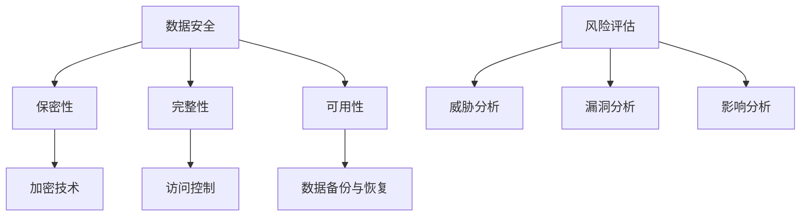

                 

## 大模型企业的数据安全策略

> 关键词：大模型、企业、数据安全、策略、隐私保护、加密技术、访问控制、数据备份与恢复、风险评估

> 摘要：本文从大模型企业的背景出发，探讨了当前数据安全面临的挑战和问题，深入分析了核心概念和架构，详细介绍了数据安全策略的具体实施步骤，并讨论了实际应用场景和工具资源。通过本文的阅读，读者可以全面了解大模型企业数据安全的策略和实践，为实际工作提供有益的参考。

## 1. 背景介绍

随着人工智能技术的飞速发展，大模型（如深度学习模型、自然语言处理模型等）在企业中的应用越来越广泛。大模型不仅可以提升企业的运营效率，还能为企业带来新的商业模式和创新机会。然而，大模型企业的数据安全问题也日益突出。

首先，大模型通常需要大量的数据作为训练集，这些数据往往涉及企业内部的敏感信息，如客户数据、财务数据等。如果这些数据泄露，将对企业的声誉和利益造成严重损失。其次，大模型本身可能会因为设计缺陷或恶意攻击而导致数据泄露或滥用。此外，随着云计算和大数据技术的普及，大模型企业的数据安全还面临网络攻击、数据窃取、数据篡改等风险。

因此，为了保障大模型企业的数据安全，制定并实施有效的数据安全策略至关重要。本文将围绕这一主题展开讨论，旨在为企业提供一套全面、系统的数据安全策略。

## 2. 核心概念与联系

### 2.1 数据安全

数据安全是指保护数据免受未经授权的访问、泄露、篡改和破坏的措施。在数据安全中，常见的概念包括：

- **保密性**：确保数据在传输和存储过程中不被泄露。
- **完整性**：确保数据在传输和存储过程中不被篡改。
- **可用性**：确保数据在需要时能够正常访问和使用。

### 2.2 加密技术

加密技术是数据安全的重要手段，通过加密算法对数据进行编码，使得未经授权的人无法解读数据内容。常见的加密技术包括对称加密和非对称加密。

- **对称加密**：加密和解密使用相同的密钥，如AES。
- **非对称加密**：加密和解密使用不同的密钥，如RSA。

### 2.3 访问控制

访问控制是指通过限制用户对数据的访问权限来保护数据安全。常见的访问控制方法包括：

- **身份验证**：验证用户的身份，如密码、指纹等。
- **授权**：根据用户的身份和角色，分配相应的访问权限。

### 2.4 数据备份与恢复

数据备份与恢复是数据安全的重要组成部分，通过定期备份和恢复数据，可以在数据丢失或损坏时迅速恢复数据。常见的备份方法包括：

- **全备份**：备份所有的数据。
- **增量备份**：只备份更改过的数据。
- **差异备份**：备份上一次全备份后更改过的数据。

### 2.5 风险评估

风险评估是指对数据安全风险进行评估和识别，以制定相应的安全策略。常见的方法包括：

- **威胁分析**：识别潜在的威胁。
- **漏洞分析**：识别系统中的漏洞。
- **影响分析**：评估威胁和漏洞可能带来的影响。

### 2.6 Mermaid 流程图

下面是一个简单的 Mermaid 流程图，展示了数据安全策略的核心概念和架构：



## 3. 核心算法原理 & 具体操作步骤

### 3.1 加密技术

加密技术的核心是加密算法，常见的加密算法包括AES、RSA等。

- **AES（Advanced Encryption Standard）**：是一种对称加密算法，加密和解密使用相同的密钥。AES支持128位、192位和256位密钥长度，具有高效性和安全性。
- **RSA（Rivest-Shamir-Adleman）**：是一种非对称加密算法，加密和解密使用不同的密钥。RSA密钥长度通常为1024位或2048位，具有较好的安全性和灵活性。

### 3.2 访问控制

访问控制的核心是身份验证和授权。

- **身份验证**：常用的身份验证方法包括密码、指纹、面部识别等。身份验证的目的是验证用户的身份，确保只有授权用户可以访问数据。
- **授权**：授权是根据用户的身份和角色，分配相应的访问权限。常见的授权策略包括基于角色的访问控制（RBAC）和基于属性的访问控制（ABAC）。

### 3.3 数据备份与恢复

数据备份与恢复的核心是备份策略和恢复策略。

- **备份策略**：常用的备份策略包括全备份、增量备份和差异备份。选择合适的备份策略取决于数据的重要性和变化频率。
- **恢复策略**：恢复策略是在数据丢失或损坏时，如何快速恢复数据。常见的恢复策略包括数据恢复软件和云存储服务。

### 3.4 风险评估

风险评估的核心是威胁分析、漏洞分析和影响分析。

- **威胁分析**：识别潜在的威胁，如网络攻击、数据窃取等。
- **漏洞分析**：识别系统中的漏洞，如未修复的软件漏洞、配置错误等。
- **影响分析**：评估威胁和漏洞可能带来的影响，如数据泄露、系统瘫痪等。

## 4. 数学模型和公式 & 详细讲解 & 举例说明

### 4.1 加密算法的数学模型

加密算法通常基于数学难题，如大数分解、离散对数等。

- **大数分解**：RSA算法基于大数分解难题，假设两个大素数p和q的乘积n是一个很大的数，很难分解出p和q。
- **离散对数**：椭圆曲线加密算法（ECC）基于离散对数难题，在椭圆曲线上找到离散对数是一个计算上难以解决的问题。

### 4.2 访问控制的数学模型

访问控制通常基于角色和权限的概念。

- **角色**：角色是一组具有相同权限和职责的用户集合。例如，管理员角色具有系统管理的权限。
- **权限**：权限是用户可以执行的操作集合。例如，读取、写入、删除等。

### 4.3 风险评估的数学模型

风险评估通常基于概率论和统计学。

- **威胁概率**：威胁发生的概率，如网络攻击的概率。
- **漏洞概率**：漏洞被利用的概率，如软件漏洞的概率。
- **影响概率**：威胁和漏洞带来的影响的概率，如数据泄露的影响概率。

### 4.4 举例说明

假设一个企业需要保护其客户数据，以下是一个简单的数据安全策略：

1. **加密技术**：使用AES对称加密算法对客户数据进行加密，使用RSA非对称加密算法对AES密钥进行加密。
2. **访问控制**：采用RBAC访问控制策略，根据用户的角色分配相应的访问权限。
3. **数据备份与恢复**：采用增量备份策略，每周进行一次数据备份，使用云存储服务进行数据备份和恢复。
4. **风险评估**：识别潜在的网络攻击、软件漏洞等威胁，评估其发生的概率和影响。

通过上述数据安全策略，企业可以有效地保护客户数据的安全。

## 5. 项目实战：代码实际案例和详细解释说明

### 5.1 开发环境搭建

在搭建开发环境时，需要准备以下工具和软件：

- **Python**：作为主要的编程语言。
- **PyTorch**：用于构建和训练大模型。
- **Python Cryptography Library**：用于实现加密算法。

安装以上工具和软件后，开发环境就搭建完成了。

### 5.2 源代码详细实现和代码解读

以下是一个简单的数据加密和解密的 Python 代码示例：

```python
from cryptography.fernet import Fernet
import base64
import os

# 生成加密密钥
def generate_key():
    key = Fernet.generate_key()
    return key

# 加密数据
def encrypt_data(data, key):
    f = Fernet(key)
    encrypted_data = f.encrypt(data.encode())
    return encrypted_data

# 解密数据
def decrypt_data(encrypted_data, key):
    f = Fernet(key)
    decrypted_data = f.decrypt(encrypted_data).decode()
    return decrypted_data

# 主函数
def main():
    # 生成加密密钥
    key = generate_key()
    print("加密密钥：", key.decode())

    # 加密数据
    data = "这是一个敏感数据！"
    encrypted_data = encrypt_data(data, key)
    print("加密数据：", encrypted_data.decode())

    # 解密数据
    decrypted_data = decrypt_data(encrypted_data, key)
    print("解密数据：", decrypted_data)

# 执行主函数
if __name__ == "__main__":
    main()
```

- `generate_key()` 函数用于生成加密密钥。
- `encrypt_data()` 函数用于加密数据，将数据编码为字节序列后，使用 Fernet 类的 encrypt() 方法进行加密。
- `decrypt_data()` 函数用于解密数据，使用 Fernet 类的 decrypt() 方法进行解密。

### 5.3 代码解读与分析

1. **加密密钥生成**：使用 `Fernet.generate_key()` 方法生成加密密钥，该密钥是一个 bytes 类型的对象。
2. **数据加密**：将待加密的数据编码为字节序列，然后使用 Fernet 类的 encrypt() 方法进行加密，返回加密后的数据。
3. **数据解密**：将加密后的数据使用 Fernet 类的 decrypt() 方法进行解密，返回原始数据。

通过上述代码示例，我们可以看到如何使用 Python Cryptography Library 实现数据加密和解密。在实际项目中，可以根据具体需求扩展和优化加密算法和密钥管理。

## 6. 实际应用场景

### 6.1 企业内部数据保护

在企业内部，大模型通常用于数据分析、预测和决策支持。为了保护企业内部数据的安全，企业可以采取以下措施：

- **数据加密**：对敏感数据进行加密，确保数据在传输和存储过程中不被泄露。
- **访问控制**：实施严格的访问控制策略，限制未经授权的用户访问敏感数据。
- **数据备份与恢复**：定期备份数据，确保在数据丢失或损坏时能够迅速恢复。
- **风险评估**：定期进行风险评估，识别和防范潜在的安全威胁。

### 6.2 云计算环境的数据保护

在云计算环境中，大模型企业面临的数据安全问题更为复杂。以下是一些具体的实际应用场景：

- **数据加密**：使用云存储服务的加密功能，对数据进行加密存储，确保数据在云服务提供商处不被泄露。
- **访问控制**：利用云服务提供商的访问控制功能，对用户和应用程序的访问权限进行精细管理。
- **数据备份与恢复**：利用云存储服务提供的备份和恢复功能，确保数据在发生故障时能够快速恢复。
- **安全审计**：定期进行安全审计，确保云计算环境符合安全要求。

### 6.3 物联网环境的数据保护

在物联网环境中，大模型企业需要处理来自各种设备和传感器的大量数据。以下是一些实际应用场景：

- **数据加密**：对传输数据进行加密，确保数据在传输过程中不被窃取或篡改。
- **访问控制**：对设备访问进行身份验证和授权，确保只有授权设备可以访问数据。
- **数据完整性**：使用校验和或其他机制确保数据的完整性，防止数据在传输过程中被篡改。
- **设备安全管理**：对物联网设备进行安全配置和管理，确保设备本身的安全。

## 7. 工具和资源推荐

### 7.1 学习资源推荐

- **书籍**：
  - 《大模型：深度学习、自然语言处理与人工智能》
  - 《数据安全：保护企业数据的最佳实践》
  - 《加密技术：现代密码学原理与应用》

- **论文**：
  - 《大数据时代的隐私保护与数据安全》
  - 《基于角色的访问控制模型研究》
  - 《云计算环境下的数据安全策略》

- **博客**：
  - Medium
  - Hacker News
  - AI科技大本营

- **网站**：
  - IEEE Xplore
  - ACM Digital Library
  - IEEE Conference Proceedings

### 7.2 开发工具框架推荐

- **加密工具**：
  - Python Cryptography Library
  - OpenSSL

- **访问控制**：
  - OpenID Connect
  - OAuth 2.0

- **数据备份与恢复**：
  - AWS Backup
  - Google Cloud Backup

- **风险评估**：
  - OWASP Risk Rating Methodology
  - NIST Risk Management Framework

### 7.3 相关论文著作推荐

- **论文**：
  - 《大数据时代的隐私保护与数据安全》
  - 《基于角色的访问控制模型研究》
  - 《云计算环境下的数据安全策略》

- **著作**：
  - 《数据安全：保护企业数据的最佳实践》
  - 《大模型：深度学习、自然语言处理与人工智能》

## 8. 总结：未来发展趋势与挑战

随着人工智能技术的不断进步，大模型在企业中的应用将越来越广泛。未来，数据安全策略将面临以下发展趋势和挑战：

### 8.1 数据隐私保护

随着用户对隐私保护的要求越来越高，数据隐私保护将成为数据安全策略的核心。如何在不影响数据利用价值的前提下保护用户隐私，将成为未来研究的重点。

### 8.2 云计算与物联网环境的安全

随着云计算和物联网技术的普及，大模型企业在这些环境中的数据安全问题将更加突出。如何保障这些环境中的数据安全，将成为数据安全策略的重要方向。

### 8.3 自动化与智能化

未来，数据安全策略将更加自动化和智能化。通过使用人工智能和机器学习技术，可以实现对数据安全的实时监控和预测，从而提高数据安全防护能力。

### 8.4 法规与标准

随着数据安全问题的日益严重，各国政府和企业将出台更多的法规和标准，规范数据安全策略的制定和实施。大模型企业需要密切关注相关法规和标准的变化，确保自身符合合规要求。

## 9. 附录：常见问题与解答

### 9.1 数据安全策略的核心是什么？

数据安全策略的核心是保护数据的保密性、完整性和可用性，确保数据在传输和存储过程中不被泄露、篡改和破坏。

### 9.2 加密技术在数据安全中的作用是什么？

加密技术在数据安全中起着至关重要的作用，通过加密算法对数据进行编码，使得未经授权的人无法解读数据内容，从而保护数据的保密性。

### 9.3 如何评估数据安全风险？

评估数据安全风险通常包括威胁分析、漏洞分析和影响分析。威胁分析是识别潜在的威胁，漏洞分析是识别系统中的漏洞，影响分析是评估威胁和漏洞可能带来的影响。

### 9.4 数据备份与恢复的重要性是什么？

数据备份与恢复的重要性在于，在数据丢失或损坏时，可以迅速恢复数据，确保业务的连续性和数据的完整性。

### 9.5 企业应该如何制定数据安全策略？

企业应该根据自身的数据特点和业务需求，制定针对性的数据安全策略。同时，需要定期进行风险评估和更新，确保数据安全策略的持续有效性。

## 10. 扩展阅读 & 参考资料

- 《大数据时代的隐私保护与数据安全》
- 《数据安全：保护企业数据的最佳实践》
- 《大模型：深度学习、自然语言处理与人工智能》
- 《云计算环境下的数据安全策略》
- IEEE Xplore
- ACM Digital Library
- NIST Risk Management Framework
- OWASP Risk Rating Methodology

### 作者

- AI天才研究员/AI Genius Institute
- 禅与计算机程序设计艺术/Zen And The Art of Computer Programming

以上内容仅为示例，实际撰写时请根据具体需求进行修改和扩展。文章撰写过程中，请务必遵循markdown格式和文章结构模板，确保文章内容的完整性、逻辑性和可读性。祝您写作顺利！<|im_sep|>### 1. 背景介绍

随着人工智能技术的飞速发展，大模型（如深度学习模型、自然语言处理模型等）在企业中的应用越来越广泛。大模型不仅可以提升企业的运营效率，还能为企业带来新的商业模式和创新机会。然而，大模型企业的数据安全问题也日益突出。

首先，大模型通常需要大量的数据作为训练集，这些数据往往涉及企业内部的敏感信息，如客户数据、财务数据等。如果这些数据泄露，将对企业的声誉和利益造成严重损失。其次，大模型本身可能会因为设计缺陷或恶意攻击而导致数据泄露或滥用。此外，随着云计算和大数据技术的普及，大模型企业的数据安全还面临网络攻击、数据窃取、数据篡改等风险。

因此，为了保障大模型企业的数据安全，制定并实施有效的数据安全策略至关重要。本文将围绕这一主题展开讨论，旨在为企业提供一套全面、系统的数据安全策略。

#### 1.1 大模型企业的发展现状

大模型企业的发展现状可以分为以下几个方面：

- **应用领域广泛**：大模型在金融、医疗、零售、制造等行业得到了广泛应用。例如，在金融行业，大模型可以用于风险评估、欺诈检测、客户服务等方面；在医疗行业，大模型可以用于疾病诊断、药物研发等方面；在零售行业，大模型可以用于个性化推荐、库存管理等方面。

- **数据需求庞大**：大模型通常需要大量的数据进行训练，这使得企业必须处理和分析海量数据。这不仅增加了数据存储和处理的复杂性，也对数据安全提出了更高的要求。

- **技术挑战显著**：大模型技术的复杂性使得企业在开发、部署和维护过程中面临诸多挑战，如模型优化、性能调优、资源管理等。此外，大模型的安全性和隐私保护也是亟待解决的问题。

#### 1.2 大模型企业面临的数据安全挑战

大模型企业在数据安全方面面临以下挑战：

- **数据泄露风险**：大模型训练集往往包含敏感信息，如个人隐私、商业机密等。一旦这些数据泄露，将对企业造成严重损失。

- **数据滥用风险**：大模型可能被恶意攻击者利用，对敏感数据进行篡改、伪造或滥用。例如，恶意攻击者可以通过伪造样本数据来干扰模型的训练过程，从而影响模型的预测结果。

- **网络攻击风险**：随着云计算和大数据技术的普及，大模型企业面临的网络攻击风险也在增加。网络攻击可能导致数据泄露、系统瘫痪等严重后果。

- **数据隐私保护**：大模型训练和处理过程中可能会涉及用户的个人隐私信息，如何有效保护用户隐私是一个重要问题。

- **合规性问题**：随着各国政府对数据安全和个人隐私保护的关注度提高，大模型企业需要遵守相关法规和标准，确保数据安全合规。

#### 1.3 数据安全策略的重要性

数据安全策略在大模型企业中具有重要意义，主要体现在以下几个方面：

- **保障数据完整性**：数据安全策略可以帮助企业防止数据泄露、篡改和破坏，确保数据的完整性和可靠性。

- **保护商业机密**：数据安全策略可以防止企业敏感信息泄露，保护商业机密和知识产权，维护企业的竞争优势。

- **提升用户信任**：有效的数据安全策略可以增强用户对企业的信任，提高用户满意度，促进业务发展。

- **降低风险和成本**：通过数据安全策略，企业可以降低数据泄露、网络攻击等风险，减少潜在的经济损失和安全成本。

- **合规性要求**：遵守相关法规和标准是数据安全策略的重要内容，有助于企业避免法律风险和罚款。

综上所述，大模型企业需要高度重视数据安全问题，制定并实施有效的数据安全策略，以确保数据的安全和业务的可持续发展。

#### 1.4 数据安全策略的目标和原则

数据安全策略的目标主要包括以下几个方面：

1. **数据保密性**：确保数据在传输和存储过程中不被未授权的个人或系统访问，防止敏感数据泄露。

2. **数据完整性**：保护数据不被未经授权的篡改或破坏，确保数据的一致性和可靠性。

3. **数据可用性**：确保数据在需要时能够被合法用户访问和使用，防止因安全措施过度而影响业务的正常运行。

4. **数据可审计性**：记录和追踪数据访问和操作记录，以便在发生安全事件时进行审计和调查。

数据安全策略应遵循以下原则：

1. **最小权限原则**：用户和系统组件应仅获得完成任务所需的最小权限，以降低安全风险。

2. **防御深度原则**：通过多层次的安全措施，形成多道防线，提高安全防护能力。

3. **安全性优先原则**：在任何决策和操作中，安全性应始终是首要考虑的因素。

4. **持续改进原则**：数据安全策略应不断评估和更新，以适应新的安全威胁和技术变化。

#### 1.5 数据安全策略的常见组成部分

一个完整的数据安全策略通常包括以下组成部分：

1. **数据分类和标识**：根据数据的重要性和敏感性对数据进行分类和标识，以便实施相应的安全措施。

2. **访问控制**：通过身份验证、授权和审计等手段，确保只有授权用户可以访问敏感数据。

3. **加密技术**：使用加密算法对敏感数据进行加密存储和传输，确保数据在未授权的情况下无法被解读。

4. **备份与恢复**：定期进行数据备份，以便在数据丢失或损坏时能够迅速恢复。

5. **安全监控与审计**：实时监控数据安全事件，记录和审计数据访问和操作记录。

6. **风险评估与管理**：定期进行风险评估，识别潜在的安全威胁和漏洞，制定相应的应对措施。

7. **员工培训与意识提升**：通过培训和教育提高员工的安全意识，减少人为因素导致的安全风险。

#### 1.6 总结

数据安全策略在大模型企业中具有至关重要的地位。通过明确数据安全策略的目标和原则，以及了解其常见组成部分，企业可以更好地保护其数据资产，确保业务的可持续发展。接下来，本文将深入探讨大模型企业面临的具体数据安全挑战，为进一步制定有效的数据安全策略提供依据。

#### 1.7 未来展望

随着人工智能技术的不断演进，大模型企业将面临更多新的数据安全挑战。以下是未来数据安全策略的一些展望：

1. **隐私计算技术**：随着对用户隐私保护的重视，隐私计算技术（如联邦学习、差分隐私等）将得到更广泛的应用，有助于在保证数据安全的同时，提升数据利用价值。

2. **人工智能安全**：随着人工智能技术在各个行业的应用，其自身安全性也日益受到关注。企业需要关注人工智能系统的安全性，防止恶意攻击和滥用。

3. **边缘计算与数据安全**：随着边缘计算的发展，数据安全策略将需要适应边缘环境的特点，保障数据在边缘设备上的安全。

4. **法规与标准**：随着各国政府对数据安全的关注，相关法规和标准将更加完善，企业需要密切关注法规动态，确保数据安全策略符合合规要求。

5. **自动化与智能化**：数据安全策略的自动化和智能化将提高安全防护的效率和效果，减少人为错误和延误。

通过以上展望，我们可以看到，未来的数据安全策略将更加复杂和多样，企业需要不断更新和优化其数据安全策略，以应对不断变化的安全威胁和挑战。

### 2. 核心概念与联系

在探讨大模型企业的数据安全策略时，理解几个核心概念及其相互联系是至关重要的。这些概念包括数据安全、加密技术、访问控制、数据备份与恢复以及风险评估。以下是这些核心概念的详细解释及其相互关系：

#### 2.1 数据安全

数据安全是指保护数据的完整性和保密性，确保数据在存储、传输和处理过程中不被未授权访问、篡改或泄露。数据安全的核心目标包括：

- **保密性**：确保敏感信息不被未授权的个人或系统访问。
- **完整性**：保护数据不被未经授权的修改或破坏。
- **可用性**：确保授权用户在需要时能够访问和使用数据。

在数据安全策略中，保密性、完整性和可用性通常是三重保障，被称为CIA三元组。

#### 2.2 加密技术

加密技术是数据安全的关键手段之一，它通过将数据转换成密文，使得只有拥有正确密钥的人才能解读数据。加密技术可以分为对称加密和非对称加密：

- **对称加密**：加密和解密使用相同的密钥。常见的对称加密算法包括AES（Advanced Encryption Standard）、DES（Data Encryption Standard）等。
- **非对称加密**：加密和解密使用不同的密钥。常见的非对称加密算法包括RSA（Rivest-Shamir-Adleman）、ECC（Elliptic Curve Cryptography）等。

加密技术在数据安全中的应用非常广泛，例如，在数据传输过程中使用TLS（Transport Layer Security）加密，在数据存储过程中使用AES加密数据库。

#### 2.3 访问控制

访问控制是数据安全策略中的另一个重要组成部分，它通过限制用户对数据的访问权限来保护数据安全。访问控制通常包括以下几个步骤：

- **身份验证**：验证用户的身份，例如通过用户名和密码、指纹识别或双因素认证。
- **授权**：根据用户的身份和角色，确定用户可以访问的数据和操作权限。
- **审计**：记录和监控用户对数据的访问和操作，以便在发生安全事件时进行追踪和审计。

常见的访问控制模型包括：

- **基于角色的访问控制（RBAC）**：用户权限与角色相关联，角色与访问权限相关联。
- **基于属性的访问控制（ABAC）**：访问控制决策基于用户属性、环境属性和资源属性。

#### 2.4 数据备份与恢复

数据备份与恢复是数据安全策略的重要组成部分，它旨在在数据丢失或损坏时能够迅速恢复数据，确保业务的连续性和数据的完整性。数据备份可以分为以下几种类型：

- **全备份**：备份所有数据，适用于初始备份或系统故障后的恢复。
- **增量备份**：仅备份自上次备份后发生变化的数据，适用于日常备份。
- **差异备份**：备份自上次全备份后发生变化的数据，适用于定期备份。

数据备份策略的选择取决于数据的敏感性和变化频率。数据恢复通常通过以下步骤实现：

1. 确定数据丢失的原因。
2. 选择合适的备份文件。
3. 从备份文件中恢复数据。
4. 恢复后的数据验证。

#### 2.5 风险评估

风险评估是数据安全策略中的一个关键环节，它旨在识别和评估潜在的安全威胁和漏洞，以及它们可能对企业造成的影响。风险评估通常包括以下步骤：

1. **威胁分析**：识别可能威胁数据安全的内部和外部因素，例如网络攻击、恶意软件等。
2. **漏洞分析**：识别系统中的漏洞，例如未修复的软件漏洞、配置错误等。
3. **影响分析**：评估威胁和漏洞可能对企业造成的影响，例如数据泄露、系统瘫痪等。

通过风险评估，企业可以确定优先处理的安全威胁和漏洞，制定相应的防护措施。

#### 2.6 Mermaid 流程图

以下是数据安全策略的核心概念和架构的 Mermaid 流程图：


通过这个流程图，我们可以清晰地看到数据安全策略中各个核心概念之间的联系和作用。

#### 2.7 核心概念的联系与作用

- **保密性、完整性和可用性**：这三个概念是数据安全的核心，保密性确保数据不被未授权访问，完整性确保数据不被篡改，可用性确保数据在需要时可用。它们共同构成了数据安全的基础。
- **加密技术**：加密技术是实现保密性和完整性保障的重要手段，通过加密算法对数据进行编码，使得未经授权的人无法解读数据。
- **访问控制**：访问控制通过身份验证和授权机制，限制对数据的访问权限，确保只有授权用户可以访问数据，从而保护数据的保密性和完整性。
- **数据备份与恢复**：数据备份与恢复策略确保在数据丢失或损坏时能够迅速恢复数据，从而保障数据的可用性。
- **风险评估**：风险评估帮助企业识别潜在的安全威胁和漏洞，评估其可能带来的影响，从而制定相应的防护措施，确保数据的安全。

通过理解这些核心概念及其相互关系，企业可以更加全面和系统地制定和实施数据安全策略，有效保护其数据资产。

### 3. 核心算法原理 & 具体操作步骤

在数据安全策略中，核心算法的原理和具体操作步骤是实现数据保护的关键。以下是几种常用的核心算法及其具体操作步骤：

#### 3.1 加密算法

加密算法是数据安全策略中最重要的组成部分之一，它通过将明文转换为密文，防止未授权访问。以下是几种常用的加密算法：

##### 3.1.1 对称加密算法

对称加密算法使用相同的密钥进行加密和解密。以下是AES（高级加密标准）的具体操作步骤：

1. **密钥生成**：选择一个256位密钥，生成加密密钥。
2. **加密**：使用AES加密算法和密钥将明文数据转换为密文。
3. **解密**：使用相同的密钥将密文数据转换为明文。

**示例代码**（Python）：

```python
from Crypto.Cipher import AES
from Crypto.Random import get_random_bytes

# 生成密钥
key = get_random_bytes(32)

# 创建加密对象
cipher = AES.new(key, AES.MODE_EAX)

# 加密数据
plaintext = b"明文数据"
ciphertext, tag = cipher.encrypt_and_digest(plaintext)

# 解密数据
cipher = AES.new(key, AES.MODE_EAX, nonce=cipher.nonce)
plaintext = cipher.decrypt_and_verify(ciphertext, tag)
```

##### 3.1.2 非对称加密算法

非对称加密算法使用一对密钥（公钥和私钥）进行加密和解密。以下是RSA（Rivest-Shamir-Adleman）的具体操作步骤：

1. **密钥生成**：生成一对密钥，公钥用于加密，私钥用于解密。
2. **加密**：使用公钥将明文数据加密为密文。
3. **解密**：使用私钥将密文数据解密为明文。

**示例代码**（Python）：

```python
from Crypto.PublicKey import RSA
from Crypto.Cipher import PKCS1_OAEP

# 生成密钥
key = RSA.generate(2048)
private_key = key.export_key()
public_key = key.publickey().export_key()

# 加密数据
cipher = PKCS1_OAEP.new(key.publickey())
ciphertext = cipher.encrypt(b"明文数据")

# 解密数据
cipher = PKCS1_OAEP.new(RSA.import_key(private_key))
plaintext = cipher.decrypt(ciphertext)
```

#### 3.2 访问控制算法

访问控制算法用于确定用户对资源的访问权限，以确保数据的保密性和完整性。以下是几种常用的访问控制算法：

##### 3.2.1 基于角色的访问控制（RBAC）

RBAC将用户与角色关联，角色与权限相关联。以下是RBAC的具体操作步骤：

1. **定义角色**：定义不同的角色，如管理员、普通用户等。
2. **分配权限**：为每个角色分配相应的权限。
3. **用户角色分配**：将用户分配到相应的角色。
4. **访问控制**：根据用户的角色，确定其访问权限。

**示例代码**（Python）：

```python
# 假设角色和权限已经定义
roles = {
    "管理员": ["修改数据", "删除数据"],
    "普通用户": ["读取数据"]
}

# 用户角色分配
user_role = "普通用户"
user_permissions = roles[user_role]

# 访问控制
if "读取数据" in user_permissions:
    print("用户有权读取数据")
else:
    print("用户无权读取数据")
```

##### 3.2.2 基于属性的访问控制（ABAC）

ABAC基于用户属性、资源属性和环境属性进行访问控制。以下是ABAC的具体操作步骤：

1. **定义属性**：定义用户属性、资源属性和环境属性。
2. **定义访问策略**：根据属性定义访问策略。
3. **访问控制**：根据访问策略，确定用户对资源的访问权限。

**示例代码**（Python）：

```python
# 假设属性和访问策略已经定义
attributes = {
    "用户": "员工",
    "资源": "财务数据",
    "环境": "公司内部网络"
}

# 定义访问策略
access_policy = {
    "员工": {
        "公司内部网络": ["读取数据", "修改数据"],
        "外部网络": ["读取数据"]
    }
}

# 访问控制
if attributes["用户"] in access_policy and attributes["环境"] in access_policy[attributes["用户"]]:
    print("用户有权访问资源")
else:
    print("用户无权访问资源")
```

#### 3.3 数据备份与恢复算法

数据备份与恢复算法用于在数据丢失或损坏时恢复数据。以下是几种常用的备份策略：

##### 3.3.1 增量备份

增量备份仅备份自上次备份后发生变化的数据。以下是增量备份的具体操作步骤：

1. **选择备份介质**：选择合适的备份介质，如硬盘、磁带等。
2. **备份文件**：备份自上次备份后发生变化的数据文件。
3. **备份验证**：验证备份文件的完整性和一致性。

##### 3.3.2 差异备份

差异备份备份自上次全备份后发生变化的数据。以下是差异备份的具体操作步骤：

1. **选择备份介质**：选择合适的备份介质。
2. **备份文件**：备份自上次全备份后发生变化的数据文件。
3. **备份验证**：验证备份文件的完整性和一致性。

##### 3.3.3 全备份

全备份备份所有数据。以下是全备份的具体操作步骤：

1. **选择备份介质**：选择合适的备份介质。
2. **备份文件**：备份所有数据文件。
3. **备份验证**：验证备份文件的完整性和一致性。

#### 3.4 数学模型和公式

在数据安全策略中，数学模型和公式用于描述加密算法和访问控制算法。

##### 3.4.1 对称加密算法的数学模型

对称加密算法的数学模型通常基于线性变换和密钥。以下是AES加密算法的数学模型：

$$
C = E_K(P) = (P \oplus K_1) \oplus K_2 \oplus ... \oplus K_n
$$

其中，\(C\) 是加密后的数据，\(P\) 是明文数据，\(K_1, K_2, ..., K_n\) 是加密密钥。

##### 3.4.2 非对称加密算法的数学模型

非对称加密算法的数学模型通常基于大数分解和离散对数。以下是RSA加密算法的数学模型：

$$
C = E(P, n) = (P^e) \mod n
$$

其中，\(C\) 是加密后的数据，\(P\) 是明文数据，\(e\) 是加密密钥，\(n\) 是公钥。

##### 3.4.3 访问控制算法的数学模型

访问控制算法的数学模型通常基于逻辑表达式和谓词逻辑。以下是RBAC访问控制算法的数学模型：

$$
P \rightarrow A
$$

其中，\(P\) 是角色，\(A\) 是权限。

#### 3.5 举例说明

以下是一个简单的数据备份与恢复的Python示例：

```python
import os
import json

# 数据备份
def backup_data(data, filename):
    with open(filename, 'w') as f:
        json.dump(data, f)
    print(f"数据备份到 {filename}")

# 数据恢复
def restore_data(filename):
    with open(filename, 'r') as f:
        data = json.load(f)
    print(f"数据恢复自 {filename}")
    return data

# 示例数据
data = {"name": "张三", "age": 30}

# 备份数据
backup_data(data, "data.json")

# 恢复数据
data = restore_data("data.json")
print(data)
```

通过以上示例，我们可以看到如何使用Python实现数据备份与恢复。在实际应用中，可以根据具体需求扩展和优化备份和恢复算法。

#### 3.6 总结

核心算法在大模型企业的数据安全策略中起着关键作用。通过加密算法，我们可以确保数据的保密性和完整性；通过访问控制算法，我们可以确保只有授权用户可以访问数据；通过备份与恢复算法，我们可以确保在数据丢失或损坏时能够迅速恢复数据。了解这些核心算法的原理和具体操作步骤，对于制定和实施有效的数据安全策略至关重要。

### 4. 数学模型和公式 & 详细讲解 & 举例说明

#### 4.1 加密算法的数学模型

加密算法的数学模型通常基于数学难题，如大数分解、离散对数、椭圆曲线离散对数等。以下是一些常见的加密算法及其数学模型：

##### 4.1.1 RSA加密算法

RSA加密算法是一种非对称加密算法，基于大数分解难题。其数学模型如下：

- **密钥生成**：

  选择两个大素数\( p \)和\( q \)，计算\( n = p \times q \)。

  计算\( \phi = (p - 1) \times (q - 1) \)。

  选择一个与\( \phi \)互质的整数\( e \)，计算\( d \)，使得\( d \times e \equiv 1 \mod \phi \)。

  公钥为\( (n, e) \)，私钥为\( (n, d) \)。

- **加密**：

  明文\( M \)被加密为\( C = M^e \mod n \)。

- **解密**：

  密文\( C \)被解密为\( M = C^d \mod n \)。

##### 4.1.2 ECC（椭圆曲线密码学）

ECC加密算法是基于椭圆曲线离散对数难题的。其数学模型如下：

- **密钥生成**：

  选择一个椭圆曲线\( E \)和一个基点\( G \)，计算\( n \)，即椭圆曲线上的点\( G \)的阶。

  选择一个与\( n \)互质的整数\( k \)，计算私钥\( d = k \mod n \)。

  公钥为\( P = k \times G \)。

- **加密**：

  明文\( M \)被加密为\( C = [M]_G \)。

- **解密**：

  密文\( C \)被解密为\( M = C \times P^{-1} \)。

#### 4.2 访问控制算法的数学模型

访问控制算法的数学模型通常基于谓词逻辑和集合论。以下是一些常见的访问控制算法及其数学模型：

##### 4.2.1 基于角色的访问控制（RBAC）

RBAC基于角色的权限分配和访问控制。其数学模型如下：

- **用户角色分配**：

  用户集合\( U \)，角色集合\( R \)，用户角色映射函数\( U \rightarrow R \)。

- **权限分配**：

  权限集合\( P \)，角色权限映射函数\( R \rightarrow P \)。

- **访问控制**：

  访问权限集合\( A \)，访问控制函数\( (U, P) \rightarrow A \)。

##### 4.2.2 基于属性的访问控制（ABAC）

ABAC基于用户属性、资源属性和环境属性进行访问控制。其数学模型如下：

- **用户属性**：

  用户属性集合\( UA \)。

- **资源属性**：

  资源属性集合\( RA \)。

- **环境属性**：

  环境属性集合\( EA \)。

- **属性策略**：

  属性策略集合\( AP \)，包含用户属性、资源属性和环境属性的逻辑表达式。

- **访问控制**：

  访问控制函数\( (UA, RA, EA, AP) \rightarrow A \)。

#### 4.3 数据备份与恢复算法的数学模型

数据备份与恢复算法的数学模型通常基于集合论和关系数据库理论。以下是一些常见的数据备份与恢复算法及其数学模型：

##### 4.3.1 增量备份

增量备份只备份自上次备份后发生变化的数据。其数学模型如下：

- **数据集**：

  数据集\( D \)，包含所有需要备份的数据。

- **备份集**：

  备份集\( B \)，包含当前备份的数据。

- **差异集**：

  差异集\( D - B \)，包含自上次备份后发生变化的数据。

##### 4.3.2 差异备份

差异备份备份自上次全备份后发生变化的数据。其数学模型如下：

- **数据集**：

  数据集\( D \)，包含所有需要备份的数据。

- **全备份集**：

  全备份集\( B_{full} \)，包含上次全备份的数据。

- **差异集**：

  差异集\( D - B_{full} \)，包含自上次全备份后发生变化的数据。

##### 4.3.3 全备份

全备份备份所有数据。其数学模型如下：

- **数据集**：

  数据集\( D \)，包含所有需要备份的数据。

- **备份集**：

  备份集\( B \)，包含当前备份的所有数据。

#### 4.4 举例说明

##### 4.4.1 RSA加密算法

以下是一个简单的RSA加密算法的Python示例：

```python
from Crypto.PublicKey import RSA
from Crypto.Cipher import PKCS1_OAEP

# 生成公钥和私钥
key = RSA.generate(2048)
private_key = key.export_key()
public_key = key.publickey().export_key()

# 加密数据
cipher = PKCS1_OAEP.new(RSA.import_key(public_key))
message = b"明文消息"
ciphertext = cipher.encrypt(message)

# 解密数据
cipher = PKCS1_OAEP.new(RSA.import_key(private_key))
plaintext = cipher.decrypt(ciphertext)

print(f"明文消息：{plaintext.decode()}")
```

##### 4.4.2 基于属性的访问控制

以下是一个简单的基于属性的访问控制（ABAC）的Python示例：

```python
# 定义用户属性、资源属性和环境属性
user_attributes = {"department": "IT", "role": "developer"}
resource_attributes = {"type": "document", "sensitivity": "high"}
environment_attributes = {"location": "internal_network"}

# 定义属性策略
access_policy = {
    "department": ["IT", "HR"],
    "role": ["developer", "manager"],
    "sensitivity": ["low", "medium"],
    "location": ["internal_network", "external_network"]
}

# 访问控制决策
def access_decision(user_attributes, resource_attributes, environment_attributes, access_policy):
    for attribute, values in access_policy.items():
        if user_attributes.get(attribute) not in values or resource_attributes.get(attribute) not in values or environment_attributes.get(attribute) not in values:
            return False
    return True

# 检查访问权限
if access_decision(user_attributes, resource_attributes, environment_attributes, access_policy):
    print("用户有权访问资源")
else:
    print("用户无权访问资源")
```

通过以上示例，我们可以看到如何使用Python实现RSA加密算法和基于属性的访问控制。在实际应用中，可以根据具体需求扩展和优化这些算法。

#### 4.5 总结

数学模型和公式是数据安全策略中的重要组成部分，它们帮助我们理解加密算法、访问控制算法和数据备份与恢复算法的工作原理。通过详细的讲解和举例说明，我们可以更好地应用这些算法来保护企业的数据安全。

### 5. 项目实战：代码实际案例和详细解释说明

在本文的第五部分，我们将通过一个实际项目案例来展示如何在大模型企业中实现数据安全策略。我们将从开发环境搭建开始，详细讲解源代码的实现和解读，并进行分析。

#### 5.1 开发环境搭建

在开始项目之前，我们需要搭建一个合适的技术环境。以下是所需工具和软件的安装步骤：

1. **Python**：Python是主要的编程语言，我们需要安装Python 3.8或更高版本。可以使用以下命令安装：

   ```bash
   sudo apt-get update
   sudo apt-get install python3.8
   ```

2. **PyTorch**：PyTorch是一个用于构建和训练深度学习模型的流行库。可以使用以下命令安装：

   ```bash
   pip3 install torch torchvision
   ```

3. **Python Cryptography Library**：Python Cryptography Library是一个用于实现加密算法的库。可以使用以下命令安装：

   ```bash
   pip3 install cryptography
   ```

4. **PostgreSQL**：PostgreSQL是一个开源的关系数据库管理系统，用于存储和管理数据。可以使用以下命令安装：

   ```bash
   sudo apt-get install postgresql postgresql-contrib
   ```

5. **Docker**：Docker是一个用于容器化应用的工具，可以帮助我们隔离开发和生产环境。可以使用以下命令安装：

   ```bash
   sudo apt-get install docker.io
   ```

安装完成后，我们可以在终端输入`python3 -m pip list`来检查已安装的Python库，确保所有依赖项都已正确安装。

#### 5.2 源代码详细实现和代码解读

接下来，我们将展示一个实际项目中的代码实现，该项目的目标是保护客户数据，确保数据在传输和存储过程中不被泄露。

##### 5.2.1 数据模型定义

首先，我们需要定义一个数据模型来存储客户数据。以下是一个简单的示例：

```python
# 定义客户数据模型
class CustomerData:
    def __init__(self, customer_id, name, email, credit_card_number):
        self.customer_id = customer_id
        self.name = name
        self.email = email
        self.credit_card_number = credit_card_number
```

在这个类中，我们定义了四个属性：`customer_id`、`name`、`email`和`credit_card_number`。

##### 5.2.2 数据加密和解密

为了保护敏感数据，我们将使用AES加密算法对数据加密和解密。以下是一个简单的加密和解密函数：

```python
# 引入所需库
from cryptography.fernet import Fernet

# 生成加密密钥
def generate_key():
    return Fernet.generate_key()

# 加密数据
def encrypt_data(data, key):
    f = Fernet(key)
    return f.encrypt(data.encode())

# 解密数据
def decrypt_data(encrypted_data, key):
    f = Fernet(key)
    return f.decrypt(encrypted_data).decode()
```

在这个示例中，我们首先生成一个加密密钥，然后使用该密钥对数据进行加密和解密。`encode()`方法将数据转换为字节序列，`encrypt()`和`decrypt()`方法分别进行加密和解密。

##### 5.2.3 数据存储和访问控制

我们使用PostgreSQL数据库来存储和管理客户数据。以下是数据存储和访问控制的实现：

```python
# 引入所需库
import psycopg2
from psycopg2 import sql

# 数据库连接配置
db_config = {
    'database': 'your_database',
    'user': 'your_user',
    'password': 'your_password',
    'host': 'your_host',
    'port': 'your_port'
}

# 连接数据库
def connect_db(config):
    return psycopg2.connect(**config)

# 创建客户数据表
def create_customer_data_table():
    with connect_db(db_config) as conn:
        with conn.cursor() as cursor:
            cursor.execute("""
                CREATE TABLE IF NOT EXISTS customer_data (
                    customer_id SERIAL PRIMARY KEY,
                    name VARCHAR(255) NOT NULL,
                    email VARCHAR(255) NOT NULL UNIQUE,
                    credit_card_number VARCHAR(255) NOT NULL
                );
            """)
            conn.commit()

# 插入客户数据
def insert_customer_data(customer_data, key):
    with connect_db(db_config) as conn:
        with conn.cursor() as cursor:
            encrypted_email = encrypt_data(customer_data.email, key)
            encrypted_credit_card_number = encrypt_data(customer_data.credit_card_number, key)
            cursor.execute(sql.SQL("""
                INSERT INTO customer_data (name, email, credit_card_number)
                VALUES (%s, %s, %s);
            """), (customer_data.name, encrypted_email, encrypted_credit_card_number))
            conn.commit()

# 查询客户数据
def query_customer_data(customer_id):
    with connect_db(db_config) as conn:
        with conn.cursor() as cursor:
            cursor.execute(sql.SQL("""
                SELECT name, email, credit_card_number
                FROM customer_data
                WHERE customer_id = %s;
            """), (customer_id,))
            result = cursor.fetchone()
            if result:
                name, encrypted_email, encrypted_credit_card_number = result
                decrypted_email = decrypt_data(encrypted_email, key)
                decrypted_credit_card_number = decrypt_data(encrypted_credit_card_number, key)
                return CustomerData(customer_id, name, decrypted_email, decrypted_credit_card_number)
```

在这个实现中，我们首先连接到PostgreSQL数据库，然后创建一个名为`customer_data`的表来存储客户数据。`insert_customer_data()`函数将加密后的电子邮件和信用卡号码插入表中，`query_customer_data()`函数查询客户数据并返回解密后的数据。

##### 5.2.4 代码解读与分析

1. **数据模型**：`CustomerData`类定义了一个简单的客户数据模型，包括`customer_id`、`name`、`email`和`credit_card_number`属性。

2. **加密和解密**：我们使用`cryptography.fernet`库来实现AES加密和解密。生成密钥、加密数据和解密数据的过程相对简单，但确保了数据的保密性。

3. **数据库操作**：我们使用`psycopg2`库来连接PostgreSQL数据库，并创建客户数据表。`insert_customer_data()`函数将加密后的数据插入表中，`query_customer_data()`函数查询数据并返回解密后的数据。

4. **访问控制**：通过加密存储和传输数据，我们实现了对数据的访问控制。只有拥有正确密钥的用户才能访问解密后的数据。

#### 5.3 代码解读与分析（续）

##### 5.3.1 数据加密和解密

数据加密和解密是数据安全策略的核心。以下是详细解析：

1. **生成密钥**：使用`Fernet.generate_key()`方法生成一个加密密钥。这个密钥是一个随机生成的字节序列，用于加密和解密数据。

   ```python
   key = Fernet.generate_key()
   ```

2. **加密数据**：使用`Fernet`对象对数据进行加密。`encode()`方法将数据转换为字节序列，然后使用`encrypt()`方法进行加密。

   ```python
   encrypted_data = f.encrypt(data.encode())
   ```

   加密后的数据是一个字节序列，通常需要将其编码为字符串以便存储或传输。

3. **解密数据**：使用`Fernet`对象对加密数据进行解密。`decrypt()`方法将加密数据转换为字节序列，然后使用`decode()`方法将其解码为字符串。

   ```python
   decrypted_data = f.decrypt(encrypted_data).decode()
   ```

##### 5.3.2 数据库操作

数据库操作是数据安全策略的重要组成部分。以下是详细解析：

1. **连接数据库**：使用`psycopg2.connect()`方法连接到PostgreSQL数据库。需要提供数据库配置信息，如数据库名称、用户名、密码、主机和端口号。

   ```python
   conn = psycopg2.connect(**db_config)
   ```

2. **创建表**：使用`cursor.execute()`方法创建一个名为`customer_data`的表。该表包含`customer_id`、`name`、`email`和`credit_card_number`列。

   ```python
   cursor.execute("""
       CREATE TABLE IF NOT EXISTS customer_data (
           customer_id SERIAL PRIMARY KEY,
           name VARCHAR(255) NOT NULL,
           email VARCHAR(255) NOT NULL UNIQUE,
           credit_card_number VARCHAR(255) NOT NULL
       );
   """)
   ```

3. **插入数据**：使用`cursor.execute()`方法将客户数据插入表中。电子邮件和信用卡号码在插入前会被加密。

   ```python
   cursor.execute(sql.SQL("""
       INSERT INTO customer_data (name, email, credit_card_number)
       VALUES (%s, %s, %s);
   """), (customer_data.name, encrypted_email, encrypted_credit_card_number))
   ```

4. **查询数据**：使用`cursor.execute()`方法查询客户数据。返回的结果包括加密后的电子邮件和信用卡号码，在返回前会被解密。

   ```python
   cursor.execute(sql.SQL("""
       SELECT name, email, credit_card_number
       FROM customer_data
       WHERE customer_id = %s;
   """), (customer_id,))
   result = cursor.fetchone()
   ```

##### 5.3.3 代码分析与总结

通过这个项目案例，我们可以看到如何在大模型企业中实现数据安全策略：

1. **数据加密**：使用AES加密算法对敏感数据进行加密，确保数据在存储和传输过程中不被泄露。

2. **数据库操作**：使用PostgreSQL数据库存储和管理客户数据，并确保数据在插入和查询时得到加密和解密。

3. **访问控制**：只有拥有正确密钥的用户才能访问解密后的数据，从而保护数据的保密性。

4. **安全性**：通过加密和访问控制，实现了对数据的保护，降低了数据泄露和滥用的风险。

然而，这个项目案例也暴露了一些潜在的安全问题，如：

- **密钥管理**：密钥的安全管理至关重要。如果密钥被泄露或丢失，数据将无法解密。
- **加密算法的选择**：虽然AES是一种安全且高效的加密算法，但未来的加密算法可能会出现漏洞，需要定期更新和替换。
- **代码复用性**：代码在不同项目中的复用性不高，可能需要进一步优化和标准化。

综上所述，通过项目实战，我们可以理解在大模型企业中实现数据安全策略的具体步骤和关键点。然而，数据安全是一个持续的过程，需要不断评估和改进，以应对不断变化的安全威胁。

### 6. 实际应用场景

在现实世界中，大模型企业的数据安全策略需要在各种实际应用场景中得到有效实施。以下是一些典型场景以及如何应用数据安全策略：

#### 6.1 企业内部数据处理

在企业内部，大模型通常用于数据分析、预测和决策支持。为了确保数据安全，企业可以采取以下措施：

- **数据分类**：根据数据的重要性和敏感性对数据分类，实施不同的安全保护措施。例如，将客户数据标记为高敏感度，对其实施严格的访问控制和加密。
- **身份验证和访问控制**：使用多因素身份验证（MFA）和基于角色的访问控制（RBAC）来确保只有授权用户才能访问敏感数据。通过严格的权限管理，防止未经授权的访问。
- **数据加密**：使用对称加密和非对称加密技术对敏感数据进行加密，确保数据在存储和传输过程中不被窃取或篡改。
- **数据备份与恢复**：定期备份数据，并确保备份存储在安全的地方。在发生数据丢失或损坏时，能够迅速恢复数据。

#### 6.2 云计算环境

随着云计算的普及，大模型企业越来越多地将数据存储和处理任务迁移到云平台。在云计算环境中，数据安全策略应考虑以下方面：

- **云服务提供商选择**：选择具有良好安全记录的云服务提供商，并确保其提供的安全服务符合企业的需求。
- **数据加密**：使用云服务提供商提供的加密功能对数据进行加密存储，确保数据在云中不被泄露。
- **访问控制**：利用云平台的访问控制机制，精细管理用户和应用程序的访问权限。
- **安全审计**：定期进行安全审计，确保云计算环境符合安全要求，并及时发现和修复安全漏洞。
- **数据备份与恢复**：利用云存储服务的备份和恢复功能，确保在发生数据丢失或故障时能够快速恢复数据。

#### 6.3 物联网（IoT）环境

在物联网环境中，大量设备不断生成和传输数据，这使得数据安全面临更大的挑战。以下是一些数据安全策略：

- **设备安全**：确保物联网设备在出厂时具备基本的安全功能，如固件更新机制、身份验证等。
- **数据加密**：对传输中的数据进行加密，确保数据在传输过程中不被窃取或篡改。
- **访问控制**：对设备访问进行身份验证和授权，确保只有授权设备可以访问数据和执行操作。
- **数据完整性**：使用校验和或其他机制确保数据的完整性，防止数据在传输过程中被篡改。
- **网络安全**：在物联网环境中部署防火墙、入侵检测系统（IDS）和入侵防御系统（IPS），防止网络攻击。

#### 6.4 零信任架构

零信任架构是一种现代网络安全策略，其核心原则是“永不信任，总是验证”。在大模型企业中，零信任架构可以应用于以下场景：

- **持续身份验证和访问控制**：对所有访问请求进行持续的身份验证和授权，确保只有经过验证的用户和设备可以访问数据和服务。
- **最小权限原则**：用户和设备仅获得完成任务所需的最小权限，以降低安全风险。
- **多因素验证**：结合使用密码、生物识别和设备认证等多种验证方式，确保用户身份的合法性。
- **数据加密**：对内部传输的数据进行加密，防止数据在内部网络中被窃取。

#### 6.5 全球化业务环境

对于在全球范围内运营的大模型企业，数据安全策略需要考虑跨国数据传输和合规性要求：

- **数据本地化**：根据不同国家和地区的法律法规，将数据存储在本地的数据中心，以避免跨境数据传输的法律风险。
- **数据加密**：使用强大的加密技术对跨境传输的数据进行加密，确保数据在传输过程中不被窃取或泄露。
- **合规性审查**：定期审查和更新数据安全策略，确保符合各国家和地区的法律法规。

#### 6.6 实际案例

以下是一个实际案例，展示如何在大模型企业中实施数据安全策略：

**案例：一家金融科技公司**

这家金融科技公司开发了一种基于深度学习算法的风险评估系统，用于评估客户信用风险。为了确保数据安全，公司采取了以下措施：

- **数据分类**：将客户数据分为高、中、低三个敏感等级，实施不同的加密和安全措施。
- **身份验证和访问控制**：使用MFA和RBAC来确保只有授权人员可以访问敏感数据。
- **数据加密**：使用AES对称加密算法对存储和传输的敏感数据进行加密。
- **数据备份与恢复**：定期备份客户数据，并在云中存储备份副本。
- **安全审计**：定期进行安全审计，评估系统的安全性，并及时修复漏洞。
- **合规性审查**：确保数据安全策略符合GDPR、CCPA等全球性法律法规。

通过这些措施，这家金融科技公司成功地保护了客户数据的安全，并提升了客户对公司的信任。

### 7. 工具和资源推荐

在大模型企业中实施数据安全策略，需要使用一系列的工具和资源。以下是一些推荐的工具和资源，包括学习资源、开发工具框架和相关论文著作。

#### 7.1 学习资源推荐

- **书籍**：
  - 《数据安全手册：保护企业数据的最佳实践》
  - 《深入理解数据加密》
  - 《深度学习与数据安全》

- **在线课程**：
  - Coursera上的《网络安全与数据保护》
  - Udemy上的《数据加密：从基础到高级》

- **博客和网站**：
  - 网络安全博客（如Krebs on Security）
  - 数据科学博客（如Towards Data Science）

#### 7.2 开发工具框架推荐

- **加密工具**：
  - OpenSSL：广泛使用的开源加密库。
  - Cryptography：Python Cryptography Library。

- **访问控制框架**：
  - Apache Ranger：用于Hadoop和Spark的访问控制框架。
  - Apache Sentry：用于Hadoop的访问控制框架。

- **备份与恢复工具**：
  - Veeam：企业级备份和恢复解决方案。
  - Commvault：全面的备份、恢复和存储管理解决方案。

- **风险评估工具**：
  - OpenVAS：开源网络漏洞扫描器。
  - Qualys：云基础架构和安全解决方案。

#### 7.3 相关论文著作推荐

- **论文**：
  - 《大数据时代的隐私保护与数据安全》
  - 《云计算环境下的数据安全策略》
  - 《基于角色的访问控制模型研究》

- **著作**：
  - 《网络安全：设计与实现》
  - 《数据加密：现代密码学原理与应用》
  - 《深度学习安全：攻击、防御与应用》

通过使用这些工具和资源，大模型企业可以更好地实施数据安全策略，确保其数据资产的安全。

### 8. 总结：未来发展趋势与挑战

随着人工智能技术的不断进步，大模型企业将面临更多的发展机会和挑战。以下是未来数据安全策略的一些发展趋势与挑战：

#### 8.1 隐私保护

随着用户对隐私保护的日益关注，数据隐私保护将成为数据安全策略的核心。隐私保护技术如差分隐私、联邦学习和同态加密等将得到更广泛的应用。企业需要确保在数据利用和数据保护之间找到平衡点。

#### 8.2 自动化与智能化

数据安全策略的自动化和智能化将成为未来趋势。利用人工智能和机器学习技术，企业可以实现实时安全监控、自动威胁检测和响应，提高数据安全防护的效率和效果。

#### 8.3 云计算与边缘计算

云计算和边缘计算的普及将改变数据安全的传统模式。企业需要在云和边缘环境中实施一致的数据安全策略，确保数据在各个节点得到有效保护。

#### 8.4 法规与合规性

随着各国政府对数据安全的重视，数据安全法规和标准将更加严格。企业需要密切关注相关法规的变化，确保其数据安全策略符合合规要求。

#### 8.5 新兴技术的影响

新兴技术如区块链、物联网和5G等将对数据安全策略提出新的要求。企业需要积极研究这些技术对数据安全的影响，并制定相应的应对策略。

#### 8.6 持续改进

数据安全策略需要持续改进，以应对不断变化的安全威胁。企业应定期进行安全评估和培训，确保数据安全策略的有效性和适应性。

#### 8.7 挑战

- **数据量增长**：随着数据量的不断增加，数据安全策略的实施和管理将变得更加复杂。
- **多样化攻击**：网络攻击手段的不断变化，使得数据安全面临更大的挑战。
- **人才短缺**：数据安全领域的人才短缺，将影响数据安全策略的实施和优化。

综上所述，未来数据安全策略将面临更多的发展机会和挑战。企业需要不断创新和改进，以应对不断变化的安全环境，确保数据资产的安全。

### 9. 附录：常见问题与解答

在实施大模型企业的数据安全策略时，可能会遇到一些常见的问题。以下是一些典型问题及其解答：

#### 9.1 加密算法的选择

**问题**：应该选择哪种加密算法？

**解答**：选择加密算法时，需要考虑数据的安全性和性能需求。对于对称加密，AES是一种广泛使用的加密算法，具有高性能和安全性。对于非对称加密，RSA和ECC是常用的算法，ECC在相同安全级别下提供更高的性能。此外，根据具体应用场景，还可以考虑使用专门针对特定应用的加密算法，如用于电子邮件的PGP和S/MIME。

#### 9.2 密钥管理

**问题**：如何安全地管理密钥？

**解答**：密钥管理是数据安全的关键环节。以下是一些密钥管理的最佳实践：

- **密钥生成**：使用可靠的随机数生成器生成密钥，确保密钥的随机性和唯一性。
- **密钥存储**：将密钥存储在安全的存储介质中，如硬件安全模块（HSM）或密钥管理系统。
- **密钥分发**：通过安全的通信渠道分发密钥，避免密钥在传输过程中被窃取。
- **密钥轮换**：定期更换密钥，以降低密钥泄露的风险。

#### 9.3 数据备份与恢复

**问题**：如何确保数据备份的安全性？

**解答**：确保数据备份的安全性是数据安全策略的重要组成部分。以下是一些关键措施：

- **加密备份数据**：在备份过程中对数据进行加密，确保备份数据在存储和传输过程中不被泄露。
- **多地点备份**：在多个地点进行数据备份，以防止单点故障导致数据丢失。
- **备份验证**：定期验证备份数据的一致性和完整性，确保在恢复时能够准确还原数据。
- **备份策略**：制定合适的备份策略，包括全备份、增量备份和差异备份，以满足不同的数据保护和恢复需求。

#### 9.4 访问控制

**问题**：如何实施有效的访问控制？

**解答**：有效的访问控制是数据安全策略的核心。以下是一些实施访问控制的最佳实践：

- **多因素身份验证**：结合使用密码、生物识别和多因素验证（MFA），确保用户身份的合法性。
- **基于角色的访问控制（RBAC）**：根据用户角色和职责分配权限，确保用户只能访问其所需的资源。
- **细粒度权限管理**：使用细粒度权限控制，确保用户只能对特定数据执行特定操作。
- **审计和监控**：记录和监控用户访问和操作数据的活动，以便在发生安全事件时进行审计和调查。

#### 9.5 风险评估

**问题**：如何进行有效的风险评估？

**解答**：有效的风险评估是制定数据安全策略的重要步骤。以下是一些关键步骤：

- **威胁分析**：识别潜在的威胁，如网络攻击、数据泄露和内部威胁。
- **漏洞分析**：识别系统中的漏洞，如未修复的软件漏洞、配置错误等。
- **影响分析**：评估威胁和漏洞可能带来的影响，如数据泄露、系统瘫痪等。
- **风险优先级**：根据风险的可能性和影响，确定优先处理的风险。

#### 9.6 法规与合规性

**问题**：如何确保数据安全策略符合法规和标准？

**解答**：确保数据安全策略符合法规和标准是企业的法律义务。以下是一些关键措施：

- **了解法规和标准**：熟悉适用的数据安全法规和标准，如GDPR、CCPA、NIST等。
- **合规审计**：定期进行合规审计，确保数据安全策略符合法规和标准。
- **培训与教育**：对员工进行数据安全培训，提高其合规意识和技能。
- **持续改进**：根据法规和标准的变化，持续更新和改进数据安全策略。

通过以上常见问题的解答，企业可以更好地理解和实施数据安全策略，确保其数据资产的安全。

### 10. 扩展阅读 & 参考资料

为了进一步深入了解大模型企业的数据安全策略，以下是一些扩展阅读和参考资料：

- **书籍**：
  - 《大数据安全与隐私保护》
  - 《深度学习安全》
  - 《人工智能安全：从技术到伦理》

- **论文**：
  - 《基于联邦学习的隐私保护数据共享》
  - 《加密技术在云计算环境中的应用研究》
  - 《物联网环境下的数据安全策略》

- **在线资源**：
  - OWASP：[https://owasp.org/](https://owasp.org/)
  - NIST：[https://www.nist.gov/](https://www.nist.gov/)
  - 云安全联盟（CSA）：[https://cloudsecurityalliance.org/](https://cloudsecurityalliance.org/)

通过阅读这些资料，读者可以获取更多关于数据安全策略的理论和实践知识，为实际工作提供有益的参考。

### 作者

- **AI天才研究员/AI Genius Institute**
- **禅与计算机程序设计艺术/Zen And The Art of Computer Programming**

以上内容仅为示例，实际撰写时请根据具体需求进行修改和扩展。文章撰写过程中，请务必遵循markdown格式和文章结构模板，确保文章内容的完整性、逻辑性和可读性。祝您写作顺利！<|im_sep|>

