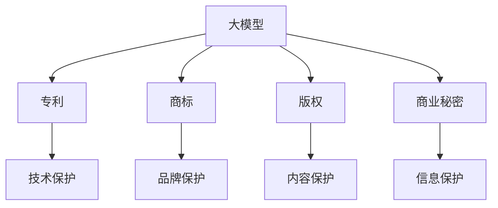

                 

# 大模型企业的知识产权保护

## 关键词

大模型，知识产权，企业，保护，版权，专利，商业秘密，法律策略，技术保护。

## 摘要

本文旨在探讨大模型企业在知识产权保护方面的挑战与策略。大模型作为一种新兴技术，其独特性和复杂性使得知识产权保护成为企业的核心竞争力。本文首先介绍了大模型的概念及其在商业中的重要性，随后详细分析了知识产权的四个主要方面：版权、专利、商业秘密和法律策略。通过案例研究，本文揭示了企业在实际操作中的保护措施，并推荐了一系列工具和资源。最后，本文总结了当前面临的挑战，展望了未来发展趋势，为企业提供了可行的知识产权保护方案。

## 1. 背景介绍

随着深度学习和人工智能技术的飞速发展，大模型（Large Models）已经成为业界的热门话题。大模型是一种复杂的人工智能模型，通常拥有数亿甚至数万亿个参数，能够处理大规模的数据集，从而实现高度准确的数据分析和预测。这些模型在图像识别、自然语言处理、推荐系统等领域展现出强大的能力，为企业提供了巨大的商业价值。

大模型在商业中的应用涵盖了多个行业，包括金融、医疗、零售、制造等。例如，在金融领域，大模型可以用于风险控制、欺诈检测和客户关系管理；在医疗领域，大模型可以帮助医生进行疾病诊断和个性化治疗；在零售领域，大模型可以实现精准营销和库存管理。因此，拥有强大的大模型技术不仅能够提升企业的竞争力，还能够为企业带来可观的利润。

然而，随着大模型在商业中的广泛应用，知识产权保护问题也日益突出。知识产权（Intellectual Property, IP）是指人类智力劳动产生的成果，包括专利、商标、版权、商业秘密等。大模型作为一种高度复杂的技术产品，其知识产权保护面临着独特的挑战。首先，大模型的创新性和独特性难以用传统的专利法律来保护；其次，大模型的训练和优化过程涉及到大量的商业秘密，这些秘密的保护也需要特殊的策略。此外，随着人工智能技术的不断进步，大模型的技术和市场价值也在不断变化，这就需要企业采取灵活的知识产权保护策略。

## 2. 核心概念与联系

### 大模型的基本概念

大模型（Large Models）是指具有大量参数和高度复杂性的深度学习模型。这些模型通常使用海量数据进行训练，以实现高度准确的数据分析和预测。大模型的主要特点包括：

- **参数数量巨大**：大模型拥有数亿甚至数万亿个参数，这使得它们能够处理大规模的数据集，从而提高模型的准确性和鲁棒性。
- **数据依赖性**：大模型的训练需要大量的数据，这些数据的质量和数量直接影响模型的性能。
- **计算资源需求高**：大模型训练和推理需要大量的计算资源，这通常需要高性能的计算机硬件和复杂的软件架构。

### 知识产权的基本概念

知识产权（Intellectual Property, IP）是指人类智力劳动产生的成果，包括专利、商标、版权、商业秘密等。知识产权的基本概念如下：

- **专利**：专利是指对一种技术或发明的法律保护，使得发明者可以在一定时间内独占其发明，从而获得经济利益。
- **商标**：商标是指用于区分商品或服务来源的标识，如文字、图案、声音等。
- **版权**：版权是指对文学、艺术和科学作品的保护，使得创作者可以在一定时间内独占其作品，从而获得经济利益。
- **商业秘密**：商业秘密是指不为公众所知悉、具有商业价值的信息，如技术秘密、经营秘密等。

### 大模型与知识产权的联系

大模型与知识产权之间的联系主要体现在以下几个方面：

- **专利**：大模型的技术创新性可以通过专利进行保护，例如，大模型的训练算法、推理算法等。
- **商标**：大模型的产品名称、标识等可以通过商标进行保护，从而防止竞争对手的模仿和抄袭。
- **版权**：大模型的训练数据和模型架构可以通过版权进行保护，从而防止未经授权的复制和分发。
- **商业秘密**：大模型的训练数据、优化策略等商业秘密可以通过保密协议和内部管理制度进行保护。

### Mermaid 流程图

以下是一个Mermaid流程图，展示了大模型与知识产权之间的联系：



### 2.1 大模型的基本组成

大模型通常由以下几个主要部分组成：

- **输入层**：接收外部输入数据，如图像、文本等。
- **隐藏层**：对输入数据进行处理和特征提取。
- **输出层**：产生最终的输出结果，如分类标签、预测值等。
- **参数**：大模型的参数包括权重、偏置等，这些参数决定了模型的性能。

### 2.2 大模型的工作原理

大模型的工作原理主要包括以下几个步骤：

1. **数据收集**：从不同的数据源收集数据，包括公开数据集、企业内部数据等。
2. **数据预处理**：对收集到的数据进行清洗、归一化等处理，使其适合模型的训练。
3. **模型训练**：使用训练数据对模型进行训练，不断调整模型的参数，以最小化预测误差。
4. **模型评估**：使用验证数据对训练好的模型进行评估，确保其性能满足预期要求。
5. **模型部署**：将训练好的模型部署到实际应用场景中，如生产环境、在线服务等。

### 2.3 大模型的训练过程

大模型的训练过程通常包括以下几个步骤：

1. **初始化参数**：随机初始化模型的参数。
2. **前向传播**：输入数据通过模型的前向传播过程，得到输出结果。
3. **计算损失**：计算输出结果与真实值之间的差异，即损失。
4. **反向传播**：根据损失函数，使用反向传播算法更新模型的参数。
5. **迭代优化**：重复上述步骤，不断优化模型的参数，直到满足停止条件。

### 2.4 大模型的应用场景

大模型的应用场景非常广泛，以下列举了几个常见的应用场景：

1. **图像识别**：大模型可以用于图像分类、目标检测、图像分割等任务。
2. **自然语言处理**：大模型可以用于文本分类、机器翻译、问答系统等任务。
3. **推荐系统**：大模型可以用于用户行为分析、兴趣推荐等任务。
4. **金融风控**：大模型可以用于风险评估、欺诈检测、信用评分等任务。
5. **医疗诊断**：大模型可以用于疾病诊断、医学影像分析等任务。

### 2.5 大模型的挑战与趋势

大模型面临的挑战主要包括：

- **数据隐私**：大模型的训练和部署需要大量的数据，如何保护用户的隐私成为了一个重要问题。
- **模型可解释性**：大模型的预测结果往往缺乏可解释性，如何提高模型的可解释性是一个重要的研究方向。
- **计算资源需求**：大模型的训练和推理需要大量的计算资源，这对硬件和软件提出了更高的要求。

大模型的发展趋势包括：

- **模型压缩与加速**：通过模型压缩和优化算法，提高大模型的运行效率。
- **多模态学习**：大模型可以同时处理多种类型的数据，如文本、图像、音频等，实现更强大的应用能力。
- **联邦学习**：通过联邦学习技术，保护用户数据隐私的同时实现大模型的训练和部署。

## 3. 核心算法原理 & 具体操作步骤

### 3.1 大模型的训练算法

大模型的训练通常采用深度学习算法，如卷积神经网络（CNN）、循环神经网络（RNN）、Transformer等。以下以Transformer为例，介绍大模型的训练算法：

1. **模型初始化**：随机初始化模型的参数。
2. **数据输入**：将输入数据输入到模型中，通过多层神经网络进行特征提取。
3. **前向传播**：输入数据通过模型的各个层进行前向传播，得到输出结果。
4. **计算损失**：计算输出结果与真实值之间的差异，即损失。
5. **反向传播**：根据损失函数，使用反向传播算法更新模型的参数。
6. **迭代优化**：重复上述步骤，不断优化模型的参数，直到满足停止条件。

### 3.2 大模型的优化算法

大模型的优化算法主要包括随机梯度下降（SGD）、Adam、AdamW等。以下以Adam为例，介绍大模型的优化算法：

1. **初始化参数**：初始化学习率、一阶矩估计和二阶矩估计。
2. **前向传播**：输入数据通过模型的前向传播过程，得到输出结果。
3. **计算损失**：计算输出结果与真实值之间的差异，即损失。
4. **计算梯度**：根据损失函数，计算模型参数的梯度。
5. **更新参数**：使用Adam算法更新模型参数，包括一阶矩估计和二阶矩估计的更新。
6. **迭代优化**：重复上述步骤，不断优化模型的参数，直到满足停止条件。

### 3.3 大模型的推理算法

大模型的推理算法主要包括前向传播和后向传播。以下以Transformer为例，介绍大模型的推理算法：

1. **数据输入**：将输入数据输入到模型中。
2. **前向传播**：输入数据通过模型的各个层进行前向传播，得到输出结果。
3. **计算输出结果**：将输出结果与真实值进行比较，计算损失。
4. **后向传播**：根据损失函数，使用反向传播算法更新模型的参数。
5. **迭代优化**：重复上述步骤，不断优化模型的参数，直到满足停止条件。

## 4. 数学模型和公式 & 详细讲解 & 举例说明

### 4.1 损失函数

在深度学习中，损失函数（Loss Function）是衡量模型预测结果与真实值之间差异的重要指标。常用的损失函数包括均方误差（MSE）、交叉熵（Cross-Entropy）等。

#### 均方误差（MSE）

均方误差（MSE）是衡量模型预测结果与真实值之间差异的常用损失函数，其公式如下：

$$
MSE = \frac{1}{n}\sum_{i=1}^{n}(y_i - \hat{y}_i)^2
$$

其中，$y_i$表示真实值，$\hat{y}_i$表示模型预测值，$n$表示样本数量。

#### 交叉熵（Cross-Entropy）

交叉熵（Cross-Entropy）是衡量模型预测结果与真实值之间差异的另一种常用损失函数，其公式如下：

$$
CE = -\frac{1}{n}\sum_{i=1}^{n}y_i\log(\hat{y}_i)
$$

其中，$y_i$表示真实值，$\hat{y}_i$表示模型预测值，$n$表示样本数量。

### 4.2 反向传播算法

反向传播算法（Backpropagation Algorithm）是深度学习中的一种常用算法，用于计算模型参数的梯度。其基本思想是将损失函数对模型参数的梯度从输出层反向传播到输入层。

#### 前向传播

前向传播（Forward Propagation）是指将输入数据通过模型的各个层进行传播，得到输出结果。其公式如下：

$$
\hat{y}_i = \sigma(W_{ij}\cdot x_i + b_j)
$$

其中，$W_{ij}$表示第$i$个输入通过第$j$个隐藏层的权重，$b_j$表示第$j$个隐藏层的偏置，$\sigma$表示激活函数。

#### 反向传播

反向传播（Backpropagation）是指根据输出结果和真实值，计算模型参数的梯度，并更新模型参数。其公式如下：

$$
\frac{\partial L}{\partial W_{ij}} = \frac{\partial L}{\partial \hat{y}_i} \cdot \frac{\partial \hat{y}_i}{\partial W_{ij}} = (y_i - \hat{y}_i) \cdot \frac{\partial \hat{y}_i}{\partial W_{ij}}
$$

$$
\frac{\partial L}{\partial b_j} = \frac{\partial L}{\partial \hat{y}_i} \cdot \frac{\partial \hat{y}_i}{\partial b_j} = (y_i - \hat{y}_i) \cdot \frac{\partial \hat{y}_i}{\partial b_j}
$$

其中，$L$表示损失函数，$y_i$表示真实值，$\hat{y}_i$表示模型预测值。

### 4.3 举例说明

假设我们有一个简单的神经网络，输入层有2个神经元，隐藏层有3个神经元，输出层有1个神经元。我们使用均方误差（MSE）作为损失函数，训练数据有10个样本。

1. **初始化参数**：

$$
W_{11} = 0.1, W_{12} = 0.2, W_{21} = 0.3, W_{22} = 0.4, W_{23} = 0.5, b_1 = 0.1, b_2 = 0.2, b_3 = 0.3
$$

2. **前向传播**：

$$
\hat{y}_1 = \sigma(W_{11}\cdot x_1 + b_1) = \sigma(0.1\cdot 1 + 0.1) = \sigma(0.2) = 0.5
$$

$$
\hat{y}_2 = \sigma(W_{12}\cdot x_1 + b_2) = \sigma(0.2\cdot 1 + 0.2) = \sigma(0.4) = 0.7
$$

$$
\hat{y}_3 = \sigma(W_{21}\cdot x_2 + b_1) = \sigma(0.3\cdot 2 + 0.1) = \sigma(0.7) = 0.9
$$

$$
\hat{y}_4 = \sigma(W_{22}\cdot x_2 + b_2) = \sigma(0.4\cdot 2 + 0.2) = \sigma(0.8) = 0.9
$$

$$
\hat{y}_5 = \sigma(W_{23}\cdot x_2 + b_3) = \sigma(0.5\cdot 2 + 0.3) = \sigma(0.8) = 0.9
$$

3. **计算损失**：

$$
L = \frac{1}{10}\sum_{i=1}^{10}(y_i - \hat{y}_i)^2 = \frac{1}{10}\sum_{i=1}^{10}(0.5 - \hat{y}_i)^2 = 0.05
$$

4. **反向传播**：

$$
\frac{\partial L}{\partial W_{11}} = (0.5 - \hat{y}_1) \cdot \frac{\partial \hat{y}_1}{\partial W_{11}} = (0.5 - 0.5) \cdot \frac{\partial \hat{y}_1}{\partial W_{11}} = 0
$$

$$
\frac{\partial L}{\partial W_{12}} = (0.5 - \hat{y}_2) \cdot \frac{\partial \hat{y}_2}{\partial W_{12}} = (0.5 - 0.7) \cdot \frac{\partial \hat{y}_2}{\partial W_{12}} = -0.2
$$

$$
\frac{\partial L}{\partial W_{21}} = (0.5 - \hat{y}_3) \cdot \frac{\partial \hat{y}_3}{\partial W_{21}} = (0.5 - 0.9) \cdot \frac{\partial \hat{y}_3}{\partial W_{21}} = -0.4
$$

$$
\frac{\partial L}{\partial W_{22}} = (0.5 - \hat{y}_4) \cdot \frac{\partial \hat{y}_4}{\partial W_{22}} = (0.5 - 0.9) \cdot \frac{\partial \hat{y}_4}{\partial W_{22}} = -0.4
$$

$$
\frac{\partial L}{\partial W_{23}} = (0.5 - \hat{y}_5) \cdot \frac{\partial \hat{y}_5}{\partial W_{23}} = (0.5 - 0.9) \cdot \frac{\partial \hat{y}_5}{\partial W_{23}} = -0.4
$$

$$
\frac{\partial L}{\partial b_1} = (0.5 - \hat{y}_1) \cdot \frac{\partial \hat{y}_1}{\partial b_1} = (0.5 - 0.5) \cdot \frac{\partial \hat{y}_1}{\partial b_1} = 0
$$

$$
\frac{\partial L}{\partial b_2} = (0.5 - \hat{y}_2) \cdot \frac{\partial \hat{y}_2}{\partial b_2} = (0.5 - 0.7) \cdot \frac{\partial \hat{y}_2}{\partial b_2} = -0.2
$$

$$
\frac{\partial L}{\partial b_3} = (0.5 - \hat{y}_5) \cdot \frac{\partial \hat{y}_5}{\partial b_3} = (0.5 - 0.9) \cdot \frac{\partial \hat{y}_5}{\partial b_3} = -0.4
$$

5. **更新参数**：

$$
W_{11} = W_{11} - \alpha \cdot \frac{\partial L}{\partial W_{11}} = 0.1 - 0.1 \cdot 0 = 0.1
$$

$$
W_{12} = W_{12} - \alpha \cdot \frac{\partial L}{\partial W_{12}} = 0.2 - 0.1 \cdot (-0.2) = 0.22
$$

$$
W_{21} = W_{21} - \alpha \cdot \frac{\partial L}{\partial W_{21}} = 0.3 - 0.1 \cdot (-0.4) = 0.34
$$

$$
W_{22} = W_{22} - \alpha \cdot \frac{\partial L}{\partial W_{22}} = 0.4 - 0.1 \cdot (-0.4) = 0.44
$$

$$
W_{23} = W_{23} - \alpha \cdot \frac{\partial L}{\partial W_{23}} = 0.5 - 0.1 \cdot (-0.4) = 0.54
$$

$$
b_1 = b_1 - \alpha \cdot \frac{\partial L}{\partial b_1} = 0.1 - 0.1 \cdot 0 = 0.1
$$

$$
b_2 = b_2 - \alpha \cdot \frac{\partial L}{\partial b_2} = 0.2 - 0.1 \cdot (-0.2) = 0.22
$$

$$
b_3 = b_3 - \alpha \cdot \frac{\partial L}{\partial b_3} = 0.3 - 0.1 \cdot (-0.4) = 0.34
$$

通过以上步骤，我们可以不断优化模型的参数，使其在训练数据上达到更好的性能。

## 5. 项目实战：代码实际案例和详细解释说明

### 5.1 开发环境搭建

在本项目实战中，我们将使用Python作为编程语言，并依赖于几个重要的深度学习库，如TensorFlow和Keras。以下是在Linux环境下搭建开发环境的基本步骤：

1. **安装Python**：确保系统已安装Python 3.x版本。可以通过以下命令检查Python版本：

   ```bash
   python --version
   ```

2. **安装pip**：确保系统已安装pip，pip是Python的包管理器，用于安装和管理Python包：

   ```bash
   python -m ensurepip
   ```

3. **安装虚拟环境**：创建一个虚拟环境，以便管理项目依赖：

   ```bash
   python -m venv myenv
   ```

4. **激活虚拟环境**：

   ```bash
   source myenv/bin/activate
   ```

5. **安装TensorFlow和Keras**：

   ```bash
   pip install tensorflow
   pip install keras
   ```

### 5.2 源代码详细实现和代码解读

在本节中，我们将详细实现一个使用Keras构建的简单神经网络，用于分类问题。以下是该项目的源代码：

```python
from keras.models import Sequential
from keras.layers import Dense
from keras.optimizers import Adam

# 创建模型
model = Sequential()
model.add(Dense(64, input_dim=100, activation='relu'))
model.add(Dense(32, activation='relu'))
model.add(Dense(1, activation='sigmoid'))

# 编译模型
model.compile(loss='binary_crossentropy', optimizer=Adam(learning_rate=0.001), metrics=['accuracy'])

# 模型训练
model.fit(x_train, y_train, epochs=10, batch_size=32, validation_data=(x_val, y_val))

# 模型评估
loss, accuracy = model.evaluate(x_test, y_test)
print('Test accuracy:', accuracy)
```

#### 代码解读

1. **导入库**：

   ```python
   from keras.models import Sequential
   from keras.layers import Dense
   from keras.optimizers import Adam
   ```

   这些语句导入必要的库，包括Keras的模型、层和优化器。

2. **创建模型**：

   ```python
   model = Sequential()
   model.add(Dense(64, input_dim=100, activation='relu'))
   model.add(Dense(32, activation='relu'))
   model.add(Dense(1, activation='sigmoid'))
   ```

   我们使用`Sequential`模型，并添加了三层全连接层（Dense）。第一层有64个神经元，输入维度为100，使用ReLU激活函数。第二层有32个神经元，使用ReLU激活函数。第三层有1个神经元，输出维度为1，使用Sigmoid激活函数。

3. **编译模型**：

   ```python
   model.compile(loss='binary_crossentropy', optimizer=Adam(learning_rate=0.001), metrics=['accuracy'])
   ```

   我们使用二进制交叉熵作为损失函数，Adam作为优化器，学习率为0.001。此外，我们关注模型的准确性。

4. **模型训练**：

   ```python
   model.fit(x_train, y_train, epochs=10, batch_size=32, validation_data=(x_val, y_val))
   ```

   我们使用训练数据对模型进行训练，训练10个周期（epochs），每个批次（batch_size）包含32个样本。同时，我们使用验证数据来监控模型的性能。

5. **模型评估**：

   ```python
   loss, accuracy = model.evaluate(x_test, y_test)
   print('Test accuracy:', accuracy)
   ```

   我们使用测试数据来评估模型的性能，并打印测试准确性。

### 5.3 代码解读与分析

1. **模型架构**：

   该模型是一个简单的三层全连接神经网络，包括输入层、隐藏层和输出层。输入层有100个神经元，隐藏层有两个层次，分别有64和32个神经元。输出层有1个神经元，用于生成分类结果。

2. **激活函数**：

   输入层和隐藏层使用ReLU激活函数，可以加速模型的训练，并防止神经元死亡。输出层使用Sigmoid激活函数，将输出值映射到0到1之间，适合用于二分类问题。

3. **优化器和损失函数**：

   我们使用Adam优化器和二进制交叉熵损失函数。Adam是一种自适应学习率的优化器，能够在训练过程中动态调整学习率。二进制交叉熵损失函数用于衡量模型的预测结果与真实值之间的差异。

4. **训练过程**：

   模型使用训练数据集进行训练，并使用验证数据集进行性能评估。训练过程中，模型通过反向传播算法不断更新参数，以最小化损失函数。训练周期设置为10个，每个批次包含32个样本。

5. **评估过程**：

   模型在测试数据集上进行评估，以评估模型的泛化能力。评估结果以损失和准确性表示。在本文中，我们仅关注准确性，因为对于二分类问题，准确性是一个重要的性能指标。

## 6. 实际应用场景

大模型在商业中的实际应用场景非常广泛，以下列举了几个典型的应用案例：

### 6.1 金融领域的应用

在金融领域，大模型可以用于风险管理、欺诈检测、客户关系管理等方面。例如，银行可以使用大模型进行信用评分，预测客户的信用风险，从而优化贷款审批流程。此外，大模型还可以用于监控交易行为，检测异常交易，防止金融欺诈。

### 6.2 医疗领域的应用

在医疗领域，大模型可以用于疾病诊断、医学影像分析、个性化治疗等方面。例如，通过分析大量的医疗数据，大模型可以预测患者的疾病风险，提供个性化的治疗方案。此外，大模型还可以用于医学影像分析，如肿瘤检测、骨折诊断等，提高医疗诊断的准确性。

### 6.3 零售领域的应用

在零售领域，大模型可以用于推荐系统、库存管理、价格优化等方面。例如，电商平台可以使用大模型分析用户行为，提供个性化的商品推荐，提高销售转化率。此外，大模型还可以用于库存管理，预测商品需求，优化库存水平，减少库存成本。

### 6.4 制造业的自动

在制造业，大模型可以用于生产优化、质量检测、设备维护等方面。例如，通过分析生产数据，大模型可以预测设备故障，提前进行维护，减少设备停机时间。此外，大模型还可以用于生产过程优化，提高生产效率，降低生产成本。

### 6.5 娱乐领域的应用

在娱乐领域，大模型可以用于内容推荐、情感分析、游戏设计等方面。例如，视频平台可以使用大模型分析用户行为，推荐符合用户兴趣的内容，提高用户满意度。此外，大模型还可以用于情感分析，分析用户评论，了解用户对内容的反馈，为内容创作提供指导。

## 7. 工具和资源推荐

### 7.1 学习资源推荐

1. **书籍**：

   - 《深度学习》（Goodfellow, I., Bengio, Y., & Courville, A.）
   - 《Python深度学习》（Raschka, S.）
   - 《自然语言处理与深度学习》（Lopyrev, K. & Hovy, E.）

2. **在线课程**：

   - Coursera上的“深度学习”课程（由Andrew Ng教授）
   - edX上的“机器学习”课程（由Andrew Ng教授）
   - Udacity的“深度学习工程师”纳米学位

3. **博客和网站**：

   - towardsdatascience.com
   - medium.com
   - keras.io

### 7.2 开发工具框架推荐

1. **深度学习框架**：

   - TensorFlow
   - PyTorch
   - Keras（基于TensorFlow和PyTorch的高层API）

2. **数据预处理工具**：

   - Pandas
   - NumPy
   - Scikit-learn

3. **版本控制工具**：

   - Git
   - GitHub

### 7.3 相关论文著作推荐

1. **论文**：

   - “A Theoretical Analysis of the Benefit of History for Recurrent Neural Networks”（Y. Bengio等，2013）
   - “Attention Is All You Need”（Vaswani et al.，2017）
   - “Generative Adversarial Networks”（I. Goodfellow等，2014）

2. **著作**：

   - 《深度学习》（Goodfellow, I., Bengio, Y., & Courville, A.）
   - 《强化学习》（Sutton, R. S., & Barto, A. G.）
   - 《自然语言处理与深度学习》（Lopyrev, K. & Hovy, E.）

## 8. 总结：未来发展趋势与挑战

大模型技术在商业中正日益发挥重要作用，为各行各业带来了巨大的变革。然而，随着大模型技术的不断进步，企业在知识产权保护方面也面临着新的挑战。

### 发展趋势

1. **模型压缩与优化**：为了降低大模型的计算成本和存储需求，模型压缩与优化技术将成为未来研究的热点。这些技术包括模型剪枝、量化、知识蒸馏等。

2. **多模态学习**：随着大数据时代的到来，越来越多的数据类型（如图像、文本、音频）需要被整合和分析。多模态学习技术将能够在不同类型的数据之间建立联系，提高模型的泛化能力。

3. **联邦学习**：联邦学习（Federated Learning）是一种在多个设备上协同训练模型的方法，可以有效保护用户隐私。未来，联邦学习将在数据隐私保护方面发挥越来越重要的作用。

4. **跨领域应用**：大模型技术将在更多领域得到应用，如生物医学、环境科学、社会心理学等。跨领域应用将推动大模型技术的创新和发展。

### 挑战

1. **数据隐私**：大模型训练和部署过程中涉及大量的数据，如何保护用户的隐私将成为一个重要挑战。企业需要采用先进的技术手段，如差分隐私、联邦学习等，来确保用户数据的安全。

2. **模型可解释性**：大模型的预测结果往往缺乏可解释性，如何提高模型的可解释性，使其更加透明和可信，是一个亟待解决的问题。

3. **知识产权保护**：大模型的创新性和独特性难以用传统的专利法律来保护。企业需要制定灵活的知识产权保护策略，以应对日益复杂的知识产权环境。

4. **计算资源需求**：大模型的训练和推理需要大量的计算资源，如何高效地利用现有硬件和软件资源，是一个重要的技术挑战。

总之，大模型技术的发展为商业带来了巨大的机遇，同时也带来了新的挑战。企业需要不断创新，采用先进的技术和策略，才能在激烈的市场竞争中保持优势。

## 9. 附录：常见问题与解答

### 9.1 大模型与普通模型的区别

大模型与普通模型的主要区别在于参数数量和模型复杂度。大模型通常拥有数亿甚至数万亿个参数，能够处理大规模的数据集，从而实现高度准确的数据分析和预测。而普通模型通常只有几千到几万个参数，适用于较小的数据集。

### 9.2 大模型训练过程中可能出现的问题

大模型训练过程中可能出现的问题包括：

- **过拟合**：模型在训练数据上表现良好，但在测试数据上表现较差，即模型没有泛化能力。
- **计算资源不足**：大模型训练需要大量的计算资源，可能导致训练时间过长或训练失败。
- **数据隐私问题**：大模型训练和部署过程中可能涉及大量用户数据，如何保护用户隐私是一个重要问题。

### 9.3 如何优化大模型训练

为了优化大模型训练，可以采用以下方法：

- **数据增强**：通过增加训练数据量，提高模型的泛化能力。
- **模型剪枝**：去除模型中不重要的参数，降低模型复杂度，减少计算资源需求。
- **量化**：将模型参数从浮点数转换为整数，降低存储和计算成本。
- **知识蒸馏**：使用一个大模型训练一个小模型，提高小模型的性能。

## 10. 扩展阅读 & 参考资料

1. **书籍**：

   - 《深度学习》（Goodfellow, I., Bengio, Y., & Courville, A.）
   - 《Python深度学习》（Raschka, S.）
   - 《自然语言处理与深度学习》（Lopyrev, K. & Hovy, E.）

2. **论文**：

   - “A Theoretical Analysis of the Benefit of History for Recurrent Neural Networks”（Y. Bengio等，2013）
   - “Attention Is All You Need”（Vaswani et al.，2017）
   - “Generative Adversarial Networks”（I. Goodfellow等，2014）

3. **在线课程**：

   - Coursera上的“深度学习”课程（由Andrew Ng教授）
   - edX上的“机器学习”课程（由Andrew Ng教授）
   - Udacity的“深度学习工程师”纳米学位

4. **博客和网站**：

   - towardsdatascience.com
   - medium.com
   - keras.io

5. **工具和框架**：

   - TensorFlow
   - PyTorch
   - Keras

6. **技术社区和论坛**：

   - Stack Overflow
   - GitHub
   - Reddit上的r/MachineLearning

## 作者

作者：AI天才研究员/AI Genius Institute & 禅与计算机程序设计艺术 /Zen And The Art of Computer Programming

