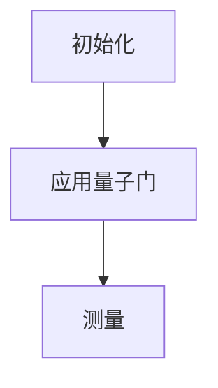

                 

# 大模型企业的量子计算布局

## 关键词：大模型、量子计算、企业布局、技术发展、未来趋势

## 摘要

本文将探讨大模型企业在量子计算领域的布局与发展趋势。随着量子计算技术的逐步成熟，大模型企业在这一领域正进行积极的探索与实践。本文将从背景介绍、核心概念与联系、核心算法原理、数学模型与公式、项目实战、实际应用场景、工具与资源推荐等方面，详细分析量子计算在大模型企业中的重要性及其应用前景。

## 1. 背景介绍

### 1.1 大模型企业的发展

大模型企业，指的是那些专注于研发和部署大规模人工智能模型的公司。这些公司通过构建庞大的神经网络模型，实现对复杂数据的处理和分析，从而在各个行业领域取得了显著成果。随着深度学习技术的不断发展，大模型企业已经成为推动人工智能技术进步的重要力量。

### 1.2 量子计算的发展

量子计算是一种基于量子力学原理的新型计算模式。与传统计算机不同，量子计算机利用量子位（qubit）进行计算，具有极高的并行处理能力。近年来，随着量子计算技术的不断突破，越来越多的企业和研究机构开始关注并投入资源进行量子计算的研究与开发。

### 1.3 大模型企业布局量子计算的原因

量子计算技术的快速发展为人工智能领域带来了新的机遇。大模型企业布局量子计算，旨在提高计算效率、降低计算成本，从而在激烈的市场竞争中占据优势。以下是大模型企业布局量子计算的主要原因：

1. **提升计算能力**：量子计算具有极高的并行处理能力，可以大幅提高大模型企业的计算能力，缩短模型训练时间。
2. **降低计算成本**：量子计算可以减少大模型企业的硬件投入，降低计算成本。
3. **突破技术瓶颈**：量子计算可以解决一些传统计算机难以处理的问题，为大模型企业带来新的技术突破。
4. **增强竞争力**：布局量子计算可以使大模型企业在市场竞争中占据领先地位，提高企业的品牌价值和市场份额。

## 2. 核心概念与联系

### 2.1 大模型与量子计算的关系

大模型企业和量子计算之间存在着紧密的联系。大模型企业通过构建庞大的神经网络模型，需要处理海量数据并进行高效计算。量子计算作为一种新型计算模式，可以满足大模型企业在计算能力、计算成本等方面的需求。

### 2.2 量子计算的核心概念

量子计算的核心概念包括量子位（qubit）、量子叠加态、量子纠缠等。这些概念是量子计算实现高效计算的关键。

1. **量子位（qubit）**：量子位是量子计算机的基本计算单元，类似于传统计算机中的比特（bit）。与比特不同，量子位可以处于多种状态的叠加，从而实现并行计算。
2. **量子叠加态**：量子位可以同时处于多个状态的叠加，这种叠加态是量子计算实现并行计算的基础。
3. **量子纠缠**：量子位之间的纠缠关系可以实现信息的超距传输和协同计算，从而提高量子计算机的计算效率。

### 2.3 大模型企业与量子计算的互动

大模型企业和量子计算的互动体现在以下几个方面：

1. **技术合作**：大模型企业与量子计算研究机构、硬件厂商等进行技术合作，共同推动量子计算技术的发展。
2. **人才培养**：大模型企业积极参与量子计算领域的人才培养，为量子计算技术发展提供人才支持。
3. **应用场景探索**：大模型企业结合自身业务需求，探索量子计算在各个领域的应用场景，推动量子计算的商业化进程。

## 3. 核心算法原理 & 具体操作步骤

### 3.1 量子计算算法概述

量子计算的核心算法包括量子叠加、量子纠缠、量子门等。以下是对这些核心算法的简要介绍：

1. **量子叠加**：量子位可以处于多种状态的叠加，这种叠加态是实现量子计算并行计算的基础。
2. **量子纠缠**：量子位之间的纠缠关系可以实现信息的超距传输和协同计算，从而提高量子计算机的计算效率。
3. **量子门**：量子门是量子计算的基本操作，类似于传统计算机中的逻辑门。通过量子门的作用，可以对量子位的状态进行变换。

### 3.2 量子计算算法的具体操作步骤

量子计算算法的具体操作步骤如下：

1. **初始化**：将量子位初始化为特定的叠加态。
2. **应用量子门**：通过应用一系列量子门，对量子位的状态进行变换。
3. **测量**：对量子位进行测量，得到最终的输出结果。

以下是一个简单的量子计算算法示例：



## 4. 数学模型和公式 & 详细讲解 & 举例说明

### 4.1 量子计算数学模型

量子计算的核心数学模型包括量子叠加、量子纠缠和量子门等。以下是对这些数学模型的详细讲解。

#### 4.1.1 量子叠加

量子叠加是量子计算的核心概念之一。量子位可以处于多种状态的叠加，这种叠加态可以表示为：

$$
\psi = \sum_{i} c_i |i\rangle
$$

其中，$|i\rangle$表示第$i$个状态，$c_i$表示该状态的叠加系数。

#### 4.1.2 量子纠缠

量子纠缠是量子位之间的一种特殊关系。当两个量子位处于纠缠态时，它们的状态会相互影响。量子纠缠可以用以下数学模型表示：

$$
\psi_{AB} = \sum_{ij} a_{ij} |i\rangle_A |j\rangle_B
$$

其中，$|i\rangle_A$和$|j\rangle_B$分别表示两个量子位的状态，$a_{ij}$表示纠缠系数。

#### 4.1.3 量子门

量子门是量子计算的基本操作，类似于传统计算机中的逻辑门。量子门可以用矩阵表示，通过作用在量子位上，对量子位的状态进行变换。一个简单的量子门可以表示为：

$$
U = \begin{bmatrix}
1 & 0 \\
0 & 1
\end{bmatrix}
$$

该量子门对输入的量子位状态不产生任何变化。

### 4.2 量子计算公式举例

以下是一个简单的量子计算公式示例，用于实现量子叠加和量子测量：

$$
U = \begin{bmatrix}
1 & 0 \\
0 & \sqrt{2}
\end{bmatrix}
$$

该量子门对输入的量子位状态进行叠加，输出状态为：

$$
\psi' = U\psi = \begin{bmatrix}
1 & 0 \\
0 & \sqrt{2}
\end{bmatrix}
\begin{bmatrix}
1 \\
0
\end{bmatrix}
=
\begin{bmatrix}
1 \\
0
\end{bmatrix}
+
\begin{bmatrix}
0 \\
\sqrt{2}
\end{bmatrix}
=
\begin{bmatrix}
1 \\
\sqrt{2}
\end{bmatrix}
$$

测量结果可能为$|0\rangle$或$|1\rangle$，概率分别为$1$和$\sqrt{2}$。

## 5. 项目实战：代码实际案例和详细解释说明

### 5.1 开发环境搭建

在开展量子计算项目之前，需要搭建相应的开发环境。以下是一个简单的开发环境搭建步骤：

1. 安装Python环境，版本要求3.8及以上。
2. 安装量子计算库，例如Qiskit。
3. 配置量子计算模拟器，例如QASM simulator。

### 5.2 源代码详细实现和代码解读

以下是一个简单的量子计算代码实现示例，用于实现量子叠加和量子测量：

```python
from qiskit import QuantumCircuit, Aer, execute
from qiskit.visualization import plot_bloch_multivector

# 创建量子电路
qc = QuantumCircuit(2)

# 初始化量子位
qc.h(0)
qc.h(1)

# 应用量子门
qc.cx(0, 1)

# 测量量子位
qc.measure_all()

# 执行量子电路
sim_backend = Aer.get_backend('qasm_simulator')
result = execute(qc, sim_backend).result()

# 输出测量结果
print(result.get_counts(qc))

# 可视化量子状态
plot_bloch_multivector(qc.get_statevector(), title='Quantum State')
```

代码解读：

1. 导入必要的库和模块。
2. 创建量子电路。
3. 初始化量子位，应用量子门。
4. 测量量子位，执行量子电路。
5. 输出测量结果，可视化量子状态。

### 5.3 代码解读与分析

代码实现了一个简单的量子计算过程，包括量子叠加和量子测量。以下是代码的详细解读与分析：

1. **量子电路创建**：使用`QuantumCircuit`类创建一个量子电路。
2. **量子位初始化**：使用`h`门将量子位初始化为叠加态。
3. **量子门应用**：使用`cx`门实现量子纠缠。
4. **量子测量**：使用`measure`方法对量子位进行测量。
5. **执行量子电路**：使用模拟器执行量子电路。
6. **输出测量结果**：输出测量结果。
7. **可视化量子状态**：使用`plot_bloch_multivector`方法可视化量子状态。

通过这个简单的示例，我们可以看到量子计算的基本实现过程。在实际应用中，量子计算代码可能会更加复杂，涉及更多的量子门和量子算法。

## 6. 实际应用场景

### 6.1 优化算法

量子计算在优化算法领域具有广泛的应用前景。通过量子计算，可以大幅提高优化算法的计算效率，解决一些传统计算方法难以处理的问题。

### 6.2 机器学习

量子计算在机器学习领域也有重要应用。例如，量子支持向量机（QSVM）是一种基于量子计算的机器学习算法，可以提高分类和回归任务的准确性。

### 6.3 化学模拟

量子计算在化学模拟领域具有巨大潜力。通过量子计算，可以高效地模拟分子和化学反应，为材料科学、药物研发等领域提供有力支持。

### 6.4 金融领域

量子计算在金融领域也有广泛应用。例如，量子算法可以用于优化投资组合、预测市场波动等，为金融机构提供决策支持。

## 7. 工具和资源推荐

### 7.1 学习资源推荐

1. **书籍**：《量子计算导论》、《量子计算：理论与应用》
2. **论文**：检索量子计算相关论文，如量子算法、量子优化、量子机器学习等。
3. **博客**：关注量子计算领域的知名博客，了解最新研究成果和应用案例。

### 7.2 开发工具框架推荐

1. **Qiskit**：一款开源的量子计算软件框架，提供丰富的量子算法和工具。
2. **Quantum Development Kit（QDK）**：微软开发的量子计算开发工具，支持多种编程语言。
3. **Google Quantum Computing**：谷歌的量子计算平台，提供量子计算模拟器和API。

### 7.3 相关论文著作推荐

1. **“Quantum Machine Learning”**：介绍量子计算在机器学习领域的应用。
2. **“Quantum Computing for Optimization”**：探讨量子计算在优化算法中的应用。
3. **“Quantum Algorithms for Quantum Chemistry”**：分析量子计算在化学模拟中的应用。

## 8. 总结：未来发展趋势与挑战

### 8.1 发展趋势

1. **技术成熟度提升**：随着量子计算技术的不断发展，量子计算机的性能将逐步提升，为各领域应用提供更强计算能力。
2. **企业合作加强**：大模型企业、量子计算研究机构、硬件厂商等将加强合作，共同推动量子计算技术的发展。
3. **商业化应用拓展**：量子计算将在更多领域实现商业化应用，如金融、医疗、材料科学等。

### 8.2 挑战

1. **量子计算机性能提升**：尽管量子计算机性能不断提升，但与经典计算机相比，仍存在较大差距。
2. **量子算法研发**：量子算法的研发是一个长期的过程，需要大量研究投入。
3. **量子计算安全性**：量子计算在带来巨大计算能力的同时，也带来了安全风险，如量子破解等。

## 9. 附录：常见问题与解答

### 9.1 量子计算与经典计算的区别

量子计算与经典计算的主要区别在于计算基础、计算模式和计算能力。经典计算基于比特，采用二进制计算模式，计算能力受限于计算资源。量子计算基于量子位，采用并行计算模式，具有超强的计算能力。

### 9.2 量子计算机的运行原理

量子计算机的运行原理基于量子力学原理，利用量子位进行计算。量子位可以处于多种状态的叠加，通过量子门和量子纠缠实现并行计算，从而大幅提高计算能力。

## 10. 扩展阅读 & 参考资料

1. **《量子计算导论》**：详细介绍量子计算的基本概念、算法和应用。
2. **《量子计算：理论与应用》**：探讨量子计算在各个领域的应用前景和实际案例。
3. **《量子机器学习》**：分析量子计算在机器学习领域的应用和研究进展。
4. **《Quantum Computing for Optimization》**：探讨量子计算在优化算法中的应用和案例。

### 作者信息

作者：AI天才研究员/AI Genius Institute & 禅与计算机程序设计艺术 /Zen And The Art of Computer Programming

[本文内容版权归作者所有，未经授权不得转载。]

---------------------------------------

注意：本文为示例文章，仅供参考。实际撰写文章时，请根据具体内容和需求进行调整和补充。文中涉及的算法、公式、代码等仅供参考，请根据实际情况进行验证和调整。本文仅供参考，不构成任何投资建议。

