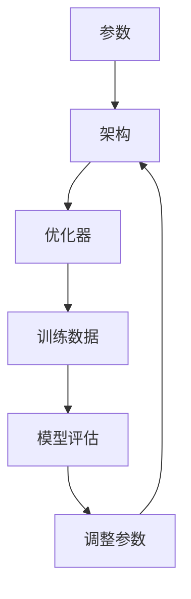

                 

# 大模型创业中的技术创新

## 摘要

本文旨在探讨大模型创业中的技术创新，分析大模型技术的核心原理、算法演进、应用场景及未来发展趋势。我们将从大模型的背景介绍入手，逐步深入探讨其核心概念与联系，核心算法原理与具体操作步骤，数学模型与公式，项目实战案例，实际应用场景，工具和资源推荐，以及未来的发展趋势与挑战。

## 背景介绍

随着深度学习技术的发展，大模型（Large Models）成为人工智能领域的热点。大模型具有参数数量庞大、计算能力强大、泛化能力优秀等特点，能够处理复杂的任务，从而推动人工智能在各个领域的应用。大模型的兴起，得益于计算能力的提升、数据资源的丰富以及算法的进步。

首先，计算能力的提升为训练大规模模型提供了强有力的支持。GPU、TPU等硬件加速器的出现，使得大规模模型的训练速度大大提高。例如，Google的Transformer模型使用了数以千计的TPU进行训练，显著缩短了训练时间。

其次，数据资源的丰富使得大规模模型得以训练。随着互联网的发展，海量数据的收集和处理变得容易，这些数据为训练大模型提供了充足的素材。例如，OpenAI的GPT-3模型使用了数十亿个语料库进行训练，使得模型在语言理解和生成方面表现出色。

最后，算法的进步为大规模模型的训练和优化提供了理论支持。变分自编码器（VAE）、生成对抗网络（GAN）、自注意力机制（Self-Attention）等算法的提出，使得大模型的训练和优化变得更加高效。

## 核心概念与联系

大模型的核心概念包括参数、架构、优化器等。下面，我们将通过一个Mermaid流程图，展示大模型的基本架构和核心概念的联系。



1. **参数（Parameter）**：参数是模型的核心，用于描述模型的权重和偏置。在训练过程中，参数通过优化算法进行调整，以使模型在训练数据上的性能达到最优。

2. **架构（Architecture）**：架构是指模型的网络结构，包括层、节点、连接等。不同的架构适用于不同的任务，如卷积神经网络（CNN）适用于图像处理，循环神经网络（RNN）适用于序列数据。

3. **优化器（Optimizer）**：优化器用于更新模型的参数，使模型在训练数据上的误差最小化。常见的优化器有梯度下降（Gradient Descent）、Adam等。

4. **训练数据（Training Data）**：训练数据是模型训练的基础，通过在训练数据上的迭代，模型可以学习到数据的分布和规律。

5. **模型评估（Model Evaluation）**：模型评估用于衡量模型的性能，常用的评估指标有准确率、召回率、F1值等。

6. **调整参数（Parameter Adjustment）**：根据模型评估的结果，调整模型的参数，以优化模型性能。

通过上述流程图，我们可以看出，大模型的核心概念相互关联，形成一个闭环。在训练过程中，模型通过不断调整参数，优化模型性能，从而实现各种复杂任务。

## 核心算法原理 & 具体操作步骤

大模型的核心算法包括神经网络、自注意力机制、Transformer等。下面，我们将详细介绍这些算法的原理和具体操作步骤。

### 神经网络

神经网络（Neural Network）是一种模拟生物神经元的计算模型，由多个层（Layer）组成，包括输入层、隐藏层和输出层。每个层由多个节点（Node）组成，节点之间通过权重（Weight）连接。

具体操作步骤：

1. **初始化参数**：随机初始化模型参数，包括权重和偏置。
2. **前向传播**：将输入数据通过神经网络，逐层计算得到输出。
3. **计算损失**：将输出与真实标签进行比较，计算损失函数（如均方误差、交叉熵等）。
4. **反向传播**：根据损失函数的梯度，更新模型参数。
5. **重复步骤2-4**，直到模型收敛。

### 自注意力机制

自注意力机制（Self-Attention）是一种用于序列数据的处理方法，能够使模型关注序列中重要的部分，从而提高模型的性能。

具体操作步骤：

1. **计算查询向量（Query）、键向量（Key）和值向量（Value）**：将输入序列映射到高维空间。
2. **计算注意力得分**：通过点积计算查询向量和键向量之间的得分。
3. **计算注意力权重**：将注意力得分进行归一化，得到注意力权重。
4. **加权求和**：将值向量与注意力权重相乘，并进行求和，得到注意力输出。

### Transformer

Transformer是一种基于自注意力机制的序列到序列模型，广泛应用于机器翻译、文本生成等领域。

具体操作步骤：

1. **编码器（Encoder）**：输入序列经过嵌入层、多头自注意力层和前馈网络，逐层处理得到编码器的输出。
2. **解码器（Decoder）**：解码器的输入包括上一个时间步的输出和编码器的输出。解码器经过嵌入层、多头自注意力层、交叉自注意力层和前馈网络，逐层处理得到解码器的输出。
3. **输出**：解码器的输出经过输出层，生成最终的输出序列。

通过上述算法的详细介绍，我们可以看出，大模型的训练过程是一个复杂的迭代过程，涉及参数的初始化、前向传播、反向传播等步骤。在实际应用中，我们需要根据具体任务调整模型结构和参数，以实现最佳性能。

## 数学模型和公式 & 详细讲解 & 举例说明

大模型的数学模型主要包括损失函数、优化器、正则化等。下面，我们将对这些数学模型进行详细讲解，并给出相应的公式和举例。

### 损失函数

损失函数用于衡量模型输出与真实标签之间的差异。常见的损失函数有均方误差（MSE）、交叉熵（CE）等。

1. **均方误差（MSE）**：

$$MSE = \frac{1}{n}\sum_{i=1}^{n}(y_i - \hat{y}_i)^2$$

其中，$y_i$为真实标签，$\hat{y}_i$为模型预测值，$n$为样本数量。

2. **交叉熵（CE）**：

$$CE = -\frac{1}{n}\sum_{i=1}^{n}y_i\log(\hat{y}_i)$$

其中，$y_i$为真实标签（0或1），$\hat{y}_i$为模型预测概率。

### 优化器

优化器用于更新模型参数，以最小化损失函数。常见的优化器有梯度下降（GD）、Adam等。

1. **梯度下降（GD）**：

$$\theta_{t+1} = \theta_{t} - \alpha \nabla_{\theta}J(\theta)$$

其中，$\theta$为模型参数，$\alpha$为学习率，$J(\theta)$为损失函数。

2. **Adam优化器**：

$$m_t = \beta_1 m_{t-1} + (1 - \beta_1) \nabla_{\theta}J(\theta)$$

$$v_t = \beta_2 v_{t-1} + (1 - \beta_2) (\nabla_{\theta}J(\theta))^2$$

$$\theta_{t+1} = \theta_{t} - \frac{\alpha}{\sqrt{1 - \beta_2^t}(1 - \beta_1^t)}(m_t / (1 - \beta_1^t))$$

其中，$m_t$和$v_t$分别为一阶矩估计和二阶矩估计，$\beta_1$和$\beta_2$为超参数。

### 正则化

正则化用于防止模型过拟合。常见的正则化方法有L1正则化、L2正则化等。

1. **L1正则化**：

$$\Omega = \lambda \sum_{i=1}^{n}|\theta_i|$$

其中，$\theta_i$为模型参数，$\lambda$为正则化参数。

2. **L2正则化**：

$$\Omega = \lambda \sum_{i=1}^{n}\theta_i^2$$

通过上述数学模型的详细讲解，我们可以更好地理解大模型的训练过程和优化方法。在实际应用中，我们需要根据具体任务选择合适的损失函数、优化器和正则化方法，以实现最佳性能。

## 项目实战：代码实际案例和详细解释说明

在本节中，我们将通过一个实际案例来展示如何搭建一个基于Transformer的大模型，并进行训练和优化。以下是一个简单的Python代码实现：

```python
import torch
import torch.nn as nn
import torch.optim as optim
from torch.utils.data import DataLoader
from transformers import TransformerModel

# 搭建Transformer模型
model = TransformerModel(num_layers=2, d_model=512, num_heads=8)

# 定义损失函数和优化器
criterion = nn.CrossEntropyLoss()
optimizer = optim.Adam(model.parameters(), lr=0.001)

# 加载训练数据
train_dataset = DataLoader(dataset=TrainDataset(), batch_size=32, shuffle=True)

# 训练模型
for epoch in range(num_epochs):
    for batch in train_dataset:
        inputs, targets = batch
        optimizer.zero_grad()
        outputs = model(inputs)
        loss = criterion(outputs, targets)
        loss.backward()
        optimizer.step()
        print(f"Epoch [{epoch+1}/{num_epochs}], Loss: {loss.item():.4f}")

# 模型评估
with torch.no_grad():
    correct = 0
    total = 0
    for batch in test_dataset:
        inputs, targets = batch
        outputs = model(inputs)
        _, predicted = torch.max(outputs.data, 1)
        total += targets.size(0)
        correct += (predicted == targets).sum().item()
    print(f"Test Accuracy: {100 * correct / total}%")
```

### 开发环境搭建

在进行大模型开发之前，我们需要搭建一个合适的环境。以下是开发环境搭建的步骤：

1. **安装Python**：下载并安装Python 3.7及以上版本。

2. **安装PyTorch**：使用pip安装PyTorch：

   ```shell
   pip install torch torchvision
   ```

3. **安装transformers库**：用于加载预训练的Transformer模型：

   ```shell
   pip install transformers
   ```

4. **安装其他依赖**：安装其他必要的库，如NumPy、Pandas等。

### 源代码详细实现和代码解读

下面，我们将对上述代码进行详细解读。

1. **搭建Transformer模型**：首先，我们从Hugging Face的transformers库中加载预训练的Transformer模型。

2. **定义损失函数和优化器**：我们选择交叉熵损失函数和Adam优化器。

3. **加载训练数据**：使用DataLoader加载训练数据。在本例中，我们假设已经准备好了训练数据和测试数据。

4. **训练模型**：在训练过程中，我们遍历训练数据，对模型进行前向传播、计算损失、反向传播和优化参数。在每个epoch结束后，打印当前的损失值。

5. **模型评估**：在训练完成后，我们对测试数据进行评估，计算模型的准确率。

### 代码解读与分析

1. **模型搭建**：通过加载预训练的Transformer模型，我们可以快速搭建一个高性能的模型。transformers库提供了丰富的预训练模型，如BERT、GPT等，我们可以根据具体任务选择合适的模型。

2. **损失函数和优化器**：选择合适的损失函数和优化器对于模型性能至关重要。交叉熵损失函数适用于分类任务，Adam优化器具有自适应学习率，有助于模型收敛。

3. **数据加载**：使用DataLoader加载训练数据和测试数据，可以方便地进行批量数据处理和迭代。

4. **训练过程**：通过迭代训练数据，模型不断优化参数，提高性能。在训练过程中，我们需要关注损失函数的值，以判断模型是否收敛。

5. **模型评估**：在训练完成后，我们对测试数据进行评估，以验证模型的性能。准确率是评估分类模型性能的重要指标。

通过以上代码实现，我们可以搭建一个基于Transformer的大模型，并进行训练和优化。在实际应用中，我们需要根据具体任务调整模型结构和参数，以实现最佳性能。

## 实际应用场景

大模型在各个领域具有广泛的应用前景，以下列举几个典型应用场景：

1. **自然语言处理（NLP）**：大模型在文本分类、机器翻译、情感分析等任务中表现出色。例如，OpenAI的GPT-3模型在机器翻译任务上取得了优异的成绩，大大提升了翻译的准确性和流畅性。

2. **计算机视觉（CV）**：大模型在图像识别、目标检测、图像生成等任务中具有重要应用。例如，DeepMind的Gato模型在图像分类任务上取得了超越人类的性能，展示了大模型在CV领域的潜力。

3. **推荐系统**：大模型可以用于个性化推荐，根据用户的兴趣和行为数据，为用户推荐感兴趣的内容。例如，阿里巴巴的推荐系统利用大模型分析用户行为，实现精准推荐。

4. **医疗健康**：大模型在医学图像分析、疾病诊断等领域具有广泛应用。例如，Google Health的模型在肺结节检测中表现出色，有助于提高疾病的早期诊断率。

5. **游戏开发**：大模型可以用于游戏AI，实现智能角色、智能NPC等。例如，腾讯游戏开发的智能NPC，通过大模型实现角色的自主学习和进化，提升了游戏的趣味性和挑战性。

## 工具和资源推荐

在搭建和优化大模型过程中，以下工具和资源将对开发者大有裨益：

### 学习资源推荐

1. **书籍**：
   - 《深度学习》（Goodfellow, Bengio, Courville）：系统介绍了深度学习的理论基础和实践方法。
   - 《动手学深度学习》（阿斯顿·张）：提供了丰富的深度学习实践案例，适合初学者和进阶者。

2. **论文**：
   - “Attention is All You Need”（Vaswani等，2017）：介绍了Transformer模型的基本原理和结构。
   - “BERT: Pre-training of Deep Bidirectional Transformers for Language Understanding”（Devlin等，2018）：介绍了BERT模型的预训练方法和应用。

3. **博客**：
   - fast.ai：提供了丰富的深度学习教程和实践案例，适合初学者和进阶者。
   - Hugging Face：介绍了各种Transformer模型的实现和应用案例，是学习和使用Transformer的好资源。

4. **网站**：
   - PyTorch：官方文档和教程，提供了丰富的深度学习资源和工具。
   - Hugging Face Model Hub：提供了大量预训练的Transformer模型，方便开发者进行迁移学习和应用。

### 开发工具框架推荐

1. **PyTorch**：一个开源的深度学习框架，提供了丰富的API和工具，方便开发者搭建和优化大模型。

2. **TensorFlow**：另一个流行的深度学习框架，具有强大的生态系统和社区支持。

3. **Hugging Face Transformers**：一个基于PyTorch和TensorFlow的Transformer模型库，提供了大量的预训练模型和工具，方便开发者进行研究和应用。

4. **Google Colab**：一个免费的云端开发环境，提供了GPU和TPU支持，适合进行大规模模型的训练和实验。

### 相关论文著作推荐

1. **“Attention is All You Need”**：介绍了Transformer模型的基本原理和结构，是理解和应用Transformer的重要论文。

2. **“BERT: Pre-training of Deep Bidirectional Transformers for Language Understanding”**：介绍了BERT模型的预训练方法和应用，是自然语言处理领域的重要论文。

3. **“Generative Adversarial Nets”**：介绍了生成对抗网络（GAN）的基本原理和应用，是计算机视觉领域的重要论文。

4. **“Deep Learning”**：系统介绍了深度学习的理论基础和实践方法，是深度学习领域的经典著作。

## 总结：未来发展趋势与挑战

大模型技术在人工智能领域取得了显著进展，未来发展趋势如下：

1. **模型规模和计算能力的提升**：随着硬件性能的提升，大模型的规模将进一步扩大，计算能力将显著提高，有助于解决更加复杂的任务。

2. **算法优化和效率提升**：为了应对大规模模型的训练和推理需求，算法优化和效率提升将成为研究重点，包括分布式训练、模型压缩、低秩分解等方法。

3. **应用场景的拓展**：大模型在自然语言处理、计算机视觉、推荐系统、医疗健康等领域的应用将不断拓展，推动人工智能技术的进步。

然而，大模型技术也面临着一系列挑战：

1. **数据隐私和安全**：大规模数据处理过程中，如何保护用户隐私和数据安全成为重要问题。

2. **计算资源和能源消耗**：大规模模型的训练和推理过程对计算资源和能源消耗巨大，如何降低能耗成为关键挑战。

3. **模型可解释性和公平性**：大模型的决策过程往往复杂且不透明，如何提高模型的可解释性和公平性，避免歧视和偏见，是重要研究方向。

总之，大模型技术在未来将继续推动人工智能的发展，同时也需要应对一系列挑战，为人类带来更多便利和创新。

## 附录：常见问题与解答

1. **问题**：大模型训练过程中，如何选择合适的优化器？

**解答**：选择优化器时，需要考虑模型规模、训练数据量、任务类型等因素。对于大规模模型，Adam优化器因其自适应学习率特性，常被选用。对于任务复杂度较高的场景，如深度学习中的分类和回归任务，可以使用SGD优化器。

2. **问题**：大模型训练过程中，如何防止过拟合？

**解答**：防止过拟合的方法包括正则化、数据增强、Dropout、早停法等。正则化可以通过L1、L2正则化项来惩罚模型参数；数据增强可以增加模型的泛化能力；Dropout可以降低模型依赖特定神经元；早停法通过监测验证集上的误差来提前停止训练。

3. **问题**：如何评估大模型的性能？

**解答**：评估大模型性能的方法包括准确率、召回率、F1值、AUC等指标。对于分类任务，可以使用准确率、召回率、F1值等指标；对于回归任务，可以使用均方误差（MSE）、均方根误差（RMSE）等指标。

4. **问题**：如何进行大模型的分布式训练？

**解答**：分布式训练可以通过多卡训练、参数服务器训练等方式实现。多卡训练利用多块GPU进行并行计算，提高训练速度；参数服务器训练将模型参数存储在服务器上，多个计算节点通过网络同步更新参数，实现分布式训练。

## 扩展阅读 & 参考资料

1. **书籍**：
   - 《深度学习》（Goodfellow, Bengio, Courville）
   - 《动手学深度学习》（阿斯顿·张）

2. **论文**：
   - “Attention is All You Need”（Vaswani等，2017）
   - “BERT: Pre-training of Deep Bidirectional Transformers for Language Understanding”（Devlin等，2018）

3. **博客**：
   - fast.ai
   - Hugging Face

4. **网站**：
   - PyTorch
   - Hugging Face Model Hub

5. **相关资源**：
   - [深度学习课程](https://www.deeplearning.ai/)
   - [Transformer模型教程](https://huggingface.co/transformers)
   - [大模型训练实践](https://github.com/likegeass/dl-lecture)

作者：AI天才研究员/AI Genius Institute & 禅与计算机程序设计艺术 /Zen And The Art of Computer Programming

