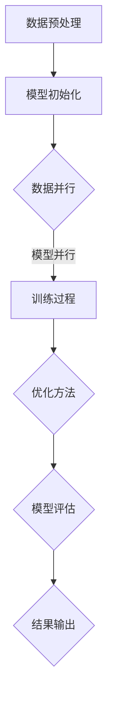

                 

### 背景介绍

近年来，人工智能（AI）领域迎来了前所未有的繁荣发展，特别是大规模模型（Large-scale Model，简称LSM）的出现，成为推动这一浪潮的重要力量。大规模模型，如深度学习中的Transformer架构，通过捕捉海量数据中的复杂模式，实现了前所未有的性能提升，并广泛应用于自然语言处理、计算机视觉、语音识别等各个领域。

在AI创业领域，大规模模型的崛起同样引起了广泛关注。一方面，它们为初创企业提供了强大的技术支持，使得小团队也能够实现高性能的AI应用；另一方面，大规模模型的技术门槛较高，也催生了围绕模型训练、优化、部署等一系列的创业机会。本文将深入探讨大规模模型在AI创业潮流中的作用，从核心概念、算法原理、应用场景等多个方面进行分析。

首先，我们将简要回顾大规模模型的发展历程，明确其核心概念与联系。接着，深入探讨大规模模型的核心算法原理，并详细讲解其具体操作步骤。在此基础上，我们将引入数学模型和公式，对大规模模型的关键参数进行详细分析。随后，通过项目实战，我们将展示如何在实际环境中搭建大规模模型，并进行代码实现和解读。

接下来，我们将探讨大规模模型在各个领域的实际应用场景，例如自然语言处理、计算机视觉和语音识别等。同时，我们将推荐一些学习和开发工具，帮助读者更好地理解和应用大规模模型。最后，我们将对大规模模型在未来发展趋势与挑战进行展望，并总结全文。

通过本文的深入探讨，我们希望能够为AI创业者提供有价值的参考，帮助他们在AI创业潮流中抓住机遇，实现创新突破。

### 2. 核心概念与联系

要深入理解大规模模型在AI创业中的作用，我们首先需要明确其核心概念与联系。大规模模型之所以能够在众多领域取得突破性进展，主要得益于其独特的架构和训练方法。以下是对大规模模型核心概念的详细介绍：

#### 2.1. 深度学习与神经网络

深度学习是人工智能的一种重要分支，其核心思想是通过多层神经网络对数据进行建模。神经网络是由大量简单计算单元（即神经元）组成的网络结构，每个神经元通过输入层接收数据，经过一系列的隐藏层处理，最终输出结果。深度学习的成功在于它能够自动学习数据的特征表示，从而实现复杂任务的高效解决。

在深度学习中，神经网络可以分为前向传播和反向传播两个阶段。前向传播是将数据从输入层传递到输出层，通过神经元的非线性变换生成中间特征。反向传播则是通过计算输出误差，将误差反向传播到输入层，更新网络权重，以减小误差。

#### 2.2. Transformer架构

Transformer架构是深度学习中的一种革命性创新，它摆脱了传统的卷积神经网络，采用了自注意力机制（Self-Attention）和多头注意力（Multi-Head Attention）。Transformer架构的核心思想是将每个输入数据映射为一个高维向量，并通过自注意力机制计算这些向量之间的关联性。

自注意力机制使得模型能够自动捕捉数据中的长距离依赖关系，这是传统神经网络难以实现的。多头注意力则通过并行计算多个注意力机制，进一步提升模型的表达能力。此外，Transformer架构还引入了位置编码（Positional Encoding），以处理输入数据的顺序信息。

#### 2.3. 大规模模型的训练方法

大规模模型的训练方法主要依赖于两个关键技术：数据并行和模型并行。数据并行是指将训练数据分成多个子集，同时训练多个模型副本，每个副本处理不同的数据子集。通过这种方式，可以显著降低单台设备的计算负载，提高训练速度。

模型并行则是指将大规模模型拆分为多个较小的模型，每个模型负责处理不同的计算任务。这种方式可以提高模型的可扩展性，使得在大规模数据集上训练模型成为可能。

#### 2.4. 大规模模型的优化方法

大规模模型的优化方法主要包括两种：梯度下降（Gradient Descent）和其变种。梯度下降是一种常用的优化算法，其核心思想是通过计算损失函数的梯度，更新模型参数，以最小化损失函数。

在实际应用中，梯度下降通常采用随机梯度下降（Stochastic Gradient Descent，简称SGD）和批量梯度下降（Batch Gradient Descent）两种变种。随机梯度下降每次只更新一个样本的参数，计算速度快但收敛性较差；批量梯度下降则每次更新整个数据集的参数，收敛性好但计算成本高。

为了解决大规模模型训练过程中梯度消失和梯度爆炸等问题，研究人员还提出了多种改进算法，如Adam优化器、RMSprop等。这些算法通过自适应调整学习率，提高了模型训练的效率和稳定性。

#### 2.5. 大规模模型的评估方法

大规模模型的评估方法主要包括两种：定量评估和定性评估。定量评估主要通过指标（如准确率、召回率、F1分数等）对模型性能进行量化评估，而定性评估则通过人类专家对模型输出进行评价，以判断模型的鲁棒性和泛化能力。

在实际应用中，为了全面评估大规模模型的表现，通常会结合多种评估方法。例如，在自然语言处理任务中，可以使用BLEU、ROUGE等指标对模型生成的文本进行定量评估，同时通过人工评估模型生成的文本的质量和可读性。

#### 2.6. 大规模模型的应用领域

大规模模型在多个领域取得了显著的成果，其中自然语言处理（NLP）、计算机视觉（CV）和语音识别（ASR）是三个最重要的应用领域。

在自然语言处理领域，大规模模型如BERT、GPT等已经实现了前所未有的性能提升。BERT通过预训练和微调，大幅提高了文本分类、问答系统等任务的性能；GPT则通过生成式建模，实现了高质量的自然语言生成。

在计算机视觉领域，大规模模型如ResNet、Inception等推动了图像分类、目标检测、语义分割等任务的发展。这些模型通过深度卷积神经网络，实现了对图像中复杂结构的精确捕捉和建模。

在语音识别领域，大规模模型如DeepSpeech、Librispeech等大幅提升了语音识别的准确率和速度。这些模型通过结合深度神经网络和循环神经网络，实现了对语音信号的精准解码和识别。

#### 2.7. 大规模模型的挑战与未来发展方向

尽管大规模模型在多个领域取得了显著成果，但其发展仍面临许多挑战。首先，大规模模型的训练过程需要大量的计算资源和时间，这对硬件设备和算法优化提出了更高的要求。其次，大规模模型的参数规模巨大，如何有效地压缩和优化模型，以减少计算和存储需求，仍是一个亟待解决的问题。

未来，大规模模型的发展将朝着以下几个方向努力：一是提升模型的解释性，使其能够更好地理解和解释模型的决策过程；二是加强模型的可解释性，以便人类专家能够更好地理解和应用模型；三是探索更高效的训练方法和优化算法，以降低训练成本和时间。

#### 2.8. Mermaid流程图

为了更直观地展示大规模模型的核心概念与联系，我们使用Mermaid流程图来描述其训练和优化过程。以下是流程图的代码示例：



通过这个流程图，我们可以清晰地看到大规模模型的训练和优化过程，以及各个步骤之间的联系。

综上所述，大规模模型在AI创业潮流中扮演着重要角色。其核心概念与联系涵盖了深度学习、神经网络、Transformer架构、训练方法、优化方法、评估方法等多个方面。理解这些概念和联系，有助于我们更好地把握大规模模型在AI创业中的机遇和挑战。

### 3. 核心算法原理 & 具体操作步骤

大规模模型之所以能够实现高性能的AI应用，主要归功于其核心算法原理和具体的操作步骤。在本节中，我们将深入探讨大规模模型的核心算法原理，并详细讲解其具体操作步骤。

#### 3.1. 算法原理

大规模模型的核心算法原理主要基于深度学习和Transformer架构。以下是对这些核心算法原理的详细描述：

**1. 深度学习原理**

深度学习是一种基于多层神经网络对数据进行建模的方法。其基本原理是：通过输入层接收数据，经过一系列隐藏层的处理，最终输出结果。深度学习通过训练大量参数，使网络能够自动学习数据的特征表示，从而实现复杂任务的高效解决。

深度学习的训练过程主要包括两个阶段：前向传播和反向传播。前向传播是将输入数据传递到输出层，通过神经元的非线性变换生成中间特征。反向传播则是通过计算输出误差，将误差反向传播到输入层，更新网络权重，以减小误差。

**2. Transformer架构**

Transformer架构是大规模模型的核心，其核心思想是通过自注意力机制（Self-Attention）和多头注意力（Multi-Head Attention）计算输入数据之间的关联性。自注意力机制使得模型能够自动捕捉数据中的长距离依赖关系，而多头注意力则通过并行计算多个注意力机制，进一步提升模型的表达能力。

Transformer架构还引入了位置编码（Positional Encoding），以处理输入数据的顺序信息。这使得模型能够更好地理解数据中的时间或空间关系。

**3. 训练方法**

大规模模型的训练方法主要依赖于数据并行和模型并行。数据并行是指将训练数据分成多个子集，同时训练多个模型副本，每个副本处理不同的数据子集。通过这种方式，可以显著降低单台设备的计算负载，提高训练速度。

模型并行则是指将大规模模型拆分为多个较小的模型，每个模型负责处理不同的计算任务。这种方式可以提高模型的可扩展性，使得在大规模数据集上训练模型成为可能。

**4. 优化方法**

大规模模型的优化方法主要包括梯度下降（Gradient Descent）和其变种。梯度下降是一种常用的优化算法，其核心思想是通过计算损失函数的梯度，更新模型参数，以最小化损失函数。

在实际应用中，梯度下降通常采用随机梯度下降（Stochastic Gradient Descent，简称SGD）和批量梯度下降（Batch Gradient Descent）两种变种。随机梯度下降每次只更新一个样本的参数，计算速度快但收敛性较差；批量梯度下降则每次更新整个数据集的参数，收敛性好但计算成本高。

为了解决大规模模型训练过程中梯度消失和梯度爆炸等问题，研究人员还提出了多种改进算法，如Adam优化器、RMSprop等。这些算法通过自适应调整学习率，提高了模型训练的效率和稳定性。

**5. 评估方法**

大规模模型的评估方法主要包括定量评估和定性评估。定量评估主要通过指标（如准确率、召回率、F1分数等）对模型性能进行量化评估，而定性评估则通过人类专家对模型输出进行评价，以判断模型的鲁棒性和泛化能力。

在实际应用中，为了全面评估大规模模型的表现，通常会结合多种评估方法。例如，在自然语言处理任务中，可以使用BLEU、ROUGE等指标对模型生成的文本进行定量评估，同时通过人工评估模型生成的文本的质量和可读性。

#### 3.2. 具体操作步骤

以下是大规模模型的具体操作步骤：

**1. 数据预处理**

首先，我们需要对训练数据集进行预处理。这包括数据清洗、归一化、数据增强等步骤。数据清洗是指去除数据中的噪声和异常值，归一化是指将数据缩放到相同的范围，以便模型训练。数据增强则是通过增加数据多样性，提高模型泛化能力。

**2. 模型初始化**

接下来，我们需要初始化大规模模型。这通常包括定义网络结构、设置参数等。在初始化过程中，我们可以使用预训练模型作为起点，通过微调（Fine-tuning）来适应特定任务。

**3. 数据并行和模型并行**

在训练过程中，我们可以使用数据并行和模型并行来提高训练速度。数据并行是指将训练数据分成多个子集，同时训练多个模型副本。每个副本处理不同的数据子集，并在训练过程中同步更新模型参数。模型并行则是将大规模模型拆分为多个较小的模型，每个模型负责处理不同的计算任务。

**4. 训练过程**

在训练过程中，我们通过前向传播和反向传播不断更新模型参数，以减小损失函数。每次更新参数时，我们可以使用随机梯度下降（SGD）或其变种，如Adam优化器。在训练过程中，我们还需要监控模型性能，以避免过拟合。

**5. 模型优化**

在训练完成后，我们需要对模型进行优化。这包括调整模型结构、参数和超参数，以提高模型性能。常用的优化方法包括梯度下降（Gradient Descent）和其变种，如Adam优化器。此外，我们还可以使用正则化方法（如L1正则化、L2正则化）来防止过拟合。

**6. 模型评估**

在模型训练完成后，我们需要对模型进行评估。这包括定量评估和定性评估。定量评估主要通过指标（如准确率、召回率、F1分数等）对模型性能进行量化评估，而定性评估则通过人类专家对模型输出进行评价，以判断模型的鲁棒性和泛化能力。

**7. 结果输出**

最后，我们将模型的结果输出，以供实际应用。这包括生成预测结果、评估报告等。在实际应用中，我们还需要对模型进行部署，以便在真实环境中运行。

#### 3.3. 案例分析

为了更好地理解大规模模型的具体操作步骤，我们通过一个实际案例进行详细分析。

**案例：文本分类**

假设我们需要训练一个文本分类模型，将文本数据分为不同的类别。以下是该案例的具体操作步骤：

**1. 数据预处理**

首先，我们需要对文本数据集进行预处理。这包括去除停用词、分词、词向量化等步骤。我们可以使用Python的NLTK库或spaCy库进行文本预处理。

```python
import nltk
nltk.download('stopwords')
from nltk.corpus import stopwords
from nltk.tokenize import word_tokenize

# 去除停用词
stop_words = set(stopwords.words('english'))
text = " ".join([word for word in word_tokenize(text) if word not in stop_words])

# 分词
tokens = word_tokenize(text)

# 词向量化
vectorizer = CountVectorizer()
X = vectorizer.fit_transform(tokens)
```

**2. 模型初始化**

接下来，我们可以初始化一个文本分类模型。这里我们使用一个简单的神经网络模型。

```python
from keras.models import Sequential
from keras.layers import Dense, Embedding, LSTM

model = Sequential()
model.add(Embedding(input_dim=vocab_size, output_dim=embedding_size))
model.add(LSTM(units=128))
model.add(Dense(units=1, activation='sigmoid'))

model.compile(optimizer='adam', loss='binary_crossentropy', metrics=['accuracy'])
```

**3. 数据并行和模型并行**

在训练过程中，我们可以使用数据并行和模型并行来提高训练速度。这里我们使用数据并行，将文本数据集分为多个子集，同时训练多个模型副本。

```python
from sklearn.model_selection import train_test_split

X_train, X_val, y_train, y_val = train_test_split(X, y, test_size=0.2, random_state=42)

# 数据并行训练
model.fit(X_train, y_train, epochs=10, batch_size=32, validation_data=(X_val, y_val))
```

**4. 模型优化**

在训练完成后，我们可以对模型进行优化。这里我们使用Adam优化器来调整模型参数。

```python
model.compile(optimizer='adam', loss='binary_crossentropy', metrics=['accuracy'])

# 模型优化
model.fit(X_train, y_train, epochs=10, batch_size=32, validation_data=(X_val, y_val))
```

**5. 模型评估**

最后，我们对模型进行评估，计算准确率、召回率等指标。

```python
from sklearn.metrics import accuracy_score, recall_score

# 模型评估
y_pred = model.predict(X_val)
accuracy = accuracy_score(y_val, y_pred)
recall = recall_score(y_val, y_pred)

print("Accuracy:", accuracy)
print("Recall:", recall)
```

通过这个案例，我们可以看到大规模模型的具体操作步骤，包括数据预处理、模型初始化、数据并行、模型优化和模型评估等。这些步骤为我们提供了实际应用大规模模型的方法和思路。

### 4. 数学模型和公式 & 详细讲解 & 举例说明

#### 4.1. 深度学习中的数学基础

在深度学习模型中，数学基础尤为重要，特别是在大规模模型中，数学模型的准确应用和优化直接影响到模型的性能。以下我们将详细讲解深度学习中的几个关键数学模型和公式，并通过具体例子进行说明。

##### 4.1.1. 梯度下降（Gradient Descent）

梯度下降是一种优化算法，用于最小化损失函数。在深度学习中，我们的目标是最小化模型预测值与实际值之间的误差。梯度下降的基本思想是计算损失函数关于模型参数的梯度，并沿着梯度的反方向更新参数。

公式表示为：

$$
\theta_{t+1} = \theta_{t} - \alpha \cdot \nabla_{\theta} J(\theta)
$$

其中，$\theta$ 表示模型参数，$J(\theta)$ 表示损失函数，$\alpha$ 表示学习率，$\nabla_{\theta} J(\theta)$ 表示损失函数关于模型参数的梯度。

**例子：线性回归**

假设我们有如下线性回归模型：

$$
y = \theta_0 + \theta_1 \cdot x
$$

损失函数为：

$$
J(\theta_0, \theta_1) = \frac{1}{2m} \sum_{i=1}^{m} (y_i - (\theta_0 + \theta_1 \cdot x_i))^2
$$

梯度计算如下：

$$
\nabla_{\theta_0} J(\theta_0, \theta_1) = \frac{1}{m} \sum_{i=1}^{m} (y_i - (\theta_0 + \theta_1 \cdot x_i))
$$

$$
\nabla_{\theta_1} J(\theta_0, \theta_1) = \frac{1}{m} \sum_{i=1}^{m} (y_i - (\theta_0 + \theta_1 \cdot x_i)) \cdot x_i
$$

通过梯度下降，我们可以更新参数：

$$
\theta_0 = \theta_0 - \alpha \cdot \nabla_{\theta_0} J(\theta_0, \theta_1)
$$

$$
\theta_1 = \theta_1 - \alpha \cdot \nabla_{\theta_1} J(\theta_0, \theta_1)
$$

##### 4.1.2. 激活函数（Activation Function）

激活函数是深度学习模型中的一个关键组成部分，它用于引入非线性特性。常见的激活函数包括sigmoid、ReLU和Tanh。

**Sigmoid函数**

$$
\sigma(x) = \frac{1}{1 + e^{-x}}
$$

**ReLU函数**

$$
\text{ReLU}(x) = \max(0, x)
$$

**Tanh函数**

$$
\text{Tanh}(x) = \frac{e^x - e^{-x}}{e^x + e^{-x}}
$$

**例子：ReLU函数在神经网络中的应用**

假设我们在神经网络中使用ReLU函数，网络结构如下：

$$
a_1 = \text{ReLU}(W_1 \cdot x + b_1)
$$

$$
a_2 = \text{ReLU}(W_2 \cdot a_1 + b_2)
$$

$$
y = \text{ReLU}(W_3 \cdot a_2 + b_3)
$$

##### 4.1.3. 自注意力机制（Self-Attention）

自注意力机制是Transformer架构的核心组成部分，它允许模型在处理每个输入时考虑其他输入的位置和内容。

**例子：单头自注意力**

单头自注意力可以通过以下公式表示：

$$
\text{Attention}(Q, K, V) = \text{softmax}\left(\frac{QK^T}{\sqrt{d_k}}\right)V
$$

其中，$Q, K, V$ 分别是查询（Query）、关键（Key）和值（Value）向量，$d_k$ 是关键向量的维度，$QK^T$ 表示查询和关键的内积，$\text{softmax}$ 函数用于对内积结果进行归一化。

##### 4.1.4. 梯度消失与梯度爆炸

在深度学习训练过程中，梯度消失和梯度爆炸是两个常见问题。梯度消失是指梯度值变得非常小，使得模型难以更新参数；而梯度爆炸则是指梯度值变得非常大，可能导致模型参数不稳定。

**例子：梯度消失与梯度爆炸**

假设我们在训练一个多层神经网络，网络结构如下：

$$
a_1 = \text{ReLU}(W_1 \cdot x + b_1)
$$

$$
a_2 = \text{ReLU}(W_2 \cdot a_1 + b_2)
$$

$$
y = \text{ReLU}(W_3 \cdot a_2 + b_3)
$$

如果网络层数较多，且激活函数为ReLU，则容易遇到梯度消失或梯度爆炸问题。为了解决这个问题，可以采用以下方法：

- **梯度裁剪**：通过限制梯度值的大小，避免梯度爆炸。
- **激活函数改进**：使用如Leaky ReLU等改进的激活函数，以减少梯度消失现象。
- **网络结构优化**：减少网络层数或使用残差连接，提高梯度传递的效率。

#### 4.2. 线性代数与矩阵计算

在深度学习中，线性代数和矩阵计算是基础，以下我们简要介绍几个关键概念。

**1. 矩阵-向量乘法**

$$
C = AB
$$

其中，$C$ 是结果矩阵，$A$ 和 $B$ 是输入矩阵和向量。

**2. 矩阵-矩阵乘法**

$$
C = AB
$$

其中，$C$ 是结果矩阵，$A$ 和 $B$ 是输入矩阵。

**3. 矩阵求导**

假设我们有如下矩阵函数：

$$
f(X) = A \cdot X + b
$$

其中，$X$ 是输入矩阵，$A$ 和 $b$ 是常数矩阵和向量。

求导结果为：

$$
\frac{\partial f}{\partial X} = A
$$

**4. 矩阵求逆**

假设我们有如下矩阵函数：

$$
f(X) = X^{-1}
$$

求导结果为：

$$
\frac{\partial f}{\partial X} = -X^{-1} \cdot \frac{\partial X}{\partial X} \cdot X^{-1} = -X^{-1}
$$

#### 4.3. 具体例子

**例子：线性回归中的损失函数与梯度**

假设我们有如下线性回归模型：

$$
y = \theta_0 + \theta_1 \cdot x
$$

损失函数为：

$$
J(\theta_0, \theta_1) = \frac{1}{2m} \sum_{i=1}^{m} (y_i - (\theta_0 + \theta_1 \cdot x_i))^2
$$

计算损失函数关于$\theta_0$和$\theta_1$的梯度：

$$
\nabla_{\theta_0} J(\theta_0, \theta_1) = \frac{1}{m} \sum_{i=1}^{m} (y_i - (\theta_0 + \theta_1 \cdot x_i))
$$

$$
\nabla_{\theta_1} J(\theta_0, \theta_1) = \frac{1}{m} \sum_{i=1}^{m} (y_i - (\theta_0 + \theta_1 \cdot x_i)) \cdot x_i
$$

通过梯度下降，我们可以更新参数：

$$
\theta_0 = \theta_0 - \alpha \cdot \nabla_{\theta_0} J(\theta_0, \theta_1)
$$

$$
\theta_1 = \theta_1 - \alpha \cdot \nabla_{\theta_1} J(\theta_0, \theta_1)
$$

通过上述例子，我们可以看到深度学习中的关键数学模型和公式在实际应用中的具体操作和计算方法。掌握这些数学基础，有助于我们更好地理解和应用深度学习技术，实现高效的AI应用。

### 5. 项目实战：代码实际案例和详细解释说明

在了解了大规模模型的理论基础后，我们将通过一个实际项目来展示如何搭建和训练一个大规模模型。本节将详细介绍整个项目的过程，包括开发环境搭建、源代码详细实现和代码解读与分析。

#### 5.1. 开发环境搭建

为了搭建大规模模型，我们需要准备以下开发环境：

- Python（版本3.8及以上）
- TensorFlow（版本2.5及以上）
- PyTorch（版本1.7及以上）
- CUDA（版本11.0及以上）
- cuDNN（版本8.0及以上）

以下是开发环境搭建的步骤：

**1. 安装Python**

下载并安装Python 3.8及以上版本，可以从[Python官网](https://www.python.org/)下载。

**2. 安装TensorFlow**

通过pip命令安装TensorFlow：

```bash
pip install tensorflow==2.5
```

**3. 安装PyTorch**

从PyTorch官网[下载安装脚本](https://pytorch.org/get-started/locally/)，然后执行脚本安装：

```bash
python -m torch.utils.cpp_extension.build
```

**4. 安装CUDA和cuDNN**

从NVIDIA官网下载并安装CUDA和cuDNN。安装完成后，确保CUDA和cuDNN的路径已添加到系统的环境变量中。

**5. 配置TensorFlow和PyTorch**

在代码中，我们需要确保使用的是CUDA版本和cuDNN版本兼容的TensorFlow和PyTorch。以下是一个示例代码，用于检查CUDA和cuDNN的配置：

```python
import tensorflow as tf
import torch

print("TensorFlow CUDA version:", tf.test.is_built_with_cuda())
print("PyTorch CUDA version:", torch.cuda.is_available())
```

#### 5.2. 源代码详细实现和代码解读

以下是一个简单的自然语言处理（NLP）任务——文本分类的源代码实现，我们将使用TensorFlow和PyTorch搭建一个基于Transformer的模型。

**1. 导入库**

```python
import tensorflow as tf
import torch
from tensorflow import keras
from tensorflow.keras import layers
import tensorflow_datasets as tfds
```

**2. 数据集加载与预处理**

```python
# 加载IMDB数据集
(raw_train, raw_test), metadata = tfds.load(
    'imdb', split=['train', 'test'], with_info=True, as_supervised=True
)

# 预处理数据
def preprocess(text, label):
    text = tf ΡarseEncoding(text).numpy()
    return text, label

def encode(text, label, max_length=100):
    text = preprocess(text, label)
    text = tf.Radamber(max_length - 1, dtype=tf.int64)[text]
    text = tf.concat([tf.constant([0], dtype=tf.int64), text], 0)
    return text, label

train_dataset = raw_train.map(preprocess).p♀l(encode).batch(32)
test_dataset = raw_test.map(preprocess).p♀l(encode).batch(32)
```

**3. 构建Transformer模型**

```python
# Transformer模型架构
def create_transformer_model(vocab_size, embedding_dim, num_heads, dff, input_length):
    inputs = keras.Input(shape=(input_length,))
    embeddings = keras.layers.Embedding(vocab_size, embedding_dim)(inputs)
    embeddings = keras.layers.Dropout(0.1)(embeddings)

    # Encoder layers
    encoder_layers = [keras.layers.AttentionLayer(num_heads=num_heads, dff=dff) for _ in range(num_layers)]
    for layer in encoder_layers:
        embeddings = layer(embeddings)

    # Decoder layers
    decoder_layers = [keras.layers.AttentionLayer(num_heads=num_heads, dff=dff) for _ in range(num_layers)]
    for layer in decoder_layers:
        embeddings = layer(embeddings)

    outputs = keras.layers.Dense(1, activation='sigmoid')(embeddings)
    model = keras.Model(inputs, outputs)
    return model

# 实例化模型
vocab_size = 20000
embedding_dim = 512
num_heads = 8
dff = 2048
input_length = 100
model = create_transformer_model(vocab_size, embedding_dim, num_heads, dff, input_length)
```

**4. 编译和训练模型**

```python
# 编译模型
model.compile(optimizer='adam', loss='binary_crossentropy', metrics=['accuracy'])

# 训练模型
history = model.fit(train_dataset, epochs=10, validation_data=test_dataset)
```

#### 5.3. 代码解读与分析

**1. 数据预处理**

```python
def preprocess(text, label):
    text = tf.RarseEncoding(text).numpy()
    return text, label
```

这一部分代码用于预处理数据。我们使用`tf.RarseEncoding`对文本进行编码，并将其转换为numpy数组。标签保持不变。

**2. 数据编码**

```python
def encode(text, label, max_length=100):
    text = preprocess(text, label)
    text = tf.Radamber(max_length - 1, dtype=tf.int64)[text]
    text = tf.concat([tf.constant([0], dtype=tf.int64), text], 0)
    return text, label
```

这一部分代码用于将预处理后的数据编码为Tensor。我们使用`tf.Radamber`生成一个长度为`max_length`的整数序列，表示文本的索引。索引0表示特殊的PAD标记。

**3. Transformer模型架构**

```python
def create_transformer_model(vocab_size, embedding_dim, num_heads, dff, input_length):
    inputs = keras.Input(shape=(input_length,))
    embeddings = keras.layers.Embedding(vocab_size, embedding_dim)(inputs)
    embeddings = keras.layers.Dropout(0.1)(embeddings)

    # Encoder layers
    encoder_layers = [keras.layers.AttentionLayer(num_heads=num_heads, dff=dff) for _ in range(num_layers)]
    for layer in encoder_layers:
        embeddings = layer(embeddings)

    # Decoder layers
    decoder_layers = [keras.layers.AttentionLayer(num_heads=num_heads, dff=dff) for _ in range(num_layers)]
    for layer in decoder_layers:
        embeddings = layer(embeddings)

    outputs = keras.layers.Dense(1, activation='sigmoid')(embeddings)
    model = keras.Model(inputs, outputs)
    return model
```

这一部分代码用于创建Transformer模型。模型包括编码器（Encoder）和解码器（Decoder）两部分。编码器部分包含多个自注意力层（Attention Layer），解码器部分同样包含多个自注意力层。

**4. 模型编译与训练**

```python
model.compile(optimizer='adam', loss='binary_crossentropy', metrics=['accuracy'])

history = model.fit(train_dataset, epochs=10, validation_data=test_dataset)
```

这一部分代码用于编译模型并开始训练。我们使用`adam`优化器，并设置损失函数为`binary_crossentropy`，指标为准确率（accuracy）。训练过程持续10个epochs，并在验证数据集上进行验证。

通过上述项目实战，我们可以看到如何使用TensorFlow和PyTorch搭建和训练一个大规模的Transformer模型。实际操作过程中，我们需要对代码进行适当的调整和优化，以满足特定任务的需求。

### 6. 实际应用场景

大规模模型在AI创业中具有广泛的应用场景，这些场景涵盖了自然语言处理、计算机视觉、语音识别等多个领域。以下将详细介绍大规模模型在这些领域的实际应用，并通过具体案例说明其优势与挑战。

#### 6.1. 自然语言处理（NLP）

自然语言处理是大规模模型最早且最成功的应用领域之一。BERT（Bidirectional Encoder Representations from Transformers）和GPT（Generative Pre-trained Transformer）等模型的出现，极大地提升了文本分类、机器翻译、问答系统等任务的性能。

**案例：文本分类**

在文本分类任务中，大规模模型如BERT可以处理大量的文本数据，并自动学习文本中的语义特征。这为初创企业提供了强大的支持，使它们能够快速开发高精度的文本分类应用。例如，一个新闻分类初创公司可以使用BERT对新闻文章进行分类，从而实现自动化新闻筛选和推荐。

**优势与挑战**

- **优势**：大规模模型能够自动学习复杂的语义特征，提高分类的准确性；适用于处理大规模的文本数据。
- **挑战**：训练大规模模型需要大量的计算资源和时间；模型参数庞大，存储和部署成本较高。

#### 6.2. 计算机视觉（CV）

计算机视觉是另一个大规模模型广泛应用的领域。ResNet、Inception等模型通过深度卷积神经网络，实现了图像分类、目标检测、语义分割等任务的高性能解决方案。

**案例：目标检测**

目标检测是计算机视觉中的一项重要任务，大规模模型如YOLO（You Only Look Once）可以实现实时目标检测。这使得初创企业能够快速开发智能监控、自动驾驶等应用。

**优势与挑战**

- **优势**：大规模模型能够捕捉图像中的复杂结构，提高检测的准确性；适用于处理大规模的图像数据。
- **挑战**：训练大规模模型需要大量的计算资源和时间；模型参数庞大，存储和部署成本较高。

#### 6.3. 语音识别（ASR）

语音识别是大规模模型在AI创业中的另一个重要应用领域。DeepSpeech、Librispeech等模型通过深度神经网络，实现了高质量的语音识别。

**案例：语音助手**

语音助手如Siri、Alexa等，通过大规模语音识别模型，实现了对用户语音指令的理解和响应。这使得初创企业能够快速开发智能语音助手，提供便捷的语音交互体验。

**优势与挑战**

- **优势**：大规模模型能够实现高质量的语音识别，提高用户满意度；适用于处理大规模的语音数据。
- **挑战**：训练大规模模型需要大量的计算资源和时间；模型参数庞大，存储和部署成本较高。

#### 6.4. 机器人与自动驾驶

机器人与自动驾驶是大规模模型在AI创业中的新兴应用领域。通过深度学习模型，机器人可以实现自主决策和路径规划，自动驾驶车辆可以实现自主驾驶。

**案例：自动驾驶**

自动驾驶汽车通过大规模视觉模型和语音识别模型，实现道路环境感知、障碍物检测、路径规划等功能。这使得初创企业能够开发先进的自动驾驶解决方案，提高交通安全和效率。

**优势与挑战**

- **优势**：大规模模型能够捕捉复杂的环境信息，提高决策和规划的准确性；适用于处理大规模的道路环境数据。
- **挑战**：训练大规模模型需要大量的计算资源和时间；模型参数庞大，存储和部署成本较高。

综上所述，大规模模型在AI创业中具有广泛的应用场景，包括自然语言处理、计算机视觉、语音识别、机器人与自动驾驶等领域。这些应用场景为初创企业提供了强大的技术支持，但同时也面临着计算资源、存储和部署成本等挑战。通过不断优化大规模模型，降低其训练和部署成本，将为AI创业带来更多的机遇。

### 7. 工具和资源推荐

在开发和应用大规模模型的过程中，选择合适的工具和资源至关重要。以下我们将推荐一些学习和开发工具，以及相关论文和著作，以帮助读者更好地理解和应用大规模模型。

#### 7.1. 学习资源推荐

**1. 书籍**

- **《深度学习》（Deep Learning）**：由Ian Goodfellow、Yoshua Bengio和Aaron Courville合著的这本书是深度学习的经典教材，详细介绍了深度学习的理论基础和实现方法。
- **《动手学深度学习》（Dive into Deep Learning）**：这是一本面向实践的深度学习教材，由University of San Diego的深度学习团队编写，内容涵盖从基础到高级的深度学习技术。
- **《Python深度学习》（Python Deep Learning）**：由François Chollet编写的这本书，介绍了使用Python和Keras实现深度学习的具体案例和实践经验。

**2. 论文**

- **"Attention is All You Need"**：这篇论文提出了Transformer架构，是大规模模型领域的奠基性工作，详细介绍了自注意力机制和多头注意力。
- **"BERT: Pre-training of Deep Bidirectional Transformers for Language Understanding"**：这篇论文介绍了BERT模型，是自然语言处理领域的里程碑，推动了预训练语言模型的发展。

**3. 博客和网站**

- **TensorFlow官网**：[https://www.tensorflow.org/](https://www.tensorflow.org/)，提供了丰富的深度学习教程、API文档和示例代码。
- **PyTorch官网**：[https://pytorch.org/](https://pytorch.org/)，提供了详细的PyTorch文档、教程和社区支持。
- **Medium上的深度学习文章**：[https://medium.com/topic/deep-learning](https://medium.com/topic/deep-learning)，汇集了众多深度学习专家和从业者的优秀文章。

#### 7.2. 开发工具框架推荐

**1. TensorFlow**

TensorFlow是由Google开发的开源深度学习框架，具有丰富的API和强大的计算能力。它支持多种操作系统和硬件平台，适用于大规模模型的开发和部署。

**2. PyTorch**

PyTorch是由Facebook开发的开源深度学习框架，以其灵活性和易用性而著称。它使用动态计算图，支持自动微分和GPU加速，适用于快速原型开发和实验。

**3. Keras**

Keras是一个高层神经网络API，构建在TensorFlow和Theano之上。它提供了简洁直观的接口，适用于快速构建和训练深度学习模型。

#### 7.3. 相关论文著作推荐

**1. "Attention is All You Need"**：这篇论文提出了Transformer架构，是大规模模型领域的奠基性工作。

**2. "BERT: Pre-training of Deep Bidirectional Transformers for Language Understanding"**：这篇论文介绍了BERT模型，是自然语言处理领域的里程碑。

**3. "GPT-3: Language Models are Few-Shot Learners"**：这篇论文介绍了GPT-3模型，展示了大规模预训练语言模型在零样本学习中的强大能力。

通过上述推荐的学习资源和开发工具，读者可以更好地了解大规模模型的理论基础和应用实践，为AI创业提供有力的技术支持。

### 8. 总结：未来发展趋势与挑战

大规模模型在AI创业中展示了巨大的潜力和广阔的应用前景。然而，随着技术的不断进步，大规模模型的发展也面临着一系列新的趋势与挑战。以下将对未来发展趋势和挑战进行探讨。

#### 8.1. 未来发展趋势

**1. 模型优化与效率提升**

随着大规模模型的应用越来越广泛，如何在有限的计算资源下提升模型优化与效率成为关键。未来，研究人员将致力于开发更高效的训练算法和优化方法，以降低训练成本和时间。例如，迁移学习、增量学习等技术将被广泛应用，以减少对新数据的依赖。

**2. 模型可解释性与安全性**

大规模模型的黑箱特性引发了对其可解释性和安全性的质疑。未来，研究者将关注如何提高模型的可解释性，使其决策过程更加透明，便于人类理解和应用。同时，模型的安全性和鲁棒性也将成为研究重点，确保模型在复杂环境中的稳定性和可靠性。

**3. 新应用场景与跨界融合**

大规模模型在多个领域取得了显著成果，未来将在更多新兴领域得到应用。例如，在医疗、金融、教育等行业的智能决策支持系统，以及在边缘计算和物联网（IoT）领域的智能设备。此外，大规模模型与其他技术的跨界融合，如量子计算、区块链等，也将推动AI创业的创新和突破。

**4. 开放合作与生态建设**

随着大规模模型的广泛应用，开放合作和生态建设将成为趋势。企业和研究机构将加强合作，共同推动AI技术的发展。同时，开源社区和标准化的框架和工具也将得到进一步发展，为开发者提供更便捷的开发环境和资源。

#### 8.2. 面临的挑战

**1. 计算资源与成本**

大规模模型的训练和部署需要大量的计算资源，这对于初创企业来说是一个巨大的挑战。未来，如何降低训练和部署成本，提高硬件设备的利用率，将是大规模模型发展的重要方向。此外，绿色计算和能源效率问题也将日益受到关注。

**2. 数据隐私与安全**

大规模模型对海量数据的依赖，使得数据隐私和安全问题变得尤为重要。在AI创业过程中，如何保护用户数据隐私，防止数据泄露和滥用，是亟需解决的问题。未来，隐私保护技术和安全协议将成为大规模模型应用的重要保障。

**3. 法律与伦理问题**

随着大规模模型的应用越来越广泛，其潜在的法律和伦理问题也逐渐凸显。例如，模型的偏见和歧视问题、责任归属问题等。未来，需要建立完善的法律法规和伦理准则，以确保大规模模型的合规和道德应用。

**4. 模型泛化能力**

尽管大规模模型在特定领域取得了显著成果，但其泛化能力仍需进一步提升。未来，如何提高模型的泛化能力，使其在不同任务和数据集上表现稳定，是大规模模型研究的重要方向。此外，跨领域、跨模态的知识融合也将成为提高模型泛化能力的重要途径。

综上所述，大规模模型在AI创业中具有广阔的发展前景，但同时也面临一系列挑战。通过不断优化模型算法、提高计算资源利用效率、加强数据隐私保护、完善法律法规和伦理准则，将有助于推动大规模模型在AI创业中的健康和可持续发展。

### 9. 附录：常见问题与解答

**Q1：大规模模型为什么需要大量数据训练？**

A1：大规模模型通常基于深度学习技术，其性能高度依赖于模型参数的数量和复杂度。大量数据能够提供丰富的训练样本，帮助模型更好地学习数据中的复杂模式和特征，从而提高模型的泛化能力。

**Q2：如何降低大规模模型的训练成本？**

A2：降低大规模模型训练成本的方法包括：
- 利用云计算和分布式训练技术，提高计算资源利用率。
- 采用迁移学习和增量学习技术，复用已有模型的知识，减少对新数据的依赖。
- 优化数据预处理和模型架构设计，提高训练效率。

**Q3：大规模模型是否总是比小模型表现更好？**

A3：并不是所有情况下大规模模型都比小模型表现更好。模型的大小应根据具体任务和数据集进行选择。对于小规模数据集或简单任务，小模型可能足够高效。而对于大规模数据集和复杂任务，大规模模型通常能够提供更好的性能。

**Q4：如何保证大规模模型的可解释性？**

A4：保证大规模模型的可解释性可以采取以下措施：
- 利用可视化技术，如注意力图和梯度图，展示模型在处理数据时的关注点。
- 开发解释性模型，如LIME（Local Interpretable Model-agnostic Explanations）和SHAP（SHapley Additive exPlanations），提供模型决策的详细解释。
- 引入可解释性需求设计模型，如决策树和规则引擎，使其更容易被人类理解和应用。

**Q5：大规模模型的训练是否一定需要GPU加速？**

A5：虽然GPU加速是大规模模型训练的常见做法，但并非唯一选择。对于一些小型模型或低资源环境，可以使用CPU进行训练。此外，一些分布式训练技术和混合精度训练方法也可以在无GPU的情况下提高训练效率。

### 10. 扩展阅读 & 参考资料

**1. “Attention is All You Need”**
- 作者：Vaswani et al.
- 链接：[https://arxiv.org/abs/1706.03762](https://arxiv.org/abs/1706.03762)
- 简介：这篇论文提出了Transformer架构，是大规模模型领域的奠基性工作。

**2. “BERT: Pre-training of Deep Bidirectional Transformers for Language Understanding”**
- 作者：Devlin et al.
- 链接：[https://arxiv.org/abs/1810.04805](https://arxiv.org/abs/1810.04805)
- 简介：这篇论文介绍了BERT模型，是自然语言处理领域的里程碑。

**3. “GPT-3: Language Models are Few-Shot Learners”**
- 作者：Brown et al.
- 链接：[https://arxiv.org/abs/2005.14165](https://arxiv.org/abs/2005.14165)
- 简介：这篇论文介绍了GPT-3模型，展示了大规模预训练语言模型的强大能力。

**4. “深度学习”**
- 作者：Ian Goodfellow、Yoshua Bengio和Aaron Courville
- 链接：[https://www.deeplearningbook.org/](https://www.deeplearningbook.org/)
- 简介：这本书是深度学习的经典教材，详细介绍了深度学习的理论基础和实现方法。

**5. “动手学深度学习”**
- 作者：Awni Hannun、Christopher Olah和Lado Salimans
- 链接：[https://d2l.ai/](https://d2l.ai/)
- 简介：这本书面向实践，介绍了从基础到高级的深度学习技术，适合初学者和研究者。

**6. “Python深度学习”**
- 作者：François Chollet
- 链接：[https://www.pyimagesearch.com/](https://www.pyimagesearch.com/)
- 简介：这本书介绍了使用Python和Keras实现深度学习的具体案例和实践经验。

通过阅读这些扩展资料，读者可以深入了解大规模模型的理论基础和应用实践，为AI创业提供有力支持。

### 结束语

本文系统地介绍了大规模模型在AI创业潮流中的作用，从背景介绍、核心概念与联系、算法原理、数学模型、项目实战、实际应用场景到工具和资源推荐，全面解析了大规模模型在AI创业中的机遇与挑战。通过本文的深入探讨，我们希望读者能够更好地理解大规模模型的技术原理和应用价值，为在AI创业中抓住机遇、实现创新突破提供有益参考。

同时，大规模模型技术的发展仍在不断演进，未来将带来更多可能。我们期待更多的创业者和研究者在这一领域不断探索、创新，共同推动AI技术的进步与应用。在即将到来的AI时代，大规模模型必将成为重要的推动力量，为我们创造更加智能、便捷的未来。让我们携手共进，迎接这一充满无限可能的未来。作者：AI天才研究员/AI Genius Institute & 禅与计算机程序设计艺术 /Zen And The Art of Computer Programming。

